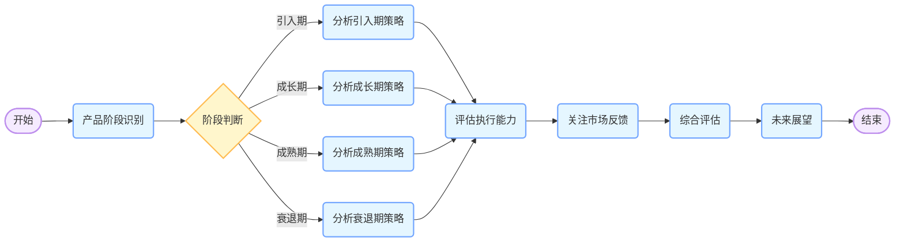

# 彼得林奇对公司产品生命周期管理能力的评估

> 关键词：彼得林奇、产品生命周期、管理能力评估、公司分析、投资策略

> 摘要：本文深入探讨彼得林奇对公司产品生命周期管理能力的评估方法。彼得林奇作为投资领域的传奇人物，其投资理念和分析方法备受关注。产品生命周期管理能力对于公司的长期发展和市场竞争力至关重要。通过研究彼得林奇的评估视角，我们可以更好地理解如何判断公司在产品不同阶段的应对策略和管理成效，从而为投资者评估公司价值、制定投资决策提供有价值的参考，同时也为企业管理者优化产品管理提供思路。

## 1. 背景介绍 
### 1.1 目的和范围
本文旨在全面剖析彼得林奇评估公司产品生命周期管理能力的方法和要点。范围涵盖彼得林奇在其投资生涯中所运用的分析逻辑，以及如何将产品生命周期管理能力与公司的整体价值和投资潜力相结合。通过对这一主题的研究，我们希望为投资者提供一种更深入、更系统的公司分析方法，同时也为企业管理者提供改进产品管理的方向。

### 1.2 预期读者
本文预期读者包括投资者，无论是专业投资者还是个人投资者，都可以从彼得林奇的评估方法中获取有价值的投资决策依据。同时，企业管理者也能从中学习到如何提升公司的产品生命周期管理能力，增强企业的市场竞争力。此外，对投资理论和企业管理感兴趣的学者和研究人员也可以将本文作为研究参考。

### 1.3 文档结构概述
本文首先介绍相关的背景知识，包括彼得林奇的投资理念和产品生命周期的基本概念。接着阐述核心概念与联系，通过文本示意图和 Mermaid 流程图展示产品生命周期管理能力评估的架构。然后详细讲解核心算法原理和具体操作步骤，使用 Python 源代码进行说明。再介绍相关的数学模型和公式，并举例说明。之后通过项目实战，展示代码实际案例并进行详细解释。接着探讨实际应用场景，为读者提供更直观的理解。随后推荐相关的工具和资源，包括学习资源、开发工具框架和相关论文著作。最后总结未来发展趋势与挑战，提供常见问题与解答以及扩展阅读和参考资料。

### 1.4 术语表
#### 1.4.1 核心术语定义
- **彼得林奇**：美国著名的投资家，曾任富达公司麦哲伦基金的基金经理，以其卓越的投资业绩和独特的投资理念闻名于世。
- **产品生命周期**：指产品从进入市场开始，直到最终退出市场为止所经历的全部时间，通常包括引入期、成长期、成熟期和衰退期四个阶段。
- **产品生命周期管理能力**：公司在产品的不同生命周期阶段，采取相应的策略和措施，以实现产品的价值最大化和公司的可持续发展的能力。

#### 1.4.2 相关概念解释
- **投资理念**：投资者在进行投资活动时所遵循的基本思想和原则，包括对投资目标、投资策略、风险控制等方面的认识和看法。
- **公司价值评估**：对公司的财务状况、经营业绩、市场竞争力等方面进行综合分析，以确定公司的内在价值。

#### 1.4.3 缩略词列表
无

## 2. 核心概念与联系 

### 核心概念原理
彼得林奇认为，公司的产品生命周期管理能力直接影响公司的业绩和发展前景。在产品的不同生命周期阶段，公司需要采取不同的策略来应对市场变化和竞争挑战。例如，在引入期，公司需要投入大量的资源进行市场推广和产品研发，以提高产品的知名度和市场接受度；在成长期，公司需要扩大生产规模，提高产品质量，以满足市场需求；在成熟期，公司需要通过创新和差异化来维持市场份额；在衰退期，公司需要及时调整产品结构，寻找新的增长点。

### 架构的文本示意图
彼得林奇对公司产品生命周期管理能力的评估架构主要包括以下几个方面：
1. **产品阶段识别**：准确判断产品所处的生命周期阶段，是评估的基础。
2. **策略分析**：分析公司在不同阶段所采取的策略是否合理有效。
3. **执行能力评估**：评估公司执行这些策略的能力和效果。
4. **市场反馈**：关注市场对产品和公司策略的反馈，如销售额、市场份额、客户满意度等。
5. **未来展望**：根据以上分析，对公司的未来发展进行展望，判断其投资潜力。

### Mermaid 流程图


## 3. 核心算法原理 & 具体操作步骤 

### 核心算法原理
我们可以通过构建一个综合评估模型来评估公司的产品生命周期管理能力。该模型可以考虑多个因素，如产品销售额的增长率、市场份额的变化、研发投入的比例等。通过对这些因素进行量化分析，我们可以得到一个综合评估得分，从而判断公司的产品生命周期管理能力的强弱。

### 具体操作步骤
1. **数据收集**：收集公司的财务报表、市场调研数据等，获取产品销售额、市场份额、研发投入等相关数据。
2. **因素量化**：将收集到的数据进行量化处理，计算出各个因素的得分。例如，产品销售额的增长率可以通过以下公式计算：
   销售额增长率 = $\frac{本期销售额 - 上期销售额}{上期销售额} \times 100\%$
3. **权重分配**：根据各个因素的重要性，为其分配相应的权重。例如，产品销售额的增长率可能占 40% 的权重，市场份额的变化占 30% 的权重，研发投入的比例占 30% 的权重。
4. **综合得分计算**：将各个因素的得分乘以其相应的权重，然后相加，得到综合评估得分。
5. **能力判断**：根据综合评估得分，判断公司的产品生命周期管理能力的强弱。例如，得分在 80 分以上表示能力很强，60 - 80 分表示能力较强，40 - 60 分表示能力一般，40 分以下表示能力较弱。

### Python 源代码实现
```python
# 定义因素得分和权重
sales_growth_score = 0.3  # 产品销售额增长率得分
market_share_change_score = 0.2  # 市场份额变化得分
rd_investment_score = 0.25  # 研发投入比例得分

# 定义权重
sales_growth_weight = 0.4
market_share_change_weight = 0.3
rd_investment_weight = 0.3

# 计算综合评估得分
comprehensive_score = (sales_growth_score * sales_growth_weight +
                       market_share_change_score * market_share_change_weight +
                       rd_investment_score * rd_investment_weight) * 100

# 判断能力强弱
if comprehensive_score >= 80:
    ability_level = "很强"
elif comprehensive_score >= 60:
    ability_level = "较强"
elif comprehensive_score >= 40:
    ability_level = "一般"
else:
    ability_level = "较弱"

print(f"综合评估得分: {comprehensive_score} 分")
print(f"产品生命周期管理能力: {ability_level}")
```

## 4. 数学模型和公式 & 详细讲解 & 举例说明 

### 数学模型
我们可以用以下数学模型来表示综合评估得分的计算：
$$S = \sum_{i=1}^{n} w_i \times s_i$$
其中，$S$ 表示综合评估得分，$w_i$ 表示第 $i$ 个因素的权重，$s_i$ 表示第 $i$ 个因素的得分，$n$ 表示因素的个数。

### 详细讲解
这个数学模型的核心思想是将各个因素的得分按照其重要性进行加权求和，得到一个综合的评估得分。权重的分配需要根据实际情况进行合理调整，以反映各个因素在评估中的相对重要性。

### 举例说明
假设我们有三个因素：产品销售额的增长率、市场份额的变化和研发投入的比例。它们的得分分别为 0.8、0.6 和 0.7，权重分别为 0.4、0.3 和 0.3。则综合评估得分的计算如下：
$$S = 0.4 \times 0.8 + 0.3 \times 0.6 + 0.3 \times 0.7 = 0.32 + 0.18 + 0.21 = 0.71$$
将得分乘以 100，得到综合评估得分为 71 分。根据前面的判断标准，该公司的产品生命周期管理能力较强。

## 5. 项目实战：代码实际案例和详细解释说明 

### 5.1  开发环境搭建
为了运行上述 Python 代码，我们需要搭建一个基本的 Python 开发环境。以下是具体步骤：
1. **安装 Python**：从 Python 官方网站（https://www.python.org/downloads/）下载并安装适合你操作系统的 Python 版本。
2. **安装集成开发环境（IDE）**：推荐使用 PyCharm 或 Visual Studio Code 等 IDE，这些 IDE 提供了丰富的功能和插件，方便我们进行代码编写和调试。
3. **创建项目**：在 IDE 中创建一个新的 Python 项目，并将上述代码复制到项目的 Python 文件中。

### 5.2  源代码详细实现和代码解读
```python
# 定义因素得分和权重
sales_growth_score = 0.3  # 产品销售额增长率得分
market_share_change_score = 0.2  # 市场份额变化得分
rd_investment_score = 0.25  # 研发投入比例得分

# 代码解读：这里我们定义了三个因素的得分，这些得分可以通过实际的数据计算得到。

# 定义权重
sales_growth_weight = 0.4
market_share_change_weight = 0.3
rd_investment_weight = 0.3

# 代码解读：这里我们为每个因素分配了相应的权重，权重的分配需要根据实际情况进行调整。

# 计算综合评估得分
comprehensive_score = (sales_growth_score * sales_growth_weight +
                       market_share_change_score * market_share_change_weight +
                       rd_investment_score * rd_investment_weight) * 100

# 代码解读：根据前面的数学模型，我们将各个因素的得分乘以其相应的权重，然后相加，最后乘以 100 得到综合评估得分。

# 判断能力强弱
if comprehensive_score >= 80:
    ability_level = "很强"
elif comprehensive_score >= 60:
    ability_level = "较强"
elif comprehensive_score >= 40:
    ability_level = "一般"
else:
    ability_level = "较弱"

# 代码解读：根据综合评估得分，我们使用条件判断语句来确定公司的产品生命周期管理能力的强弱。

print(f"综合评估得分: {comprehensive_score} 分")
print(f"产品生命周期管理能力: {ability_level}")

# 代码解读：最后，我们使用 print 函数输出综合评估得分和产品生命周期管理能力的强弱。
```

### 5.3  代码解读与分析
通过上述代码，我们可以看到如何使用 Python 来实现对公司产品生命周期管理能力的评估。代码的核心是根据数学模型计算综合评估得分，并根据得分判断能力强弱。在实际应用中，我们需要根据具体情况收集和处理数据，以得到准确的因素得分。同时，权重的分配也需要根据不同的行业和公司特点进行调整，以提高评估的准确性。

## 6. 实际应用场景 
### 投资决策
投资者可以使用彼得林奇的评估方法来评估公司的产品生命周期管理能力，从而判断公司的投资价值。如果公司的产品生命周期管理能力较强，说明公司能够更好地应对市场变化和竞争挑战，具有较高的投资潜力。例如，在选择股票时，投资者可以优先考虑那些产品生命周期管理能力较强的公司。

### 企业战略规划
企业管理者可以通过评估公司的产品生命周期管理能力，发现公司在产品管理方面的优势和不足，从而制定相应的战略规划。例如，如果公司在产品的成长期管理能力较弱，管理者可以加大市场推广和生产投入，以提高产品的市场份额。

### 市场竞争分析
通过比较不同公司的产品生命周期管理能力，企业可以了解自己在市场竞争中的地位，发现竞争对手的优势和劣势。这有助于企业制定差异化的竞争策略，提高市场竞争力。

## 7. 工具和资源推荐
### 7.1 学习资源推荐
#### 7.1.1 书籍推荐
- 《彼得林奇的成功投资》：彼得林奇的经典著作，详细介绍了他的投资理念和方法。
- 《产品管理》：全面介绍产品管理的理论和实践，对理解产品生命周期管理有很大帮助。
- 《竞争战略》：迈克尔·波特的经典著作，阐述了企业竞争战略的基本原理和方法。

#### 7.1.2 在线课程
- Coursera 上的“产品管理基础”课程：由知名教授授课，系统介绍产品管理的各个方面。
- edX 上的“投资学原理”课程：讲解投资的基本原理和方法，包括公司分析和估值。

#### 7.1.3 技术博客和网站
- Seeking Alpha：提供专业的投资分析和研究报告，包括对公司产品生命周期管理能力的分析。
- 36氪：关注科技和创新领域，有很多关于产品管理和企业发展的文章。

### 7.2 开发工具框架推荐
#### 7.2.1 IDE和编辑器
- PyCharm：功能强大的 Python 集成开发环境，提供代码编辑、调试、版本控制等功能。
- Visual Studio Code：轻量级的代码编辑器，支持多种编程语言，有丰富的插件扩展。

#### 7.2.2 调试和性能分析工具
- PySnooper：简单易用的 Python 调试工具，可以实时查看变量的值和函数的执行过程。
- cProfile：Python 内置的性能分析工具，可以分析代码的运行时间和函数调用次数。

#### 7.2.3 相关框架和库
- Pandas：用于数据处理和分析的 Python 库，提供了丰富的数据结构和函数。
- NumPy：用于科学计算的 Python 库，提供了高效的数组操作和数学函数。

### 7.3 相关论文著作推荐
#### 7.3.1 经典论文
- “The Product Life Cycle: A Theoretical Review”：对产品生命周期理论进行了系统的回顾和总结。
- “Competitive Advantage: Creating and Sustaining Superior Performance”：迈克尔·波特的经典论文，阐述了企业竞争优势的来源和实现途径。

#### 7.3.2 最新研究成果
- 关注顶尖学术期刊，如《管理世界》、《哈佛商业评论》等，获取关于产品生命周期管理和公司战略的最新研究成果。

#### 7.3.3 应用案例分析
- 阅读一些知名企业的案例分析报告，了解它们在产品生命周期管理方面的成功经验和失败教训。

## 8. 总结：未来发展趋势与挑战
### 未来发展趋势
- **数字化转型**：随着信息技术的不断发展，公司将更加注重数字化转型，通过大数据、人工智能等技术来优化产品生命周期管理。例如，利用大数据分析消费者需求，提前预测产品的市场趋势，从而制定更精准的产品策略。
- **可持续发展**：消费者对环保和社会责任的关注度不断提高，公司在产品生命周期管理中需要考虑可持续发展因素。例如，采用环保材料、优化生产工艺，减少产品对环境的影响。
- **创新驱动**：在激烈的市场竞争中，创新将成为公司提升产品生命周期管理能力的关键。公司需要不断推出新产品、新服务，满足消费者的个性化需求。

### 挑战
- **数据安全和隐私**：数字化转型带来了大量的数据，如何保障数据的安全和隐私是公司面临的重要挑战。如果数据泄露，可能会给公司带来巨大的损失。
- **技术更新换代快**：信息技术发展迅速，公司需要不断学习和应用新的技术，以跟上时代的步伐。这对公司的技术实力和创新能力提出了更高的要求。
- **市场变化复杂**：市场环境日益复杂多变，消费者需求不断变化，公司需要具备更强的市场敏锐度和应变能力，才能在竞争中脱颖而出。

## 9. 附录：常见问题与解答
### 问题 1：如何准确判断产品所处的生命周期阶段？
解答：可以通过分析产品的销售额、市场份额、利润等指标，结合市场调研和行业趋势，来判断产品所处的生命周期阶段。例如，在引入期，产品的销售额通常较低，市场份额较小，利润为负；在成长期，销售额和市场份额快速增长，利润逐渐增加。

### 问题 2：权重的分配有固定的标准吗？
解答：没有固定的标准。权重的分配需要根据不同的行业和公司特点进行调整。一般来说，产品销售额的增长率、市场份额的变化和研发投入的比例等因素比较重要，但具体的权重需要根据实际情况进行确定。

### 问题 3：如何提高公司的产品生命周期管理能力？
解答：可以从以下几个方面入手：加强市场调研，了解消费者需求和市场趋势；加大研发投入，不断推出新产品和改进现有产品；优化生产流程，提高产品质量和生产效率；加强品牌建设，提高产品的市场竞争力。

## 10. 扩展阅读 & 参考资料
### 扩展阅读
- 《创新者的窘境》：探讨了创新对企业发展的影响，以及企业如何应对创新带来的挑战。
- 《从0到1》：介绍了创业和创新的方法和思路，对产品创新和管理有一定的启示作用。

### 参考资料
- 彼得林奇的相关著作和访谈资料。
- 各公司的财务报表和年度报告。
- 相关的学术论文和研究报告。