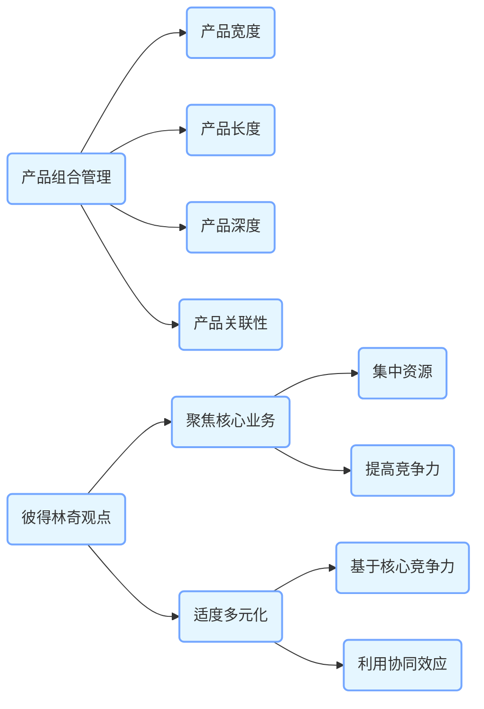

# 彼得林奇对公司产品组合管理的看法

> 关键词：彼得林奇、产品组合管理、公司战略、投资分析、多元化、聚焦、竞争优势

> 摘要：本文深入探讨了彼得林奇对公司产品组合管理的看法。彼得林奇作为投资领域的传奇人物，其观点对于理解公司的经营战略和投资价值具有重要意义。文章首先介绍了相关背景，包括目的、预期读者等内容。接着阐述了产品组合管理的核心概念与联系，分析了彼得林奇所强调的产品组合对公司竞争力和投资价值的影响。详细讲解了相关的核心算法原理和操作步骤，通过数学模型和公式进一步说明。通过项目实战案例，展示了如何运用彼得林奇的观点进行产品组合管理的分析。同时探讨了实际应用场景，推荐了相关的工具和资源。最后总结了未来发展趋势与挑战，解答常见问题并提供扩展阅读和参考资料，旨在帮助读者全面理解彼得林奇的理念并应用于实际的商业决策和投资分析中。

## 1. 背景介绍 
### 1.1 目的和范围
本文的目的在于全面剖析彼得林奇对公司产品组合管理的看法，并探讨其在现代商业和投资领域的应用价值。彼得林奇以其卓越的投资业绩和独特的投资理念闻名于世，他对公司产品组合的见解不仅有助于投资者评估公司的投资价值，也能为企业管理者优化产品组合提供参考。

范围涵盖了彼得林奇在其著作、演讲及投资实践中涉及的产品组合管理的各个方面，包括产品多元化与聚焦的平衡、产品组合对公司竞争力的影响、如何通过产品组合判断公司的发展前景等。

### 1.2 预期读者
本文预期读者包括对投资领域感兴趣的个人投资者、专业投资机构的从业者、企业管理者以及研究商业战略和投资理论的学者。无论是希望从投资角度理解公司价值的投资者，还是寻求优化公司产品战略的管理者，都能从本文中获得有价值的信息。

### 1.3 文档结构概述
本文将按照以下结构展开：首先介绍相关背景知识，包括目的、读者和术语表；接着阐述产品组合管理的核心概念与联系，通过文本示意图和流程图进行直观展示；然后详细讲解核心算法原理和具体操作步骤，结合 Python 代码进行说明；再通过数学模型和公式进一步深入分析；通过项目实战案例展示如何应用相关理论；探讨实际应用场景；推荐相关的学习资源、开发工具和论文著作；最后总结未来发展趋势与挑战，解答常见问题并提供扩展阅读和参考资料。

### 1.4 术语表
#### 1.4.1 核心术语定义
- **产品组合管理**：指企业对其生产和销售的各种产品进行综合管理，包括产品的种类、数量、市场定位、发展策略等方面的决策和协调，以实现企业的战略目标。
- **多元化**：企业通过进入新的业务领域或推出新的产品，扩大其产品组合的范围，降低单一产品或业务带来的风险。
- **聚焦**：企业集中资源和精力发展某一特定领域或产品，以提高在该领域的竞争力和市场份额。
- **竞争优势**：企业在市场竞争中相对于竞争对手所具有的优势，表现为产品质量、成本、品牌、技术等方面的优势。

#### 1.4.2 相关概念解释
- **协同效应**：在产品组合管理中，不同产品之间通过共享资源、技术、渠道等，实现成本降低、效率提高和价值提升的效果。
- **生命周期**：产品从投入市场到被市场淘汰的整个过程，包括引入期、成长期、成熟期和衰退期。

#### 1.4.3 缩略词列表
- **SWOT**：Strengths（优势）、Weaknesses（劣势）、Opportunities（机会）、Threats（威胁）的缩写，用于企业战略分析。

## 2. 核心概念与联系 
### 产品组合管理的核心概念
产品组合管理是企业战略管理的重要组成部分，它涉及到企业如何合理配置资源，以实现产品的优化组合，从而提高企业的整体竞争力和盈利能力。彼得林奇认为，一个合理的产品组合应该能够反映企业的核心竞争力和市场定位。

产品组合通常包括产品的宽度、长度、深度和关联性。产品宽度指企业生产的不同产品线的数量；产品长度指产品线中产品项目的总数；产品深度指每个产品项目所提供的不同规格、型号、花色等的数量；产品关联性指各产品线在最终用途、生产条件、分销渠道等方面的相互关联程度。

### 彼得林奇的观点
彼得林奇强调产品组合的质量而非数量。他认为，企业不应盲目追求多元化，而应专注于自己熟悉和擅长的领域。过度多元化可能导致企业资源分散，无法在任何一个领域形成强大的竞争优势。相反，聚焦于核心产品和业务，能够使企业集中精力进行研发、生产和营销，提高产品质量和服务水平，从而在市场中占据领先地位。

同时，彼得林奇也认识到适度多元化的重要性。当企业在核心业务领域已经取得了稳固的地位，并且拥有足够的资源和能力时，可以考虑通过多元化拓展新的市场机会，降低单一业务带来的风险。但这种多元化应该是基于企业的核心竞争力和协同效应，而不是盲目跟风。

### 核心概念原理和架构的文本示意图
```plaintext
产品组合管理
|-- 产品宽度
|-- 产品长度
|-- 产品深度
|-- 产品关联性

彼得林奇观点
|-- 聚焦核心业务
|   |-- 集中资源
|   |-- 提高竞争力
|-- 适度多元化
|   |-- 基于核心竞争力
|   |-- 利用协同效应
```

### Mermaid 流程图


## 3. 核心算法原理 & 具体操作步骤 
### 核心算法原理
在产品组合管理中，可以使用一些量化的方法来评估产品的价值和潜力，以便做出合理的决策。其中一个常用的方法是波士顿矩阵（BCG Matrix）。

波士顿矩阵根据产品的市场增长率和相对市场份额将产品分为四类：明星产品、现金牛产品、问题产品和瘦狗产品。市场增长率反映了产品所在市场的发展潜力，相对市场份额反映了产品在市场中的竞争地位。

### Python 代码实现
```python
import pandas as pd
import matplotlib.pyplot as plt

# 定义产品数据
products = {
    '产品名称': ['产品A', '产品B', '产品C', '产品D'],
    '市场增长率': [0.2, 0.1, 0.3, 0.05],
    '相对市场份额': [1.5, 0.8, 0.2, 0.1]
}

# 创建 DataFrame
df = pd.DataFrame(products)

# 定义波士顿矩阵的分类函数
def bcg_classification(growth_rate, market_share):
    if growth_rate > 0.1 and market_share > 1:
        return '明星产品'
    elif growth_rate < 0.1 and market_share > 1:
        return '现金牛产品'
    elif growth_rate > 0.1 and market_share < 1:
        return '问题产品'
    else:
        return '瘦狗产品'

# 应用分类函数
df['分类'] = df.apply(lambda row: bcg_classification(row['市场增长率'], row['相对市场份额']), axis=1)

# 打印结果
print(df)

# 绘制波士顿矩阵图
plt.figure(figsize=(8, 6))
plt.scatter(df['市场增长率'], df['相对市场份额'])
for i, txt in enumerate(df['产品名称']):
    plt.annotate(txt, (df['市场增长率'][i], df['相对市场份额'][i]))
plt.axhline(y=1, color='r', linestyle='--')
plt.axvline(x=0.1, color='r', linestyle='--')
plt.xlabel('市场增长率')
plt.ylabel('相对市场份额')
plt.title('波士顿矩阵')
plt.show()
```

### 具体操作步骤
1. **数据收集**：收集产品的市场增长率和相对市场份额数据。市场增长率可以通过分析市场规模的变化来计算，相对市场份额可以通过比较产品的销售额与市场领导者的销售额来确定。
2. **数据处理**：将收集到的数据整理成合适的格式，如使用 Python 的 DataFrame 进行存储。
3. **分类计算**：根据波士顿矩阵的分类标准，使用上述代码中的分类函数对产品进行分类。
4. **结果分析**：根据分类结果，制定相应的产品策略。对于明星产品，应加大投资，以保持其快速增长；对于现金牛产品，应维持现状，获取稳定的现金流；对于问题产品，应评估其发展潜力，决定是否加大投资或放弃；对于瘦狗产品，应考虑逐步淘汰。

## 4. 数学模型和公式 & 详细讲解 & 举例说明 
### 波士顿矩阵的数学模型
波士顿矩阵主要基于两个指标：市场增长率（$g$）和相对市场份额（$s$）。市场增长率的计算公式为：

$$g = \frac{S_{t} - S_{t-1}}{S_{t-1}}$$

其中，$S_{t}$ 表示当前时期的市场规模，$S_{t-1}$ 表示上一时期的市场规模。

相对市场份额的计算公式为：

$$s = \frac{R_{i}}{R_{m}}$$

其中，$R_{i}$ 表示产品 $i$ 的销售额，$R_{m}$ 表示市场领导者的销售额。

### 详细讲解
市场增长率反映了产品所在市场的发展趋势。高市场增长率意味着市场需求增长迅速，产品有较大的发展空间；低市场增长率则表示市场趋于成熟或衰退。

相对市场份额反映了产品在市场中的竞争地位。高相对市场份额意味着产品在市场中具有较强的竞争力，能够获得更多的利润和资源；低相对市场份额则表示产品面临较大的竞争压力。

### 举例说明
假设某公司有两款产品 A 和 B。产品 A 所在市场的规模在过去一年从 1000 万元增长到 1200 万元，产品 A 的销售额为 300 万元，市场领导者的销售额为 500 万元。产品 B 所在市场的规模在过去一年从 800 万元增长到 840 万元，产品 B 的销售额为 100 万元，市场领导者的销售额为 200 万元。

首先计算产品 A 的市场增长率：

$$g_A = \frac{1200 - 1000}{1000} = 0.2$$

产品 A 的相对市场份额：

$$s_A = \frac{300}{500} = 0.6$$

然后计算产品 B 的市场增长率：

$$g_B = \frac{840 - 800}{800} = 0.05$$

产品 B 的相对市场份额：

$$s_B = \frac{100}{200} = 0.5$$

根据波士顿矩阵的分类标准，产品 A 属于问题产品，产品 B 属于瘦狗产品。公司可以根据这个结果，对产品 A 评估其发展潜力，考虑是否加大投资；对产品 B 考虑逐步淘汰。

## 5. 项目实战：代码实际案例和详细解释说明 
### 5.1  开发环境搭建
为了运行上述的 Python 代码，需要搭建相应的开发环境。以下是具体步骤：

1. **安装 Python**：从 Python 官方网站（https://www.python.org/downloads/）下载并安装 Python 3.x 版本。
2. **安装依赖库**：使用以下命令安装所需的库：
```sh
pip install pandas matplotlib
```
3. **选择开发工具**：可以选择使用 PyCharm、Jupyter Notebook 等开发工具。

### 5.2  源代码详细实现和代码解读
```python
import pandas as pd
import matplotlib.pyplot as plt

# 定义产品数据
products = {
    '产品名称': ['产品A', '产品B', '产品C', '产品D'],
    '市场增长率': [0.2, 0.1, 0.3, 0.05],
    '相对市场份额': [1.5, 0.8, 0.2, 0.1]
}

# 创建 DataFrame
df = pd.DataFrame(products)

# 定义波士顿矩阵的分类函数
def bcg_classification(growth_rate, market_share):
    if growth_rate > 0.1 and market_share > 1:
        return '明星产品'
    elif growth_rate < 0.1 and market_share > 1:
        return '现金牛产品'
    elif growth_rate > 0.1 and market_share < 1:
        return '问题产品'
    else:
        return '瘦狗产品'

# 应用分类函数
df['分类'] = df.apply(lambda row: bcg_classification(row['市场增长率'], row['相对市场份额']), axis=1)

# 打印结果
print(df)

# 绘制波士顿矩阵图
plt.figure(figsize=(8, 6))
plt.scatter(df['市场增长率'], df['相对市场份额'])
for i, txt in enumerate(df['产品名称']):
    plt.annotate(txt, (df['市场增长率'][i], df['相对市场份额'][i]))
plt.axhline(y=1, color='r', linestyle='--')
plt.axvline(x=0.1, color='r', linestyle='--')
plt.xlabel('市场增长率')
plt.ylabel('相对市场份额')
plt.title('波士顿矩阵')
plt.show()
```

### 代码解读与分析
1. **导入库**：导入 `pandas` 和 `matplotlib.pyplot` 库，分别用于数据处理和绘图。
2. **定义产品数据**：使用字典定义产品的名称、市场增长率和相对市场份额数据。
3. **创建 DataFrame**：将产品数据转换为 `pandas` 的 DataFrame 对象，方便后续处理。
4. **定义分类函数**：定义 `bcg_classification` 函数，根据市场增长率和相对市场份额对产品进行分类。
5. **应用分类函数**：使用 `apply` 方法将分类函数应用到 DataFrame 的每一行，生成新的分类列。
6. **打印结果**：打印包含分类信息的 DataFrame。
7. **绘制波士顿矩阵图**：使用 `matplotlib` 绘制散点图，标记出每个产品的位置，并添加参考线和标签。

通过这个代码案例，可以直观地了解产品在波士顿矩阵中的分布情况，从而为产品组合管理决策提供依据。

## 6. 实际应用场景 
### 企业战略决策
企业管理者可以根据彼得林奇的观点和波士顿矩阵等方法，对公司的产品组合进行评估和优化。对于明星产品，加大研发和市场推广投入，以保持其快速增长；对于现金牛产品，合理分配资源，维持其市场份额和盈利能力；对于问题产品，评估其发展潜力，决定是否投入资源进行培育；对于瘦狗产品，考虑逐步淘汰或进行业务转型。

### 投资分析
投资者可以运用彼得林奇的理念和相关分析工具，评估公司的产品组合质量和发展前景。一个合理的产品组合通常意味着公司具有较强的竞争力和稳定的盈利能力，从而增加投资的吸引力。例如，当公司拥有多个明星产品和现金牛产品时，说明公司的产品组合较为健康，具有较高的投资价值。

### 市场竞争分析
通过分析竞争对手的产品组合，可以了解其市场定位和竞争策略。如果竞争对手在某个领域拥有强大的产品组合，企业可以考虑避开其优势领域，寻找新的市场机会；或者通过差异化竞争，提高自己产品的竞争力。

### 新产品开发决策
在进行新产品开发时，企业可以参考现有产品组合的情况，选择与现有产品具有协同效应的新产品。这样可以充分利用企业的资源和优势，降低新产品开发的风险。例如，一家生产智能手机的企业可以考虑开发与手机相关的配件产品，如耳机、充电器等，以扩大产品组合的范围。

## 7. 工具和资源推荐
### 7.1 学习资源推荐
#### 7.1.1 书籍推荐
- 《彼得林奇的成功投资》：彼得林奇的经典著作，详细阐述了他的投资理念和方法，包括对公司产品组合的分析和评估。
- 《竞争战略》：迈克尔·波特的经典著作，介绍了企业竞争战略的基本理论和方法，对于理解产品组合管理在企业战略中的作用具有重要意义。
- 《市场营销管理》：菲利普·科特勒的经典教材，全面介绍了市场营销的理论和实践，包括产品组合管理的相关内容。

#### 7.1.2 在线课程
- Coursera 上的“市场营销原理”课程：由知名大学的教授授课，系统介绍市场营销的基本原理和方法，包括产品组合管理。
- edX 上的“战略管理”课程：帮助学习者了解企业战略管理的基本概念和方法，以及如何运用这些方法进行产品组合管理。

#### 7.1.3 技术博客和网站
- 哈佛商业评论（https://hbr.org/）：提供了大量关于企业管理和战略的前沿研究和案例分析，包括产品组合管理的相关内容。
- 麦肯锡季刊（https://www.mckinsey.com/insights）：麦肯锡公司的官方网站，发布了许多关于企业战略和管理的研究报告和文章，对产品组合管理有深入的探讨。

### 7.2 开发工具框架推荐
#### 7.2.1 IDE和编辑器
- PyCharm：一款专业的 Python 集成开发环境，提供了丰富的代码编辑、调试和分析功能，适合开发与产品组合管理相关的 Python 代码。
- Jupyter Notebook：一个交互式的开发环境，支持多种编程语言，方便进行数据分析和可视化，对于使用 Python 进行产品组合管理的数据分析非常有用。

#### 7.2.2 调试和性能分析工具
- PDB：Python 内置的调试器，可以帮助开发者定位和解决代码中的问题。
- cProfile：Python 标准库中的性能分析工具，可以帮助开发者分析代码的性能瓶颈，优化代码的执行效率。

#### 7.2.3 相关框架和库
- Pandas：一个强大的数据处理和分析库，提供了丰富的数据结构和函数，方便进行产品组合管理的数据处理和分析。
- Matplotlib：一个常用的绘图库，可以帮助开发者绘制各种类型的图表，如波士顿矩阵图，直观展示产品组合的情况。

### 7.3 相关论文著作推荐
#### 7.3.1 经典论文
- “The Product Portfolio Matrix”：介绍了波士顿矩阵的基本原理和应用方法，是产品组合管理领域的经典论文。
- “Competitive Advantage: Creating and Sustaining Superior Performance”：迈克尔·波特的经典论文，阐述了企业竞争优势的来源和构建方法，对产品组合管理具有重要的指导意义。

#### 7.3.2 最新研究成果
- 近年来，关于产品组合管理的研究主要集中在数字化转型、创新管理和可持续发展等方面。可以通过学术数据库，如 IEEE Xplore、ACM Digital Library 等，查找相关的最新研究论文。

#### 7.3.3 应用案例分析
- 许多咨询公司和研究机构会发布一些关于产品组合管理的应用案例分析报告，如贝恩公司的《全球企业战略报告》、波士顿咨询公司的《全球创新趋势报告》等。这些报告可以帮助读者了解产品组合管理在实际企业中的应用情况和效果。

## 8. 总结：未来发展趋势与挑战
### 未来发展趋势
- **数字化转型**：随着信息技术的快速发展，企业的产品组合管理将越来越依赖于数字化技术。通过大数据分析、人工智能等技术，企业可以更准确地了解市场需求和消费者行为，优化产品组合，提高决策的科学性和效率。
- **创新驱动**：在竞争激烈的市场环境中，创新将成为企业产品组合管理的核心驱动力。企业需要不断推出新产品、新服务，满足消费者日益多样化的需求，提高产品的附加值和竞争力。
- **可持续发展**：消费者对环境保护和社会责任的关注度越来越高，企业在产品组合管理中需要考虑可持续发展因素。例如，推出环保型产品、采用可持续的生产方式等，以满足消费者的需求和社会的期望。
- **全球化竞争**：随着经济全球化的深入发展，企业面临的市场竞争将更加激烈。企业需要在全球范围内优化产品组合，拓展市场空间，提高国际竞争力。

### 挑战
- **技术更新换代快**：数字化技术的快速发展使得技术更新换代的速度加快，企业需要不断投入资源进行技术研发和创新，以跟上技术发展的步伐。否则，企业的产品可能会因为技术落后而被市场淘汰。
- **市场需求变化复杂**：消费者的需求越来越多样化、个性化，市场需求变化的速度也越来越快。企业需要及时了解市场需求的变化，调整产品组合，以满足消费者的需求。但这对企业的市场调研和决策能力提出了更高的要求。
- **竞争压力增大**：全球化竞争使得企业面临来自国内外的众多竞争对手，竞争压力不断增大。企业需要在产品质量、成本、服务等方面不断提升自己的竞争力，以在市场中占据一席之地。
- **可持续发展要求高**：可持续发展不仅要求企业在产品设计和生产过程中考虑环境保护和社会责任，还需要企业在供应链管理、市场营销等方面进行全面的变革。这对企业的管理能力和资源配置能力提出了更高的挑战。

## 9. 附录：常见问题与解答
### 问题 1：如何确定产品的市场增长率和相对市场份额？
答：市场增长率可以通过分析市场规模的变化来计算，公式为 $g = \frac{S_{t} - S_{t-1}}{S_{t-1}}$，其中 $S_{t}$ 表示当前时期的市场规模，$S_{t-1}$ 表示上一时期的市场规模。相对市场份额可以通过比较产品的销售额与市场领导者的销售额来确定，公式为 $s = \frac{R_{i}}{R_{m}}$，其中 $R_{i}$ 表示产品 $i$ 的销售额，$R_{m}$ 表示市场领导者的销售额。市场规模和销售额数据可以通过市场调研机构、行业协会、企业财务报表等渠道获取。

### 问题 2：波士顿矩阵的分类标准是否固定不变？
答：波士顿矩阵的分类标准并不是固定不变的，企业可以根据自身的实际情况和市场环境进行调整。例如，在不同的行业和市场中，市场增长率和相对市场份额的划分标准可能会有所不同。企业可以根据自己的战略目标和发展阶段，确定适合自己的分类标准。

### 问题 3：如何根据波士顿矩阵的分类结果制定产品策略？
答：对于明星产品，应加大投资，以保持其快速增长，提高市场份额；对于现金牛产品，应维持现状，获取稳定的现金流，同时可以适当进行产品升级和市场拓展；对于问题产品，应评估其发展潜力，若潜力较大，可以加大投资进行培育，若潜力较小，可以考虑放弃；对于瘦狗产品，应考虑逐步淘汰或进行业务转型。

### 问题 4：彼得林奇的观点是否适用于所有类型的企业？
答：彼得林奇的观点具有一定的普遍性，但并不是适用于所有类型的企业。不同行业、不同规模的企业在产品组合管理方面可能会有不同的特点和需求。例如，新兴行业的企业可能更注重创新和多元化，而传统行业的企业可能更注重聚焦和核心竞争力的提升。企业在应用彼得林奇的观点时，需要结合自身的实际情况进行灵活调整。

## 10. 扩展阅读 & 参考资料
### 扩展阅读
- 《创新者的窘境》：克莱顿·克里斯坦森的经典著作，探讨了企业在面对破坏性创新时的挑战和应对策略，对于理解产品组合管理中的创新和变革具有重要意义。
- 《从优秀到卓越》：吉姆·柯林斯的经典著作，研究了优秀企业如何实现向卓越企业的跨越，其中涉及到产品组合管理、战略决策等方面的内容。

### 参考资料
- 彼得林奇. 《彼得林奇的成功投资》. 机械工业出版社.
- 迈克尔·波特. 《竞争战略》. 华夏出版社.
- 菲利普·科特勒. 《市场营销管理》. 中国人民大学出版社.
- “The Product Portfolio Matrix”. 相关学术期刊.
- “Competitive Advantage: Creating and Sustaining Superior Performance”. 相关学术期刊.