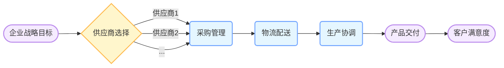

# 彼得林奇对公司供应链多元化策略的评估

> 关键词：彼得林奇、供应链多元化、公司评估、投资策略、风险管理、财务分析、竞争优势

> 摘要：本文深入探讨彼得林奇对公司供应链多元化策略的评估方法和理念。首先介绍彼得林奇在投资领域的重要地位以及供应链多元化策略的背景意义，接着阐述供应链多元化的核心概念与内在联系，剖析相关核心算法原理及操作步骤，通过数学模型和公式进行理论分析并举例说明。然后结合项目实战，给出代码实际案例并详细解释。探讨该策略在实际中的应用场景，推荐相关的学习工具、资源和论文著作。最后总结未来发展趋势与挑战，解答常见问题并提供扩展阅读和参考资料，旨在为投资者和企业管理者提供全面深入的关于公司供应链多元化策略评估的知识和方法。

## 1. 背景介绍 
### 1.1 目的和范围
彼得林奇是投资界的传奇人物，他的投资理念和方法影响了无数投资者。公司的供应链多元化策略对于企业的生存和发展至关重要，它涉及到企业的成本控制、风险应对、市场竞争力等多个方面。本文的目的在于深入研究彼得林奇如何评估公司的供应链多元化策略，范围涵盖从理论概念到实际操作，从算法原理到项目实战，以及相关的应用场景、工具资源等多个维度，为读者提供一个全面的关于公司供应链多元化策略评估的知识体系。

### 1.2 预期读者
本文预期读者包括对投资领域感兴趣的投资者，希望深入了解企业运营管理的企业管理者，以及从事相关学术研究的学者和学生。对于投资者来说，可以通过本文学习如何运用彼得林奇的方法评估公司的供应链多元化策略，从而做出更明智的投资决策；企业管理者可以借鉴相关理念和方法，优化自身企业的供应链策略；学者和学生则可以从理论和实践的结合中获取研究灵感和知识。

### 1.3 文档结构概述
本文首先介绍背景信息，包括目的、预期读者和文档结构概述等。接着阐述核心概念与联系，包括供应链多元化的原理和架构，并通过 Mermaid 流程图展示其逻辑关系。然后讲解核心算法原理和具体操作步骤，用 Python 源代码详细说明。之后通过数学模型和公式进行理论分析并举例。再结合项目实战，给出代码实际案例并详细解释。探讨实际应用场景，推荐相关工具和资源，包括学习资源、开发工具框架和相关论文著作。最后总结未来发展趋势与挑战，解答常见问题并提供扩展阅读和参考资料。

### 1.4 术语表
#### 1.4.1 核心术语定义
- **彼得林奇**：著名的投资大师，曾任富达公司麦哲伦基金的基金经理，以其卓越的投资业绩和独特的投资理念而闻名。
- **供应链多元化**：指企业为了降低风险、提高效率、增强竞争力等目的，通过与多个供应商建立合作关系，在原材料采购、生产、运输等环节采用多种来源和方式的策略。
- **投资策略**：投资者为了实现投资目标，在投资过程中所采用的方法和原则。
- **风险管理**：企业或投资者识别、评估和应对各种风险的过程和方法。

#### 1.4.2 相关概念解释
- **供应商管理**：企业对供应商的选择、评估、合作和监督等一系列活动，旨在确保供应商能够提供符合企业要求的产品和服务。
- **成本控制**：企业通过各种手段和方法，对生产经营过程中的成本进行管理和控制，以实现降低成本、提高效益的目的。
- **市场竞争力**：企业在市场中与其他竞争对手相比所具有的优势和能力，包括产品质量、价格、服务等多个方面。

#### 1.4.3 缩略词列表
- **SWOT**：Strengths（优势）、Weaknesses（劣势）、Opportunities（机会）、Threats（威胁）的缩写，是一种常用的战略分析工具。
- **ERP**：Enterprise Resource Planning（企业资源计划）的缩写，是一种集成化的管理信息系统，用于企业的资源管理和运营管理。

## 2. 核心概念与联系 

### 供应链多元化的原理
供应链多元化的核心原理在于分散风险和提高灵活性。单一的供应链容易受到供应商问题、自然灾害、政治动荡等因素的影响，导致企业生产中断、成本上升等问题。通过与多个供应商建立合作关系，企业可以在某个供应商出现问题时，及时转向其他供应商，保证生产的连续性。同时，多元化的供应链可以让企业在不同供应商之间进行比较和选择，获取更优质的产品和服务，提高企业的竞争力。

### 供应链多元化的架构
供应链多元化的架构包括供应商选择、采购管理、物流配送、生产协调等多个环节。企业需要根据自身的需求和战略目标，选择合适的供应商，并建立有效的采购管理体系，确保原材料的及时供应和质量保证。在物流配送方面，需要优化运输路线和方式，提高物流效率。生产协调则需要确保各个环节之间的顺畅衔接，提高生产效率和产品质量。

### 文本示意图
供应链多元化的架构可以用以下文本示意图表示：

企业战略目标 -> 供应商选择（多个供应商） -> 采购管理（合同签订、订单管理等） -> 物流配送（运输、仓储等） -> 生产协调（生产计划、质量控制等） -> 产品交付 -> 客户满意度

### Mermaid 流程图


## 3. 核心算法原理 & 具体操作步骤 

### 核心算法原理
评估公司供应链多元化策略的核心算法可以基于多指标综合评价法。该方法通过选取多个与供应链多元化相关的指标，如供应商数量、供应商地域分布、采购金额分布等，对每个指标赋予相应的权重，然后计算综合得分，以此来评估公司供应链多元化的程度和效果。

### Python 源代码实现
```python
# 定义评估指标和权重
indicators = {
    "供应商数量": 0.3,
    "供应商地域分布": 0.3,
    "采购金额分布": 0.2,
    "合作年限": 0.1,
    "供应稳定性": 0.1
}

# 示例数据：公司 A 的各项指标得分
company_A_scores = {
    "供应商数量": 80,
    "供应商地域分布": 70,
    "采购金额分布": 60,
    "合作年限": 75,
    "供应稳定性": 85
}

# 计算综合得分
def calculate_score(scores, weights):
    total_score = 0
    for indicator, weight in weights.items():
        total_score += scores[indicator] * weight
    return total_score

# 计算公司 A 的综合得分
company_A_total_score = calculate_score(company_A_scores, indicators)
print(f"公司 A 的供应链多元化综合得分: {company_A_total_score}")
```

### 具体操作步骤
1. **确定评估指标**：根据公司的特点和供应链管理的目标，确定与供应链多元化相关的评估指标。
2. **确定指标权重**：通过专家评估、层次分析法等方法，确定每个评估指标的权重。
3. **收集数据**：收集公司在各个评估指标上的数据，如供应商数量、采购金额等。
4. **计算指标得分**：根据收集到的数据，计算公司在每个评估指标上的得分。
5. **计算综合得分**：将每个指标的得分乘以相应的权重，然后求和，得到公司的供应链多元化综合得分。
6. **评估结果分析**：根据综合得分，对公司的供应链多元化策略进行评估和分析，提出改进建议。

## 4. 数学模型和公式 & 详细讲解 & 举例说明 

### 数学模型
设评估指标有 $n$ 个，分别为 $x_1, x_2, \cdots, x_n$，对应的权重为 $w_1, w_2, \cdots, w_n$，其中 $\sum_{i=1}^{n} w_i = 1$。公司在每个指标上的得分分别为 $s_1, s_2, \cdots, s_n$，则公司的供应链多元化综合得分 $S$ 可以用以下公式表示：

$$S = \sum_{i=1}^{n} w_i s_i$$

### 详细讲解
该数学模型基于加权平均的思想，将各个评估指标的得分按照其权重进行加权求和，得到综合得分。权重的大小反映了该指标在评估中的重要程度，权重越大，该指标对综合得分的影响越大。

### 举例说明
假设某公司的评估指标和权重如下：

| 评估指标 | 权重 |
| ---- | ---- |
| 供应商数量 | 0.3 |
| 供应商地域分布 | 0.3 |
| 采购金额分布 | 0.2 |
| 合作年限 | 0.1 |
| 供应稳定性 | 0.1 |

该公司在各个指标上的得分如下：

| 评估指标 | 得分 |
| ---- | ---- |
| 供应商数量 | 80 |
| 供应商地域分布 | 70 |
| 采购金额分布 | 60 |
| 合作年限 | 75 |
| 供应稳定性 | 85 |

则该公司的供应链多元化综合得分 $S$ 为：

$$
\begin{align*}
S &= 0.3 \times 80 + 0.3 \times 70 + 0.2 \times 60 + 0.1 \times 75 + 0.1 \times 85 \\
&= 24 + 21 + 12 + 7.5 + 8.5 \\
&= 73
\end{align*}
$$

通过计算得到该公司的供应链多元化综合得分为 73 分，可以根据这个得分对该公司的供应链多元化策略进行评估和分析。

## 5. 项目实战：代码实际案例和详细解释说明 

### 5.1  开发环境搭建
- **Python 环境**：安装 Python 3.x 版本，可以从 Python 官方网站（https://www.python.org/downloads/）下载并安装。
- **开发工具**：可以使用 PyCharm、VS Code 等集成开发环境（IDE），也可以使用 Jupyter Notebook 进行交互式开发。
- **相关库**：本案例主要使用 Python 内置库，无需额外安装其他库。

### 5.2  源代码详细实现和代码解读
```python
# 定义评估指标和权重
indicators = {
    "供应商数量": 0.3,
    "供应商地域分布": 0.3,
    "采购金额分布": 0.2,
    "合作年限": 0.1,
    "供应稳定性": 0.1
}

# 示例数据：公司列表及其各项指标得分
companies = {
    "公司 A": {
        "供应商数量": 80,
        "供应商地域分布": 70,
        "采购金额分布": 60,
        "合作年限": 75,
        "供应稳定性": 85
    },
    "公司 B": {
        "供应商数量": 70,
        "供应商地域分布": 60,
        "采购金额分布": 70,
        "合作年限": 80,
        "供应稳定性": 75
    },
    "公司 C": {
        "供应商数量": 60,
        "供应商地域分布": 80,
        "采购金额分布": 80,
        "合作年限": 70,
        "供应稳定性": 65
    }
}

# 计算综合得分
def calculate_score(scores, weights):
    total_score = 0
    for indicator, weight in weights.items():
        total_score += scores[indicator] * weight
    return total_score

# 计算每个公司的综合得分
company_scores = {}
for company, scores in companies.items():
    company_scores[company] = calculate_score(scores, indicators)

# 输出每个公司的综合得分
for company, score in company_scores.items():
    print(f"{company} 的供应链多元化综合得分: {score}")

# 找出得分最高的公司
best_company = max(company_scores, key=company_scores.get)
print(f"供应链多元化策略最佳的公司是: {best_company}")
```

### 代码解读与分析
1. **定义评估指标和权重**：通过字典 `indicators` 定义了评估供应链多元化的指标和相应的权重。
2. **示例数据**：使用字典 `companies` 存储了多个公司的各项指标得分。
3. **计算综合得分函数**：定义了 `calculate_score` 函数，用于计算每个公司的综合得分。
4. **计算每个公司的综合得分**：通过遍历 `companies` 字典，调用 `calculate_score` 函数计算每个公司的综合得分，并存储在 `company_scores` 字典中。
5. **输出结果**：遍历 `company_scores` 字典，输出每个公司的综合得分，并找出得分最高的公司。

通过这个项目实战案例，可以清晰地看到如何使用 Python 代码实现对公司供应链多元化策略的评估，并且可以根据评估结果进行比较和分析。

## 6. 实际应用场景 
### 投资决策
投资者在进行股票投资时，可以运用彼得林奇的方法评估公司的供应链多元化策略。如果一个公司的供应链多元化程度高，风险相对较低，竞争力较强，那么该公司的股票可能具有更高的投资价值。例如，在分析制造业公司时，投资者可以关注其供应商的数量、地域分布等情况，评估其供应链的稳定性和灵活性，从而做出更明智的投资决策。

### 企业战略规划
企业管理者在制定战略规划时，需要考虑供应链多元化策略。通过评估现有供应链的多元化程度，企业可以发现存在的问题和不足，制定相应的改进措施。例如，如果企业的供应商集中在某个地区，当该地区发生自然灾害或政治动荡时，企业的生产可能会受到严重影响。因此，企业可以考虑拓展供应商的地域分布，降低风险。

### 风险管理
供应链多元化是企业风险管理的重要手段之一。通过与多个供应商建立合作关系，企业可以在某个供应商出现问题时，及时转向其他供应商，保证生产的连续性。例如，在疫情期间，许多企业的供应链受到了严重影响，而那些具有多元化供应链的企业则能够更好地应对危机，减少损失。

### 供应商管理
企业在进行供应商管理时，可以运用供应链多元化策略。通过与多个供应商合作，企业可以在不同供应商之间进行比较和选择，获取更优质的产品和服务。同时，企业可以通过与供应商的合作，共同提高供应链的效率和竞争力。例如，企业可以与供应商共同开展研发活动，提高产品的质量和性能。

## 7. 工具和资源推荐
### 7.1 学习资源推荐
#### 7.1.1 书籍推荐
- 《彼得林奇的成功投资》：彼得林奇的经典著作，详细介绍了他的投资理念和方法，对于学习如何评估公司的供应链多元化策略具有重要的参考价值。
- 《供应链管理》：全面介绍了供应链管理的理论和实践，包括供应链多元化策略的相关内容。
- 《风险管理》：讲解了风险管理的基本概念、方法和工具，对于理解供应链多元化在风险管理中的作用有帮助。

#### 7.1.2 在线课程
- Coursera 上的“供应链管理基础”课程：由知名教授授课，系统地介绍了供应链管理的基础知识和方法。
- edX 上的“投资分析与组合管理”课程：涉及到投资领域的各种分析方法和策略，包括对公司供应链的评估。

#### 7.1.3 技术博客和网站
- 供应链管理专业人士协会（CSCMP）官网：提供了丰富的供应链管理相关的资讯、研究报告和案例分析。
- 雪球网：是一个投资交流平台，有很多投资者分享关于公司分析和投资策略的文章，其中也包括对公司供应链的讨论。

### 7.2 开发工具框架推荐
#### 7.2.1 IDE和编辑器
- PyCharm：是一款专业的 Python 集成开发环境，具有丰富的代码编辑、调试和分析功能。
- VS Code：是一款轻量级的代码编辑器，支持多种编程语言，通过安装相关插件可以实现 Python 开发的高效性。

#### 7.2.2 调试和性能分析工具
- PySnooper：可以方便地对 Python 代码进行调试，输出详细的执行过程和变量值。
- cProfile：Python 内置的性能分析工具，可以分析代码的运行时间和函数调用情况。

#### 7.2.3 相关框架和库
- Pandas：是一个强大的数据分析库，可用于处理和分析供应链相关的数据。
- NumPy：提供了高效的数值计算功能，在数据处理和模型计算中非常有用。

### 7.3 相关论文著作推荐
#### 7.3.1 经典论文
- Fisher, M. L. (1997). What is the right supply chain for your product?. Harvard business review, 75(2), 105-116. 该论文探讨了如何根据产品特点选择合适的供应链策略，对理解供应链多元化有重要启示。
- Christopher, M., & Peck, H. (2004). Building the resilient supply chain. International journal of logistics management, 15(2), 1-14. 研究了如何构建具有弹性的供应链，与供应链多元化策略密切相关。

#### 7.3.2 最新研究成果
可以通过学术数据库如 Web of Science、IEEE Xplore 等搜索关于供应链多元化的最新研究论文，了解该领域的前沿动态。

#### 7.3.3 应用案例分析
- 可以参考一些知名企业的供应链管理案例，如苹果公司、丰田汽车等，了解它们在供应链多元化方面的实践和经验。

## 8. 总结：未来发展趋势与挑战
### 未来发展趋势
- **数字化转型**：随着信息技术的不断发展，供应链将越来越数字化。企业将利用大数据、人工智能、物联网等技术，实现供应链的实时监控、预测和优化，提高供应链的效率和灵活性。
- **绿色供应链**：环保意识的增强将促使企业更加关注供应链的可持续性。企业将采取措施减少供应链中的碳排放、废弃物等，推动绿色供应链的发展。
- **全球化与本地化相结合**：虽然全球化趋势仍在继续，但企业也将更加注重本地化供应链的建设。通过在本地建立供应商网络，企业可以减少运输成本、缩短交货期，更好地应对本地市场的需求。

### 挑战
- **数据安全与隐私**：数字化供应链需要大量的数据支持，但数据安全和隐私问题也日益突出。企业需要采取有效的措施保护数据的安全和隐私，防止数据泄露和滥用。
- **供应链复杂性增加**：随着供应链的多元化和全球化，供应链的复杂性也在不断增加。企业需要具备更强的供应链管理能力，才能有效地应对各种挑战。
- **成本控制**：在实现供应链多元化的过程中，企业可能会面临成本上升的问题。如何在保证供应链稳定性和灵活性的前提下，控制成本是企业需要解决的重要问题。

## 9. 附录：常见问题与解答
### 问题 1：如何确定评估指标的权重？
答：确定评估指标的权重可以采用多种方法，如专家评估法、层次分析法等。专家评估法是邀请相关领域的专家根据经验和专业知识对各个指标的重要程度进行评估，然后综合专家意见确定权重。层次分析法是一种系统的决策分析方法，通过构建层次结构模型，对指标之间的相对重要性进行比较和判断，从而确定权重。

### 问题 2：供应链多元化是否意味着供应商越多越好？
答：不是的。虽然增加供应商数量可以在一定程度上降低风险，但过多的供应商也会带来管理成本增加、协调难度加大等问题。企业需要根据自身的实际情况，合理确定供应商的数量和结构，以实现供应链的优化和效益最大化。

### 问题 3：如何评估供应商的供应稳定性？
答：评估供应商的供应稳定性可以从多个方面进行，如供应商的历史交货记录、生产能力、质量管理体系等。可以通过查看供应商的交货准时率、产品合格率等指标，了解其供应稳定性。同时，还可以对供应商的生产设施、人员素质等进行实地考察，评估其潜在的供应风险。

## 10. 扩展阅读 & 参考资料
### 扩展阅读
- 《创新者的窘境》：探讨了企业在面对技术创新和市场变化时的挑战和机遇，对于理解供应链多元化在企业创新中的作用有一定的启发。
- 《竞争战略》：介绍了企业竞争战略的基本理论和方法，与供应链多元化策略的制定和实施密切相关。

### 参考资料
- 彼得林奇相关著作和演讲资料。
- 供应链管理领域的学术期刊和研究报告。
- 企业的年度报告和财务报表，其中包含了关于供应链的相关信息。