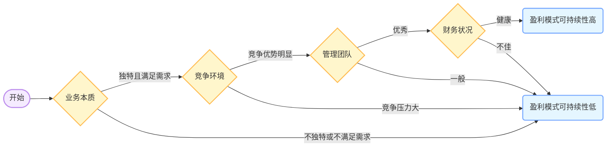

# 彼得林奇对公司盈利模式可持续性的判断

> 关键词：彼得林奇、盈利模式、可持续性、公司分析、投资策略

> 摘要：本文聚焦于彼得林奇对公司盈利模式可持续性的判断方法。彼得林奇作为投资领域的传奇人物，其独特的投资理念和对公司基本面的深入分析方法为投资者提供了宝贵的借鉴。文章首先介绍了研究这一主题的背景和相关概念，接着阐述核心概念及联系，详细讲解彼得林奇判断盈利模式可持续性的核心算法原理和具体操作步骤，通过数学模型和公式进行深入剖析，并结合项目实战案例进行说明。此外，还探讨了该判断方法的实际应用场景，推荐了相关的工具和资源，最后总结未来发展趋势与挑战，解答常见问题并提供扩展阅读和参考资料，旨在帮助读者全面理解和运用彼得林奇的投资智慧。

## 1. 背景介绍 
### 1.1 目的和范围
本研究的目的在于深入剖析彼得林奇对公司盈利模式可持续性的判断方法，为投资者和企业管理者提供有价值的参考。通过研究彼得林奇的投资理念和实践，我们可以更好地理解如何评估一家公司的长期盈利能力和竞争优势。研究范围涵盖了彼得林奇在其投资生涯中所运用的各种分析方法和决策依据，以及这些方法在不同行业和市场环境中的应用。

### 1.2 预期读者
本文预期读者包括投资者、企业管理者、金融分析师、经济学者以及对投资和企业管理感兴趣的人士。无论是专业的投资人士还是普通的投资者，都可以从彼得林奇的投资智慧中获得启示，提升自己的投资决策能力和对企业的分析能力。企业管理者可以借鉴彼得林奇的方法，审视自身企业的盈利模式，发现潜在的问题和改进空间。

### 1.3 文档结构概述
本文将按照以下结构展开：首先介绍背景知识和相关概念，为后续的分析奠定基础；然后阐述核心概念及联系，通过文本示意图和 Mermaid 流程图展示彼得林奇判断盈利模式可持续性的逻辑框架；接着详细讲解核心算法原理和具体操作步骤，并结合 Python 代码进行说明；再通过数学模型和公式对判断方法进行深入剖析，并举例说明；之后通过项目实战案例，展示如何在实际中运用这些方法；随后探讨该判断方法的实际应用场景；推荐相关的工具和资源，包括学习资源、开发工具框架和相关论文著作；最后总结未来发展趋势与挑战，解答常见问题并提供扩展阅读和参考资料。

### 1.4 术语表
#### 1.4.1 核心术语定义
- **盈利模式**：指企业通过何种方式获取收入和利润的商业模式，包括产品或服务的定价策略、成本结构、客户群体和市场定位等。
- **可持续性**：指公司的盈利模式在未来较长时间内能够保持稳定和增长的能力，不受短期市场波动和竞争压力的影响。
- **竞争优势**：指企业在市场竞争中相对于竞争对手所具有的优势，如独特的技术、品牌形象、成本优势、客户忠诚度等。
- **现金流**：指企业在一定时期内的现金流入和流出情况，反映了企业的资金运作能力和财务健康状况。

#### 1.4.2 相关概念解释
- **护城河理论**：由巴菲特提出，指企业所拥有的一种可持续的竞争优势，就像城堡周围的护城河一样，能够保护企业免受竞争对手的攻击。彼得林奇在判断公司盈利模式可持续性时，也会关注企业是否具有类似的“护城河”。
- **成长性**：指公司在未来一段时间内的增长潜力，包括收入增长、利润增长、市场份额扩大等。成长性是判断公司盈利模式可持续性的重要因素之一。

#### 1.4.3 缩略词列表
- **EPS**：Earnings Per Share，每股收益，反映了公司每股股票的盈利水平。
- **ROE**：Return on Equity，净资产收益率，衡量了公司运用自有资本的效率。
- **PEG**：Price/Earnings to Growth ratio，市盈率相对盈利增长比率，用于评估股票的估值是否合理。

## 2. 核心概念与联系 

### 核心概念原理
彼得林奇认为，判断公司盈利模式的可持续性需要综合考虑多个因素。首先，要关注公司的业务本质，即公司提供的产品或服务是否具有独特性和竞争力。独特的产品或服务能够吸引客户，形成差异化竞争优势，从而为公司带来稳定的收入和利润。其次，要考察公司的竞争环境，包括竞争对手的情况、市场份额的变化以及行业的发展趋势。如果公司所处的行业竞争激烈，且没有明显的竞争优势，那么其盈利模式的可持续性就会受到挑战。此外，公司的管理团队也是关键因素之一，优秀的管理团队能够制定合理的战略规划，有效地应对市场变化，保障公司的长期发展。

### 架构的文本示意图
```plaintext
公司盈利模式可持续性判断
|-- 业务本质
|   |-- 产品或服务独特性
|   |-- 客户需求满足程度
|-- 竞争环境
|   |-- 竞争对手分析
|   |-- 市场份额变化
|   |-- 行业发展趋势
|-- 管理团队
|   |-- 战略规划能力
|   |-- 执行能力
|   |-- 应对变化能力
|-- 财务状况
|   |-- 盈利能力
|   |-- 现金流状况
|   |-- 资产负债结构
```

### Mermaid 流程图


## 3. 核心算法原理 & 具体操作步骤 

### 核心算法原理
彼得林奇的判断方法主要基于对公司基本面的分析，通过收集和整理公司的各种信息，对业务本质、竞争环境、管理团队和财务状况等因素进行量化评估。具体来说，可以采用打分制，为每个因素设定相应的权重，根据公司在各个因素上的表现进行打分，最后将各项得分加权求和，得到一个综合得分。综合得分越高，说明公司盈利模式的可持续性越强。

### 具体操作步骤
1. **收集信息**：收集公司的年报、季报、行业研究报告、新闻资讯等相关信息，了解公司的业务情况、市场竞争环境、管理团队背景和财务状况。
2. **因素评估**：按照业务本质、竞争环境、管理团队和财务状况四个维度，对公司进行评估。每个维度可以进一步细分多个指标，例如业务本质可以包括产品或服务的独特性、客户需求满足程度等指标；竞争环境可以包括市场份额、竞争对手数量等指标。
3. **打分**：根据公司在各个指标上的表现，为每个指标打分。打分可以采用 1 - 10 分的标准，1 分表示表现最差，10 分表示表现最好。
4. **权重设定**：为每个维度和指标设定相应的权重，权重的设定可以根据个人的投资理念和经验进行调整。例如，对于注重财务状况的投资者，可以适当提高财务状况维度的权重。
5. **加权求和**：将各项得分乘以相应的权重，然后求和，得到公司的综合得分。
6. **判断结论**：根据综合得分，判断公司盈利模式的可持续性。一般来说，综合得分在 8 分以上的公司，盈利模式的可持续性较强；综合得分在 6 - 8 分之间的公司，盈利模式的可持续性一般；综合得分在 6 分以下的公司，盈利模式的可持续性较弱。

### Python 源代码实现
```python
# 定义各维度和指标的权重
weights = {
    '业务本质': {
        '产品或服务独特性': 0.3,
        '客户需求满足程度': 0.2
    },
    '竞争环境': {
        '市场份额': 0.2,
        '竞争对手数量': 0.1
    },
    '管理团队': {
        '战略规划能力': 0.1,
        '执行能力': 0.05,
        '应对变化能力': 0.05
    },
    '财务状况': {
        '盈利能力': 0.1,
        '现金流状况': 0.05,
        '资产负债结构': 0.05
    }
}

# 定义公司在各指标上的得分
scores = {
    '业务本质': {
        '产品或服务独特性': 8,
        '客户需求满足程度': 7
    },
    '竞争环境': {
        '市场份额': 6,
        '竞争对手数量': 5
    },
    '管理团队': {
        '战略规划能力': 7,
        '执行能力': 6,
        '应对变化能力': 7
    },
    '财务状况': {
        '盈利能力': 8,
        '现金流状况': 7,
        '资产负债结构': 6
    }
}

# 计算综合得分
total_score = 0
for dimension, sub_weights in weights.items():
    for indicator, weight in sub_weights.items():
        score = scores[dimension][indicator]
        total_score += score * weight

# 判断盈利模式可持续性
if total_score >= 8:
    print("盈利模式可持续性较强")
elif total_score >= 6:
    print("盈利模式可持续性一般")
else:
    print("盈利模式可持续性较弱")
```

## 4. 数学模型和公式 & 详细讲解 & 举例说明 

### 数学模型和公式
设公司的综合得分为 $S$，业务本质维度的得分和权重分别为 $S_1$ 和 $w_1$，竞争环境维度的得分和权重分别为 $S_2$ 和 $w_2$，管理团队维度的得分和权重分别为 $S_3$ 和 $w_3$，财务状况维度的得分和权重分别为 $S_4$ 和 $w_4$，则综合得分的计算公式为：

$$S = w_1S_1 + w_2S_2 + w_3S_3 + w_4S_4$$

其中，每个维度的得分又可以通过该维度下各个指标的得分加权求和得到。例如，业务本质维度的得分 $S_1$ 的计算公式为：

$$S_1 = \sum_{i=1}^{n_1} w_{1i}s_{1i}$$

其中，$w_{1i}$ 是业务本质维度下第 $i$ 个指标的权重，$s_{1i}$ 是公司在该指标上的得分，$n_1$ 是业务本质维度下的指标数量。

### 详细讲解
上述公式的核心思想是通过加权求和的方式，将公司在各个维度和指标上的表现综合起来，得到一个反映公司盈利模式可持续性的综合得分。权重的设定体现了不同维度和指标在判断盈利模式可持续性中的重要程度。例如，如果投资者认为财务状况对盈利模式的可持续性影响较大，可以适当提高财务状况维度的权重。

### 举例说明
假设某公司在各维度和指标上的得分和权重如下表所示：

| 维度 | 指标 | 权重 | 得分 |
|---|---|---|---|
| 业务本质 | 产品或服务独特性 | 0.3 | 8 |
| 业务本质 | 客户需求满足程度 | 0.2 | 7 |
| 竞争环境 | 市场份额 | 0.2 | 6 |
| 竞争环境 | 竞争对手数量 | 0.1 | 5 |
| 管理团队 | 战略规划能力 | 0.1 | 7 |
| 管理团队 | 执行能力 | 0.05 | 6 |
| 管理团队 | 应对变化能力 | 0.05 | 7 |
| 财务状况 | 盈利能力 | 0.1 | 8 |
| 财务状况 | 现金流状况 | 0.05 | 7 |
| 财务状况 | 资产负债结构 | 0.05 | 6 |

首先计算各维度的得分：

业务本质维度得分 $S_1$：

$$S_1 = 0.3\times8 + 0.2\times7 = 2.4 + 1.4 = 3.8$$

竞争环境维度得分 $S_2$：

$$S_2 = 0.2\times6 + 0.1\times5 = 1.2 + 0.5 = 1.7$$

管理团队维度得分 $S_3$：

$$S_3 = 0.1\times7 + 0.05\times6 + 0.05\times7 = 0.7 + 0.3 + 0.35 = 1.35$$

财务状况维度得分 $S_4$：

$$S_4 = 0.1\times8 + 0.05\times7 + 0.05\times6 = 0.8 + 0.35 + 0.3 = 1.45$$

然后计算综合得分 $S$：

$$S = 0.3\times3.8 + 0.2\times1.7 + 0.1\times1.35 + 0.1\times1.45 = 1.14 + 0.34 + 0.135 + 0.145 = 1.76$$

由于综合得分 $1.76 < 6$，所以该公司盈利模式的可持续性较弱。

## 5. 项目实战：代码实际案例和详细解释说明 

### 5.1  开发环境搭建
- **Python 安装**：从 Python 官方网站（https://www.python.org/downloads/）下载并安装 Python 3.x 版本。
- **IDE 选择**：可以选择 PyCharm、VS Code 等集成开发环境。这里以 VS Code 为例，安装 Python 扩展插件，以便更好地进行 Python 开发。
- **第三方库安装**：本案例主要使用 Python 内置库，无需额外安装第三方库。

### 5.2  源代码详细实现和代码解读
```python
# 定义各维度和指标的权重
weights = {
    '业务本质': {
        '产品或服务独特性': 0.3,
        '客户需求满足程度': 0.2
    },
    '竞争环境': {
        '市场份额': 0.2,
        '竞争对手数量': 0.1
    },
    '管理团队': {
        '战略规划能力': 0.1,
        '执行能力': 0.05,
        '应对变化能力': 0.05
    },
    '财务状况': {
        '盈利能力': 0.1,
        '现金流状况': 0.05,
        '资产负债结构': 0.05
    }
}

# 定义公司在各指标上的得分
scores = {
    '业务本质': {
        '产品或服务独特性': 8,
        '客户需求满足程度': 7
    },
    '竞争环境': {
        '市场份额': 6,
        '竞争对手数量': 5
    },
    '管理团队': {
        '战略规划能力': 7,
        '执行能力': 6,
        '应对变化能力': 7
    },
    '财务状况': {
        '盈利能力': 8,
        '现金流状况': 7,
        '资产负债结构': 6
    }
}

# 计算综合得分
total_score = 0
for dimension, sub_weights in weights.items():
    for indicator, weight in sub_weights.items():
        score = scores[dimension][indicator]
        total_score += score * weight

# 判断盈利模式可持续性
if total_score >= 8:
    print("盈利模式可持续性较强")
elif total_score >= 6:
    print("盈利模式可持续性一般")
else:
    print("盈利模式可持续性较弱")
```

### 代码解读与分析
1. **权重定义**：使用字典 `weights` 定义了各维度和指标的权重，每个维度下又包含多个指标及其对应的权重。
2. **得分定义**：使用字典 `scores` 定义了公司在各指标上的得分，同样每个维度下包含多个指标及其得分。
3. **综合得分计算**：通过两层循环遍历 `weights` 字典，获取每个指标的权重和得分，将得分乘以权重并累加到 `total_score` 中，得到综合得分。
4. **可持续性判断**：根据综合得分的大小，使用 `if-elif-else` 语句判断公司盈利模式的可持续性，并输出相应的结果。

## 6. 实际应用场景 
### 投资决策
投资者在选择投资标的时，可以运用彼得林奇的方法判断公司盈利模式的可持续性。对于盈利模式可持续性较强的公司，投资者可以考虑长期持有其股票；对于盈利模式可持续性较弱的公司，投资者则需要谨慎对待，避免投资风险。例如，在科技行业中，一些拥有独特技术和强大研发能力的公司，其盈利模式的可持续性较强，投资者可以关注这些公司的发展潜力。

### 企业战略规划
企业管理者可以借鉴彼得林奇的方法，审视自身企业的盈利模式，发现潜在的问题和改进空间。通过对业务本质、竞争环境、管理团队和财务状况等方面的分析，企业管理者可以制定合理的战略规划，提升企业的竞争力和盈利模式的可持续性。例如，企业可以通过加强研发投入，提升产品或服务的独特性；优化成本结构，提高盈利能力等方式来增强盈利模式的可持续性。

### 行业分析
分析师在进行行业分析时，可以运用彼得林奇的方法对行业内的企业进行评估，了解行业的竞争格局和发展趋势。通过比较不同企业的盈利模式可持续性，分析师可以找出行业内的龙头企业和具有潜力的企业，为投资者和企业管理者提供参考。例如，在零售行业中，一些具有强大供应链管理能力和品牌优势的企业，其盈利模式的可持续性较强，可能会在行业竞争中占据优势地位。

## 7. 工具和资源推荐
### 7.1 学习资源推荐
#### 7.1.1 书籍推荐
- 《彼得·林奇的成功投资》：彼得林奇的经典著作，详细介绍了他的投资理念和方法，是学习彼得林奇投资智慧的必读之书。
- 《战胜华尔街》：进一步阐述了彼得林奇的投资策略和实践经验，对于深入理解他的投资思想具有重要意义。
- 《聪明的投资者》：本杰明·格雷厄姆的经典著作，是价值投资的奠基之作，与彼得林奇的投资理念有很多相通之处。

#### 7.1.2 在线课程
- Coursera 上的“投资学原理”课程：由知名大学教授授课，系统讲解投资学的基本原理和方法，包括基本面分析、技术分析等内容。
- edX 上的“金融市场”课程：介绍金融市场的运行机制和投资策略，对于理解投资环境和投资决策具有重要帮助。

#### 7.1.3 技术博客和网站
- 雪球网：国内知名的投资社区，汇聚了众多投资者和投资专家，提供丰富的投资资讯和交流平台。
- Seeking Alpha：国外知名的金融投资网站，提供全球范围内的股票分析、投资策略和市场评论等内容。

### 7.2 开发工具框架推荐
#### 7.2.1 IDE和编辑器
- PyCharm：专业的 Python 集成开发环境，具有代码编辑、调试、自动补全、代码分析等功能，适合 Python 开发。
- VS Code：轻量级的代码编辑器，支持多种编程语言，通过安装 Python 扩展插件可以进行 Python 开发，具有丰富的插件生态系统。

#### 7.2.2 调试和性能分析工具
- pdb：Python 内置的调试器，可以帮助开发者在代码中设置断点，逐步执行代码，查看变量的值和程序的执行流程。
- cProfile：Python 内置的性能分析工具，可以统计代码的执行时间和函数调用次数，帮助开发者找出代码中的性能瓶颈。

#### 7.2.3 相关框架和库
- Pandas：用于数据处理和分析的 Python 库，提供了高效的数据结构和数据分析工具，适合处理公司的财务数据和市场数据。
- Matplotlib：用于数据可视化的 Python 库，可以绘制各种图表，如折线图、柱状图、饼图等，帮助开发者直观地展示数据。

### 7.3 相关论文著作推荐
#### 7.3.1 经典论文
- 《有效市场假说》：由尤金·法玛提出，阐述了市场有效性的概念和分类，对于理解市场的运行机制和投资决策具有重要意义。
- 《资本资产定价模型》：由威廉·夏普等人提出，是现代金融理论的重要基石之一，用于描述资产的预期收益率与风险之间的关系。

#### 7.3.2 最新研究成果
- 关注顶级金融学术期刊，如《Journal of Finance》、《Review of Financial Studies》等，了解关于公司盈利模式、投资策略等方面的最新研究成果。

#### 7.3.3 应用案例分析
- 一些知名的投资研究机构和咨询公司会发布关于公司盈利模式分析和投资案例的报告，可以关注这些报告，学习实际应用中的分析方法和决策思路。

## 8. 总结：未来发展趋势与挑战
### 未来发展趋势
- **数字化转型**：随着科技的不断发展，越来越多的公司将进行数字化转型，利用大数据、人工智能等技术优化盈利模式。例如，通过数据分析了解客户需求，精准营销，提高客户满意度和忠诚度。
- **绿色可持续发展**：社会对环境保护和可持续发展的关注度不断提高，公司的盈利模式也将越来越注重绿色可持续性。例如，一些能源公司将加大对可再生能源的投资和开发，实现可持续发展。
- **跨界融合**：不同行业之间的界限将越来越模糊，公司之间的跨界融合将成为趋势。例如，科技公司与金融公司的融合，创造出更加创新的盈利模式。

### 挑战
- **技术变革的速度**：科技的快速发展使得技术变革的速度越来越快，公司需要不断跟上技术发展的步伐，否则其盈利模式可能会很快被淘汰。例如，传统的零售行业如果不进行数字化转型，将面临被电商平台取代的风险。
- **竞争加剧**：随着市场的开放和全球化的发展，公司面临的竞争将越来越激烈。如何在激烈的竞争中保持竞争优势，实现盈利模式的可持续性，是公司面临的重要挑战。
- **政策和法规的变化**：政策和法规的变化可能会对公司的盈利模式产生重大影响。例如，环保政策的加强可能会对一些高污染、高能耗的企业造成冲击，要求它们调整盈利模式。

## 9. 附录：常见问题与解答
### 问题 1：如何准确评估公司在各指标上的得分？
解答：评估公司在各指标上的得分需要综合考虑多方面的信息。可以通过阅读公司的年报、季报、行业研究报告等公开资料，了解公司的业务情况、市场竞争环境、管理团队背景和财务状况。同时，也可以参考专业机构的评级和分析报告，以及与行业内的专家和从业者进行交流。此外，还可以结合自己的投资经验和判断，对公司在各指标上的表现进行合理评估。

### 问题 2：权重的设定有什么依据？
解答：权重的设定可以根据个人的投资理念和经验进行调整。一般来说，对于注重财务状况的投资者，可以适当提高财务状况维度的权重；对于注重业务本质的投资者，可以适当提高业务本质维度的权重。此外，还可以参考行业的特点和发展趋势，以及公司的战略定位等因素来设定权重。例如，在科技行业中，技术创新能力和产品独特性可能更为重要，因此可以适当提高业务本质维度中相关指标的权重。

### 问题 3：这种判断方法适用于所有行业吗？
解答：这种判断方法的基本原理适用于大多数行业，但在具体应用时需要根据不同行业的特点进行调整。不同行业的业务模式、竞争环境、财务特征等可能存在较大差异，因此在评估公司盈利模式可持续性时，需要关注行业的特殊性。例如，在金融行业中，风险管理能力和资本充足率可能是重要的评估指标；在制造业中，生产效率和成本控制能力可能更为关键。

## 10. 扩展阅读 & 参考资料
### 扩展阅读
- 《金融炼金术》：乔治·索罗斯的著作，介绍了他的投资哲学和反身性理论，对于深入理解金融市场和投资决策具有重要启示。
- 《黑天鹅》：纳西姆·尼古拉斯·塔勒布的著作，探讨了不确定性和突发事件对金融市场和投资的影响，提醒投资者要关注极端事件的风险。

### 参考资料
- 彼得·林奇的官方网站和相关访谈资料。
- 各大金融数据库，如 Bloomberg、Wind 等，提供公司的财务数据和市场数据。
- 金融学术期刊和研究报告，如《中国金融》、《金融研究》等，提供关于公司盈利模式、投资策略等方面的研究成果。