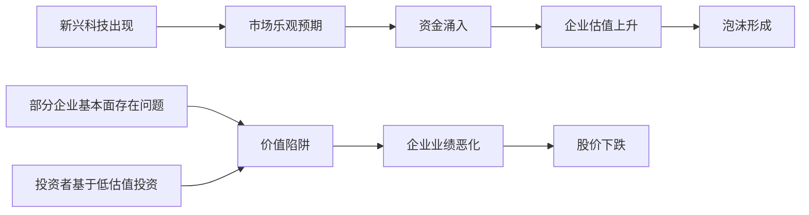

# 彼得林奇的“价值陷阱”在新兴科技泡沫中的识别技巧

> 关键词：彼得林奇、价值陷阱、新兴科技泡沫、识别技巧、投资策略

> 摘要：本文聚焦于彼得林奇提出的“价值陷阱”概念在新兴科技泡沫背景下的识别技巧。首先介绍相关背景知识，包括目的、预期读者等内容。接着阐述核心概念及联系，深入剖析“价值陷阱”和新兴科技泡沫的原理与架构。通过核心算法原理和数学模型的讲解，从理论层面加深对其的理解。以实际项目案例展示在新兴科技领域中如何运用相关技巧识别“价值陷阱”。探讨实际应用场景，为投资者提供参考。推荐学习、开发相关的工具和资源，助力读者进一步研究。最后总结未来发展趋势与挑战，解答常见问题，并提供扩展阅读与参考资料，旨在帮助投资者在新兴科技泡沫中准确识别“价值陷阱”，做出明智的投资决策。

## 1. 背景介绍 
### 1.1 目的和范围
在当今快速发展的科技时代，新兴科技领域不断涌现出各种创新和投资机会。然而，随之而来的是新兴科技泡沫的频繁出现，投资者在追求高回报的过程中面临着巨大的风险。彼得林奇提出的“价值陷阱”概念为我们识别这些风险提供了重要的理论基础。本文的目的在于深入探讨在新兴科技泡沫的背景下，如何运用彼得林奇的“价值陷阱”理论来识别投资中的潜在风险，为投资者提供实用的识别技巧和决策依据。范围涵盖新兴科技的多个领域，包括但不限于人工智能、区块链、生物技术等热门领域。

### 1.2 预期读者
本文预期读者主要包括投资者、金融从业者、对新兴科技和投资领域感兴趣的研究人员以及相关专业的学生。对于投资者而言，能够帮助他们在复杂的新兴科技投资市场中避免陷入“价值陷阱”，提高投资决策的准确性和成功率；金融从业者可以从中获取新的分析视角和方法，为客户提供更专业的投资建议；研究人员和学生则可以深入了解“价值陷阱”理论在新兴科技领域的应用，丰富学术研究和知识储备。

### 1.3 文档结构概述
本文将按照以下结构展开：首先介绍背景知识，让读者对研究的目的、读者对象和文档结构有清晰的认识；接着阐述核心概念与联系，明确“价值陷阱”和新兴科技泡沫的定义、原理及相互关系；通过核心算法原理和数学模型的讲解，从技术层面深入分析识别“价值陷阱”的方法；以项目实战案例展示实际操作过程和代码实现；探讨实际应用场景，为读者提供实际参考；推荐相关的学习资源、开发工具和论文著作，帮助读者进一步学习和研究；最后总结未来发展趋势与挑战，解答常见问题，并提供扩展阅读与参考资料。

### 1.4 术语表
#### 1.4.1 核心术语定义
- **价值陷阱**：指投资者基于公司的低估值（如低市盈率、低市净率等）而认为该股票具有投资价值，但实际上公司的基本面存在严重问题，未来业绩可能持续恶化，导致股票价格长期无法上涨，甚至进一步下跌，使投资者陷入投资困境。
- **新兴科技泡沫**：在新兴科技领域，由于市场对新技术的过度乐观预期和追捧，大量资金涌入，导致相关企业的估值远远超过其实际价值。当市场预期发生变化或新技术发展不及预期时，泡沫破裂，企业股价大幅下跌。

#### 1.4.2 相关概念解释
- **市盈率（P/E）**：是指股票价格除以每股收益（EPS）的比率，反映了市场对公司盈利的预期和估值水平。一般来说，较低的市盈率被认为是股票被低估的表现，但在“价值陷阱”中，低市盈率可能是公司业绩不佳的信号。
- **市净率（P/B）**：是指股票价格与每股净资产的比率，用于衡量公司的净资产价值。低市净率可能表示公司的资产被低估，但也可能意味着公司的资产质量存在问题。

#### 1.4.3 缩略词列表
- **EPS**：Earnings Per Share，每股收益
- **P/E**：Price-to-Earnings Ratio，市盈率
- **P/B**：Price-to-Book Ratio，市净率

## 2. 核心概念与联系 

### 2.1 彼得林奇的“价值陷阱”原理
彼得林奇在其投资生涯中发现，很多投资者往往会被股票的低估值所吸引，认为这是一个绝佳的投资机会。然而，这些看似便宜的股票背后可能隐藏着巨大的风险。公司可能面临行业竞争加剧、技术过时、管理不善等问题，导致其未来业绩无法改善，甚至持续下滑。即使股票的估值看起来很低，但由于基本面的恶化，股价也难以提升，投资者就会陷入“价值陷阱”。

### 2.2 新兴科技泡沫的形成机制
新兴科技领域通常具有高创新性、高成长性和不确定性的特点。当一项新技术出现时，市场往往会对其未来的发展前景充满乐观预期，大量投资者纷纷涌入，推动相关企业的股价大幅上涨。同时，一些企业为了迎合市场的预期，可能会夸大自身的技术实力和发展前景，进一步加剧了市场的狂热情绪。随着资金的不断涌入，企业的估值逐渐偏离其实际价值，形成泡沫。当市场发现新技术的发展不及预期或出现新的竞争技术时，投资者的信心受到打击，资金开始撤离，泡沫破裂。

### 2.3 两者的联系
在新兴科技泡沫中，“价值陷阱”更容易出现。由于市场对新兴科技的过度追捧，一些技术实力不强、商业模式不清晰的企业也能获得较高的估值。当泡沫破裂时，这些企业的真实价值暴露出来，投资者发现其基本面存在严重问题，股价大幅下跌，从而陷入“价值陷阱”。例如，在互联网泡沫时期，许多互联网公司的股价被炒得很高，但实际上这些公司大多没有盈利能力，最终泡沫破裂，很多投资者损失惨重。

### 2.4 文本示意图
“价值陷阱”与新兴科技泡沫的关系可以用以下文本示意图表示：

新兴科技出现 -> 市场乐观预期 -> 资金涌入 -> 企业估值上升 -> 泡沫形成
 |
 | 部分企业基本面存在问题
 v
价值陷阱：投资者基于低估值投资 -> 企业业绩恶化 -> 股价下跌

### 2.5 Mermaid 流程图


## 3. 核心算法原理 & 具体操作步骤 

### 3.1 核心算法原理
在识别新兴科技泡沫中的“价值陷阱”时，我们可以运用一些基于财务数据和市场指标的算法。其中，一个重要的算法是通过分析企业的财务比率和增长趋势来评估其基本面的健康状况。具体来说，我们可以计算企业的市盈率、市净率、净资产收益率（ROE）等指标，并与同行业的平均水平进行比较。同时，观察企业的营业收入、净利润等指标的增长趋势，判断其是否具有可持续性。

### 3.2 Python 源代码实现
以下是一个简单的 Python 代码示例，用于计算企业的市盈率、市净率和净资产收益率，并与同行业平均水平进行比较：

```python
import pandas as pd

# 定义企业财务数据类
class CompanyFinancialData:
    def __init__(self, stock_price, earnings_per_share, book_value_per_share, net_income, shareholders_equity):
        self.stock_price = stock_price
        self.earnings_per_share = earnings_per_share
        self.book_value_per_share = book_value_per_share
        self.net_income = net_income
        self.shareholders_equity = shareholders_equity

    # 计算市盈率
    def calculate_pe_ratio(self):
        if self.earnings_per_share != 0:
            return self.stock_price / self.earnings_per_share
        else:
            return None

    # 计算市净率
    def calculate_pb_ratio(self):
        if self.book_value_per_share != 0:
            return self.stock_price / self.book_value_per_share
        else:
            return None

    # 计算净资产收益率
    def calculate_roe(self):
        if self.shareholders_equity != 0:
            return (self.net_income / self.shareholders_equity) * 100
        else:
            return None

# 定义同行业平均数据类
class IndustryAverageData:
    def __init__(self, avg_pe_ratio, avg_pb_ratio, avg_roe):
        self.avg_pe_ratio = avg_pe_ratio
        self.avg_pb_ratio = avg_pb_ratio
        self.avg_roe = avg_roe

# 比较企业数据与同行业平均数据
def compare_with_industry(company_data, industry_data):
    company_pe_ratio = company_data.calculate_pe_ratio()
    company_pb_ratio = company_data.calculate_pb_ratio()
    company_roe = company_data.calculate_roe()

    pe_ratio_comparison = None
    pb_ratio_comparison = None
    roe_comparison = None

    if company_pe_ratio is not None:
        pe_ratio_comparison = company_pe_ratio < industry_data.avg_pe_ratio
    if company_pb_ratio is not None:
        pb_ratio_comparison = company_pb_ratio < industry_data.avg_pb_ratio
    if company_roe is not None:
        roe_comparison = company_roe > industry_data.avg_roe

    return pe_ratio_comparison, pb_ratio_comparison, roe_comparison

# 示例数据
company_data = CompanyFinancialData(50, 2, 10, 1000000, 5000000)
industry_data = IndustryAverageData(25, 3, 15)

# 进行比较
pe_ratio_comparison, pb_ratio_comparison, roe_comparison = compare_with_industry(company_data, industry_data)

print(f"市盈率是否低于行业平均水平: {pe_ratio_comparison}")
print(f"市净率是否低于行业平均水平: {pb_ratio_comparison}")
print(f"净资产收益率是否高于行业平均水平: {roe_comparison}")
```

### 3.3 具体操作步骤
1. **数据收集**：收集目标企业的财务数据，包括股票价格、每股收益、每股净资产、净利润、股东权益等。同时，收集同行业的平均财务数据，如平均市盈率、平均市净率、平均净资产收益率等。
2. **计算指标**：使用上述 Python 代码中的方法，计算目标企业的市盈率、市净率和净资产收益率。
3. **比较分析**：将目标企业的各项指标与同行业平均水平进行比较。如果企业的市盈率和市净率低于行业平均水平，且净资产收益率高于行业平均水平，则说明该企业可能具有较好的投资价值；反之，如果企业的指标与行业平均水平相差较大，且存在业绩下滑等问题，则可能存在“价值陷阱”。
4. **综合判断**：除了财务指标外，还需要结合企业的行业前景、技术实力、管理团队等因素进行综合判断，以更准确地识别“价值陷阱”。

## 4. 数学模型和公式 & 详细讲解 & 举例说明 

### 4.1 市盈率（P/E）
#### 4.1.1 公式
市盈率的计算公式为：
$$P/E = \frac{股票价格}{每股收益}$$

#### 4.1.2 详细讲解
市盈率反映了市场对公司盈利的预期和估值水平。一般来说，较低的市盈率被认为是股票被低估的表现，但在“价值陷阱”中，低市盈率可能是公司业绩不佳的信号。例如，一家公司的股票价格为 20 元，每股收益为 1 元，则其市盈率为 20 倍。如果同行业的平均市盈率为 30 倍，该公司的市盈率相对较低。但如果该公司的业绩处于下滑趋势，未来每股收益可能会进一步降低，那么即使市盈率看起来很低，也可能存在“价值陷阱”。

### 4.2 市净率（P/B）
#### 4.2.1 公式
市净率的计算公式为：
$$P/B = \frac{股票价格}{每股净资产}$$

#### 4.2.2 详细讲解
市净率用于衡量公司的净资产价值。低市净率可能表示公司的资产被低估，但也可能意味着公司的资产质量存在问题。例如，一家公司的股票价格为 10 元，每股净资产为 5 元，则其市净率为 2 倍。如果同行业的平均市净率为 3 倍，该公司的市净率相对较低。但如果该公司的资产存在大量的不良资产或过时设备，那么即使市净率低，也可能存在“价值陷阱”。

### 4.3 净资产收益率（ROE）
#### 4.3.1 公式
净资产收益率的计算公式为：
$$ROE = \frac{净利润}{股东权益} \times 100\%$$

#### 4.3.2 详细讲解
净资产收益率反映了公司运用自有资本的效率。较高的净资产收益率通常表示公司具有较好的盈利能力和管理水平。例如，一家公司的净利润为 100 万元，股东权益为 500 万元，则其净资产收益率为 20%。如果同行业的平均净资产收益率为 15%，该公司的净资产收益率相对较高，说明其盈利能力较强。但如果该公司的高净资产收益率是通过过度负债或短期行为实现的，那么也可能存在潜在风险。

### 4.4 举例说明
假设我们有两家新兴科技公司 A 和 B，其财务数据如下：

| 公司 | 股票价格（元） | 每股收益（元） | 每股净资产（元） | 净利润（万元） | 股东权益（万元） |
| ---- | ---- | ---- | ---- | ---- | ---- |
| A | 50 | 2 | 10 | 1000 | 5000 |
| B | 30 | 1 | 5 | 500 | 2500 |

同行业的平均市盈率为 25 倍，平均市净率为 3 倍，平均净资产收益率为 15%。

- **公司 A**：
    - 市盈率：$P/E = \frac{50}{2} = 25$ 倍，与行业平均水平持平。
    - 市净率：$P/B = \frac{50}{10} = 5$ 倍，高于行业平均水平。
    - 净资产收益率：$ROE = \frac{1000}{5000} \times 100\% = 20\%$，高于行业平均水平。

- **公司 B**：
    - 市盈率：$P/E = \frac{30}{1} = 30$ 倍，高于行业平均水平。
    - 市净率：$P/B = \frac{30}{5} = 6$ 倍，高于行业平均水平。
    - 净资产收益率：$ROE = \frac{500}{2500} \times 100\% = 20\%$，高于行业平均水平。

从上述计算结果来看，公司 A 的市盈率与行业平均水平持平，但市净率较高；公司 B 的市盈率和市净率都高于行业平均水平。虽然两家公司的净资产收益率都高于行业平均水平，但综合考虑市盈率和市净率，公司 A 和 B 都可能存在一定的估值风险，需要进一步结合其他因素进行分析，以判断是否存在“价值陷阱”。

## 5. 项目实战：代码实际案例和详细解释说明 

### 5.1 开发环境搭建
在进行项目实战之前，我们需要搭建相应的开发环境。以下是具体的步骤：

#### 5.1.1 安装 Python
首先，我们需要安装 Python 编程语言。可以从 Python 官方网站（https://www.python.org/downloads/）下载适合自己操作系统的 Python 安装包，并按照安装向导进行安装。

#### 5.1.2 安装开发工具
推荐使用 PyCharm 作为开发工具。可以从 JetBrains 官方网站（https://www.jetbrains.com/pycharm/download/）下载 PyCharm 社区版或专业版，并进行安装。

#### 5.1.3 安装必要的库
在项目中，我们需要使用 pandas 库来处理数据。可以使用以下命令来安装 pandas 库：
```sh
pip install pandas
```

### 5.2 源代码详细实现和代码解读
以下是一个完整的 Python 代码示例，用于识别新兴科技公司中的“价值陷阱”：

```python
import pandas as pd

# 定义企业财务数据类
class CompanyFinancialData:
    def __init__(self, stock_price, earnings_per_share, book_value_per_share, net_income, shareholders_equity):
        self.stock_price = stock_price
        self.earnings_per_share = earnings_per_share
        self.book_value_per_share = book_value_per_share
        self.net_income = net_income
        self.shareholders_equity = shareholders_equity

    # 计算市盈率
    def calculate_pe_ratio(self):
        if self.earnings_per_share != 0:
            return self.stock_price / self.earnings_per_share
        else:
            return None

    # 计算市净率
    def calculate_pb_ratio(self):
        if self.book_value_per_share != 0:
            return self.stock_price / self.book_value_per_share
        else:
            return None

    # 计算净资产收益率
    def calculate_roe(self):
        if self.shareholders_equity != 0:
            return (self.net_income / self.shareholders_equity) * 100
        else:
            return None

# 定义同行业平均数据类
class IndustryAverageData:
    def __init__(self, avg_pe_ratio, avg_pb_ratio, avg_roe):
        self.avg_pe_ratio = avg_pe_ratio
        self.avg_pb_ratio = avg_pb_ratio
        self.avg_roe = avg_roe

# 比较企业数据与同行业平均数据
def compare_with_industry(company_data, industry_data):
    company_pe_ratio = company_data.calculate_pe_ratio()
    company_pb_ratio = company_data.calculate_pb_ratio()
    company_roe = company_data.calculate_roe()

    pe_ratio_comparison = None
    pb_ratio_comparison = None
    roe_comparison = None

    if company_pe_ratio is not None:
        pe_ratio_comparison = company_pe_ratio < industry_data.avg_pe_ratio
    if company_pb_ratio is not None:
        pb_ratio_comparison = company_pb_ratio < industry_data.avg_pb_ratio
    if company_roe is not None:
        roe_comparison = company_roe > industry_data.avg_roe

    return pe_ratio_comparison, pb_ratio_comparison, roe_comparison

# 识别“价值陷阱”
def identify_value_trap(company_data, industry_data):
    pe_ratio_comparison, pb_ratio_comparison, roe_comparison = compare_with_industry(company_data, industry_data)

    if pe_ratio_comparison and pb_ratio_comparison and not roe_comparison:
        return True
    else:
        return False

# 示例数据
company_data = CompanyFinancialData(50, 2, 10, 1000000, 5000000)
industry_data = IndustryAverageData(25, 3, 15)

# 识别“价值陷阱”
is_value_trap = identify_value_trap(company_data, industry_data)

print(f"该公司是否存在“价值陷阱”: {is_value_trap}")
```

### 5.3 代码解读与分析
1. **CompanyFinancialData 类**：该类用于存储企业的财务数据，并提供计算市盈率、市净率和净资产收益率的方法。
2. **IndustryAverageData 类**：该类用于存储同行业的平均财务数据。
3. **compare_with_industry 函数**：该函数用于比较企业的财务指标与同行业平均水平，并返回比较结果。
4. **identify_value_trap 函数**：该函数根据比较结果判断企业是否存在“价值陷阱”。如果企业的市盈率和市净率低于行业平均水平，但净资产收益率低于行业平均水平，则认为该企业存在“价值陷阱”。
5. **示例数据和调用**：我们定义了一个示例企业的财务数据和同行业的平均数据，并调用 `identify_value_trap` 函数来判断该企业是否存在“价值陷阱”。

通过上述代码，我们可以在实际项目中对新兴科技公司的财务数据进行分析，识别可能存在的“价值陷阱”，为投资决策提供参考。

## 6. 实际应用场景 
### 6.1 个人投资者
对于个人投资者来说，在投资新兴科技股票时，运用彼得林奇的“价值陷阱”识别技巧可以帮助他们避免盲目跟风投资，降低投资风险。例如，当市场上出现新兴科技热点时，个人投资者可以通过分析相关企业的财务数据和行业前景，判断其是否存在“价值陷阱”，从而做出更明智的投资决策。

### 6.2 机构投资者
机构投资者在进行大规模投资时，更需要准确识别“价值陷阱”。通过建立专业的分析模型和团队，机构投资者可以对新兴科技企业进行全面深入的研究，运用“价值陷阱”识别技巧筛选出具有投资价值的企业，优化投资组合，提高投资回报率。

### 6.3 金融分析师
金融分析师可以利用“价值陷阱”识别技巧为客户提供专业的投资建议。他们可以对新兴科技行业进行跟踪和研究，分析企业的财务状况和发展前景，及时发现潜在的“价值陷阱”，并向客户发出风险预警。

### 6.4 企业管理者
企业管理者也可以运用“价值陷阱”的概念来审视自身企业的发展状况。通过与同行业企业进行比较，分析自身的财务指标和市场竞争力，发现潜在的问题和风险，及时调整企业战略，避免陷入“价值陷阱”。

## 7. 工具和资源推荐
### 7.1 学习资源推荐
#### 7.1.1 书籍推荐
- 《彼得林奇的成功投资》：彼得林奇的经典著作，详细介绍了他的投资理念和方法，包括如何识别“价值陷阱”等内容。
- 《聪明的投资者》：本杰明·格雷厄姆的著作，被誉为投资领域的圣经，对价值投资的理论和实践进行了深入阐述。
- 《金融炼金术》：乔治·索罗斯的著作，介绍了他的投资哲学和对市场的理解，对理解新兴科技泡沫和“价值陷阱”有一定的帮助。

#### 7.1.2 在线课程
- Coursera 上的“投资学原理”课程：由知名大学教授授课，系统介绍投资学的基本原理和方法。
- edX 上的“金融市场”课程：提供对金融市场的深入分析和解读，包括新兴科技领域的投资机会和风险。
- 中国大学 MOOC 上的“证券投资学”课程：结合中国市场的实际情况，介绍证券投资的相关知识和技巧。

#### 7.1.3 技术博客和网站
- 雪球网：一个专注于投资交流的社区，有大量的投资者分享投资经验和对新兴科技企业的分析。
- 东方财富网：提供丰富的金融资讯和数据，包括新兴科技行业的企业财务数据和市场行情。
- Seeking Alpha：一个国际知名的投资研究网站，有许多专业的分析师发表对新兴科技企业的研究报告和投资建议。

### 7.2 开发工具框架推荐
#### 7.2.1 IDE和编辑器
- PyCharm：功能强大的 Python 集成开发环境，提供代码编辑、调试、版本控制等功能，适合开发投资分析相关的 Python 代码。
- Jupyter Notebook：一个交互式的开发环境，适合进行数据分析和可视化，方便对新兴科技企业的财务数据进行分析和展示。

#### 7.2.2 调试和性能分析工具
- pdb：Python 内置的调试工具，可以帮助开发者逐步调试代码，找出问题所在。
- cProfile：Python 标准库中的性能分析工具，可以分析代码的运行时间和性能瓶颈，优化投资分析代码的性能。

#### 7.2.3 相关框架和库
- pandas：一个强大的数据处理和分析库，提供了丰富的数据结构和函数，方便对新兴科技企业的财务数据进行处理和分析。
- numpy：一个用于科学计算的 Python 库，提供了高效的数组操作和数学函数，在投资分析中可以用于计算财务指标和进行数据建模。
- matplotlib：一个用于数据可视化的 Python 库，可以将分析结果以图表的形式展示出来，直观地呈现新兴科技企业的财务状况和发展趋势。

### 7.3 相关论文著作推荐
#### 7.3.1 经典论文
- Fama, E. F., & French, K. R. (1992). The cross-section of expected stock returns. The Journal of Finance, 47(2), 427-465. 该论文提出了著名的 Fama-French 三因子模型，对股票收益率的影响因素进行了深入研究，对理解新兴科技企业的估值和投资风险有重要意义。
- Shiller, R. J. (2000). Irrational Exuberance. Princeton University Press. 该书对股票市场的泡沫现象进行了深入分析，探讨了市场情绪和投资者行为对股价的影响，对识别新兴科技泡沫有一定的启示作用。

#### 7.3.2 最新研究成果
- 关注顶级金融学术期刊，如 The Journal of Finance、The Review of Financial Studies 等，这些期刊会发表关于新兴科技投资和“价值陷阱”的最新研究成果。
- 参加金融学术会议，如美国金融协会（AFA）年会、西部金融协会（WFA）年会等，了解学术界对新兴科技投资领域的最新研究动态。

#### 7.3.3 应用案例分析
- 阅读专业的金融研究报告和案例分析，如麦肯锡、波士顿咨询等咨询公司发布的关于新兴科技行业的研究报告，了解实际案例中如何识别和应对“价值陷阱”。
- 分析上市公司的年报和财务报表，结合市场行情和行业动态，研究新兴科技企业的发展历程和投资风险，从中总结经验教训。

## 8. 总结：未来发展趋势与挑战
### 8.1 未来发展趋势
- **科技创新加速**：随着科技的不断进步，新兴科技领域将继续涌现出更多的创新技术和商业模式。这将为投资者带来更多的投资机会，但也会增加“价值陷阱”的识别难度。例如，人工智能、量子计算等前沿技术的发展，其应用前景和商业价值难以准确评估，投资者需要更加谨慎地判断。
- **数据驱动决策**：大数据、人工智能等技术的发展将使投资决策更加数据驱动。通过收集和分析大量的企业财务数据、市场数据和行业数据，投资者可以更准确地识别“价值陷阱”。例如，利用机器学习算法对新兴科技企业的财务指标进行预测和分析，提高投资决策的准确性。
- **跨领域融合**：新兴科技领域与传统行业的融合将越来越深入。这种跨领域融合将创造出更多的投资机会，但也会带来新的风险和挑战。例如，科技与金融的融合产生了金融科技，投资者需要同时了解科技和金融两个领域的知识，才能准确识别其中的“价值陷阱”。

### 8.2 挑战
- **信息不对称**：在新兴科技领域，企业的技术实力、发展前景等信息往往存在严重的不对称性。一些企业可能会夸大自身的优势和潜力，误导投资者。投资者需要花费更多的时间和精力来获取准确的信息，以识别“价值陷阱”。
- **技术不确定性**：新兴科技的发展具有很大的不确定性，技术可能会面临失败或被替代的风险。例如，一些新兴的生物技术公司可能在研发过程中遇到技术难题，导致产品无法上市或商业化失败。投资者需要对技术的发展趋势有深入的了解，才能判断企业是否存在“价值陷阱”。
- **市场情绪影响**：新兴科技泡沫往往伴随着市场的狂热情绪，投资者容易受到情绪的影响而做出非理性的投资决策。在市场情绪高涨时，投资者可能会忽视企业的基本面问题，盲目追高，从而陷入“价值陷阱”。投资者需要保持理性和冷静，不受市场情绪的左右。

## 9. 附录：常见问题与解答
### 9.1 如何准确收集新兴科技企业的财务数据？
可以通过以下途径收集新兴科技企业的财务数据：
- **公司官网**：企业通常会在其官方网站上公布定期报告和财务报表，这是获取企业财务数据的重要来源。
- **证券交易所网站**：上市公司的财务数据会在证券交易所网站上进行披露，可以查询相关企业的年报、中报和季报等。
- **金融数据提供商**：如 Wind、Bloomberg 等金融数据提供商，提供全面、准确的企业财务数据和市场信息。

### 9.2 除了财务指标，还需要考虑哪些因素来识别“价值陷阱”？
除了财务指标外，还需要考虑以下因素：
- **行业前景**：分析新兴科技行业的发展趋势和市场规模，判断企业所处的行业是否具有良好的发展前景。
- **技术实力**：评估企业的技术研发能力、创新能力和技术壁垒，判断其技术是否具有竞争力。
- **管理团队**：考察企业的管理团队的背景、经验和能力，判断其是否能够有效地领导企业发展。
- **竞争环境**：分析企业所处的竞争环境，了解其竞争对手的情况，判断企业是否具有竞争优势。

### 9.3 如何判断新兴科技泡沫是否即将破裂？
判断新兴科技泡沫是否即将破裂是一个复杂的问题，需要综合考虑以下因素：
- **市场估值**：当新兴科技企业的估值普遍过高，远远超过其实际价值时，可能预示着泡沫即将破裂。
- **政策变化**：政府的政策调整可能会对新兴科技行业产生重大影响。如果政策收紧，可能会导致资金撤离，泡沫破裂。
- **技术发展**：如果新兴科技的发展不及预期，或者出现新的竞争技术，可能会导致市场信心下降，泡沫破裂。
- **市场情绪**：当市场情绪过度乐观，投资者普遍盲目追高时，可能是泡沫即将破裂的信号。

## 10. 扩展阅读 & 参考资料
### 10.1 扩展阅读
- 《创新者的窘境》：克莱顿·克里斯坦森的著作，探讨了创新对企业和行业的影响，对理解新兴科技企业的发展和风险有一定的帮助。
- 《黑天鹅》：纳西姆·尼古拉斯·塔勒布的著作，介绍了不可预测的重大事件对金融市场的影响，提醒投资者要关注极端风险。

### 10.2 参考资料
- 彼得林奇相关的官方网站和研究报告。
- 各大金融机构发布的关于新兴科技行业的研究报告和投资策略。
- 相关学术期刊上发表的关于投资分析、新兴科技和“价值陷阱”的学术论文。