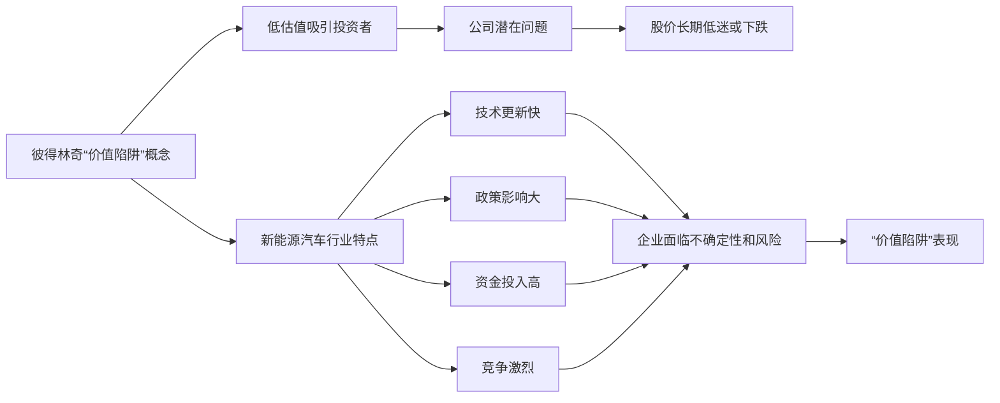

# 彼得林奇的“价值陷阱”在新能源汽车行业中的识别指标

> 关键词：彼得林奇、价值陷阱、新能源汽车行业、识别指标、投资分析

> 摘要：本文聚焦于彼得林奇提出的“价值陷阱”概念在新能源汽车行业中的应用。首先介绍了“价值陷阱”的背景及在新能源汽车行业研究此问题的重要性，接着阐述相关核心概念及其联系，深入剖析用于识别新能源汽车行业“价值陷阱”的核心算法原理与具体操作步骤，同时给出对应的数学模型和公式并举例说明。通过项目实战展示代码案例及详细解读，探讨该概念在实际新能源汽车行业的应用场景，推荐相关学习工具和资源，最后总结新能源汽车行业“价值陷阱”识别的未来发展趋势与挑战，解答常见问题并提供扩展阅读和参考资料，旨在为投资者和行业从业者提供全面、深入的分析与指导，助力准确识别新能源汽车行业中的“价值陷阱”。

## 1. 背景介绍 
### 1.1 目的和范围
在当今全球大力发展可持续能源的背景下，新能源汽车行业呈现出蓬勃发展的态势。众多投资者纷纷将目光投向这一具有巨大潜力的领域，然而，投资过程中充满了各种风险，其中“价值陷阱”是一个不容忽视的问题。本文的目的在于深入探讨彼得林奇的“价值陷阱”概念在新能源汽车行业中的具体表现形式，并找出能够有效识别这些“价值陷阱”的指标。研究范围涵盖新能源汽车产业链的各个环节，包括整车制造、电池生产、充电桩建设等，旨在为投资者和行业从业者提供全面、系统的分析和参考。

### 1.2 预期读者
本文的预期读者主要包括对新能源汽车行业有投资意向的投资者，无论是个人投资者还是机构投资者，都可以从本文中获取有关“价值陷阱”识别的知识和方法，从而做出更明智的投资决策。同时，新能源汽车行业的从业者，如企业管理人员、行业分析师等，也可以通过本文加深对行业风险的认识，为企业的战略规划和发展提供参考。此外，对金融投资和行业分析感兴趣的学者和研究人员也可以将本文作为研究新能源汽车行业投资风险的参考资料。

### 1.3 文档结构概述
本文将按照以下结构展开：首先介绍背景信息，包括研究的目的、范围、预期读者和文档结构概述，以及相关术语的定义和解释。接着阐述“价值陷阱”的核心概念及其与新能源汽车行业的联系，通过文本示意图和 Mermaid 流程图进行直观展示。然后深入分析识别“价值陷阱”的核心算法原理和具体操作步骤，并给出 Python 源代码进行详细阐述。随后介绍相关的数学模型和公式，并通过具体例子进行说明。在项目实战部分，展示代码实际案例并进行详细解释和分析。接着探讨“价值陷阱”在新能源汽车行业的实际应用场景。之后推荐相关的学习工具和资源，包括书籍、在线课程、技术博客和网站，以及开发工具框架和相关论文著作。最后总结新能源汽车行业“价值陷阱”识别的未来发展趋势与挑战，解答常见问题并提供扩展阅读和参考资料。

### 1.4 术语表
#### 1.4.1 核心术语定义
- **彼得林奇的“价值陷阱”**：指投资者在投资过程中，基于公司的低估值等表面因素而买入股票，但由于公司存在潜在的问题，如行业竞争加剧、技术落后、财务造假等，导致公司股价长期低迷甚至下跌，投资者陷入价值投资的误区。
- **新能源汽车**：采用非常规的车用燃料（如电力、氢气等）作为动力来源，综合车辆的动力控制和驱动方面的先进技术，形成的技术原理先进、具有新技术、新结构的汽车。
- **识别指标**：用于判断新能源汽车行业中是否存在“价值陷阱”的一系列量化或非量化的标准和参数。

#### 1.4.2 相关概念解释
- **行业竞争格局**：指新能源汽车行业中各企业之间的市场份额、竞争优势、竞争策略等方面的关系和态势。
- **技术创新能力**：新能源汽车企业在电池技术、自动驾驶技术、智能网联技术等方面的研发能力和创新水平。
- **财务健康状况**：企业的资产负债结构、盈利能力、现金流状况等方面的综合表现，反映企业的财务稳定性和可持续发展能力。

#### 1.4.3 缩略词列表
- **EV**：Electric Vehicle，电动汽车
- **HEV**：Hybrid Electric Vehicle，混合动力汽车
- **PHEV**：Plug - in Hybrid Electric Vehicle，插电式混合动力汽车
- **BMS**：Battery Management System，电池管理系统

## 2. 核心概念与联系 

### 彼得林奇“价值陷阱”的核心原理
彼得林奇认为，投资者往往会被公司的低市盈率、低市净率等低估值指标所吸引，认为这些公司具有投资价值。然而，这些低估值可能是由于公司面临着一些难以解决的问题，如行业衰退、竞争劣势、管理不善等，导致公司的盈利能力无法提升，甚至持续下降。投资者买入这些公司的股票后，可能会发现股价长期不涨甚至下跌，从而陷入“价值陷阱”。

### 新能源汽车行业的特点
新能源汽车行业是一个新兴的、快速发展的行业，具有技术更新换代快、政策影响大、资金投入高、竞争激烈等特点。这些特点使得新能源汽车行业的企业面临着更多的不确定性和风险。例如，技术的快速更新可能导致企业的产品迅速过时，政策的变化可能影响企业的市场需求和盈利能力，激烈的竞争可能导致企业的市场份额下降和利润空间压缩。

### 两者的联系
在新能源汽车行业中，“价值陷阱”可能表现为一些企业虽然表面上具有较低的估值，但实际上存在着技术落后、市场竞争力不足、财务状况不佳等问题。投资者如果仅仅根据低估值指标就投资这些企业，可能会陷入“价值陷阱”。例如，一些新能源汽车企业可能由于技术研发能力不足，无法跟上行业的技术发展步伐，导致产品性能落后，市场需求下降，从而影响企业的盈利能力和股价表现。

### 文本示意图
```plaintext
彼得林奇“价值陷阱”概念
|
|-- 低估值吸引投资者
|   |
|   |-- 公司潜在问题（行业竞争、技术落后、财务造假等）
|       |
|       |-- 股价长期低迷或下跌
|
|-- 新能源汽车行业特点
    |
    |-- 技术更新快
    |-- 政策影响大
    |-- 资金投入高
    |-- 竞争激烈
    |
    |-- 导致行业企业面临不确定性和风险
    |
    |-- “价值陷阱”表现（技术落后、竞争力不足、财务不佳等）
```

### Mermaid 流程图


## 3. 核心算法原理 & 具体操作步骤 

### 核心算法原理
我们可以通过构建一个综合评估模型来识别新能源汽车行业中的“价值陷阱”。该模型将考虑多个因素，包括企业的财务指标、技术创新能力、市场竞争力等。具体来说，我们可以使用加权平均的方法，为每个因素分配一个权重，然后计算每个企业的综合得分。得分较低的企业可能存在“价值陷阱”的风险。

### Python 源代码实现
```python
import pandas as pd

# 定义各个因素的权重
weights = {
    '财务指标': 0.4,
    '技术创新能力': 0.3,
    '市场竞争力': 0.3
}

# 示例数据，假设有三个企业
data = {
    '企业名称': ['企业A', '企业B', '企业C'],
    '财务指标得分': [70, 60, 50],
    '技术创新能力得分': [80, 70, 60],
    '市场竞争力得分': [75, 65, 55]
}

df = pd.DataFrame(data)

# 计算综合得分
df['综合得分'] = df['财务指标得分'] * weights['财务指标'] + \
                  df['技术创新能力得分'] * weights['技术创新能力'] + \
                  df['市场竞争力得分'] * weights['市场竞争力']

# 按照综合得分排序
df = df.sort_values(by='综合得分', ascending=False)

print(df)
```

### 具体操作步骤
1. **数据收集**：收集新能源汽车企业的相关数据，包括财务报表、技术研发投入、市场份额等。
2. **指标量化**：将收集到的数据转化为具体的指标得分，例如将财务报表中的各项指标转化为财务指标得分，将技术研发投入和成果转化为技术创新能力得分，将市场份额和品牌影响力转化为市场竞争力得分。
3. **权重确定**：根据各个因素对企业价值的影响程度，确定每个因素的权重。
4. **综合得分计算**：使用加权平均的方法，计算每个企业的综合得分。
5. **风险评估**：根据综合得分，对企业进行风险评估。得分较低的企业可能存在“价值陷阱”的风险，需要进一步深入分析。

## 4. 数学模型和公式 & 详细讲解 & 举例说明 

### 数学模型
设企业的综合得分为 $S$，财务指标得分为 $F$，技术创新能力得分为 $T$，市场竞争力得分为 $M$，财务指标权重为 $w_F$，技术创新能力权重为 $w_T$，市场竞争力权重为 $w_M$，则综合得分的计算公式为：

$$S = w_F \times F+ w_T \times T + w_M \times M$$

其中，$w_F + w_T + w_M = 1$。

### 详细讲解
这个数学模型的核心思想是通过加权平均的方法，综合考虑多个因素对企业价值的影响。每个因素的权重反映了该因素在评估企业价值时的重要程度。财务指标得分反映了企业的财务健康状况，技术创新能力得分反映了企业的技术研发能力和创新水平，市场竞争力得分反映了企业在市场中的地位和竞争优势。通过将这三个因素的得分加权平均，可以得到一个综合得分，用于评估企业的整体价值和风险。

### 举例说明
假设某新能源汽车企业的财务指标得分 $F = 75$，技术创新能力得分 $T = 80$，市场竞争力得分 $M = 70$，财务指标权重 $w_F = 0.4$，技术创新能力权重 $w_T = 0.3$，市场竞争力权重 $w_M = 0.3$。则该企业的综合得分 $S$ 为：

$$S = 0.4\times75 + 0.3\times80 + 0.3\times70$$
$$S = 30+24 + 21$$
$$S = 75$$

如果我们设定综合得分低于 60 分的企业存在“价值陷阱”的风险，那么该企业的综合得分 75 分高于 60 分，暂时不存在“价值陷阱”的风险。但这只是一个简单的示例，实际应用中需要根据具体情况进行更深入的分析和评估。

## 5. 项目实战：代码实际案例和详细解释说明 

### 5.1  开发环境搭建
- **Python 安装**：首先需要安装 Python 环境，建议安装 Python 3.7 及以上版本。可以从 Python 官方网站（https://www.python.org/downloads/）下载安装包，按照安装向导进行安装。
- **依赖库安装**：本项目需要使用 `pandas` 库进行数据处理。可以使用以下命令进行安装：
```sh
pip install pandas
```

### 5.2  源代码详细实现和代码解读
```python
import pandas as pd

# 定义各个因素的权重
weights = {
    '财务指标': 0.4,
    '技术创新能力': 0.3,
    '市场竞争力': 0.3
}

# 读取数据文件，假设数据文件为 csv 格式
data = pd.read_csv('new_energy_vehicle_data.csv')

# 计算综合得分
data['综合得分'] = data['财务指标得分'] * weights['财务指标'] + \
                  data['技术创新能力得分'] * weights['技术创新能力'] + \
                  data['市场竞争力得分'] * weights['市场竞争力']

# 按照综合得分排序
data = data.sort_values(by='综合得分', ascending=False)

# 保存结果到新的 csv 文件
data.to_csv('result.csv', index=False)

print("处理完成，结果已保存到 result.csv 文件中。")
```

### 代码解读与分析
1. **导入库**：使用 `import pandas as pd` 导入 `pandas` 库，用于数据处理和分析。
2. **定义权重**：定义一个字典 `weights`，包含财务指标、技术创新能力和市场竞争力三个因素的权重。
3. **读取数据**：使用 `pd.read_csv('new_energy_vehicle_data.csv')` 读取存储新能源汽车企业数据的 csv 文件。
4. **计算综合得分**：根据前面介绍的数学模型，使用加权平均的方法计算每个企业的综合得分，并将结果存储在新的列 `综合得分` 中。
5. **排序**：使用 `data.sort_values(by='综合得分', ascending=False)` 按照综合得分对企业进行降序排序。
6. **保存结果**：使用 `data.to_csv('result.csv', index=False)` 将处理后的结果保存到新的 csv 文件中，方便后续分析和查看。

## 6. 实际应用场景 
### 投资决策
投资者在选择新能源汽车行业的投资标的时，可以使用本文介绍的方法和指标来识别“价值陷阱”。通过对企业的财务指标、技术创新能力和市场竞争力等因素进行综合评估，投资者可以避免投资那些表面上低估值但实际上存在潜在问题的企业，从而提高投资的成功率。

### 企业战略规划
新能源汽车企业可以使用这些指标来评估自身的竞争力和风险。通过与行业内其他企业进行对比，企业可以发现自身的优势和不足，从而制定相应的战略规划。例如，如果企业发现自己的技术创新能力得分较低，就可以加大研发投入，提升技术水平；如果市场竞争力得分较低，就可以优化市场策略，提高品牌影响力。

### 行业监管
行业监管部门可以使用这些指标来监测新能源汽车行业的发展状况和风险水平。通过对行业内企业的综合评估，监管部门可以及时发现潜在的风险和问题，采取相应的监管措施，保障行业的健康发展。

## 7. 工具和资源推荐
### 7.1 学习资源推荐
#### 7.1.1 书籍推荐
- 《彼得林奇的成功投资》：彼得林奇的经典著作，详细介绍了他的投资理念和方法，对于理解“价值陷阱”概念具有重要的参考价值。
- 《新能源汽车产业发展报告》：全面介绍了新能源汽车行业的发展现状、趋势和政策，对于了解新能源汽车行业的背景和特点非常有帮助。
- 《财务报表分析》：帮助读者掌握财务报表的分析方法，对于评估企业的财务健康状况至关重要。

#### 7.1.2 在线课程
- Coursera 上的“投资学原理”课程：系统介绍投资学的基本原理和方法，包括价值投资理论。
- edX 上的“新能源汽车技术与产业发展”课程：深入讲解新能源汽车的技术原理、产业现状和发展趋势。
- 中国大学 MOOC 上的“财务分析与决策”课程：提供财务分析的实用技巧和方法。

#### 7.1.3 技术博客和网站
- 雪球网：提供股票投资的分析和讨论，有很多关于新能源汽车行业的投资分析文章。
- 中国新能源汽车网：专注于新能源汽车行业的资讯和分析，及时报道行业动态和政策变化。
- 汽车之家新能源频道：提供新能源汽车的产品信息、评测和市场分析。

### 7.2 开发工具框架推荐
#### 7.2.1 IDE和编辑器
- PyCharm：一款功能强大的 Python 集成开发环境，提供代码编辑、调试、版本控制等功能。
- Jupyter Notebook：一个交互式的开发环境，适合进行数据探索和分析，方便代码的编写和展示。
- Visual Studio Code：一款轻量级的代码编辑器，支持多种编程语言，具有丰富的插件生态系统。

#### 7.2.2 调试和性能分析工具
- `pdb`：Python 内置的调试器，可以帮助开发者逐步执行代码，查找和解决问题。
- `cProfile`：Python 标准库中的性能分析工具，可以分析代码的执行时间和调用关系，帮助优化代码性能。
- `memory_profiler`：用于分析 Python 代码的内存使用情况，帮助开发者发现内存泄漏和优化内存使用。

#### 7.2.3 相关框架和库
- `pandas`：用于数据处理和分析的 Python 库，提供高效的数据结构和数据操作方法。
- `numpy`：Python 的数值计算库，提供高效的数组操作和数学函数。
- `scikit - learn`：用于机器学习的 Python 库，提供各种机器学习算法和工具，可用于数据挖掘和预测分析。

### 7.3 相关论文著作推荐
#### 7.3.1 经典论文
- “The Value Trap: When Low - Price - to - Earnings Stocks Are Bad Investments”：深入探讨了“价值陷阱”的概念和成因，为本文的研究提供了理论基础。
- “The Development and Future of New Energy Vehicles”：对新能源汽车行业的发展历程、现状和未来趋势进行了全面的分析和展望。

#### 7.3.2 最新研究成果
- 关注《Nature》、《Science》等顶级学术期刊上关于新能源汽车技术和产业发展的最新研究成果。
- 关注行业内知名研究机构发布的研究报告，如麦肯锡、波士顿咨询等。

#### 7.3.3 应用案例分析
- 分析特斯拉、比亚迪等新能源汽车企业的发展历程和投资案例，了解“价值陷阱”在实际企业中的表现和应对策略。
- 研究新能源汽车行业的并购重组案例，分析其中的投资风险和价值评估问题。

## 8. 总结：未来发展趋势与挑战
### 未来发展趋势
- **技术创新加速**：随着科技的不断进步，新能源汽车行业的技术创新将持续加速。电池技术、自动驾驶技术、智能网联技术等将不断取得突破，这将对企业的技术创新能力提出更高的要求。投资者和企业需要密切关注技术发展趋势，及时调整投资策略和企业战略。
- **市场竞争加剧**：新能源汽车市场的竞争将日益激烈，行业集中度将逐渐提高。大型企业将凭借其技术、资金和品牌优势占据更多的市场份额，而一些小型企业可能面临被淘汰的风险。投资者需要更加谨慎地选择投资标的，企业需要不断提升自身的竞争力。
- **政策支持持续**：政府对新能源汽车行业的政策支持将持续存在，包括购车补贴、税收优惠、充电桩建设等。政策的支持将有助于推动新能源汽车行业的发展，但也可能导致行业的波动。投资者和企业需要关注政策变化，及时调整经营策略。

### 挑战
- **技术更新换代风险**：新能源汽车行业技术更新换代快，企业如果不能及时跟上技术发展步伐，可能导致产品过时，市场竞争力下降。投资者需要准确评估企业的技术创新能力，避免投资技术落后的企业。
- **市场需求不确定性**：新能源汽车市场需求受到多种因素的影响，如消费者偏好、油价波动、政策变化等。市场需求的不确定性增加了企业的经营风险和投资者的投资风险。企业需要加强市场调研，准确把握市场需求变化，投资者需要综合考虑各种因素，进行风险评估。
- **财务风险**：新能源汽车行业资金投入高，企业的财务风险相对较大。一些企业可能存在过度扩张、债务负担过重等问题，导致财务状况恶化。投资者需要仔细分析企业的财务报表，评估企业的财务健康状况，避免陷入财务风险较高的企业。

## 9. 附录：常见问题与解答
### 问题 1：如何确定各个因素的权重？
答：确定各个因素的权重需要综合考虑多个因素，包括行业特点、企业发展阶段、市场环境等。一般可以通过专家咨询、历史数据分析、层次分析法等方法来确定权重。在实际应用中，可以根据具体情况进行调整和优化。

### 问题 2：如果数据不完整，如何进行评估？
答：如果数据不完整，可以采用以下方法进行处理：一是尽量收集更多的数据，补充缺失值；二是采用插值法、回归分析法等方法对缺失值进行估计；三是在评估时适当降低对数据缺失因素的权重，以减少数据不完整对评估结果的影响。

### 问题 3：该方法是否适用于所有新能源汽车企业？
答：该方法适用于大多数新能源汽车企业，但不同企业的情况可能存在差异。在应用该方法时，需要根据企业的具体情况进行调整和优化。例如，对于一些处于初创阶段的企业，可能需要更加关注其技术创新能力和发展潜力；对于一些成熟企业，可能需要更加关注其财务健康状况和市场竞争力。

## 10. 扩展阅读 & 参考资料
### 扩展阅读
- 《聪明的投资者》：本杰明·格雷厄姆的经典著作，深入阐述了价值投资的理念和方法，对于理解“价值陷阱”和投资分析具有重要的参考价值。
- 《汽车产业变革与新能源汽车发展》：探讨了汽车产业变革的趋势和新能源汽车在其中的作用，有助于读者全面了解新能源汽车行业的发展背景。

### 参考资料
- 相关企业的财务报表和年度报告。
- 行业协会发布的统计数据和研究报告。
- 政府部门发布的新能源汽车行业政策文件。