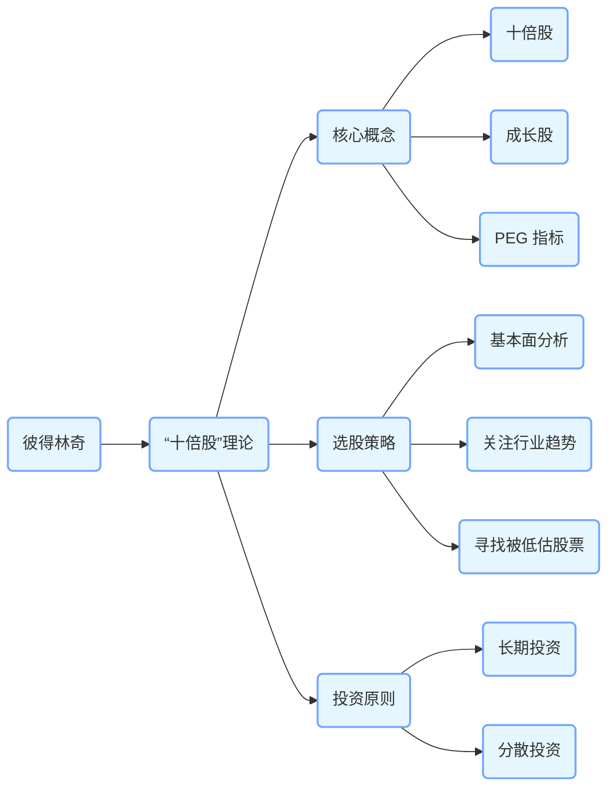

# 彼得林奇的“十倍股”理论

> 关键词：彼得林奇、十倍股、投资理论、选股策略、成长股

> 摘要：本文深入探讨彼得林奇的“十倍股”理论。彼得林奇作为投资界的传奇人物，其“十倍股”理论对投资者有着深远的影响。文章将从理论的背景介绍入手，阐述其核心概念与联系，剖析核心算法原理及具体操作步骤，借助数学模型和公式进行详细讲解并举例说明，通过项目实战案例展示理论在实际中的应用，探讨该理论的实际应用场景，推荐相关的工具和资源，总结未来发展趋势与挑战，解答常见问题，并提供扩展阅读与参考资料，旨在帮助投资者更好地理解和运用“十倍股”理论，提升投资水平。

## 1. 背景介绍 
### 1.1 目的和范围
彼得林奇的“十倍股”理论在投资领域具有极高的知名度和影响力。本文章的目的在于全面、深入地解析这一理论，帮助投资者理解“十倍股”的本质、寻找方法以及投资策略。范围涵盖理论的起源、核心概念、选股方法、实际应用案例等多个方面，旨在为投资者提供一个系统的学习和参考框架。

### 1.2 预期读者
本文预期读者包括对投资领域感兴趣的初学者，希望通过学习“十倍股”理论初步了解股票投资的基本方法和策略；也包括有一定投资经验的投资者，期望从彼得林奇的理论中获取新的思路和启发，优化自己的投资组合；同时，对于金融专业的学生和研究人员，也可以作为研究投资理论和案例的参考资料。

### 1.3 文档结构概述
本文首先介绍“十倍股”理论的背景信息，包括目的、预期读者和文档结构等。接着阐述核心概念与联系，明确“十倍股”的定义和相关概念。然后详细讲解核心算法原理和具体操作步骤，通过Python代码示例展示选股的逻辑。之后运用数学模型和公式对理论进行深入分析，并举例说明。通过项目实战部分展示如何在实际中运用该理论进行选股和投资。探讨“十倍股”理论的实际应用场景，推荐相关的学习资源、开发工具框架和论文著作。最后总结未来发展趋势与挑战，解答常见问题，并提供扩展阅读与参考资料。

### 1.4 术语表
#### 1.4.1 核心术语定义
- **十倍股**：指股价能上涨到最初购买价格十倍的股票。这类股票通常具有较高的成长性和投资价值，是投资者追求的理想投资标的。
- **成长股**：是指发行股票的上市公司的销售额和利润额持续增长，且其增长速度快于整个国家和本行业的增长速度的股票。成长股是“十倍股”的重要来源之一。
- **PEG 指标**：即市盈率相对盈利增长比率，是用公司的市盈率除以公司的盈利增长速度。该指标用于衡量股票的估值是否合理，是彼得林奇选股时常用的指标之一。

#### 1.4.2 相关概念解释
- **基本面分析**：通过对宏观经济、行业和公司基本情况的分析，评估公司的内在价值和发展前景，从而判断股票的投资价值。彼得林奇在寻找“十倍股”时非常注重基本面分析。
- **价值投资**：一种常见的投资策略，核心是寻找被市场低估的股票，买入并长期持有，等待股票价格回归其内在价值。“十倍股”理论在一定程度上与价值投资理念相契合。

#### 1.4.3 缩略词列表
- **PEG**：Price/Earnings to Growth Ratio（市盈率相对盈利增长比率）

## 2. 核心概念与联系 

### 2.1 彼得林奇简介
彼得林奇是美国投资界的传奇人物，曾担任富达公司旗下麦哲伦基金的基金经理。在他管理麦哲伦基金的 13 年间，该基金资产规模由 1800 万美元增长至 140 亿美元，创造了年化收益率 29% 的惊人业绩。他的投资理念和选股方法对全球投资者产生了深远的影响。

### 2.2 “十倍股”的定义
“十倍股”是指在一定的投资周期内，股票价格能够上涨到最初购买价格十倍的股票。例如，投资者以每股 10 元的价格买入某只股票，在未来的一段时间内，该股票价格上涨到每股 100 元，那么这只股票就是“十倍股”。“十倍股”的出现往往伴随着公司业绩的高速增长、行业的快速发展等因素。

### 2.3 “十倍股”与成长股的关系
成长股是“十倍股”的重要来源。成长股通常具有较高的盈利增长速度和良好的发展前景，随着公司业绩的不断增长，其股票价格也有可能大幅上涨，从而成为“十倍股”。然而，并非所有的成长股都能成为“十倍股”，还需要考虑行业竞争、公司管理、市场环境等多种因素。

### 2.4 核心概念的文本示意图
```plaintext
彼得林奇
|
|-- “十倍股”理论
|   |
|   |-- 核心概念
|   |   |
|   |   |-- 十倍股：股价涨至初始价十倍
|   |   |
|   |   |-- 成长股：销售额和利润持续快速增长
|   |   |
|   |   |-- PEG 指标：衡量估值合理性
|   |
|   |-- 选股策略
|   |   |
|   |   |-- 基本面分析
|   |   |
|   |   |-- 关注行业趋势
|   |   |
|   |   |-- 寻找被低估股票
|   |
|   |-- 投资原则
|       |
|       |-- 长期投资
|       |
|       |-- 分散投资
```

### 2.5 Mermaid 流程图


## 3. 核心算法原理 & 具体操作步骤 

### 3.1 核心算法原理
彼得林奇的选股方法主要基于基本面分析，通过评估公司的财务状况、行业前景、竞争优势等因素来寻找具有投资价值的股票。其中，PEG 指标是一个重要的评估工具。PEG 指标的计算公式为：

$PEG = \frac{市盈率}{盈利增长率}$

一般来说，PEG 小于 1 时，表明股票可能被低估，具有一定的投资价值；PEG 大于 1 时，股票可能被高估。彼得林奇认为，寻找 PEG 小于 1 且盈利增长前景良好的股票，有望找到“十倍股”。

### 3.2 具体操作步骤

#### 3.2.1 确定研究范围
首先，投资者需要确定自己的研究范围，可以选择特定的行业、板块或市场。例如，关注新兴科技行业、消费行业等。

#### 3.2.2 筛选股票
在确定的研究范围内，根据财务报表、行业报告等资料，筛选出具有较高盈利增长潜力的股票。可以使用财务指标如营业收入增长率、净利润增长率等进行初步筛选。

#### 3.2.3 计算 PEG 指标
对于筛选出的股票，计算其 PEG 指标。可以通过查找公司的市盈率和盈利增长率数据来计算。市盈率可以通过股价除以每股收益得到，盈利增长率可以参考公司的财务报表或分析师的预测。

#### 3.2.4 深入分析
对于 PEG 小于 1 的股票，进行深入的基本面分析。包括分析公司的商业模式、竞争优势、管理团队、行业前景等因素，评估公司的长期发展潜力。

#### 3.2.5 做出投资决策
根据深入分析的结果，结合自己的投资目标和风险承受能力，做出投资决策。如果认为某只股票具有成为“十倍股”的潜力，可以考虑买入并长期持有。

### 3.3 Python 源代码示例
```python
import pandas as pd

# 假设这是一个包含股票信息的 DataFrame
# 列名：'股票代码', '股票名称', '市盈率', '盈利增长率'
stock_data = pd.DataFrame({
    '股票代码': ['000001', '000002', '000003'],
    '股票名称': ['股票 A', '股票 B', '股票 C'],
    '市盈率': [20, 30, 15],
    '盈利增长率': [0.3, 0.2, 0.4]
})

# 计算 PEG 指标
stock_data['PEG'] = stock_data['市盈率'] / (stock_data['盈利增长率'] * 100)

# 筛选出 PEG 小于 1 的股票
potential_stocks = stock_data[stock_data['PEG'] < 1]

print("潜在的投资股票：")
print(potential_stocks)
```
### 3.4 代码解释
上述代码首先创建了一个包含股票信息的 DataFrame，包括股票代码、股票名称、市盈率和盈利增长率。然后，通过计算市盈率除以盈利增长率乘以 100 的结果，得到 PEG 指标。最后，筛选出 PEG 小于 1 的股票，作为潜在的投资对象。

## 4. 数学模型和公式 & 详细讲解 & 举例说明 

### 4.1 PEG 指标公式
$PEG = \frac{市盈率}{盈利增长率}$

其中，市盈率（PE）的计算公式为：

$PE = \frac{股价}{每股收益}$

盈利增长率（g）可以通过以下公式计算：

$g = \frac{本期净利润 - 上期净利润}{上期净利润} \times 100\%$

### 4.2 详细讲解
PEG 指标综合考虑了股票的估值和盈利增长情况。市盈率反映了市场对公司当前盈利的估值水平，盈利增长率反映了公司未来的盈利增长潜力。当 PEG 小于 1 时，意味着公司的盈利增长速度相对较快，而估值相对较低，股票可能被低估；当 PEG 大于 1 时，公司的估值可能偏高。

### 4.3 举例说明
假设股票 X 的股价为 50 元，每股收益为 2 元，则其市盈率为：

$PE = \frac{50}{2} = 25$

该股票去年的净利润为 1000 万元，今年的净利润为 1300 万元，则其盈利增长率为：

$g = \frac{1300 - 1000}{1000} \times 100\% = 30\%$

计算该股票的 PEG 指标：

$PEG = \frac{25}{30} \approx 0.83$

由于 PEG 小于 1，从 PEG 指标的角度来看，股票 X 可能具有一定的投资价值。

## 5. 项目实战：代码实际案例和详细解释说明 

### 5.1 开发环境搭建
#### 5.1.1 安装 Python
首先，需要安装 Python 环境。可以从 Python 官方网站（https://www.python.org/downloads/）下载适合自己操作系统的 Python 安装包，并按照安装向导进行安装。

#### 5.1.2 安装必要的库
在安装好 Python 后，需要安装一些必要的库，如 Pandas、Numpy 等。可以使用以下命令进行安装：
```sh
pip install pandas numpy
```

### 5.2 源代码详细实现和代码解读
```python
import pandas as pd

# 从 CSV 文件中读取股票数据
def read_stock_data(file_path):
    try:
        data = pd.read_csv(file_path)
        return data
    except Exception as e:
        print(f"读取文件时出错：{e}")
        return None

# 计算 PEG 指标
def calculate_peg(data):
    data['PEG'] = data['市盈率'] / (data['盈利增长率'] * 100)
    return data

# 筛选出 PEG 小于 1 的股票
def filter_stocks(data):
    potential_stocks = data[data['PEG'] < 1]
    return potential_stocks

# 主函数
def main():
    file_path = 'stock_data.csv'  # 替换为实际的文件路径
    stock_data = read_stock_data(file_path)
    if stock_data is not None:
        stock_data_with_peg = calculate_peg(stock_data)
        potential_stocks = filter_stocks(stock_data_with_peg)
        print("潜在的投资股票：")
        print(potential_stocks)

if __name__ == "__main__":
    main()
```
### 5.3 代码解读与分析
- **read_stock_data 函数**：该函数用于从 CSV 文件中读取股票数据。如果读取过程中出现错误，会打印错误信息并返回 None。
- **calculate_peg 函数**：该函数根据股票数据中的市盈率和盈利增长率计算 PEG 指标，并将结果添加到 DataFrame 中。
- **filter_stocks 函数**：该函数筛选出 PEG 小于 1 的股票，作为潜在的投资对象。
- **main 函数**：主函数负责调用上述函数，完成数据读取、PEG 计算和股票筛选的整个流程，并打印出潜在的投资股票。

## 6. 实际应用场景 
### 6.1 个人投资者的投资决策
对于个人投资者来说，彼得林奇的“十倍股”理论可以帮助他们在众多的股票中筛选出具有投资价值的股票。通过运用基本面分析和 PEG 指标等方法，个人投资者可以更好地了解公司的财务状况和发展前景，做出更明智的投资决策。例如，投资者可以关注自己熟悉的行业，寻找那些具有高盈利增长潜力且估值相对较低的股票，长期持有，有望获得较高的投资回报。

### 6.2 基金经理的选股策略
基金经理在构建投资组合时，可以借鉴“十倍股”理论。他们可以通过深入的研究和分析，寻找具有成为“十倍股”潜力的股票，纳入投资组合中，以提高基金的收益率。同时，基金经理还可以运用分散投资的原则，降低投资风险。例如，麦哲伦基金在彼得林奇的管理下，通过广泛投资于不同行业和规模的股票，取得了优异的业绩。

### 6.3 企业战略规划
对于企业来说，了解“十倍股”理论可以帮助企业管理层更好地规划企业的发展战略。企业可以通过提高自身的盈利能力、创新能力和市场竞争力，吸引投资者的关注，提高公司的市值。例如，一些新兴科技企业通过不断推出创新产品和服务，实现了业绩的快速增长，其股票价格也大幅上涨，成为投资者眼中的“十倍股”。

## 7. 工具和资源推荐
### 7.1 学习资源推荐
#### 7.1.1 书籍推荐
- 《彼得林奇的成功投资》：彼得林奇的经典著作，详细介绍了他的投资理念、选股方法和投资策略，是学习“十倍股”理论的必读之书。
- 《战胜华尔街》：进一步阐述了彼得林奇的投资经验和实践案例，对投资者具有很大的启发作用。
- 《聪明的投资者》：本杰明·格雷厄姆的经典著作，是价值投资领域的权威书籍，与“十倍股”理论中的基本面分析和价值投资理念相契合。

#### 7.1.2 在线课程
- Coursera 上的“投资学原理”课程：该课程系统地介绍了投资学的基本原理和方法，包括股票投资、债券投资等内容，对理解“十倍股”理论有很大的帮助。
- 网易云课堂上的“股票投资实战技巧”课程：通过实际案例分析，讲解股票投资的实战技巧，适合有一定投资基础的学习者。

#### 7.1.3 技术博客和网站
- 雪球网：国内知名的投资交流社区，有众多投资者分享自己的投资经验和研究成果，可以了解到关于“十倍股”的最新观点和案例。
- 东方财富网：提供丰富的股票资讯和数据，投资者可以通过该网站获取公司的财务报表、行业报告等信息，为分析“十倍股”提供数据支持。

### 7.2 开发工具框架推荐
#### 7.2.1 IDE 和编辑器
- PyCharm：一款专业的 Python 集成开发环境，具有强大的代码编辑、调试和项目管理功能，适合开发和调试与“十倍股”分析相关的 Python 代码。
- Jupyter Notebook：一个交互式的开发环境，适合进行数据探索和分析。可以方便地展示代码、数据和可视化结果，有助于深入研究“十倍股”理论。

#### 7.2.2 调试和性能分析工具
- PDB：Python 自带的调试工具，可以帮助开发者逐行调试代码，查找代码中的错误。
- cProfile：Python 的性能分析工具，可以分析代码的运行时间和资源消耗情况，帮助优化代码性能。

#### 7.2.3 相关框架和库
- Pandas：用于数据处理和分析的 Python 库，提供了强大的数据结构和数据操作功能，适合处理股票数据。
- Numpy：用于科学计算的 Python 库，提供了高效的数组操作和数学函数，在数据分析和计算中经常使用。

### 7.3 相关论文著作推荐
#### 7.3.1 经典论文
- Fama, E. F., & French, K. R. (1992). The cross-section of expected stock returns. Journal of Finance, 47(2), 427 - 465. 该论文提出了著名的 Fama - French 三因子模型，对股票收益率的影响因素进行了深入研究，对理解股票投资具有重要意义。
- Sharpe, W. F. (1964). Capital asset prices: A theory of market equilibrium under conditions of risk. The Journal of Finance, 19(3), 425 - 442. 该论文提出了资本资产定价模型（CAPM），为股票投资的风险和收益分析提供了理论基础。

#### 7.3.2 最新研究成果
- 可以关注《Journal of Financial Economics》、《Review of Financial Studies》等金融领域的顶级学术期刊，获取关于股票投资和“十倍股”理论的最新研究成果。

#### 7.3.3 应用案例分析
- 一些金融研究机构和咨询公司会发布关于“十倍股”的研究报告和应用案例分析。例如，麦肯锡公司的相关研究报告可以帮助投资者了解“十倍股”在不同行业和市场环境中的表现和投资策略。

## 8. 总结：未来发展趋势与挑战
### 8.1 未来发展趋势
- **科技驱动**：随着科技的不断发展，新兴科技行业如人工智能、大数据、生物医药等有望涌现更多的“十倍股”。这些行业具有高成长性和创新性，公司的业绩增长潜力巨大。
- **全球市场融合**：全球经济一体化的趋势不断加强，投资者可以更容易地投资于全球范围内的股票市场。这将为寻找“十倍股”提供更广阔的空间，同时也增加了投资的机会。
- **数据驱动的投资决策**：随着信息技术的发展，投资者可以获取更多的股票数据和信息。通过运用大数据分析、人工智能等技术，投资者可以更准确地筛选出具有成为“十倍股”潜力的股票，提高投资决策的准确性。

### 8.2 挑战
- **市场不确定性**：股票市场受到宏观经济、政策、行业竞争等多种因素的影响，具有很大的不确定性。即使运用“十倍股”理论进行选股，也不能保证一定能找到“十倍股”，投资仍然存在风险。
- **信息不对称**：在股票市场中，信息不对称是一个普遍存在的问题。一些内幕信息可能会影响股票价格的走势，普通投资者很难获取这些信息，这增加了投资的难度。
- **新兴行业的风险**：虽然新兴科技行业具有高成长性，但也伴随着较高的风险。这些行业的技术更新换代快，竞争激烈，公司的发展前景存在很大的不确定性。投资者需要具备较高的风险承受能力和专业知识，才能在新兴行业中寻找“十倍股”。

## 9. 附录：常见问题与解答
### 9.1 如何确定股票的盈利增长率？
股票的盈利增长率可以通过公司的财务报表来计算。可以比较公司不同期间的净利润数据，使用公式 $g = \frac{本期净利润 - 上期净利润}{上期净利润} \times 100\%$ 计算盈利增长率。此外，也可以参考分析师的预测数据，但需要注意分析师预测的准确性。

### 9.2 PEG 指标是否适用于所有行业？
PEG 指标并不是适用于所有行业。一些周期性行业，如钢铁、煤炭等，其盈利受经济周期的影响较大，盈利增长率不稳定，PEG 指标可能无法准确反映这些行业股票的投资价值。对于新兴科技行业等成长型行业，PEG 指标相对更适用。

### 9.3 找到“十倍股”后应该何时卖出？
找到“十倍股”后何时卖出是一个比较复杂的问题，没有固定的答案。投资者可以根据公司的基本面变化、行业发展趋势、估值水平等因素来决定。如果公司的业绩增长出现放缓、行业竞争加剧、估值过高，投资者可以考虑卖出股票。此外，投资者也可以根据自己的投资目标和风险承受能力来决定卖出时机。

## 10. 扩展阅读 & 参考资料
### 10.1 扩展阅读
- 《金融炼金术》：乔治·索罗斯的著作，介绍了他的投资哲学和反身性理论，对投资者的思维方式有很大的启发。
- 《黑天鹅》：纳西姆·尼古拉斯·塔勒布的著作，探讨了不确定性和极端事件对金融市场的影响，提醒投资者要关注市场中的风险。

### 10.2 参考资料
- 彼得林奇的官方网站和相关访谈资料。
- 各大金融媒体和财经网站的相关报道和分析文章。
- 证券交易所发布的上市公司财务报表和公告。