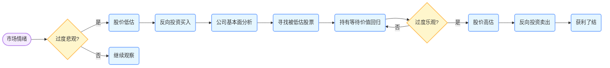

# 彼得林奇的“反向投资”成功案例

> 关键词：彼得林奇、反向投资、成功案例、投资策略、股票市场

> 摘要：本文深入探讨了彼得林奇的“反向投资”策略及其成功案例。通过详细介绍背景信息，阐述核心概念与联系，剖析核心算法原理及操作步骤，结合数学模型和公式进行讲解，展示项目实战案例，分析实际应用场景，推荐相关工具和资源，总结未来发展趋势与挑战等内容，全面揭示了彼得林奇“反向投资”策略的精髓和价值，为投资者提供了宝贵的参考和借鉴。

## 1. 背景介绍 
### 1.1 目的和范围
本文的目的在于深入研究彼得林奇的“反向投资”策略，并通过具体的成功案例进行分析，帮助投资者更好地理解和应用这一策略。范围涵盖了彼得林奇的投资理念、“反向投资”的具体操作方法、相关的成功案例以及对未来投资的启示等方面。

### 1.2 预期读者
本文预期读者主要包括对股票投资感兴趣的个人投资者、金融专业的学生、投资机构的从业人员以及关注投资策略研究的学者等。希望通过本文的介绍，能够为不同层次的读者提供有价值的投资思路和参考。

### 1.3 文档结构概述
本文将按照以下结构进行阐述：首先介绍背景信息，包括目的、预期读者和文档结构概述等；接着阐述“反向投资”的核心概念与联系，通过文本示意图和 Mermaid 流程图进行展示；然后详细讲解核心算法原理和具体操作步骤，结合 Python 源代码进行说明；再介绍相关的数学模型和公式，并举例说明；之后通过项目实战案例展示“反向投资”的实际应用；接着分析实际应用场景；推荐相关的工具和资源；总结未来发展趋势与挑战；最后设置附录解答常见问题，并提供扩展阅读和参考资料。

### 1.4 术语表
#### 1.4.1 核心术语定义
- **反向投资**：指投资者采取与市场主流观点相反的投资策略，当市场普遍悲观时买入，当市场普遍乐观时卖出。
- **市场情绪**：指投资者对市场的整体看法和心理预期，包括乐观、悲观等不同情绪状态。
- **价值投资**：一种基于公司基本面分析，寻找被低估股票并长期持有的投资策略。

#### 1.4.2 相关概念解释
- **羊群效应**：在投资市场中，投资者往往会受到群体行为的影响，跟随大多数人的决策进行投资，而忽略了自己的独立判断。
- **安全边际**：指股票的内在价值与市场价格之间的差距，安全边际越大，投资风险越低。

#### 1.4.3 缩略词列表
- **EPS**：Earnings Per Share，每股收益。
- **PE**：Price Earnings Ratio，市盈率。

## 2. 核心概念与联系 
### 核心概念原理
彼得林奇的“反向投资”策略基于对市场情绪和公司基本面的深入分析。他认为市场情绪往往具有过度反应的特点，当市场普遍对某一行业或公司持悲观态度时，股价往往会被过度低估；而当市场普遍乐观时，股价可能会被高估。因此，投资者可以通过逆向思维，在市场悲观时寻找被低估的股票买入，在市场乐观时卖出获利。

“反向投资”与价值投资密切相关，它是价值投资的一种具体应用方式。价值投资强调寻找被低估的股票，而“反向投资”则通过关注市场情绪的变化，更精准地把握买入和卖出的时机。

### 文本示意图
```plaintext
市场情绪
    |
    | 过度悲观
    |----------------------> 股价低估
    |                          |
    |                          | 反向投资买入
    |                          |
    |                          V
公司基本面分析 <------ 寻找被低估股票
    |                          |
    |                          | 持有等待价值回归
    |                          |
    |                          V
    | 过度乐观
    |----------------------> 股价高估
    |                          |
    |                          | 反向投资卖出
    |                          |
    |                          V
    | 获利了结
```

### Mermaid 流程图


## 3. 核心算法原理 & 具体操作步骤 
### 核心算法原理
“反向投资”的核心算法原理在于通过对市场情绪和公司基本面的量化分析，确定买入和卖出的时机。具体来说，可以通过以下几个步骤实现：

1. **市场情绪量化**：可以通过分析投资者的情绪指标，如投资者信心指数、舆情分析等，来量化市场情绪。当市场情绪指标达到一定的阈值时，判断市场处于过度悲观或过度乐观状态。
2. **公司基本面分析**：对公司的财务报表、行业地位、竞争优势等进行分析，评估公司的内在价值。可以使用市盈率（PE）、市净率（PB）、每股收益（EPS）等指标来衡量公司的估值水平。
3. **买入和卖出决策**：当市场情绪过度悲观且公司基本面良好，股价被低估时，进行买入操作；当市场情绪过度乐观且公司股价被高估时，进行卖出操作。

### 具体操作步骤
以下是使用 Python 实现“反向投资”策略的具体操作步骤和源代码：

```python
import pandas as pd
import numpy as np

# 模拟市场情绪数据
market_sentiment = pd.Series(np.random.randn(100), index=pd.date_range('20200101', periods=100))

# 模拟公司股价数据
stock_prices = pd.Series(np.random.randn(100), index=pd.date_range('20200101', periods=100))

# 设定市场情绪阈值
pessimistic_threshold = -1
optimistic_threshold = 1

# 初始化买入和卖出信号
buy_signals = []
sell_signals = []

for i in range(len(market_sentiment)):
    if market_sentiment[i] < pessimistic_threshold:
        # 市场情绪过度悲观，判断是否买入
        # 这里简单假设股价低于一定比例则买入
        if stock_prices[i] < stock_prices.mean() * 0.8:
            buy_signals.append(market_sentiment.index[i])
    elif market_sentiment[i] > optimistic_threshold:
        # 市场情绪过度乐观，判断是否卖出
        # 这里简单假设股价高于一定比例则卖出
        if stock_prices[i] > stock_prices.mean() * 1.2:
            sell_signals.append(market_sentiment.index[i])

print("买入信号日期：", buy_signals)
print("卖出信号日期：", sell_signals)
```

### 代码解释
1. **数据模拟**：使用 `pandas` 和 `numpy` 库模拟市场情绪数据和公司股价数据。
2. **阈值设定**：设定市场情绪的悲观和乐观阈值，用于判断市场情绪的过度状态。
3. **信号生成**：遍历市场情绪数据，当市场情绪达到阈值且股价满足一定条件时，生成买入或卖出信号。
4. **结果输出**：打印买入和卖出信号的日期。

## 4. 数学模型和公式 & 详细讲解 & 举例说明 
### 数学模型和公式
在“反向投资”策略中，常用的数学模型和公式包括市盈率（PE）、市净率（PB）和安全边际等。

- **市盈率（PE）**：
$$PE = \frac{股价}{每股收益}$$
市盈率反映了投资者愿意为每一元的盈利支付的价格。一般来说，市盈率越低，股票越被低估。

- **市净率（PB）**：
$$PB = \frac{股价}{每股净资产}$$
市净率反映了股票价格与每股净资产的关系。市净率越低，说明股票的估值越低。

- **安全边际**：
$$安全边际 = 内在价值 - 市场价格$$
安全边际越大，投资风险越低。

### 详细讲解
- **市盈率（PE）**：市盈率是衡量股票估值的重要指标之一。不同行业的市盈率水平可能会有所差异，一般来说，成长型行业的市盈率较高，而传统行业的市盈率较低。投资者可以通过比较同行业公司的市盈率，来判断某只股票是否被低估。
- **市净率（PB）**：市净率主要用于评估公司的资产价值。对于一些资产密集型行业，如制造业、银行业等，市净率是一个重要的估值指标。当市净率低于 1 时，说明股票的价格低于每股净资产，可能存在投资机会。
- **安全边际**：安全边际是价值投资的核心概念之一。投资者在买入股票时，应该尽量选择安全边际较大的股票，以降低投资风险。安全边际的计算需要对公司的内在价值进行评估，这需要综合考虑公司的财务状况、行业前景、竞争优势等因素。

### 举例说明
假设某公司的股价为 20 元，每股收益为 2 元，每股净资产为 10 元。则该公司的市盈率为：
$$PE = \frac{20}{2} = 10$$
市净率为：
$$PB = \frac{20}{10} = 2$$
如果通过对公司的基本面分析，评估该公司的内在价值为 30 元，则安全边际为：
$$安全边际 = 30 - 20 = 10$$
这意味着该股票的市场价格相对于内在价值有一定的折扣，存在投资机会。

## 5. 项目实战：代码实际案例和详细解释说明 
### 5.1  开发环境搭建
为了实现“反向投资”策略的项目实战，我们需要搭建以下开发环境：

1. **Python 环境**：建议使用 Python 3.7 及以上版本。可以从 Python 官方网站（https://www.python.org/downloads/）下载并安装。
2. **开发工具**：推荐使用 PyCharm 或 Jupyter Notebook 作为开发工具。PyCharm 是一款功能强大的 Python 集成开发环境，Jupyter Notebook 则适合进行交互式数据分析和代码演示。
3. **相关库安装**：需要安装 `pandas`、`numpy`、`matplotlib` 等库。可以使用以下命令进行安装：
```sh
pip install pandas numpy matplotlib
```

### 5.2  源代码详细实现和代码解读
以下是一个完整的“反向投资”策略的项目实战代码：

```python
import pandas as pd
import numpy as np
import matplotlib.pyplot as plt

# 读取股票数据
stock_data = pd.read_csv('stock_data.csv', index_col='Date', parse_dates=True)

# 计算市场情绪指标（简单示例：使用股价收益率的移动平均值）
stock_data['returns'] = stock_data['Close'].pct_change()
stock_data['market_sentiment'] = stock_data['returns'].rolling(window=10).mean()

# 设定市场情绪阈值
pessimistic_threshold = -0.05
optimistic_threshold = 0.05

# 初始化买入和卖出信号
stock_data['buy_signal'] = 0
stock_data['sell_signal'] = 0

for i in range(1, len(stock_data)):
    if stock_data['market_sentiment'][i] < pessimistic_threshold and stock_data['Close'][i] < stock_data['Close'].mean() * 0.9:
        stock_data['buy_signal'][i] = 1
    elif stock_data['market_sentiment'][i] > optimistic_threshold and stock_data['Close'][i] > stock_data['Close'].mean() * 1.1:
        stock_data['sell_signal'][i] = 1

# 绘制股价和信号图
plt.figure(figsize=(12, 6))
plt.plot(stock_data['Close'], label='Stock Price')
plt.scatter(stock_data[stock_data['buy_signal'] == 1].index, stock_data[stock_data['buy_signal'] == 1]['Close'], marker='^', color='g', label='Buy Signal')
plt.scatter(stock_data[stock_data['sell_signal'] == 1].index, stock_data[stock_data['sell_signal'] == 1]['Close'], marker='v', color='r', label='Sell Signal')
plt.title('Reverse Investment Strategy')
plt.xlabel('Date')
plt.ylabel('Stock Price')
plt.legend()
plt.show()
```

### 代码解读
1. **数据读取**：使用 `pandas` 库读取股票数据文件 `stock_data.csv`，并将日期列作为索引。
2. **市场情绪指标计算**：计算股票的收益率，并使用 10 日移动平均值作为市场情绪指标。
3. **阈值设定**：设定市场情绪的悲观和乐观阈值。
4. **信号生成**：遍历股票数据，当市场情绪达到阈值且股价满足一定条件时，生成买入或卖出信号。
5. **绘图展示**：使用 `matplotlib` 库绘制股价和信号图，直观展示买入和卖出信号的位置。

## 6. 实际应用场景 
### 股票投资
在股票投资中，“反向投资”策略可以帮助投资者在市场情绪过度悲观时买入被低估的股票，在市场情绪过度乐观时卖出获利。例如，当某一行业受到负面消息影响，市场普遍对该行业持悲观态度时，股价可能会大幅下跌。此时，投资者可以通过深入分析公司的基本面，寻找被低估的股票进行投资。

### 基金投资
在基金投资中，“反向投资”策略同样适用。当市场上某一类基金受到投资者的冷落，规模不断缩小时，可能意味着该类基金的投资价值被低估。投资者可以在此时适当配置该类基金，等待市场情绪的反转。

### 宏观经济投资
在宏观经济层面，“反向投资”策略也可以为投资者提供参考。例如，当经济处于衰退期，市场普遍对经济前景持悲观态度时，投资者可以适当增加对一些防御性资产的投资，如债券、黄金等；当经济处于繁荣期，市场普遍乐观时，可以适当减少防御性资产的配置，增加对股票等风险资产的投资。

## 7. 工具和资源推荐
### 7.1 学习资源推荐
#### 7.1.1 书籍推荐
- 《彼得林奇的成功投资》：彼得林奇的经典著作，详细介绍了他的投资理念和方法。
- 《聪明的投资者》：本杰明·格雷厄姆的代表作，价值投资的经典书籍。
- 《金融炼金术》：乔治·索罗斯的著作，介绍了他的反身性理论和投资实践。

#### 7.1.2 在线课程
- Coursera 上的“投资学原理”课程：由知名大学的教授授课，系统介绍投资学的基本原理和方法。
- 网易云课堂上的“股票投资实战课程”：结合实际案例，讲解股票投资的技巧和策略。

#### 7.1.3 技术博客和网站
- 雪球网：国内知名的投资交流社区，提供股票、基金等投资信息和交流平台。
- 价值投资网：专注于价值投资的研究和交流，提供大量的投资案例和分析文章。

### 7.2 开发工具框架推荐
#### 7.2.1 IDE和编辑器
- PyCharm：功能强大的 Python 集成开发环境，适合进行大规模的 Python 项目开发。
- Jupyter Notebook：交互式的数据分析和代码演示工具，适合进行数据探索和算法验证。

#### 7.2.2 调试和性能分析工具
- Py-Spy：用于分析 Python 程序的性能瓶颈，找出耗时较长的代码段。
- PDB：Python 自带的调试工具，方便进行代码调试和问题排查。

#### 7.2.3 相关框架和库
- Pandas：用于数据处理和分析的 Python 库，提供了丰富的数据结构和操作方法。
- Numpy：用于科学计算的 Python 库，提供了高效的数组和矩阵运算功能。
- Matplotlib：用于数据可视化的 Python 库，能够绘制各种类型的图表。

### 7.3 相关论文著作推荐
#### 7.3.1 经典论文
- “The Cross - Section of Expected Stock Returns”（Fama and French, 1992）：提出了著名的 Fama - French 三因子模型，对股票收益率的影响因素进行了深入研究。
- “Efficient Capital Markets: A Review of Theory and Empirical Work”（Fama, 1970）：对有效市场假说进行了系统的阐述和总结。

#### 7.3.2 最新研究成果
- 关注《Journal of Finance》、《Review of Financial Studies》等顶级金融学术期刊，了解最新的投资理论和研究成果。

#### 7.3.3 应用案例分析
- 阅读专业的金融研究报告和案例分析书籍，了解“反向投资”策略在实际投资中的应用效果和案例分析。

## 8. 总结：未来发展趋势与挑战
### 未来发展趋势
- **量化投资与反向投资的结合**：随着信息技术的发展，量化投资越来越受到投资者的关注。未来，量化投资技术可能会与“反向投资”策略相结合，通过大数据分析和机器学习算法，更精准地判断市场情绪和股票估值，提高投资决策的效率和准确性。
- **跨市场和跨资产类别的反向投资**：投资者可能会将“反向投资”策略应用到更广泛的市场和资产类别中，如外汇市场、商品市场、房地产市场等，实现资产的多元化配置和风险的分散。
- **投资者教育和普及**：随着投资者教育的不断普及，越来越多的投资者将了解和应用“反向投资”策略。这将促使市场更加理性和有效，减少市场的非理性波动。

### 挑战
- **市场情绪的复杂性**：市场情绪受到多种因素的影响，如宏观经济数据、政策变化、突发事件等，其复杂性和不确定性增加了判断市场情绪的难度。
- **公司基本面的变化**：公司的基本面会随着时间的推移而发生变化，如行业竞争加剧、技术创新、管理团队变动等。投资者需要及时跟踪和分析公司的基本面变化，以确保投资决策的正确性。
- **黑天鹅事件的影响**：黑天鹅事件是指那些难以预测、具有重大影响的突发事件，如金融危机、自然灾害、政治动荡等。黑天鹅事件可能会导致市场情绪的急剧变化，使“反向投资”策略面临巨大的挑战。

## 9. 附录：常见问题与解答
### 问题 1：“反向投资”策略是否适用于所有市场？
解答：“反向投资”策略并不是适用于所有市场。该策略更适用于具有一定波动性和非理性因素的市场，如股票市场。在一些有效市场中，股票价格已经充分反映了所有信息，“反向投资”策略可能难以取得超额收益。

### 问题 2：如何准确判断市场情绪？
解答：判断市场情绪是“反向投资”策略的关键。可以通过以下方法来判断市场情绪：分析投资者的情绪指标，如投资者信心指数、舆情分析等；观察市场的成交量和换手率；关注媒体和分析师的观点等。

### 问题 3：“反向投资”策略的风险如何控制？
解答：“反向投资”策略的风险控制可以从以下几个方面入手：进行充分的基本面分析，选择具有良好基本面的股票；合理控制仓位，避免过度集中投资；设置止损点，及时止损以控制损失；进行多元化投资，分散风险。

## 10. 扩展阅读 & 参考资料
### 扩展阅读
- 《邓普顿教你逆向投资》：介绍了约翰·邓普顿的逆向投资理念和实践经验。
- 《投资最重要的事》：霍华德·马克斯的著作，强调了投资中的风险管理和逆向思维。

### 参考资料
- 彼得林奇的官方网站和相关访谈记录。
- 金融学术期刊和研究报告，如《Journal of Finance》、《Review of Financial Studies》等。
- 股票交易软件和金融数据提供商，如东方财富、同花顺等提供的市场数据和分析工具。