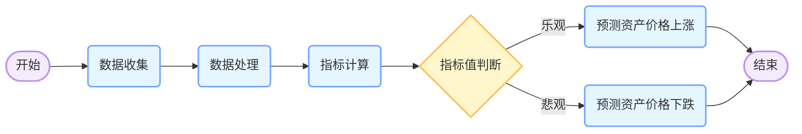

# 彼得林奇的"市场情绪"指标在不同资产类别中的预测能力

> 关键词：彼得林奇、市场情绪指标、资产类别、预测能力、金融市场

> 摘要：本文聚焦于彼得林奇的“市场情绪”指标，深入探讨其在不同资产类别中的预测能力。首先介绍相关背景，包括目的范围、预期读者等内容。接着阐述核心概念及联系，分析该指标的原理与架构。通过Python代码详细讲解核心算法原理及操作步骤，并给出相应的数学模型和公式。以实际项目案例展示代码实现及解读。探讨该指标在不同资产类别的实际应用场景，推荐学习资源、开发工具框架及相关论文著作。最后总结未来发展趋势与挑战，提供常见问题解答及扩展阅读参考资料，旨在全面深入地研究该指标在金融市场中的价值与作用。

## 1. 背景介绍 
### 1.1 目的和范围
本研究的主要目的是深入探究彼得林奇的“市场情绪”指标在不同资产类别（如股票、债券、大宗商品、房地产等）中的预测能力。通过对该指标的分析和验证，试图明确其在不同市场环境和资产类型下的有效性和局限性，为投资者和金融从业者提供有价值的决策参考。研究范围涵盖了多种常见的资产类别，结合不同市场阶段的数据进行分析，以全面评估该指标的应用价值。

### 1.2 预期读者
本文预期读者包括金融市场投资者、金融分析师、基金经理、金融领域的研究人员以及对金融市场和投资分析感兴趣的相关人士。对于希望了解市场情绪指标对不同资产类别影响的读者，本文将提供深入的分析和见解。

### 1.3 文档结构概述
本文将按照以下结构展开：首先介绍研究的背景信息，包括目的、预期读者和文档结构。接着阐述核心概念与联系，包括“市场情绪”指标的原理和架构。然后详细讲解核心算法原理及具体操作步骤，并给出相应的数学模型和公式。通过实际项目案例展示代码实现及解读。探讨该指标在不同资产类别的实际应用场景。推荐学习资源、开发工具框架及相关论文著作。最后总结未来发展趋势与挑战，提供常见问题解答及扩展阅读参考资料。

### 1.4 术语表
#### 1.4.1 核心术语定义
- **彼得林奇的“市场情绪”指标**：由著名投资者彼得林奇提出的用于衡量市场参与者情绪状态的指标，反映市场的乐观或悲观程度。
- **资产类别**：具有相似特征和市场表现的金融资产的分类，常见的资产类别包括股票、债券、大宗商品、房地产等。
- **预测能力**：指指标能够准确预测资产价格走势或市场变化的能力。

#### 1.4.2 相关概念解释
- **市场情绪**：市场参与者对市场未来走势的看法和预期，通常表现为乐观、悲观或中性情绪。市场情绪会影响投资者的决策和行为，进而对资产价格产生影响。
- **资产定价**：确定资产价值的过程，资产价格受到多种因素的影响，包括基本面因素、市场情绪、宏观经济环境等。

#### 1.4.3 缩略词列表
- **ETF**：交易型开放式指数基金（Exchange - Traded Fund）
- **GDP**：国内生产总值（Gross Domestic Product）

## 2. 核心概念与联系 
### 2.1 彼得林奇“市场情绪”指标的原理
彼得林奇的“市场情绪”指标基于市场参与者的心理和行为特征构建。市场参与者的情绪往往会受到多种因素的影响，如宏观经济数据、公司业绩、政策变化等。当市场情绪乐观时，投资者更愿意买入资产，推动资产价格上涨；当市场情绪悲观时，投资者倾向于卖出资产，导致资产价格下跌。该指标通过对市场参与者的行为和言论进行分析，试图捕捉市场情绪的变化，从而预测资产价格的走势。

### 2.2 指标与不同资产类别的联系
不同资产类别对市场情绪的敏感度不同。股票市场通常对市场情绪较为敏感，当市场情绪乐观时，股票价格往往会上涨；当市场情绪悲观时，股票价格可能会下跌。债券市场的情况相对复杂，一般来说，在市场情绪悲观时，投资者可能会寻求债券等相对安全的资产，导致债券价格上涨；而在市场情绪乐观时，投资者可能会减少对债券的需求，债券价格可能会下跌。大宗商品市场也会受到市场情绪的影响，例如，当市场情绪乐观时，对工业大宗商品的需求可能会增加，推动其价格上涨。房地产市场的市场情绪影响相对较为缓慢，但也会受到宏观经济环境和市场预期的影响。

### 2.3 核心概念原理和架构的文本示意图
彼得林奇的“市场情绪”指标的架构主要包括数据收集、数据处理和指标计算三个部分。数据收集阶段，收集与市场参与者情绪相关的数据，如投资者调查数据、媒体报道情绪分析数据等。数据处理阶段，对收集到的数据进行清洗、整理和标准化处理。指标计算阶段，根据处理后的数据计算市场情绪指标值。该指标值可以用于预测不同资产类别的价格走势。

### 2.4 Mermaid 流程图


## 3. 核心算法原理 & 具体操作步骤 
### 3.1 核心算法原理
彼得林奇的“市场情绪”指标的核心算法可以基于情绪指数的计算。假设我们收集到了 $n$ 个与市场情绪相关的数据点 $x_1, x_2, \cdots, x_n$，这些数据点可以是投资者的乐观或悲观评分、媒体报道的情绪倾向等。首先，对这些数据点进行标准化处理，使其取值范围在 $[0, 1]$ 之间。然后，计算这些标准化数据点的加权平均值作为市场情绪指标值。

### 3.2 具体操作步骤
1. **数据收集**：收集与市场情绪相关的数据，例如通过问卷调查获取投资者的情绪评分，或者通过文本分析工具对媒体报道进行情绪分析。
2. **数据预处理**：对收集到的数据进行清洗，去除无效数据和异常值。然后对数据进行标准化处理，使用以下公式将数据转换到 $[0, 1]$ 范围：
   - 对于原始数据 $x_i$，标准化后的数据 $y_i$ 计算公式为：$y_i=\frac{x_i - \min(x)}{\max(x)-\min(x)}$，其中 $\min(x)$ 和 $\max(x)$ 分别是数据集中的最小值和最大值。
3. **计算加权平均值**：为每个标准化数据点 $y_i$ 分配一个权重 $w_i$，权重之和为 1，即 $\sum_{i = 1}^{n}w_i = 1$。市场情绪指标值 $S$ 计算公式为：$S=\sum_{i = 1}^{n}w_iy_i$。

### 3.3 Python源代码实现
```python
import numpy as np

def standardize_data(data):
    """
    对数据进行标准化处理
    :param data: 原始数据数组
    :return: 标准化后的数据数组
    """
    min_val = np.min(data)
    max_val = np.max(data)
    if max_val - min_val == 0:
        return np.zeros_like(data)
    return (data - min_val) / (max_val - min_val)

def calculate_market_sentiment(data, weights):
    """
    计算市场情绪指标值
    :param data: 标准化后的数据数组
    :param weights: 权重数组
    :return: 市场情绪指标值
    """
    if len(data) != len(weights):
        raise ValueError("数据和权重的长度必须相同")
    return np.dot(data, weights)

# 示例数据
raw_data = np.array([80, 90, 70, 60])
weights = np.array([0.2, 0.3, 0.3, 0.2])

# 数据标准化
standardized_data = standardize_data(raw_data)

# 计算市场情绪指标值
sentiment_value = calculate_market_sentiment(standardized_data, weights)

print("标准化后的数据:", standardized_data)
print("市场情绪指标值:", sentiment_value)
```
### 3.4 代码解释
- `standardize_data` 函数：该函数接受一个原始数据数组作为输入，计算数据的最小值和最大值，然后使用标准化公式将数据转换到 $[0, 1]$ 范围。
- `calculate_market_sentiment` 函数：该函数接受标准化后的数据数组和权重数组作为输入，计算它们的点积，得到市场情绪指标值。
- 示例部分：定义了原始数据和权重数组，调用 `standardize_data` 函数进行数据标准化，再调用 `calculate_market_sentiment` 函数计算市场情绪指标值，并打印结果。

## 4. 数学模型和公式 & 详细讲解 & 举例说明 
### 4.1 数学模型和公式
#### 4.1.1 数据标准化公式
设原始数据为 $x_i$，$i = 1, 2, \cdots, n$，标准化后的数据为 $y_i$，则标准化公式为：
$$y_i=\frac{x_i - \min(x)}{\max(x)-\min(x)}$$
其中 $\min(x)=\min\{x_1, x_2, \cdots, x_n\}$ 是数据集中的最小值，$\max(x)=\max\{x_1, x_2, \cdots, x_n\}$ 是数据集中的最大值。

#### 4.1.2 市场情绪指标值计算公式
设标准化后的数据为 $y_i$，$i = 1, 2, \cdots, n$，对应的权重为 $w_i$，且 $\sum_{i = 1}^{n}w_i = 1$，则市场情绪指标值 $S$ 计算公式为：
$$S=\sum_{i = 1}^{n}w_iy_i$$

### 4.2 详细讲解
- **数据标准化**：数据标准化的目的是将不同范围的数据转换到相同的尺度上，便于后续的计算和比较。通过减去最小值并除以最大值与最小值的差值，将数据映射到 $[0, 1]$ 区间。这样可以消除数据量纲的影响，使不同来源的数据具有可比性。
- **市场情绪指标值计算**：市场情绪指标值是标准化数据的加权平均值。权重的分配可以根据不同数据的重要性进行调整。例如，对于更能反映市场整体情绪的数据点，可以分配较高的权重。

### 4.3 举例说明
假设我们收集到了 4 个投资者的情绪评分数据：$x_1 = 80$，$x_2 = 90$，$x_3 = 70$，$x_4 = 60$。首先计算最小值 $\min(x)=60$，最大值 $\max(x)=90$。
- 标准化数据：
  - $y_1=\frac{80 - 60}{90 - 60}=\frac{20}{30}\approx0.67$
  - $y_2=\frac{90 - 60}{90 - 60}=1$
  - $y_3=\frac{70 - 60}{90 - 60}=\frac{10}{30}\approx0.33$
  - $y_4=\frac{60 - 60}{90 - 60}=0$
- 假设权重分别为 $w_1 = 0.2$，$w_2 = 0.3$，$w_3 = 0.3$，$w_4 = 0.2$，则市场情绪指标值为：
  - $S=0.2\times0.67 + 0.3\times1+0.3\times0.33 + 0.2\times0$
  - $S = 0.134+0.3 + 0.099+0=0.533$

## 5. 项目实战：代码实际案例和详细解释说明 
### 5.1  开发环境搭建
#### 5.1.1 安装Python
首先需要安装Python开发环境，建议安装Python 3.7及以上版本。可以从Python官方网站（https://www.python.org/downloads/） 下载适合自己操作系统的安装包，按照安装向导进行安装。

#### 5.1.2 安装必要的库
本项目需要使用 `numpy` 库进行数值计算。可以使用以下命令进行安装：
```sh
pip install numpy
```

### 5.2  源代码详细实现和代码解读
```python
import numpy as np

# 模拟数据收集：随机生成投资者情绪评分数据
def generate_random_data(num_data_points):
    """
    生成随机的投资者情绪评分数据
    :param num_data_points: 数据点的数量
    :return: 随机生成的数据数组
    """
    return np.random.randint(0, 100, num_data_points)

# 数据标准化函数
def standardize_data(data):
    """
    对数据进行标准化处理
    :param data: 原始数据数组
    :return: 标准化后的数据数组
    """
    min_val = np.min(data)
    max_val = np.max(data)
    if max_val - min_val == 0:
        return np.zeros_like(data)
    return (data - min_val) / (max_val - min_val)

# 计算市场情绪指标值函数
def calculate_market_sentiment(data, weights):
    """
    计算市场情绪指标值
    :param data: 标准化后的数据数组
    :param weights: 权重数组
    :return: 市场情绪指标值
    """
    if len(data) != len(weights):
        raise ValueError("数据和权重的长度必须相同")
    return np.dot(data, weights)

# 主函数
def main():
    # 生成随机数据
    num_data_points = 10
    raw_data = generate_random_data(num_data_points)
    print("原始数据:", raw_data)

    # 生成权重
    weights = np.random.rand(num_data_points)
    weights = weights / np.sum(weights)  # 归一化权重
    print("权重:", weights)

    # 数据标准化
    standardized_data = standardize_data(raw_data)
    print("标准化后的数据:", standardized_data)

    # 计算市场情绪指标值
    sentiment_value = calculate_market_sentiment(standardized_data, weights)
    print("市场情绪指标值:", sentiment_value)

if __name__ == "__main__":
    main()
```
### 5.3  代码解读与分析
- **`generate_random_data` 函数**：该函数使用 `numpy` 的 `randint` 函数随机生成指定数量的投资者情绪评分数据，范围在 0 到 100 之间。
- **`standardize_data` 函数**：与前面的代码相同，用于对原始数据进行标准化处理。
- **`calculate_market_sentiment` 函数**：用于计算市场情绪指标值，通过计算标准化数据和权重的点积得到。
- **`main` 函数**：主函数，首先调用 `generate_random_data` 函数生成随机数据，然后生成随机权重并进行归一化处理。接着调用 `standardize_data` 函数对数据进行标准化，最后调用 `calculate_market_sentiment` 函数计算市场情绪指标值，并打印相关结果。

## 6. 实际应用场景 
### 6.1 股票市场
在股票市场中，彼得林奇的“市场情绪”指标可以帮助投资者判断市场的整体情绪状态。当市场情绪指标值较高时，表明市场参与者较为乐观，投资者可能会增加股票投资；当市场情绪指标值较低时，表明市场参与者较为悲观，投资者可能会减少股票投资或采取防御性策略。例如，在牛市初期，市场情绪指标值通常会逐渐上升，投资者可以根据该指标适时增加股票仓位；在熊市来临前，市场情绪指标值可能会下降，投资者可以提前减仓以规避风险。

### 6.2 债券市场
债券市场的投资者通常更关注风险和收益的平衡。当市场情绪悲观时，投资者可能会将资金从股票等风险资产转移到债券市场，导致债券价格上涨。此时，市场情绪指标可以作为一个参考，帮助投资者判断是否应该增加债券投资。相反，当市场情绪乐观时，投资者可能会减少对债券的需求，债券价格可能会下跌，投资者可以考虑减少债券仓位。

### 6.3 大宗商品市场
大宗商品市场的价格受到供需关系和市场情绪的影响。当市场情绪乐观时，投资者对经济增长的预期较高，对工业大宗商品（如铜、铁矿石等）的需求可能会增加，推动其价格上涨。市场情绪指标可以帮助投资者判断大宗商品市场的走势，提前布局相关投资。例如，在经济复苏初期，市场情绪指标上升，投资者可以适当增加对工业大宗商品的投资。

### 6.4 房地产市场
房地产市场的市场情绪影响相对较为缓慢，但也会受到宏观经济环境和市场预期的影响。当市场情绪乐观时，购房者的购房意愿较强，房地产市场可能会出现繁荣景象；当市场情绪悲观时，购房者可能会持观望态度，房地产市场可能会出现调整。市场情绪指标可以为房地产投资者和开发商提供参考，帮助他们判断市场趋势，做出合理的决策。

## 7. 工具和资源推荐
### 7.1 学习资源推荐
#### 7.1.1 书籍推荐
- 《彼得林奇的成功投资》：彼得林奇的经典著作，详细介绍了他的投资理念和方法，包括对市场情绪的理解和应用。
- 《金融心理学》：该书深入探讨了金融市场中投资者的心理和行为，有助于理解市场情绪的形成和影响。
- 《聪明的投资者》：本杰明·格雷厄姆的经典投资著作，对价值投资和市场情绪的关系有深刻的阐述。

#### 7.1.2 在线课程
- Coursera 上的“金融市场”课程：由知名教授授课，涵盖了金融市场的各个方面，包括市场情绪对资产价格的影响。
- edX 上的“投资学原理”课程：系统介绍了投资学的基本原理和方法，对市场情绪指标的应用有相关讲解。

#### 7.1.3 技术博客和网站
- 雪球网：提供了丰富的金融市场资讯和投资者交流平台，可以了解市场参与者的情绪和观点。
- 金融界网站：有大量的金融市场分析文章和数据，对市场情绪的研究有一定的参考价值。

### 7.2 开发工具框架推荐
#### 7.2.1 IDE和编辑器
- PyCharm：一款专业的 Python 集成开发环境，提供了丰富的代码编辑、调试和分析功能，适合开发与市场情绪指标相关的 Python 程序。
- Jupyter Notebook：一种交互式的开发环境，适合进行数据探索和分析，方便展示代码和结果，对于研究市场情绪指标的计算和应用非常有用。

#### 7.2.2 调试和性能分析工具
- `pdb`：Python 内置的调试工具，可以帮助开发者定位代码中的问题，对于调试市场情绪指标计算的代码非常实用。
- `cProfile`：Python 的性能分析工具，可以分析代码的运行时间和资源消耗，帮助优化市场情绪指标计算的性能。

#### 7.2.3 相关框架和库
- `pandas`：用于数据处理和分析的 Python 库，可以方便地处理和清洗与市场情绪相关的数据。
- `scikit - learn`：提供了丰富的机器学习算法和工具，可以用于对市场情绪指标进行建模和预测。

### 7.3 相关论文著作推荐
#### 7.3.1 经典论文
- De Long, J. B., Shleifer, A., Summers, L. H., & Waldmann, R. J. (1990). “Noise trader risk in financial markets”. The Journal of Political Economy, 98(4), 703 - 738. 该论文探讨了噪声交易者对金融市场的影响，与市场情绪的研究密切相关。
- Barberis, N., Shleifer, A., & Vishny, R. (1998). “A model of investor sentiment”. Journal of Financial Economics, 49(3), 307 - 343. 提出了投资者情绪的模型，对市场情绪的理论研究有重要贡献。

#### 7.3.2 最新研究成果
- 关注顶级金融学术期刊，如《Journal of Finance》、《Review of Financial Studies》等，这些期刊上经常发表关于市场情绪和资产定价的最新研究成果。

#### 7.3.3 应用案例分析
- 一些金融研究机构和咨询公司会发布关于市场情绪指标应用的案例分析报告，可以通过它们的官方网站获取相关资料。

## 8. 总结：未来发展趋势与挑战
### 8.1 未来发展趋势
- **数据来源多元化**：随着信息技术的发展，未来市场情绪指标的数据来源将更加多元化。除了传统的投资者调查和媒体报道分析，社交媒体数据、搜索引擎数据等也将被纳入市场情绪指标的计算中，使指标更加全面地反映市场参与者的情绪。
- **与人工智能结合**：人工智能技术在金融领域的应用将越来越广泛。市场情绪指标的计算和预测将与人工智能算法相结合，如深度学习、机器学习等，提高指标的准确性和预测能力。
- **跨资产类别应用**：市场情绪指标将更多地应用于跨资产类别投资组合的管理中。投资者可以根据市场情绪指标调整不同资产类别的配置比例，实现风险分散和收益最大化。

### 8.2 挑战
- **数据质量和可靠性**：市场情绪指标的数据来源复杂，数据质量和可靠性难以保证。例如，社交媒体数据可能存在虚假信息和噪音，需要进行有效的筛选和处理。
- **指标的有效性验证**：市场情绪指标的有效性需要在不同市场环境和资产类别中进行验证。由于市场的复杂性和不确定性，指标的预测能力可能会受到影响，需要不断改进和优化。
- **监管和合规问题**：随着市场情绪指标在金融市场中的应用越来越广泛，监管和合规问题也将成为挑战。如何确保指标的使用符合法律法规，保护投资者的利益，是需要解决的重要问题。

## 9. 附录：常见问题与解答
### 9.1 市场情绪指标的计算结果准确吗？
市场情绪指标的计算结果受到数据质量、计算方法和市场环境等多种因素的影响，不能保证完全准确。它只是一种参考工具，投资者需要结合其他因素进行综合分析。

### 9.2 不同资产类别对市场情绪的敏感度有多大差异？
不同资产类别对市场情绪的敏感度存在较大差异。股票市场通常对市场情绪较为敏感，债券市场相对复杂，大宗商品市场和房地产市场的敏感度相对较低且影响较为缓慢。

### 9.3 如何确定市场情绪指标的权重？
权重的确定可以根据不同数据的重要性和可靠性进行调整。可以通过历史数据的分析和回测，结合专家经验来确定合理的权重。

## 10. 扩展阅读 & 参考资料
- 彼得林奇. 《彼得林奇的成功投资》. 机械工业出版社.
- 拉斯·特维德. 《金融心理学》. 中国人民大学出版社.
- 本杰明·格雷厄姆. 《聪明的投资者》. 人民邮电出版社.
- De Long, J. B., Shleifer, A., Summers, L. H., & Waldmann, R. J. (1990). “Noise trader risk in financial markets”. The Journal of Political Economy, 98(4), 703 - 738.
- Barberis, N., Shleifer, A., & Vishny, R. (1998). “A model of investor sentiment”. Journal of Financial Economics, 49(3), 307 - 343.
- 雪球网：https://xueqiu.com/
- 金融界网站：https://www.jrj.com.cn/
- Coursera 在线课程平台：https://www.coursera.org/
- edX 在线课程平台：https://www.edx.org/ 