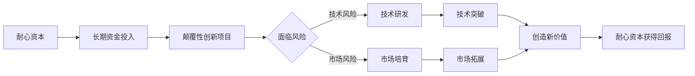

# 彼得林奇的"耐心资本"在颠覆性创新中的角色

> 关键词：彼得林奇、耐心资本、颠覆性创新、投资策略、创新生态

> 摘要：本文深入探讨了彼得林奇所倡导的“耐心资本”在颠覆性创新领域的关键角色。首先介绍了相关背景，包括目的范围、预期读者等内容。接着阐述了耐心资本和颠覆性创新的核心概念及其联系。详细分析了耐心资本在支持颠覆性创新过程中的算法原理和操作步骤，并给出数学模型与公式进行解释。通过项目实战案例，展示了耐心资本在实际中的应用及效果。探讨了耐心资本在不同实际应用场景中的作用，推荐了相关学习资源、开发工具和论文著作。最后总结了未来发展趋势与挑战，提供常见问题解答及扩展阅读参考资料，旨在全面揭示耐心资本在颠覆性创新中的重要价值和影响。

## 1. 背景介绍 
### 1.1 目的和范围
本研究的目的在于全面且深入地剖析彼得林奇的“耐心资本”在颠覆性创新中所扮演的角色。通过对耐心资本的特性、运作机制以及与颠覆性创新的相互关系进行研究，旨在为投资者、创业者、创新研究者等提供理论和实践上的参考。范围涵盖了耐心资本的概念内涵、在不同行业颠覆性创新中的应用案例、相关的投资策略以及对创新生态系统的影响等多个方面。

### 1.2 预期读者
本文预期读者包括但不限于金融投资者，他们可以从中获取关于长期投资策略和新兴创新项目投资的灵感；创业者和创新从业者，能够了解如何吸引耐心资本支持自身的颠覆性创新项目；学术研究人员，可将本文作为进一步研究耐心资本与颠覆性创新关系的参考资料；以及对科技创新和金融投资领域感兴趣的普通读者。

### 1.3 文档结构概述
本文首先对相关的背景信息进行介绍，明确研究的目的、范围、预期读者和文档结构。接着阐述耐心资本和颠覆性创新的核心概念及其内在联系，并通过文本示意图和 Mermaid 流程图进行展示。然后详细讲解耐心资本支持颠覆性创新的核心算法原理和具体操作步骤，给出相应的 Python 代码示例。通过数学模型和公式进一步分析耐心资本在颠覆性创新中的作用机制，并举例说明。通过项目实战案例，介绍开发环境搭建、源代码实现和代码解读。探讨耐心资本在实际应用场景中的作用。推荐相关的学习资源、开发工具和论文著作。最后总结未来发展趋势与挑战，提供常见问题解答和扩展阅读参考资料。

### 1.4 术语表
#### 1.4.1 核心术语定义
- **耐心资本（Patient Capital）**：是指愿意长期投入资金，不追求短期回报，能够承受较高风险，给予创新项目足够时间发展和成长的资本。这种资本注重项目的长期价值创造和潜力挖掘。
- **颠覆性创新（Disruptive Innovation）**：是指通过引入新的技术、产品或商业模式，打破现有市场格局，创造新的市场需求，对传统产业或企业造成重大冲击的创新活动。

#### 1.4.2 相关概念解释
- **长期投资（Long - term Investment）**：是指投资期限较长，通常在一年以上的投资行为。长期投资更关注资产的长期增值潜力，而不是短期的价格波动。
- **创新生态系统（Innovation Ecosystem）**：是由创新主体（如企业、科研机构、创业者等）、创新资源（如资金、人才、技术等）和创新环境（如政策、文化等）相互作用形成的复杂系统。

#### 1.4.3 缩略词列表
- **VC（Venture Capital）**：风险投资，是一种向初创企业或高成长潜力企业提供资金支持的投资方式。
- **PE（Private Equity）**：私募股权投资，是指对非上市企业进行的权益性投资。

## 2. 核心概念与联系 
### 耐心资本的概念原理
耐心资本的核心原理在于其对时间价值和长期回报的深刻理解。传统资本往往追求短期的利润最大化，而耐心资本则更注重项目的长期发展潜力。它愿意在创新项目的早期阶段投入资金，即使项目在短期内可能面临亏损或不确定性。耐心资本的投资者相信，通过长期的支持和培育，创新项目能够实现技术突破、市场拓展和价值提升，从而获得丰厚的回报。

### 颠覆性创新的概念原理
颠覆性创新通常源于新技术的出现或新商业模式的应用。它不是对现有产品或服务的渐进式改进，而是创造出全新的市场需求和竞争格局。颠覆性创新往往会挑战现有的行业领导者，因为它提供了一种更简单、更便宜、更便捷的解决方案，吸引了大量的新客户。例如，智能手机的出现颠覆了传统手机市场，电商平台的兴起改变了传统零售业的格局。

### 耐心资本与颠覆性创新的联系
耐心资本是颠覆性创新得以实现的重要支撑。颠覆性创新项目通常需要大量的资金投入，并且在发展过程中面临着技术风险、市场风险和竞争风险等多种不确定性。传统的短期资本往往因为无法承受这些风险而不愿意投资。而耐心资本的长期投资特性使其能够为颠覆性创新项目提供稳定的资金支持，帮助项目度过艰难的发展阶段。同时，耐心资本的投资者通常具有丰富的行业经验和资源，他们可以为创新项目提供战略指导、人脉资源和市场渠道等方面的支持，促进创新项目的成功。

### 文本示意图
耐心资本与颠覆性创新的联系可以用以下文本示意图表示：

耐心资本 → 长期资金支持 → 颠覆性创新项目（技术研发、市场培育）→ 技术突破、市场拓展 → 创造新价值 → 耐心资本获得回报

### Mermaid 流程图


## 3. 核心算法原理 & 具体操作步骤 
### 核心算法原理
在耐心资本支持颠覆性创新的过程中，可以用一个简单的算法来描述资金的投入和回报过程。假设一个颠覆性创新项目的发展分为多个阶段，每个阶段需要一定的资金投入，并且项目在不同阶段的风险和回报也不同。我们可以通过动态规划的方法来确定在每个阶段的最优资金投入策略，以实现长期回报的最大化。

### Python 源代码实现
```python
# 定义项目阶段数
num_stages = 5
# 每个阶段的资金需求
stage_funding = [100, 200, 300, 400, 500]
# 每个阶段的风险系数
risk_factors = [0.8, 0.7, 0.6, 0.5, 0.4]
# 每个阶段的预期回报系数
return_factors = [1.2, 1.5, 1.8, 2.0, 2.5]

# 初始化动态规划数组
dp = [[0 for _ in range(num_stages + 1)] for _ in range(num_stages + 1)]

# 动态规划求解最优投入策略
for i in range(1, num_stages + 1):
    for j in range(1, num_stages + 1):
        if j == 1:
            dp[i][j] = -stage_funding[j - 1] * risk_factors[j - 1]
        else:
            max_value = float('-inf')
            for k in range(j - 1):
                value = dp[i - 1][k] - stage_funding[j - 1] * risk_factors[j - 1] + stage_funding[k] * return_factors[k]
                if value > max_value:
                    max_value = value
            dp[i][j] = max_value

# 找到最优回报
max_return = float('-inf')
for j in range(1, num_stages + 1):
    if dp[num_stages][j] > max_return:
        max_return = dp[num_stages][j]

print("最优回报:", max_return)
```

### 具体操作步骤
1. **项目评估**：对颠覆性创新项目进行全面的评估，包括技术可行性、市场潜力、竞争态势等方面。确定项目的发展阶段和每个阶段的资金需求、风险系数和预期回报系数。
2. **资金规划**：根据项目评估结果，制定资金投入计划。使用动态规划算法确定在每个阶段的最优资金投入策略，以实现长期回报的最大化。
3. **投资决策**：根据资金规划，做出投资决策。耐心资本的投资者需要在项目的早期阶段就投入资金，并在项目发展过程中持续提供支持。
4. **项目监控**：在项目实施过程中，对项目进行密切的监控。及时了解项目的进展情况、技术研发成果、市场反馈等信息，根据实际情况调整投资策略。
5. **回报实现**：当项目取得成功，实现技术突破和市场拓展后，耐心资本的投资者可以通过股权转让、上市等方式实现回报。

## 4. 数学模型和公式 & 详细讲解 & 举例说明 
### 数学模型
假设一个颠覆性创新项目的发展分为 $n$ 个阶段，每个阶段的资金需求为 $C_i$（$i = 1,2,\cdots,n$），风险系数为 $r_i$，预期回报系数为 $R_i$。设 $x_{ij}$ 表示在第 $i$ 个阶段对第 $j$ 个阶段的资金投入决策（$x_{ij}=1$ 表示投入，$x_{ij}=0$ 表示不投入），$V_i$ 表示在第 $i$ 个阶段的项目价值。

则项目的初始价值 $V_0 = 0$，第 $i$ 个阶段的项目价值可以表示为：

$$V_i=\sum_{j = 1}^{i - 1}x_{ij}C_jR_j-\sum_{j = 1}^{i}x_{ij}C_jr_j$$

目标是在满足一定约束条件下，最大化最终阶段的项目价值 $V_n$。

### 详细讲解
上述数学模型考虑了项目在不同阶段的资金投入、风险和回报。$x_{ij}C_jR_j$ 表示在第 $i$ 个阶段获得的来自第 $j$ 个阶段投入的回报，$x_{ij}C_jr_j$ 表示在第 $i$ 个阶段为第 $j$ 个阶段投入所承担的风险成本。通过动态规划的方法，可以在每个阶段选择最优的资金投入决策，使得最终阶段的项目价值最大。

### 举例说明
假设有一个颠覆性创新项目，分为 3 个阶段。每个阶段的资金需求、风险系数和预期回报系数如下：

| 阶段 | 资金需求 $C_i$ | 风险系数 $r_i$ | 预期回报系数 $R_i$ |
|---|---|---|---|
| 1 | 100 | 0.8 | 1.2 |
| 2 | 200 | 0.7 | 1.5 |
| 3 | 300 | 0.6 | 1.8 |

初始价值 $V_0 = 0$。

在第 1 阶段，$V_1=-C_1r_1=-100\times0.8=-80$。

在第 2 阶段，有两种情况：
- 若不投入第 1 阶段的回报，$V_{21}=-C_2r_2=-200\times0.7=-140$。
- 若投入第 1 阶段的回报，$V_{22}=C_1R_1 - C_2r_2=100\times1.2-200\times0.7=-20$。

所以 $V_2=\max\{V_{21},V_{22}\}=-20$。

在第 3 阶段，有多种情况，通过计算比较不同决策下的项目价值，最终可以得到最优的项目价值 $V_3$。

## 5. 项目实战：代码实际案例和详细解释说明 
### 5.1  开发环境搭建
- **操作系统**：可以选择 Windows、Linux 或 macOS 操作系统。
- **Python 环境**：安装 Python 3.x 版本。可以从 Python 官方网站（https://www.python.org/downloads/） 下载并安装。
- **开发工具**：推荐使用 PyCharm 或 Jupyter Notebook 作为开发工具。PyCharm 是一款功能强大的 Python 集成开发环境，Jupyter Notebook 则适合进行交互式编程和数据分析。

### 5.2  源代码详细实现和代码解读
```python
# 定义项目阶段数
num_stages = 5
# 每个阶段的资金需求
stage_funding = [100, 200, 300, 400, 500]
# 每个阶段的风险系数
risk_factors = [0.8, 0.7, 0.6, 0.5, 0.4]
# 每个阶段的预期回报系数
return_factors = [1.2, 1.5, 1.8, 2.0, 2.5]

# 初始化动态规划数组
dp = [[0 for _ in range(num_stages + 1)] for _ in range(num_stages + 1)]

# 动态规划求解最优投入策略
for i in range(1, num_stages + 1):
    for j in range(1, num_stages + 1):
        if j == 1:
            dp[i][j] = -stage_funding[j - 1] * risk_factors[j - 1]
        else:
            max_value = float('-inf')
            for k in range(j - 1):
                value = dp[i - 1][k] - stage_funding[j - 1] * risk_factors[j - 1] + stage_funding[k] * return_factors[k]
                if value > max_value:
                    max_value = value
            dp[i][j] = max_value

# 找到最优回报
max_return = float('-inf')
for j in range(1, num_stages + 1):
    if dp[num_stages][j] > max_return:
        max_return = dp[num_stages][j]

print("最优回报:", max_return)
```

**代码解读**：
1. **变量定义**：定义了项目阶段数 `num_stages`、每个阶段的资金需求 `stage_funding`、风险系数 `risk_factors` 和预期回报系数 `return_factors`。
2. **动态规划数组初始化**：使用二维数组 `dp` 来存储每个阶段的最优项目价值。
3. **动态规划求解**：通过两层循环遍历每个阶段，对于每个阶段，根据不同的资金投入决策计算项目价值，并选择最优的价值存储在 `dp` 数组中。
4. **最优回报计算**：遍历最后一个阶段的所有可能状态，找到最优回报。

### 5.3  代码解读与分析
这段代码通过动态规划的方法解决了耐心资本在颠覆性创新项目中的最优资金投入策略问题。动态规划的核心思想是将一个复杂的问题分解为多个子问题，并通过求解子问题的最优解来得到原问题的最优解。在这个问题中，每个阶段的最优资金投入决策依赖于之前阶段的决策，因此可以使用动态规划来求解。

代码的时间复杂度为 $O(n^2)$，其中 $n$ 是项目的阶段数。空间复杂度也为 $O(n^2)$，主要用于存储动态规划数组。在实际应用中，如果项目阶段数较多，可以考虑使用滚动数组等方法来优化空间复杂度。

## 6. 实际应用场景 
### 科技创业领域
在科技创业领域，许多颠覆性创新项目需要大量的资金投入和长期的研发周期。例如，人工智能、生物医药、新能源等领域的创业项目，往往需要数年甚至数十年的时间才能实现技术突破和市场应用。耐心资本可以为这些创业项目提供长期的资金支持，帮助创业者度过艰难的研发阶段和市场培育阶段。例如，一些风险投资机构会对具有潜力的人工智能创业公司进行长期投资，不追求短期的盈利，而是等待公司在技术和市场上取得突破后获得丰厚的回报。

### 传统产业升级
传统产业在面临新兴技术的冲击时，需要进行转型升级。耐心资本可以支持传统产业企业进行技术创新和商业模式创新，帮助它们实现向高端制造业、智能制造、绿色产业等方向的转型。例如，一些传统的制造业企业可以通过引入大数据、物联网等技术，实现生产过程的智能化和自动化。耐心资本可以为这些企业提供资金支持，帮助它们进行技术研发、设备更新和人才培养。

### 社会创新项目
社会创新项目旨在解决社会问题，如教育公平、环境保护、医疗健康等。这些项目通常具有较长的回报周期和较高的社会价值。耐心资本可以支持社会创新项目的开展，为社会发展做出贡献。例如，一些公益组织和社会企业会开展教育扶贫项目，通过提供优质的教育资源和培训服务，帮助贫困地区的儿童获得更好的教育机会。耐心资本可以为这些项目提供资金支持，确保项目的长期运行和可持续发展。

## 7. 工具和资源推荐
### 7.1 学习资源推荐
#### 7.1.1 书籍推荐
- 《彼得·林奇的成功投资》：彼得·林奇的经典著作，详细介绍了他的投资理念和方法，对理解耐心资本的概念和应用具有重要的参考价值。
- 《创新者的窘境》：克莱顿·克里斯坦森的著作，深入探讨了颠覆性创新的理论和实践，为研究颠覆性创新提供了重要的理论基础。
- 《资本的冒险》：讲述了风险投资和创业的故事，对了解耐心资本在创业领域的应用有很大帮助。

#### 7.1.2 在线课程
- Coursera 平台上的“投资学原理”课程：系统介绍了投资学的基本原理和方法，包括长期投资策略和风险投资等内容。
- edX 平台上的“创新管理”课程：讲解了创新的理论和实践，包括颠覆性创新的概念、过程和管理方法。

#### 7.1.3 技术博客和网站
- 36氪：关注科技、创业和投资领域的最新动态，提供大量关于颠覆性创新和风险投资的报道和分析。
- 钛媒体：聚焦于科技、商业和创新领域，有许多关于耐心资本和颠覆性创新的深度文章和观点。

### 7.2 开发工具框架推荐
#### 7.2.1 IDE和编辑器
- PyCharm：功能强大的 Python 集成开发环境，提供代码编辑、调试、版本控制等功能，适合开发复杂的 Python 项目。
- Jupyter Notebook：交互式编程环境，适合进行数据分析、算法验证和代码演示。

#### 7.2.2 调试和性能分析工具
- PDB：Python 内置的调试器，可以帮助开发者定位和解决代码中的问题。
- cProfile：Python 内置的性能分析工具，可以分析代码的运行时间和函数调用情况，帮助优化代码性能。

#### 7.2.3 相关框架和库
- NumPy：Python 的数值计算库，提供高效的数组操作和数学函数，可用于实现动态规划算法。
- Pandas：Python 的数据处理库，可用于处理和分析项目数据，如资金需求、风险系数等。

### 7.3 相关论文著作推荐
#### 7.3.1 经典论文
- Christensen, C. M. (1997). The Innovator's Dilemma: When New Technologies Cause Great Firms to Fail. 该论文提出了颠覆性创新的概念，并深入分析了颠覆性创新对企业的影响。
- Lerner, J. (2002). Venture Capitalists and the Oversight of Private Firms. 研究了风险投资机构在企业监督和管理中的作用，对理解耐心资本的运作机制有重要意义。

#### 7.3.2 最新研究成果
- 关注顶级学术期刊如《Management Science》、《Strategic Management Journal》等，这些期刊经常发表关于创新管理、投资策略等方面的最新研究成果。

#### 7.3.3 应用案例分析
- 可以参考一些知名企业的创新案例，如特斯拉在电动汽车领域的颠覆性创新、亚马逊在电商领域的创新等，分析耐心资本在这些案例中的作用和影响。

## 8. 总结：未来发展趋势与挑战
### 未来发展趋势
- **多元化投资主体**：未来，耐心资本的投资主体将更加多元化。除了传统的风险投资机构和私募股权投资机构外，养老基金、保险公司等长期资金持有者也将越来越多地参与到耐心资本投资中。这些机构具有长期资金的优势，能够更好地支持颠覆性创新项目的发展。
- **跨领域融合**：耐心资本将促进不同领域的融合创新。例如，科技与金融的融合、医疗与人工智能的融合等。通过跨领域的合作和创新，可以创造出更多的颠覆性创新机会。
- **全球合作加强**：随着全球化的发展，耐心资本的投资将更加注重全球合作。投资者将在全球范围内寻找具有潜力的颠覆性创新项目，促进创新资源的全球流动和优化配置。

### 挑战
- **风险评估难度大**：颠覆性创新项目往往具有较高的不确定性和风险，传统的风险评估方法可能无法准确评估这些项目的风险。因此，如何建立有效的风险评估模型和方法，是耐心资本投资者面临的一个重要挑战。
- **退出机制不完善**：耐心资本的投资期限较长，退出机制相对复杂。目前，市场上的退出渠道主要包括股权转让、上市等，但这些渠道在实际操作中可能存在一些问题，如退出时间长、退出价格不理想等。因此，如何完善退出机制，保障投资者的权益，是需要解决的问题。
- **人才短缺**：耐心资本投资需要具备专业知识和丰富经验的人才，包括投资经理、行业专家、技术顾问等。目前，市场上这类人才相对短缺，如何培养和吸引优秀的人才，是耐心资本行业发展的关键。

## 9. 附录：常见问题与解答
### 问题 1：耐心资本与普通风险投资有什么区别？
**解答**：耐心资本更注重长期投资，愿意承受较高的风险，给予创新项目足够的时间发展，不追求短期回报。而普通风险投资虽然也投资于高风险的创新项目，但可能更关注项目的短期盈利和退出机会。

### 问题 2：如何判断一个项目是否具有颠覆性创新的潜力？
**解答**：可以从多个方面进行判断，如技术创新性、市场需求、竞争态势等。具有颠覆性创新潜力的项目通常具有独特的技术或商业模式，能够满足市场的潜在需求，并且对现有市场格局具有较大的冲击。

### 问题 3：耐心资本投资的回报周期一般有多长？
**解答**：耐心资本投资的回报周期通常较长，可能需要数年甚至数十年的时间。具体的回报周期取决于项目的性质、发展阶段和市场环境等因素。

### 问题 4：耐心资本投资者如何控制投资风险？
**解答**：耐心资本投资者可以通过多种方式控制投资风险，如进行充分的项目评估和尽职调查、分散投资、参与项目的管理和监督等。同时，投资者也需要具备较强的风险承受能力和长期投资的理念。

## 10. 扩展阅读 & 参考资料
### 扩展阅读
- 《金融炼金术》：乔治·索罗斯的著作，探讨了金融市场的运行规律和投资哲学，对理解资本运作和投资策略有一定的启发。
- 《失控》：凯文·凯利的著作，讲述了科技、社会和经济的发展趋势，对思考颠覆性创新的未来发展具有重要的参考价值。

### 参考资料
- 彼得·林奇的官方网站和相关访谈资料。
- 各学术数据库中的相关研究论文和报告。
- 行业研究机构发布的关于风险投资、创新管理等方面的研究报告。