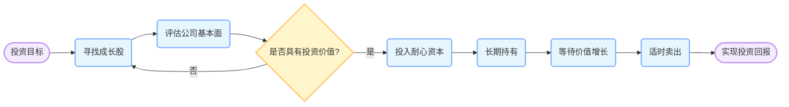

# 彼得林奇的"耐心资本"投资案例

> 关键词：彼得林奇、耐心资本、投资案例、价值投资、成长股投资

> 摘要：本文深入探讨彼得林奇的“耐心资本”投资理念及相关案例。通过对彼得林奇投资思想的剖析，阐述“耐心资本”在投资中的重要性。详细介绍其经典投资案例，分析投资决策过程、背后的逻辑以及所取得的成果。同时，从数学模型、实际操作等多方面对其投资方法进行解读，探讨“耐心资本”在不同市场环境下的应用。此外，还介绍了相关的学习资源、开发工具等，最后对“耐心资本”投资理念的未来发展趋势与挑战进行总结，并解答常见问题，为投资者提供全面且深入的参考。

## 1. 背景介绍 
### 1.1 目的和范围
本文旨在全面且深入地研究彼得林奇的“耐心资本”投资案例。通过对这些案例的详细分析，挖掘其投资策略背后的逻辑和原理，为投资者提供具有借鉴意义的投资思路和方法。范围涵盖彼得林奇在其投资生涯中的经典投资案例，包括投资决策的依据、过程以及最终的投资成果等方面。同时，还将探讨“耐心资本”投资理念在不同市场环境下的应用和适应性。

### 1.2 预期读者
本文预期读者主要包括对投资领域感兴趣的初学者，希望通过学习彼得林奇的投资案例来了解投资的基本原理和方法；有一定投资经验的投资者，期望从彼得林奇的成功案例中获取新的投资灵感和策略；以及金融专业的学生和研究人员，用于学术研究和学习。

### 1.3 文档结构概述
本文首先介绍彼得林奇及其“耐心资本”投资理念的背景，包括目的、预期读者和文档结构概述等内容。接着阐述核心概念与联系，包括“耐心资本”的原理和架构，并通过示意图和流程图进行直观展示。然后详细讲解核心算法原理和具体操作步骤，使用 Python 源代码进行阐述。之后介绍数学模型和公式，并结合实际案例进行详细讲解。在项目实战部分，给出具体的代码实现和详细解释说明。再探讨实际应用场景，介绍相关的工具和资源推荐。最后总结“耐心资本”投资理念的未来发展趋势与挑战，解答常见问题，并提供扩展阅读和参考资料。

### 1.4 术语表
#### 1.4.1 核心术语定义
- **耐心资本**：指投资者愿意长期持有资产，不被短期市场波动所影响，等待资产价值逐步增长的投资资金。这种资本体现了投资者对投资项目的信心和耐心，相信随着时间的推移，投资将获得丰厚的回报。
- **成长股**：指发行股票的公司具有良好的发展前景，其销售额和利润额持续增长，速度快于整个国家和本行业的增长水平的股票。成长股通常具有较高的市盈率，但投资者预期其未来的盈利增长能够支撑较高的股价。
- **价值投资**：一种投资策略，其核心是寻找被市场低估的股票，即股票的市场价格低于其内在价值。投资者通过对公司的基本面分析，包括财务状况、行业地位、管理团队等因素，来评估股票的内在价值，并在价格低于价值时买入，等待价格回归价值。

#### 1.4.2 相关概念解释
- **内在价值**：指股票所代表的公司的真实价值，是基于公司的财务状况、盈利能力、资产质量、行业前景等多种因素综合评估得出的价值。内在价值是价值投资的重要依据，投资者通过比较股票的市场价格和内在价值来判断是否具有投资价值。
- **市盈率（P/E）**：指股票价格除以每股收益的比率，反映了市场对公司盈利的预期。市盈率越高，说明市场对公司未来盈利增长的预期越高，但也可能意味着股票被高估；市盈率越低，说明市场对公司的预期较低，但也可能存在被低估的机会。
- **市净率（P/B）**：指股票价格除以每股净资产的比率，反映了市场对公司净资产的估值。市净率越低，说明股票的价格相对净资产越便宜，可能存在投资价值；市净率越高，说明市场对公司的预期较高，但也可能存在风险。

#### 1.4.3 缩略词列表
- **P/E**：市盈率（Price-to-Earnings Ratio）
- **P/B**：市净率（Price-to-Book Ratio）

## 2. 核心概念与联系 
### 2.1 “耐心资本”的原理
彼得林奇的“耐心资本”投资理念基于对公司基本面的深入研究和对市场长期趋势的判断。他认为，优秀的公司具有持续增长的潜力，其价值会随着时间的推移而不断提升。投资者应该寻找那些具有良好发展前景的公司，并长期持有其股票，不受短期市场波动的影响。

“耐心资本”的原理在于相信公司的内在价值最终会在市场价格中得到体现。短期市场价格可能会受到各种因素的影响，如宏观经济环境、行业竞争、市场情绪等，导致价格波动较大。但从长期来看，公司的盈利能力和成长潜力是决定其价值的关键因素。投资者通过耐心持有股票，等待公司的业绩增长，从而实现资产的增值。

### 2.2 核心概念的架构
以下是“耐心资本”投资理念的核心概念架构示意图：



该架构图展示了“耐心资本”投资的基本流程。首先，投资者确定投资目标，然后寻找具有成长潜力的股票。接着，对公司的基本面进行评估，判断是否具有投资价值。如果具有投资价值，则投入耐心资本并长期持有，等待公司的价值增长。最后，在适当的时候卖出股票，实现投资回报。

### 2.3 核心概念的联系
“耐心资本”与成长股投资、价值投资密切相关。成长股投资是“耐心资本”的主要投资对象，因为成长股具有较高的增长潜力，能够为投资者带来丰厚的回报。而价值投资则是“耐心资本”的投资依据，通过对公司基本面的分析，寻找被市场低估的股票，以较低的价格买入，从而提高投资的安全性和回报率。

同时，“耐心资本”也是实现成长股投资和价值投资的关键因素。只有具备耐心，投资者才能在长期持有股票的过程中，不受短期市场波动的影响，等待公司的价值逐步体现。如果投资者缺乏耐心，频繁买卖股票，可能会错过公司的成长机会，甚至因为市场波动而遭受损失。

## 3. 核心算法原理 & 具体操作步骤 
### 3.1 核心算法原理
在彼得林奇的投资理念中，核心算法原理主要基于对公司基本面的分析和对股票估值的判断。以下是一个简化的 Python 代码示例，用于计算股票的市盈率和市净率，并根据这些指标判断股票是否具有投资价值。

```python
# 定义公司基本面数据类
class CompanyFundamentals:
    def __init__(self, stock_price, earnings_per_share, book_value_per_share):
        self.stock_price = stock_price
        self.earnings_per_share = earnings_per_share
        self.book_value_per_share = book_value_per_share

    # 计算市盈率
    def calculate_pe_ratio(self):
        if self.earnings_per_share == 0:
            return None
        return self.stock_price / self.earnings_per_share

    # 计算市净率
    def calculate_pb_ratio(self):
        if self.book_value_per_share == 0:
            return None
        return self.stock_price / self.book_value_per_share

# 定义投资决策类
class InvestmentDecision:
    def __init__(self, pe_threshold, pb_threshold):
        self.pe_threshold = pe_threshold
        self.pb_threshold = pb_threshold

    # 判断股票是否具有投资价值
    def is_investable(self, company_fundamentals):
        pe_ratio = company_fundamentals.calculate_pe_ratio()
        pb_ratio = company_fundamentals.calculate_pb_ratio()

        if pe_ratio is None or pb_ratio is None:
            return False

        if pe_ratio < self.pe_threshold and pb_ratio < self.pb_threshold:
            return True
        return False

# 示例使用
if __name__ == "__main__":
    # 假设公司基本面数据
    stock_price = 50
    earnings_per_share = 5
    book_value_per_share = 20

    # 创建公司基本面对象
    company = CompanyFundamentals(stock_price, earnings_per_share, book_value_per_share)

    # 设定市盈率和市净率阈值
    pe_threshold = 15
    pb_threshold = 2

    # 创建投资决策对象
    decision_maker = InvestmentDecision(pe_threshold, pb_threshold)

    # 判断股票是否具有投资价值
    if decision_maker.is_investable(company):
        print("该股票具有投资价值")
    else:
        print("该股票不具有投资价值")
```

### 3.2 具体操作步骤
1. **收集公司基本面数据**：投资者需要收集公司的财务报表、行业报告等相关资料，获取公司的股票价格、每股收益、每股净资产等关键数据。
2. **计算估值指标**：使用上述 Python 代码或其他工具，计算公司股票的市盈率和市净率等估值指标。
3. **设定估值阈值**：根据市场情况和个人投资策略，设定市盈率和市净率的阈值。一般来说，较低的市盈率和市净率意味着股票可能被低估，具有投资价值。
4. **判断投资价值**：将计算得到的估值指标与设定的阈值进行比较，如果估值指标低于阈值，则认为该股票具有投资价值；否则，认为该股票不具有投资价值。
5. **做出投资决策**：如果股票具有投资价值，投资者可以考虑投入耐心资本，长期持有该股票；如果股票不具有投资价值，投资者可以继续寻找其他投资机会。

## 4. 数学模型和公式 & 详细讲解 & 举例说明 
### 4.1 市盈率（P/E）公式及讲解
市盈率（P/E）的计算公式为：
$$P/E = \frac{股票价格}{每股收益}$$

市盈率反映了市场对公司盈利的预期。较高的市盈率意味着市场对公司未来盈利增长的预期较高，但也可能意味着股票被高估；较低的市盈率则意味着市场对公司的预期较低，但也可能存在被低估的机会。

例如，某公司的股票价格为 50 元，每股收益为 5 元，则该公司的市盈率为：
$$P/E = \frac{50}{5} = 10$$

这意味着投资者愿意为该公司每股 1 元的收益支付 10 元的价格。如果市场平均市盈率为 15，那么该公司的市盈率相对较低，可能被认为具有投资价值。

### 4.2 市净率（P/B）公式及讲解
市净率（P/B）的计算公式为：
$$P/B = \frac{股票价格}{每股净资产}$$

市净率反映了市场对公司净资产的估值。较低的市净率意味着股票的价格相对净资产较便宜，可能存在投资价值；较高的市净率则意味着市场对公司的预期较高，但也可能存在风险。

例如，某公司的股票价格为 50 元，每股净资产为 20 元，则该公司的市净率为：
$$P/B = \frac{50}{20} = 2.5$$

如果同行业公司的平均市净率为 3，那么该公司的市净率相对较低，可能被认为具有投资价值。

### 4.3 举例说明
假设投资者想要分析两家公司 A 和 B 的投资价值。以下是两家公司的相关数据：

| 公司 | 股票价格（元） | 每股收益（元） | 每股净资产（元） |
|---|---|---|---|
| A | 40 | 4 | 20 |
| B | 60 | 6 | 15 |

首先，计算两家公司的市盈率和市净率：

- 公司 A：
  - 市盈率：$P/E_A = \frac{40}{4} = 10$
  - 市净率：$P/B_A = \frac{40}{20} = 2$

- 公司 B：
  - 市盈率：$P/E_B = \frac{60}{6} = 10$
  - 市净率：$P/B_B = \frac{60}{15} = 4$

假设投资者设定的市盈率阈值为 15，市净率阈值为 3。可以看出，公司 A 的市盈率和市净率都低于阈值，而公司 B 的市净率高于阈值。因此，从估值角度来看，公司 A 可能更具有投资价值。

## 5. 项目实战：代码实际案例和详细解释说明 
### 5.1  开发环境搭建
在进行投资分析的项目实战中，我们可以使用 Python 作为开发语言。以下是搭建开发环境的步骤：

1. **安装 Python**：从 Python 官方网站（https://www.python.org/downloads/）下载并安装适合你操作系统的 Python 版本。建议安装 Python 3.7 及以上版本。
2. **安装开发工具**：可以选择使用 PyCharm、VS Code 等集成开发环境（IDE），或者使用 Jupyter Notebook 进行交互式开发。这里以 PyCharm 为例，从 JetBrains 官方网站（https://www.jetbrains.com/pycharm/download/）下载并安装 PyCharm。
3. **安装必要的库**：在命令行中使用以下命令安装所需的库：
```sh
pip install pandas numpy matplotlib
```

### 5.2  源代码详细实现和代码解读
以下是一个更完整的 Python 代码示例，用于分析多只股票的投资价值，并绘制市盈率和市净率的柱状图。

```python
import pandas as pd
import numpy as np
import matplotlib.pyplot as plt

# 定义公司基本面数据类
class CompanyFundamentals:
    def __init__(self, stock_name, stock_price, earnings_per_share, book_value_per_share):
        self.stock_name = stock_name
        self.stock_price = stock_price
        self.earnings_per_share = earnings_per_share
        self.book_value_per_share = book_value_per_share

    # 计算市盈率
    def calculate_pe_ratio(self):
        if self.earnings_per_share == 0:
            return None
        return self.stock_price / self.earnings_per_share

    # 计算市净率
    def calculate_pb_ratio(self):
        if self.book_value_per_share == 0:
            return None
        return self.stock_price / self.book_value_per_share

# 定义投资决策类
class InvestmentDecision:
    def __init__(self, pe_threshold, pb_threshold):
        self.pe_threshold = pe_threshold
        self.pb_threshold = pb_threshold

    # 判断股票是否具有投资价值
    def is_investable(self, company_fundamentals):
        pe_ratio = company_fundamentals.calculate_pe_ratio()
        pb_ratio = company_fundamentals.calculate_pb_ratio()

        if pe_ratio is None or pb_ratio is None:
            return False

        if pe_ratio < self.pe_threshold and pb_ratio < self.pb_threshold:
            return True
        return False

# 示例数据
data = [
    ["公司 A", 40, 4, 20],
    ["公司 B", 60, 6, 15],
    ["公司 C", 30, 3, 10],
    ["公司 D", 80, 8, 25]
]

# 创建公司基本面对象列表
companies = []
for row in data:
    stock_name, stock_price, earnings_per_share, book_value_per_share = row
    company = CompanyFundamentals(stock_name, stock_price, earnings_per_share, book_value_per_share)
    companies.append(company)

# 设定市盈率和市净率阈值
pe_threshold = 15
pb_threshold = 3

# 创建投资决策对象
decision_maker = InvestmentDecision(pe_threshold, pb_threshold)

# 分析每只股票的投资价值
results = []
for company in companies:
    is_investable = decision_maker.is_investable(company)
    pe_ratio = company.calculate_pe_ratio()
    pb_ratio = company.calculate_pb_ratio()
    results.append([company.stock_name, pe_ratio, pb_ratio, is_investable])

# 将结果转换为 DataFrame
df = pd.DataFrame(results, columns=["股票名称", "市盈率", "市净率", "是否具有投资价值"])

# 打印结果
print(df)

# 绘制市盈率和市净率的柱状图
x = np.arange(len(companies))
width = 0.35

fig, ax = plt.subplots()
rects1 = ax.bar(x - width/2, df["市盈率"], width, label='市盈率')
rects2 = ax.bar(x + width/2, df["市净率"], width, label='市净率')

ax.set_ylabel('估值指标')
ax.set_title('股票估值指标')
ax.set_xticks(x)
ax.set_xticklabels(df["股票名称"])
ax.legend()

def autolabel(rects):
    for rect in rects:
        height = rect.get_height()
        ax.annotate('{:.2f}'.format(height),
                    xy=(rect.get_x() + rect.get_width() / 2, height),
                    xytext=(0, 3),  # 3 points vertical offset
                    textcoords="offset points",
                    ha='center', va='bottom')

autolabel(rects1)
autolabel(rects2)

fig.tight_layout()

plt.show()
```

### 5.3  代码解读与分析
1. **数据类定义**：`CompanyFundamentals` 类用于存储公司的基本面数据，并提供计算市盈率和市净率的方法。`InvestmentDecision` 类用于判断股票是否具有投资价值。
2. **数据处理**：将示例数据存储在列表中，并创建 `CompanyFundamentals` 对象列表。然后，使用 `InvestmentDecision` 对象对每只股票进行投资价值分析，并将结果存储在 `results` 列表中。
3. **结果展示**：将分析结果转换为 `pandas` 的 `DataFrame` 并打印出来，方便查看。同时，使用 `matplotlib` 库绘制市盈率和市净率的柱状图，直观展示各股票的估值情况。

通过这个代码示例，投资者可以快速分析多只股票的投资价值，并通过可视化工具直观地比较各股票的估值指标。

## 6. 实际应用场景 
### 6.1 个人投资者
对于个人投资者来说，彼得林奇的“耐心资本”投资理念具有重要的指导意义。个人投资者通常资金规模较小，缺乏专业的投资知识和经验。通过学习彼得林奇的投资方法，个人投资者可以寻找那些具有成长潜力的公司，投入耐心资本，长期持有股票。

例如，个人投资者可以关注日常生活中的消费品牌，如可口可乐、星巴克等。这些公司具有强大的品牌影响力和稳定的业绩增长，长期持有其股票可能会获得丰厚的回报。同时，个人投资者也可以通过分析公司的基本面数据，如市盈率、市净率等，选择被市场低估的股票进行投资。

### 6.2 机构投资者
机构投资者，如基金公司、保险公司等，也可以借鉴彼得林奇的“耐心资本”投资理念。机构投资者通常拥有较大的资金规模和专业的投资团队，能够进行更深入的研究和分析。

在投资组合管理中，机构投资者可以将一部分资金配置到具有成长潜力的股票上，并长期持有。例如，一些成长型基金经理会关注新兴产业，如科技、医疗等领域的公司，通过深入研究和分析，选择具有核心竞争力的公司进行投资。同时，机构投资者也可以通过分散投资的方式，降低投资风险，提高投资组合的稳定性。

### 6.3 企业战略投资
企业在进行战略投资时，也可以运用“耐心资本”的理念。企业可以寻找与自身业务相关或具有协同效应的公司进行投资，通过长期持有股权，实现资源共享、优势互补，促进企业的发展。

例如，一家科技公司可以投资一些具有创新技术的初创企业，通过提供资金、技术和市场支持，帮助初创企业成长。在这个过程中，企业需要有耐心，等待初创企业的技术成熟和市场拓展，从而实现投资回报。

## 7. 工具和资源推荐
### 7.1 学习资源推荐
#### 7.1.1 书籍推荐
- 《彼得·林奇的成功投资》：彼得·林奇的经典著作，详细介绍了他的投资理念、方法和案例，是学习投资的必读之书。
- 《战胜华尔街》：林奇在这本书中分享了他在富达麦哲伦基金的投资经验和心得，对于理解他的投资策略具有重要的参考价值。
- 《聪明的投资者》：本杰明·格雷厄姆的经典著作，价值投资的奠基之作，对彼得林奇的投资理念产生了深远的影响。

#### 7.1.2 在线课程
- Coursera 上的“投资学原理”：由知名大学的教授授课，系统介绍投资学的基本原理和方法，包括股票投资、债券投资、资产配置等内容。
- edX 上的“金融市场”：提供金融市场的全面介绍，包括市场结构、投资工具、风险管理等方面的知识，有助于投资者建立完整的投资知识体系。

#### 7.1.3 技术博客和网站
- 雪球网：国内知名的投资交流社区，提供股票、基金等投资产品的信息和分析，投资者可以在上面分享自己的投资经验和观点。
- Seeking Alpha：国外知名的投资分析网站，提供全球金融市场的资讯和研究报告，有很多专业的投资分析师发表观点和建议。

### 7.2 开发工具框架推荐
#### 7.2.1 IDE和编辑器
- PyCharm：功能强大的 Python 集成开发环境，提供代码编辑、调试、版本控制等功能，适合专业开发者使用。
- VS Code：轻量级的代码编辑器，支持多种编程语言，具有丰富的插件生态系统，可以根据需要进行定制。

#### 7.2.2 调试和性能分析工具
- pdb：Python 自带的调试器，可以帮助开发者在代码执行过程中进行调试，查找和解决问题。
- cProfile：Python 标准库中的性能分析工具，可以分析代码的执行时间和资源消耗情况，帮助开发者优化代码性能。

#### 7.2.3 相关框架和库
- pandas：用于数据处理和分析的 Python 库，提供高效的数据结构和数据分析工具，方便投资者处理和分析金融数据。
- numpy：Python 的科学计算库，提供高性能的数组和矩阵运算功能，在金融数据分析中经常使用。
- matplotlib：用于数据可视化的 Python 库，可以绘制各种类型的图表，如折线图、柱状图、散点图等，帮助投资者直观地展示数据。

### 7.3 相关论文著作推荐
#### 7.3.1 经典论文
- “The Capital Asset Pricing Model: Theory and Evidence”：由 Eugene F. Fama 和 Kenneth R. French 发表的经典论文，对资本资产定价模型进行了深入的研究和探讨，是投资领域的重要文献。
- “Efficient Capital Markets: A Review of Theory and Empirical Work”：由 Eugene F. Fama 发表的论文，提出了有效市场假说，对金融市场的效率和定价机制进行了系统的分析。

#### 7.3.2 最新研究成果
- 关注顶尖金融学术期刊，如《Journal of Finance》、《Review of Financial Studies》等，这些期刊发表了许多关于投资、金融市场等领域的最新研究成果。

#### 7.3.3 应用案例分析
- 可以参考一些专业的金融研究机构发布的投资案例分析报告，如麦肯锡、波士顿咨询集团等机构的报告，了解不同行业和公司的投资策略和实践经验。

## 8. 总结：未来发展趋势与挑战
### 8.1 未来发展趋势
- **数字化和智能化**：随着科技的不断发展，投资领域也将越来越数字化和智能化。投资者可以利用大数据、人工智能等技术，更准确地分析公司的基本面数据和市场趋势，提高投资决策的效率和准确性。
- **可持续投资**：越来越多的投资者开始关注企业的社会责任和可持续发展。未来，可持续投资将成为投资领域的重要趋势，投资者将更加注重企业的环境、社会和治理（ESG）表现。
- **全球资产配置**：随着全球经济一体化的发展，投资者将更加注重全球资产配置。通过投资不同国家和地区的资产，可以降低投资风险，提高投资回报。

### 8.2 挑战
- **市场不确定性增加**：全球政治、经济环境的不确定性增加，如贸易摩擦、地缘政治冲突等，给投资带来了更大的风险。投资者需要更加谨慎地分析市场趋势，制定合理的投资策略。
- **技术变革带来的挑战**：虽然数字化和智能化技术为投资带来了便利，但也带来了新的挑战。例如，数据安全和隐私问题、人工智能算法的可靠性等，都需要投资者关注和解决。
- **投资者情绪的影响**：投资者情绪对市场的影响越来越大，市场的波动可能会受到投资者情绪的驱动。投资者需要保持理性，不受情绪的影响，做出明智的投资决策。

## 9. 附录：常见问题与解答
### 9.1 如何确定市盈率和市净率的阈值？
市盈率和市净率的阈值没有固定的标准，需要根据市场情况、行业特点和个人投资策略来确定。一般来说，可以参考同行业公司的平均市盈率和市净率，以及历史数据的统计分析。同时，也需要结合公司的基本面情况，如盈利能力、成长潜力等，进行综合判断。

### 9.2 “耐心资本”投资是否适合所有投资者？
“耐心资本”投资并不适合所有投资者。这种投资策略需要投资者具备较强的耐心和长期投资的理念，能够承受短期市场波动带来的压力。对于一些短期投资者或风险偏好较低的投资者来说，可能不太适合采用“耐心资本”投资策略。

### 9.3 如何选择具有成长潜力的公司？
选择具有成长潜力的公司需要从多个方面进行分析。可以关注公司的行业前景、市场份额、产品创新能力、管理团队等因素。同时，也可以参考公司的财务报表，分析其盈利能力、资产质量、现金流等指标。此外，还可以关注公司的战略规划和发展方向，判断其未来的成长潜力。

## 10. 扩展阅读 & 参考资料
### 10.1 扩展阅读
- 《金融炼金术》：乔治·索罗斯的著作，介绍了他的投资哲学和方法，对于理解金融市场的运行机制和投资策略有很大的帮助。
- 《黑天鹅》：纳西姆·尼古拉斯·塔勒布的著作，探讨了不可预测的重大事件对金融市场和投资的影响，提醒投资者要关注风险。

### 10.2 参考资料
- 彼得·林奇的官方网站和访谈记录，获取第一手的投资经验和观点。
- 金融数据提供商，如 Bloomberg、Wind 等，获取准确的金融数据和市场信息。
- 专业的金融研究机构和智库的报告，了解最新的投资研究成果和市场趋势。