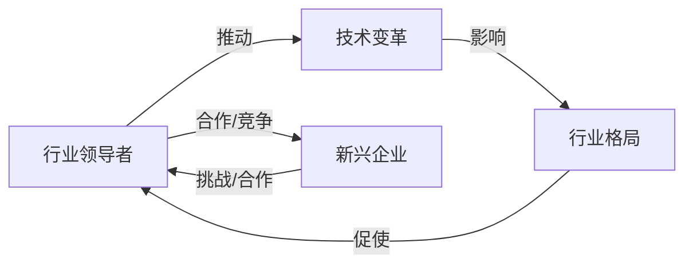

# 彼得林奇的“行业领导者”在技术变革中的投资价值分析

> 关键词：彼得林奇、行业领导者、技术变革、投资价值、竞争优势

> 摘要：本文聚焦于彼得林奇提出的“行业领导者”概念，深入探讨其在技术变革背景下的投资价值。通过对行业领导者的核心概念、竞争优势来源、相关算法原理、数学模型等多方面的分析，结合实际项目案例，详细阐述了行业领导者在技术变革中所展现出的独特投资价值。同时，探讨了其实际应用场景，推荐了相关的学习资源、开发工具和论文著作，最后对未来发展趋势与挑战进行总结，并解答常见问题，为投资者在技术变革时代的投资决策提供全面且深入的参考。

## 1. 背景介绍 
### 1.1 目的和范围
在当今快速发展的时代，技术变革日新月异，深刻地影响着各个行业的发展和企业的竞争格局。彼得林奇作为投资领域的传奇人物，其提出的“行业领导者”投资理念具有重要的借鉴意义。本文的目的在于深入分析“行业领导者”在技术变革中的投资价值，探究其在不同技术变革阶段的表现和投资潜力。研究范围涵盖多个行业，包括但不限于科技、医疗、金融等领域，通过对这些行业中领导者企业的研究，总结出一般性的投资规律和结论。

### 1.2 预期读者
本文预期读者包括广大的投资者，无论是个人投资者还是机构投资者，都可以从本文中获取关于“行业领导者”在技术变革中投资价值的深入分析和投资建议。同时，对于金融专业的学生、研究人员以及对投资领域感兴趣的人士，本文也提供了丰富的理论和实践案例，有助于他们深入了解投资领域的相关知识和理念。

### 1.3 文档结构概述
本文将按照以下结构展开：首先介绍核心概念与联系，阐述“行业领导者”的定义、特征以及与技术变革的关系；接着讲解核心算法原理和具体操作步骤，通过Python代码详细说明如何筛选和评估行业领导者；然后介绍数学模型和公式，对投资价值进行量化分析；再通过项目实战，展示实际案例并进行详细解释；之后探讨实际应用场景，分析行业领导者在不同场景下的投资价值；接着推荐相关的工具和资源；最后进行总结，展望未来发展趋势与挑战，并解答常见问题，提供扩展阅读和参考资料。

### 1.4 术语表
#### 1.4.1 核心术语定义
- **行业领导者**：在特定行业中，具有领先的市场份额、技术实力、品牌影响力和管理能力，能够引领行业发展方向的企业。
- **技术变革**：指由于新技术的出现和应用，导致行业的生产方式、商业模式、竞争格局等发生重大变化的过程。
- **投资价值**：指企业在投资决策中所具有的价值，包括潜在的收益、风险水平等因素。

#### 1.4.2 相关概念解释
- **竞争优势**：行业领导者相对于其他竞争对手所具有的优势，包括成本优势、技术优势、品牌优势等。
- **创新能力**：企业在技术、产品、管理等方面进行创新的能力，是行业领导者保持领先地位的重要因素。

#### 1.4.3 缩略词列表
- **ROE**：净资产收益率（Return on Equity），用于衡量企业盈利能力的指标。
- **PE**：市盈率（Price-to-Earnings Ratio），反映股票价格与每股收益之间的关系。

## 2. 核心概念与联系 

### 2.1 行业领导者的定义与特征
行业领导者是在特定行业中处于领先地位的企业，通常具有以下特征：
- **市场份额领先**：在行业中占据较大的市场份额，能够对市场价格和供求关系产生重要影响。
- **技术实力雄厚**：拥有先进的技术和研发能力，能够不断推出新产品和新技术，引领行业发展方向。
- **品牌影响力大**：具有较高的品牌知名度和美誉度，消费者对其产品和服务具有较高的认可度和忠诚度。
- **管理能力强**：拥有优秀的管理团队和高效的管理体系，能够有效地组织和协调企业的资源，实现企业的战略目标。

### 2.2 技术变革的类型与影响
技术变革可以分为渐进式变革和突破性变革两种类型。渐进式变革是指在现有技术基础上进行的逐步改进和优化，对行业的影响相对较小；突破性变革是指引入全新的技术和商业模式，对行业的影响巨大，可能导致行业格局的重新洗牌。技术变革对行业领导者的影响具有两面性：一方面，技术变革为行业领导者提供了新的发展机遇，使其能够通过技术创新进一步巩固和扩大自己的领先地位；另一方面，技术变革也可能对行业领导者构成挑战，如果行业领导者不能及时适应技术变革的趋势，可能会被新兴企业所取代。

### 2.3 行业领导者与技术变革的关系
行业领导者在技术变革中具有重要的作用。一方面，行业领导者通常是技术创新的推动者和引领者，他们具有较强的研发能力和资源优势，能够投入大量的资金和人力进行技术研发和创新，推动行业技术的进步和发展。另一方面，行业领导者也需要不断适应技术变革的趋势，及时调整自己的战略和业务模式，以保持自己的领先地位。在技术变革的过程中，行业领导者与新兴企业之间存在着竞争与合作的关系。新兴企业可能通过技术创新对行业领导者构成挑战，但行业领导者也可以通过与新兴企业的合作，获取新的技术和资源，实现自身的转型升级。

### 2.4 核心概念原理和架构的文本示意图
行业领导者与技术变革的关系可以用以下文本示意图表示：

行业领导者：市场份额领先、技术实力雄厚、品牌影响力大、管理能力强
|
| 推动技术创新
|
技术变革：渐进式变革、突破性变革
|
| 影响行业格局
|
行业领导者：适应技术变革、调整战略和业务模式

### 2.5 Mermaid 流程图


## 3. 核心算法原理 & 具体操作步骤 

### 3.1 筛选行业领导者的算法原理
筛选行业领导者的算法可以基于多个指标进行综合评估，以下是一个简单的筛选算法原理：
1. **市场份额指标**：选择市场份额排名靠前的企业。市场份额可以通过企业的销售收入、销售量等指标来计算。
2. **技术实力指标**：评估企业的研发投入、专利数量、技术创新能力等指标。研发投入可以通过企业的研发费用占销售收入的比例来衡量；专利数量可以反映企业的技术创新成果；技术创新能力可以通过企业的新产品推出速度、技术领先程度等指标来评估。
3. **品牌影响力指标**：通过品牌知名度、美誉度、忠诚度等指标来评估企业的品牌影响力。品牌知名度可以通过市场调研、媒体报道等方式来衡量；美誉度可以通过消费者评价、口碑等方式来评估；忠诚度可以通过消费者的重复购买率、推荐率等指标来衡量。
4. **管理能力指标**：评估企业的管理团队素质、管理效率、战略规划能力等指标。管理团队素质可以通过团队成员的学历、经验、专业技能等方面来衡量；管理效率可以通过企业的运营成本、生产效率等指标来评估；战略规划能力可以通过企业的战略决策、市场布局等方面来评估。

### 3.2 具体操作步骤
以下是使用Python代码实现筛选行业领导者的具体操作步骤：

```python
import pandas as pd

# 假设我们有一个包含企业信息的数据集
data = {
    '企业名称': ['企业A', '企业B', '企业C', '企业D'],
    '市场份额': [0.3, 0.2, 0.15, 0.1],
    '研发投入比例': [0.1, 0.08, 0.06, 0.04],
    '专利数量': [100, 80, 60, 40],
    '品牌知名度': [80, 70, 60, 50],
    '管理效率': [0.8, 0.7, 0.6, 0.5]
}

df = pd.DataFrame(data)

# 定义每个指标的权重
weights = {
    '市场份额': 0.3,
    '研发投入比例': 0.2,
    '专利数量': 0.2,
    '品牌知名度': 0.15,
    '管理效率': 0.15
}

# 计算综合得分
df['综合得分'] = (df['市场份额'] * weights['市场份额'] +
                  df['研发投入比例'] * weights['研发投入比例'] +
                  df['专利数量'] * weights['专利数量'] +
                  df['品牌知名度'] * weights['品牌知名度'] +
                  df['管理效率'] * weights['管理效率'])

# 按照综合得分降序排序
df = df.sort_values(by='综合得分', ascending=False)

# 选择综合得分最高的企业作为行业领导者
industry_leader = df.iloc[0]['企业名称']

print(f'行业领导者是: {industry_leader}')
```

### 3.3 算法解释
上述代码首先创建了一个包含企业信息的数据集，然后定义了每个指标的权重。接着，通过加权求和的方式计算每个企业的综合得分，并按照综合得分降序排序。最后，选择综合得分最高的企业作为行业领导者。

## 4. 数学模型和公式 & 详细讲解 & 举例说明 

### 4.1 投资价值评估的数学模型
投资价值评估可以使用多种数学模型，以下是一个基于现金流折现模型（DCF）的投资价值评估模型：

$$V = \sum_{t=1}^{n} \frac{CF_t}{(1 + r)^t} + \frac{TV}{(1 + r)^n}$$

其中：
- $V$ 表示企业的投资价值
- $CF_t$ 表示第 $t$ 期的现金流量
- $r$ 表示折现率
- $n$ 表示预测期数
- $TV$ 表示终值

### 4.2 详细讲解
现金流折现模型的基本原理是将企业未来的现金流量折现到当前时刻，以评估企业的投资价值。具体步骤如下：
1. **预测未来现金流量**：根据企业的历史财务数据和行业发展趋势，预测企业未来 $n$ 期的现金流量。
2. **确定折现率**：折现率反映了投资者对投资风险的预期，通常可以使用资本资产定价模型（CAPM）来确定。
3. **计算终值**：终值是指预测期结束后企业的价值，可以使用永续增长模型或退出倍数法来计算。
4. **折现现金流量**：将预测期内的现金流量和终值按照折现率折现到当前时刻，得到企业的投资价值。

### 4.3 举例说明
假设某企业未来 5 年的现金流量分别为 100 万元、120 万元、140 万元、160 万元和 180 万元，折现率为 10%，预测期结束后企业的终值为 1000 万元。则该企业的投资价值计算如下：

$$V = \frac{100}{(1 + 0.1)^1} + \frac{120}{(1 + 0.1)^2} + \frac{140}{(1 + 0.1)^3} + \frac{160}{(1 + 0.1)^4} + \frac{180}{(1 + 0.1)^5} + \frac{1000}{(1 + 0.1)^5}$$

```python
import numpy as np

cash_flows = np.array([100, 120, 140, 160, 180])
discount_rate = 0.1
terminal_value = 1000
n = 5

present_value_cash_flows = np.sum(cash_flows / (1 + discount_rate) ** np.arange(1, n + 1))
present_value_terminal_value = terminal_value / (1 + discount_rate) ** n

investment_value = present_value_cash_flows + present_value_terminal_value

print(f'企业的投资价值为: {investment_value} 万元')
```

通过上述计算，我们可以得到该企业的投资价值。在实际应用中，需要根据企业的具体情况和市场环境进行合理的预测和参数估计。

## 5. 项目实战：代码实际案例和详细解释说明 

### 5.1  开发环境搭建
在进行项目实战之前，需要搭建相应的开发环境。以下是搭建开发环境的步骤：
1. **安装Python**：可以从Python官方网站（https://www.python.org/downloads/）下载并安装Python。建议安装Python 3.x 版本。
2. **安装必要的库**：使用pip命令安装必要的库，如pandas、numpy等。可以使用以下命令进行安装：
```sh
pip install pandas numpy
```
3. **选择开发工具**：可以选择使用PyCharm、Jupyter Notebook等开发工具进行代码编写和调试。

### 5.2  源代码详细实现和代码解读
以下是一个完整的项目实战案例，用于评估行业领导者在技术变革中的投资价值：

```python
import pandas as pd
import numpy as np

# 模拟企业数据
data = {
    '企业名称': ['企业A', '企业B', '企业C', '企业D'],
    '市场份额': [0.3, 0.2, 0.15, 0.1],
    '研发投入比例': [0.1, 0.08, 0.06, 0.04],
    '专利数量': [100, 80, 60, 40],
    '品牌知名度': [80, 70, 60, 50],
    '管理效率': [0.8, 0.7, 0.6, 0.5],
    '未来5年现金流量': [[100, 120, 140, 160, 180], [80, 100, 120, 140, 160], [60, 80, 100, 120, 140], [40, 60, 80, 100, 120]],
    '终值': [1000, 800, 600, 400]
}

df = pd.DataFrame(data)

# 定义每个指标的权重
weights = {
    '市场份额': 0.3,
    '研发投入比例': 0.2,
    '专利数量': 0.2,
    '品牌知名度': 0.15,
    '管理效率': 0.15
}

# 计算综合得分
df['综合得分'] = (df['市场份额'] * weights['市场份额'] +
                  df['研发投入比例'] * weights['研发投入比例'] +
                  df['专利数量'] * weights['专利数量'] +
                  df['品牌知名度'] * weights['品牌知名度'] +
                  df['管理效率'] * weights['管理效率'])

# 按照综合得分降序排序
df = df.sort_values(by='综合得分', ascending=False)

# 选择综合得分最高的企业作为行业领导者
industry_leader = df.iloc[0]

# 计算行业领导者的投资价值
discount_rate = 0.1
cash_flows = np.array(industry_leader['未来5年现金流量'])
terminal_value = industry_leader['终值']
n = 5

present_value_cash_flows = np.sum(cash_flows / (1 + discount_rate) ** np.arange(1, n + 1))
present_value_terminal_value = terminal_value / (1 + discount_rate) ** n

investment_value = present_value_cash_flows + present_value_terminal_value

print(f'行业领导者是: {industry_leader["企业名称"]}')
print(f'行业领导者的投资价值为: {investment_value} 万元')
```

### 5.3  代码解读与分析
上述代码首先模拟了一个包含企业信息的数据集，然后定义了每个指标的权重，计算了每个企业的综合得分，并选择综合得分最高的企业作为行业领导者。接着，使用现金流折现模型计算了行业领导者的投资价值。通过这个案例，我们可以看到如何综合运用筛选行业领导者的算法和投资价值评估模型，来评估行业领导者在技术变革中的投资价值。

## 6. 实际应用场景 
### 6.1 科技行业
在科技行业，技术变革的速度非常快，行业领导者的投资价值尤为重要。例如，苹果公司作为全球科技行业的领导者，凭借其强大的技术研发能力、创新能力和品牌影响力，不断推出具有创新性的产品，如iPhone、iPad等，在全球市场上占据了重要的地位。在技术变革的过程中，苹果公司能够及时调整自己的战略和业务模式，不断适应市场的变化，保持自己的领先地位。因此，对于投资者来说，苹果公司具有较高的投资价值。

### 6.2 医疗行业
医疗行业也是一个技术变革频繁的行业，行业领导者在推动医疗技术进步和改善医疗服务方面发挥着重要的作用。例如，强生公司作为全球医疗行业的领导者，拥有先进的医疗技术和研发能力，在医疗器械、制药等领域具有广泛的业务布局。在技术变革的过程中，强生公司不断加大研发投入，推出新的医疗产品和服务，满足患者的需求。因此，强生公司在医疗行业具有较高的投资价值。

### 6.3 金融行业
金融行业在技术变革的影响下也发生了深刻的变化，行业领导者通过技术创新不断提升自己的竞争力。例如，摩根大通银行作为全球金融行业的领导者，积极推进数字化转型，利用人工智能、区块链等新技术提升金融服务的效率和质量。在技术变革的过程中，摩根大通银行能够及时调整自己的战略和业务模式，适应市场的变化，保持自己的领先地位。因此，摩根大通银行在金融行业具有较高的投资价值。

## 7. 工具和资源推荐
### 7.1 学习资源推荐
#### 7.1.1 书籍推荐
- 《彼得林奇的成功投资》：彼得林奇的经典著作，详细介绍了他的投资理念和方法。
- 《聪明的投资者》：本杰明·格雷厄姆的经典著作，被誉为投资界的圣经，对价值投资理念进行了深入阐述。
- 《金融炼金术》：乔治·索罗斯的著作，介绍了他的投资哲学和投资策略。

#### 7.1.2 在线课程
- Coursera上的“投资学原理”：由知名大学教授授课，系统介绍投资学的基本原理和方法。
- edX上的“金融市场”：提供了丰富的金融市场知识和投资案例分析。

#### 7.1.3 技术博客和网站
- Seeking Alpha：提供专业的投资分析和研究报告。
- Bloomberg：全球知名的金融信息服务提供商，提供及时的金融市场新闻和数据。

### 7.2 开发工具框架推荐
#### 7.2.1 IDE和编辑器
- PyCharm：专业的Python集成开发环境，具有强大的代码编辑、调试和管理功能。
- Jupyter Notebook：交互式的开发环境，适合进行数据分析和可视化。

#### 7.2.2 调试和性能分析工具
- Py-Spy：用于分析Python代码的性能瓶颈。
- pdb：Python自带的调试工具，方便进行代码调试。

#### 7.2.3 相关框架和库
- Pandas：用于数据处理和分析的Python库。
- Numpy：用于科学计算的Python库。

### 7.3 相关论文著作推荐
#### 7.3.1 经典论文
- Fama, E. F., & French, K. R. (1992). The cross-section of expected stock returns. Journal of Finance, 47(2), 427-465.
- Sharpe, W. F. (1964). Capital asset prices: A theory of market equilibrium under conditions of risk. Journal of Finance, 19(3), 425-442.

#### 7.3.2 最新研究成果
- 通过学术搜索引擎（如Google Scholar、Web of Science等）可以获取关于行业领导者、技术变革和投资价值的最新研究成果。

#### 7.3.3 应用案例分析
- 可以参考各大金融机构的研究报告和案例分析，了解行业领导者在实际投资中的应用案例。

## 8. 总结：未来发展趋势与挑战
### 8.1 未来发展趋势
- **技术创新加速**：随着科技的不断进步，技术创新的速度将越来越快，行业领导者需要不断加大研发投入，提升自己的技术创新能力，以保持领先地位。
- **数字化转型**：数字化转型将成为行业领导者的必然选择，通过利用人工智能、大数据、区块链等新技术，提升企业的运营效率和服务质量。
- **绿色发展**：在全球环保意识不断提高的背景下，行业领导者需要更加注重绿色发展，推动可持续发展战略的实施。

### 8.2 挑战
- **竞争加剧**：随着技术变革的加速和市场的开放，行业竞争将越来越激烈，行业领导者需要不断提升自己的核心竞争力，以应对竞争挑战。
- **技术风险**：技术创新带来的同时也伴随着技术风险，行业领导者需要加强技术风险管理，降低技术创新带来的不确定性。
- **政策变化**：政策环境的变化可能对行业领导者的发展产生重要影响，行业领导者需要密切关注政策变化，及时调整自己的战略和业务模式。

## 9. 附录：常见问题与解答
### 9.1 如何确定行业领导者？
可以通过综合评估企业的市场份额、技术实力、品牌影响力和管理能力等指标来确定行业领导者。具体方法可以参考本文第3章的内容。

### 9.2 投资行业领导者一定能获得高收益吗？
投资行业领导者并不一定能获得高收益，投资收益受到多种因素的影响，如市场环境、行业竞争、企业经营状况等。投资者需要进行全面的分析和评估，合理控制风险。

### 9.3 如何评估技术变革对行业领导者的影响？
可以通过分析技术变革的类型、趋势和影响范围，以及行业领导者的技术创新能力、战略调整能力等方面来评估技术变革对行业领导者的影响。

## 10. 扩展阅读 & 参考资料
- 彼得林奇. 《彼得林奇的成功投资》. 机械工业出版社.
- 本杰明·格雷厄姆. 《聪明的投资者》. 人民邮电出版社.
- 乔治·索罗斯. 《金融炼金术》. 海南出版社.
- Fama, E. F., & French, K. R. (1992). The cross-section of expected stock returns. Journal of Finance, 47(2), 427-465.
- Sharpe, W. F. (1964). Capital asset prices: A theory of market equilibrium under conditions of risk. Journal of Finance, 19(3), 425-442.