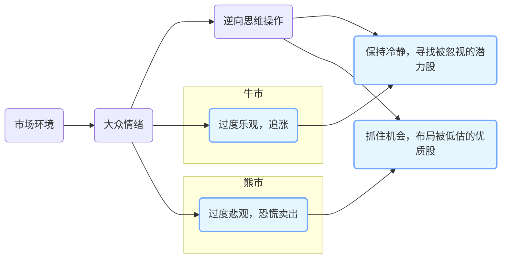

# 彼得林奇的“逆向思维”在牛熊市的应用

> 关键词：彼得林奇、逆向思维、牛市、熊市、投资策略

> 摘要：本文深入探讨彼得林奇的“逆向思维”在牛熊市中的应用。彼得林奇作为投资界的传奇人物，其逆向思维的投资理念独树一帜。通过研究他的思维方式在不同市场环境（牛市和熊市）下的具体应用，我们可以学习到如何在复杂多变的市场中把握投资机会，规避风险，实现资产的保值增值。文章将介绍逆向思维的核心概念，分析其在牛熊市中的具体操作策略，结合实际案例进行详细解读，并探讨其在未来市场中的发展趋势与挑战，为投资者提供有价值的参考和指导。

## 1. 背景介绍 
### 1.1 目的和范围
本文的目的在于全面剖析彼得林奇的“逆向思维”在牛熊市中的应用。通过对这一投资理念的深入研究，为广大投资者提供在不同市场环境下的投资思路和策略。范围涵盖了逆向思维的理论基础、在牛市和熊市中的具体操作方法、实际案例分析以及对未来市场应用的展望等方面。

### 1.2 预期读者
本文预期读者包括各类投资者，无论是初涉投资领域的新手，还是有一定经验的专业投资者，都能从本文中获取有价值的信息。同时，对于金融专业的学生、研究人员以及对投资理念感兴趣的人士也具有参考价值。

### 1.3 文档结构概述
本文首先介绍彼得林奇“逆向思维”的背景和相关概念，接着阐述其在牛市和熊市中的核心算法原理和具体操作步骤，然后通过数学模型和公式进一步解释其理论基础，并结合实际案例进行详细分析。之后探讨其在实际应用场景中的表现，推荐相关的学习资源、开发工具框架和论文著作。最后总结未来发展趋势与挑战，提供常见问题与解答以及扩展阅读和参考资料。

### 1.4 术语表
#### 1.4.1 核心术语定义
- **逆向思维**：与常规思维相反，在投资领域中，不随波逐流，而是从相反的方向思考和决策，寻找被市场忽视或低估的投资机会。
- **牛市**：指证券市场行情普遍看涨，延续时间较长的大升市。
- **熊市**：指证券市场行情普遍看淡，延续时间相对较长的大跌市。

#### 1.4.2 相关概念解释
- **市场情绪**：投资者对市场的整体看法和预期，会影响市场的走势和股票价格。
- **价值投资**：一种基于对股票内在价值的分析，寻找被低估的股票并长期持有的投资策略。

#### 1.4.3 缩略词列表
- **PE**：市盈率（Price Earnings Ratio），是股票价格除以每股盈利的比率，用于衡量股票的估值水平。
- **PB**：市净率（Price to Book Ratio），是股票价格与每股净资产的比率，反映了股票的市场价值与账面价值的关系。

## 2. 核心概念与联系 

### 彼得林奇“逆向思维”的原理
彼得林奇的逆向思维核心在于不盲目跟从市场趋势和大众观点。在投资中，大多数投资者往往会受到市场情绪的影响，在牛市中过度乐观，追涨买入；在熊市中过度悲观，恐慌卖出。而彼得林奇则认为，市场情绪往往是错误的，真正的投资机会往往隐藏在被市场忽视或误解的地方。

他强调要独立思考，深入研究公司的基本面，而不是仅仅关注市场的短期波动。通过逆向思维，他能够发现那些被市场低估的优质公司，在市场不看好时买入，在市场过度追捧时卖出，从而实现超额收益。

### 逆向思维与牛熊市的联系
在牛市中，市场一片繁荣，投资者情绪高涨，股票价格普遍上涨。此时，逆向思维要求投资者保持冷静，不被市场的乐观情绪所迷惑。要看到市场中可能存在的泡沫和风险，寻找那些被市场忽视但具有潜力的公司，而不是盲目追涨热门股票。

在熊市中，市场低迷，投资者信心受挫，股票价格大幅下跌。逆向思维则鼓励投资者在市场恐慌时寻找机会。因为在熊市中，很多优质公司的股票也会被错杀，价格低于其内在价值。此时，逆向思维的投资者会关注这些被低估的股票，进行布局，等待市场回暖时获得收益。

### 文本示意图
彼得林奇的逆向思维在牛熊市中的应用可以用以下示意图表示：

市场环境 --> 大众情绪 --> 逆向思维操作
牛市 --> 过度乐观，追涨 --> 保持冷静，寻找被忽视的潜力股
熊市 --> 过度悲观，恐慌卖出 --> 抓住机会，布局被低估的优质股

### Mermaid 流程图


## 3. 核心算法原理 & 具体操作步骤 

### 核心算法原理
彼得林奇的逆向思维投资策略可以用以下 Python 代码示例来模拟其核心算法原理：

```python
# 模拟市场环境和股票信息
# 市场环境：1 表示牛市，0 表示熊市
market_environment = 1
# 股票列表，每个股票用字典表示，包含名称、价格、估值等信息
stocks = [
    {"name": "StockA", "price": 100, "pe": 30, "pb": 5, "potential": 0.8},
    {"name": "StockB", "price": 50, "pe": 10, "pb": 2, "potential": 0.9},
    {"name": "StockC", "price": 200, "pe": 50, "pb": 8, "potential": 0.6}
]

def reverse_thinking_investment(market_environment, stocks):
    if market_environment == 1:  # 牛市
        # 在牛市中，筛选出被市场忽视但具有潜力的股票
        potential_stocks = []
        for stock in stocks:
            if stock["pe"] < 20 and stock["potential"] > 0.8:
                potential_stocks.append(stock)
        return potential_stocks
    else:  # 熊市
        # 在熊市中，筛选出被低估的优质股票
        undervalued_stocks = []
        for stock in stocks:
            if stock["pe"] < 15 and stock["pb"] < 3 and stock["potential"] > 0.7:
                undervalued_stocks.append(stock)
        return undervalued_stocks

# 执行逆向思维投资策略
result = reverse_thinking_investment(market_environment, stocks)
print("逆向思维投资策略筛选出的股票：", result)
```

### 具体操作步骤
#### 牛市中的操作步骤
1. **保持冷静**：在牛市中，市场的乐观情绪容易使人失去理智。投资者要时刻提醒自己保持冷静，不被市场的热度冲昏头脑。
2. **研究公司基本面**：深入分析公司的财务报表、业务模式、行业前景等，寻找那些具有稳定业绩增长和竞争优势的公司。
3. **寻找被忽视的潜力股**：关注那些市值较小、不被市场主流关注但具有潜力的公司。这些公司可能由于规模较小、宣传不足等原因被市场忽视，但在未来有较大的发展空间。
4. **避免追涨热门股票**：热门股票往往已经被市场过度炒作，价格可能已经高估。追涨热门股票可能会面临较高的风险。

#### 熊市中的操作步骤
1. **克服恐惧心理**：在熊市中，市场的悲观情绪容易使人产生恐惧心理。投资者要克服这种心理，保持理性思考。
2. **筛选被低估的股票**：通过分析公司的估值指标（如市盈率、市净率等），筛选出那些价格低于其内在价值的股票。
3. **分批买入**：由于熊市中市场波动较大，很难准确判断市场的底部。投资者可以采用分批买入的策略，逐步建仓，降低成本。
4. **长期持有**：对于被低估的优质股票，投资者要有耐心，长期持有，等待市场回暖时获得收益。

## 4. 数学模型和公式 & 详细讲解 & 举例说明 

### 数学模型和公式
#### 市盈率（PE）
市盈率是股票价格除以每股盈利的比率，公式为：
$$PE = \frac{P}{E}$$
其中，$P$ 表示股票价格，$E$ 表示每股盈利。

市盈率反映了投资者为获取公司每一元盈利所愿意支付的价格。一般来说，市盈率较低的股票可能被低估，具有投资价值；而市盈率较高的股票可能被高估，存在风险。

#### 市净率（PB）
市净率是股票价格与每股净资产的比率，公式为：
$$PB = \frac{P}{B}$$
其中，$P$ 表示股票价格，$B$ 表示每股净资产。

市净率反映了股票的市场价值与账面价值的关系。市净率较低的股票可能被低估，具有一定的安全边际。

### 详细讲解
在逆向思维投资策略中，市盈率和市净率是重要的估值指标。在牛市中，当市场整体估值较高时，投资者可以通过筛选市盈率较低的股票，寻找被市场忽视的潜力股。在熊市中，当市场整体估值较低时，投资者可以通过筛选市净率较低的股票，寻找被低估的优质股。

### 举例说明
假设某公司的股票价格为 50 元，每股盈利为 5 元，每股净资产为 20 元。则该公司的市盈率为：
$$PE = \frac{50}{5} = 10$$
市净率为：
$$PB = \frac{50}{20} = 2.5$$
如果市场上同行业公司的平均市盈率为 20，平均市净率为 4，则该公司的市盈率和市净率均低于行业平均水平，可能被低估，具有投资价值。

## 5. 项目实战：代码实际案例和详细解释说明 

### 5.1  开发环境搭建
要实现逆向思维投资策略的代码，我们可以使用 Python 语言。以下是开发环境搭建的步骤：
1. **安装 Python**：从 Python 官方网站（https://www.python.org/downloads/）下载并安装 Python 3.x 版本。
2. **安装开发工具**：推荐使用 PyCharm 或 Jupyter Notebook 作为开发工具。
    - **PyCharm**：从 JetBrains 官方网站（https://www.jetbrains.com/pycharm/download/）下载并安装 PyCharm 社区版或专业版。
    - **Jupyter Notebook**：可以使用 Anaconda 发行版（https://www.anaconda.com/products/individual）来安装 Jupyter Notebook，Anaconda 包含了 Python 解释器和许多常用的科学计算库。

### 5.2  源代码详细实现和代码解读
以下是一个更完整的逆向思维投资策略的 Python 代码示例：

```python
import pandas as pd

# 模拟股票数据
data = {
    "name": ["StockA", "StockB", "StockC", "StockD", "StockE"],
    "price": [100, 50, 200, 80, 120],
    "pe": [30, 10, 50, 15, 25],
    "pb": [5, 2, 8, 3, 4],
    "potential": [0.6, 0.9, 0.5, 0.8, 0.7]
}
stocks_df = pd.DataFrame(data)

def reverse_thinking_investment(market_environment, stocks_df):
    if market_environment == 1:  # 牛市
        # 在牛市中，筛选出被市场忽视但具有潜力的股票
        potential_stocks = stocks_df[(stocks_df["pe"] < 20) & (stocks_df["potential"] > 0.8)]
        return potential_stocks
    else:  # 熊市
        # 在熊市中，筛选出被低估的优质股票
        undervalued_stocks = stocks_df[(stocks_df["pe"] < 15) & (stocks_df["pb"] < 3) & (stocks_df["potential"] > 0.7)]
        return undervalued_stocks

# 模拟市场环境，1 表示牛市，0 表示熊市
market_environment = 0
result = reverse_thinking_investment(market_environment, stocks_df)
print("逆向思维投资策略筛选出的股票：")
print(result)
```

### 代码解读与分析
1. **数据准备**：使用 Pandas 库创建一个包含股票信息的 DataFrame，包括股票名称、价格、市盈率、市净率和潜力值等信息。
2. **逆向思维投资策略函数**：定义 `reverse_thinking_investment` 函数，根据市场环境（牛市或熊市）筛选出符合条件的股票。
    - 在牛市中，筛选出市盈率低于 20 且潜力值大于 0.8 的股票。
    - 在熊市中，筛选出市盈率低于 15、市净率低于 3 且潜力值大于 0.7 的股票。
3. **执行策略**：模拟市场环境，调用 `reverse_thinking_investment` 函数，输出筛选出的股票信息。

通过这个代码示例，我们可以看到如何使用 Python 实现逆向思维投资策略，根据不同的市场环境筛选出有投资价值的股票。

## 6. 实际应用场景 
### 牛市中的应用场景
在 2007 年的大牛市中，市场一片繁荣，股票价格普遍上涨。很多投资者盲目追涨热门股票，如金融、地产等板块的股票。然而，一些具有逆向思维的投资者却关注到了一些被市场忽视的中小市值股票。例如，某些科技类公司虽然当时规模较小，但具有创新的业务模式和技术优势。这些投资者通过深入研究公司基本面，在市场不看好时买入这些股票。随着市场的发展，这些公司逐渐成长，股票价格也大幅上涨，为投资者带来了丰厚的回报。

### 熊市中的应用场景
在 2008 年的全球金融危机中，市场大幅下跌，投资者信心受挫。很多投资者恐慌卖出股票，导致股票价格进一步下跌。而一些逆向思维的投资者则看到了机会。他们通过分析公司的估值指标，筛选出被低估的优质股票。例如，一些消费类公司具有稳定的业绩和现金流，在熊市中股票价格被错杀。这些投资者在市场底部附近分批买入这些股票，随着市场的回暖，股票价格逐渐回升，投资者获得了可观的收益。

## 7. 工具和资源推荐
### 7.1 学习资源推荐
#### 7.1.1 书籍推荐
- 《彼得林奇的成功投资》：彼得林奇的经典著作，详细介绍了他的投资理念和方法，是学习逆向思维投资的必读书籍。
- 《聪明的投资者》：本杰明·格雷厄姆的著作，被誉为投资界的圣经，对价值投资和逆向思维有深入的阐述。
- 《金融炼金术》：乔治·索罗斯的著作，介绍了他的反身性理论和逆向投资策略，对投资者有很大的启发。

#### 7.1.2 在线课程
- Coursera 上的“投资学原理”课程：由知名大学教授授课，系统介绍投资学的基本原理和方法，包括逆向思维投资策略。
- 网易云课堂上的“股票投资实战技巧”课程：结合实际案例，讲解股票投资的实战技巧，对逆向思维投资有详细的分析。

#### 7.1.3 技术博客和网站
- 雪球网：国内知名的投资交流社区，有很多投资者分享自己的投资经验和逆向思维投资案例。
- 东方财富网：提供丰富的金融资讯和股票数据，投资者可以通过分析数据来应用逆向思维投资策略。

### 7.2 开发工具框架推荐
#### 7.2.1 IDE和编辑器
- PyCharm：功能强大的 Python 集成开发环境，适合开发逆向思维投资策略的 Python 代码。
- Jupyter Notebook：交互式的开发环境，方便进行数据探索和代码演示，适合学习和研究逆向思维投资策略。

#### 7.2.2 调试和性能分析工具
- PDB：Python 自带的调试工具，可以帮助开发者调试逆向思维投资策略的代码。
- cProfile：Python 的性能分析工具，可以分析代码的性能瓶颈，优化逆向思维投资策略的代码。

#### 7.2.3 相关框架和库
- Pandas：用于数据处理和分析，在逆向思维投资策略中可以用于处理股票数据。
- NumPy：用于科学计算，在逆向思维投资策略中可以进行数值计算和矩阵运算。

### 7.3 相关论文著作推荐
#### 7.3.1 经典论文
- “The Psychology of Investing”：探讨了投资者的心理因素对投资决策的影响，对理解逆向思维投资的心理学基础有重要意义。
- “Value Investing: The Use of Historical Financial Statement Information to Separate Winners from Losers”：研究了价值投资的方法和有效性，对逆向思维投资的估值方法有参考价值。

#### 7.3.2 最新研究成果
- 一些金融学术期刊上发表的关于行为金融学和逆向投资策略的研究论文，反映了该领域的最新研究动态。

#### 7.3.3 应用案例分析
- 一些投资机构发布的研究报告，分析了逆向思维投资策略在不同市场环境下的应用案例和效果。

## 8. 总结：未来发展趋势与挑战
### 未来发展趋势
- **数字化和智能化**：随着科技的发展，投资领域将越来越数字化和智能化。逆向思维投资策略可以结合大数据、人工智能等技术，更准确地分析市场数据和公司基本面，挖掘投资机会。
- **全球化**：全球金融市场的联系越来越紧密，逆向思维投资策略可以在全球范围内寻找投资机会。投资者可以关注不同国家和地区的市场差异，利用逆向思维进行跨境投资。
- **社会责任投资**：未来，投资者将越来越关注企业的社会责任和可持续发展。逆向思维投资策略可以结合社会责任投资理念，寻找那些被市场忽视但具有良好社会形象和可持续发展潜力的公司。

### 挑战
- **市场不确定性**：金融市场充满了不确定性，逆向思维投资策略也无法完全准确地预测市场走势。投资者需要面对市场的波动和风险，不断调整投资策略。
- **信息不对称**：在投资过程中，投资者可能面临信息不对称的问题。一些公司可能会隐瞒重要信息，导致投资者无法准确评估公司的价值。逆向思维投资策略需要投资者具备更强的信息收集和分析能力。
- **投资者心理因素**：逆向思维投资策略需要投资者具备独立思考和克服心理障碍的能力。然而，很多投资者往往受到市场情绪的影响，难以坚持逆向思维投资策略。

## 9. 附录：常见问题与解答
### 问题 1：逆向思维投资策略适合所有投资者吗？
逆向思维投资策略需要投资者具备一定的投资知识和经验，以及独立思考和分析的能力。对于初涉投资领域的新手来说，可能需要先学习基本的投资知识，逐步培养逆向思维能力。因此，逆向思维投资策略并不适合所有投资者，投资者需要根据自己的情况选择适合自己的投资策略。

### 问题 2：如何判断市场是牛市还是熊市？
判断市场是牛市还是熊市没有绝对的标准，通常可以从以下几个方面进行分析：
- **市场指数走势**：观察主要市场指数（如上证指数、深证成指等）的长期走势，如果指数持续上涨，则可能处于牛市；如果指数持续下跌，则可能处于熊市。
- **宏观经济环境**：宏观经济环境对市场走势有重要影响。如果经济增长强劲、通货膨胀率稳定、利率较低等，则有利于市场上涨，可能处于牛市；反之，则可能处于熊市。
- **投资者情绪**：投资者情绪也可以反映市场的状态。如果投资者普遍乐观、交易活跃，则可能处于牛市；如果投资者普遍悲观、交易清淡，则可能处于熊市。

### 问题 3：逆向思维投资策略需要多长时间才能看到效果？
逆向思维投资策略通常是一种长期投资策略，需要投资者有耐心和长期持有的决心。由于市场的波动和不确定性，逆向思维投资策略可能不会立即看到效果。投资者需要给投资足够的时间，等待市场对公司价值的重新认识和发现。一般来说，逆向思维投资策略的效果可能需要几年甚至更长时间才能显现出来。

## 10. 扩展阅读 & 参考资料
### 扩展阅读
- 《漫步华尔街》：介绍了各种投资理论和方法，对逆向思维投资有进一步的探讨。
- 《邓普顿教你逆向投资》：讲述了邓普顿的逆向投资理念和实践经验，对投资者有很大的启发。

### 参考资料
- 彼得林奇的官方网站和相关访谈资料。
- 金融学术期刊上发表的关于逆向思维投资的研究论文。
- 投资机构发布的研究报告和市场分析资料。