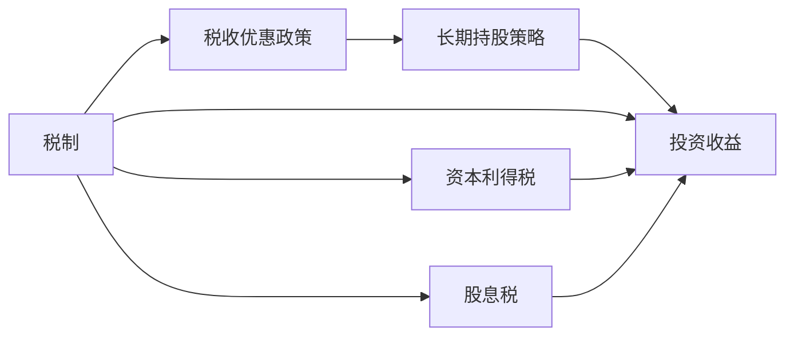

# 彼得林奇的"长期持股"在不同税制下的优化策略

> 关键词：彼得林奇、长期持股、税制、优化策略、投资收益

> 摘要：本文聚焦于彼得林奇所倡导的长期持股投资理念，深入探讨在不同税制环境下如何对这一策略进行优化。通过对核心概念的阐述、算法原理的剖析、数学模型的构建，结合项目实战案例以及实际应用场景的分析，为投资者提供在不同税制下实现长期持股策略效益最大化的方法和思路。同时，推荐了相关的学习资源、开发工具框架以及论文著作，最后总结了该策略的未来发展趋势与挑战，并对常见问题进行解答，为投资者在复杂的税制环境中运用长期持股策略提供全面且深入的参考。

## 1. 背景介绍 
### 1.1 目的和范围
彼得林奇作为投资界的传奇人物，其长期持股的投资理念影响深远。然而，不同国家和地区的税制千差万别，这些税制因素会对长期持股的投资收益产生显著影响。本文的目的在于研究在不同税制条件下，如何优化彼得林奇的长期持股策略，以实现投资收益的最大化。研究范围涵盖了常见的税制类型，包括资本利得税、股息税等，以及与之相关的税收优惠政策和特殊规定。

### 1.2 预期读者
本文预期读者主要包括对投资领域感兴趣的个人投资者、金融从业者、投资研究人员以及相关专业的学生。对于希望深入了解长期持股策略在不同税制下应用的人士，本文将提供有价值的参考和指导。

### 1.3 文档结构概述
本文将按照以下结构展开：首先介绍核心概念与联系，明确长期持股、税制等相关概念及其相互关系；接着阐述核心算法原理和具体操作步骤，通过Python代码进行详细说明；然后构建数学模型和公式，并举例说明；再通过项目实战案例展示代码的实际应用和详细解释；之后分析实际应用场景；推荐相关的工具和资源；最后总结未来发展趋势与挑战，解答常见问题，并提供扩展阅读和参考资料。

### 1.4 术语表
#### 1.4.1 核心术语定义
- **长期持股**：指投资者买入股票后，持有较长时间，通常以年为单位，不轻易因短期市场波动而卖出股票的投资策略。
- **税制**：国家或地区制定的税收制度，包括税种、税率、税收优惠政策等内容。
- **资本利得税**：对投资者买卖资产（如股票）所获得的利润征收的税。
- **股息税**：对投资者从股票中获得的股息收入征收的税。

#### 1.4.2 相关概念解释
- **税收优惠政策**：政府为了鼓励某些经济行为或支持特定行业发展，给予纳税人的税收减免或优惠措施。
- **税务筹划**：在合法合规的前提下，通过对投资行为的合理安排，降低税负，提高投资收益的活动。

#### 1.4.3 缩略词列表
- **CGT**：Capital Gains Tax，资本利得税
- **DT**：Dividend Tax，股息税

## 2. 核心概念与联系 

### 2.1 彼得林奇的长期持股理念
彼得林奇认为，通过深入研究公司基本面，选择具有成长潜力的公司股票并长期持有，可以获得丰厚的投资回报。长期持股可以避免因短期市场波动而频繁买卖股票所带来的交易成本和决策失误，同时能够充分享受公司成长带来的价值提升。

### 2.2 税制对长期持股的影响
不同的税制会对长期持股的投资收益产生重要影响。例如，资本利得税会直接减少投资者卖出股票时的实际收益，而股息税则会降低投资者从股息分配中获得的收入。此外，税收优惠政策的存在可能会改变投资者的持股决策，促使投资者更倾向于选择符合优惠条件的投资标的。

### 2.3 核心概念的架构示意图


该流程图展示了长期持股策略、税制和投资收益之间的关系。税制中的资本利得税、股息税直接影响投资收益，而税收优惠政策则会对长期持股策略的实施产生影响，进而间接影响投资收益。

## 3. 核心算法原理 & 具体操作步骤 

### 3.1 核心算法原理
在不同税制下优化长期持股策略的核心算法是基于对投资收益的计算和比较。首先，需要计算在不同税制条件下，长期持股的预期投资收益，包括考虑资本利得税和股息税的影响。然后，通过调整持股时间、投资标的等因素，寻找使投资收益最大化的方案。

### 3.2 具体操作步骤
1. **收集数据**：收集投资标的的历史数据，包括股价走势、股息分配情况等，以及所在国家或地区的税制信息，如资本利得税税率、股息税税率、税收优惠政策等。
2. **计算投资收益**：根据收集到的数据，计算在不同持股时间和税制条件下的投资收益。
3. **分析结果**：对计算结果进行分析，比较不同方案的投资收益，找出最优方案。
4. **实施策略**：根据分析结果，实施优化后的长期持股策略。

### 3.3 Python源代码实现
```python
# 定义计算投资收益的函数
def calculate_investment_return(initial_price, final_price, dividend, cgt_rate, dt_rate, holding_period):
    # 计算资本利得
    capital_gain = final_price - initial_price
    # 计算扣除资本利得税后的资本利得
    after_cgt_capital_gain = capital_gain * (1 - cgt_rate)
    # 计算股息收入
    dividend_income = dividend * holding_period
    # 计算扣除股息税后的股息收入
    after_dt_dividend_income = dividend_income * (1 - dt_rate)
    # 计算总投资收益
    total_return = after_cgt_capital_gain + after_dt_dividend_income
    return total_return

# 示例数据
initial_price = 100
final_price = 150
dividend = 2
cgt_rate = 0.2
dt_rate = 0.1
holding_period = 5

# 计算投资收益
investment_return = calculate_investment_return(initial_price, final_price, dividend, cgt_rate, dt_rate, holding_period)
print(f"投资收益: {investment_return}")
```
上述代码定义了一个计算投资收益的函数`calculate_investment_return`，该函数接受初始股价、最终股价、股息、资本利得税税率、股息税税率和持股时间作为输入，返回扣除税费后的总投资收益。通过调用该函数并传入示例数据，计算出投资收益并打印输出。

## 4. 数学模型和公式 & 详细讲解 & 举例说明 

### 4.1 数学模型和公式
设初始股价为 $P_0$，最终股价为 $P_1$，股息为 $D$，持股时间为 $T$，资本利得税税率为 $r_{cgt}$，股息税税率为 $r_{dt}$。则：
- 资本利得：$CG = P_1 - P_0$
- 扣除资本利得税后的资本利得：$CG_{after} = CG \times (1 - r_{cgt}) = (P_1 - P_0) \times (1 - r_{cgt})$
- 股息收入：$DI = D \times T$
- 扣除股息税后的股息收入：$DI_{after} = DI \times (1 - r_{dt}) = D \times T \times (1 - r_{dt})$
- 总投资收益：$TR = CG_{after} + DI_{after} = (P_1 - P_0) \times (1 - r_{cgt}) + D \times T \times (1 - r_{dt})$

### 4.2 详细讲解
上述公式清晰地展示了在考虑资本利得税和股息税的情况下，如何计算长期持股的总投资收益。首先计算资本利得，即最终股价与初始股价的差值，然后根据资本利得税税率计算扣除资本利得税后的实际资本利得。对于股息收入，先计算在持股期间的总股息收入，再根据股息税税率计算扣除股息税后的实际股息收入。最后将两者相加，得到总投资收益。

### 4.3 举例说明
假设初始股价 $P_0 = 100$ 元，最终股价 $P_1 = 150$ 元，股息 $D = 2$ 元，持股时间 $T = 5$ 年，资本利得税税率 $r_{cgt} = 0.2$，股息税税率 $r_{dt} = 0.1$。
- 资本利得：$CG = P_1 - P_0 = 150 - 100 = 50$ 元
- 扣除资本利得税后的资本利得：$CG_{after} = CG \times (1 - r_{cgt}) = 50 \times (1 - 0.2) = 40$ 元
- 股息收入：$DI = D \times T = 2 \times 5 = 10$ 元
- 扣除股息税后的股息收入：$DI_{after} = DI \times (1 - r_{dt}) = 10 \times (1 - 0.1) = 9$ 元
- 总投资收益：$TR = CG_{after} + DI_{after} = 40 + 9 = 49$ 元

通过这个例子可以直观地看到，在考虑了资本利得税和股息税之后，实际的投资收益会受到影响。

## 5. 项目实战：代码实际案例和详细解释说明 

### 5.1  开发环境搭建
- **Python环境**：确保已经安装Python 3.x版本，可以从Python官方网站（https://www.python.org/downloads/）下载并安装。
- **开发工具**：推荐使用PyCharm、Jupyter Notebook等开发工具。可以从官方网站下载并安装相应的开发工具。

### 5.2  源代码详细实现和代码解读
```python
# 导入必要的库
import pandas as pd
import numpy as np

# 定义函数来模拟不同税制下的长期持股策略
def simulate_long_term_holding(stock_data, cgt_rate, dt_rate, holding_period):
    # 计算资本利得和股息收入
    initial_price = stock_data['price'].iloc[0]
    final_price = stock_data['price'].iloc[-1]
    dividend_income = stock_data['dividend'].sum() * holding_period

    # 计算资本利得税和股息税
    capital_gain = final_price - initial_price
    capital_gain_tax = capital_gain * cgt_rate
    dividend_tax = dividend_income * dt_rate

    # 计算扣除税费后的投资收益
    after_tax_capital_gain = capital_gain - capital_gain_tax
    after_tax_dividend_income = dividend_income - dividend_tax
    total_return = after_tax_capital_gain + after_tax_dividend_income

    return total_return

# 生成示例股票数据
data = {
    'price': [100, 110, 120, 130, 140, 150],
    'dividend': [1, 1, 1, 1, 1, 1]
}
stock_data = pd.DataFrame(data)

# 设定税制参数和持股时间
cgt_rate = 0.2
dt_rate = 0.1
holding_period = 6

# 模拟长期持股策略
investment_return = simulate_long_term_holding(stock_data, cgt_rate, dt_rate, holding_period)
print(f"模拟的投资收益: {investment_return}")
```
### 代码解读与分析
1. **导入必要的库**：导入`pandas`和`numpy`库，用于数据处理和数值计算。
2. **定义模拟函数**：`simulate_long_term_holding`函数接受股票数据、资本利得税税率、股息税税率和持股时间作为输入，计算并返回扣除税费后的总投资收益。
3. **生成示例股票数据**：使用`pandas`的`DataFrame`对象生成示例股票数据，包括股价和股息信息。
4. **设定税制参数和持股时间**：设定资本利得税税率、股息税税率和持股时间。
5. **模拟长期持股策略**：调用`simulate_long_term_holding`函数，传入示例股票数据、税制参数和持股时间，计算并打印模拟的投资收益。

通过这个实际案例，可以看到如何使用Python代码模拟不同税制下的长期持股策略，并计算投资收益。

## 6. 实际应用场景 
### 6.1 个人投资者
对于个人投资者来说，了解不同税制下的长期持股优化策略可以帮助他们在投资决策中更好地考虑税收因素，从而提高投资收益。例如，在选择投资标的时，可以优先考虑那些享受税收优惠政策的股票；在决定持股时间时，可以根据资本利得税的相关规定，合理安排卖出时机，以减少税负。

### 6.2 金融机构
金融机构可以利用这些优化策略为客户提供更专业的投资建议和理财方案。例如，在为客户制定投资组合时，考虑不同税制对投资收益的影响，调整投资组合的结构和持股时间，以实现客户资产的增值。

### 6.3 企业投资
企业在进行投资活动时，也需要考虑税收因素。通过优化长期持股策略，可以降低企业的投资成本，提高投资回报率。例如，企业可以选择符合税收优惠政策的投资项目，或者合理安排投资期限，以减少税收支出。

## 7. 工具和资源推荐
### 7.1 学习资源推荐
#### 7.1.1 书籍推荐
- 《彼得林奇的成功投资》：彼得林奇的经典著作，详细介绍了他的投资理念和方法。
- 《聪明的投资者》：本杰明·格雷厄姆的著作，是价值投资领域的经典之作，对长期持股策略有深入的阐述。
- 《投资中最简单的事》：邱国鹭的著作，结合中国市场实际情况，介绍了投资的基本原理和方法。

#### 7.1.2 在线课程
- Coursera上的“投资学原理”课程：由知名大学教授授课，系统介绍投资学的基本原理和方法。
- 网易云课堂上的“股票投资实战技巧”课程：结合实际案例，讲解股票投资的技巧和策略。

#### 7.1.3 技术博客和网站
- 雪球网：国内知名的投资社区，提供股票行情、投资分析、投资者交流等服务。
- 东方财富网：提供全面的金融信息和投资分析工具，是投资者获取信息的重要渠道。

### 7.2 开发工具框架推荐
#### 7.2.1 IDE和编辑器
- PyCharm：功能强大的Python集成开发环境，提供代码编辑、调试、版本控制等功能。
- Jupyter Notebook：交互式的开发环境，适合数据探索和代码演示。

#### 7.2.2 调试和性能分析工具
- pdb：Python内置的调试工具，可以帮助开发者定位和解决代码中的问题。
- cProfile：Python的性能分析工具，可以分析代码的运行时间和资源占用情况。

#### 7.2.3 相关框架和库
- pandas：用于数据处理和分析的Python库，提供了高效的数据结构和数据操作方法。
- numpy：用于数值计算的Python库，提供了强大的数组和矩阵运算功能。

### 7.3 相关论文著作推荐
#### 7.3.1 经典论文
- “Capital Gains Taxes and Stock Prices: Evidence from the Taxpayer Relief Act of 1997”：研究了资本利得税对股票价格的影响。
- “Dividend Taxation and Corporate Behavior: Evidence from the 2003 Dividend Tax Cut”：分析了股息税对企业行为的影响。

#### 7.3.2 最新研究成果
- 关注顶级金融学术期刊，如《Journal of Finance》《Review of Financial Studies》等，获取最新的研究成果。

#### 7.3.3 应用案例分析
- 各大金融机构的研究报告：提供了大量的投资案例分析和策略建议。
- 财经媒体的专题报道：介绍了不同投资者在不同税制下的投资实践和经验教训。

## 8. 总结：未来发展趋势与挑战
### 8.1 未来发展趋势
- **税收政策的动态调整**：随着经济形势的变化和政府政策的调整，税收政策可能会不断变化。投资者需要密切关注税收政策的动态，及时调整投资策略。
- **数字化投资的兴起**：随着科技的发展，数字化投资平台和工具将越来越普及。投资者可以利用这些平台和工具，更方便地获取税收信息和优化投资策略。
- **全球投资的趋势**：越来越多的投资者开始进行全球投资，不同国家和地区的税制差异将对投资决策产生更大的影响。投资者需要了解和适应不同国家和地区的税制，制定更加多元化的投资策略。

### 8.2 挑战
- **税收政策的复杂性**：不同国家和地区的税收政策复杂多样，投资者需要花费大量的时间和精力去了解和研究。
- **市场不确定性**：股票市场的价格波动和股息分配情况具有不确定性，这增加了投资收益的预测难度。
- **信息不对称**：投资者可能无法获取全面、准确的税收信息和投资信息，这可能导致投资决策的失误。

## 9. 附录：常见问题与解答
### 9.1 长期持股一定能获得高收益吗？
长期持股并不一定能获得高收益。虽然长期持股可以避免短期市场波动的影响，但如果选择的投资标的不佳，或者市场整体环境不好，也可能导致投资收益不佳。此外，税收因素也会对投资收益产生影响，需要合理优化长期持股策略。

### 9.2 如何确定最优的持股时间？
确定最优的持股时间需要综合考虑多个因素，包括资本利得税的规定、股息分配情况、公司的成长潜力等。可以通过计算不同持股时间下的投资收益，比较分析后找出最优的持股时间。

### 9.3 税收优惠政策会一直存在吗？
税收优惠政策是政府根据经济形势和政策目标制定的，可能会随着时间的推移而调整或取消。投资者需要密切关注税收政策的变化，及时调整投资策略。

## 10. 扩展阅读 & 参考资料
### 10.1 扩展阅读
- 《金融炼金术》：乔治·索罗斯的著作，介绍了他的投资哲学和方法。
- 《漫步华尔街》：伯顿·马尔基尔的著作，探讨了股票市场的有效性和投资策略。

### 10.2 参考资料
- 各国政府的税收政策文件和官方网站。
- 金融机构的研究报告和分析文章。
- 相关学术期刊和会议论文。