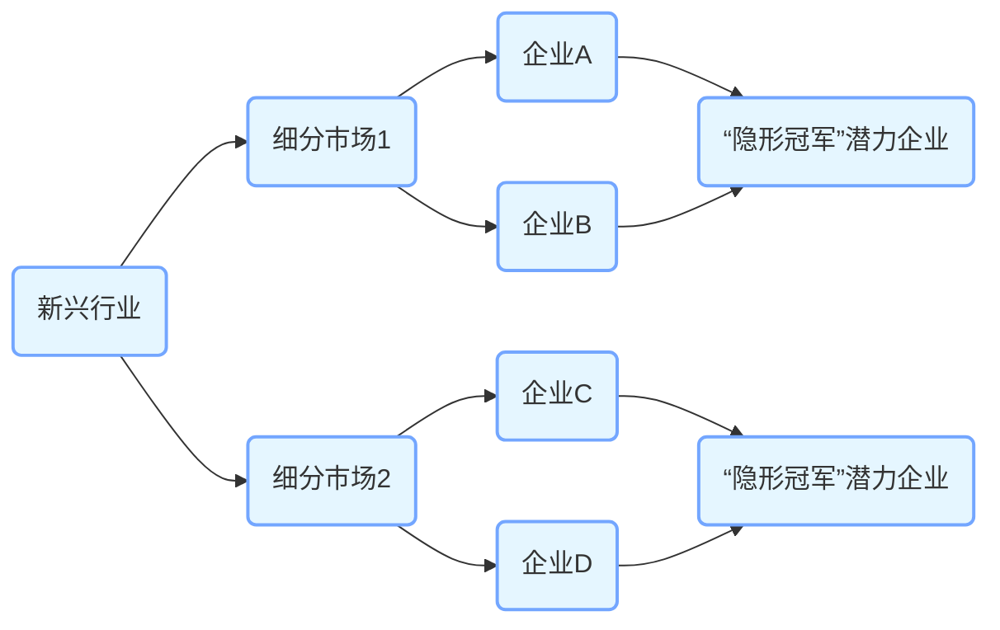

# 彼得林奇的“隐形冠军”在新兴行业的识别

> 关键词：彼得林奇、隐形冠军、新兴行业、识别方法、投资策略

> 摘要：本文聚焦于彼得林奇的“隐形冠军”理论在新兴行业中的应用与识别。首先介绍了研究的背景、目的、预期读者等基础信息，接着阐述了“隐形冠军”的核心概念及与新兴行业的联系，深入剖析核心算法原理并给出Python实现示例，探讨相关数学模型和公式。通过项目实战展示如何在实际中运用识别方法，分析其在不同新兴行业的实际应用场景。同时推荐了学习、开发相关的工具和资源以及论文著作，最后总结了未来发展趋势与挑战，提供常见问题解答和扩展阅读参考资料，旨在为投资者和研究者提供全面深入的关于“隐形冠军”在新兴行业识别的知识体系。

## 1. 背景介绍 
### 1.1 目的和范围
彼得林奇作为投资界的传奇人物，其“隐形冠军”理论为投资者挖掘具有潜力的企业提供了独特视角。在新兴行业蓬勃发展的当下，识别其中的“隐形冠军”企业对于投资者获取超额收益、推动行业发展具有重要意义。本文旨在深入探讨如何运用彼得林奇的“隐形冠军”理论在新兴行业中准确识别出具有高成长潜力的企业，范围涵盖新兴行业的多个领域，如人工智能、新能源、生物医药等。

### 1.2 预期读者
本文预期读者包括对投资领域感兴趣的个人投资者、专业投资机构从业者、金融领域的研究人员以及新兴行业的创业者和管理者。个人投资者可从中学习投资策略和企业识别方法；专业投资机构从业者可完善投资分析体系；研究人员可获取相关理论和实践案例；创业者和管理者则能了解自身企业在行业中的定位和发展方向。

### 1.3 文档结构概述
本文将按照以下结构展开：首先介绍“隐形冠军”及相关概念，包括其原理和架构；接着阐述识别“隐形冠军”的核心算法原理和具体操作步骤，并给出Python代码示例；然后讲解相关数学模型和公式并举例说明；通过项目实战展示在实际中如何识别“隐形冠军”企业；分析“隐形冠军”在新兴行业的实际应用场景；推荐学习、开发的工具和资源以及相关论文著作；最后总结未来发展趋势与挑战，提供常见问题解答和扩展阅读参考资料。

### 1.4 术语表
#### 1.4.1 核心术语定义
- **彼得林奇的“隐形冠军”**：指那些在某一细分领域占据领先地位，但不为大众所熟知的企业。这些企业通常具有持续的创新能力、高市场份额、良好的盈利能力和稳定的现金流等特点。
- **新兴行业**：是指随着新的科研成果和新兴技术的发明应用而出现的新的部门和行业，如人工智能、新能源、生物医药等行业。

#### 1.4.2 相关概念解释
- **市场份额**：指一个企业的销售量（或销售额）在市场同类产品中所占的比重，反映了企业在市场中的竞争地位。
- **现金流**：是指企业在一定会计期间按照现金收付实现制，通过一定经济活动（包括经营活动、投资活动、筹资活动和非经常性项目）而产生的现金流入、现金流出及其总量情况的总称。

#### 1.4.3 缩略词列表
- **AI**：Artificial Intelligence，人工智能
- **EV**：Electric Vehicle，电动汽车

## 2. 核心概念与联系 
### 2.1 “隐形冠军”的核心概念
彼得林奇的“隐形冠军”概念强调企业在细分市场的领先地位。这些企业往往专注于某一特定的产品或服务领域，通过持续的创新和卓越的运营管理，在该领域建立起强大的竞争优势。它们可能规模相对较小，知名度不高，但在其细分市场中具有不可替代的地位。

例如，在高端数控机床领域，一些企业专注于研发和生产特定类型的机床，虽然在大众视野中并不知名，但在行业内却是顶尖的供应商，其产品质量和技术水平得到了全球客户的认可。

### 2.2 “隐形冠军”与新兴行业的联系
新兴行业为“隐形冠军”企业的成长提供了肥沃的土壤。在新兴行业发展初期，市场格局尚未稳定，存在大量的细分市场机会。具有敏锐洞察力和创新能力的企业能够抓住这些机会，在细分领域迅速崛起，成为“隐形冠军”。

同时，“隐形冠军”企业的发展也推动了新兴行业的进步。它们的创新技术和产品能够提高整个行业的效率和竞争力，带动相关产业链的发展。例如，在人工智能行业，一些专注于特定算法研发的“隐形冠军”企业，为整个行业的发展提供了关键的技术支持。

### 2.3 核心概念原理和架构的文本示意图
```plaintext
              新兴行业
                |
       +--------+--------+
       |                 |
  细分市场1        细分市场2
       |                 |
+------+------+     +------+------+
| 企业A  | 企业B |     | 企业C  | 企业D |
+------+------+     +------+------+
       |                 |
 “隐形冠军”潜力企业    “隐形冠军”潜力企业
```

### 2.4 Mermaid 流程图


## 3. 核心算法原理 & 具体操作步骤 
### 3.1 核心算法原理
识别新兴行业中的“隐形冠军”企业可以采用多维度评估算法。该算法综合考虑企业的多个关键指标，包括市场份额、创新能力、盈利能力、现金流状况等。通过对这些指标进行量化分析，计算出每个企业的综合得分，得分较高的企业具有更大的潜力成为“隐形冠军”。

### 3.2 具体操作步骤
1. **数据收集**：收集新兴行业中各企业的相关数据，包括财务报表、市场调研数据、专利信息等。
2. **指标选取**：确定评估企业的关键指标，如市场份额、研发投入占比、净利润率、经营活动现金流等。
3. **数据预处理**：对收集到的数据进行清洗、归一化等处理，以消除数据的量纲和异常值影响。
4. **指标权重确定**：根据各指标的重要性，确定其权重。可以采用专家打分法、层次分析法等方法。
5. **综合得分计算**：根据各指标的数值和权重，计算每个企业的综合得分。
6. **排名筛选**：根据综合得分对企业进行排名，筛选出得分较高的企业作为“隐形冠军”潜力企业。

### 3.3 Python源代码详细阐述
```python
import pandas as pd
import numpy as np

# 示例数据，假设有3家企业，4个评估指标
data = {
    '企业名称': ['企业A', '企业B', '企业C'],
    '市场份额': [0.3, 0.2, 0.4],
    '研发投入占比': [0.1, 0.15, 0.08],
    '净利润率': [0.12, 0.09, 0.15],
    '经营活动现金流': [1000, 800, 1200]
}
df = pd.DataFrame(data)

# 数据预处理：归一化
def normalize(data):
    return (data - data.min()) / (data.max() - data.min())

for column in df.columns[1:]:
    df[column] = normalize(df[column])

# 指标权重
weights = {
    '市场份额': 0.3,
    '研发投入占比': 0.2,
    '净利润率': 0.3,
    '经营活动现金流': 0.2
}

# 综合得分计算
df['综合得分'] = 0
for column in df.columns[1:-1]:
    df['综合得分'] += df[column] * weights[column]

# 排名筛选
df = df.sort_values(by='综合得分', ascending=False)
print(df)
```

## 4. 数学模型和公式 & 详细讲解 & 举例说明 
### 4.1 数学模型和公式
综合得分计算公式为：
$$
S = \sum_{i=1}^{n} w_i x_i
$$
其中，$S$ 表示企业的综合得分，$w_i$ 表示第 $i$ 个指标的权重，$x_i$ 表示第 $i$ 个指标的归一化数值，$n$ 表示指标的数量。

### 4.2 详细讲解
该公式的核心思想是将各个评估指标的数值按照其重要性进行加权求和，得到企业的综合得分。权重 $w_i$ 反映了每个指标在评估中的相对重要性，归一化数值 $x_i$ 确保了不同指标之间具有可比性。

### 4.3 举例说明
假设某新兴行业中有一家企业，其市场份额的归一化数值为 $0.6$，权重为 $0.3$；研发投入占比的归一化数值为 $0.8$，权重为 $0.2$；净利润率的归一化数值为 $0.7$，权重为 $0.3$；经营活动现金流的归一化数值为 $0.9$，权重为 $0.2$。则该企业的综合得分计算如下：
$$
S = 0.3\times0.6 + 0.2\times0.8 + 0.3\times0.7 + 0.2\times0.9 = 0.71
$$

## 5. 项目实战：代码实际案例和详细解释说明 
### 5.1 开发环境搭建
- **Python 环境**：建议使用 Python 3.7 及以上版本。可以从 Python 官方网站（https://www.python.org/downloads/）下载安装。
- **开发工具**：推荐使用 PyCharm 或 Jupyter Notebook。PyCharm 是一款功能强大的 Python 集成开发环境，Jupyter Notebook 则适合进行交互式的数据分析和代码演示。
- **依赖库安装**：使用 `pip` 安装所需的库，如 `pandas`、`numpy` 等。
```bash
pip install pandas numpy
```

### 5.2 源代码详细实现和代码解读
```python
import pandas as pd
import numpy as np

# 读取数据，假设数据存储在 CSV 文件中
data = pd.read_csv('emerging_industry_data.csv')

# 数据预处理：归一化
def normalize(data):
    return (data - data.min()) / (data.max() - data.min())

# 选取评估指标列
columns = ['市场份额', '研发投入占比', '净利润率', '经营活动现金流']
for column in columns:
    data[column] = normalize(data[column])

# 指标权重
weights = {
    '市场份额': 0.3,
    '研发投入占比': 0.2,
    '净利润率': 0.3,
    '经营活动现金流': 0.2
}

# 综合得分计算
data['综合得分'] = 0
for column in columns:
    data['综合得分'] += data[column] * weights[column]

# 排名筛选
data = data.sort_values(by='综合得分', ascending=False)

# 输出排名前十的企业
top_ten = data.head(10)
print(top_ten[['企业名称', '综合得分']])
```
**代码解读**：
1. **数据读取**：使用 `pandas` 的 `read_csv` 函数读取存储在 CSV 文件中的企业数据。
2. **数据预处理**：定义 `normalize` 函数对评估指标进行归一化处理，确保不同指标具有可比性。
3. **指标权重设定**：根据各指标的重要性，手动设定权重。
4. **综合得分计算**：遍历每个评估指标，将其归一化数值乘以对应的权重，并累加到综合得分中。
5. **排名筛选**：使用 `sort_values` 函数对企业按照综合得分进行降序排序，选取排名前十的企业。

### 5.3 代码解读与分析
通过上述代码，我们可以对新兴行业中的企业进行量化评估，筛选出具有“隐形冠军”潜力的企业。代码的核心在于数据预处理和综合得分计算，通过归一化处理消除了不同指标量纲的影响，确保了评估的公平性。同时，指标权重的设定需要根据具体行业和市场情况进行调整，以提高评估的准确性。

## 6. 实际应用场景 
### 6.1 人工智能行业
在人工智能行业，“隐形冠军”企业往往专注于某一特定领域的算法研发或应用。例如，一些企业专注于图像识别算法的研究，虽然在大众市场上知名度不高，但在安防、医疗等特定领域却具有很高的市场份额。通过识别这些“隐形冠军”企业，投资者可以提前布局，获取行业发展带来的红利。

### 6.2 新能源行业
新能源行业包括太阳能、风能、电动汽车等多个领域。在这些领域中，一些企业专注于关键零部件的研发和生产，如电动汽车的电池管理系统、太阳能电池的高效生产技术等。这些企业在细分市场中具有领先地位，是新能源行业发展的重要支撑。识别这些“隐形冠军”企业，有助于推动新能源行业的技术进步和产业升级。

### 6.3 生物医药行业
生物医药行业是一个高度专业化的领域，“隐形冠军”企业通常在特定的疾病治疗领域或药物研发技术方面具有独特的优势。例如，一些企业专注于罕见病药物的研发，虽然市场规模相对较小，但由于其技术的专业性和稀缺性，具有很高的市场价值。投资者可以通过识别这些企业，为生物医药行业的创新发展提供资金支持。

## 7. 工具和资源推荐
### 7.1 学习资源推荐
#### 7.1.1 书籍推荐
- 《彼得林奇的成功投资》：彼得林奇的经典著作，详细阐述了他的投资理念和方法，对于理解“隐形冠军”理论具有重要的参考价值。
- 《隐形冠军：未来全球化的先锋》：深入研究了全球“隐形冠军”企业的成功之道，提供了丰富的案例和分析。
- 《新兴产业投资分析》：系统介绍了新兴行业的发展趋势、投资机会和风险评估方法。

#### 7.1.2 在线课程
- Coursera 上的“投资学原理”：由知名大学教授授课，涵盖了投资领域的基础知识和前沿理论。
- 网易云课堂的“新兴行业发展趋势与投资策略”：结合实际案例，讲解新兴行业的投资机会和风险控制。

#### 7.1.3 技术博客和网站
- 雪球网：一个专业的投资交流社区，有大量关于企业分析和投资策略的文章和讨论。
- 36氪：专注于新兴行业的资讯平台，提供最新的行业动态和企业报道。

### 7.2 开发工具框架推荐
#### 7.2.1 IDE和编辑器
- PyCharm：功能强大的 Python 集成开发环境，提供代码编辑、调试、版本控制等功能。
- Jupyter Notebook：交互式的数据分析和代码演示工具，适合快速验证算法和进行数据探索。

#### 7.2.2 调试和性能分析工具
- `pdb`：Python 内置的调试工具，用于调试 Python 代码。
- `cProfile`：Python 标准库中的性能分析工具，用于分析代码的运行时间和性能瓶颈。

#### 7.2.3 相关框架和库
- `pandas`：用于数据处理和分析的 Python 库，提供了丰富的数据结构和操作方法。
- `numpy`：用于科学计算的 Python 库，提供了高效的数组操作和数学函数。

### 7.3 相关论文著作推荐
#### 7.3.1 经典论文
- “The Hidden Champions of Globalization”：对全球“隐形冠军”企业进行了深入研究，分析了其成功的关键因素。
- “Emerging Industries and Technological Innovation”：探讨了新兴行业的技术创新机制和发展趋势。

#### 7.3.2 最新研究成果
- 关注各大高校和研究机构的学术期刊，如《管理世界》《中国工业经济》等，获取关于新兴行业和“隐形冠军”企业的最新研究成果。

#### 7.3.3 应用案例分析
- 研究机构发布的行业研究报告，如麦肯锡、波士顿咨询等，包含了大量新兴行业的应用案例和分析。

## 8. 总结：未来发展趋势与挑战
### 8.1 未来发展趋势
- **技术创新驱动**：新兴行业将继续以技术创新为核心驱动力，“隐形冠军”企业将不断加大研发投入，推动行业技术进步。
- **全球化发展**：随着全球化的深入，“隐形冠军”企业将有更多机会拓展国际市场，参与全球竞争。
- **产业融合加速**：新兴行业之间以及新兴行业与传统行业之间的融合将不断加速，“隐形冠军”企业将在产业融合中发挥重要作用。

### 8.2 挑战
- **技术迭代迅速**：新兴行业技术更新换代快，“隐形冠军”企业需要不断投入研发，以保持技术领先地位。
- **市场竞争激烈**：新兴行业吸引了大量的企业进入，市场竞争日益激烈，“隐形冠军”企业需要不断提升自身的竞争力。
- **政策不确定性**：新兴行业的发展受到政策的影响较大，政策的不确定性给“隐形冠军”企业的发展带来了一定的风险。

## 9. 附录：常见问题与解答
### 9.1 如何确定评估指标的权重？
可以采用专家打分法、层次分析法等方法确定评估指标的权重。专家打分法是邀请行业专家对各指标的重要性进行打分，然后取平均值作为权重。层次分析法是一种系统分析方法，通过建立层次结构模型，比较各指标之间的相对重要性，确定权重。

### 9.2 数据收集困难怎么办？
数据收集困难时，可以通过多种渠道获取数据。例如，从企业的官方网站、财务报表、行业协会发布的报告等渠道获取公开数据；还可以通过市场调研、访谈等方式获取一手数据。

### 9.3 如何判断企业是否具有“隐形冠军”潜力？
判断企业是否具有“隐形冠军”潜力需要综合考虑多个因素，如市场份额、创新能力、盈利能力、现金流状况等。通过对这些因素进行量化分析，计算企业的综合得分，得分较高的企业具有更大的潜力成为“隐形冠军”。

## 10. 扩展阅读 & 参考资料
- 《投资大百科》
- 《新兴产业研究前沿》
- 各大金融机构的研究报告
- 相关企业的官方网站和财务报表