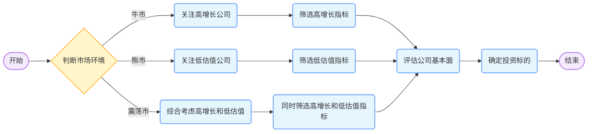

# 彼得林奇的“高增长低估值”在不同市场环境下的筛选

> 关键词：彼得林奇、高增长低估值、市场环境、筛选策略、财务指标、估值模型

> 摘要：本文深入探讨了彼得林奇“高增长低估值”投资理念在不同市场环境下的筛选方法。首先介绍了研究该理念的背景和相关术语，阐述了核心概念及联系。接着详细讲解了核心算法原理，包括用 Python 实现的具体操作步骤，同时给出了相关数学模型和公式并举例说明。通过项目实战，展示了在实际开发环境中如何运用该策略进行筛选，并对源代码进行解读与分析。还探讨了该策略的实际应用场景，推荐了相关的学习资源、开发工具框架以及论文著作。最后总结了其未来发展趋势与挑战，提供了常见问题解答和扩展阅读参考资料，旨在为投资者在不同市场环境下运用“高增长低估值”策略提供全面且深入的指导。

## 1. 背景介绍 
### 1.1 目的和范围
彼得林奇作为投资界的传奇人物，其“高增长低估值”的投资理念影响深远。本研究的目的在于深入剖析这一理念在不同市场环境（如牛市、熊市、震荡市等）下的具体筛选方法和应用效果。研究范围涵盖了对上市公司财务数据的分析、估值模型的运用以及市场环境因素的考量，旨在为投资者提供一套科学、实用的筛选策略，帮助他们在复杂多变的市场中挑选出具有潜力的投资标的。

### 1.2 预期读者
本文预期读者包括对投资领域感兴趣的个人投资者、金融从业者、研究机构人员以及相关专业的学生。对于个人投资者而言，本文可以帮助他们更好地理解和运用“高增长低估值”策略，提升投资决策的准确性；金融从业者可以从中获取新的投资思路和方法，优化投资组合；研究机构人员能够将本文的研究成果作为进一步深入研究的参考；相关专业的学生则可以通过学习本文，加深对投资理论和实践的理解。

### 1.3 文档结构概述
本文共分为十个部分。第一部分为背景介绍，阐述了研究的目的、范围、预期读者和文档结构概述，并介绍了相关术语。第二部分讲解核心概念与联系，包括“高增长低估值”的原理和架构，同时配有文本示意图和 Mermaid 流程图。第三部分详细介绍核心算法原理和具体操作步骤，使用 Python 源代码进行阐述。第四部分给出数学模型和公式，并进行详细讲解和举例说明。第五部分通过项目实战，展示开发环境搭建、源代码详细实现和代码解读与分析。第六部分探讨实际应用场景。第七部分推荐工具和资源，包括学习资源、开发工具框架和相关论文著作。第八部分总结未来发展趋势与挑战。第九部分为附录，提供常见问题与解答。第十部分列出扩展阅读和参考资料。

### 1.4 术语表
#### 1.4.1 核心术语定义
- **高增长**：指公司的营业收入、净利润等关键财务指标在一定时期内呈现出快速增长的趋势。通常用增长率来衡量，如年净利润增长率、年营业收入增长率等。
- **低估值**：表示公司的股票价格相对其内在价值被低估。常见的估值指标包括市盈率（PE）、市净率（PB）、市销率（PS）等。当这些指标低于行业平均水平或历史平均水平时，可认为该股票具有低估值的特征。
- **市场环境**：包括宏观经济环境、政策环境、行业发展趋势等因素，可分为牛市、熊市、震荡市等不同类型。不同的市场环境对公司的估值和增长预期会产生不同的影响。

#### 1.4.2 相关概念解释
- **PEG 指标**：即市盈率相对盈利增长比率，是用公司的市盈率除以公司的盈利增长速度。该指标综合考虑了公司的估值和增长情况，PEG 小于 1 通常被认为是具有投资价值的信号。
- **现金流折现模型（DCF）**：一种通过预测公司未来的自由现金流，并将其折现到当前的估值方法。该模型基于公司的内在价值等于其未来自由现金流的现值之和的原理，用于评估公司的真实价值。

#### 1.4.3 缩略词列表
- **PE**：市盈率（Price - Earnings Ratio）
- **PB**：市净率（Price - Book Ratio）
- **PS**：市销率（Price - Sales Ratio）
- **DCF**：现金流折现模型（Discounted Cash Flow Model）
- **PEG**：市盈率相对盈利增长比率（Price/Earnings to Growth Ratio）

## 2. 核心概念与联系 

### 核心概念原理
彼得林奇的“高增长低估值”理念基于一个简单而深刻的逻辑：在股票市场中，具有高增长潜力且被低估的公司往往具有更大的投资价值。高增长意味着公司的业务在不断扩张，未来的盈利和现金流有望持续增加，这为股票价格的上涨提供了坚实的基础。而低估值则表示市场对该公司的价值认识不足，股票价格存在被低估的情况，投资者有机会以较低的价格买入股票，从而获得更高的投资回报。

### 架构的文本示意图
```plaintext
高增长低估值理念
|
|-- 高增长因素
|   |-- 营业收入增长
|   |-- 净利润增长
|   |-- 市场份额扩大
|
|-- 低估值因素
|   |-- 低市盈率
|   |-- 低市净率
|   |-- 低市销率
|
|-- 市场环境因素
|   |-- 牛市
|   |-- 熊市
|   |-- 震荡市
```

### Mermaid 流程图


## 3. 核心算法原理 & 具体操作步骤 

### 核心算法原理
我们的核心算法是基于对公司财务数据的分析和估值模型的运用，筛选出具有高增长低估值特征的公司。具体步骤如下：
1. 收集公司的财务数据，包括营业收入、净利润、总资产、净资产等。
2. 计算关键的财务指标，如营业收入增长率、净利润增长率、市盈率、市净率、市销率等。
3. 根据市场环境调整筛选标准，例如在牛市中，对增长指标的要求可以相对宽松，而在熊市中，更注重低估值指标。
4. 运用估值模型，如现金流折现模型（DCF），评估公司的内在价值。
5. 综合考虑各项指标和估值结果，筛选出符合“高增长低估值”条件的公司。

### 具体操作步骤（Python 源代码）
```python
import pandas as pd
import numpy as np

# 模拟收集公司财务数据
data = {
    '公司名称': ['A公司', 'B公司', 'C公司', 'D公司', 'E公司'],
    '营业收入': [1000, 1200, 800, 1500, 900],
    '净利润': [100, 150, 80, 200, 90],
    '总资产': [500, 600, 400, 700, 450],
    '净资产': [300, 350, 250, 400, 280],
    '股价': [20, 25, 15, 30, 18]
}

df = pd.DataFrame(data)

# 计算关键财务指标
df['营业收入增长率'] = df['营业收入'].pct_change()
df['净利润增长率'] = df['净利润'].pct_change()
df['市盈率'] = df['股价'] / (df['净利润'] / len(df))
df['市净率'] = df['股价'] / (df['净资产'] / len(df))
df['市销率'] = df['股价'] / (df['营业收入'] / len(df))

# 定义筛选标准（示例）
growth_threshold = 0.1  # 增长阈值为 10%
pe_threshold = 15  # 市盈率阈值为 15
pb_threshold = 2  # 市净率阈值为 2

# 筛选符合条件的公司
selected_companies = df[(df['净利润增长率'] > growth_threshold) & (df['市盈率'] < pe_threshold) & (df['市净率'] < pb_threshold)]

print(selected_companies)
```

### 代码解释
1. **数据收集**：使用字典模拟收集公司的财务数据，并将其转换为 Pandas 数据框。
2. **指标计算**：使用 Pandas 的 `pct_change()` 方法计算营业收入增长率和净利润增长率，同时计算市盈率、市净率和市销率。
3. **筛选标准定义**：设定增长阈值、市盈率阈值和市净率阈值。
4. **筛选公司**：使用布尔索引筛选出符合条件的公司，并将结果存储在 `selected_companies` 数据框中。

## 4. 数学模型和公式 & 详细讲解 & 举例说明 

### 关键财务指标公式
1. **营业收入增长率**
   计算公式为：
   $$营业收入增长率 = \frac{本期营业收入 - 上期营业收入}{上期营业收入}$$
   例如，某公司上期营业收入为 1000 万元，本期营业收入为 1200 万元，则营业收入增长率为：
   $$\frac{1200 - 1000}{1000} = 0.2 = 20\%$$

2. **净利润增长率**
   计算公式为：
   $$净利润增长率 = \frac{本期净利润 - 上期净利润}{上期净利润}$$
   例如，某公司上期净利润为 100 万元，本期净利润为 150 万元，则净利润增长率为：
   $$\frac{150 - 100}{100} = 0.5 = 50\%$$

3. **市盈率（PE）**
   计算公式为：
   $$市盈率（PE） = \frac{股票价格}{每股收益}$$
   其中，每股收益（EPS） = 净利润 / 总股本。
   例如，某公司股票价格为 20 元，净利润为 1000 万元，总股本为 500 万股，则每股收益为：
   $$EPS = \frac{1000}{500} = 2$$
   市盈率为：
   $$PE = \frac{20}{2} = 10$$

4. **市净率（PB）**
   计算公式为：
   $$市净率（PB） = \frac{股票价格}{每股净资产}$$
   其中，每股净资产 = 净资产 / 总股本。
   例如，某公司股票价格为 20 元，净资产为 1500 万元，总股本为 500 万股，则每股净资产为：
   $$每股净资产 = \frac{1500}{500} = 3$$
   市净率为：
   $$PB = \frac{20}{3} \approx 6.67$$

5. **市销率（PS）**
   计算公式为：
   $$市销率（PS） = \frac{股票价格}{每股营业收入}$$
   其中，每股营业收入 = 营业收入 / 总股本。
   例如，某公司股票价格为 20 元，营业收入为 2000 万元，总股本为 500 万股，则每股营业收入为：
   $$每股营业收入 = \frac{2000}{500} = 4$$
   市销率为：
   $$PS = \frac{20}{4} = 5$$

### 现金流折现模型（DCF）
现金流折现模型的基本公式为：
$$V = \sum_{t = 1}^{n}\frac{FCF_t}{(1 + r)^t}+\frac{TV}{(1 + r)^n}$$
其中：
- $V$ 表示公司的内在价值
- $FCF_t$ 表示第 $t$ 期的自由现金流
- $r$ 表示折现率
- $n$ 表示预测期数
- $TV$ 表示终值

举例说明：假设某公司未来 3 年的自由现金流分别为 100 万元、120 万元、150 万元，预测期为 3 年，折现率为 10%，终值为 1000 万元。则该公司的内在价值为：
$$V=\frac{100}{(1 + 0.1)^1}+\frac{120}{(1 + 0.1)^2}+\frac{150}{(1 + 0.1)^3}+\frac{1000}{(1 + 0.1)^3}$$
$$V=\frac{100}{1.1}+\frac{120}{1.21}+\frac{150}{1.331}+\frac{1000}{1.331}$$
$$V\approx90.91 + 99.17+112.69 + 751.31$$
$$V\approx1054.08$$（万元）

## 5. 项目实战：代码实际案例和详细解释说明 

### 5.1  开发环境搭建
1. **安装 Python**：从 Python 官方网站（https://www.python.org/downloads/）下载并安装 Python 3.x 版本。
2. **安装必要的库**：使用 `pip` 命令安装所需的库，如 Pandas、Numpy 等。
```bash
pip install pandas numpy
```
3. **选择开发工具**：可以选择 PyCharm、Jupyter Notebook 等开发工具。

### 5.2  源代码详细实现和代码解读
```python
import pandas as pd
import numpy as np

# 从 CSV 文件中读取公司财务数据
data = pd.read_csv('company_data.csv')

# 计算关键财务指标
data['营业收入增长率'] = data.groupby('公司名称')['营业收入'].pct_change()
data['净利润增长率'] = data.groupby('公司名称')['净利润'].pct_change()
data['市盈率'] = data['股价'] / (data['净利润'] / data['总股本'])
data['市净率'] = data['股价'] / (data['净资产'] / data['总股本'])
data['市销率'] = data['股价'] / (data['营业收入'] / data['总股本'])

# 定义不同市场环境下的筛选标准
bull_market_growth_threshold = 0.2  # 牛市增长阈值为 20%
bear_market_pe_threshold = 10  # 熊市市盈率阈值为 10
sideways_market_pb_threshold = 1.5  # 震荡市市净率阈值为 1.5

# 根据市场环境筛选公司
def screen_companies(market_environment):
    if market_environment == '牛市':
        selected = data[data['净利润增长率'] > bull_market_growth_threshold]
    elif market_environment == '熊市':
        selected = data[data['市盈率'] < bear_market_pe_threshold]
    elif market_environment == '震荡市':
        selected = data[data['市净率'] < sideways_market_pb_threshold]
    else:
        selected = pd.DataFrame()
    return selected

# 示例：筛选牛市环境下的公司
bull_market_companies = screen_companies('牛市')
print(bull_market_companies)
```

### 5.3  代码解读与分析
1. **数据读取**：使用 Pandas 的 `read_csv()` 方法从 CSV 文件中读取公司财务数据。
2. **指标计算**：使用 `groupby()` 方法按公司名称分组，计算营业收入增长率和净利润增长率，同时计算市盈率、市净率和市销率。
3. **筛选标准定义**：定义不同市场环境下的筛选标准，包括牛市的增长阈值、熊市的市盈率阈值和震荡市的市净率阈值。
4. **筛选函数**：定义 `screen_companies()` 函数，根据不同的市场环境筛选出符合条件的公司。
5. **示例调用**：调用 `screen_companies()` 函数，筛选出牛市环境下的公司，并打印结果。

## 6. 实际应用场景 
### 个人投资者
个人投资者可以运用“高增长低估值”策略筛选股票，构建自己的投资组合。在牛市中，个人投资者可以重点关注具有高增长潜力的公司，分享公司成长带来的收益；在熊市中，更倾向于选择低估值的公司，以降低投资风险；在震荡市中，则综合考虑高增长和低估值因素，寻找被市场错杀的优质公司。

### 基金管理公司
基金管理公司可以将“高增长低估值”策略纳入投资决策体系，筛选出具有投资价值的股票，优化基金的投资组合。通过深入研究公司的基本面和市场环境，基金经理可以运用该策略挑选出能够为基金投资者带来稳定回报的股票。

### 研究机构
研究机构可以对“高增长低估值”策略进行深入研究，分析其在不同市场环境下的有效性和局限性。通过对大量历史数据的分析和实证研究，为投资者提供更科学、更准确的投资建议。

## 7. 工具和资源推荐
### 7.1 学习资源推荐
#### 7.1.1 书籍推荐
- 《彼得林奇的成功投资》：彼得林奇的经典著作，详细阐述了他的投资理念和方法，是学习“高增长低估值”策略的必读之书。
- 《聪明的投资者》：本杰明·格雷厄姆的代表作，被誉为投资界的圣经，书中介绍了价值投资的基本原理和方法，对理解“高增长低估值”策略有很大的帮助。
- 《财务报表分析与股票估值》：全面介绍了财务报表分析和股票估值的方法，对于深入理解公司的财务状况和估值有重要的指导作用。

#### 7.1.2 在线课程
- Coursera 上的“投资学原理”：由知名高校教授授课，系统介绍了投资学的基本原理和方法，包括股票投资、债券投资等内容。
- 网易云课堂上的“财务报表分析实战”：通过实际案例讲解财务报表分析的方法和技巧，帮助学员掌握财务分析的核心要点。

#### 7.1.3 技术博客和网站
- 雪球网：国内知名的投资社区，汇聚了众多投资者和投资专家，提供丰富的投资资讯和股票分析报告。
- 东方财富网：提供全面的金融信息和数据服务，包括股票行情、财务报表、研报等内容。
- Seeking Alpha：国外知名的投资分析网站，提供专业的股票分析和投资建议。

### 7.2 开发工具框架推荐
#### 7.2.1 IDE和编辑器
- PyCharm：专业的 Python 集成开发环境，提供丰富的代码编辑、调试和版本控制功能。
- Jupyter Notebook：交互式的开发环境，适合数据探索和分析，方便展示代码和结果。

#### 7.2.2 调试和性能分析工具
- PDB：Python 内置的调试器，用于调试 Python 代码，查找程序中的错误。
- cProfile：Python 标准库中的性能分析工具，用于分析程序的性能瓶颈。

#### 7.2.3 相关框架和库
- Pandas：强大的数据处理和分析库，提供高效的数据结构和数据操作方法。
- Numpy：用于科学计算的基础库，提供高效的数组操作和数学函数。
- Scikit - learn：机器学习库，可用于构建投资模型和进行数据分析。

### 7.3 相关论文著作推荐
#### 7.3.1 经典论文
- Fama, E. F., & French, K. R. (1992). The cross - section of expected stock returns. Journal of Finance, 47(2), 427 - 465. 该论文提出了著名的 Fama - French 三因子模型，对股票收益的影响因素进行了深入研究。
- Sharpe, W. F. (1964). Capital asset prices: A theory of market equilibrium under conditions of risk. Journal of Finance, 19(3), 425 - 442. 该论文提出了资本资产定价模型（CAPM），为投资组合理论和资产定价提供了重要的理论基础。

#### 7.3.2 最新研究成果
- 关注顶级金融学术期刊，如 The Journal of Finance、The Review of Financial Studies 等，了解关于投资策略和市场效率的最新研究成果。

#### 7.3.3 应用案例分析
- 可以参考各大金融机构的研究报告，了解“高增长低估值”策略在实际投资中的应用案例和效果分析。

## 8. 总结：未来发展趋势与挑战
### 未来发展趋势
1. **智能化和自动化**：随着人工智能和大数据技术的发展，“高增长低估值”策略的筛选过程将越来越智能化和自动化。通过机器学习算法和深度学习模型，可以更快速、更准确地筛选出具有投资价值的公司。
2. **跨市场和跨行业应用**：该策略将不仅仅局限于股票市场，还将在债券市场、期货市场等其他金融市场得到广泛应用。同时，跨行业的投资组合构建也将成为未来的发展趋势，以降低投资风险，提高投资回报。
3. **与宏观经济分析相结合**：未来的“高增长低估值”策略将更加注重与宏观经济分析相结合，考虑宏观经济环境对公司增长和估值的影响。通过对宏观经济数据的分析和预测，调整筛选标准和投资组合，提高投资的准确性和稳定性。

### 挑战
1. **数据质量和可靠性**：筛选“高增长低估值”公司需要大量的财务数据和市场数据，数据的质量和可靠性直接影响筛选结果的准确性。如何获取准确、及时、完整的数据，并对数据进行有效的清洗和处理，是面临的一个重要挑战。
2. **市场环境的复杂性**：市场环境是复杂多变的，不同的市场环境对公司的增长和估值有着不同的影响。如何准确判断市场环境的变化，并及时调整筛选标准和投资策略，是投资者需要面对的难题。
3. **模型的局限性**：现有的估值模型和筛选方法都存在一定的局限性，无法完全准确地评估公司的价值和增长潜力。如何不断改进和完善模型，提高模型的准确性和适应性，是未来需要解决的问题。

## 9. 附录：常见问题与解答
### 问题 1：如何确定合适的增长阈值和估值阈值？
解答：增长阈值和估值阈值的确定需要综合考虑市场环境、行业特点和公司的历史数据。一般来说，可以参考行业平均水平和历史平均水平来确定初始阈值，然后根据市场环境的变化进行调整。例如，在牛市中，增长阈值可以适当提高；在熊市中，估值阈值可以适当降低。

### 问题 2：现金流折现模型（DCF）中的折现率如何确定？
解答：折现率的确定通常考虑无风险利率、市场风险溢价和公司的特定风险。无风险利率可以参考国债收益率，市场风险溢价可以根据历史数据和市场预期来估计，公司的特定风险则需要根据公司的财务状况、行业竞争等因素进行评估。

### 问题 3：“高增长低估值”策略是否适用于所有市场环境？
解答：“高增长低估值”策略在不同的市场环境下都有一定的适用性，但需要根据市场环境的变化调整筛选标准。在牛市中，更注重高增长因素；在熊市中，更注重低估值因素；在震荡市中，则需要综合考虑两者。

## 10. 扩展阅读 & 参考资料
### 扩展阅读
- 《金融炼金术》：乔治·索罗斯的著作，介绍了他的反身性理论和投资哲学。
- 《漫步华尔街》：伯顿·马尔基尔的经典著作，探讨了股票市场的有效性和投资策略。

### 参考资料
- 彼得林奇的相关演讲和访谈记录。
- 各大金融机构的研究报告和市场分析。
- 相关学术期刊上的论文和研究成果。