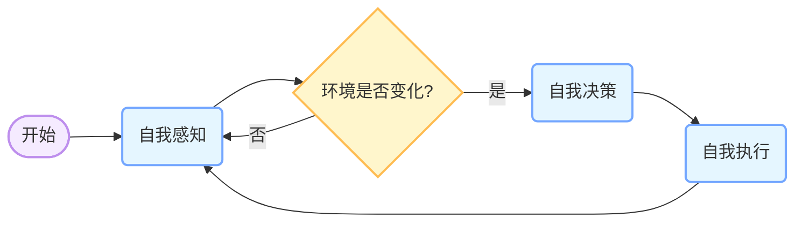

# 微服务架构的智能演进：自治化方向

> 关键词：微服务架构、智能演进、自治化、服务自治、分布式系统

> 摘要：本文深入探讨了微服务架构向自治化方向的智能演进。首先介绍了微服务架构自治化演进的背景，包括目的、预期读者、文档结构等内容。接着阐述了微服务架构自治化的核心概念、联系及相关原理和架构。详细讲解了实现自治化的核心算法原理与具体操作步骤，并通过数学模型和公式进行理论支持。通过项目实战展示了自治化微服务架构的代码实现和详细解读。分析了其实际应用场景，推荐了相关的学习资源、开发工具框架和论文著作。最后总结了微服务架构自治化的未来发展趋势与挑战，并提供了常见问题解答和扩展阅读参考资料，旨在为读者全面呈现微服务架构自治化演进的全貌。

## 1. 背景介绍 
### 1.1 目的和范围
随着互联网应用规模的不断扩大和业务复杂度的持续提升，传统的单体架构面临着诸多挑战，如可扩展性差、维护困难等。微服务架构作为一种新兴的架构模式，通过将应用拆分成多个小型、自治的服务，有效解决了单体架构的部分问题。然而，当前的微服务架构在应对复杂多变的业务场景和动态的运行环境时，仍存在一定的局限性。本文的目的在于探讨微服务架构向自治化方向的智能演进，研究如何使微服务具备更高的自主性、自适应性和自修复能力，以更好地满足现代应用的需求。

本文的范围涵盖了微服务架构自治化的核心概念、算法原理、数学模型、项目实战、应用场景等多个方面，旨在为读者提供一个全面、深入的关于微服务架构自治化演进的知识体系。

### 1.2 预期读者
本文预期读者包括软件开发者、软件架构师、技术管理者、对微服务架构和人工智能技术感兴趣的研究人员等。对于软件开发者，本文可以帮助他们了解微服务架构自治化的实现原理和具体操作步骤，提升其在微服务开发方面的技能；软件架构师可以从本文中获取关于微服务架构自治化设计的思路和方法，优化现有的微服务架构；技术管理者可以通过本文了解微服务架构自治化的发展趋势和应用价值，为企业的技术战略决策提供参考；研究人员则可以在本文的基础上，进一步深入研究微服务架构自治化相关的理论和技术。

### 1.3 文档结构概述
本文共分为十个部分。第一部分为背景介绍，阐述了文章的目的、范围、预期读者和文档结构概述，并对相关术语进行了定义和解释。第二部分介绍微服务架构自治化的核心概念与联系，包括核心概念的原理和架构的文本示意图以及 Mermaid 流程图。第三部分详细讲解核心算法原理和具体操作步骤，并使用 Python 源代码进行阐述。第四部分给出数学模型和公式，并进行详细讲解和举例说明。第五部分通过项目实战展示代码实际案例和详细解释说明，包括开发环境搭建、源代码详细实现和代码解读以及代码分析。第六部分分析微服务架构自治化的实际应用场景。第七部分推荐相关的工具和资源，包括学习资源、开发工具框架和论文著作。第八部分总结微服务架构自治化的未来发展趋势与挑战。第九部分为附录，提供常见问题与解答。第十部分为扩展阅读和参考资料，为读者提供进一步学习的方向。

### 1.4 术语表
#### 1.4.1 核心术语定义
- **微服务架构**：一种将单个应用程序拆分成多个小型、自治的服务的架构模式，每个服务都可以独立开发、部署和扩展。
- **自治化**：指微服务具备自我管理、自我决策和自我修复的能力，能够在动态的运行环境中自动调整自身的行为以适应变化。
- **服务自治**：单个微服务在一定范围内独立运行，能够自主处理自身的业务逻辑、资源管理和错误处理等问题。
- **分布式系统**：由多个独立的计算机节点组成的系统，这些节点通过网络进行通信和协作，共同完成一个或多个任务。

#### 1.4.2 相关概念解释
- **容器化**：将应用程序及其依赖项打包成一个独立的容器，容器可以在不同的环境中运行，实现了应用的隔离和可移植性。
- **编排工具**：用于管理和协调多个容器的运行，如 Kubernetes 等。
- **服务发现**：在分布式系统中，服务发现机制用于自动检测和定位服务的位置，使得服务之间能够相互通信。

#### 1.4.3 缩略词列表
- **REST**：Representational State Transfer，表述性状态转移，一种基于 HTTP 协议的软件架构风格。
- **RPC**：Remote Procedure Call，远程过程调用，一种允许程序调用其他计算机上的子程序的机制。
- **API**：Application Programming Interface，应用程序编程接口，用于不同软件组件之间的通信。

## 2. 核心概念与联系 
### 核心概念原理
微服务架构的自治化演进是指微服务在运行过程中能够自主地感知环境变化、做出决策并采取相应的行动，以实现自我优化和自我修复。其核心原理基于以下几个方面：

- **自我感知**：微服务需要具备对自身状态和运行环境的感知能力，包括资源使用情况、服务负载、网络状况等。通过收集这些信息，微服务可以了解自身的运行状态和所处的环境，为后续的决策提供依据。
- **自我决策**：在感知到环境变化后，微服务需要能够根据预设的规则和算法，自主地做出决策。例如，当服务负载过高时，微服务可以决定是否进行水平扩展或垂直扩展；当出现故障时，微服务可以决定是否进行自我修复或切换到备用服务。
- **自我执行**：微服务在做出决策后，需要能够自动执行相应的操作。例如，通过调用编排工具实现服务的扩展或收缩，通过调用监控系统实现故障的检测和修复等。

### 架构的文本示意图
微服务架构自治化的架构可以分为以下几个层次：

- **应用层**：包含多个微服务，每个微服务负责处理特定的业务逻辑。
- **中间件层**：提供服务发现、配置管理、消息队列等中间件服务，支持微服务之间的通信和协作。
- **自治化管理层**：负责微服务的自治化管理，包括自我感知、自我决策和自我执行等功能。该层可以使用人工智能算法和机器学习模型来实现智能决策。
- **基础设施层**：提供计算、存储和网络等基础设施资源，支持微服务的运行。

### Mermaid 流程图


该流程图展示了微服务自治化的基本流程：首先进行自我感知，然后判断环境是否发生变化。如果环境发生变化，则进行自我决策，根据决策结果进行自我执行；如果环境没有变化，则继续进行自我感知。这个过程不断循环，使得微服务能够在动态的环境中保持自治。

## 3. 核心算法原理 & 具体操作步骤 
### 核心算法原理
微服务架构自治化的核心算法主要包括自我感知算法、自我决策算法和自我执行算法。以下是对这些算法的详细介绍：

#### 自我感知算法
自我感知算法用于收集微服务的状态信息和运行环境信息。常见的自我感知算法包括监控指标采集算法和日志分析算法。

监控指标采集算法通过定期采集微服务的各种监控指标，如 CPU 使用率、内存使用率、网络带宽等，来了解微服务的运行状态。日志分析算法则通过分析微服务的日志文件，提取有用的信息，如错误信息、业务操作记录等，来了解微服务的运行情况。

以下是一个简单的 Python 示例，用于采集微服务的 CPU 使用率：
```python
import psutil

def get_cpu_usage():
    return psutil.cpu_percent(interval=1)

if __name__ == "__main__":
    cpu_usage = get_cpu_usage()
    print(f"当前 CPU 使用率: {cpu_usage}%")
```

#### 自我决策算法
自我决策算法用于根据自我感知算法收集到的信息，做出相应的决策。常见的自我决策算法包括规则引擎算法和机器学习算法。

规则引擎算法通过预设的规则来进行决策。例如，当 CPU 使用率超过 80% 时，决定进行服务扩展。机器学习算法则通过训练模型来进行决策。例如，使用深度学习模型预测服务的负载情况，根据预测结果进行决策。

以下是一个简单的规则引擎示例，根据 CPU 使用率进行决策：
```python
def decision_making(cpu_usage):
    if cpu_usage > 80:
        return "进行服务扩展"
    else:
        return "保持当前状态"

if __name__ == "__main__":
    cpu_usage = get_cpu_usage()
    decision = decision_making(cpu_usage)
    print(f"决策结果: {decision}")
```

#### 自我执行算法
自我执行算法用于根据自我决策算法做出的决策，执行相应的操作。常见的自我执行算法包括调用编排工具进行服务扩展或收缩、调用监控系统进行故障修复等。

以下是一个简单的示例，模拟调用编排工具进行服务扩展：
```python
def execute_action(decision):
    if decision == "进行服务扩展":
        print("调用编排工具进行服务扩展")
    else:
        print("保持当前状态")

if __name__ == "__main__":
    cpu_usage = get_cpu_usage()
    decision = decision_making(cpu_usage)
    execute_action(decision)
```

### 具体操作步骤
实现微服务架构自治化的具体操作步骤如下：

1. **监控指标定义**：确定需要监控的指标，如 CPU 使用率、内存使用率、网络带宽等。
2. **监控系统搭建**：搭建监控系统，用于采集和存储监控指标数据。可以使用 Prometheus、Grafana 等开源监控工具。
3. **规则引擎配置**：配置规则引擎，根据监控指标数据设置相应的规则。例如，当 CPU 使用率超过 80% 时，触发服务扩展操作。
4. **编排工具集成**：集成编排工具，如 Kubernetes，用于实现服务的扩展和收缩。
5. **故障处理机制实现**：实现故障处理机制，当微服务出现故障时，能够自动进行故障检测和修复。
6. **机器学习模型训练（可选）**：如果需要更智能的决策，可以训练机器学习模型，根据历史数据预测服务的负载情况和故障发生的可能性。
7. **测试和优化**：对微服务架构自治化系统进行测试和优化，确保其在不同的场景下都能正常运行。

## 4. 数学模型和公式 & 详细讲解 & 举例说明 
### 数学模型
微服务架构自治化的数学模型可以基于马尔可夫决策过程（MDP）来建立。马尔可夫决策过程是一种用于描述在不确定环境中进行决策的数学模型，由状态集合 $S$、动作集合 $A$、状态转移概率 $P$、奖励函数 $R$ 和折扣因子 $\gamma$ 组成。

在微服务架构自治化中，状态集合 $S$ 可以表示微服务的各种状态，如服务负载、资源使用情况等；动作集合 $A$ 可以表示微服务可以采取的各种动作，如服务扩展、服务收缩等；状态转移概率 $P$ 表示在当前状态下采取某个动作后，转移到下一个状态的概率；奖励函数 $R$ 表示在某个状态下采取某个动作后获得的奖励；折扣因子 $\gamma$ 用于平衡短期奖励和长期奖励。

### 数学公式
马尔可夫决策过程的目标是找到一个最优策略 $\pi$，使得在长期内获得的总奖励最大。最优策略可以通过求解贝尔曼方程得到：

$$V^*(s) = \max_{a \in A} \left[ R(s, a) + \gamma \sum_{s' \in S} P(s' | s, a) V^*(s') \right]$$

其中，$V^*(s)$ 表示状态 $s$ 的最优值函数，$R(s, a)$ 表示在状态 $s$ 下采取动作 $a$ 获得的奖励，$P(s' | s, a)$ 表示在状态 $s$ 下采取动作 $a$ 后转移到状态 $s'$ 的概率，$\gamma$ 是折扣因子。

### 详细讲解
贝尔曼方程的含义是，在状态 $s$ 下的最优值函数 $V^*(s)$ 等于在该状态下采取所有可能动作中获得的最大价值。每个动作的价值由两部分组成：当前动作获得的奖励 $R(s, a)$ 和下一个状态的最优值函数 $V^*(s')$ 乘以状态转移概率 $P(s' | s, a)$ 并进行折扣后的总和。

通过迭代求解贝尔曼方程，可以得到最优值函数 $V^*(s)$，进而得到最优策略 $\pi$。

### 举例说明
假设一个微服务有两个状态：高负载状态 $s_1$ 和低负载状态 $s_2$，可以采取的动作有两个：扩展服务 $a_1$ 和收缩服务 $a_2$。状态转移概率和奖励函数如下：

| 状态 $s$ | 动作 $a$ | 下一个状态 $s'$ | 状态转移概率 $P(s' | s, a)$ | 奖励 $R(s, a)$ |
| --- | --- | --- | --- | --- |
| $s_1$ | $a_1$ | $s_1$ | 0.6 | 10 |
| $s_1$ | $a_1$ | $s_2$ | 0.4 | 20 |
| $s_1$ | $a_2$ | $s_1$ | 0.8 | -10 |
| $s_1$ | $a_2$ | $s_2$ | 0.2 | -20 |
| $s_2$ | $a_1$ | $s_1$ | 0.3 | -5 |
| $s_2$ | $a_1$ | $s_2$ | 0.7 | -10 |
| $s_2$ | $a_2$ | $s_1$ | 0.1 | 5 |
| $s_2$ | $a_2$ | $s_2$ | 0.9 | 10 |

假设折扣因子 $\gamma = 0.9$，初始值函数 $V^0(s_1) = V^0(s_2) = 0$。

第一次迭代：

对于状态 $s_1$：

- 采取动作 $a_1$ 的价值：$V_1(s_1, a_1) = R(s_1, a_1) + \gamma \left[ P(s_1 | s_1, a_1) V^0(s_1) + P(s_2 | s_1, a_1) V^0(s_2) \right] = 10 + 0.9 \times (0.6 \times 0 + 0.4 \times 0) = 10$
- 采取动作 $a_2$ 的价值：$V_1(s_1, a_2) = R(s_1, a_2) + \gamma \left[ P(s_1 | s_1, a_2) V^0(s_1) + P(s_2 | s_1, a_2) V^0(s_2) \right] = -10 + 0.9 \times (0.8 \times 0 + 0.2 \times 0) = -10$

$V^1(s_1) = \max\{V_1(s_1, a_1), V_1(s_1, a_2)\} = 10$

对于状态 $s_2$：

- 采取动作 $a_1$ 的价值：$V_1(s_2, a_1) = R(s_2, a_1) + \gamma \left[ P(s_1 | s_2, a_1) V^0(s_1) + P(s_2 | s_2, a_1) V^0(s_2) \right] = -5 + 0.9 \times (0.3 \times 0 + 0.7 \times 0) = -5$
- 采取动作 $a_2$ 的价值：$V_1(s_2, a_2) = R(s_2, a_2) + \gamma \left[ P(s_1 | s_2, a_2) V^0(s_1) + P(s_2 | s_2, a_2) V^0(s_2) \right] = 5 + 0.9 \times (0.1 \times 0 + 0.9 \times 0) = 5$

$V^1(s_2) = \max\{V_1(s_2, a_1), V_1(s_2, a_2)\} = 5$

继续迭代，直到值函数收敛，即可得到最优值函数和最优策略。

## 5. 项目实战：代码实际案例和详细解释说明 
### 5.1  开发环境搭建
在进行微服务架构自治化的项目实战之前，需要搭建相应的开发环境。以下是具体的搭建步骤：

1. **安装 Docker**：Docker 是一个用于容器化应用的开源平台，可以帮助我们快速部署和管理微服务。可以从 Docker 官方网站下载并安装 Docker。
2. **安装 Kubernetes**：Kubernetes 是一个用于自动化部署、扩展和管理容器化应用的开源编排工具。可以使用 Minikube 来快速搭建本地的 Kubernetes 集群。
3. **安装 Prometheus 和 Grafana**：Prometheus 是一个开源的监控系统，用于采集和存储监控指标数据；Grafana 是一个开源的可视化工具，用于展示监控指标数据。可以使用 Docker 来快速部署 Prometheus 和 Grafana。
4. **安装 Python 环境**：本文的示例代码使用 Python 编写，需要安装 Python 环境和相关的库，如 psutil 等。

### 5.2  源代码详细实现和代码解读
以下是一个简单的微服务架构自治化的项目实战示例，包括自我感知、自我决策和自我执行三个部分。

#### 自我感知部分
```python
import psutil
import time

def get_cpu_usage():
    return psutil.cpu_percent(interval=1)

while True:
    cpu_usage = get_cpu_usage()
    print(f"当前 CPU 使用率: {cpu_usage}%")
    time.sleep(5)
```
代码解读：该代码使用 psutil 库来获取当前系统的 CPU 使用率，并每隔 5 秒打印一次 CPU 使用率。

#### 自我决策部分
```python
def decision_making(cpu_usage):
    if cpu_usage > 80:
        return "进行服务扩展"
    else:
        return "保持当前状态"

cpu_usage = get_cpu_usage()
decision = decision_making(cpu_usage)
print(f"决策结果: {decision}")
```
代码解读：该代码根据 CPU 使用率进行决策，如果 CPU 使用率超过 80%，则决定进行服务扩展；否则，保持当前状态。

#### 自我执行部分
```python
import subprocess

def execute_action(decision):
    if decision == "进行服务扩展":
        # 模拟调用 Kubernetes 进行服务扩展
        try:
            subprocess.run(["kubectl", "scale", "deployment", "my-service", "--replicas=3"], check=True)
            print("服务扩展成功")
        except subprocess.CalledProcessError as e:
            print(f"服务扩展失败: {e}")
    else:
        print("保持当前状态")

execute_action(decision)
```
代码解读：该代码根据决策结果执行相应的操作。如果决策结果是进行服务扩展，则使用 subprocess 模块调用 kubectl 命令来扩展服务的副本数；否则，保持当前状态。

### 5.3  代码解读与分析
通过以上代码示例，我们实现了一个简单的微服务架构自治化系统。自我感知部分通过采集 CPU 使用率来了解微服务的运行状态；自我决策部分根据 CPU 使用率进行决策；自我执行部分根据决策结果执行相应的操作。

然而，该示例只是一个简单的演示，实际的微服务架构自治化系统需要考虑更多的因素，如多个监控指标的综合分析、复杂的决策算法、故障处理机制等。

## 6. 实际应用场景 
微服务架构自治化在以下几个实际应用场景中具有重要的应用价值：

### 电商平台
在电商平台中，订单处理、商品展示、用户管理等功能通常由多个微服务组成。在促销活动期间，订单量会大幅增加，导致某些微服务的负载过高。通过微服务架构自治化，这些微服务可以自动感知负载变化，根据预设的规则进行服务扩展，以应对高并发的请求。同时，当促销活动结束后，微服务可以自动进行服务收缩，降低资源消耗。

### 金融系统
金融系统对稳定性和可靠性要求极高。在金融交易过程中，可能会出现网络故障、服务器故障等问题。通过微服务架构自治化，金融系统中的微服务可以自动检测故障，快速切换到备用服务，确保交易的正常进行。同时，微服务可以根据交易流量的变化，自动调整资源分配，提高系统的性能和效率。

### 物联网系统
物联网系统通常包含大量的设备和传感器，这些设备和传感器产生的数据需要进行实时处理和分析。通过微服务架构自治化，物联网系统中的微服务可以根据设备和传感器的状态变化，自动调整数据处理和分析的策略。例如，当某个设备的传感器数据异常时，微服务可以自动增加对该设备的监测频率，及时发现潜在的问题。

## 7. 工具和资源推荐
### 7.1 学习资源推荐
#### 7.1.1 书籍推荐
- 《微服务架构设计模式》：本书详细介绍了微服务架构的设计模式和最佳实践，帮助读者深入理解微服务架构的原理和应用。
- 《Kubernetes 实战》：本书全面介绍了 Kubernetes 的使用方法和实践经验，是学习 Kubernetes 编排工具的优秀参考书。
- 《Python 数据分析实战》：本书介绍了 Python 在数据分析领域的应用，对于学习如何使用 Python 进行监控指标分析和机器学习模型训练有很大的帮助。

#### 7.1.2 在线课程
- Coursera 上的“微服务架构原理与实践”课程：该课程由知名教授授课，系统地介绍了微服务架构的原理、设计和实现方法。
- edX 上的“Kubernetes 基础与应用”课程：该课程详细讲解了 Kubernetes 的基本概念和使用方法，通过实践项目帮助学员掌握 Kubernetes 的应用技能。
- 慕课网上的“Python 数据分析入门”课程：该课程适合初学者，通过实际案例介绍了 Python 数据分析的基本方法和技巧。

#### 7.1.3 技术博客和网站
- InfoQ：一个专注于软件开发和架构的技术媒体平台，提供了大量关于微服务架构、容器化、Kubernetes 等方面的技术文章和资讯。
- Medium：一个开放的技术博客平台，有很多技术专家和开发者在上面分享微服务架构自治化的实践经验和研究成果。
- Kubernetes 官方文档：Kubernetes 的官方文档是学习 Kubernetes 的权威资料，提供了详细的文档和教程。

### 7.2 开发工具框架推荐
#### 7.2.1 IDE和编辑器
- PyCharm：一款专业的 Python 集成开发环境，提供了丰富的代码编辑、调试和分析功能，适合开发 Python 代码。
- Visual Studio Code：一款轻量级的代码编辑器，支持多种编程语言，有丰富的插件可以扩展功能，适合开发微服务项目。
- IntelliJ IDEA：一款功能强大的 Java 集成开发环境，适合开发基于 Java 的微服务项目。

#### 7.2.2 调试和性能分析工具
- Docker Desktop：提供了可视化的界面，方便调试和管理 Docker 容器。
- Kubernetes Dashboard：Kubernetes 的官方可视化工具，用于监控和管理 Kubernetes 集群。
- Prometheus 和 Grafana：用于采集、存储和展示监控指标数据，帮助进行性能分析和故障排查。

#### 7.2.3 相关框架和库
- Flask：一个轻量级的 Python Web 框架，适合快速开发微服务。
- Spring Boot：一个基于 Java 的开发框架，提供了快速搭建微服务的功能。
- NumPy 和 Pandas：Python 中用于数据分析和科学计算的库，适合处理监控指标数据。

### 7.3 相关论文著作推荐
#### 7.3.1 经典论文
- “Microservices: a definition of this new architectural term”：该论文对微服务架构进行了详细的定义和阐述，是微服务领域的经典论文。
- “Kubernetes: A Distributed Systems Approach”：该论文介绍了 Kubernetes 的分布式系统原理和设计思想。
- “Markov Decision Processes: Concepts and Algorithms”：该论文详细介绍了马尔可夫决策过程的概念和算法，对于理解微服务架构自治化的数学模型有很大的帮助。

#### 7.3.2 最新研究成果
- 关注顶级学术会议，如 ACM SIGOPS、IEEE INFOCOM 等，这些会议上会有关于微服务架构自治化的最新研究成果。
- 查阅相关的学术期刊，如《ACM Transactions on Software Engineering and Methodology》、《IEEE Transactions on Cloud Computing》等，获取最新的研究论文。

#### 7.3.3 应用案例分析
- 各大科技公司的技术博客，如 Google、Amazon、Netflix 等，会分享他们在微服务架构自治化方面的应用案例和实践经验。
- 开源项目的文档和社区论坛，如 Kubernetes、Prometheus 等，也可以找到很多实际应用案例和用户的经验分享。

## 8. 总结：未来发展趋势与挑战
### 未来发展趋势
- **智能化程度不断提高**：随着人工智能和机器学习技术的不断发展，微服务架构自治化的智能化程度将不断提高。微服务将能够更加准确地感知环境变化，做出更加智能的决策，实现更高水平的自我优化和自我修复。
- **与边缘计算的融合**：边缘计算将计算和数据存储靠近数据源，减少数据传输延迟。微服务架构自治化与边缘计算的融合将使得微服务能够在边缘设备上运行，实现更加高效的资源利用和数据处理。
- **安全和隐私保护加强**：随着微服务架构的广泛应用，安全和隐私问题将越来越受到关注。未来的微服务架构自治化系统将更加注重安全和隐私保护，采用更加先进的加密技术和访问控制机制。

### 挑战
- **复杂性管理**：微服务架构自治化系统的复杂性较高，包括多个微服务之间的通信、协调和管理，以及自治化算法的设计和实现等。如何有效地管理这些复杂性是一个挑战。
- **数据质量和一致性**：微服务架构自治化系统需要大量的监控指标数据来进行决策，数据的质量和一致性直接影响决策的准确性。如何保证数据的质量和一致性是一个需要解决的问题。
- **标准和规范缺乏**：目前微服务架构自治化领域还缺乏统一的标准和规范，不同的实现方式可能存在兼容性问题。制定统一的标准和规范是推动微服务架构自治化发展的关键。

## 9. 附录：常见问题与解答
### 问题 1：微服务架构自治化与传统微服务架构有什么区别？
解答：传统微服务架构需要人工进行服务的管理和维护，如服务的部署、扩展、故障处理等。而微服务架构自治化使得微服务具备自我管理、自我决策和自我修复的能力，能够在动态的运行环境中自动调整自身的行为，减少人工干预。

### 问题 2：实现微服务架构自治化需要具备哪些技术基础？
解答：实现微服务架构自治化需要具备微服务架构、容器化、编排工具（如 Kubernetes）、监控系统（如 Prometheus、Grafana）、Python 编程、机器学习等方面的技术基础。

### 问题 3：微服务架构自治化会增加系统的成本吗？
解答：在短期内，实现微服务架构自治化可能需要投入一定的开发和运维成本，如搭建监控系统、训练机器学习模型等。但从长期来看，微服务架构自治化可以提高系统的效率和可靠性，减少人工干预，从而降低系统的总体成本。

### 问题 4：如何保证微服务架构自治化系统的安全性？
解答：可以采用以下措施来保证微服务架构自治化系统的安全性：使用加密技术对数据进行加密传输和存储；采用访问控制机制，限制对系统的访问权限；定期进行安全漏洞扫描和修复；对微服务进行隔离，防止一个微服务的漏洞影响其他微服务。

## 10. 扩展阅读 & 参考资料
### 扩展阅读
- 《人工智能与机器学习》：深入了解人工智能和机器学习的基本原理和算法，有助于更好地理解微服务架构自治化中的智能决策部分。
- 《分布式系统原理与范型》：学习分布式系统的基本原理和设计模式，对于理解微服务架构的分布式特性有很大的帮助。
- 《容器技术实战》：进一步了解容器化技术的原理和应用，掌握 Docker 等容器化工具的高级使用技巧。

### 参考资料
- Docker 官方文档：https://docs.docker.com/
- Kubernetes 官方文档：https://kubernetes.io/docs/
- Prometheus 官方文档：https://prometheus.io/docs/
- Grafana 官方文档：https://grafana.com/docs/
- Flask 官方文档：https://flask.palletsprojects.com/
- Spring Boot 官方文档：https://spring.io/projects/spring-boot