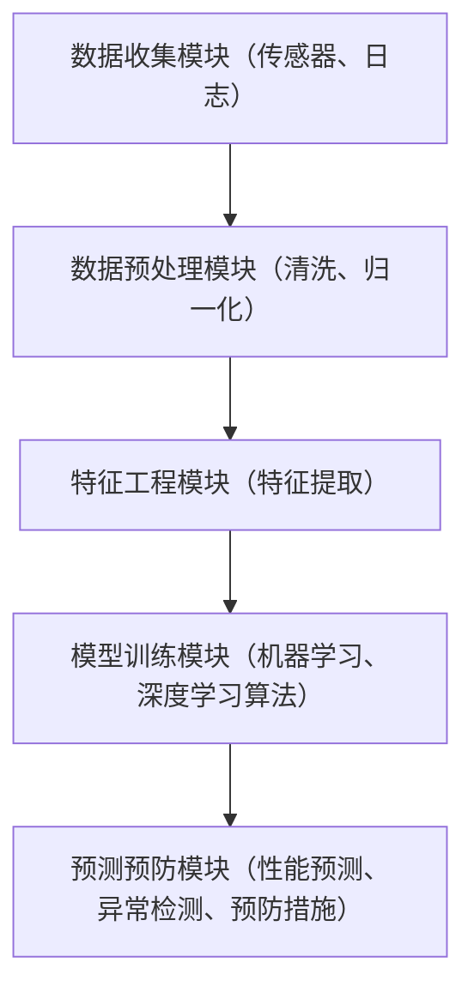

# 性能监控的AI革新：预测与预防

> 关键词：性能监控、AI革新、预测、预防、机器学习、数据分析、智能运维

> 摘要：本文聚焦于性能监控领域的AI革新，深入探讨如何利用人工智能技术实现对系统性能的预测与预防。首先介绍性能监控的背景和相关概念，阐述AI在性能监控中应用的核心原理与架构。接着详细讲解相关算法原理，结合Python代码进行具体操作步骤的说明，同时给出数学模型和公式并举例。通过项目实战展示代码实际案例及详细解释，分析其在不同实际应用场景中的作用。推荐相关的学习资源、开发工具框架以及论文著作，最后总结性能监控AI革新的未来发展趋势与挑战，还包含常见问题解答和扩展阅读参考资料，旨在为读者全面呈现性能监控领域AI革新的全貌。

## 1. 背景介绍 
### 1.1 目的和范围
在当今数字化时代，各种软件系统、网络基础设施以及硬件设备的规模和复杂性不断增加。性能监控作为保障系统稳定运行、提高资源利用率和用户体验的关键手段，变得至关重要。传统的性能监控方法主要基于阈值和规则，只能在问题发生后进行被动响应，难以满足现代复杂系统对实时性、前瞻性的要求。

本文的目的在于探讨如何利用人工智能（AI）技术对性能监控进行革新，实现对系统性能问题的预测与预防。范围涵盖了性能监控的基本概念、AI在性能监控中的应用原理、相关算法、数学模型，以及通过项目实战展示具体实现和应用场景等方面。

### 1.2 预期读者
本文预期读者包括IT专业人士，如系统管理员、运维工程师、软件开发者、数据分析师等，他们对性能监控和人工智能技术有一定的了解，希望深入学习如何将AI应用于性能监控领域。同时，也适合对新兴技术感兴趣的科研人员和学生，为他们提供性能监控与AI结合的理论和实践参考。

### 1.3 文档结构概述
本文首先介绍性能监控的背景知识，包括目的、预期读者和文档结构等内容，同时对相关术语进行定义和解释。接着阐述性能监控中AI应用的核心概念与联系，给出原理和架构的示意图及流程图。然后详细讲解核心算法原理，结合Python代码说明具体操作步骤，并给出数学模型和公式进行详细讲解和举例。通过项目实战展示代码实际案例及详细解释，分析其在不同实际应用场景中的作用。推荐相关的学习资源、开发工具框架以及论文著作。最后总结性能监控AI革新的未来发展趋势与挑战，包含常见问题解答和扩展阅读参考资料。

### 1.4 术语表
#### 1.4.1 核心术语定义
- **性能监控**：对系统的各项性能指标进行实时或定期的测量、收集、分析和展示，以评估系统的运行状态和性能表现。
- **AI（人工智能）**：使计算机系统能够模拟人类智能的技术，包括机器学习、深度学习、自然语言处理等多个领域。
- **预测**：基于历史数据和分析模型，对未来的性能指标或事件进行估计和判断。
- **预防**：在预测的基础上，采取相应的措施避免性能问题的发生或减轻其影响。
- **机器学习**：AI的一个分支，通过让计算机从数据中学习模式和规律，自动调整模型参数，以实现预测和决策的能力。

#### 1.4.2 相关概念解释
- **时间序列分析**：用于处理按时间顺序排列的数据，分析数据的趋势、季节性、周期性等特征，常用于性能监控中的预测任务。
- **异常检测**：识别数据中与正常模式不符的异常值或异常模式，在性能监控中用于发现潜在的性能问题。
- **智能运维（AIOps）**：将AI技术应用于运维管理，实现自动化、智能化的运维决策和操作，提高运维效率和质量。

#### 1.4.3 缩略词列表
- **CPU**：中央处理器（Central Processing Unit）
- **GPU**：图形处理器（Graphics Processing Unit）
- **RAM**：随机存取存储器（Random Access Memory）
- **I/O**：输入/输出（Input/Output）
- **ML**：机器学习（Machine Learning）
- **DL**：深度学习（Deep Learning）

## 2. 核心概念与联系 
### 核心概念原理
在性能监控的AI革新中，主要涉及到数据收集、数据预处理、特征工程、模型训练和预测预防等核心步骤。

数据收集是性能监控的基础，通过各种传感器、日志记录等方式收集系统的性能指标数据，如CPU使用率、内存使用率、网络带宽等。这些数据通常是时间序列数据，反映了系统性能随时间的变化情况。

数据预处理是对收集到的数据进行清洗、归一化、缺失值处理等操作，以提高数据的质量和可用性。例如，去除噪声数据、填补缺失值、将不同范围的数据归一化到相同的尺度。

特征工程是从原始数据中提取有意义的特征，用于模型训练。这些特征可以是直接测量的性能指标，也可以是经过计算得到的派生特征，如平均值、标准差、变化率等。

模型训练是利用机器学习或深度学习算法，对预处理后的数据和提取的特征进行训练，建立性能预测和异常检测模型。常用的算法包括线性回归、决策树、支持向量机、神经网络等。

预测预防是利用训练好的模型对未来的性能指标进行预测，并根据预测结果采取相应的预防措施。例如，当预测到CPU使用率将超过阈值时，提前进行资源分配或优化操作。

### 架构的文本示意图
```plaintext
+-----------------+
| 数据收集模块    |
| （传感器、日志）|
+-----------------+
        |
        v
+-----------------+
| 数据预处理模块  |
| （清洗、归一化）|
+-----------------+
        |
        v
+-----------------+
| 特征工程模块    |
| （特征提取）    |
+-----------------+
        |
        v
+-----------------+
| 模型训练模块    |
| （机器学习、    |
|  深度学习算法） |
+-----------------+
        |
        v
+-----------------+
| 预测预防模块    |
| （性能预测、    |
|  异常检测、    |
|  预防措施）    |
+-----------------+
```

### Mermaid流程图


## 3. 核心算法原理 & 具体操作步骤 
### 线性回归算法原理
线性回归是一种简单而常用的机器学习算法，用于建立自变量和因变量之间的线性关系。在性能监控中，可以用线性回归来预测性能指标随时间的变化。

线性回归的基本模型可以表示为：

$$y = \theta_0 + \theta_1x_1 + \theta_2x_2 + \cdots + \theta_nx_n + \epsilon$$

其中，$y$ 是因变量（如CPU使用率），$x_1, x_2, \cdots, x_n$ 是自变量（如时间、负载等），$\theta_0, \theta_1, \cdots, \theta_n$ 是模型的参数，$\epsilon$ 是误差项。

线性回归的目标是找到一组最优的参数 $\theta$，使得预测值与真实值之间的误差最小。常用的误差度量方法是均方误差（Mean Squared Error, MSE）：

$$MSE = \frac{1}{m} \sum_{i=1}^{m} (y^{(i)} - \hat{y}^{(i)})^2$$

其中，$m$ 是样本数量，$y^{(i)}$ 是第 $i$ 个样本的真实值，$\hat{y}^{(i)}$ 是第 $i$ 个样本的预测值。

### Python代码实现线性回归
```python
import numpy as np
from sklearn.linear_model import LinearRegression
from sklearn.metrics import mean_squared_error
import matplotlib.pyplot as plt

# 生成示例数据
np.random.seed(0)
X = np.linspace(0, 10, 100).reshape(-1, 1)
y = 2 * X + 1 + np.random.randn(100, 1)

# 划分训练集和测试集
train_size = int(0.8 * len(X))
X_train, X_test = X[:train_size], X[train_size:]
y_train, y_test = y[:train_size], y[train_size:]

# 创建线性回归模型
model = LinearRegression()

# 训练模型
model.fit(X_train, y_train)

# 进行预测
y_pred = model.predict(X_test)

# 计算均方误差
mse = mean_squared_error(y_test, y_pred)
print(f"均方误差: {mse}")

# 绘制结果
plt.scatter(X_test, y_test, color='blue', label='真实值')
plt.plot(X_test, y_pred, color='red', linewidth=2, label='预测值')
plt.xlabel('自变量')
plt.ylabel('因变量')
plt.title('线性回归预测结果')
plt.legend()
plt.show()
```
### 具体操作步骤
1. **数据准备**：收集性能监控数据，并将其划分为训练集和测试集。
2. **模型选择**：选择合适的机器学习算法，如线性回归。
3. **模型训练**：使用训练集数据对模型进行训练，调整模型参数。
4. **模型评估**：使用测试集数据对训练好的模型进行评估，计算误差指标，如均方误差。
5. **预测与预防**：使用训练好的模型对未来的性能指标进行预测，并根据预测结果采取相应的预防措施。

## 4. 数学模型和公式 & 详细讲解 & 举例说明 
### 均方误差（MSE）
均方误差是衡量预测值与真实值之间差异的常用指标，其公式为：

$$MSE = \frac{1}{m} \sum_{i=1}^{m} (y^{(i)} - \hat{y}^{(i)})^2$$

其中，$m$ 是样本数量，$y^{(i)}$ 是第 $i$ 个样本的真实值，$\hat{y}^{(i)}$ 是第 $i$ 个样本的预测值。

均方误差的详细讲解：均方误差通过对每个样本的误差平方求和，再取平均值，得到一个综合的误差度量。误差平方的目的是消除误差的正负号，使得误差的大小得到正确的反映。均方误差的值越小，说明模型的预测效果越好。

举例说明：假设有以下一组真实值和预测值：

真实值：$y = [1, 2, 3, 4, 5]$

预测值：$\hat{y} = [1.2, 1.8, 3.1, 3.9, 5.2]$

样本数量 $m = 5$

计算均方误差：

$$MSE = \frac{1}{5}[(1 - 1.2)^2 + (2 - 1.8)^2 + (3 - 3.1)^2 + (4 - 3.9)^2 + (5 - 5.2)^2]$$

$$MSE = \frac{1}{5}[(-0.2)^2 + 0.2^2 + (-0.1)^2 + 0.1^2 + (-0.2)^2]$$

$$MSE = \frac{1}{5}[0.04 + 0.04 + 0.01 + 0.01 + 0.04]$$

$$MSE = \frac{1}{5} \times 0.14 = 0.028$$

### 决定系数（$R^2$ 分数）
决定系数是另一个常用的评估模型性能的指标，其公式为：

$$R^2 = 1 - \frac{\sum_{i=1}^{m} (y^{(i)} - \hat{y}^{(i)})^2}{\sum_{i=1}^{m} (y^{(i)} - \bar{y})^2}$$

其中，$\bar{y}$ 是真实值的平均值。

决定系数的详细讲解：决定系数衡量了模型对数据的拟合程度，其取值范围在 $(-\infty, 1]$ 之间。$R^2$ 分数越接近 1，说明模型的拟合效果越好；$R^2$ 分数越接近 0，说明模型的拟合效果越差；$R^2$ 分数为负数时，说明模型的预测效果比简单的平均值预测还要差。

举例说明：继续使用上面的真实值和预测值数据。

真实值的平均值 $\bar{y} = \frac{1 + 2 + 3 + 4 + 5}{5} = 3$

$$\sum_{i=1}^{5} (y^{(i)} - \hat{y}^{(i)})^2 = 0.14$$

$$\sum_{i=1}^{5} (y^{(i)} - \bar{y})^2 = (1 - 3)^2 + (2 - 3)^2 + (3 - 3)^2 + (4 - 3)^2 + (5 - 3)^2 = 4 + 1 + 0 + 1 + 4 = 10$$

$$R^2 = 1 - \frac{0.14}{10} = 1 - 0.014 = 0.986$$

## 5. 项目实战：代码实际案例和详细解释说明 
### 5.1  开发环境搭建
- **操作系统**：推荐使用 Linux 或 macOS，也可以使用 Windows 系统。
- **Python 版本**：Python 3.6 及以上版本。
- **开发工具**：推荐使用 PyCharm 或 Jupyter Notebook。
- **依赖库安装**：使用以下命令安装所需的依赖库：

```bash
pip install numpy pandas scikit-learn matplotlib
```

### 5.2  源代码详细实现和代码解读
以下是一个使用线性回归进行 CPU 使用率预测的项目实战代码：

```python
import pandas as pd
import numpy as np
from sklearn.linear_model import LinearRegression
from sklearn.metrics import mean_squared_error
import matplotlib.pyplot as plt

# 读取数据
data = pd.read_csv('cpu_usage.csv')

# 提取特征和目标变量
X = data['time'].values.reshape(-1, 1)
y = data['cpu_usage'].values

# 划分训练集和测试集
train_size = int(0.8 * len(X))
X_train, X_test = X[:train_size], X[train_size:]
y_train, y_test = y[:train_size], y[train_size:]

# 创建线性回归模型
model = LinearRegression()

# 训练模型
model.fit(X_train, y_train)

# 进行预测
y_pred = model.predict(X_test)

# 计算均方误差
mse = mean_squared_error(y_test, y_pred)
print(f"均方误差: {mse}")

# 绘制结果
plt.scatter(X_test, y_test, color='blue', label='真实值')
plt.plot(X_test, y_pred, color='red', linewidth=2, label='预测值')
plt.xlabel('时间')
plt.ylabel('CPU 使用率')
plt.title('CPU 使用率预测结果')
plt.legend()
plt.show()
```
### 代码解读
1. **数据读取**：使用 `pandas` 库的 `read_csv` 函数读取存储 CPU 使用率数据的 CSV 文件。
2. **特征和目标变量提取**：将时间列作为特征 `X`，CPU 使用率列作为目标变量 `y`。
3. **数据集划分**：将数据集按照 80% 和 20% 的比例划分为训练集和测试集。
4. **模型创建**：使用 `sklearn` 库的 `LinearRegression` 类创建线性回归模型。
5. **模型训练**：使用训练集数据对模型进行训练。
6. **预测**：使用训练好的模型对测试集数据进行预测。
7. **误差计算**：使用 `mean_squared_error` 函数计算预测值与真实值之间的均方误差。
8. **结果可视化**：使用 `matplotlib` 库绘制真实值和预测值的散点图和折线图，直观展示预测结果。

### 5.3  代码解读与分析
通过上述代码，我们实现了一个简单的 CPU 使用率预测模型。从代码中可以看出，线性回归模型的实现相对简单，主要包括数据处理、模型训练和预测等步骤。

然而，线性回归模型也有其局限性。它假设自变量和因变量之间存在线性关系，对于复杂的非线性关系可能无法很好地拟合。在实际应用中，可以考虑使用更复杂的机器学习算法，如决策树、支持向量机、神经网络等，以提高预测的准确性。

另外，数据的质量和特征的选择对模型的性能也有很大影响。在进行数据预处理时，需要对数据进行清洗、归一化等操作，以提高数据的质量。同时，需要选择合适的特征，去除无关或冗余的特征，以提高模型的效率和准确性。

## 6. 实际应用场景 
### 数据中心性能监控
在数据中心中，服务器的性能监控至关重要。通过对服务器的 CPU 使用率、内存使用率、磁盘 I/O 等性能指标进行实时监控和预测，可以提前发现潜在的性能问题，如服务器过载、资源耗尽等，并采取相应的预防措施，如动态调整资源分配、进行负载均衡等，以确保数据中心的稳定运行。

### 网络性能监控
在网络环境中，网络带宽、延迟、丢包率等性能指标的监控和预测可以帮助网络管理员及时发现网络故障和拥塞问题。通过 AI 技术对网络流量进行分析和预测，可以提前调整网络配置，优化网络拓扑结构，提高网络的可靠性和性能。

### 工业生产过程监控
在工业生产中，对生产设备的性能监控和预测可以提高生产效率和产品质量。例如，通过对机床的振动、温度、转速等性能指标进行实时监控和预测，可以提前发现设备故障，及时进行维护和更换，避免生产中断和质量问题。

### 金融系统性能监控
在金融系统中，交易系统的性能直接影响到用户体验和交易安全。通过对交易系统的响应时间、吞吐量、并发用户数等性能指标进行监控和预测，可以提前发现系统瓶颈，优化系统架构，提高交易系统的稳定性和可用性。

## 7. 工具和资源推荐
### 7.1 学习资源推荐
#### 7.1.1 书籍推荐
- 《Python 机器学习》（Sebastian Raschka 著）：介绍了 Python 中常用的机器学习算法和工具，适合初学者入门。
- 《深度学习》（Ian Goodfellow、Yoshua Bengio 和 Aaron Courville 著）：深度学习领域的经典教材，全面介绍了深度学习的理论和实践。
- 《时间序列分析与预测》（Rob J. Hyndman 和 George Athanasopoulos 著）：详细介绍了时间序列分析的方法和技术，适用于性能监控中的时间序列预测任务。

#### 7.1.2 在线课程
- Coursera 上的“机器学习”课程（Andrew Ng 教授）：经典的机器学习入门课程，介绍了机器学习的基本概念、算法和应用。
- edX 上的“深度学习微硕士”课程：由多位知名学者和企业专家授课，深入介绍了深度学习的理论和实践。
- 中国大学 MOOC 上的“Python 数据分析与挖掘实战”课程：介绍了 Python 在数据分析和挖掘中的应用，包括数据预处理、特征工程、模型训练等内容。

#### 7.1.3 技术博客和网站
- Medium 上的 Towards Data Science：汇集了众多数据科学和机器学习领域的优秀文章，提供了最新的技术动态和实践经验。
- Kaggle：全球最大的数据科学竞赛平台，提供了丰富的数据集、代码和讨论区，适合学习和实践。
- 博客园：国内知名的技术博客网站，有很多关于性能监控、人工智能等领域的技术文章。

### 7.2 开发工具框架推荐
#### 7.2.1 IDE和编辑器
- PyCharm：功能强大的 Python 集成开发环境，提供了代码编辑、调试、版本控制等功能，适合专业开发者使用。
- Jupyter Notebook：交互式的开发环境，支持代码、文本、图表等多种形式的展示，适合数据分析和机器学习的探索性工作。
- Visual Studio Code：轻量级的代码编辑器，支持多种编程语言和插件扩展，具有良好的用户体验。

#### 7.2.2 调试和性能分析工具
- PDB：Python 内置的调试器，可用于调试 Python 代码，定位程序中的错误。
- cProfile：Python 内置的性能分析工具，可用于分析 Python 程序的性能瓶颈，找出耗时较长的代码段。
- TensorBoard：TensorFlow 提供的可视化工具，可用于可视化深度学习模型的训练过程和性能指标。

#### 7.2.3 相关框架和库
- Scikit-learn：Python 中常用的机器学习库，提供了丰富的机器学习算法和工具，如分类、回归、聚类等。
- TensorFlow：开源的深度学习框架，由 Google 开发，广泛应用于图像识别、自然语言处理等领域。
- PyTorch：另一个流行的深度学习框架，由 Facebook 开发，具有动态计算图等特点，适合快速迭代和研究。

### 7.3 相关论文著作推荐
#### 7.3.1 经典论文
- “Gradient-Based Learning Applied to Document Recognition”（Yann LeCun 等著）：介绍了卷积神经网络（CNN）在手写数字识别中的应用，开创了深度学习在图像识别领域的先河。
- “Long Short-Term Memory”（Sepp Hochreiter 和 Jürgen Schmidhuber 著）：提出了长短期记忆网络（LSTM），解决了传统循环神经网络（RNN）中的梯度消失和梯度爆炸问题，在自然语言处理等领域有广泛应用。
- “A Decision-Theoretic Generalization of On-Line Learning and an Application to Boosting”（Yoav Freund 和 Robert E. Schapire 著）：介绍了 AdaBoost 算法，一种强大的集成学习算法。

#### 7.3.2 最新研究成果
- 关注顶级学术会议和期刊，如 NeurIPS（神经信息处理系统大会）、ICML（国际机器学习会议）、JMLR（机器学习研究杂志）等，了解性能监控和人工智能领域的最新研究成果。

#### 7.3.3 应用案例分析
- 阅读相关的技术报告和案例分析，如各大科技公司的技术博客、开源项目的文档等，了解性能监控和 AI 技术在实际应用中的具体实现和效果。

## 8. 总结：未来发展趋势与挑战
### 未来发展趋势
- **多模态数据融合**：未来的性能监控将不仅仅依赖于单一类型的数据，而是融合多种模态的数据，如传感器数据、日志数据、图像数据等，以更全面地了解系统的运行状态。
- **深度强化学习的应用**：深度强化学习将在性能监控中发挥更大的作用，通过智能体与环境的交互，自动学习最优的决策策略，实现更高效的资源管理和性能优化。
- **边缘计算与 AI 的结合**：随着边缘计算的发展，将 AI 技术应用于边缘设备，实现本地的性能监控和预测，减少数据传输延迟，提高系统的实时性和可靠性。
- **跨领域的融合应用**：性能监控的 AI 革新将与其他领域，如物联网、区块链、云计算等深度融合，创造出更多的应用场景和商业价值。

### 挑战
- **数据隐私和安全**：在性能监控中，收集和使用大量的系统数据，涉及到用户隐私和数据安全问题。如何在保证数据安全和隐私的前提下，充分利用数据进行性能监控和预测是一个重要的挑战。
- **模型可解释性**：深度学习等复杂模型在性能监控中取得了很好的效果，但这些模型往往是黑盒模型，难以解释其决策过程和结果。如何提高模型的可解释性，让用户信任模型的预测和决策是一个亟待解决的问题。
- **数据质量和标注**：高质量的数据是模型训练的基础，但在实际应用中，数据往往存在噪声、缺失值等问题。同时，一些性能监控任务需要标注数据，标注数据的成本高、效率低也是一个挑战。
- **技术更新换代快**：人工智能技术发展迅速，新的算法和模型不断涌现。如何及时掌握和应用最新的技术，保持性能监控系统的先进性和竞争力也是一个挑战。

## 9. 附录：常见问题与解答
### 问题 1：如何选择合适的机器学习算法进行性能预测？
解答：选择合适的机器学习算法需要考虑多个因素，如数据的特点（线性或非线性、时间序列等）、问题的复杂度、计算资源等。对于简单的线性关系问题，可以选择线性回归等简单算法；对于复杂的非线性问题，可以考虑使用决策树、支持向量机、神经网络等算法。同时，可以通过交叉验证等方法比较不同算法的性能，选择最优的算法。

### 问题 2：如何处理性能监控数据中的缺失值？
解答：处理缺失值的方法有多种，常见的方法包括删除含有缺失值的样本、使用均值、中位数或众数填充缺失值、使用插值方法填充缺失值、使用机器学习算法预测缺失值等。选择哪种方法需要根据数据的特点和具体问题来决定。

### 问题 3：如何评估性能预测模型的准确性？
解答：评估性能预测模型的准确性可以使用多种指标，如均方误差（MSE）、均方根误差（RMSE）、平均绝对误差（MAE）、决定系数（$R^2$ 分数）等。不同的指标适用于不同的问题，需要根据具体情况选择合适的指标。同时，可以通过交叉验证、留一法等方法对模型进行评估，提高评估结果的可靠性。

### 问题 4：如何提高性能预测模型的泛化能力？
解答：提高性能预测模型的泛化能力可以采取以下措施：增加训练数据的数量和多样性、进行数据预处理和特征工程、选择合适的模型复杂度、使用正则化方法（如 L1 正则化、L2 正则化）、进行模型融合等。

## 10. 扩展阅读 & 参考资料
- 《人工智能：一种现代的方法》（Stuart Russell 和 Peter Norvig 著）
- 《Python 数据科学手册》（Jake VanderPlas 著）
- 各大科技公司的技术博客，如 Google AI Blog、Facebook AI Research 等
- 相关的学术论文数据库，如 IEEE Xplore、ACM Digital Library 等

以上就是关于性能监控的 AI 革新：预测与预防的详细内容，希望对读者有所帮助。在实际应用中，需要根据具体情况选择合适的方法和技术，不断探索和创新，以实现性能监控的智能化和高效化。