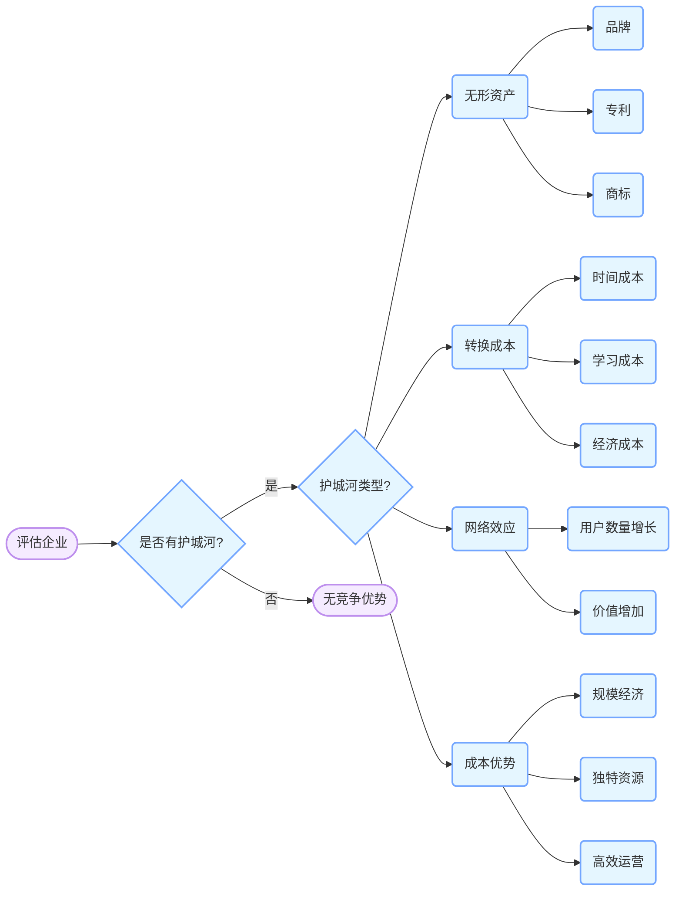

# 戴维·多德的护城河评估体系

> 关键词：戴维·多德、护城河评估体系、企业竞争优势、经济护城河、财务分析

> 摘要：本文深入探讨了戴维·多德的护城河评估体系。该体系对于投资者和企业管理者准确评估企业的竞争优势与可持续发展能力具有重要意义。文章首先介绍了该体系产生的背景，包括目的、预期读者等内容。接着详细阐述了护城河评估体系的核心概念及其联系，以清晰的文本示意图和 Mermaid 流程图呈现。然后通过 Python 源代码详细讲解了核心算法原理和具体操作步骤，运用数学模型和公式进行深入分析并举例说明。在项目实战部分，给出了开发环境搭建、源代码实现与解读等内容。同时探讨了该体系的实际应用场景，推荐了相关的学习资源、开发工具框架以及论文著作。最后总结了其未来发展趋势与挑战，提供了常见问题解答和扩展阅读参考资料，旨在帮助读者全面深入地理解和运用戴维·多德的护城河评估体系。

## 1. 背景介绍 
### 1.1 目的和范围
戴维·多德的护城河评估体系旨在帮助投资者、企业管理者等相关人员评估企业的竞争优势和可持续发展能力。该体系通过对企业多个维度的分析，确定企业是否拥有经济护城河以及护城河的宽度和深度，从而判断企业在长期竞争中能否保持领先地位并为股东创造价值。其范围涵盖了对企业的财务状况、商业模式、品牌影响力、技术实力、客户忠诚度等多个方面的评估。

### 1.2 预期读者
本文的预期读者包括投资者，他们可以利用该评估体系筛选出具有投资价值的企业，做出更明智的投资决策；企业管理者，能够通过该体系了解自身企业的竞争优势和劣势，制定针对性的战略以巩固和拓展护城河；金融分析师，可借助该体系进行企业研究和行业分析；以及对企业竞争战略和财务分析感兴趣的学者和爱好者。

### 1.3 文档结构概述
本文将按照以下结构展开：首先介绍护城河评估体系的背景信息，包括目的、预期读者等；接着阐述核心概念与联系，通过文本示意图和 Mermaid 流程图呈现体系的架构；然后讲解核心算法原理和具体操作步骤，并用 Python 代码实现；再介绍相关的数学模型和公式，并举例说明；之后通过项目实战展示代码的实际应用和详细解释；探讨该体系的实际应用场景；推荐相关的学习资源、开发工具框架和论文著作；总结未来发展趋势与挑战；提供常见问题解答和扩展阅读参考资料。

### 1.4 术语表
#### 1.4.1 核心术语定义
- **经济护城河**：指企业抵御竞争对手、保护其长期利润和市场份额的可持续竞争优势。具有经济护城河的企业能够在较长时间内保持高于行业平均水平的盈利能力。
- **护城河宽度**：反映企业竞争优势的相对大小，宽度越宽，企业抵御竞争的能力越强。
- **护城河深度**：体现企业竞争优势的可持续性，深度越深，企业的竞争优势越难以被竞争对手模仿和超越。

#### 1.4.2 相关概念解释
- **无形资产**：包括品牌、专利、商标等，是企业经济护城河的重要组成部分。例如，可口可乐的品牌价值使其在饮料市场具有强大的竞争优势。
- **转换成本**：指客户从使用一个企业的产品或服务转换到另一个企业时所面临的成本，包括时间成本、学习成本、经济成本等。高转换成本可以增加客户的忠诚度，形成企业的护城河。
- **网络效应**：指随着用户数量的增加，产品或服务的价值也随之增加的现象。例如，社交网络平台的用户越多，其对新用户的吸引力就越大，从而形成强大的竞争优势。

#### 1.4.3 缩略词列表
- **ROE**：Return on Equity，净资产收益率，反映企业运用自有资本的效率。
- **ROIC**：Return on Invested Capital，投入资本回报率，衡量企业运用所有投入资本获取收益的能力。

## 2. 核心概念与联系 
### 核心概念原理
戴维·多德的护城河评估体系基于这样一个原理：企业的价值不仅仅取决于其当前的财务表现，更重要的是其未来持续创造价值的能力。而经济护城河就是企业实现这一目标的关键因素。经济护城河可以分为多种类型，如无形资产、转换成本、网络效应、成本优势等。这些类型的护城河相互关联，共同构成了企业的竞争优势。

### 架构的文本示意图
```plaintext
经济护城河
|-- 无形资产
|   |-- 品牌
|   |-- 专利
|   |-- 商标
|-- 转换成本
|   |-- 时间成本
|   |-- 学习成本
|   |-- 经济成本
|-- 网络效应
|   |-- 用户数量增长
|   |-- 价值增加
|-- 成本优势
|   |-- 规模经济
|   |-- 独特资源
|   |-- 高效运营
```

### Mermaid 流程图


## 3. 核心算法原理 & 具体操作步骤 
### 核心算法原理
护城河评估体系的核心算法是综合考虑多个因素来评估企业的经济护城河。我们可以通过构建一个量化模型，将各个因素进行量化，并赋予相应的权重，最后计算出企业的护城河指数。

### 具体操作步骤
1. **确定评估因素**：包括无形资产、转换成本、网络效应、成本优势等。
2. **量化评估因素**：对每个评估因素进行量化，例如通过品牌价值评估品牌的无形资产，通过客户留存率评估转换成本等。
3. **确定权重**：根据各个评估因素的重要性，确定其在模型中的权重。
4. **计算护城河指数**：将量化后的评估因素乘以相应的权重，然后相加得到企业的护城河指数。

### Python 源代码实现
```python
# 定义评估因素及其权重
factors = {
    "无形资产": 0.3,
    "转换成本": 0.2,
    "网络效应": 0.2,
    "成本优势": 0.3
}

# 定义量化评估因素的函数
def quantify_intangible_assets(brand_value, patent_count):
    # 简单示例，实际中需要更复杂的评估方法
    return brand_value * 0.7 + patent_count * 0.3

def quantify_switching_costs(customer_retention_rate):
    return customer_retention_rate

def quantify_network_effects(user_growth_rate, user_value):
    return user_growth_rate * user_value

def quantify_cost_advantage(cost_ratio):
    return 1 - cost_ratio

# 计算护城河指数的函数
def calculate_moat_index(brand_value, patent_count, customer_retention_rate, user_growth_rate, user_value, cost_ratio):
    intangible_assets_score = quantify_intangible_assets(brand_value, patent_count)
    switching_costs_score = quantify_switching_costs(customer_retention_rate)
    network_effects_score = quantify_network_effects(user_growth_rate, user_value)
    cost_advantage_score = quantify_cost_advantage(cost_ratio)

    moat_index = (
        intangible_assets_score * factors["无形资产"] +
        switching_costs_score * factors["转换成本"] +
        network_effects_score * factors["网络效应"] +
        cost_advantage_score * factors["成本优势"]
    )
    return moat_index

# 示例数据
brand_value = 100
patent_count = 20
customer_retention_rate = 0.8
user_growth_rate = 0.1
user_value = 50
cost_ratio = 0.6

# 计算护城河指数
moat_index = calculate_moat_index(brand_value, patent_count, customer_retention_rate, user_growth_rate, user_value, cost_ratio)
print(f"企业的护城河指数为: {moat_index}")
```

## 4. 数学模型和公式 & 详细讲解 & 举例说明 
### 数学模型
设企业的护城河指数为 $M$，评估因素有 $n$ 个，分别为 $F_1, F_2, \cdots, F_n$，对应的权重为 $w_1, w_2, \cdots, w_n$，且 $\sum_{i = 1}^{n} w_i = 1$。每个评估因素的量化得分记为 $S_i$，则护城河指数的计算公式为：

$$M = \sum_{i = 1}^{n} w_i S_i$$

### 详细讲解
在这个数学模型中，我们首先将企业的竞争优势分解为多个评估因素，每个评估因素代表了企业经济护城河的一个方面。然后，通过量化方法得到每个评估因素的得分 $S_i$。权重 $w_i$ 反映了每个评估因素在整体评估中的重要性。最后，将每个评估因素的得分乘以其权重并求和，得到企业的护城河指数 $M$。

### 举例说明
以我们在 Python 代码中使用的示例数据为例，评估因素有 4 个，分别为无形资产、转换成本、网络效应和成本优势，对应的权重分别为 $w_1 = 0.3$，$w_2 = 0.2$，$w_3 = 0.2$，$w_4 = 0.3$。

- 无形资产得分 $S_1$：通过品牌价值和专利数量计算得到，$S_1 = 100 \times 0.7 + 20 \times 0.3 = 76$。
- 转换成本得分 $S_2$：客户留存率为 0.8，即 $S_2 = 0.8$。
- 网络效应得分 $S_3$：用户增长率为 0.1，用户价值为 50，$S_3 = 0.1 \times 50 = 5$。
- 成本优势得分 $S_4$：成本比率为 0.6，$S_4 = 1 - 0.6 = 0.4$。

将这些得分代入公式计算护城河指数：

$$M = 0.3 \times 76 + 0.2 \times 0.8 + 0.2 \times 5 + 0.3 \times 0.4 = 22.8 + 0.16 + 1 + 0.12 = 24.08$$

## 5. 项目实战：代码实际案例和详细解释说明 
### 5.1  开发环境搭建
1. **安装 Python**：从 Python 官方网站（https://www.python.org/downloads/）下载并安装 Python 3.x 版本。
2. **安装开发工具**：推荐使用 PyCharm 或 Visual Studio Code 作为开发工具。
3. **创建虚拟环境**：在命令行中使用以下命令创建虚拟环境：
```bash
python -m venv myenv
```
4. **激活虚拟环境**：
    - 在 Windows 上：
```bash
myenv\Scripts\activate
```
    - 在 Linux 或 macOS 上：
```bash
source myenv/bin/activate
```

### 5.2  源代码详细实现和代码解读
```python
# 定义评估因素及其权重
factors = {
    "无形资产": 0.3,
    "转换成本": 0.2,
    "网络效应": 0.2,
    "成本优势": 0.3
}

# 定义量化评估因素的函数
def quantify_intangible_assets(brand_value, patent_count):
    # 简单示例，实际中需要更复杂的评估方法
    return brand_value * 0.7 + patent_count * 0.3

def quantify_switching_costs(customer_retention_rate):
    return customer_retention_rate

def quantify_network_effects(user_growth_rate, user_value):
    return user_growth_rate * user_value

def quantify_cost_advantage(cost_ratio):
    return 1 - cost_ratio

# 计算护城河指数的函数
def calculate_moat_index(brand_value, patent_count, customer_retention_rate, user_growth_rate, user_value, cost_ratio):
    intangible_assets_score = quantify_intangible_assets(brand_value, patent_count)
    switching_costs_score = quantify_switching_costs(customer_retention_rate)
    network_effects_score = quantify_network_effects(user_growth_rate, user_value)
    cost_advantage_score = quantify_cost_advantage(cost_ratio)

    moat_index = (
        intangible_assets_score * factors["无形资产"] +
        switching_costs_score * factors["转换成本"] +
        network_effects_score * factors["网络效应"] +
        cost_advantage_score * factors["成本优势"]
    )
    return moat_index

# 示例数据
brand_value = 100
patent_count = 20
customer_retention_rate = 0.8
user_growth_rate = 0.1
user_value = 50
cost_ratio = 0.6

# 计算护城河指数
moat_index = calculate_moat_index(brand_value, patent_count, customer_retention_rate, user_growth_rate, user_value, cost_ratio)
print(f"企业的护城河指数为: {moat_index}")
```
### 代码解读与分析
1. **评估因素和权重**：`factors` 字典定义了评估因素及其对应的权重，这些权重反映了每个因素在评估企业护城河时的重要性。
2. **量化评估因素的函数**：
    - `quantify_intangible_assets`：通过品牌价值和专利数量计算无形资产得分，这里使用了简单的加权求和方法。
    - `quantify_switching_costs`：直接将客户留存率作为转换成本得分。
    - `quantify_network_effects`：通过用户增长率和用户价值的乘积计算网络效应得分。
    - `quantify_cost_advantage`：用 1 减去成本比率得到成本优势得分。
3. **计算护城河指数的函数**：`calculate_moat_index` 函数将各个评估因素的得分乘以相应的权重并求和，得到企业的护城河指数。
4. **示例数据和计算**：定义了示例数据，调用 `calculate_moat_index` 函数计算护城河指数，并将结果打印输出。

## 6. 实际应用场景 
### 投资决策
投资者可以使用戴维·多德的护城河评估体系来筛选具有投资价值的企业。具有较宽和较深护城河的企业通常能够在长期竞争中保持领先地位，为股东创造稳定的回报。投资者可以通过分析企业的经济护城河，判断其是否具有可持续的竞争优势，从而做出更明智的投资决策。

### 企业战略规划
企业管理者可以利用该体系了解自身企业的竞争优势和劣势，制定针对性的战略以巩固和拓展护城河。例如，如果企业发现自身的品牌优势较弱，可以加大品牌建设的投入；如果转换成本较低，可以通过优化产品或服务，提高客户的转换成本。

### 行业分析
金融分析师可以借助该体系进行行业分析，比较不同企业在行业中的竞争地位。通过对行业内企业的护城河评估，可以了解行业的竞争格局和发展趋势，为投资者和企业管理者提供参考。

## 7. 工具和资源推荐
### 7.1 学习资源推荐
#### 7.1.1 书籍推荐
- 《聪明的投资者》（The Intelligent Investor）：本杰明·格雷厄姆（Benjamin Graham）著，该书是价值投资领域的经典之作，对企业的估值和竞争优势进行了深入探讨，与护城河评估体系密切相关。
- 《巴菲特的护城河》（The Little Book That Builds Wealth）：帕特·多尔西（Pat Dorsey）著，详细介绍了经济护城河的概念和评估方法，是学习护城河评估体系的重要参考书籍。

#### 7.1.2 在线课程
- Coursera 上的“Financial Markets”：由耶鲁大学的罗伯特·席勒（Robert Shiller）教授授课，涵盖了金融市场的多个方面，包括企业估值和竞争分析。
- edX 上的“Valuation and Financial Analysis”：提供了关于企业估值和财务分析的系统学习内容，有助于深入理解护城河评估体系。

#### 7.1.3 技术博客和网站
- Seeking Alpha：一个提供金融分析和投资建议的网站，有很多关于企业竞争优势和护城河评估的文章。
- ValueWalk：专注于价值投资领域，分享了许多关于经济护城河和企业估值的研究成果。

### 7.2 开发工具框架推荐
#### 7.2.1 IDE和编辑器
- PyCharm：一款功能强大的 Python 集成开发环境，提供了代码编辑、调试、版本控制等一系列功能，适合开发与护城河评估体系相关的 Python 代码。
- Visual Studio Code：一款轻量级的代码编辑器，支持多种编程语言，通过安装相关插件可以方便地进行 Python 开发。

#### 7.2.2 调试和性能分析工具
- PDB：Python 自带的调试器，可以帮助开发者定位代码中的问题。
- cProfile：Python 的性能分析工具，可以分析代码的运行时间和函数调用情况，优化代码性能。

#### 7.2.3 相关框架和库
- Pandas：用于数据处理和分析的 Python 库，可以方便地处理企业的财务数据和其他相关数据。
- NumPy：提供了高效的数值计算功能，在量化评估因素和计算护城河指数时可以提高计算效率。

### 7.3 相关论文著作推荐
#### 7.3.1 经典论文
- “The Theory of Industrial Organization” by Jean Tirole：该论文对产业组织理论进行了深入研究，探讨了企业的竞争策略和市场结构，与护城河评估体系中的竞争优势分析密切相关。
- “The Competitive Advantage of Nations” by Michael Porter：迈克尔·波特（Michael Porter）的经典论文，提出了国家竞争优势理论，对企业的竞争优势和战略选择有重要的指导意义。

#### 7.3.2 最新研究成果
- 关注顶尖学术期刊如《Journal of Financial Economics》《The Review of Financial Studies》等，这些期刊经常发表关于企业估值、竞争优势和投资策略的最新研究成果。

#### 7.3.3 应用案例分析
- 一些咨询公司和研究机构会发布关于企业竞争优势和护城河评估的应用案例分析报告，可以通过相关机构的官方网站获取这些报告，了解实际应用中的经验和方法。

## 8. 总结：未来发展趋势与挑战
### 未来发展趋势
1. **数据驱动的评估**：随着大数据和人工智能技术的发展，护城河评估体系将越来越依赖于海量的数据和先进的分析方法。通过收集和分析更多的企业数据，如社交媒体数据、客户行为数据等，可以更准确地评估企业的竞争优势。
2. **跨学科融合**：护城河评估体系将与其他学科如管理学、心理学、社会学等进行更深入的融合。例如，通过心理学研究客户的认知和行为，更好地理解客户忠诚度和转换成本；通过社会学研究行业的社会网络和文化背景，评估企业的网络效应和品牌影响力。
3. **动态评估**：传统的护城河评估体系主要关注企业的静态竞争优势，未来将更加注重企业的动态发展能力。评估体系将考虑企业的创新能力、适应变化的能力等因素，以更全面地评估企业的长期竞争优势。

### 挑战
1. **数据质量和隐私问题**：数据驱动的评估需要大量高质量的数据，但数据的收集、整理和分析过程中可能会遇到数据质量不高、数据缺失等问题。同时，数据隐私和安全也是一个重要的挑战，需要在保证数据安全的前提下进行数据的分析和应用。
2. **评估方法的复杂性**：随着评估体系的不断发展和完善，评估方法将变得越来越复杂。如何在保证评估准确性的前提下，使评估方法更加简单易懂、易于操作，是一个需要解决的问题。
3. **竞争环境的快速变化**：在当今快速变化的市场环境中，企业的竞争优势可能会迅速消失。如何及时捕捉竞争环境的变化，调整评估体系和投资策略，是投资者和企业管理者面临的一个挑战。

## 9. 附录：常见问题与解答
### 问题 1：如何准确量化评估因素？
答：量化评估因素是一个复杂的过程，需要综合考虑多个方面的因素。对于一些可以直接获取数据的因素，如客户留存率、用户增长率等，可以直接使用数据进行量化。对于一些难以直接量化的因素，如品牌价值、专利价值等，需要使用专业的评估方法，如市场比较法、收益法等。同时，还可以参考行业标准和专家意见，提高量化的准确性。

### 问题 2：评估因素的权重如何确定？
答：评估因素的权重可以根据不同的行业和企业特点进行调整。一般来说，可以通过专家打分法、层次分析法等方法确定权重。在确定权重时，需要考虑各个评估因素对企业竞争优势的影响程度，以及数据的可获取性和可靠性。

### 问题 3：护城河评估体系适用于所有企业吗？
答：护城河评估体系适用于大多数企业，但不同行业和企业的特点可能会影响评估结果的准确性。例如，对于一些新兴行业的企业，由于其发展阶段和商业模式的特殊性，可能需要对评估体系进行适当的调整。同时，评估体系也不能完全预测企业的未来发展，还需要结合其他因素进行综合分析。

## 10. 扩展阅读 & 参考资料
### 扩展阅读
- 《竞争战略》（Competitive Strategy）：迈克尔·波特（Michael Porter）著，深入探讨了企业的竞争战略和竞争优势，与护城河评估体系有密切的联系。
- 《创新者的窘境》（The Innovator's Dilemma）：克莱顿·克里斯坦森（Clayton Christensen）著，研究了企业在创新过程中面临的挑战和机遇，对理解企业的动态竞争优势有重要的启示。

### 参考资料
- 戴维·多德（David Dodd）的相关著作和论文。
- 帕特·多尔西（Pat Dorsey）的研究报告和文章。
- 金融行业的相关研究报告和统计数据。