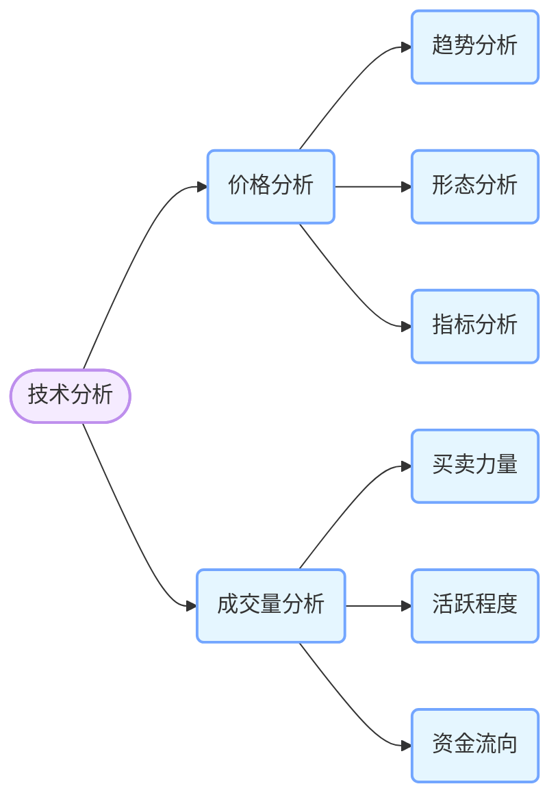

# 技术分析在高波动市场中的应用

> 关键词：技术分析、高波动市场、市场趋势、交易策略、风险控制、价格预测、技术指标

> 摘要：本文聚焦于技术分析在高波动市场中的应用。高波动市场充满机遇与挑战，技术分析作为一种重要的市场研究方法，能够帮助投资者更好地理解市场动态、把握趋势、制定交易策略以及控制风险。文章首先介绍了相关背景，包括目的、预期读者等；接着阐述了技术分析的核心概念与联系，通过文本示意图和 Mermaid 流程图展示其原理和架构；详细讲解了核心算法原理和具体操作步骤，并用 Python 源代码进行阐述；介绍了相关的数学模型和公式并举例说明；通过项目实战展示代码案例和详细解释；探讨了技术分析在高波动市场中的实际应用场景；推荐了学习资源、开发工具框架以及相关论文著作；最后总结了未来发展趋势与挑战，并提供常见问题解答和扩展阅读参考资料，旨在为投资者和研究者在高波动市场中运用技术分析提供全面而深入的指导。

## 1. 背景介绍 
### 1.1 目的和范围
技术分析在金融市场中一直扮演着重要角色，而高波动市场因其价格变化剧烈、不确定性高，对投资者的决策能力提出了更高要求。本文的目的在于深入探讨技术分析在高波动市场中的应用，详细分析如何运用各种技术分析工具和方法来识别市场趋势、制定有效的交易策略以及进行风险控制。范围涵盖股票市场、期货市场、外汇市场等各类高波动的金融市场，研究对象包括常见的技术分析指标、图表形态以及相关的交易策略。

### 1.2 预期读者
本文预期读者包括金融市场投资者，无论是个人投资者还是机构投资者，希望通过技术分析在高波动市场中获取收益、降低风险；金融分析师，需要深入理解市场动态，为客户提供专业的投资建议；金融专业学生和研究者，对技术分析和高波动市场感兴趣，希望通过本文了解相关理论和实践知识；以及对金融市场有一定了解，希望进一步提升自己投资决策能力的爱好者。

### 1.3 文档结构概述
本文将按照以下结构展开：首先介绍背景信息，包括目的、预期读者等；接着阐述技术分析的核心概念与联系，通过文本示意图和 Mermaid 流程图展示其原理和架构；详细讲解核心算法原理和具体操作步骤，并用 Python 源代码进行阐述；介绍相关的数学模型和公式并举例说明；通过项目实战展示代码案例和详细解释；探讨技术分析在高波动市场中的实际应用场景；推荐学习资源、开发工具框架以及相关论文著作；最后总结未来发展趋势与挑战，并提供常见问题解答和扩展阅读参考资料。

### 1.4 术语表
#### 1.4.1 核心术语定义
- **技术分析**：通过研究市场过去和现在的行为，如价格、成交量等数据，来预测市场未来走势的分析方法。
- **高波动市场**：市场价格在短时间内出现大幅涨跌的市场环境，通常伴随着较高的不确定性和风险。
- **市场趋势**：市场价格在一段时间内呈现出的上升、下降或盘整的方向。
- **交易策略**：投资者根据市场分析制定的买卖决策规则，旨在实现投资目标并控制风险。
- **风险控制**：采取一系列措施来降低投资过程中可能面临的风险，如止损、止盈等。

#### 1.4.2 相关概念解释
- **价格形态**：价格在图表上形成的特定形状，如头肩顶、双底等，这些形态可以提供市场趋势反转或延续的信号。
- **技术指标**：通过对市场数据进行计算和处理得到的数值，用于辅助分析市场趋势和判断买卖时机，如移动平均线、相对强弱指标（RSI）等。
- **成交量**：在一定时间内市场中买卖的证券数量，成交量的变化可以反映市场的活跃程度和投资者的参与热情。

#### 1.4.3 缩略词列表
- **MA**：移动平均线（Moving Average）
- **RSI**：相对强弱指标（Relative Strength Index）
- **MACD**：指数平滑异同移动平均线（Moving Average Convergence Divergence）

## 2. 核心概念与联系 
技术分析的核心概念主要包括价格、成交量、时间和空间。价格是市场参与者对资产价值的共识体现，成交量反映了市场的活跃程度和买卖力量的对比，时间则是市场趋势发展的维度，空间表示价格波动的幅度。这些概念相互联系、相互影响，共同构成了技术分析的基础。

### 文本示意图
```plaintext
              技术分析
             /         \
        价格分析        成交量分析
       /    |    \      /     |     \
趋势分析 形态分析 指标分析 买卖力量 活跃程度 资金流向
```

### Mermaid 流程图


在这个流程图中，技术分析作为起点，分为价格分析和成交量分析两个主要分支。价格分析进一步细分为趋势分析、形态分析和指标分析，成交量分析则包括买卖力量、活跃程度和资金流向的分析。这些分支相互关联，共同构成了技术分析的体系。

## 3. 核心算法原理 & 具体操作步骤 
### 移动平均线（MA）算法原理
移动平均线是一种常用的技术分析指标，它通过计算一定时间内的平均价格来平滑价格波动，从而更清晰地显示市场趋势。简单移动平均线（SMA）的计算公式为：

$$SMA_n = \frac{\sum_{i=0}^{n-1} P_{t-i}}{n}$$

其中，$SMA_n$ 表示 $n$ 期的简单移动平均线，$P_{t-i}$ 表示第 $t - i$ 期的价格，$n$ 表示计算的期数。

### Python 代码实现
```python
import pandas as pd

def simple_moving_average(data, window):
    """
    计算简单移动平均线
    :param data: 价格数据，pandas Series 类型
    :param window: 计算的期数
    :return: 简单移动平均线，pandas Series 类型
    """
    return data.rolling(window=window).mean()

# 示例数据
data = pd.Series([10, 12, 15, 13, 16, 18, 20, 19, 22, 25])
window = 3

# 计算简单移动平均线
sma = simple_moving_average(data, window)
print(sma)
```

### 具体操作步骤
1. **数据获取**：从金融数据提供商或交易平台获取相关资产的价格数据，通常以时间序列的形式存储。
2. **数据处理**：将获取的数据转换为适合计算的格式，如 pandas 的 Series 或 DataFrame 类型。
3. **计算移动平均线**：根据需要选择计算的期数，调用 `simple_moving_average` 函数计算移动平均线。
4. **分析结果**：观察移动平均线的走势，判断市场趋势。当短期移动平均线向上穿过长期移动平均线时，可能是买入信号；当短期移动平均线向下穿过长期移动平均线时，可能是卖出信号。

### 相对强弱指标（RSI）算法原理
相对强弱指标（RSI）是一种衡量市场买卖力量强弱的技术指标，其计算公式为：

$$RSI = 100 - \frac{100}{1 + RS}$$

其中，$RS$ 表示相对强度，计算公式为：

$$RS = \frac{\text{平均上涨幅度}}{\text{平均下跌幅度}}$$

### Python 代码实现
```python
import pandas as pd

def relative_strength_index(data, window=14):
    """
    计算相对强弱指标（RSI）
    :param data: 价格数据，pandas Series 类型
    :param window: 计算的期数，默认为 14
    :return: 相对强弱指标，pandas Series 类型
    """
    delta = data.diff()
    up = delta.clip(lower=0)
    down = -delta.clip(upper=0)
    avg_up = up.rolling(window=window).mean()
    avg_down = down.rolling(window=window).mean()
    rs = avg_up / avg_down
    rsi = 100 - (100 / (1 + rs))
    return rsi

# 示例数据
data = pd.Series([10, 12, 15, 13, 16, 18, 20, 19, 22, 25])
window = 14

# 计算相对强弱指标
rsi = relative_strength_index(data, window)
print(rsi)
```

### 具体操作步骤
1. **数据获取**：同移动平均线的操作，获取相关资产的价格数据。
2. **数据处理**：计算价格的差值，区分上涨和下跌幅度。
3. **计算 RSI**：根据公式计算平均上涨幅度、平均下跌幅度、相对强度和相对强弱指标。
4. **分析结果**：一般来说，当 RSI 超过 70 时，市场可能处于超买状态，有回调风险；当 RSI 低于 30 时，市场可能处于超卖状态，有反弹机会。

## 4. 数学模型和公式 & 详细讲解 & 举例说明 
### 移动平均线交叉模型
移动平均线交叉是一种常见的交易策略，其基本原理是根据短期移动平均线和长期移动平均线的交叉情况来判断买卖时机。当短期移动平均线向上穿过长期移动平均线时，形成金叉，通常被视为买入信号；当短期移动平均线向下穿过长期移动平均线时，形成死叉，通常被视为卖出信号。

设短期移动平均线为 $SMA_{short}$，长期移动平均线为 $SMA_{long}$，则金叉和死叉的判断条件可以表示为：

- **金叉条件**：$SMA_{short}(t) > SMA_{long}(t)$ 且 $SMA_{short}(t - 1) \leq SMA_{long}(t - 1)$
- **死叉条件**：$SMA_{short}(t) < SMA_{long}(t)$ 且 $SMA_{short}(t - 1) \geq SMA_{long}(t - 1)$

其中，$t$ 表示当前时间。

### 举例说明
假设我们有以下价格数据：
| 时间 | 价格 |
|------|------|
| 1    | 10   |
| 2    | 12   |
| 3    | 15   |
| 4    | 13   |
| 5    | 16   |
| 6    | 18   |
| 7    | 20   |
| 8    | 19   |
| 9    | 22   |
| 10   | 25   |

我们计算 3 期的短期移动平均线和 5 期的长期移动平均线：

| 时间 | 价格 | 3 期 SMA | 5 期 SMA |
|------|------|----------|----------|
| 1    | 10   | NaN      | NaN      |
| 2    | 12   | NaN      | NaN      |
| 3    | 15   | 12.33    | NaN      |
| 4    | 13   | 13.33    | NaN      |
| 5    | 16   | 14.67    | 13.2     |
| 6    | 18   | 15.67    | 14       |
| 7    | 20   | 18       | 16       |
| 8    | 19   | 19       | 17.2     |
| 9    | 22   | 20.33    | 18.8     |
| 10   | 25   | 22       | 20.8     |

在第 6 期，3 期 SMA（15.67）向上穿过 5 期 SMA（14），形成金叉，此时可以考虑买入；在后续的分析中，如果出现死叉情况，则可以考虑卖出。

### 布林带模型
布林带（Bollinger Bands）是由约翰·布林格（John Bollinger）发明的一种技术分析工具，它由中轨（通常是简单移动平均线）、上轨和下轨组成。上轨和下轨分别是中轨加上和减去一定倍数的标准差。

布林带的计算公式为：

- **中轨**：$MB = SMA_n$
- **上轨**：$UB = SMA_n + k \times \sigma$
- **下轨**：$LB = SMA_n - k \times \sigma$

其中，$MB$ 表示中轨，$UB$ 表示上轨，$LB$ 表示下轨，$SMA_n$ 表示 $n$ 期的简单移动平均线，$k$ 是一个常数，通常取值为 2，$\sigma$ 表示 $n$ 期价格的标准差。

### 举例说明
假设我们使用 20 期的简单移动平均线和 $k = 2$ 来计算布林带。对于上述价格数据，计算结果如下：

| 时间 | 价格 | 20 期 SMA | 标准差 | 上轨 | 下轨 |
|------|------|-----------|--------|------|------|
| 1    | 10   | NaN       | NaN    | NaN  | NaN  |
| 2    | 12   | NaN       | NaN    | NaN  | NaN  |
| ...  | ...  | ...       | ...    | ...  | ...  |
| 20   | ...  | ...       | ...    | ...  | ...  |

当价格触及上轨时，市场可能处于超买状态，有回调风险；当价格触及下轨时，市场可能处于超卖状态，有反弹机会。

## 5. 项目实战：代码实际案例和详细解释说明 
### 5.1  开发环境搭建
#### 安装 Python
首先需要安装 Python 环境，建议使用 Python 3.7 及以上版本。可以从 Python 官方网站（https://www.python.org/downloads/） 下载对应操作系统的安装包，按照安装向导进行安装。

#### 安装必要的库
在项目中，我们需要使用以下库：
- **pandas**：用于数据处理和分析。
- **numpy**：用于数值计算。
- **matplotlib**：用于数据可视化。

可以使用以下命令安装这些库：
```sh
pip install pandas numpy matplotlib
```

### 5.2  源代码详细实现和代码解读
以下是一个使用移动平均线交叉策略进行股票交易模拟的代码示例：

```python
import pandas as pd
import numpy as np
import matplotlib.pyplot as plt

# 读取股票数据
data = pd.read_csv('stock_data.csv')

# 计算短期和长期移动平均线
short_window = 5
long_window = 20
data['short_sma'] = data['Close'].rolling(window=short_window).mean()
data['long_sma'] = data['Close'].rolling(window=long_window).mean()

# 生成交易信号
data['signal'] = 0
data.loc[data['short_sma'] > data['long_sma'], 'signal'] = 1
data.loc[data['short_sma'] < data['long_sma'], 'signal'] = -1
data['position'] = data['signal'].diff()

# 可视化交易信号
plt.figure(figsize=(12, 6))
plt.plot(data['Close'], label='Close Price')
plt.plot(data['short_sma'], label='Short SMA')
plt.plot(data['long_sma'], label='Long SMA')

# 绘制买入和卖出信号
plt.plot(data[data['position'] == 1].index, data['short_sma'][data['position'] == 1], '^', markersize=10, color='g', label='Buy Signal')
plt.plot(data[data['position'] == -1].index, data['short_sma'][data['position'] == -1], 'v', markersize=10, color='r', label='Sell Signal')

plt.title('Moving Average Crossover Strategy')
plt.xlabel('Date')
plt.ylabel('Price')
plt.legend()
plt.show()

# 计算策略收益
initial_capital = float(100000.0)
positions = pd.DataFrame(index=data.index).fillna(0.0)
positions['Stock'] = data['signal']

portfolio = positions.multiply(data['Close'], axis=0)
pos_diff = positions.diff()

portfolio['holdings'] = (positions.multiply(data['Close'], axis=0)).sum(axis=1)
portfolio['cash'] = initial_capital - (pos_diff.multiply(data['Close'], axis=0)).sum(axis=1).cumsum()
portfolio['total'] = portfolio['cash'] + portfolio['holdings']
portfolio['returns'] = portfolio['total'].pct_change()

# 可视化策略收益
plt.figure(figsize=(12, 6))
plt.plot(portfolio['total'], label='Portfolio Value')
plt.title('Portfolio Value over Time')
plt.xlabel('Date')
plt.ylabel('Portfolio Value')
plt.legend()
plt.show()
```

### 代码解读与分析
1. **数据读取**：使用 `pd.read_csv` 函数读取股票数据文件 `stock_data.csv`，该文件应包含日期、收盘价等信息。
2. **移动平均线计算**：使用 `rolling` 方法计算短期（5 期）和长期（20 期）移动平均线，并将结果存储在 `short_sma` 和 `long_sma` 列中。
3. **交易信号生成**：根据短期和长期移动平均线的交叉情况生成交易信号，当短期移动平均线大于长期移动平均线时，信号为 1（买入）；当短期移动平均线小于长期移动平均线时，信号为 -1（卖出）。通过 `diff` 方法计算持仓变化。
4. **可视化交易信号**：使用 `matplotlib` 库绘制收盘价、短期和长期移动平均线，并标记买入和卖出信号。
5. **策略收益计算**：初始化初始资金，根据交易信号计算持仓和现金变化，进而计算投资组合的总价值和收益率。
6. **可视化策略收益**：绘制投资组合价值随时间的变化曲线。

通过这个项目实战，我们可以直观地看到移动平均线交叉策略在股票交易中的应用效果，以及如何通过代码实现和分析该策略。

## 6. 实际应用场景 
### 股票市场
在股票市场中，高波动往往伴随着市场的重大事件或消息。技术分析可以帮助投资者在这种环境下更好地把握机会和控制风险。例如，当股票价格在高波动市场中快速上涨时，通过观察技术指标如 RSI 是否超买，可以判断股价是否有回调风险，从而决定是否卖出股票；当股价快速下跌时，观察成交量和技术形态，判断是否有止跌企稳的迹象，寻找买入机会。此外，移动平均线交叉策略可以帮助投资者识别市场趋势的变化，及时调整投资组合。

### 期货市场
期货市场的高波动性更为明显，价格受到供需关系、宏观经济数据、政策变化等多种因素的影响。技术分析在期货市场中的应用可以帮助投资者制定交易策略，如通过布林带判断价格的波动范围，当价格触及上轨时考虑做空，触及下轨时考虑做多；利用成交量分析市场的活跃程度和资金流向，判断市场的买卖力量对比。同时，技术分析还可以帮助投资者设置止损和止盈点，控制交易风险。

### 外汇市场
外汇市场是全球最大的金融市场之一，其价格波动频繁且剧烈。技术分析在外汇市场中广泛应用，投资者可以通过分析货币对的价格走势、技术指标和图表形态来预测汇率的变化。例如，通过分析不同货币对的相对强弱指标，选择强势货币进行买入，弱势货币进行卖出；利用趋势线和通道线判断汇率的趋势和波动范围，制定相应的交易策略。此外，技术分析还可以帮助投资者在高波动的外汇市场中把握短期交易机会，提高交易效率。

## 7. 工具和资源推荐
### 7.1 学习资源推荐
#### 7.1.1 书籍推荐
- 《期货市场技术分析》（约翰·墨菲著）：这是一本技术分析的经典著作，全面介绍了技术分析的理论和方法，包括图表分析、技术指标、交易策略等内容，对于初学者和有一定经验的投资者都具有很高的参考价值。
- 《日本蜡烛图技术》（史蒂夫·尼森著）：详细介绍了日本蜡烛图的原理和应用，通过蜡烛图形态来分析市场趋势和买卖信号，是学习技术分析的重要书籍之一。
- 《金融市场技术分析》（约翰·墨菲著）：对技术分析的各个方面进行了深入探讨，包括市场行为、趋势分析、形态分析、技术指标等，是一本系统学习技术分析的权威教材。

#### 7.1.2 在线课程
- Coursera 上的“Financial Markets”：由耶鲁大学教授罗伯特·席勒（Robert Shiller）授课，介绍了金融市场的基本原理和投资策略，包括技术分析的相关内容。
- Udemy 上的“Technical Analysis for Beginners”：专门为初学者设计的技术分析课程，通过实际案例和操作演示，帮助学员快速掌握技术分析的基本方法和工具。
- 中国大学 MOOC 上的“金融市场与金融机构”：该课程涵盖了金融市场的各个方面，包括技术分析在金融市场中的应用，适合金融专业学生和投资者学习。

#### 7.1.3 技术博客和网站
- 雪球网（https://xueqiu.com/）：国内知名的财经社区，提供股票、基金、期货等金融产品的行情数据和分析文章，用户可以在上面交流投资经验和技术分析方法。
- 东方财富网（https://www.eastmoney.com/）：提供全面的金融信息和行情数据，包括技术分析工具和指标，还有专业的分析师发表的市场分析文章。
- Investopedia（https://www.investopedia.com/）：国际知名的金融教育网站，提供丰富的金融知识和技术分析教程，是学习技术分析的重要资源之一。

### 7.2 开发工具框架推荐
#### 7.2.1 IDE和编辑器
- PyCharm：一款专业的 Python 集成开发环境，具有强大的代码编辑、调试和分析功能，适合开发和调试技术分析相关的 Python 代码。
- Jupyter Notebook：一个交互式的开发环境，支持 Python、R 等多种编程语言，适合进行数据探索、分析和可视化，在技术分析的研究和实践中非常实用。
- Visual Studio Code：一款轻量级的代码编辑器，支持多种编程语言和插件扩展，具有丰富的代码编辑和调试功能，可用于开发技术分析相关的代码。

#### 7.2.2 调试和性能分析工具
- PDB：Python 内置的调试器，可以帮助开发者逐行调试代码，查找和解决代码中的问题。
- cProfile：Python 标准库中的性能分析工具，可以分析代码的运行时间和函数调用次数，帮助开发者优化代码性能。
- Py-Spy：一个跨平台的 Python 性能分析工具，可以实时分析 Python 程序的性能瓶颈，提供可视化的性能分析报告。

#### 7.2.3 相关框架和库
- Pandas：用于数据处理和分析的 Python 库，提供了高效的数据结构和数据操作方法，在技术分析中常用于处理和分析金融数据。
- Numpy：用于数值计算的 Python 库，提供了高性能的数组和矩阵运算功能，在技术分析中常用于计算技术指标和进行数值模拟。
- Matplotlib：用于数据可视化的 Python 库，提供了丰富的绘图功能，可用于绘制价格走势图、技术指标图等，帮助投资者直观地分析市场数据。

### 7.3 相关论文著作推荐
#### 7.3.1 经典论文
- “The Efficient Market Hypothesis and Its Critics”（Eugene F. Fama 著）：该论文对有效市场假说进行了深入探讨，分析了市场效率与技术分析的关系，是金融市场理论研究的经典之作。
- “Technical Analysis in the Foreign Exchange Market: A Survey of US Practices”（Cheung and Chinn 著）：对技术分析在外汇市场中的应用进行了调查和研究，分析了技术分析在外汇交易中的作用和有效性。
- “The Profitability of Technical Analysis in the Stock Market: Evidence from China”（Liu et al. 著）：研究了技术分析在中国股票市场中的盈利能力，通过实证分析验证了技术分析在高波动市场中的应用价值。

#### 7.3.2 最新研究成果
- 近年来，随着人工智能和机器学习技术的发展，越来越多的研究将这些技术应用于技术分析中。例如，使用深度学习模型预测股票价格走势，通过强化学习优化交易策略等。相关研究成果可以在学术数据库如 IEEE Xplore、ACM Digital Library 等上查找。

#### 7.3.3 应用案例分析
- 一些金融机构和研究机构会发布技术分析在实际市场中的应用案例，这些案例可以帮助投资者更好地理解技术分析的实际应用效果和操作方法。例如，高盛、摩根大通等金融机构的研究报告，以及一些专业的金融研究机构发布的市场分析报告。

## 8. 总结：未来发展趋势与挑战
### 未来发展趋势
- **与人工智能和机器学习的融合**：随着人工智能和机器学习技术的不断发展，技术分析将越来越多地与这些技术相结合。例如，使用深度学习模型对大量的市场数据进行分析和预测，挖掘市场中的潜在规律和趋势；利用强化学习优化交易策略，提高交易的盈利能力和效率。
- **多维度数据的应用**：除了传统的价格和成交量数据外，未来技术分析将更多地应用多维度数据，如社交媒体数据、新闻资讯、宏观经济数据等。通过综合分析这些数据，可以更全面地了解市场动态和投资者情绪，提高技术分析的准确性和可靠性。
- **个性化和定制化服务**：随着投资者需求的多样化，技术分析将向个性化和定制化方向发展。金融机构和技术分析软件提供商将根据投资者的风险偏好、投资目标和交易习惯，为其提供个性化的技术分析工具和交易策略，满足不同投资者的需求。

### 挑战
- **数据质量和可靠性**：技术分析依赖于大量的市场数据，数据的质量和可靠性直接影响分析结果的准确性。在高波动市场中，数据的噪音和异常值可能会增加，如何有效地处理和清洗数据，提高数据的质量和可靠性，是技术分析面临的一个重要挑战。
- **市场的复杂性和不确定性**：高波动市场的复杂性和不确定性增加了技术分析的难度。市场受到多种因素的影响，包括宏观经济、政策变化、突发事件等，这些因素的相互作用使得市场走势难以准确预测。技术分析需要不断适应市场的变化，提高对市场复杂性和不确定性的应对能力。
- **模型的过拟合和泛化能力**：在使用人工智能和机器学习模型进行技术分析时，模型的过拟合和泛化能力是一个关键问题。如果模型过于复杂，可能会导致过拟合，在训练数据上表现良好，但在实际应用中效果不佳；如果模型过于简单，可能无法捕捉到市场的复杂特征，泛化能力较差。如何选择合适的模型结构和参数，提高模型的泛化能力，是技术分析面临的一个挑战。

## 9. 附录：常见问题与解答
### 技术分析在高波动市场中一定有效吗？
技术分析不是一种绝对准确的预测方法，在高波动市场中也存在一定的局限性。高波动市场的不确定性较大，市场走势可能受到多种突发因素的影响，技术分析可能无法及时反映这些变化。然而，技术分析可以帮助投资者更好地理解市场动态，提供一些参考依据和交易信号，在一定程度上提高投资决策的准确性和成功率。

### 如何选择合适的技术分析指标？
选择合适的技术分析指标需要考虑多个因素，包括市场特点、投资目标、交易周期等。不同的技术指标适用于不同的市场环境和投资策略。例如，移动平均线适用于判断市场趋势，相对强弱指标适用于判断市场的买卖力量强弱。投资者可以根据自己的需求和经验，选择适合自己的技术分析指标，并结合多种指标进行综合分析。

### 技术分析和基本面分析有什么区别？
技术分析主要通过研究市场的历史数据，如价格、成交量等，来预测市场未来走势；而基本面分析则主要关注公司的财务状况、行业前景、宏观经济等因素，通过分析这些因素来评估资产的内在价值。技术分析更侧重于市场的短期走势和交易机会，而基本面分析更侧重于资产的长期投资价值。在实际应用中，投资者可以将技术分析和基本面分析相结合，以提高投资决策的准确性。

### 如何控制技术分析中的风险？
控制技术分析中的风险可以采取以下措施：
- **设置止损和止盈点**：在交易前根据技术分析确定止损和止盈点，当价格达到止损或止盈点时，及时平仓，控制风险和锁定收益。
- **分散投资**：不要将所有资金集中投资于某一种资产，通过分散投资不同的资产和市场，降低单一资产的风险。
- **合理使用杠杆**：在使用杠杆交易时，要谨慎控制杠杆比例，避免因杠杆过高而导致巨大的损失。
- **不断学习和实践**：技术分析是一个不断学习和实践的过程，投资者要不断学习新的技术分析方法和理论，积累实践经验，提高自己的分析能力和风险控制能力。

## 10. 扩展阅读 & 参考资料
### 扩展阅读
- 《聪明的投资者》（本杰明·格雷厄姆著）：介绍了价值投资的理念和方法，与技术分析相互补充，可以帮助投资者更全面地理解投资决策。
- 《金融炼金术》（乔治·索罗斯著）：作者分享了自己的投资经验和哲学，对市场的复杂性和不确定性有深刻的见解，对技术分析的应用有一定的启示作用。
- 《海龟交易法则》（柯蒂斯·费思著）：讲述了一群交易员如何通过一套交易系统在市场中取得成功，其中涉及到技术分析和交易策略的应用，值得投资者学习和借鉴。

### 参考资料
- 金融数据提供商的官方网站，如雅虎财经（https://finance.yahoo.com/）、新浪财经（https://finance.sina.com.cn/）等，获取金融市场的历史数据和实时行情。
- 学术数据库，如 IEEE Xplore、ACM Digital Library、中国知网等，查找相关的学术论文和研究成果。
- 金融机构和研究机构的研究报告，如高盛、摩根大通、中信证券等发布的市场分析报告，获取专业的市场分析和投资建议。