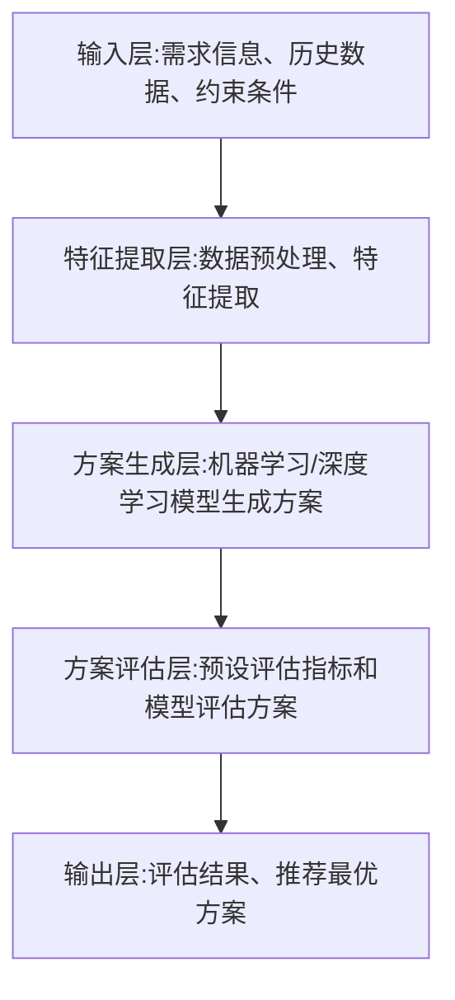

# 技术创新的AI驱动：方案生成评估

> 关键词：技术创新、AI驱动、方案生成、方案评估、人工智能、创新方案、技术方案

> 摘要：本文聚焦于技术创新中AI驱动的方案生成与评估这一重要课题。随着人工智能技术的飞速发展，其在推动技术创新方面展现出巨大潜力。文章详细阐述了相关核心概念及联系，深入剖析核心算法原理，通过数学模型和公式进行理论支撑，并结合实际项目案例展示具体实现过程。同时探讨了该技术的实际应用场景，推荐了学习和开发所需的工具与资源，最后对未来发展趋势与挑战进行总结，旨在为读者全面呈现技术创新中AI驱动的方案生成评估的全貌，为相关领域的研究和实践提供有价值的参考。

## 1. 背景介绍 
### 1.1 目的和范围
在当今快速发展的科技时代，技术创新对于企业和社会的发展至关重要。人工智能作为一项具有变革性的技术，为技术创新带来了新的机遇和挑战。本文章的目的在于深入探讨如何利用AI驱动技术创新中的方案生成与评估过程。范围涵盖了从核心概念的介绍、算法原理的分析、数学模型的建立，到实际项目案例的实现，以及该技术在不同领域的应用场景等多个方面，旨在全面且系统地阐述这一主题。

### 1.2 预期读者
本文预期读者包括但不限于人工智能领域的研究人员、软件开发者、技术创新相关的企业管理人员、对技术创新和人工智能应用感兴趣的学者和爱好者。对于正在从事或希望了解如何利用AI推动技术创新方案生成与评估的人群具有重要的参考价值。

### 1.3 文档结构概述
本文将按照以下结构展开：首先介绍背景信息，包括目的、预期读者和文档结构概述等内容；接着阐述核心概念与联系，通过文本示意图和Mermaid流程图展示相关原理和架构；然后深入分析核心算法原理并给出具体操作步骤，同时使用Python源代码进行详细阐述；之后介绍数学模型和公式，并结合具体例子进行说明；再通过项目实战展示代码实际案例并进行详细解释；探讨实际应用场景；推荐学习和开发所需的工具和资源；最后总结未来发展趋势与挑战，提供常见问题与解答以及扩展阅读和参考资料。

### 1.4 术语表
#### 1.4.1 核心术语定义
- **技术创新**：指在技术领域中引入新的思想、方法、产品或服务，以提高生产效率、降低成本、满足市场需求等，推动技术和产业的发展。
- **AI驱动**：指利用人工智能技术的能力和特点，如机器学习、深度学习、自然语言处理等，来推动某个过程或任务的进行。
- **方案生成**：根据特定的需求和目标，通过一定的方法和算法生成一系列可能的解决方案的过程。
- **方案评估**：对生成的方案进行分析和评价，以确定其可行性、有效性、优劣程度等，为选择最佳方案提供依据。

#### 1.4.2 相关概念解释
- **机器学习**：是一门多领域交叉学科，涉及概率论、统计学、逼近论、凸分析、算法复杂度理论等多门学科。它专门研究计算机怎样模拟或实现人类的学习行为，以获取新的知识或技能，重新组织已有的知识结构使之不断改善自身的性能。
- **深度学习**：是机器学习的一个分支领域，它是一种基于对数据进行表征学习的方法。深度学习通过构建具有很多层的神经网络模型，自动从大量数据中学习到复杂的模式和特征。
- **自然语言处理**：是计算机科学、人工智能和语言学的交叉领域，旨在让计算机能够理解、处理和生成人类语言，包括文本分类、机器翻译、情感分析等多种任务。

#### 1.4.3 缩略词列表
- **AI**：Artificial Intelligence，人工智能
- **ML**：Machine Learning，机器学习
- **DL**：Deep Learning，深度学习
- **NLP**：Natural Language Processing，自然语言处理

## 2. 核心概念与联系 
### 核心概念原理
技术创新的AI驱动的方案生成与评估主要涉及到利用人工智能技术来辅助技术创新过程中的方案生成和对生成方案的评估。在方案生成阶段，人工智能可以通过对大量历史数据的学习，挖掘其中的模式和规律，结合当前的需求和约束条件，生成多种可能的创新方案。例如，在产品设计领域，AI可以根据市场需求、用户反馈、材料特性等信息，生成不同的产品设计方案。

在方案评估阶段，AI可以利用各种评估指标和模型，对生成的方案进行量化评估。这些评估指标可以包括技术可行性、经济可行性、环境影响等多个方面。通过对这些指标的综合分析，AI可以为每个方案给出一个评估得分，帮助决策者选择最优方案。

### 架构的文本示意图
以下是技术创新的AI驱动的方案生成与评估的架构示意图：

输入层：包括需求信息、历史数据、约束条件等。需求信息描述了技术创新的目标和要求，历史数据包含了以往类似项目的相关信息，约束条件则限定了方案的可行范围。

特征提取层：对输入的数据进行预处理和特征提取，将原始数据转换为适合AI模型处理的特征向量。例如，对于文本数据，可以使用词向量表示方法将文本转换为数值向量。

方案生成层：利用机器学习或深度学习模型，根据提取的特征生成多种可能的方案。这些模型可以是生成对抗网络（GAN）、变分自编码器（VAE）等。

方案评估层：根据预设的评估指标和模型，对生成的方案进行评估。评估指标可以包括技术可行性、经济可行性、环境影响等，评估模型可以是决策树、支持向量机等。

输出层：输出评估结果和推荐的最优方案。

### Mermaid流程图


## 3. 核心算法原理 & 具体操作步骤 
### 核心算法原理
在方案生成阶段，我们可以使用生成对抗网络（GAN）作为核心算法。GAN由生成器（Generator）和判别器（Discriminator）组成。生成器的任务是根据输入的随机噪声生成假的样本，而判别器的任务是区分输入的样本是真实的还是生成的。通过不断的对抗训练，生成器可以学习到真实数据的分布，从而生成高质量的样本。

在方案评估阶段，我们可以使用决策树算法。决策树是一种基于树结构进行决策的算法，它通过对特征的划分，将样本空间划分为不同的区域，每个区域对应一个决策结果。决策树算法可以根据预设的评估指标，对生成的方案进行分类和评估。

### 具体操作步骤
#### 方案生成步骤
1. 收集和整理历史数据，包括需求信息、已有的创新方案等。
2. 对历史数据进行预处理，包括数据清洗、特征提取等。
3. 构建生成对抗网络（GAN）模型，包括生成器和判别器。
4. 对GAN模型进行训练，通过不断的对抗训练，使生成器能够生成高质量的方案。
5. 输入随机噪声，使用训练好的生成器生成新的方案。

#### 方案评估步骤
1. 定义评估指标，如技术可行性、经济可行性、环境影响等。
2. 对生成的方案进行特征提取，将方案转换为适合决策树处理的特征向量。
3. 构建决策树模型，根据历史数据和评估指标进行训练。
4. 使用训练好的决策树模型对生成的方案进行评估，得到每个方案的评估得分。

### Python源代码详细阐述
以下是一个简单的Python代码示例，演示了如何使用GAN进行方案生成和决策树进行方案评估：

```python
import numpy as np
from sklearn.tree import DecisionTreeClassifier
import tensorflow as tf
from tensorflow.keras import layers

# 生成对抗网络（GAN）的生成器
def make_generator_model():
    model = tf.keras.Sequential()
    model.add(layers.Dense(256, input_shape=(100,), use_bias=False))
    model.add(layers.BatchNormalization())
    model.add(layers.LeakyReLU())

    model.add(layers.Dense(512, use_bias=False))
    model.add(layers.BatchNormalization())
    model.add(layers.LeakyReLU())

    model.add(layers.Dense(784, use_bias=False, activation='tanh'))
    return model

# 生成对抗网络（GAN）的判别器
def make_discriminator_model():
    model = tf.keras.Sequential()
    model.add(layers.Dense(512, input_shape=(784,), use_bias=False))
    model.add(layers.LeakyReLU())

    model.add(layers.Dense(256, use_bias=False))
    model.add(layers.LeakyReLU())

    model.add(layers.Dense(1))
    return model

# 训练GAN模型
def train_gan(generator, discriminator, dataset, epochs):
    cross_entropy = tf.keras.losses.BinaryCrossentropy(from_logits=True)

    def discriminator_loss(real_output, fake_output):
        real_loss = cross_entropy(tf.ones_like(real_output), real_output)
        fake_loss = cross_entropy(tf.zeros_like(fake_output), fake_output)
        total_loss = real_loss + fake_loss
        return total_loss

    def generator_loss(fake_output):
        return cross_entropy(tf.ones_like(fake_output), fake_output)

    generator_optimizer = tf.keras.optimizers.Adam(1e-4)
    discriminator_optimizer = tf.keras.optimizers.Adam(1e-4)

    for epoch in range(epochs):
        for image_batch in dataset:
            noise = tf.random.normal([BATCH_SIZE, 100])

            with tf.GradientTape() as gen_tape, tf.GradientTape() as disc_tape:
                generated_images = generator(noise, training=True)

                real_output = discriminator(image_batch, training=True)
                fake_output = discriminator(generated_images, training=True)

                gen_loss = generator_loss(fake_output)
                disc_loss = discriminator_loss(real_output, fake_output)

            gradients_of_generator = gen_tape.gradient(gen_loss, generator.trainable_variables)
            gradients_of_discriminator = disc_tape.gradient(disc_loss, discriminator.trainable_variables)

            generator_optimizer.apply_gradients(zip(gradients_of_generator, generator.trainable_variables))
            discriminator_optimizer.apply_gradients(zip(gradients_of_discriminator, discriminator.trainable_variables))

# 生成方案
def generate_schemes(generator, num_schemes):
    noise = tf.random.normal([num_schemes, 100])
    schemes = generator(noise, training=False)
    return schemes

# 方案评估（使用决策树）
def evaluate_schemes(schemes, labels):
    clf = DecisionTreeClassifier()
    clf.fit(schemes, labels)
    return clf

# 示例数据
BATCH_SIZE = 32
EPOCHS = 50
# 这里假设我们有一些示例数据
dataset = np.random.randn(1000, 784)
dataset = tf.data.Dataset.from_tensor_slices(dataset).shuffle(1000).batch(BATCH_SIZE)

# 创建生成器和判别器
generator = make_generator_model()
discriminator = make_discriminator_model()

# 训练GAN模型
train_gan(generator, discriminator, dataset, EPOCHS)

# 生成方案
num_schemes = 10
schemes = generate_schemes(generator, num_schemes)

# 示例标签
labels = np.random.randint(0, 2, num_schemes)

# 方案评估
model = evaluate_schemes(schemes, labels)
```

## 4. 数学模型和公式 & 详细讲解 & 举例说明 
### 生成对抗网络（GAN）的数学模型和公式
#### 目标函数
生成对抗网络（GAN）的目标是通过生成器 $G$ 和判别器 $D$ 的对抗训练，使生成器能够生成与真实数据分布相似的样本。GAN的目标函数可以表示为：

$$
\min_G \max_D V(D, G) = \mathbb{E}_{x \sim p_{data}(x)}[\log D(x)] + \mathbb{E}_{z \sim p_z(z)}[\log(1 - D(G(z)))]
$$

其中，$p_{data}(x)$ 是真实数据的分布，$p_z(z)$ 是噪声的分布，$x$ 是真实数据样本，$z$ 是噪声样本，$G(z)$ 是生成器根据噪声 $z$ 生成的样本，$D(x)$ 是判别器对真实样本 $x$ 的判别结果，$D(G(z))$ 是判别器对生成样本 $G(z)$ 的判别结果。

#### 详细讲解
判别器的目标是最大化 $V(D, G)$，即尽可能准确地区分真实样本和生成样本。对于真实样本 $x$，判别器希望 $D(x)$ 接近 1；对于生成样本 $G(z)$，判别器希望 $D(G(z))$ 接近 0。

生成器的目标是最小化 $V(D, G)$，即尽可能生成能够欺骗判别器的样本。生成器希望 $D(G(z))$ 接近 1。

通过不断的对抗训练，生成器和判别器的性能都会不断提高，最终生成器能够生成与真实数据分布相似的样本。

#### 举例说明
假设我们有一个简单的一维真实数据分布 $p_{data}(x)$ 是均值为 0，标准差为 1 的高斯分布。噪声分布 $p_z(z)$ 是均值为 0，标准差为 1 的高斯分布。生成器 $G$ 是一个简单的线性函数 $G(z) = az + b$，判别器 $D$ 是一个简单的线性函数 $D(x) = cx + d$。

在训练过程中，判别器会不断调整参数 $c$ 和 $d$，使得对于真实样本 $x$，$D(x)$ 接近 1，对于生成样本 $G(z)$，$D(G(z))$ 接近 0。生成器会不断调整参数 $a$ 和 $b$，使得生成的样本 $G(z)$ 能够欺骗判别器，即 $D(G(z))$ 接近 1。

### 决策树的数学模型和公式
#### 信息增益
决策树的构建过程中，常用的划分准则是信息增益。信息增益是指在划分数据集前后信息熵的变化量。信息熵是对数据集中不确定性的度量，信息熵越大，数据集中的不确定性越大。

信息熵的计算公式为：

$$
H(S) = -\sum_{i=1}^{n} p_i \log_2 p_i
$$

其中，$S$ 是数据集，$p_i$ 是数据集中第 $i$ 类样本的比例，$n$ 是数据集的类别数。

信息增益的计算公式为：

$$
IG(S, A) = H(S) - \sum_{v \in Values(A)} \frac{|S_v|}{|S|} H(S_v)
$$

其中，$S$ 是数据集，$A$ 是划分属性，$Values(A)$ 是属性 $A$ 的取值集合，$S_v$ 是属性 $A$ 取值为 $v$ 的样本子集，$|S|$ 是数据集 $S$ 的样本数，$|S_v|$ 是样本子集 $S_v$ 的样本数。

#### 详细讲解
在决策树的构建过程中，我们会选择信息增益最大的属性作为当前节点的划分属性。通过不断地划分数据集，直到满足停止条件（如所有样本属于同一类、没有更多属性可供划分等），最终构建出决策树。

#### 举例说明
假设我们有一个数据集 $S$，包含 10 个样本，分为两类：正类和负类。其中正类样本有 6 个，负类样本有 4 个。则数据集 $S$ 的信息熵为：

$$
H(S) = -\frac{6}{10} \log_2 \frac{6}{10} - \frac{4}{10} \log_2 \frac{4}{10} \approx 0.971
$$

假设我们有一个属性 $A$，取值为 $a_1$ 和 $a_2$。其中属性 $A$ 取值为 $a_1$ 的样本有 4 个，正类样本有 3 个，负类样本有 1 个；属性 $A$ 取值为 $a_2$ 的样本有 6 个，正类样本有 3 个，负类样本有 3 个。则属性 $A$ 取值为 $a_1$ 的样本子集 $S_{a_1}$ 的信息熵为：

$$
H(S_{a_1}) = -\frac{3}{4} \log_2 \frac{3}{4} - \frac{1}{4} \log_2 \frac{1}{4} \approx 0.811
$$

属性 $A$ 取值为 $a_2$ 的样本子集 $S_{a_2}$ 的信息熵为：

$$
H(S_{a_2}) = -\frac{3}{6} \log_2 \frac{3}{6} - \frac{3}{6} \log_2 \frac{3}{6} = 1
$$

则属性 $A$ 的信息增益为：

$$
IG(S, A) = H(S) - \frac{4}{10} H(S_{a_1}) - \frac{6}{10} H(S_{a_2}) \approx 0.971 - \frac{4}{10} \times 0.811 - \frac{6}{10} \times 1 \approx 0.127
$$

## 5. 项目实战：代码实际案例和详细解释说明 
### 5.1  开发环境搭建
#### 安装Python
首先，我们需要安装Python。可以从Python官方网站（https://www.python.org/downloads/） 下载适合你操作系统的Python版本。建议安装Python 3.7及以上版本。

#### 安装依赖库
在安装好Python后，我们需要安装一些必要的依赖库，如TensorFlow、NumPy、Scikit-learn等。可以使用以下命令进行安装：

```sh
pip install tensorflow numpy scikit-learn
```

### 5.2  源代码详细实现和代码解读
以下是一个完整的项目实战代码示例，包括方案生成和方案评估的实现：

```python
import numpy as np
from sklearn.tree import DecisionTreeClassifier
import tensorflow as tf
from tensorflow.keras import layers

# 生成对抗网络（GAN）的生成器
def make_generator_model():
    model = tf.keras.Sequential()
    model.add(layers.Dense(256, input_shape=(100,), use_bias=False))
    model.add(layers.BatchNormalization())
    model.add(layers.LeakyReLU())

    model.add(layers.Dense(512, use_bias=False))
    model.add(layers.BatchNormalization())
    model.add(layers.LeakyReLU())

    model.add(layers.Dense(784, use_bias=False, activation='tanh'))
    return model

# 生成对抗网络（GAN）的判别器
def make_discriminator_model():
    model = tf.keras.Sequential()
    model.add(layers.Dense(512, input_shape=(784,), use_bias=False))
    model.add(layers.LeakyReLU())

    model.add(layers.Dense(256, use_bias=False))
    model.add(layers.LeakyReLU())

    model.add(layers.Dense(1))
    return model

# 训练GAN模型
def train_gan(generator, discriminator, dataset, epochs):
    cross_entropy = tf.keras.losses.BinaryCrossentropy(from_logits=True)

    def discriminator_loss(real_output, fake_output):
        real_loss = cross_entropy(tf.ones_like(real_output), real_output)
        fake_loss = cross_entropy(tf.zeros_like(fake_output), fake_output)
        total_loss = real_loss + fake_loss
        return total_loss

    def generator_loss(fake_output):
        return cross_entropy(tf.ones_like(fake_output), fake_output)

    generator_optimizer = tf.keras.optimizers.Adam(1e-4)
    discriminator_optimizer = tf.keras.optimizers.Adam(1e-4)

    for epoch in range(epochs):
        for image_batch in dataset:
            noise = tf.random.normal([BATCH_SIZE, 100])

            with tf.GradientTape() as gen_tape, tf.GradientTape() as disc_tape:
                generated_images = generator(noise, training=True)

                real_output = discriminator(image_batch, training=True)
                fake_output = discriminator(generated_images, training=True)

                gen_loss = generator_loss(fake_output)
                disc_loss = discriminator_loss(real_output, fake_output)

            gradients_of_generator = gen_tape.gradient(gen_loss, generator.trainable_variables)
            gradients_of_discriminator = disc_tape.gradient(disc_loss, discriminator.trainable_variables)

            generator_optimizer.apply_gradients(zip(gradients_of_generator, generator.trainable_variables))
            discriminator_optimizer.apply_gradients(zip(gradients_of_discriminator, discriminator.trainable_variables))

# 生成方案
def generate_schemes(generator, num_schemes):
    noise = tf.random.normal([num_schemes, 100])
    schemes = generator(noise, training=False)
    return schemes

# 方案评估（使用决策树）
def evaluate_schemes(schemes, labels):
    clf = DecisionTreeClassifier()
    clf.fit(schemes, labels)
    return clf

# 示例数据
BATCH_SIZE = 32
EPOCHS = 50
# 这里假设我们有一些示例数据
dataset = np.random.randn(1000, 784)
dataset = tf.data.Dataset.from_tensor_slices(dataset).shuffle(1000).batch(BATCH_SIZE)

# 创建生成器和判别器
generator = make_generator_model()
discriminator = make_discriminator_model()

# 训练GAN模型
train_gan(generator, discriminator, dataset, EPOCHS)

# 生成方案
num_schemes = 10
schemes = generate_schemes(generator, num_schemes)

# 示例标签
labels = np.random.randint(0, 2, num_schemes)

# 方案评估
model = evaluate_schemes(schemes, labels)

# 预测新方案
new_schemes = np.random.randn(5, 784)
predictions = model.predict(new_schemes)
print("预测结果:", predictions)
```

### 5.3  代码解读与分析
#### 生成器和判别器的构建
`make_generator_model` 函数用于构建生成对抗网络（GAN）的生成器。生成器是一个多层感知机（MLP），包含三个全连接层，使用了批归一化（BatchNormalization）和LeakyReLU激活函数。最后一层使用 `tanh` 激活函数，将生成的样本值映射到 $[-1, 1]$ 范围内。

`make_discriminator_model` 函数用于构建GAN的判别器。判别器也是一个多层感知机，包含三个全连接层，使用了LeakyReLU激活函数。最后一层输出一个标量，表示样本是真实样本的概率。

#### GAN模型的训练
`train_gan` 函数用于训练GAN模型。在训练过程中，我们使用交叉熵损失函数来计算判别器和生成器的损失。判别器的目标是最大化真实样本的判别概率和最小化生成样本的判别概率，生成器的目标是最大化生成样本的判别概率。通过不断的对抗训练，生成器和判别器的性能都会不断提高。

#### 方案生成
`generate_schemes` 函数用于生成方案。通过输入随机噪声，使用训练好的生成器生成新的方案。

#### 方案评估
`evaluate_schemes` 函数用于方案评估。使用决策树分类器对生成的方案进行训练，得到一个评估模型。

#### 预测新方案
最后，我们生成一些新的方案，并使用训练好的评估模型对这些新方案进行预测，输出预测结果。

## 6. 实际应用场景 
### 产品设计领域
在产品设计中，AI驱动的方案生成与评估可以帮助设计师快速生成多种产品设计方案，并对这些方案进行评估。例如，在汽车设计中，AI可以根据市场需求、用户反馈、技术限制等信息，生成不同的汽车外观设计方案和性能配置方案。然后，通过对这些方案的技术可行性、成本效益、用户满意度等方面的评估，选择最优的设计方案。

### 软件开发领域
在软件开发中，AI可以辅助开发团队生成不同的软件架构方案和算法实现方案。例如，在机器学习算法的开发中，AI可以根据任务需求和数据集特点，生成不同的模型架构和参数配置方案。然后，通过对这些方案的性能、准确性、可扩展性等方面的评估，选择最优的开发方案。

### 医疗领域
在医疗领域，AI驱动的方案生成与评估可以帮助医生制定个性化的治疗方案。例如，在癌症治疗中，AI可以根据患者的基因信息、病情状况、身体状况等因素，生成不同的治疗方案。然后，通过对这些方案的治疗效果、副作用、成本等方面的评估，选择最优的治疗方案。

### 金融领域
在金融领域，AI可以辅助金融机构进行风险评估和投资决策。例如，在信贷审批中，AI可以根据客户的信用记录、收入情况、资产状况等信息，生成不同的信贷审批方案。然后，通过对这些方案的风险程度、收益情况等方面的评估，选择最优的信贷审批方案。

## 7. 工具和资源推荐
### 7.1 学习资源推荐
#### 7.1.1 书籍推荐
- 《深度学习》（Deep Learning）：由Ian Goodfellow、Yoshua Bengio和Aaron Courville合著，是深度学习领域的经典教材，全面介绍了深度学习的理论和实践。
- 《Python机器学习》（Python Machine Learning）：由Sebastian Raschka和Vahid Mirjalili合著，介绍了使用Python进行机器学习的方法和技巧。
- 《人工智能：一种现代的方法》（Artificial Intelligence: A Modern Approach）：由Stuart Russell和Peter Norvig合著，是人工智能领域的经典教材，涵盖了人工智能的各个方面。

#### 7.1.2 在线课程
- Coursera上的“深度学习专项课程”（Deep Learning Specialization）：由Andrew Ng教授授课，系统地介绍了深度学习的理论和实践。
- edX上的“人工智能导论”（Introduction to Artificial Intelligence）：由麻省理工学院（MIT）的教师授课，介绍了人工智能的基本概念和方法。
- 哔哩哔哩（Bilibili）上的一些人工智能和机器学习相关的视频教程，如“莫烦Python”系列教程，讲解详细，适合初学者。

#### 7.1.3 技术博客和网站
- Medium：上面有很多关于人工智能和机器学习的技术文章，涵盖了最新的研究成果和实践经验。
- arXiv：是一个预印本平台，提供了大量的学术论文，包括人工智能领域的最新研究成果。
- 开源中国（OSChina）：是一个开源技术社区，提供了很多关于人工智能和机器学习的开源项目和技术文章。

### 7.2 开发工具框架推荐
#### 7.2.1 IDE和编辑器
- PyCharm：是一款专门为Python开发设计的集成开发环境（IDE），提供了丰富的功能和插件，方便开发和调试Python代码。
- Jupyter Notebook：是一个交互式的开发环境，适合进行数据分析、模型训练和实验。
- Visual Studio Code：是一款轻量级的代码编辑器，支持多种编程语言，并且有丰富的插件可以扩展功能。

#### 7.2.2 调试和性能分析工具
- TensorBoard：是TensorFlow提供的一个可视化工具，可以帮助用户监控模型训练过程、可视化模型结构和分析模型性能。
- PyTorch Profiler：是PyTorch提供的一个性能分析工具，可以帮助用户分析模型的性能瓶颈，优化模型训练和推理过程。
- cProfile：是Python标准库中的一个性能分析工具，可以帮助用户分析Python代码的性能瓶颈。

#### 7.2.3 相关框架和库
- TensorFlow：是一个开源的机器学习框架，由Google开发和维护，提供了丰富的工具和库，支持深度学习模型的开发和训练。
- PyTorch：是一个开源的深度学习框架，由Facebook开发和维护，具有动态图和易于使用的特点，适合快速开发和实验。
- Scikit-learn：是一个开源的机器学习库，提供了丰富的机器学习算法和工具，适合进行数据预处理、模型选择和评估等任务。

### 7.3 相关论文著作推荐
#### 7.3.1 经典论文
- “Generative Adversarial Nets”（生成对抗网络）：由Ian Goodfellow等人发表，首次提出了生成对抗网络（GAN）的概念，开创了生成式模型的新纪元。
- “Gradient-Based Learning Applied to Document Recognition”（基于梯度的学习在文档识别中的应用）：由Yann LeCun等人发表，介绍了卷积神经网络（CNN）在手写数字识别中的应用，是深度学习领域的经典论文之一。
- “Attention Is All You Need”（注意力机制是你所需要的一切）：由Ashish Vaswani等人发表，提出了Transformer架构，在自然语言处理领域取得了巨大的成功。

#### 7.3.2 最新研究成果
- 在arXiv、NeurIPS、ICML、CVPR等学术平台和会议上可以找到人工智能领域的最新研究成果。例如，一些关于强化学习、生成式模型、预训练模型等方面的最新研究论文。

#### 7.3.3 应用案例分析
- 可以在ACM、IEEE等学术数据库中找到一些关于人工智能在不同领域应用的案例分析论文。例如，人工智能在医疗、金融、交通等领域的应用案例，这些论文可以帮助我们了解人工智能在实际应用中的问题和解决方案。

## 8. 总结：未来发展趋势与挑战
### 未来发展趋势
#### 融合多模态数据
未来，AI驱动的方案生成与评估将更加注重融合多模态数据，如文本、图像、音频等。通过融合多模态数据，可以获取更全面的信息，生成更丰富、更准确的方案，并进行更全面的评估。例如，在产品设计中，可以结合产品的图像、用户的文本反馈和产品的音频介绍等多模态数据，生成更符合用户需求的产品设计方案。

#### 强化学习的应用
强化学习作为一种能够在动态环境中学习最优策略的方法，将在AI驱动的方案生成与评估中得到更广泛的应用。通过强化学习，可以让AI在不断的试错中学习到最优的方案生成和评估策略，提高方案的质量和效率。例如，在机器人路径规划中，可以使用强化学习算法让机器人在复杂环境中学习到最优的路径规划方案。

#### 与人类专家的协作
未来，AI将与人类专家更加紧密地协作，共同完成方案生成与评估任务。AI可以利用其强大的计算能力和数据分析能力，生成大量的方案并进行初步评估，而人类专家可以利用其专业知识和经验，对AI生成的方案进行进一步的筛选和优化。这种人机协作的方式将充分发挥AI和人类的优势，提高技术创新的效率和质量。

### 挑战
#### 数据质量和隐私问题
AI驱动的方案生成与评估依赖于大量的数据，数据的质量和隐私问题是一个重要的挑战。低质量的数据可能会导致AI生成的方案不准确或不可行，而数据隐私问题可能会导致用户信息泄露和安全风险。因此，需要加强数据管理和保护，提高数据质量，确保数据的隐私和安全。

#### 模型可解释性问题
许多AI模型，如深度学习模型，是黑盒模型，其决策过程难以解释。在技术创新的方案生成与评估中，模型的可解释性非常重要，因为决策者需要了解模型为什么生成某个方案或给出某个评估结果。因此，需要研究和开发可解释的AI模型，提高模型的可解释性。

#### 伦理和法律问题
随着AI技术的广泛应用，伦理和法律问题也日益凸显。例如，AI生成的方案可能会导致不公平、歧视等问题，而AI的决策责任也难以界定。因此，需要建立相应的伦理和法律框架，规范AI的应用，确保AI的发展符合人类的利益和价值观。

## 9. 附录：常见问题与解答
### 1. 如何选择合适的AI算法进行方案生成和评估？
选择合适的AI算法需要考虑多个因素，如问题的类型、数据的特点、计算资源等。对于方案生成，可以根据问题的类型选择合适的生成式模型，如生成对抗网络（GAN）、变分自编码器（VAE）等。对于方案评估，可以根据评估指标的类型选择合适的机器学习算法，如决策树、支持向量机、神经网络等。同时，还可以通过实验和比较不同算法的性能，选择最优的算法。

### 2. 如何处理数据不足的问题？
当数据不足时，可以采用以下方法：
- 数据增强：通过对现有数据进行变换，如旋转、翻转、缩放等，生成更多的数据。
- 迁移学习：利用在其他领域或任务中训练好的模型，将其知识迁移到当前任务中，减少对数据的依赖。
- 合成数据：使用生成式模型生成合成数据，补充数据的不足。

### 3. 如何提高AI生成方案的质量？
可以从以下几个方面提高AI生成方案的质量：
- 提高数据质量：使用高质量的数据进行训练，确保数据的准确性和完整性。
- 优化模型结构：选择合适的模型结构，并对模型进行调优，提高模型的性能。
- 引入领域知识：将领域知识融入到AI模型中，引导模型生成更符合实际需求的方案。
- 人机协作：结合人类专家的知识和经验，对AI生成的方案进行进一步的优化和筛选。

### 4. 如何评估AI生成方案的可行性？
可以从以下几个方面评估AI生成方案的可行性：
- 技术可行性：评估方案在技术上是否可行，是否符合现有的技术水平和资源限制。
- 经济可行性：评估方案在经济上是否可行，是否能够带来足够的收益和回报。
- 环境可行性：评估方案对环境的影响，是否符合环保要求。
- 社会可行性：评估方案对社会的影响，是否符合社会道德和法律法规。

## 10. 扩展阅读 & 参考资料
### 扩展阅读
- 《智能时代》：作者吴军，介绍了人工智能对社会和经济的影响，以及未来的发展趋势。
- 《生命3.0》：作者迈克斯·泰格马克，探讨了人工智能与人类未来的关系，提出了生命3.0的概念。
- 《AI未来进行式》：作者李开复和王咏刚，介绍了人工智能在各个领域的应用和发展趋势，以及对人类社会的影响。

### 参考资料
- Goodfellow, I. J., Bengio, Y., & Courville, A. (2016). Deep Learning. MIT Press.
- Raschka, S., & Mirjalili, V. (2017). Python Machine Learning. Packt Publishing.
- Russell, S. J., & Norvig, P. (2016). Artificial Intelligence: A Modern Approach. Pearson.
- Goodfellow, I. J., et al. (2014). Generative Adversarial Nets. Advances in Neural Information Processing Systems.
- LeCun, Y., et al. (1998). Gradient-Based Learning Applied to Document Recognition. Proceedings of the IEEE.
- Vaswani, A., et al. (2017). Attention Is All You Need. Advances in Neural Information Processing Systems.