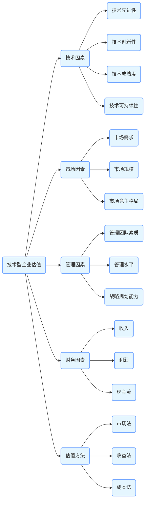

# 技术型企业的特殊估值考虑

> 关键词：技术型企业、估值方法、特殊考虑、无形资产、技术创新、市场动态、未来现金流

> 摘要：本文聚焦于技术型企业的特殊估值考虑，旨在深入剖析技术型企业与传统企业在估值方面的差异，以及影响技术型企业估值的关键因素。通过对核心概念的阐述、相关算法原理的分析、数学模型的构建、实际案例的研究，全面探讨技术型企业估值的方法和要点。同时，介绍技术型企业估值的实际应用场景、相关工具和资源，总结其未来发展趋势与挑战，为投资者、企业管理者等提供全面且深入的技术型企业估值参考。

## 1. 背景介绍 
### 1.1 目的和范围
技术型企业在当今经济格局中占据着日益重要的地位，其发展速度和创新能力对行业乃至整个经济的发展都有着深远的影响。然而，技术型企业的估值与传统企业存在较大差异，传统的估值方法往往难以准确反映技术型企业的真实价值。因此，本文的目的在于系统地探讨技术型企业的特殊估值考虑，明确适用于技术型企业的估值方法和要点。范围涵盖技术型企业的定义、核心特征，影响其估值的各种因素，以及不同场景下的估值实践等。

### 1.2 预期读者
本文预期读者包括投资者，他们需要准确评估技术型企业的价值，以便做出合理的投资决策；企业管理者，有助于他们了解自身企业的价值，制定科学的发展战略和融资策略；金融分析师，为他们提供专业的技术型企业估值分析思路和方法；以及对技术型企业估值感兴趣的研究人员和学者。

### 1.3 文档结构概述
本文首先介绍技术型企业估值的背景信息，包括目的、预期读者和文档结构概述等。接着阐述技术型企业的核心概念与联系，明确其独特的价值驱动因素。然后深入分析核心算法原理和具体操作步骤，结合数学模型和公式进行详细讲解，并通过举例说明。随后通过项目实战展示代码实际案例和详细解释说明。之后探讨技术型企业估值的实际应用场景。再推荐相关的工具和资源，包括学习资源、开发工具框架和相关论文著作。最后总结技术型企业估值的未来发展趋势与挑战，并提供常见问题与解答以及扩展阅读和参考资料。

### 1.4 术语表
#### 1.4.1 核心术语定义
- **技术型企业**：指主要依靠技术创新和研发活动来创造价值的企业，通常具有较高的技术含量和创新能力，其产品或服务往往基于先进的技术和知识。
- **企业估值**：是指对企业的整体价值进行评估的过程，通过综合考虑企业的各种因素，运用一定的方法和模型，确定企业在特定时间点的价值。
- **无形资产**：指企业拥有或控制的没有实物形态的可辨认非货币性资产，如专利、商标、技术秘密、品牌等，在技术型企业中具有重要价值。
- **技术创新**：指企业通过研发和应用新技术、新工艺、新方法等，创造出具有创新性的产品或服务，从而提升企业的竞争力和价值。
- **未来现金流**：指企业在未来一定时期内预计产生的现金流入和流出的净额，是企业估值的重要依据之一。

#### 1.4.2 相关概念解释
- **估值方法**：包括市场法、收益法、成本法等，不同的估值方法适用于不同类型的企业和估值场景。市场法是通过比较类似企业的市场价值来确定目标企业的价值；收益法是基于企业未来的收益来评估其价值；成本法是根据企业的重置成本来估算其价值。
- **风险溢价**：指投资者为了承担额外的风险而要求的额外回报，在技术型企业估值中，由于其面临较高的技术风险、市场风险等，风险溢价通常较高。
- **增长期权**：指企业在未来有机会进行进一步投资和扩张的权利，技术型企业往往具有较多的增长期权，这对其估值具有重要影响。

#### 1.4.3 缩略词列表
- **DCF**：Discounted Cash Flow，折现现金流法，是一种常用的企业估值方法，通过将企业未来的现金流折现到当前来计算企业的价值。
- **NPV**：Net Present Value，净现值，是指投资项目在未来各期现金流入量的现值与现金流出量的现值之差，用于评估投资项目的可行性和价值。
- **PE**：Price - Earnings Ratio，市盈率，是指股票价格与每股收益的比率，常用于评估股票的估值水平。

## 2. 核心概念与联系 

### 技术型企业的核心特征
技术型企业具有以下几个核心特征：
- **高创新性**：技术型企业以技术创新为核心驱动力，不断投入研发资源，开发新的技术和产品，以满足市场需求和提升竞争力。例如，苹果公司通过持续的技术创新，推出了一系列具有创新性的产品，如 iPhone、iPad 等，改变了人们的生活方式和消费习惯。
- **高成长性**：由于技术创新带来的竞争优势，技术型企业往往具有较高的成长潜力。随着新技术的应用和市场份额的扩大，企业的收入和利润可能会呈现快速增长的趋势。例如，特斯拉公司在电动汽车领域的技术创新，使其市场份额不断扩大，企业价值也随之大幅提升。
- **高风险性**：技术型企业面临着多种风险，如技术研发失败的风险、市场需求变化的风险、竞争加剧的风险等。这些风险可能导致企业的研发投入无法得到回报，产品无法获得市场认可，从而影响企业的价值。例如，一些生物制药企业在新药研发过程中，可能会面临临床试验失败的风险，导致研发投入付诸东流。
- **无形资产占比高**：技术型企业的价值往往主要体现在无形资产上，如专利、商标、技术秘密等。这些无形资产是企业技术创新的成果，具有较高的价值和竞争优势。例如，谷歌公司的搜索引擎技术专利和算法是其核心竞争力的重要组成部分，为企业带来了巨大的商业价值。

### 技术型企业估值的影响因素
- **技术因素**：技术的先进性、创新性、成熟度和可持续性等因素对技术型企业的估值具有重要影响。先进的技术可以使企业在市场竞争中占据优势，提高产品的附加值和市场份额，从而提升企业的价值。例如，华为公司在 5G 通信技术领域的领先地位，使其在全球通信市场具有较高的估值。
- **市场因素**：市场需求、市场规模、市场竞争格局等因素也会影响技术型企业的估值。如果市场对企业的产品或服务有较大的需求，且市场规模不断扩大，企业的发展前景将较为乐观，估值也会相应提高。例如，随着人们对健康和环保意识的提高，新能源汽车市场需求不断增长，相关企业的估值也随之上升。
- **管理因素**：企业的管理团队素质、管理水平和战略规划能力等对企业的发展和估值具有重要影响。优秀的管理团队能够制定科学合理的发展战略，有效地组织和管理企业的资源，提高企业的运营效率和竞争力。例如，阿里巴巴的管理团队通过精准的战略布局和高效的运营管理，使企业不断发展壮大，估值也不断攀升。
- **财务因素**：企业的财务状况，如收入、利润、现金流等，是企业估值的重要依据。良好的财务状况表明企业具有较强的盈利能力和偿债能力，能够为投资者带来稳定的回报，从而提高企业的估值。例如，腾讯公司凭借其强大的盈利能力和稳定的现金流，在资本市场上获得了较高的估值。

### 核心概念原理和架构的文本示意图
技术型企业估值是一个复杂的过程，涉及多个核心概念和因素，它们之间相互关联、相互影响。以下是技术型企业估值核心概念原理和架构的文本示意图：

技术型企业估值
|-- 技术因素
|   |-- 技术先进性
|   |-- 技术创新性
|   |-- 技术成熟度
|   |-- 技术可持续性
|-- 市场因素
|   |-- 市场需求
|   |-- 市场规模
|   |-- 市场竞争格局
|-- 管理因素
|   |-- 管理团队素质
|   |-- 管理水平
|   |-- 战略规划能力
|-- 财务因素
|   |-- 收入
|   |-- 利润
|   |-- 现金流
|-- 估值方法
|   |-- 市场法
|   |-- 收益法
|   |-- 成本法

### Mermaid 流程图


## 3. 核心算法原理 & 具体操作步骤 

### 市场法
#### 算法原理
市场法是通过比较类似企业的市场价值来确定目标企业的价值。其基本原理是在市场上找到与目标企业具有相似特征的可比企业，通过分析可比企业的市场价格和相关财务指标，计算出可比企业的估值倍数，然后将该倍数应用到目标企业的相应财务指标上，从而得出目标企业的价值。常用的估值倍数包括市盈率（PE）、市净率（PB）、市销率（PS）等。

#### Python 源代码实现
```python
# 市场法估值示例
# 假设我们有可比企业的市盈率数据和目标企业的净利润数据
# 可比企业市盈率列表
comparable_pe_ratios = [20, 22, 25, 18]
# 目标企业的净利润
target_net_income = 1000000

# 计算可比企业的平均市盈率
average_pe_ratio = sum(comparable_pe_ratios) / len(comparable_pe_ratios)

# 计算目标企业的估值
target_value = average_pe_ratio * target_net_income

print(f"目标企业的估值为: {target_value}")
```

#### 具体操作步骤
1. **选择可比企业**：选择与目标企业在行业、规模、业务模式、财务状况等方面具有相似性的企业作为可比企业。
2. **收集可比企业数据**：收集可比企业的市场价格、财务报表等相关数据，计算出可比企业的估值倍数。
3. **计算平均估值倍数**：对可比企业的估值倍数进行平均计算，得到平均估值倍数。
4. **确定目标企业相关财务指标**：确定目标企业与估值倍数对应的财务指标，如净利润、净资产、销售收入等。
5. **计算目标企业估值**：将平均估值倍数乘以目标企业的相关财务指标，得到目标企业的估值。

### 收益法
#### 算法原理
收益法是基于企业未来的收益来评估其价值。其基本原理是将企业未来的预期现金流折现到当前，计算出企业的现值。常用的收益法模型包括折现现金流法（DCF）等。折现现金流法的核心思想是将企业未来各期的现金流按照一定的折现率折现到当前，然后将各期折现后的现金流相加，得到企业的价值。

#### Python 源代码实现
```python
# 折现现金流法（DCF）估值示例
# 假设我们有企业未来 5 年的预期现金流数据和折现率
# 未来 5 年的预期现金流列表
cash_flows = [100000, 120000, 150000, 180000, 200000]
# 折现率
discount_rate = 0.1

# 计算企业的价值
enterprise_value = 0
for i, cash_flow in enumerate(cash_flows):
    discounted_cash_flow = cash_flow / (1 + discount_rate) ** (i + 1)
    enterprise_value += discounted_cash_flow

print(f"企业的价值为: {enterprise_value}")
```

#### 具体操作步骤
1. **预测未来现金流**：对企业未来一定时期内的现金流进行预测，通常需要考虑企业的业务发展、市场需求、成本变化等因素。
2. **确定折现率**：折现率反映了投资者对投资风险的预期，通常根据市场利率、企业风险等因素确定。
3. **折现现金流计算**：将预测的未来现金流按照折现率折现到当前，计算出各期折现后的现金流。
4. **计算企业价值**：将各期折现后的现金流相加，得到企业的价值。

### 成本法
#### 算法原理
成本法是根据企业的重置成本来估算其价值。其基本原理是通过计算企业各项资产的重置成本，减去各项资产的贬值，得到企业的净值。重置成本是指在当前市场条件下，重新购置或建造与企业现有资产相同或类似的资产所需的成本。

#### Python 源代码实现
```python
# 成本法估值示例
# 假设我们有企业各项资产的重置成本和贬值数据
# 各项资产的重置成本列表
replacement_costs = [500000, 300000, 200000]
# 各项资产的贬值列表
depreciations = [50000, 30000, 20000]

# 计算企业的净值
net_value = sum(replacement_costs) - sum(depreciations)

print(f"企业的净值为: {net_value}")
```

#### 具体操作步骤
1. **确定各项资产的重置成本**：对企业的各项资产进行评估，确定其在当前市场条件下的重置成本。
2. **计算各项资产的贬值**：考虑资产的使用年限、磨损程度、技术进步等因素，计算各项资产的贬值。
3. **计算企业净值**：将各项资产的重置成本减去各项资产的贬值，得到企业的净值。

## 4. 数学模型和公式 & 详细讲解 & 举例说明 

### 市场法数学模型和公式
市场法常用的估值倍数公式如下：
- **市盈率（PE）**：$PE = \frac{股票价格}{每股收益}$
- **市净率（PB）**：$PB = \frac{股票价格}{每股净资产}$
- **市销率（PS）**：$PS = \frac{股票价格}{每股销售收入}$

目标企业的估值公式为：
- **基于市盈率的估值**：$V = PE_{avg} \times NI$，其中 $V$ 为目标企业的估值，$PE_{avg}$ 为可比企业的平均市盈率，$NI$ 为目标企业的净利润。
- **基于市净率的估值**：$V = PB_{avg} \times BV$，其中 $PB_{avg}$ 为可比企业的平均市净率，$BV$ 为目标企业的净资产。
- **基于市销率的估值**：$V = PS_{avg} \times SR$，其中 $PS_{avg}$ 为可比企业的平均市销率，$SR$ 为目标企业的销售收入。

#### 举例说明
假设可比企业 A、B、C 的市盈率分别为 20、22、25，目标企业的净利润为 100 万元。首先计算可比企业的平均市盈率：
$PE_{avg} = \frac{20 + 22 + 25}{3} = 22.33$
然后计算目标企业的估值：
$V = 22.33 \times 100 = 2233$（万元）

### 收益法数学模型和公式
折现现金流法（DCF）的数学模型和公式如下：
$V = \sum_{t=1}^{n} \frac{CF_t}{(1 + r)^t}$
其中，$V$ 为企业的价值，$CF_t$ 为第 $t$ 期的现金流，$r$ 为折现率，$n$ 为预测期数。

#### 举例说明
假设企业未来 3 年的预期现金流分别为 100 万元、120 万元、150 万元，折现率为 10%。则企业的价值为：
$V = \frac{100}{(1 + 0.1)^1} + \frac{120}{(1 + 0.1)^2} + \frac{150}{(1 + 0.1)^3}$
$V = \frac{100}{1.1} + \frac{120}{1.21} + \frac{150}{1.331}$
$V \approx 90.91 + 99.17 + 112.69 = 302.77$（万元）

### 成本法数学模型和公式
成本法的数学模型和公式如下：
$V = RC - D$
其中，$V$ 为企业的净值，$RC$ 为企业各项资产的重置成本，$D$ 为企业各项资产的贬值。

#### 举例说明
假设企业的固定资产重置成本为 500 万元，无形资产重置成本为 300 万元，固定资产贬值为 50 万元，无形资产贬值为 30 万元。则企业的净值为：
$V = (500 + 300) - (50 + 30) = 720$（万元）

## 5. 项目实战：代码实际案例和详细解释说明 

### 5.1  开发环境搭建
为了实现技术型企业估值的代码案例，我们可以使用 Python 编程语言，并安装一些常用的数据分析和计算库，如 `numpy`、`pandas` 等。以下是具体的开发环境搭建步骤：
1. **安装 Python**：从 Python 官方网站（https://www.python.org/downloads/）下载并安装适合你操作系统的 Python 版本。
2. **安装虚拟环境（可选）**：为了避免不同项目之间的库冲突，建议使用虚拟环境。可以使用 `venv` 或 `conda` 来创建虚拟环境。例如，使用 `venv` 创建虚拟环境的命令如下：
```sh
python -m venv myenv
```
3. **激活虚拟环境**：在 Windows 系统中，激活虚拟环境的命令为：
```sh
myenv\Scripts\activate
```
在 Linux 或 macOS 系统中，激活虚拟环境的命令为：
```sh
source myenv/bin/activate
```
4. **安装所需库**：使用 `pip` 安装 `numpy`、`pandas` 等库，命令如下：
```sh
pip install numpy pandas
```

### 5.2  源代码详细实现和代码解读
以下是一个综合运用市场法、收益法和成本法进行技术型企业估值的代码示例：
```python
import numpy as np
import pandas as pd

# 市场法估值函数
def market_approach(comparable_pe_ratios, target_net_income):
    average_pe_ratio = np.mean(comparable_pe_ratios)
    target_value = average_pe_ratio * target_net_income
    return target_value

# 收益法估值函数
def income_approach(cash_flows, discount_rate):
    enterprise_value = 0
    for i, cash_flow in enumerate(cash_flows):
        discounted_cash_flow = cash_flow / (1 + discount_rate) ** (i + 1)
        enterprise_value += discounted_cash_flow
    return enterprise_value

# 成本法估值函数
def cost_approach(replacement_costs, depreciations):
    net_value = sum(replacement_costs) - sum(depreciations)
    return net_value

# 示例数据
# 可比企业市盈率列表
comparable_pe_ratios = [20, 22, 25, 18]
# 目标企业的净利润
target_net_income = 1000000
# 未来 5 年的预期现金流列表
cash_flows = [100000, 120000, 150000, 180000, 200000]
# 折现率
discount_rate = 0.1
# 各项资产的重置成本列表
replacement_costs = [500000, 300000, 200000]
# 各项资产的贬值列表
depreciations = [50000, 30000, 20000]

# 计算不同方法的估值
market_value = market_approach(comparable_pe_ratios, target_net_income)
income_value = income_approach(cash_flows, discount_rate)
cost_value = cost_approach(replacement_costs, depreciations)

# 输出结果
print(f"市场法估值结果: {market_value}")
print(f"收益法估值结果: {income_value}")
print(f"成本法估值结果: {cost_value}")
```
### 5.3  代码解读与分析
- **市场法估值函数 `market_approach`**：该函数接受可比企业的市盈率列表和目标企业的净利润作为输入，通过计算可比企业的平均市盈率，然后将其乘以目标企业的净利润，得到目标企业的估值。
- **收益法估值函数 `income_approach`**：该函数接受企业未来的预期现金流列表和折现率作为输入，通过将各期现金流按照折现率折现到当前，然后将各期折现后的现金流相加，得到企业的价值。
- **成本法估值函数 `cost_approach`**：该函数接受企业各项资产的重置成本列表和贬值列表作为输入，通过将各项资产的重置成本减去各项资产的贬值，得到企业的净值。
- **示例数据**：定义了可比企业的市盈率、目标企业的净利润、未来的预期现金流、折现率、各项资产的重置成本和贬值等示例数据。
- **计算不同方法的估值**：调用上述三个估值函数，分别计算市场法、收益法和成本法的估值结果，并输出结果。

通过这个代码示例，我们可以看到如何运用不同的估值方法对技术型企业进行估值。不同的估值方法适用于不同的场景和企业特点，在实际应用中需要根据具体情况选择合适的估值方法。

## 6. 实际应用场景 
### 投资决策
在投资领域，准确评估技术型企业的价值对于投资者做出合理的投资决策至关重要。投资者可以通过对技术型企业的估值，判断企业的价值是否被低估或高估，从而决定是否投资以及投资的金额和时机。例如，风险投资机构在评估一家初创技术型企业时，会综合考虑企业的技术创新能力、市场前景、管理团队等因素，运用合适的估值方法对企业进行估值，以确定是否对其进行投资。

### 企业并购
在企业并购过程中，估值是确定并购价格的重要依据。收购方需要对目标技术型企业进行估值，以确定合理的收购价格，避免支付过高的代价。同时，被收购方也需要了解自身的价值，以便在谈判中争取更有利的条件。例如，一家大型科技企业在并购一家小型技术型企业时，会对目标企业的技术资产、市场份额、客户资源等进行评估，运用多种估值方法确定目标企业的价值，从而确定并购价格。

### 企业融资
技术型企业在进行融资时，需要向投资者展示自身的价值，以吸引投资者的资金。企业可以通过专业的估值机构对自身进行估值，提供准确的估值报告，增强投资者的信心。例如，一家技术型企业在进行股权融资时，会向潜在投资者提供企业的估值报告，说明企业的价值和发展前景，以便投资者做出投资决策。

### 企业战略规划
企业管理者可以通过对自身企业的估值，了解企业的价值水平和发展潜力，从而制定科学合理的战略规划。例如，企业可以根据估值结果，确定是否加大研发投入、拓展市场、进行并购重组等战略决策，以提升企业的价值和竞争力。

## 7. 工具和资源推荐
### 7.1 学习资源推荐
#### 7.1.1 书籍推荐
- 《企业估值：理论与实践》：这本书系统地介绍了企业估值的理论和方法，包括市场法、收益法、成本法等，同时结合实际案例进行分析，对于学习技术型企业估值具有重要的参考价值。
- 《估值：难点、解决方案及相关案例》：该书深入探讨了企业估值过程中的难点和解决方案，通过大量的实际案例，帮助读者更好地理解和应用估值方法，对于技术型企业估值的实际操作具有指导意义。
- 《价值评估：公司价值的衡量与管理》：本书介绍了价值评估的基本原理和方法，以及如何将价值评估应用于公司的战略决策和管理中，对于理解技术型企业的价值驱动因素和估值方法具有重要的帮助。

#### 7.1.2 在线课程
- Coursera 上的“企业估值与财务建模”课程：该课程由知名高校的教授授课，系统地介绍了企业估值的理论和方法，以及财务建模的技巧，通过实际案例和练习，帮助学员掌握企业估值的实际操作。
- edX 上的“金融估值与投资决策”课程：该课程涵盖了金融估值的基本概念、方法和应用，以及投资决策的原理和技巧，对于学习技术型企业估值和投资决策具有重要的参考价值。
- 中国大学 MOOC 上的“财务管理”课程：该课程介绍了财务管理的基本理论和方法，包括企业估值、资本预算、融资决策等内容，对于理解技术型企业的财务管理和估值具有一定的帮助。

#### 7.1.3 技术博客和网站
- 雪球网：是一个投资者交流社区，上面有很多关于企业估值和投资分析的文章和讨论，对于了解技术型企业的估值和投资动态具有一定的参考价值。
- 价值投资网：专注于价值投资领域，提供企业估值、财务分析等方面的知识和案例，对于学习技术型企业估值和价值投资具有重要的帮助。
- Seeking Alpha：是一个全球知名的金融分析网站，上面有很多专业的分析师发布的企业估值和投资分析报告，对于了解国际市场上技术型企业的估值和投资情况具有重要的参考价值。

### 7.2 开发工具框架推荐
#### 7.2.1 IDE和编辑器
- PyCharm：是一款专业的 Python 集成开发环境，具有强大的代码编辑、调试、版本控制等功能，对于开发技术型企业估值的 Python 代码非常方便。
- Jupyter Notebook：是一个交互式的开发环境，支持多种编程语言，适合进行数据分析和可视化，对于探索和验证技术型企业估值的算法和模型非常有用。
- Visual Studio Code：是一款轻量级的代码编辑器，支持多种编程语言和插件扩展，具有丰富的功能和良好的用户体验，对于开发技术型企业估值的代码也是一个不错的选择。

#### 7.2.2 调试和性能分析工具
- PDB：是 Python 自带的调试工具，可以帮助开发者逐步执行代码，查看变量的值和程序的执行流程，对于调试技术型企业估值的 Python 代码非常有用。
- cProfile：是 Python 自带的性能分析工具，可以帮助开发者分析代码的性能瓶颈，找出耗时较长的函数和语句，对于优化技术型企业估值的代码性能具有重要的作用。
- Py-Spy：是一个轻量级的 Python 性能分析工具，可以在不修改代码的情况下，实时分析 Python 程序的性能，对于快速定位技术型企业估值代码的性能问题非常方便。

#### 7.2.3 相关框架和库
- NumPy：是 Python 中用于科学计算的基础库，提供了高效的数组操作和数学函数，对于实现技术型企业估值的算法和模型非常有用。
- Pandas：是 Python 中用于数据处理和分析的库，提供了灵活的数据结构和数据操作方法，对于处理技术型企业的财务数据和市场数据非常方便。
- Scikit-learn：是 Python 中用于机器学习的库，提供了各种机器学习算法和工具，对于构建技术型企业估值的预测模型具有重要的作用。

### 7.3 相关论文著作推荐
#### 7.3.1 经典论文
- “Valuation of High - Tech Firms”：该论文深入探讨了技术型企业的估值方法和特点，分析了技术创新、市场风险等因素对技术型企业估值的影响，是技术型企业估值领域的经典论文之一。
- “The Impact of Technological Innovation on Firm Value”：该论文研究了技术创新对企业价值的影响机制，通过实证分析证明了技术创新对企业价值的提升作用，对于理解技术型企业的价值驱动因素具有重要的参考价值。
- “Valuation Models for Start - up Technology Firms”：该论文针对初创技术型企业的特点，提出了适合初创技术型企业的估值模型和方法，对于评估初创技术型企业的价值具有重要的指导意义。

#### 7.3.2 最新研究成果
- 近年来，随着人工智能、大数据等技术的发展，一些学者开始研究如何运用这些技术来改进技术型企业的估值方法。例如，利用机器学习算法对技术型企业的财务数据和市场数据进行分析，构建更准确的估值模型。
- 还有一些研究关注技术型企业的无形资产估值问题，提出了一些新的无形资产估值方法和模型，以更准确地评估技术型企业的价值。

#### 7.3.3 应用案例分析
- 一些知名的商业杂志和研究机构会发布技术型企业估值的应用案例分析，例如《哈佛商业评论》、麦肯锡公司等。这些案例分析通过实际案例，展示了不同行业、不同发展阶段的技术型企业的估值方法和过程，对于学习和应用技术型企业估值具有重要的参考价值。

## 8. 总结：未来发展趋势与挑战
### 未来发展趋势
- **技术创新驱动估值方法创新**：随着人工智能、区块链、量子计算等新技术的不断发展，技术型企业的创新能力和商业模式将不断变化，传统的估值方法可能无法准确反映其价值。因此，未来需要不断创新估值方法，结合新技术的特点和影响，开发出更适合技术型企业的估值模型。
- **数据驱动的估值决策**：大数据、云计算等技术的发展使得企业可以获取更多、更准确的数据。未来，技术型企业的估值将更加依赖数据，通过对海量数据的分析和挖掘，提高估值的准确性和可靠性。例如，利用数据分析技术预测企业的未来现金流、市场需求等，为估值决策提供更有力的支持。
- **多维度综合估值**：技术型企业的价值受到多种因素的影响，未来的估值将不再局限于传统的财务指标，而是会综合考虑技术创新能力、市场竞争力、管理团队素质、社会责任等多维度因素，构建更全面、更合理的估值体系。

### 挑战
- **技术不确定性**：技术型企业的技术创新具有较高的不确定性，新技术的研发和应用可能面临失败的风险。这使得准确预测企业的未来现金流和发展前景变得困难，增加了估值的难度和风险。
- **无形资产估值难题**：技术型企业的无形资产占比较高，如专利、商标、技术秘密等。然而，无形资产的估值缺乏统一的标准和方法，其价值难以准确衡量。如何合理评估无形资产的价值，是技术型企业估值面临的重要挑战之一。
- **市场变化快速**：技术型企业所处的市场环境变化快速，市场需求、竞争格局等因素可能随时发生变化。这要求估值人员及时掌握市场动态，调整估值方法和参数，以适应市场变化。但在实际操作中，准确把握市场变化并及时调整估值是具有挑战性的。

## 9. 附录：常见问题与解答
### 问题 1：技术型企业估值与传统企业估值有哪些主要区别？
解答：技术型企业估值与传统企业估值的主要区别在于：技术型企业具有高创新性、高成长性、高风险性和无形资产占比高等特点，其价值更多地依赖于技术创新和未来发展潜力。而传统企业的价值通常更多地基于其现有资产和稳定的现金流。因此，在估值方法的选择和参数的确定上，技术型企业需要更多地考虑技术因素、市场动态和未来不确定性等因素。

### 问题 2：如何选择合适的估值方法？
解答：选择合适的估值方法需要考虑企业的特点、所处的发展阶段、数据的可获取性等因素。一般来说，市场法适用于有较多可比企业且市场数据较为充分的情况；收益法适用于企业未来现金流可预测性较强的情况；成本法适用于企业资产较为清晰、易于评估的情况。对于技术型企业，通常需要综合运用多种估值方法，以更全面、准确地评估其价值。

### 问题 3：技术型企业的无形资产如何估值？
解答：技术型企业的无形资产估值是一个复杂的问题，目前常用的方法包括成本法、市场法和收益法。成本法是根据无形资产的研发成本或重置成本来估算其价值；市场法是通过比较类似无形资产的市场交易价格来确定其价值；收益法是基于无形资产未来所能带来的收益来评估其价值。在实际应用中，需要根据无形资产的特点和具体情况选择合适的估值方法，并结合专业的评估机构和评估人员的意见进行估值。

### 问题 4：估值结果的准确性如何保证？
解答：要保证估值结果的准确性，需要注意以下几点：一是选择合适的估值方法，根据企业的特点和实际情况进行合理选择；二是确保数据的准确性和可靠性，收集和分析真实、完整的财务数据、市场数据等；三是合理确定估值参数，如折现率、增长率等，需要充分考虑市场情况、企业风险等因素；四是进行敏感性分析，评估不同参数变化对估值结果的影响，以了解估值结果的稳定性和可靠性。

## 10. 扩展阅读 & 参考资料
### 扩展阅读
- 《创新者的窘境》：这本书探讨了创新对企业的影响，以及企业如何应对创新带来的挑战和机遇，对于理解技术型企业的发展和估值具有一定的启发作用。
- 《浪潮之巅》：该书介绍了全球科技产业的发展历程和主要科技公司的兴衰，通过实际案例展示了技术创新和市场竞争对企业价值的影响，对于学习技术型企业估值和投资具有重要的参考价值。

### 参考资料
- 相关企业的财务报表和年报，如苹果公司、谷歌公司等，这些资料可以提供企业的财务数据和业务信息，用于估值分析。
- 金融机构和研究机构发布的行业研究报告，如摩根士丹利、高盛等，这些报告可以提供行业的市场数据、发展趋势等信息，对于了解技术型企业所处的市场环境和行业特点具有重要的参考价值。
- 专业的估值书籍和文献，如《企业价值评估》《估值技术》等，这些资料可以提供系统的估值理论和方法，对于深入学习技术型企业估值具有重要的帮助。