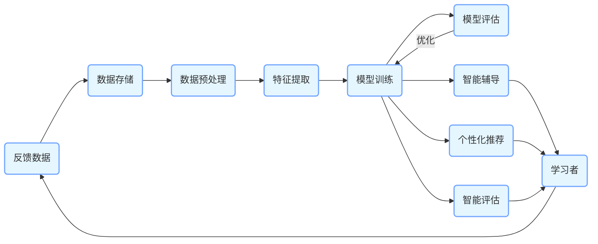

# 技术培训的AI化革新

> 关键词：技术培训、AI化革新、人工智能、个性化学习、智能辅导、培训效率、教育科技

> 摘要：本文深入探讨了技术培训的AI化革新这一前沿话题。随着人工智能技术的飞速发展，其在技术培训领域的应用正带来前所未有的变革。文章首先介绍了技术培训AI化革新的背景，包括目的、预期读者、文档结构等内容。接着阐述了核心概念与联系，详细讲解了相关算法原理和操作步骤，并结合数学模型进行分析。通过项目实战案例展示了AI在技术培训中的具体应用，分析了实际应用场景。同时，推荐了相关的学习资源、开发工具和论文著作。最后总结了未来发展趋势与挑战，还给出了常见问题解答和扩展阅读参考资料，旨在全面呈现技术培训AI化革新的全貌，为相关从业者和研究者提供有价值的参考。

## 1. 背景介绍 
### 1.1 目的和范围
在当今科技飞速发展的时代，技术更新换代的速度越来越快，技术培训的重要性日益凸显。传统的技术培训模式存在效率低下、缺乏个性化等问题，已经难以满足现代社会对技术人才的需求。本文章的目的在于探讨如何利用人工智能技术对技术培训进行革新，提高培训的效率和质量，实现个性化的学习体验。范围涵盖了人工智能在技术培训各个环节的应用，包括课程设计、学习过程监控、智能辅导等方面。

### 1.2 预期读者
本文预期读者包括技术培训领域的从业者，如培训师、课程开发者、培训管理人员等；教育科技领域的研究者和开发者，希望从中获取人工智能在培训领域应用的新思路和技术方法；以及对技术培训和人工智能感兴趣的学习者，了解AI化革新对自身学习的影响和机遇。

### 1.3 文档结构概述
本文首先介绍技术培训AI化革新的背景信息，让读者对该领域有一个初步的了解。接着阐述核心概念与联系，明确相关概念的原理和架构。然后详细讲解核心算法原理和具体操作步骤，结合数学模型进行深入分析。通过项目实战案例展示AI在技术培训中的实际应用，分析其在不同场景下的应用效果。随后推荐相关的学习资源、开发工具和论文著作，为读者提供进一步学习和研究的方向。最后总结未来发展趋势与挑战，解答常见问题，并提供扩展阅读参考资料。

### 1.4 术语表
#### 1.4.1 核心术语定义
- **技术培训**：指为了提高学习者在特定技术领域的知识和技能而进行的有组织、有计划的教育活动。
- **AI化革新**：利用人工智能技术对现有的技术、流程、模式等进行创新和改进，以提高效率、质量和竞争力。
- **个性化学习**：根据学习者的个体差异，如学习目标、学习进度、学习风格等，为其提供定制化的学习内容和学习方式。
- **智能辅导**：利用人工智能技术为学习者提供实时的、个性化的学习指导和帮助。

#### 1.4.2 相关概念解释
- **机器学习**：是人工智能的一个重要分支，它通过让计算机从数据中学习模式和规律，从而实现预测、分类等任务。在技术培训中，机器学习可以用于分析学习者的学习数据，为其提供个性化的学习建议。
- **自然语言处理**：研究如何让计算机理解和处理人类语言的技术。在技术培训中，自然语言处理可以用于智能问答、语音交互等功能，提高学习者的学习体验。
- **深度学习**：是一种基于神经网络的机器学习方法，它可以自动从大量数据中提取特征和模式，具有很强的学习能力。在技术培训中，深度学习可以用于图像识别、视频分析等任务，丰富培训的内容和形式。

#### 1.4.3 缩略词列表
- **AI**：Artificial Intelligence，人工智能
- **ML**：Machine Learning，机器学习
- **NLP**：Natural Language Processing，自然语言处理
- **DL**：Deep Learning，深度学习

## 2. 核心概念与联系 

### 核心概念原理
技术培训的AI化革新主要基于以下几个核心概念：
- **数据驱动**：通过收集和分析学习者的各种数据，如学习时间、学习成绩、错误类型等，了解学习者的学习状态和需求，为个性化学习提供依据。
- **智能算法**：利用机器学习、深度学习等智能算法对学习者的数据进行处理和分析，挖掘其中的规律和模式，从而实现智能辅导、自适应学习等功能。
- **个性化推荐**：根据学习者的个体差异和学习需求，为其推荐适合的学习内容、学习方式和学习资源，提高学习的针对性和效率。

### 架构的文本示意图
技术培训的AI化革新架构主要包括以下几个层次：
- **数据层**：负责收集和存储学习者的各种数据，如学习记录、测试成绩、行为数据等。
- **算法层**：利用各种智能算法对数据层的数据进行处理和分析，挖掘其中的规律和模式，为上层应用提供支持。
- **应用层**：包括智能辅导系统、个性化学习平台、智能评估系统等，为学习者提供具体的服务和功能。
- **用户层**：即学习者和培训师，通过应用层的各种服务和功能进行学习和教学活动。

### Mermaid流程图


## 3. 核心算法原理 & 具体操作步骤 

### 核心算法原理
在技术培训的AI化革新中，常用的核心算法包括决策树、神经网络、支持向量机等。下面以决策树算法为例，详细讲解其原理。

决策树是一种基于树结构进行决策的算法，它通过对数据的特征进行划分，将数据逐步分类到不同的类别中。决策树的每个内部节点表示一个特征上的测试，每个分支表示一个测试输出，每个叶节点表示一个类别或值。

### Python源代码详细阐述
以下是一个使用Python实现决策树算法进行分类的示例代码：
```python
from sklearn.datasets import load_iris
from sklearn.model_selection import train_test_split
from sklearn.tree import DecisionTreeClassifier
from sklearn.metrics import accuracy_score

# 加载数据集
iris = load_iris()
X = iris.data
y = iris.target

# 划分训练集和测试集
X_train, X_test, y_train, y_test = train_test_split(X, y, test_size=0.3, random_state=42)

# 创建决策树分类器
clf = DecisionTreeClassifier()

# 训练模型
clf.fit(X_train, y_train)

# 预测
y_pred = clf.predict(X_test)

# 计算准确率
accuracy = accuracy_score(y_test, y_pred)
print(f"Accuracy: {accuracy}")
```
### 具体操作步骤
1. **数据准备**：收集和整理学习者的相关数据，包括学习记录、测试成绩等，并将其转换为适合算法处理的格式。
2. **数据预处理**：对数据进行清洗、归一化、编码等操作，去除噪声和异常值，提高数据的质量。
3. **特征提取**：从预处理后的数据中提取有代表性的特征，用于模型训练。
4. **模型训练**：选择合适的算法，如决策树、神经网络等，使用训练数据对模型进行训练。
5. **模型评估**：使用测试数据对训练好的模型进行评估，计算模型的准确率、召回率等指标，评估模型的性能。
6. **模型优化**：根据评估结果，对模型进行优化，如调整模型参数、增加训练数据等，提高模型的性能。
7. **应用部署**：将优化后的模型部署到实际应用中，为学习者提供智能辅导、个性化推荐等服务。

## 4. 数学模型和公式 & 详细讲解 & 举例说明 

### 决策树的数学模型
决策树的数学模型可以用一个递归的树结构来表示。设数据集为 $D$，特征集为 $A$，决策树的生成过程可以描述为：
1. 如果 $D$ 中所有样本属于同一类别 $C$，则将该节点标记为 $C$ 类叶节点。
2. 如果 $A$ 为空集，或者 $D$ 中所有样本在 $A$ 上的取值相同，则将该节点标记为 $D$ 中样本数最多的类别叶节点。
3. 否则，选择一个最优特征 $a^*$ 对 $D$ 进行划分，生成子节点，递归地对每个子节点进行上述操作。

### 信息增益公式
在决策树的特征选择中，常用的方法是信息增益。信息增益是指划分前后信息熵的减少量，它反映了特征对分类的贡献程度。信息增益的计算公式为：
$$
Gain(D, a) = Ent(D) - \sum_{v=1}^{V} \frac{|D^v|}{|D|} Ent(D^v)
$$
其中，$D$ 是数据集，$a$ 是特征，$V$ 是特征 $a$ 的取值个数，$D^v$ 是 $D$ 中特征 $a$ 取值为 $v$ 的样本子集，$Ent(D)$ 是数据集 $D$ 的信息熵，计算公式为：
$$
Ent(D) = -\sum_{k=1}^{K} p_k \log_2 p_k
$$
其中，$K$ 是数据集 $D$ 中类别的个数，$p_k$ 是第 $k$ 类样本在 $D$ 中所占的比例。

### 举例说明
假设有一个数据集 $D$，包含 10 个样本，分为 2 类，其中 6 个样本属于类别 1，4 个样本属于类别 2。则数据集 $D$ 的信息熵为：
$$
Ent(D) = -\frac{6}{10} \log_2 \frac{6}{10} - \frac{4}{10} \log_2 \frac{4}{10} \approx 0.971
$$
假设我们选择一个特征 $a$ 对数据集 $D$ 进行划分，特征 $a$ 有 2 个取值，$D^1$ 包含 4 个样本，其中 3 个属于类别 1，1 个属于类别 2；$D^2$ 包含 6 个样本，其中 3 个属于类别 1，3 个属于类别 2。则 $D^1$ 和 $D^2$ 的信息熵分别为：
$$
Ent(D^1) = -\frac{3}{4} \log_2 \frac{3}{4} - \frac{1}{4} \log_2 \frac{1}{4} \approx 0.811
$$
$$
Ent(D^2) = -\frac{3}{6} \log_2 \frac{3}{6} - \frac{3}{6} \log_2 \frac{3}{6} = 1
$$
则特征 $a$ 的信息增益为：
$$
Gain(D, a) = Ent(D) - \frac{4}{10} Ent(D^1) - \frac{6}{10} Ent(D^2) \approx 0.971 - \frac{4}{10} \times 0.811 - \frac{6}{10} \times 1 \approx 0.147
$$

## 5. 项目实战：代码实际案例和详细解释说明 

### 5.1  开发环境搭建
本项目使用Python语言进行开发，需要安装以下库：
- **scikit-learn**：用于机器学习算法的实现。
- **pandas**：用于数据处理和分析。
- **numpy**：用于数值计算。

可以使用以下命令进行安装：
```sh
pip install scikit-learn pandas numpy
```

### 5.2  源代码详细实现和代码解读
以下是一个使用Python实现的简单的个性化学习推荐系统的示例代码：
```python
import pandas as pd
import numpy as np
from sklearn.neighbors import NearestNeighbors

# 加载数据
data = pd.read_csv('learning_data.csv')

# 提取特征和标签
X = data.drop('course', axis=1).values
y = data['course'].values

# 创建最近邻模型
model = NearestNeighbors(n_neighbors=3)

# 训练模型
model.fit(X)

# 定义一个新的学习者的特征
new_learner = np.array([[80, 70, 90, 60]])

# 查找最近邻
distances, indices = model.kneighbors(new_learner)

# 推荐课程
recommended_courses = [y[i] for i in indices[0]]
print(f"Recommended courses: {recommended_courses}")
```
### 代码解读与分析
1. **数据加载**：使用 `pandas` 库的 `read_csv` 函数加载学习者的学习数据，数据文件名为 `learning_data.csv`。
2. **特征提取**：从数据中提取学习者的特征，如成绩、学习时间等，并将其转换为 `numpy` 数组。
3. **模型创建**：使用 `scikit-learn` 库的 `NearestNeighbors` 类创建一个最近邻模型，设置最近邻的个数为 3。
4. **模型训练**：使用 `fit` 方法对模型进行训练，将学习者的特征作为输入。
5. **新学习者特征定义**：定义一个新的学习者的特征，用 `numpy` 数组表示。
6. **最近邻查找**：使用 `kneighbors` 方法查找与新学习者最相似的 3 个学习者的索引和距离。
7. **课程推荐**：根据最近邻的索引，从标签中提取对应的课程名称，作为推荐课程输出。

## 6. 实际应用场景 
### 企业内部培训
在企业内部，技术培训的AI化革新可以根据员工的岗位需求、技能水平和学习进度，为其提供个性化的培训课程和学习计划。通过智能辅导系统，员工可以随时获得实时的学习指导和帮助，提高学习效率和培训效果。同时，企业可以利用AI技术对员工的学习数据进行分析，了解员工的学习情况和需求，优化培训方案，提高员工的技能水平和工作绩效。

### 在线教育平台
在线教育平台可以利用AI技术实现个性化学习推荐、智能答疑、自适应学习等功能。根据学习者的学习历史、兴趣爱好和学习目标，为其推荐适合的课程和学习资源。通过智能答疑系统，学习者可以随时解决学习中遇到的问题，提高学习的积极性和主动性。自适应学习系统可以根据学习者的学习进度和表现，自动调整学习内容和难度，实现个性化的学习体验。

### 职业技能培训
在职业技能培训领域，AI化革新可以帮助培训机构更好地了解学员的需求和特点，提供更加精准的培训服务。通过模拟真实的工作场景，利用虚拟现实和增强现实技术，为学员提供沉浸式的学习体验，提高学员的实践能力和职业素养。同时，AI技术可以对学员的学习成果进行评估和反馈，帮助学员及时发现问题并进行改进。

## 7. 工具和资源推荐
### 7.1 学习资源推荐
#### 7.1.1 书籍推荐
- 《机器学习》（周志华著）：介绍了机器学习的基本概念、算法和应用，是机器学习领域的经典教材。
- 《深度学习》（Ian Goodfellow等著）：全面介绍了深度学习的理论和实践，适合有一定机器学习基础的读者。
- 《Python机器学习实战》（Sebastian Raschka著）：通过实际案例介绍了Python在机器学习中的应用，适合初学者。

#### 7.1.2 在线课程
- Coursera上的“机器学习”课程（Andrew Ng教授主讲）：是机器学习领域的经典在线课程，内容丰富，讲解详细。
- edX上的“深度学习”课程（由不同高校的教授联合授课）：系统介绍了深度学习的理论和实践，适合有一定编程基础的学习者。
- 中国大学MOOC上的“人工智能基础”课程：介绍了人工智能的基本概念、算法和应用，适合初学者。

#### 7.1.3 技术博客和网站
- Medium：上面有很多关于人工智能、机器学习的技术博客和文章，内容丰富，更新及时。
- Towards Data Science：专注于数据科学和机器学习领域的技术博客，有很多高质量的文章和教程。
- 机器之心：提供人工智能领域的最新技术动态、研究成果和应用案例，是了解人工智能发展趋势的重要渠道。

### 7.2 开发工具框架推荐
#### 7.2.1 IDE和编辑器
- PyCharm：是一款专门为Python开发设计的集成开发环境，功能强大，支持代码调试、自动补全、版本控制等功能。
- Jupyter Notebook：是一个交互式的开发环境，适合数据探索、模型训练和可视化等工作。
- Visual Studio Code：是一款轻量级的代码编辑器，支持多种编程语言，有丰富的插件和扩展。

#### 7.2.2 调试和性能分析工具
- TensorBoard：是TensorFlow的可视化工具，可以帮助用户监控模型的训练过程、查看模型的结构和性能指标。
- Py-Spy：是一个Python性能分析工具，可以帮助用户找出Python代码中的性能瓶颈。
- cProfile：是Python的内置性能分析工具，可以统计函数的调用次数、执行时间等信息。

#### 7.2.3 相关框架和库
- TensorFlow：是Google开发的深度学习框架，功能强大，支持多种深度学习模型的实现和训练。
- PyTorch：是Facebook开发的深度学习框架，易于使用，适合快速原型开发和研究。
- Scikit-learn：是一个简单易用的机器学习库，提供了多种机器学习算法和工具，适合初学者和快速开发。

### 7.3 相关论文著作推荐
#### 7.3.1 经典论文
- “A Logical Calculus of the Ideas Immanent in Nervous Activity”（Warren S. McCulloch和Walter Pitts著）：提出了神经元模型，为神经网络的发展奠定了基础。
- “Learning Representations by Back-propagating Errors”（David E. Rumelhart等著）：介绍了反向传播算法，使得神经网络的训练变得可行。
- “ImageNet Classification with Deep Convolutional Neural Networks”（Alex Krizhevsky等著）：提出了AlexNet模型，开创了深度学习在图像分类领域的先河。

#### 7.3.2 最新研究成果
- 在arXiv上搜索“Artificial Intelligence in Education”等关键词，可以获取到关于人工智能在教育领域的最新研究成果。
- 关注顶级学术会议，如ICML（国际机器学习会议）、NeurIPS（神经信息处理系统大会）等，了解人工智能领域的最新研究动态。

#### 7.3.3 应用案例分析
- 可以参考一些知名企业的技术博客和官方报告，了解他们在技术培训AI化革新方面的应用案例和实践经验。
- 关注行业研究机构的报告和分析，了解技术培训AI化革新的市场趋势和发展前景。

## 8. 总结：未来发展趋势与挑战
### 未来发展趋势
- **更加个性化的学习体验**：随着人工智能技术的不断发展，技术培训将更加注重个性化学习，根据学习者的个体差异提供更加精准的学习内容和学习方式。
- **智能化的教学管理**：AI技术将在教学管理中发挥更大的作用，如智能排课、智能评估、智能反馈等，提高教学管理的效率和质量。
- **虚拟和增强现实技术的应用**：虚拟和增强现实技术将与AI技术相结合，为学习者提供更加沉浸式的学习体验，提高学习的趣味性和效果。
- **跨领域的融合**：技术培训的AI化革新将与其他领域，如心理学、教育学等进行更加深入的融合，为学习者提供更加全面的学习支持。

### 挑战
- **数据隐私和安全问题**：在技术培训的AI化革新中，需要收集和处理大量的学习者数据，如何保护这些数据的隐私和安全是一个重要的挑战。
- **技术门槛和成本**：人工智能技术的应用需要一定的技术门槛和成本，对于一些小型培训机构和企业来说，可能难以承担。
- **教师角色的转变**：AI技术的应用将改变教师的角色和职责，教师需要不断提升自己的技术水平和教学能力，以适应新的教学模式。
- **伦理和道德问题**：人工智能技术的应用可能会带来一些伦理和道德问题，如算法偏见、数据滥用等，需要建立相应的法律法规和伦理准则来规范。

## 9. 附录：常见问题与解答
### 问题1：AI化革新是否会完全取代教师？
答：不会。虽然AI技术可以提供个性化的学习支持和智能辅导，但教师在教学过程中仍然扮演着重要的角色。教师可以与学生进行情感交流、引导学生思考、培养学生的团队合作能力等，这些是AI技术无法替代的。

### 问题2：如何确保AI系统的公正性和无偏见性？
答：要确保AI系统的公正性和无偏见性，需要从数据、算法和评估等多个方面入手。在数据收集阶段，要确保数据的多样性和代表性；在算法设计阶段，要避免算法中存在潜在的偏见；在评估阶段，要使用多种评估指标和方法，对AI系统的公正性和无偏见性进行评估和验证。

### 问题3：AI化革新对学习者的技术水平有要求吗？
答：有一定的要求。学习者需要具备基本的计算机操作技能和网络使用能力，以便能够使用AI化的学习平台和工具。但随着技术的不断发展，这些工具和平台的易用性也在不断提高，学习者可以逐渐适应和掌握。

### 问题4：如何衡量技术培训AI化革新的效果？
答：可以从多个方面衡量技术培训AI化革新的效果，如学习者的学习成绩、学习满意度、学习效率等。同时，还可以通过分析学习者的学习数据，了解他们的学习行为和需求，评估AI系统的性能和效果。

## 10. 扩展阅读 & 参考资料
### 扩展阅读
- 《教育中的人工智能》：深入探讨了人工智能在教育领域的应用和发展趋势。
- 《智能学习环境的设计与应用》：介绍了智能学习环境的设计原则和方法，以及在技术培训中的应用案例。

### 参考资料
- 相关学术论文和研究报告，如《Journal of Educational Technology & Society》、《Artificial Intelligence in Education》等期刊上的文章。
- 行业标准和规范，如《人工智能教育应用技术规范》等。
- 官方网站和技术文档，如TensorFlow、PyTorch等框架的官方文档。