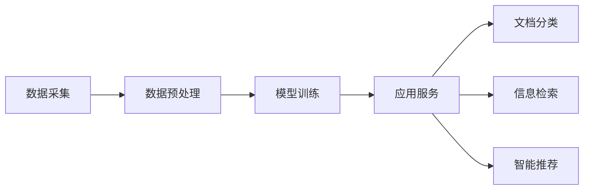

# 技术文档的AI化管理

> 关键词：技术文档、AI化管理、自然语言处理、机器学习、知识图谱、信息检索、智能推荐

> 摘要：本文围绕技术文档的AI化管理展开深入探讨。首先介绍了技术文档AI化管理的背景，包括目的、预期读者、文档结构和相关术语。接着阐述了核心概念及其联系，分析了核心算法原理与具体操作步骤，并给出数学模型和公式。通过项目实战详细展示了代码实现与解读，探讨了实际应用场景。同时推荐了相关的学习资源、开发工具框架和论文著作。最后总结了未来发展趋势与挑战，提供了常见问题解答和扩展阅读参考资料，旨在全面剖析技术文档AI化管理的理论与实践，为相关从业者提供有价值的参考。

## 1. 背景介绍 
### 1.1 目的和范围
技术文档在企业和组织的运营中起着至关重要的作用，它记录了产品的设计、开发、使用和维护等各个方面的信息。然而，随着技术的不断发展和业务的不断拓展，技术文档的数量和复杂度也在急剧增加，传统的文档管理方式已经难以满足需求。技术文档的AI化管理旨在利用人工智能技术，如自然语言处理、机器学习等，提高技术文档的管理效率、检索准确性和利用价值。本文章的范围涵盖了技术文档AI化管理的各个方面，包括核心概念、算法原理、实际应用、工具资源等。

### 1.2 预期读者
本文的预期读者包括技术文档管理人员、软件开发人员、数据科学家、人工智能研究者以及对技术文档管理和人工智能应用感兴趣的相关人员。

### 1.3 文档结构概述
本文共分为十个部分。第一部分介绍技术文档AI化管理的背景；第二部分阐述核心概念与联系；第三部分讲解核心算法原理和具体操作步骤；第四部分给出数学模型和公式并详细讲解；第五部分通过项目实战展示代码实现和解读；第六部分探讨实际应用场景；第七部分推荐相关的工具和资源；第八部分总结未来发展趋势与挑战；第九部分提供常见问题与解答；第十部分给出扩展阅读和参考资料。

### 1.4 术语表
#### 1.4.1 核心术语定义
- **技术文档**：记录技术信息的文档，包括产品说明书、技术报告、设计文档等。
- **AI化管理**：利用人工智能技术对技术文档进行管理，包括文档的分类、检索、推荐等。
- **自然语言处理（NLP）**：让计算机能够理解、处理和生成人类语言的技术。
- **机器学习（ML）**：让计算机通过数据学习模式和规律，从而进行预测和决策的技术。
- **知识图谱**：一种以图形结构表示知识的方法，用于存储和管理实体之间的关系。

#### 1.4.2 相关概念解释
- **信息检索**：从大量文档中查找满足用户需求的信息的过程。
- **智能推荐**：根据用户的行为和偏好，为用户推荐相关的技术文档。
- **文本分类**：将文本划分到不同类别的任务。

#### 1.4.3 缩略词列表
- **NLP**：自然语言处理（Natural Language Processing）
- **ML**：机器学习（Machine Learning）
- **TF-IDF**：词频 - 逆文档频率（Term Frequency - Inverse Document Frequency）
- **BERT**：双向编码器表示来自变压器（Bidirectional Encoder Representations from Transformers）

## 2. 核心概念与联系 
### 核心概念原理
技术文档的AI化管理主要涉及以下几个核心概念：
- **自然语言处理（NLP）**：自然语言处理是AI化管理的基础，它可以对技术文档的文本内容进行处理，包括分词、词性标注、命名实体识别、情感分析等。通过NLP技术，可以将非结构化的文本数据转化为结构化的数据，以便计算机进行处理和分析。
- **机器学习（ML）**：机器学习用于从技术文档中学习模式和规律，例如文本分类、聚类、信息抽取等。通过训练机器学习模型，可以实现对技术文档的自动分类、检索和推荐。
- **知识图谱**：知识图谱可以将技术文档中的实体和关系进行可视化表示，帮助用户更好地理解文档之间的关联。知识图谱可以用于知识推理、智能问答等应用。

### 架构的文本示意图
技术文档的AI化管理架构主要包括数据采集、数据预处理、模型训练、应用服务等几个部分。具体如下：
- **数据采集**：从各种数据源（如文件系统、数据库、网页等）收集技术文档。
- **数据预处理**：对采集到的技术文档进行清洗、分词、标注等处理，将其转化为适合机器学习模型处理的格式。
- **模型训练**：使用预处理后的数据训练机器学习模型，如文本分类模型、信息抽取模型等。
- **应用服务**：将训练好的模型部署到应用系统中，提供文档分类、检索、推荐等服务。

### Mermaid 流程图


## 3. 核心算法原理 & 具体操作步骤 
### 文本分类算法原理（以朴素贝叶斯算法为例）
朴素贝叶斯算法是一种基于贝叶斯定理的简单概率分类器，它假设特征之间相互独立。在文本分类中，朴素贝叶斯算法可以根据文本中词语的出现频率来判断文本属于哪个类别。

### Python源代码实现
```python
import numpy as np
from sklearn.feature_extraction.text import CountVectorizer
from sklearn.naive_bayes import MultinomialNB
from sklearn.model_selection import train_test_split

# 示例数据
documents = ["This is a technical document about software development.",
             "This is a user manual for a mobile application.",
             "This is a research paper on artificial intelligence."]
labels = ["software", "user manual", "research paper"]

# 数据预处理
vectorizer = CountVectorizer()
X = vectorizer.fit_transform(documents)
y = np.array(labels)

# 划分训练集和测试集
X_train, X_test, y_train, y_test = train_test_split(X, y, test_size=0.2, random_state=42)

# 训练模型
clf = MultinomialNB()
clf.fit(X_train, y_train)

# 预测
new_doc = ["This is a new technical document about software engineering."]
new_X = vectorizer.transform(new_doc)
predicted_label = clf.predict(new_X)
print("Predicted label:", predicted_label)
```
### 具体操作步骤
1. **数据准备**：收集技术文档数据，并为每个文档标注类别标签。
2. **数据预处理**：使用`CountVectorizer`将文本数据转化为词频矩阵。
3. **划分训练集和测试集**：将数据划分为训练集和测试集，用于模型训练和评估。
4. **模型训练**：使用`MultinomialNB`训练朴素贝叶斯分类模型。
5. **模型预测**：使用训练好的模型对新的文档进行分类预测。

## 4. 数学模型和公式 & 详细讲解 & 举例说明 
### 贝叶斯定理
贝叶斯定理是朴素贝叶斯算法的理论基础，其公式为：
$$P(A|B)=\frac{P(B|A)P(A)}{P(B)}$$
其中，$P(A|B)$ 表示在事件 $B$ 发生的条件下事件 $A$ 发生的概率，$P(B|A)$ 表示在事件 $A$ 发生的条件下事件 $B$ 发生的概率，$P(A)$ 表示事件 $A$ 发生的先验概率，$P(B)$ 表示事件 $B$ 发生的概率。

### 朴素贝叶斯分类器公式
在文本分类中，朴素贝叶斯分类器的目标是找到概率最大的类别 $c$，其公式为：
$$\hat{c}=\arg\max_{c\in C}P(c|d)=\arg\max_{c\in C}\frac{P(d|c)P(c)}{P(d)}$$
其中，$C$ 是所有类别的集合，$d$ 是文档，$P(c|d)$ 表示文档 $d$ 属于类别 $c$ 的概率，$P(d|c)$ 表示在类别 $c$ 下文档 $d$ 出现的概率，$P(c)$ 表示类别 $c$ 的先验概率，$P(d)$ 表示文档 $d$ 出现的概率。由于 $P(d)$ 对于所有类别都是相同的，因此可以忽略，公式简化为：
$$\hat{c}=\arg\max_{c\in C}P(d|c)P(c)$$

### 举例说明
假设有两个类别：“技术文档”和“用户手册”，有一个文档 $d$ 包含词语“software”和“development”。已知：
- $P(\text{技术文档}) = 0.6$，$P(\text{用户手册}) = 0.4$
- $P(\text{software}|\text{技术文档}) = 0.8$，$P(\text{software}|\text{用户手册}) = 0.3$
- $P(\text{development}|\text{技术文档}) = 0.7$，$P(\text{development}|\text{用户手册}) = 0.2$

根据朴素贝叶斯分类器公式，计算文档 $d$ 属于“技术文档”和“用户手册”的概率：
- $P(\text{技术文档}|d)=P(\text{software}|\text{技术文档})P(\text{development}|\text{技术文档})P(\text{技术文档})=0.8\times0.7\times0.6 = 0.336$
- $P(\text{用户手册}|d)=P(\text{software}|\text{用户手册})P(\text{development}|\text{用户手册})P(\text{用户手册})=0.3\times0.2\times0.4 = 0.024$

由于 $P(\text{技术文档}|d)>P(\text{用户手册}|d)$，因此文档 $d$ 被分类为“技术文档”。

## 5. 项目实战：代码实际案例和详细解释说明 
### 5.1  开发环境搭建
- **Python环境**：建议使用Python 3.7及以上版本。
- **开发工具**：可以使用PyCharm、Jupyter Notebook等开发工具。
- **依赖库**：安装`scikit-learn`、`numpy`、`pandas`等必要的库。可以使用以下命令进行安装：
```sh
pip install scikit-learn numpy pandas
```

### 5.2  源代码详细实现和代码解读
```python
import pandas as pd
from sklearn.feature_extraction.text import TfidfVectorizer
from sklearn.model_selection import train_test_split
from sklearn.svm import SVC
from sklearn.metrics import accuracy_score

# 加载数据
data = pd.read_csv('technical_docs.csv')
documents = data['text'].tolist()
labels = data['label'].tolist()

# 数据预处理
vectorizer = TfidfVectorizer()
X = vectorizer.fit_transform(documents)
y = labels

# 划分训练集和测试集
X_train, X_test, y_train, y_test = train_test_split(X, y, test_size=0.2, random_state=42)

# 训练模型
model = SVC()
model.fit(X_train, y_train)

# 预测
y_pred = model.predict(X_test)

# 评估模型
accuracy = accuracy_score(y_test, y_pred)
print("Accuracy:", accuracy)
```
### 代码解读与分析
1. **数据加载**：使用`pandas`库加载包含技术文档和标签的CSV文件。
2. **数据预处理**：使用`TfidfVectorizer`将文本数据转化为TF-IDF矩阵，TF-IDF可以反映词语在文档中的重要性。
3. **划分训练集和测试集**：使用`train_test_split`将数据划分为训练集和测试集，测试集占比为20%。
4. **模型训练**：使用支持向量机（SVM）模型进行训练。
5. **模型预测**：使用训练好的模型对测试集进行预测。
6. **模型评估**：使用`accuracy_score`计算模型的准确率。

## 6. 实际应用场景 
### 企业内部文档管理
在企业内部，技术文档的数量庞大，通过AI化管理可以实现文档的自动分类、检索和推荐，提高员工查找和使用文档的效率。例如，员工可以通过关键词搜索快速找到相关的技术文档，系统还可以根据员工的历史行为和偏好推荐相关的文档。

### 技术支持与客服
在技术支持和客服领域，AI化管理可以帮助客服人员快速找到解决用户问题的相关文档。例如，当用户咨询某个产品的使用问题时，客服人员可以通过智能检索系统快速找到对应的用户手册或技术文档，提高问题解决的效率和准确性。

### 知识共享与传承
通过AI化管理，可以将企业内部的技术知识进行整合和共享，促进知识的传承和创新。例如，新员工可以通过知识图谱了解企业的技术体系和产品架构，快速融入工作。

## 7. 工具和资源推荐
### 7.1 学习资源推荐
#### 7.1.1 书籍推荐
- 《自然语言处理入门》：介绍自然语言处理的基本概念和算法，适合初学者。
- 《机器学习》：全面介绍机器学习的理论和方法，是机器学习领域的经典教材。
- 《Python自然语言处理》：结合Python语言介绍自然语言处理的实践应用。

#### 7.1.2 在线课程
- Coursera上的“Natural Language Processing Specialization”：由顶尖大学的教授授课，系统介绍自然语言处理的知识和技术。
- edX上的“Introduction to Artificial Intelligence”：介绍人工智能的基本概念和方法，包括机器学习和自然语言处理。

#### 7.1.3 技术博客和网站
- Medium上的“Towards Data Science”：分享数据科学和人工智能领域的最新技术和研究成果。
- 博客园：有很多关于技术文档管理和人工智能应用的技术文章。

### 7.2 开发工具框架推荐
#### 7.2.1 IDE和编辑器
- PyCharm：功能强大的Python集成开发环境，适合Python开发。
- Jupyter Notebook：交互式的开发环境，适合数据探索和模型实验。

#### 7.2.2 调试和性能分析工具
- PDB：Python自带的调试工具，可以帮助开发者调试代码。
- cProfile：Python的性能分析工具，可以分析代码的性能瓶颈。

#### 7.2.3 相关框架和库
- Scikit-learn：简单易用的机器学习库，提供了各种机器学习算法和工具。
- NLTK：自然语言处理工具包，提供了丰富的自然语言处理功能。
- SpaCy：高效的自然语言处理库，适合处理大规模文本数据。

### 7.3 相关论文著作推荐
#### 7.3.1 经典论文
- “A Mathematical Theory of Communication”：香农的经典论文，奠定了信息论的基础。
- “A Machine Learning Approach to Text Categorization”：介绍了机器学习在文本分类中的应用。

#### 7.3.2 最新研究成果
- 可以通过IEEE Xplore、ACM Digital Library等学术数据库查找关于技术文档AI化管理的最新研究成果。

#### 7.3.3 应用案例分析
- 可以参考一些企业的技术博客和案例分享，了解技术文档AI化管理在实际应用中的经验和效果。

## 8. 总结：未来发展趋势与挑战
### 未来发展趋势
- **智能化程度不断提高**：随着人工智能技术的不断发展，技术文档的AI化管理将更加智能化，例如实现自动文档生成、智能问答等功能。
- **与其他技术的融合**：技术文档的AI化管理将与区块链、物联网等技术融合，实现更加安全、高效的文档管理。
- **跨语言和跨文化支持**：随着全球化的发展，技术文档的AI化管理将支持更多的语言和文化，方便不同地区的用户使用。

### 挑战
- **数据质量问题**：技术文档的AI化管理依赖于大量的数据，数据的质量直接影响模型的性能。如何保证数据的准确性、完整性和一致性是一个挑战。
- **隐私和安全问题**：技术文档中可能包含敏感信息，如何保证数据的隐私和安全是一个重要问题。
- **模型可解释性问题**：一些人工智能模型，如深度学习模型，具有较高的复杂度，其决策过程难以解释。如何提高模型的可解释性是一个挑战。

## 9. 附录：常见问题与解答
### 问题1：技术文档AI化管理需要多少数据？
解答：数据量的需求取决于具体的应用场景和模型复杂度。一般来说，数据量越大，模型的性能越好。但是，数据量并不是唯一的因素，数据的质量也非常重要。

### 问题2：如何选择合适的机器学习算法？
解答：选择合适的机器学习算法需要考虑多个因素，如数据类型、问题类型、模型复杂度等。可以通过实验比较不同算法的性能，选择最适合的算法。

### 问题3：技术文档AI化管理是否会取代人工管理？
解答：技术文档AI化管理不会完全取代人工管理，而是与人工管理相结合。AI技术可以提高管理效率和准确性，但人工管理在一些方面，如文档审核、知识判断等，仍然具有不可替代的作用。

## 10. 扩展阅读 & 参考资料
### 扩展阅读
- 《人工智能简史》：了解人工智能的发展历程和重要事件。
- 《大数据时代》：了解大数据在各个领域的应用和影响。

### 参考资料
- 相关的学术论文和研究报告。
- 开源项目的文档和代码。
- 技术论坛和社区的讨论和分享。