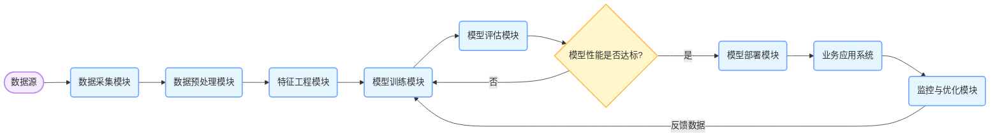

# 技术方案专家：AI辅助系统设计

> 关键词：AI辅助系统、系统设计、人工智能、技术方案、智能决策、自动化流程、人机协作

> 摘要：本文聚焦于AI辅助系统设计这一关键领域，旨在为技术方案专家提供全面且深入的指导。首先介绍了AI辅助系统设计的背景，包括目的、预期读者、文档结构和相关术语。接着阐述了核心概念与联系，通过文本示意图和Mermaid流程图清晰展示系统架构。详细讲解了核心算法原理及具体操作步骤，并结合Python源代码进行说明。深入探讨了数学模型和公式，辅以举例加深理解。通过项目实战，从开发环境搭建到源代码实现与解读，全面呈现AI辅助系统的开发过程。分析了实际应用场景，为系统的落地提供参考。推荐了相关的工具和资源，包括学习资料、开发工具框架和论文著作。最后总结了未来发展趋势与挑战，并提供常见问题解答和扩展阅读参考资料，帮助读者全面掌握AI辅助系统设计的技术要点和实践方法。

## 1. 背景介绍 
### 1.1 目的和范围
AI辅助系统设计的目的在于利用人工智能技术提升各种业务流程的效率、准确性和智能化水平。通过将AI技术融入到不同的应用场景中，实现人机协作，让机器辅助人类完成复杂的任务，减少人为错误，提高决策的科学性和合理性。

本文章的范围涵盖了AI辅助系统设计的各个方面，包括核心概念、算法原理、数学模型、项目实战、应用场景、工具资源等。旨在为技术方案专家提供一个全面的技术方案设计参考，帮助他们在不同的领域中设计和实现高效、智能的AI辅助系统。

### 1.2 预期读者
本文的预期读者主要包括技术方案专家、软件架构师、AI工程师、数据科学家、CTO等对AI辅助系统设计感兴趣的专业人士。同时，对于希望了解AI技术在实际应用中如何落地的业务人员和管理者也具有一定的参考价值。

### 1.3 文档结构概述
本文将按照以下结构进行组织：
1. **背景介绍**：介绍AI辅助系统设计的目的、范围、预期读者、文档结构和相关术语。
2. **核心概念与联系**：阐述AI辅助系统的核心概念、原理和架构，通过文本示意图和Mermaid流程图进行展示。
3. **核心算法原理 & 具体操作步骤**：详细讲解AI辅助系统中常用的核心算法原理，并结合Python源代码说明具体操作步骤。
4. **数学模型和公式 & 详细讲解 & 举例说明**：深入探讨AI辅助系统中的数学模型和公式，通过举例加深理解。
5. **项目实战：代码实际案例和详细解释说明**：通过一个具体的项目实战，从开发环境搭建到源代码实现与解读，全面呈现AI辅助系统的开发过程。
6. **实际应用场景**：分析AI辅助系统在不同领域的实际应用场景。
7. **工具和资源推荐**：推荐相关的学习资源、开发工具框架和论文著作。
8. **总结：未来发展趋势与挑战**：总结AI辅助系统设计的未来发展趋势与挑战。
9. **附录：常见问题与解答**：提供常见问题的解答。
10. **扩展阅读 & 参考资料**：提供扩展阅读的建议和参考资料。

### 1.4 术语表
#### 1.4.1 核心术语定义
- **AI辅助系统**：利用人工智能技术辅助人类完成各种任务的系统，通过机器学习、自然语言处理、计算机视觉等技术实现智能决策、自动化流程等功能。
- **机器学习**：一门多领域交叉学科，涉及概率论、统计学、逼近论、凸分析、算法复杂度理论等多门学科。它专门研究计算机怎样模拟或实现人类的学习行为，以获取新的知识或技能，重新组织已有的知识结构使之不断改善自身的性能。
- **自然语言处理**：计算机科学与人工智能领域中的一个重要方向。它研究能实现人与计算机之间用自然语言进行有效通信的各种理论和方法。
- **计算机视觉**：一门研究如何使机器“看”的科学，更进一步的说，就是是指用摄影机和电脑代替人眼对目标进行识别、跟踪和测量等机器视觉，并进一步做图形处理，使电脑处理成为更适合人眼观察或传送给仪器检测的图像。
- **人机协作**：人和机器之间通过合理的分工和协作，共同完成任务的过程。在AI辅助系统中，人机协作可以充分发挥人类的智慧和机器的计算能力，提高工作效率和质量。

#### 1.4.2 相关概念解释
- **智能决策**：利用人工智能技术对大量的数据进行分析和处理，为决策者提供科学、合理的决策建议。
- **自动化流程**：通过编写程序和脚本，实现业务流程的自动化执行，减少人为干预，提高工作效率。
- **深度学习**：机器学习的一个分支领域，它是一种基于对数据进行表征学习的方法。深度学习通过构建具有很多层的神经网络模型，自动从数据中学习特征和模式，从而实现对数据的分类、预测等任务。

#### 1.4.3 缩略词列表
- **AI**：Artificial Intelligence，人工智能
- **ML**：Machine Learning，机器学习
- **NLP**：Natural Language Processing，自然语言处理
- **CV**：Computer Vision，计算机视觉
- **DNN**：Deep Neural Network，深度神经网络
- **CNN**：Convolutional Neural Network，卷积神经网络
- **RNN**：Recurrent Neural Network，循环神经网络

## 2. 核心概念与联系 

### 核心概念原理
AI辅助系统的核心原理是将人工智能技术与具体的业务场景相结合，通过数据的采集、处理和分析，利用机器学习、自然语言处理、计算机视觉等算法模型，实现对业务流程的智能决策和自动化执行。

其基本流程如下：
1. **数据采集**：从各种数据源中收集与业务相关的数据，包括结构化数据和非结构化数据。
2. **数据预处理**：对采集到的数据进行清洗、转换和归一化等处理，以提高数据的质量和可用性。
3. **特征工程**：从预处理后的数据中提取有价值的特征，作为模型训练的输入。
4. **模型训练**：选择合适的算法模型，利用训练数据对模型进行训练，调整模型的参数，使其达到最佳的性能。
5. **模型评估**：使用测试数据对训练好的模型进行评估，计算模型的准确率、召回率、F1值等指标，评估模型的性能。
6. **模型部署**：将训练好的模型部署到生产环境中，实现对业务流程的智能决策和自动化执行。
7. **监控与优化**：对模型的运行情况进行监控，收集反馈数据，对模型进行优化和调整，以提高模型的性能和适应性。

### 架构的文本示意图
```plaintext
+-------------------+
|  数据源            |
|  (结构化/非结构化) |
+-------------------+
          |
          v
+-------------------+
|  数据采集模块      |
+-------------------+
          |
          v
+-------------------+
|  数据预处理模块    |
+-------------------+
          |
          v
+-------------------+
|  特征工程模块      |
+-------------------+
          |
          v
+-------------------+
|  模型训练模块      |
|  (机器学习/深度学习)|
+-------------------+
          |
          v
+-------------------+
|  模型评估模块      |
+-------------------+
          |
          v
+-------------------+
|  模型部署模块      |
+-------------------+
          |
          v
+-------------------+
|  业务应用系统      |
|  (智能决策/自动化流程)|
+-------------------+
          |
          v
+-------------------+
|  监控与优化模块    |
+-------------------+
```

### Mermaid流程图


## 3. 核心算法原理 & 具体操作步骤 

### 核心算法原理

#### 机器学习算法 - 逻辑回归
逻辑回归是一种常用的二分类算法，它通过对输入特征进行线性组合，然后通过逻辑函数（Sigmoid函数）将线性组合的结果映射到[0, 1]区间，得到样本属于正类的概率。

逻辑回归的数学模型可以表示为：
$$P(y = 1|x) = \frac{1}{1 + e^{-(w_0 + w_1x_1 + w_2x_2 + \cdots + w_nx_n)}}$$
其中，$x = (x_1, x_2, \cdots, x_n)$ 是输入特征向量，$w = (w_0, w_1, w_2, \cdots, w_n)$ 是模型的参数，$P(y = 1|x)$ 是样本属于正类的概率。

#### 深度学习算法 - 卷积神经网络（CNN）
卷积神经网络是一种专门用于处理具有网格结构数据的深度学习模型，如图像、音频等。它通过卷积层、池化层和全连接层等组件，自动提取数据的特征，并进行分类或预测。

卷积层通过卷积核在输入数据上滑动，进行卷积操作，提取数据的局部特征。池化层通过对卷积层的输出进行下采样，减少数据的维度，提高模型的计算效率。全连接层将池化层的输出进行扁平化处理，然后通过全连接的方式进行分类或预测。

### 具体操作步骤及Python源代码

#### 逻辑回归算法实现
```python
import numpy as np
from sklearn.datasets import make_classification
from sklearn.model_selection import train_test_split
from sklearn.linear_model import LogisticRegression
from sklearn.metrics import accuracy_score

# 生成示例数据
X, y = make_classification(n_samples=1000, n_features=10, n_informative=5, n_redundant=0, random_state=42)

# 划分训练集和测试集
X_train, X_test, y_train, y_test = train_test_split(X, y, test_size=0.2, random_state=42)

# 创建逻辑回归模型
model = LogisticRegression()

# 训练模型
model.fit(X_train, y_train)

# 预测测试集
y_pred = model.predict(X_test)

# 计算准确率
accuracy = accuracy_score(y_test, y_pred)
print(f"Accuracy: {accuracy}")
```

#### 卷积神经网络（CNN）实现
```python
import tensorflow as tf
from tensorflow.keras.datasets import mnist
from tensorflow.keras.models import Sequential
from tensorflow.keras.layers import Conv2D, MaxPooling2D, Flatten, Dense
from tensorflow.keras.utils import to_categorical

# 加载MNIST数据集
(X_train, y_train), (X_test, y_test) = mnist.load_data()

# 数据预处理
X_train = X_train.reshape(-1, 28, 28, 1).astype('float32') / 255.0
X_test = X_test.reshape(-1, 28, 28, 1).astype('float32') / 255.0
y_train = to_categorical(y_train)
y_test = to_categorical(y_test)

# 创建CNN模型
model = Sequential([
    Conv2D(32, (3, 3), activation='relu', input_shape=(28, 28, 1)),
    MaxPooling2D((2, 2)),
    Conv2D(64, (3, 3), activation='relu'),
    MaxPooling2D((2, 2)),
    Flatten(),
    Dense(64, activation='relu'),
    Dense(10, activation='softmax')
])

# 编译模型
model.compile(optimizer='adam', loss='categorical_crossentropy', metrics=['accuracy'])

# 训练模型
model.fit(X_train, y_train, epochs=5, batch_size=64, validation_data=(X_test, y_test))

# 评估模型
test_loss, test_acc = model.evaluate(X_test, y_test)
print(f"Test accuracy: {test_acc}")
```

## 4. 数学模型和公式 & 详细讲解 & 举例说明 

### 逻辑回归数学模型和公式
逻辑回归的数学模型可以表示为：
$$P(y = 1|x) = \frac{1}{1 + e^{-(w_0 + w_1x_1 + w_2x_2 + \cdots + w_nx_n)}}$$
其中，$x = (x_1, x_2, \cdots, x_n)$ 是输入特征向量，$w = (w_0, w_1, w_2, \cdots, w_n)$ 是模型的参数，$P(y = 1|x)$ 是样本属于正类的概率。

逻辑回归的目标是通过最大化似然函数来估计模型的参数 $w$。似然函数可以表示为：
$$L(w) = \prod_{i=1}^{m} P(y^{(i)} = 1|x^{(i)})^{y^{(i)}} (1 - P(y^{(i)} = 1|x^{(i)}))^{1 - y^{(i)}}$$
其中，$m$ 是样本的数量，$x^{(i)}$ 和 $y^{(i)}$ 分别是第 $i$ 个样本的特征向量和标签。

为了方便计算，通常对似然函数取对数，得到对数似然函数：
$$\ell(w) = \log L(w) = \sum_{i=1}^{m} [y^{(i)} \log P(y^{(i)} = 1|x^{(i)}) + (1 - y^{(i)}) \log (1 - P(y^{(i)} = 1|x^{(i)}))]$$

逻辑回归通过梯度下降等优化算法来最大化对数似然函数，从而得到最优的参数 $w$。

### 举例说明
假设我们有一个二分类问题，输入特征向量 $x = (x_1, x_2)$，模型的参数 $w = (w_0, w_1, w_2) = (0.1, 0.2, 0.3)$，则样本属于正类的概率为：
$$P(y = 1|x) = \frac{1}{1 + e^{-(0.1 + 0.2x_1 + 0.3x_2)}}$$
如果 $x = (1, 2)$，则：
$$P(y = 1|x) = \frac{1}{1 + e^{-(0.1 + 0.2\times1 + 0.3\times2)}} = \frac{1}{1 + e^{-0.9}} \approx 0.71$$

### 卷积神经网络（CNN）数学模型和公式
卷积神经网络中的卷积层通过卷积核在输入数据上滑动，进行卷积操作，提取数据的局部特征。卷积操作的数学公式可以表示为：
$$y_{i,j}^k = \sum_{m=0}^{M-1} \sum_{n=0}^{N-1} x_{i+m,j+n}^l w_{m,n}^k + b^k$$
其中，$x_{i,j}^l$ 是输入数据在第 $l$ 层的第 $(i, j)$ 个位置的值，$w_{m,n}^k$ 是第 $k$ 个卷积核在第 $(m, n)$ 个位置的值，$b^k$ 是第 $k$ 个卷积核的偏置，$y_{i,j}^k$ 是卷积层输出在第 $k$ 个通道的第 $(i, j)$ 个位置的值，$M$ 和 $N$ 是卷积核的大小。

池化层通过对卷积层的输出进行下采样，减少数据的维度。常用的池化操作有最大池化和平均池化。最大池化的数学公式可以表示为：
$$y_{i,j}^k = \max_{m=0}^{M-1} \max_{n=0}^{N-1} x_{i\times s+m,j\times s+n}^k$$
其中，$x_{i,j}^k$ 是输入数据在第 $k$ 个通道的第 $(i, j)$ 个位置的值，$y_{i,j}^k$ 是池化层输出在第 $k$ 个通道的第 $(i, j)$ 个位置的值，$M$ 和 $N$ 是池化窗口的大小，$s$ 是步长。

### 举例说明
假设我们有一个输入图像 $x$ 大小为 $4\times4$，卷积核 $w$ 大小为 $2\times2$，步长为 1，则卷积操作的过程如下：
输入图像 $x$：
$$
\begin{bmatrix}
1 & 2 & 3 & 4 \\
5 & 6 & 7 & 8 \\
9 & 10 & 11 & 12 \\
13 & 14 & 15 & 16
\end{bmatrix}
$$
卷积核 $w$：
$$
\begin{bmatrix}
1 & 2 \\
3 & 4
\end{bmatrix}
$$
卷积操作的结果 $y$：
$$
\begin{bmatrix}
1\times1 + 2\times2 + 3\times5 + 4\times6 & 1\times2 + 2\times3 + 3\times6 + 4\times7 & 1\times3 + 2\times4 + 3\times7 + 4\times8 \\
1\times5 + 2\times6 + 3\times9 + 4\times10 & 1\times6 + 2\times7 + 3\times10 + 4\times11 & 1\times7 + 2\times8 + 3\times11 + 4\times12 \\
1\times9 + 2\times10 + 3\times13 + 4\times14 & 1\times10 + 2\times11 + 3\times14 + 4\times15 & 1\times11 + 2\times12 + 3\times15 + 4\times16
\end{bmatrix}
=
\begin{bmatrix}
44 & 54 & 64 \\
104 & 114 & 124 \\
164 & 174 & 184
\end{bmatrix}
$$

如果使用 $2\times2$ 的最大池化窗口，步长为 2，则最大池化操作的结果为：
$$
\begin{bmatrix}
114 & 124 \\
174 & 184
\end{bmatrix}
$$

## 5. 项目实战：代码实际案例和详细解释说明 

### 5.1  开发环境搭建
本项目实战使用Python作为开发语言，基于以下主要库和框架进行开发：
- **TensorFlow**：一个开源的机器学习框架，用于构建和训练深度学习模型。
- **Scikit-learn**：一个简单而有效的机器学习工具库，提供了各种机器学习算法和工具。
- **NumPy**：一个用于科学计算的Python库，提供了高效的多维数组对象和各种数学函数。
- **Pandas**：一个用于数据处理和分析的Python库，提供了高效的数据结构和数据操作工具。

#### 安装步骤
1. 安装Python：建议使用Python 3.7及以上版本，可以从Python官方网站（https://www.python.org/downloads/） 下载安装。
2. 安装虚拟环境（可选）：为了避免不同项目之间的依赖冲突，建议使用虚拟环境。可以使用`venv`或`conda`创建虚拟环境。
    - 使用`venv`创建虚拟环境：
```bash
python -m venv myenv
source myenv/bin/activate  # Linux/Mac
myenv\Scripts\activate  # Windows
```
    - 使用`conda`创建虚拟环境：
```bash
conda create -n myenv python=3.8
conda activate myenv
```
3. 安装依赖库：在虚拟环境中使用`pip`安装所需的库。
```bash
pip install tensorflow scikit-learn numpy pandas
```

### 5.2  源代码详细实现和代码解读
本项目实战以一个简单的图像分类任务为例，使用卷积神经网络（CNN）对MNIST手写数字数据集进行分类。

```python
import tensorflow as tf
from tensorflow.keras.datasets import mnist
from tensorflow.keras.models import Sequential
from tensorflow.keras.layers import Conv2D, MaxPooling2D, Flatten, Dense
from tensorflow.keras.utils import to_categorical
import matplotlib.pyplot as plt

# 加载MNIST数据集
(X_train, y_train), (X_test, y_test) = mnist.load_data()

# 数据可视化（可选）
plt.figure(figsize=(10, 10))
for i in range(9):
    plt.subplot(3, 3, i + 1)
    plt.imshow(X_train[i], cmap='gray')
    plt.title(f"Label: {y_train[i]}")
    plt.axis('off')
plt.show()

# 数据预处理
X_train = X_train.reshape(-1, 28, 28, 1).astype('float32') / 255.0
X_test = X_test.reshape(-1, 28, 28, 1).astype('float32') / 255.0
y_train = to_categorical(y_train)
y_test = to_categorical(y_test)

# 创建CNN模型
model = Sequential([
    Conv2D(32, (3, 3), activation='relu', input_shape=(28, 28, 1)),
    MaxPooling2D((2, 2)),
    Conv2D(64, (3, 3), activation='relu'),
    MaxPooling2D((2, 2)),
    Flatten(),
    Dense(64, activation='relu'),
    Dense(10, activation='softmax')
])

# 编译模型
model.compile(optimizer='adam', loss='categorical_crossentropy', metrics=['accuracy'])

# 训练模型
history = model.fit(X_train, y_train, epochs=5, batch_size=64, validation_data=(X_test, y_test))

# 绘制训练和验证损失曲线
plt.figure(figsize=(10, 5))
plt.subplot(1, 2, 1)
plt.plot(history.history['loss'], label='Training Loss')
plt.plot(history.history['val_loss'], label='Validation Loss')
plt.xlabel('Epochs')
plt.ylabel('Loss')
plt.legend()

# 绘制训练和验证准确率曲线
plt.subplot(1, 2, 2)
plt.plot(history.history['accuracy'], label='Training Accuracy')
plt.plot(history.history['val_accuracy'], label='Validation Accuracy')
plt.xlabel('Epochs')
plt.ylabel('Accuracy')
plt.legend()
plt.show()

# 评估模型
test_loss, test_acc = model.evaluate(X_test, y_test)
print(f"Test accuracy: {test_acc}")
```

### 5.3  代码解读与分析
1. **数据加载**：使用`mnist.load_data()`函数加载MNIST手写数字数据集，该数据集包含60000个训练样本和10000个测试样本。
2. **数据可视化**：使用`matplotlib`库绘制前9个训练样本的图像，直观地观察数据集的内容。
3. **数据预处理**：
    - 将图像数据的形状从`(28, 28)`调整为`(28, 28, 1)`，以适应CNN模型的输入要求。
    - 将图像数据的像素值归一化到`[0, 1]`区间，提高模型的训练效率。
    - 将标签数据进行one-hot编码，将整数标签转换为二进制向量，以适应多分类任务的要求。
4. **模型构建**：使用`Sequential`模型构建一个简单的CNN模型，包含两个卷积层、两个池化层、一个全连接层和一个输出层。
    - 卷积层使用`Conv2D`层，通过卷积核提取图像的特征。
    - 池化层使用`MaxPooling2D`层，对卷积层的输出进行下采样，减少数据的维度。
    - 全连接层使用`Dense`层，将池化层的输出进行扁平化处理，然后进行分类。
    - 输出层使用`Dense`层，激活函数为`softmax`，输出每个类别的概率。
5. **模型编译**：使用`compile`方法编译模型，指定优化器为`adam`，损失函数为`categorical_crossentropy`，评估指标为`accuracy`。
6. **模型训练**：使用`fit`方法训练模型，指定训练数据、训练轮数、批次大小和验证数据。
7. **训练过程可视化**：使用`matplotlib`库绘制训练和验证损失曲线、训练和验证准确率曲线，观察模型的训练过程。
8. **模型评估**：使用`evaluate`方法评估模型在测试集上的性能，输出测试集的损失和准确率。

## 6. 实际应用场景 
AI辅助系统在各个领域都有广泛的应用，以下是一些常见的实际应用场景：

### 医疗领域
- **疾病诊断**：AI辅助系统可以通过分析患者的病历、影像数据（如X光、CT、MRI等）和基因数据，辅助医生进行疾病的诊断和预测。例如，利用深度学习算法对医学影像进行分析，检测肿瘤、肺炎等疾病。
- **治疗方案推荐**：根据患者的病情、身体状况和基因信息，AI辅助系统可以为医生提供个性化的治疗方案推荐，提高治疗效果和安全性。
- **药物研发**：AI辅助系统可以通过对大量的生物数据和药物信息进行分析，加速药物研发的过程，发现新的药物靶点和治疗方法。

### 金融领域
- **风险评估**：AI辅助系统可以通过分析客户的信用记录、财务状况、市场数据等信息，对客户的信用风险、市场风险等进行评估，为金融机构提供决策支持。
- **投资决策**：利用机器学习和深度学习算法，AI辅助系统可以对金融市场的走势进行预测，为投资者提供投资建议和决策支持。
- **反欺诈检测**：AI辅助系统可以通过对交易数据、用户行为数据等进行分析，实时监测和识别欺诈行为，保障金融机构和客户的资金安全。

### 交通领域
- **自动驾驶**：AI辅助系统是自动驾驶技术的核心，通过计算机视觉、传感器融合、决策规划等技术，实现车辆的自主驾驶。
- **交通流量预测**：利用机器学习算法对交通数据进行分析，AI辅助系统可以预测交通流量的变化，为交通管理部门提供决策支持，优化交通信号灯的控制，缓解交通拥堵。
- **智能物流**：AI辅助系统可以通过对物流数据的分析和优化，实现物流路径的规划、货物的调度和配送，提高物流效率和降低成本。

### 教育领域
- **个性化学习**：AI辅助系统可以根据学生的学习进度、学习能力和学习习惯，为学生提供个性化的学习方案和学习资源，提高学习效果。
- **智能辅导**：利用自然语言处理和机器学习技术，AI辅助系统可以为学生提供智能辅导，解答学生的问题，帮助学生解决学习中的困难。
- **教育评估**：AI辅助系统可以通过对学生的作业、考试成绩、学习行为等数据进行分析，对学生的学习效果和教师的教学质量进行评估，为教育决策提供支持。

### 工业领域
- **质量检测**：AI辅助系统可以通过计算机视觉技术对工业产品进行质量检测，识别产品的缺陷和瑕疵，提高产品质量和生产效率。
- **设备故障预测**：利用机器学习算法对设备的运行数据进行分析，AI辅助系统可以预测设备的故障和维护需求，提前进行维护和维修，减少设备停机时间和维修成本。
- **生产过程优化**：AI辅助系统可以通过对生产过程中的数据进行分析和优化，实现生产过程的自动化和智能化，提高生产效率和降低成本。

## 7. 工具和资源推荐
### 7.1 学习资源推荐
#### 7.1.1 书籍推荐
- 《深度学习》（Deep Learning）：由Ian Goodfellow、Yoshua Bengio和Aaron Courville所著，是深度学习领域的经典教材，全面介绍了深度学习的基本概念、算法和应用。
- 《Python机器学习》（Python Machine Learning）：由Sebastian Raschka所著，通过Python语言介绍了机器学习的基本算法和实践应用，适合初学者入门。
- 《动手学深度学习》（Dive into Deep Learning）：由李沐等人所著，采用交互式的方式介绍了深度学习的理论和实践，提供了大量的代码示例和实验，适合动手能力强的学习者。

#### 7.1.2 在线课程
- **Coursera - 机器学习**（Machine Learning）：由Andrew Ng教授授课，是机器学习领域的经典课程，全面介绍了机器学习的基本概念、算法和应用。
- **edX - 深度学习微硕士项目**（Deep Learning MicroMasters Program）：由MIT等知名高校提供，系统地介绍了深度学习的理论和实践，适合有一定基础的学习者。
- **Udemy - Python深度学习实战**（Deep Learning A-Z™: Hands-On Artificial Neural Networks）：通过实际项目介绍了Python深度学习的应用，适合希望通过实践学习的学习者。

#### 7.1.3 技术博客和网站
- **Medium**：一个知名的技术博客平台，有很多关于AI、机器学习、深度学习等领域的优秀文章和教程。
- **Towards Data Science**：专注于数据科学和机器学习领域的技术博客，提供了大量的高质量文章和案例分析。
- **AI Stack Exchange**：一个问答社区，用户可以在这里提问、回答关于AI和机器学习的问题，获取专业的解答和建议。

### 7.2 开发工具框架推荐
#### 7.2.1 IDE和编辑器
- **PyCharm**：一款专业的Python集成开发环境（IDE），提供了丰富的功能和插件，适合开发Python项目。
- **Jupyter Notebook**：一个交互式的笔记本环境，支持Python、R等多种编程语言，适合数据探索、模型训练和实验验证。
- **Visual Studio Code**：一款轻量级的代码编辑器，支持多种编程语言和插件，适合快速开发和调试。

#### 7.2.2 调试和性能分析工具
- **TensorBoard**：TensorFlow提供的可视化工具，可以用于可视化模型的训练过程、损失曲线、准确率曲线等，帮助开发者调试和优化模型。
- **PyTorch Profiler**：PyTorch提供的性能分析工具，可以用于分析模型的计算性能、内存使用情况等，帮助开发者优化模型的性能。
- **Scalene**：一个用于Python代码的性能分析工具，可以实时分析代码的CPU和内存使用情况，帮助开发者找出性能瓶颈。

#### 7.2.3 相关框架和库
- **TensorFlow**：一个开源的机器学习框架，提供了丰富的工具和库，支持深度学习模型的构建、训练和部署。
- **PyTorch**：一个开源的深度学习框架，具有动态图的特点，适合快速迭代和实验，在学术界和工业界都有广泛的应用。
- **Scikit-learn**：一个简单而有效的机器学习工具库，提供了各种机器学习算法和工具，适合快速开发和实验。

### 7.3 相关论文著作推荐
#### 7.3.1 经典论文
- **LeCun, Y., Bottou, L., Bengio, Y., & Haffner, P. (1998). Gradient-based learning applied to document recognition. Proceedings of the IEEE, 86(11), 2278-2324.**：这篇论文介绍了卷积神经网络（CNN）的经典架构LeNet-5，开创了CNN在图像识别领域的应用。
- **Krizhevsky, A., Sutskever, I., & Hinton, G. E. (2012). ImageNet classification with deep convolutional neural networks. Advances in neural information processing systems, 1097-1105.**：这篇论文介绍了AlexNet，在2012年的ImageNet图像分类竞赛中取得了巨大的成功，推动了深度学习在计算机视觉领域的发展。
- **Vaswani, A., Shazeer, N., Parmar, N., Uszkoreit, J., Jones, L., Gomez, A. N., ... & Polosukhin, I. (2017). Attention is all you need. Advances in neural information processing systems, 5998-6008.**：这篇论文介绍了Transformer架构，提出了注意力机制，在自然语言处理领域取得了巨大的成功。

#### 7.3.2 最新研究成果
- **OpenAI的GPT系列论文**：如GPT-3、GPT-4等，介绍了基于Transformer架构的大型语言模型，在自然语言处理任务中取得了惊人的效果。
- **DeepMind的Alpha系列论文**：如AlphaGo、AlphaFold等，介绍了在围棋、蛋白质结构预测等领域取得重大突破的人工智能系统。

#### 7.3.3 应用案例分析
- **医疗领域的AI应用案例**：如利用AI辅助诊断疾病、预测疾病进展等，相关的研究论文和案例分析可以帮助我们了解AI在医疗领域的应用现状和发展趋势。
- **金融领域的AI应用案例**：如利用AI进行风险评估、投资决策、反欺诈检测等，相关的研究论文和案例分析可以帮助我们了解AI在金融领域的应用现状和发展趋势。

## 8. 总结：未来发展趋势与挑战
### 未来发展趋势
- **多模态融合**：未来的AI辅助系统将更加注重多模态数据的融合，如图像、语音、文本等。通过融合多种模态的数据，可以更全面地理解和分析问题，提高系统的智能水平和应用效果。
- **强化学习与决策优化**：强化学习将在AI辅助系统中发挥越来越重要的作用，通过智能体与环境的交互，不断优化决策策略，实现更加智能的决策和控制。例如，在自动驾驶、机器人控制等领域，强化学习可以帮助系统在复杂环境中做出最优决策。
- **边缘计算与端侧智能**：随着物联网设备的普及和计算能力的提升，边缘计算和端侧智能将成为AI辅助系统的重要发展方向。将AI算法部署在边缘设备上，可以减少数据传输延迟，提高系统的响应速度和隐私性，实现实时、高效的智能决策。
- **人机协作深度融合**：未来的AI辅助系统将更加注重人机协作的深度融合，实现人类与机器的优势互补。人类可以利用自己的创造力、判断力和情感智能，机器可以利用自己的计算能力和数据处理能力，共同完成复杂的任务。例如，在医疗领域，医生和AI辅助系统可以相互协作，提高疾病诊断和治疗的准确性和效率。
- **可解释性AI**：随着AI技术的广泛应用，可解释性AI将成为一个重要的研究方向。人们需要了解AI系统的决策过程和依据，以确保系统的可靠性和安全性。未来的AI辅助系统将更加注重可解释性，采用可解释的算法和模型，提供透明的决策解释。

### 挑战
- **数据隐私和安全**：AI辅助系统需要大量的数据来进行训练和学习，这些数据往往包含用户的敏感信息。如何保护数据的隐私和安全，防止数据泄露和滥用，是AI辅助系统面临的重要挑战之一。
- **算法偏见和公平性**：AI算法是基于数据进行训练的，如果数据存在偏差，可能会导致算法产生偏见和不公平的结果。例如，在招聘、贷款审批等领域，AI算法可能会对某些群体产生歧视。如何消除算法偏见，确保算法的公平性，是AI辅助系统需要解决的问题。
- **技术复杂性和可扩展性**：随着AI技术的不断发展，AI辅助系统的技术复杂性也在不断增加。如何管理和维护复杂的AI系统，确保系统的可扩展性和稳定性，是AI辅助系统面临的挑战之一。
- **伦理和法律问题**：AI辅助系统的应用涉及到许多伦理和法律问题，如责任认定、道德决策等。如何制定相应的伦理和法律准则，规范AI辅助系统的应用，是AI技术发展过程中需要解决的重要问题。
- **人才短缺**：AI技术是一个新兴的领域，需要大量的专业人才来进行研究、开发和应用。目前，AI领域的人才短缺是一个普遍存在的问题，如何培养和吸引更多的AI人才，是推动AI辅助系统发展的关键。

## 9. 附录：常见问题与解答
### 1. AI辅助系统和自动化系统有什么区别？
AI辅助系统和自动化系统都可以提高工作效率，但它们有一些区别。自动化系统通常是基于预设的规则和流程，按照固定的程序执行任务，缺乏智能决策和适应性。而AI辅助系统则利用人工智能技术，通过对数据的学习和分析，能够做出智能决策，适应不同的情况和变化。例如，自动化系统可以自动执行数据录入任务，而AI辅助系统可以根据数据进行分析和预测，为决策者提供建议。

### 2. 如何选择适合的AI算法？
选择适合的AI算法需要考虑多个因素，包括数据类型、问题类型、数据规模、计算资源等。例如，如果是分类问题，可以考虑使用逻辑回归、决策树、支持向量机等算法；如果是图像识别问题，可以考虑使用卷积神经网络（CNN）；如果是序列数据处理问题，可以考虑使用循环神经网络（RNN）或其变体（如LSTM、GRU）。此外，还可以通过实验和比较不同算法的性能，选择最适合的算法。

### 3. 如何评估AI辅助系统的性能？
评估AI辅助系统的性能需要根据具体的应用场景和任务来选择合适的评估指标。例如，在分类问题中，可以使用准确率、召回率、F1值等指标；在回归问题中，可以使用均方误差（MSE）、均方根误差（RMSE）等指标。此外，还可以通过交叉验证、留出法等方法来评估模型的泛化能力。同时，还需要考虑系统的响应时间、稳定性等因素。

### 4. 如何解决AI辅助系统中的数据不足问题？
解决AI辅助系统中的数据不足问题可以采用以下方法：
- **数据增强**：对于图像、语音等数据，可以通过旋转、翻转、裁剪、添加噪声等方法进行数据增强，增加数据的多样性。
- **迁移学习**：利用在其他相关任务上预训练好的模型，将其参数迁移到当前任务中，减少对大量数据的依赖。
- **合成数据**：使用生成对抗网络（GAN）等技术合成与真实数据相似的数据，扩充数据集。
- **主动学习**：通过选择最有价值的样本进行标注，提高数据的利用效率。

### 5. 如何确保AI辅助系统的安全性？
确保AI辅助系统的安全性可以从以下几个方面入手：
- **数据安全**：采用加密技术对数据进行加密存储和传输，防止数据泄露。
- **模型安全**：对模型进行安全评估和验证，防止模型被攻击和篡改。
- **访问控制**：设置严格的访问权限，确保只有授权人员可以访问系统和数据。
- **监控和审计**：对系统的运行情况进行实时监控和审计，及时发现和处理安全问题。

## 10. 扩展阅读 & 参考资料
### 扩展阅读
- **《人工智能时代的人类未来》**：探讨了人工智能技术对人类社会的影响和挑战，以及人类如何在人工智能时代中找到自己的位置和价值。
- **《奇点临近》**：介绍了人工智能技术的发展趋势和未来前景，提出了奇点理论，引发了人们对人工智能未来的思考。
- **《人类简史：从动物到上帝》**：从人类进化的角度出发，探讨了人类的历史和未来，对理解人工智能技术在人类发展中的作用具有一定的启示意义。

### 参考资料
- **TensorFlow官方文档**：https://www.tensorflow.org/
- **PyTorch官方文档**：https://pytorch.org/
- **Scikit-learn官方文档**：https://scikit-learn.org/
- **MNIST数据集**：http://yann.lecun.com/exdb/mnist/
- **ImageNet数据集**：http://www.image-net.org/