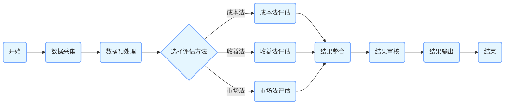

# 技术资产管理：价值评估系统

> 关键词：技术资产、价值评估系统、资产价值、评估模型、技术管理

> 摘要：本文围绕技术资产管理中的价值评估系统展开深入探讨。首先介绍了技术资产管理及价值评估系统的背景，明确其目的、预期读者和文档结构。接着阐述了核心概念与联系，通过文本示意图和 Mermaid 流程图进行直观展示。详细讲解了核心算法原理和具体操作步骤，并给出 Python 源代码示例。对相关数学模型和公式进行详细说明并举例。通过项目实战，展示开发环境搭建、源代码实现及解读。分析了该价值评估系统的实际应用场景，推荐了学习、开发相关的工具和资源，包括书籍、在线课程、论文等。最后总结未来发展趋势与挑战，给出常见问题解答和参考资料，旨在为技术资产管理中的价值评估提供全面且深入的技术指导和理论支持。

## 1. 背景介绍 
### 1.1 目的和范围
在当今高度竞争的商业环境中，技术资产已成为企业核心竞争力的重要组成部分。技术资产管理的价值评估系统旨在准确衡量企业技术资产的价值，为企业的战略决策、投资规划、风险管理等提供科学依据。本系统的范围涵盖了各种类型的技术资产，包括但不限于专利、软件、技术秘密、研发成果等。通过对这些技术资产的价值评估，帮助企业更好地管理和利用其技术资源，实现资产的最大化增值。

### 1.2 预期读者
本文的预期读者包括企业的技术管理人员、财务人员、投资决策人员、研发人员以及对技术资产管理和价值评估感兴趣的学者和研究人员。技术管理人员可以借助本系统更好地管理企业的技术资产，财务人员能够准确评估技术资产对企业财务状况的影响，投资决策人员可以依据评估结果做出合理的投资决策，研发人员可以了解自己的研发成果的价值，学者和研究人员则可以从理论和实践层面深入研究技术资产价值评估的方法和体系。

### 1.3 文档结构概述
本文将按照以下结构进行阐述：首先介绍技术资产管理和价值评估系统的背景信息，包括目的、预期读者和文档结构概述以及相关术语表。接着详细讲解核心概念与联系，通过文本示意图和 Mermaid 流程图清晰展示其原理和架构。然后深入探讨核心算法原理和具体操作步骤，并给出 Python 源代码示例。对涉及的数学模型和公式进行详细讲解并举例说明。通过项目实战展示系统的开发环境搭建、源代码实现及代码解读。分析该价值评估系统的实际应用场景，推荐学习和开发相关的工具和资源。最后总结未来发展趋势与挑战，给出常见问题解答和参考资料。

### 1.4 术语表
#### 1.4.1 核心术语定义
- **技术资产**：指企业拥有或控制的、能够为企业带来经济利益的、与技术相关的资源，包括专利、软件、技术秘密、研发成果等。
- **价值评估系统**：是一种用于评估技术资产价值的系统，通过一系列的算法、模型和方法，综合考虑各种因素，对技术资产的价值进行量化评估。
- **资产价值**：指技术资产在特定市场环境和条件下所具有的经济价值，通常以货币形式表示。
- **评估模型**：是价值评估系统中用于计算技术资产价值的数学模型，根据不同的评估方法和考虑因素构建。

#### 1.4.2 相关概念解释
- **无形资产**：是指企业拥有或控制的没有实物形态的可辨认非货币性资产，技术资产属于无形资产的范畴。与有形资产相比，无形资产的价值评估更为复杂，需要考虑更多的因素。
- **知识产权**：是指人们对其智力劳动成果所享有的法定权利，技术资产中的专利、软件著作权等都属于知识产权的范畴。知识产权的保护和管理对于技术资产的价值维护至关重要。

#### 1.4.3 缩略词列表
- **NPV**：Net Present Value，净现值，是一种用于评估投资项目价值的方法，在技术资产价值评估中也经常使用。
- **IRR**：Internal Rate of Return，内部收益率，是指使投资项目净现值为零的折现率，可用于评估技术资产投资的盈利能力。

## 2. 核心概念与联系 
### 核心概念原理
技术资产管理的价值评估系统基于多种原理构建。首先是经济学原理，技术资产的价值与其能够为企业带来的未来经济利益相关。通过对技术资产预期收益的预测和折现，可以估算其当前的价值。其次是市场原理，参考市场上类似技术资产的交易价格和市场需求情况，来确定被评估技术资产的价值。此外，还涉及到资产评估原理，综合考虑技术资产的成本、收益、市场等多方面因素，运用科学的评估方法进行价值评估。

### 架构的文本示意图
技术资产管理的价值评估系统主要由数据采集模块、评估模型模块、结果输出模块等组成。数据采集模块负责收集与技术资产相关的各种数据，包括技术资产的基本信息、研发成本、市场需求、竞争情况等。评估模型模块根据采集到的数据，运用不同的评估方法和模型进行价值评估。结果输出模块将评估结果以直观的方式呈现给用户，如报告、图表等。

### Mermaid 流程图


## 3. 核心算法原理 & 具体操作步骤 
### 核心算法原理
在技术资产价值评估中，常用的评估方法包括成本法、收益法和市场法。

#### 成本法
成本法的基本原理是基于技术资产的重置成本来评估其价值。重置成本是指在当前市场条件下，重新开发或购置与被评估技术资产具有相同功能和效用的资产所需的成本。成本法的计算公式为：
\[V = C - D + A\]
其中，$V$ 表示技术资产的评估价值，$C$ 表示重置成本，$D$ 表示实体性贬值、功能性贬值和经济性贬值之和，$A$ 表示技术资产的增值因素。

#### 收益法
收益法的核心思想是基于技术资产未来能够为企业带来的收益来评估其价值。通过预测技术资产在未来一定期限内的收益，并将其折现到当前时刻，得到技术资产的现值。收益法的计算公式为：
\[V=\sum_{i = 1}^{n}\frac{R_i}{(1 + r)^i}\]
其中，$V$ 表示技术资产的评估价值，$R_i$ 表示第 $i$ 年的预期收益，$r$ 表示折现率，$n$ 表示收益期限。

#### 市场法
市场法是通过比较被评估技术资产与市场上类似技术资产的交易价格，来确定被评估技术资产的价值。市场法的关键在于选择合适的可比交易案例，并对可比案例进行调整，以使其与被评估技术资产具有可比性。

### 具体操作步骤
#### 成本法操作步骤
1. **确定重置成本**：通过分析技术资产的研发成本、购置成本等，结合当前市场价格水平，确定重置成本。
2. **计算贬值因素**：分析技术资产的实体性贬值、功能性贬值和经济性贬值情况，确定贬值因素的数值。
3. **考虑增值因素**：评估技术资产的增值因素，如技术创新、市场需求增长等。
4. **计算评估价值**：根据成本法公式计算技术资产的评估价值。

#### 收益法操作步骤
1. **预测未来收益**：通过市场调研、技术分析等方法，预测技术资产在未来一定期限内的收益。
2. **确定折现率**：根据市场利率、风险因素等确定合适的折现率。
3. **计算现值**：将预测的未来收益按照折现率折现到当前时刻，计算技术资产的现值。

#### 市场法操作步骤
1. **选择可比案例**：在市场上选择与被评估技术资产类似的交易案例。
2. **调整可比案例**：对可比案例的交易价格进行调整，考虑交易时间、交易条件、技术差异等因素。
3. **确定评估价值**：根据调整后的可比案例价格，确定被评估技术资产的价值。

### Python 源代码示例
```python
# 成本法评估函数
def cost_method(replacement_cost, depreciation, appreciation):
    return replacement_cost - depreciation + appreciation

# 收益法评估函数
def income_method(expected_income, discount_rate, years):
    total_value = 0
    for i in range(1, years + 1):
        total_value += expected_income / (1 + discount_rate) ** i
    return total_value

# 示例数据
replacement_cost = 100000
depreciation = 20000
appreciation = 10000
expected_income = 30000
discount_rate = 0.1
years = 5

# 成本法评估结果
cost_value = cost_method(replacement_cost, depreciation, appreciation)
print(f"成本法评估价值: {cost_value}")

# 收益法评估结果
income_value = income_method(expected_income, discount_rate, years)
print(f"收益法评估价值: {income_value}")
```

## 4. 数学模型和公式 & 详细讲解 & 举例说明 
### 成本法数学模型和公式
成本法的数学模型为：
\[V = C - D + A\]
其中，$V$ 表示技术资产的评估价值，$C$ 表示重置成本，$D$ 表示实体性贬值、功能性贬值和经济性贬值之和，$A$ 表示技术资产的增值因素。

#### 详细讲解
- **重置成本（$C$）**：重置成本是指在当前市场条件下，重新开发或购置与被评估技术资产具有相同功能和效用的资产所需的成本。重置成本可以通过历史成本调整法、功能价值法等方法确定。
- **贬值因素（$D$）**：
    - **实体性贬值**：是指由于技术资产的物理磨损、自然损耗等原因导致的价值降低。
    - **功能性贬值**：是指由于技术进步、市场需求变化等原因，导致被评估技术资产的功能相对落后，从而引起的价值降低。
    - **经济性贬值**：是指由于外部经济环境变化，如市场竞争加剧、政策法规变化等原因，导致技术资产的收益减少，从而引起的价值降低。
- **增值因素（$A$）**：增值因素是指技术资产由于技术创新、市场需求增长等原因而带来的价值增加。

#### 举例说明
假设某企业拥有一项软件技术资产，重置成本为 50 万元，实体性贬值为 5 万元，功能性贬值为 3 万元，经济性贬值为 2 万元，增值因素为 8 万元。则该软件技术资产的评估价值为：
\[V = 50 - (5 + 3 + 2)+ 8 = 48\]（万元）

### 收益法数学模型和公式
收益法的数学模型为：
\[V=\sum_{i = 1}^{n}\frac{R_i}{(1 + r)^i}\]
其中，$V$ 表示技术资产的评估价值，$R_i$ 表示第 $i$ 年的预期收益，$r$ 表示折现率，$n$ 表示收益期限。

#### 详细讲解
- **预期收益（$R_i$）**：预期收益是指技术资产在未来一定期限内能够为企业带来的经济利益。预期收益的预测需要综合考虑市场需求、技术发展趋势、竞争情况等因素。
- **折现率（$r$）**：折现率是将未来收益折现到当前时刻的比率，反映了资金的时间价值和投资风险。折现率的确定需要考虑市场利率、行业风险、企业风险等因素。
- **收益期限（$n$）**：收益期限是指技术资产能够为企业带来收益的时间长度。收益期限的确定需要考虑技术资产的使用寿命、市场竞争情况、技术更新换代速度等因素。

#### 举例说明
假设某企业拥有一项专利技术，预计未来 3 年的预期收益分别为 20 万元、30 万元和 40 万元，折现率为 10%。则该专利技术的评估价值为：
\[V=\frac{20}{(1 + 0.1)^1}+\frac{30}{(1 + 0.1)^2}+\frac{40}{(1 + 0.1)^3}\]
\[V=\frac{20}{1.1}+\frac{30}{1.21}+\frac{40}{1.331}\]
\[V\approx18.18 + 24.79+ 30.06 = 73.03\]（万元）

### 市场法数学模型和公式
市场法的数学模型相对复杂，通常采用以下公式进行调整：
\[V = V_{c}\times\frac{F_{1}}{F_{2}}\times\frac{T_{1}}{T_{2}}\times\frac{M_{1}}{M_{2}}\]
其中，$V$ 表示被评估技术资产的价值，$V_{c}$ 表示可比案例的交易价格，$F_{1}$、$F_{2}$ 分别表示被评估技术资产和可比案例的功能系数，$T_{1}$、$T_{2}$ 分别表示被评估技术资产和可比案例的技术成熟度系数，$M_{1}$、$M_{2}$ 分别表示被评估技术资产和可比案例的市场环境系数。

#### 详细讲解
- **可比案例交易价格（$V_{c}$）**：可比案例交易价格是指市场上与被评估技术资产类似的技术资产的交易价格。选择可比案例时，需要考虑技术资产的类型、功能、技术水平、市场地位等因素。
- **功能系数（$F_{1}$、$F_{2}$）**：功能系数反映了被评估技术资产和可比案例在功能方面的差异。功能系数的确定需要根据技术资产的具体功能和性能指标进行评估。
- **技术成熟度系数（$T_{1}$、$T_{2}$）**：技术成熟度系数反映了被评估技术资产和可比案例在技术成熟度方面的差异。技术成熟度系数的确定需要考虑技术资产的研发阶段、技术稳定性、应用范围等因素。
- **市场环境系数（$M_{1}$、$M_{2}$）**：市场环境系数反映了被评估技术资产和可比案例在市场环境方面的差异。市场环境系数的确定需要考虑市场需求、市场竞争、政策法规等因素。

#### 举例说明
假设市场上有一个可比的技术资产交易案例，交易价格为 80 万元。被评估技术资产的功能系数为 1.2，可比案例的功能系数为 1，被评估技术资产的技术成熟度系数为 0.9，可比案例的技术成熟度系数为 1，被评估技术资产的市场环境系数为 1.1，可比案例的市场环境系数为 1。则被评估技术资产的价值为：
\[V = 80\times\frac{1.2}{1}\times\frac{0.9}{1}\times\frac{1.1}{1}=95.04\]（万元）

## 5. 项目实战：代码实际案例和详细解释说明 
### 5.1  开发环境搭建
#### 操作系统
本项目可以在 Windows、Linux 或 macOS 等主流操作系统上进行开发。建议使用 Linux 或 macOS 系统，因为它们在开发环境的配置和使用上更加方便。

#### 编程语言
本项目使用 Python 语言进行开发，Python 是一种功能强大、易于学习和使用的编程语言，拥有丰富的库和工具。建议使用 Python 3.7 及以上版本。

#### 开发工具
可以使用 PyCharm、VS Code 等集成开发环境（IDE）进行开发。PyCharm 是一款专门为 Python 开发设计的 IDE，提供了丰富的功能和插件，适合专业开发者使用。VS Code 是一款轻量级的代码编辑器，支持多种编程语言，具有良好的扩展性。

#### 依赖库安装
本项目需要安装一些必要的依赖库，如 `numpy`、`pandas` 等。可以使用 `pip` 命令进行安装：
```bash
pip install numpy pandas
```

### 5.2  源代码详细实现和代码解读
```python
import numpy as np
import pandas as pd

# 成本法评估函数
def cost_method(replacement_cost, depreciation, appreciation):
    """
    成本法评估技术资产价值
    :param replacement_cost: 重置成本
    :param depreciation: 贬值因素
    :param appreciation: 增值因素
    :return: 评估价值
    """
    return replacement_cost - depreciation + appreciation

# 收益法评估函数
def income_method(expected_income, discount_rate, years):
    """
    收益法评估技术资产价值
    :param expected_income: 每年预期收益
    :param discount_rate: 折现率
    :param years: 收益期限
    :return: 评估价值
    """
    total_value = 0
    for i in range(1, years + 1):
        total_value += expected_income / (1 + discount_rate) ** i
    return total_value

# 市场法评估函数
def market_method(comparable_price, function_coefficient, technology_coefficient, market_coefficient):
    """
    市场法评估技术资产价值
    :param comparable_price: 可比案例交易价格
    :param function_coefficient: 功能系数
    :param technology_coefficient: 技术成熟度系数
    :param market_coefficient: 市场环境系数
    :return: 评估价值
    """
    return comparable_price * function_coefficient * technology_coefficient * market_coefficient

# 主函数
def main():
    # 示例数据
    replacement_cost = 100000
    depreciation = 20000
    appreciation = 10000
    expected_income = 30000
    discount_rate = 0.1
    years = 5
    comparable_price = 80000
    function_coefficient = 1.2
    technology_coefficient = 0.9
    market_coefficient = 1.1

    # 成本法评估
    cost_value = cost_method(replacement_cost, depreciation, appreciation)
    print(f"成本法评估价值: {cost_value}")

    # 收益法评估
    income_value = income_method(expected_income, discount_rate, years)
    print(f"收益法评估价值: {income_value}")

    # 市场法评估
    market_value = market_method(comparable_price, function_coefficient, technology_coefficient, market_coefficient)
    print(f"市场法评估价值: {market_value}")

    # 综合评估（简单平均）
    average_value = (cost_value + income_value + market_value) / 3
    print(f"综合评估价值: {average_value}")

if __name__ == "__main__":
    main()
```

### 5.3  代码解读与分析
#### 成本法评估函数 `cost_method`
该函数接受重置成本、贬值因素和增值因素作为输入，根据成本法的计算公式计算技术资产的评估价值。

#### 收益法评估函数 `income_method`
该函数接受每年预期收益、折现率和收益期限作为输入，通过循环计算每年预期收益的现值，并将其累加得到技术资产的评估价值。

#### 市场法评估函数 `market_method`
该函数接受可比案例交易价格、功能系数、技术成熟度系数和市场环境系数作为输入，根据市场法的计算公式计算技术资产的评估价值。

#### 主函数 `main`
主函数中定义了示例数据，分别调用成本法、收益法和市场法评估函数进行价值评估，并计算综合评估价值（简单平均）。最后将评估结果打印输出。

## 6. 实际应用场景 
### 企业战略决策
在企业进行战略决策时，技术资产的价值评估起着重要的作用。例如，企业在考虑是否进行技术研发投资、技术转让、并购等决策时，需要准确了解技术资产的价值。通过价值评估系统，可以为企业提供科学的决策依据，帮助企业合理配置资源，提高决策的准确性和有效性。

### 财务报表编制
技术资产作为企业的重要资产之一，需要在财务报表中进行准确的计量和披露。价值评估系统可以帮助企业确定技术资产的入账价值和后续计量，确保财务报表的真实性和可靠性。同时，也有助于投资者、债权人等利益相关者了解企业的资产状况和财务实力。

### 技术交易
在技术交易市场中，技术资产的价值评估是确定交易价格的重要依据。买卖双方可以通过价值评估系统对技术资产的价值进行评估，从而达成合理的交易价格。这有助于促进技术资产的流通和交易，提高技术资源的利用效率。

### 风险管理
技术资产面临着各种风险，如技术过时、市场竞争、法律纠纷等。价值评估系统可以帮助企业及时了解技术资产的价值变化情况，识别潜在的风险因素，并采取相应的风险应对措施。例如，当技术资产的价值因技术进步而下降时，企业可以及时调整研发策略或进行技术升级。

## 7. 工具和资源推荐
### 7.1 学习资源推荐
#### 7.1.1 书籍推荐
- 《资产评估学》：全面介绍了资产评估的基本理论、方法和实务，包括技术资产价值评估的相关内容。
- 《无形资产评估》：专注于无形资产的评估方法和技术，对技术资产价值评估有深入的探讨。
- 《技术创新管理》：从技术创新的角度出发，介绍了技术资产的管理和评估方法，有助于理解技术资产的价值形成机制。

#### 7.1.2 在线课程
- Coursera 上的“资产评估基础”课程：由知名高校的教授授课，系统介绍了资产评估的基本概念、方法和应用。
- edX 上的“无形资产评估与管理”课程：深入探讨了无形资产的评估和管理问题，包括技术资产的价值评估。
- 中国大学 MOOC 上的“技术经济学”课程：结合经济学原理和技术创新实践，介绍了技术资产的经济评价方法。

#### 7.1.3 技术博客和网站
- 中国资产评估协会官网：提供了丰富的资产评估行业资讯、政策法规和专业标准，是了解资产评估领域最新动态的重要渠道。
- 价值评估论坛：是一个专业的价值评估交流平台，汇聚了众多资产评估专家和从业者，可在上面交流技术资产价值评估的经验和心得。
- 技术创新管理研究网：专注于技术创新和管理领域的研究和交流，提供了大量关于技术资产价值评估的研究成果和案例分析。

### 7.2 开发工具框架推荐
#### 7.2.1 IDE和编辑器
- PyCharm：一款功能强大的 Python 集成开发环境，提供了代码编辑、调试、版本控制等丰富的功能，适合专业 Python 开发者使用。
- VS Code：一款轻量级的代码编辑器，支持多种编程语言，具有良好的扩展性，可以通过安装插件来实现 Python 开发的各种功能。

#### 7.2.2 调试和性能分析工具
- PDB：Python 自带的调试工具，可以帮助开发者在代码中设置断点、单步执行、查看变量值等，方便进行代码调试。
- cProfile：Python 标准库中的性能分析工具，可以帮助开发者分析代码的执行时间和性能瓶颈，优化代码性能。

#### 7.2.3 相关框架和库
- NumPy：一个用于科学计算的 Python 库，提供了高效的数组操作和数学函数，可用于技术资产价值评估中的数值计算。
- Pandas：一个用于数据处理和分析的 Python 库，提供了数据结构和数据分析工具，可用于处理和分析技术资产相关的数据。

### 7.3 相关论文著作推荐
#### 7.3.1 经典论文
- 《无形资产价值评估方法研究》：对无形资产的价值评估方法进行了系统的研究和总结，为技术资产价值评估提供了理论基础。
- 《技术资产定价模型研究》：提出了一种基于期权定价理论的技术资产定价模型，为技术资产的价值评估提供了新的思路和方法。
- 《基于实物期权的技术创新项目价值评估》：将实物期权理论应用于技术创新项目的价值评估，考虑了技术创新项目的不确定性和灵活性。

#### 7.3.2 最新研究成果
- 近年来，随着人工智能、大数据等技术的发展，一些学者开始将这些技术应用于技术资产价值评估中，如基于机器学习的价值评估模型、基于大数据的市场分析等。可以关注相关领域的学术期刊和会议论文，了解最新的研究成果。

#### 7.3.3 应用案例分析
- 一些专业的资产评估机构和咨询公司会发布技术资产价值评估的应用案例分析报告，可以通过这些报告了解实际项目中技术资产价值评估的方法和经验。

## 8. 总结：未来发展趋势与挑战
### 未来发展趋势
#### 数字化和智能化
随着信息技术的快速发展，技术资产价值评估系统将越来越数字化和智能化。利用大数据、人工智能等技术，可以实现数据的自动采集、分析和处理，提高评估的准确性和效率。同时，智能化的评估模型可以根据不同的情况自动调整评估参数，提高评估的灵活性和适应性。

#### 综合评估方法的应用
单一的评估方法往往难以全面准确地评估技术资产的价值。未来，综合评估方法将得到更广泛的应用，结合成本法、收益法、市场法等多种方法，综合考虑技术资产的成本、收益、市场等多方面因素，提高评估的准确性和可靠性。

#### 国际化和标准化
随着经济全球化的发展，技术资产的跨国交易越来越频繁。为了促进技术资产的国际流通和交易，技术资产价值评估的国际化和标准化将成为未来的发展趋势。国际评估准则和标准将得到更广泛的应用和认可，不同国家和地区的评估方法和标准将逐渐趋于统一。

### 挑战
#### 数据质量和可靠性
技术资产价值评估需要大量的数据支持，包括技术资产的研发成本、市场需求、竞争情况等。然而，数据的质量和可靠性往往难以保证，存在数据不准确、不完整、不一致等问题。如何提高数据的质量和可靠性，是技术资产价值评估面临的一个重要挑战。

#### 评估方法的局限性
目前的技术资产价值评估方法存在一定的局限性，如成本法难以考虑技术资产的未来收益，收益法对未来收益的预测存在较大的不确定性，市场法难以找到完全可比的交易案例等。如何克服评估方法的局限性，提高评估的准确性和可靠性，是技术资产价值评估需要解决的关键问题。

#### 技术创新的快速发展
技术创新的快速发展使得技术资产的更新换代速度加快，技术资产的价值也随之发生变化。如何及时准确地评估技术资产的价值，适应技术创新的快速发展，是技术资产价值评估面临的又一个挑战。

## 9. 附录：常见问题与解答
### 问题 1：技术资产价值评估的准确性如何保证？
答：技术资产价值评估的准确性受到多种因素的影响，如数据质量、评估方法的选择、评估人员的专业水平等。为了保证评估的准确性，需要采取以下措施：
- 确保数据的准确性和完整性，通过多种渠道收集数据，并进行数据清洗和验证。
- 根据技术资产的特点和评估目的，选择合适的评估方法，并结合多种评估方法进行综合评估。
- 提高评估人员的专业水平，加强评估人员的培训和继续教育，使其掌握最新的评估理论和方法。

### 问题 2：如何选择合适的评估方法？
答：选择合适的评估方法需要考虑以下因素：
- 技术资产的特点：不同类型的技术资产具有不同的特点，如专利技术的创新性、软件技术的功能性等。需要根据技术资产的特点选择合适的评估方法。
- 评估目的：评估目的不同，选择的评估方法也会不同。如为了企业战略决策进行的评估，可能更注重技术资产的未来收益；为了技术交易进行的评估，可能更注重市场上类似技术资产的交易价格。
- 数据的可获取性：评估方法的选择还需要考虑数据的可获取性。如果某些数据难以获取，可能需要选择对数据要求较低的评估方法。

### 问题 3：技术资产价值评估的周期是多久？
答：技术资产价值评估的周期因评估对象的复杂程度、评估方法的选择、数据的收集和分析等因素而异。一般来说，简单的技术资产价值评估可能需要几天到几周的时间，而复杂的技术资产价值评估可能需要几个月甚至更长的时间。

## 10. 扩展阅读 & 参考资料
### 扩展阅读
- 《企业技术创新与知识产权管理》：深入探讨了企业技术创新和知识产权管理的相关问题，有助于进一步理解技术资产的价值和管理。
- 《金融科技与资产评估》：介绍了金融科技在资产评估领域的应用，包括大数据、人工智能等技术在技术资产价值评估中的应用。

### 参考资料
- 中国资产评估协会发布的《资产评估准则》
- 相关学术期刊，如《中国资产评估》《管理世界》等
- 国内外知名评估机构的研究报告和案例分析