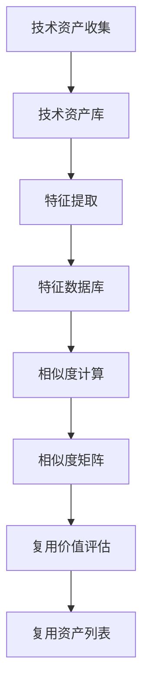

# 技术资产管理：智能复用评估

> 关键词：技术资产管理、智能复用评估、资产复用、技术资产、评估模型、数据驱动、复用效益

> 摘要：本文围绕技术资产管理中的智能复用评估展开深入探讨。首先介绍了技术资产管理及智能复用评估的背景和相关概念，详细阐述了智能复用评估的核心算法原理、数学模型和公式。通过项目实战展示了代码实现和具体应用过程，分析了智能复用评估在不同场景下的实际应用。同时推荐了相关的学习资源、开发工具和论文著作，最后对未来技术资产管理中智能复用评估的发展趋势与挑战进行总结，并提供常见问题解答和扩展阅读参考资料，旨在为技术资产的有效管理和复用提供全面的理论与实践指导。

## 1. 背景介绍 
### 1.1 目的和范围
技术资产管理是企业管理中的重要组成部分，有效的技术资产管理能够帮助企业降低成本、提高效率、增强创新能力。智能复用评估作为技术资产管理的关键环节，旨在通过对技术资产的智能分析和评估，确定哪些资产具有复用价值，从而实现技术资产的高效利用。

本文的范围涵盖了技术资产管理中智能复用评估的各个方面，包括核心概念、算法原理、数学模型、实际应用案例等，旨在为读者提供全面而深入的理解和实践指导。

### 1.2 预期读者
本文预期读者包括技术管理人员、软件开发人员、数据分析师、企业管理者以及对技术资产管理和智能复用评估感兴趣的研究人员。对于技术管理人员，本文可以帮助他们更好地规划和管理技术资产；软件开发人员可以从中获取关于资产复用的技术实现思路；数据分析师能够学习到相关的评估算法和数据分析方法；企业管理者可以了解智能复用评估对企业发展的重要意义；研究人员则可以将本文作为进一步研究的参考资料。

### 1.3 文档结构概述
本文将按照以下结构进行组织：首先介绍技术资产管理及智能复用评估的背景知识和相关术语；接着阐述核心概念和它们之间的联系，并通过文本示意图和 Mermaid 流程图进行直观展示；然后详细讲解智能复用评估的核心算法原理和具体操作步骤，结合 Python 源代码进行说明；再介绍相关的数学模型和公式，并举例说明；通过项目实战展示代码实现和详细解释；分析智能复用评估的实际应用场景；推荐相关的学习资源、开发工具和论文著作；最后总结未来发展趋势与挑战，提供常见问题解答和扩展阅读参考资料。

### 1.4 术语表
#### 1.4.1 核心术语定义
- **技术资产**：指企业在技术研发、生产过程中积累的具有价值的技术成果，包括软件代码、算法模型、技术文档、专利等。
- **智能复用评估**：利用人工智能和数据分析技术，对技术资产进行全面、客观的评估，以确定其复用价值和可行性的过程。
- **资产复用**：将已有的技术资产应用到新的项目或业务场景中，以减少重复开发，提高效率和质量。
- **复用效益**：资产复用所带来的经济效益、时间效益和质量效益等。

#### 1.4.2 相关概念解释
- **技术资产库**：存储企业技术资产的数据库或知识库，用于集中管理和检索技术资产。
- **相似度分析**：通过比较技术资产之间的特征和结构，计算它们的相似程度，以判断是否具有复用的可能性。
- **数据驱动**：在智能复用评估中，依靠大量的数据和数据分析方法来支持决策和评估过程。

#### 1.4.3 缩略词列表
- **AI**：Artificial Intelligence，人工智能
- **ML**：Machine Learning，机器学习
- **NLP**：Natural Language Processing，自然语言处理
- **API**：Application Programming Interface，应用程序编程接口

## 2. 核心概念与联系 

### 核心概念原理
技术资产管理中的智能复用评估主要基于以下几个核心概念：
- **资产特征提取**：从技术资产中提取关键特征，如代码的结构、功能、复杂度，文档的主题、内容等。这些特征是后续评估和比较的基础。
- **相似度计算**：通过特定的算法计算不同技术资产之间的相似度。相似度越高，说明资产之间的复用可能性越大。
- **复用价值评估**：综合考虑资产的相似度、成本、效益等因素，评估资产的复用价值。复用价值高的资产优先考虑复用。

### 架构的文本示意图
智能复用评估的架构可以描述为：首先，技术资产被收集并存储在技术资产库中。然后，对资产进行特征提取，将提取的特征存储在特征数据库中。接着，利用相似度计算算法对特征进行比较，得到资产之间的相似度矩阵。最后，根据相似度矩阵和其他评估指标，进行复用价值评估，输出具有复用价值的资产列表。

### Mermaid 流程图


## 3. 核心算法原理 & 具体操作步骤 

### 核心算法原理
智能复用评估的核心算法主要包括特征提取算法、相似度计算算法和复用价值评估算法。

#### 特征提取算法
对于代码资产，可以使用抽象语法树（AST）来提取代码的结构特征。以下是一个简单的 Python 示例，使用 `ast` 模块提取代码的函数定义数量：
```python
import ast

def count_function_definitions(code):
    tree = ast.parse(code)
    count = 0
    for node in ast.walk(tree):
        if isinstance(node, ast.FunctionDef):
            count += 1
    return count

code = """
def add(a, b):
    return a + b

def multiply(a, b):
    return a * b
"""

print(count_function_definitions(code))
```

对于文档资产，可以使用词袋模型（Bag of Words）或词嵌入（Word Embedding）来提取文本特征。以下是一个使用 `sklearn` 库的词袋模型示例：
```python
from sklearn.feature_extraction.text import CountVectorizer

corpus = [
    "This is the first document.",
    "This document is the second document.",
    "And this is the third one.",
    "Is this the first document?"
]

vectorizer = CountVectorizer()
X = vectorizer.fit_transform(corpus)
print(vectorizer.get_feature_names_out())
print(X.toarray())
```

#### 相似度计算算法
常用的相似度计算算法包括余弦相似度、欧几里得距离等。以下是一个使用余弦相似度计算两个向量相似度的 Python 示例：
```python
import numpy as np
from sklearn.metrics.pairwise import cosine_similarity

vector1 = np.array([1, 2, 3]).reshape(1, -1)
vector2 = np.array([4, 5, 6]).reshape(1, -1)

similarity = cosine_similarity(vector1, vector2)
print(similarity)
```

#### 复用价值评估算法
复用价值评估需要综合考虑多个因素，如相似度、成本、效益等。可以使用加权平均的方法来计算复用价值。以下是一个简单的示例：
```python
def reuse_value_evaluation(similarity, cost, benefit, weight_similarity=0.5, weight_cost=0.2, weight_benefit=0.3):
    return weight_similarity * similarity - weight_cost * cost + weight_benefit * benefit

similarity = 0.8
cost = 0.2
benefit = 0.6

reuse_value = reuse_value_evaluation(similarity, cost, benefit)
print(reuse_value)
```

### 具体操作步骤
1. **技术资产收集**：从企业的各个项目和部门中收集技术资产，包括代码、文档、模型等。
2. **资产预处理**：对收集到的资产进行清洗、格式化等预处理操作，以便后续的特征提取。
3. **特征提取**：根据资产的类型，选择合适的特征提取算法，提取资产的关键特征。
4. **相似度计算**：使用相似度计算算法，计算资产之间的相似度。
5. **复用价值评估**：综合考虑相似度、成本、效益等因素，评估资产的复用价值。
6. **输出复用资产列表**：根据复用价值的高低，输出具有复用价值的资产列表，供企业决策参考。

## 4. 数学模型和公式 & 详细讲解 & 举例说明 

### 特征提取数学模型
#### 词袋模型
词袋模型将文本表示为一个向量，向量的每个维度对应一个词汇，向量的值表示该词汇在文本中出现的频率。假设文本集合 $D = \{d_1, d_2, \cdots, d_n\}$，词汇表 $V = \{v_1, v_2, \cdots, v_m\}$，则文本 $d_i$ 的词袋向量 $\mathbf{x}_i$ 可以表示为：
$$\mathbf{x}_i = [x_{i1}, x_{i2}, \cdots, x_{im}]$$
其中，$x_{ij}$ 表示词汇 $v_j$ 在文本 $d_i$ 中出现的频率。

例如，对于文本集合 $D = \{"apple banana", "banana cherry"\}$，词汇表 $V = \{"apple", "banana", "cherry"\}$，则文本 "apple banana" 的词袋向量为 $\mathbf{x}_1 = [1, 1, 0]$，文本 "banana cherry" 的词袋向量为 $\mathbf{x}_2 = [0, 1, 1]$。

#### 抽象语法树
抽象语法树（AST）是代码的一种树形表示，通过对 AST 的遍历和分析，可以提取代码的结构特征。例如，计算代码中函数定义的数量可以通过遍历 AST 中的函数定义节点来实现。

### 相似度计算数学模型
#### 余弦相似度
余弦相似度用于计算两个向量之间的夹角余弦值，取值范围为 $[-1, 1]$，值越接近 1 表示两个向量越相似。假设两个向量 $\mathbf{a} = [a_1, a_2, \cdots, a_n]$ 和 $\mathbf{b} = [b_1, b_2, \cdots, b_n]$，则它们的余弦相似度 $sim(\mathbf{a}, \mathbf{b})$ 可以表示为：
$$sim(\mathbf{a}, \mathbf{b}) = \frac{\mathbf{a} \cdot \mathbf{b}}{\|\mathbf{a}\| \|\mathbf{b}\|} = \frac{\sum_{i=1}^{n} a_i b_i}{\sqrt{\sum_{i=1}^{n} a_i^2} \sqrt{\sum_{i=1}^{n} b_i^2}}$$

例如，对于向量 $\mathbf{a} = [1, 2, 3]$ 和 $\mathbf{b} = [4, 5, 6]$，则它们的余弦相似度为：
$$sim(\mathbf{a}, \mathbf{b}) = \frac{1\times4 + 2\times5 + 3\times6}{\sqrt{1^2 + 2^2 + 3^2} \sqrt{4^2 + 5^2 + 6^2}} \approx 0.9747$$

#### 欧几里得距离
欧几里得距离用于计算两个向量之间的直线距离，距离越小表示两个向量越相似。假设两个向量 $\mathbf{a} = [a_1, a_2, \cdots, a_n]$ 和 $\mathbf{b} = [b_1, b_2, \cdots, b_n]$，则它们的欧几里得距离 $dist(\mathbf{a}, \mathbf{b})$ 可以表示为：
$$dist(\mathbf{a}, \mathbf{b}) = \sqrt{\sum_{i=1}^{n} (a_i - b_i)^2}$$

例如，对于向量 $\mathbf{a} = [1, 2, 3]$ 和 $\mathbf{b} = [4, 5, 6]$，则它们的欧几里得距离为：
$$dist(\mathbf{a}, \mathbf{b}) = \sqrt{(1 - 4)^2 + (2 - 5)^2 + (3 - 6)^2} = \sqrt{9 + 9 + 9} = 3\sqrt{3} \approx 5.1962$$

### 复用价值评估数学模型
复用价值评估可以使用加权平均的方法，综合考虑相似度、成本、效益等因素。假设相似度为 $S$，成本为 $C$，效益为 $B$，权重分别为 $w_S$、$w_C$、$w_B$，则复用价值 $RV$ 可以表示为：
$$RV = w_S S - w_C C + w_B B$$

例如，假设 $S = 0.8$，$C = 0.2$，$B = 0.6$，$w_S = 0.5$，$w_C = 0.2$，$w_B = 0.3$，则复用价值为：
$$RV = 0.5\times0.8 - 0.2\times0.2 + 0.3\times0.6 = 0.4 - 0.04 + 0.18 = 0.54$$

## 5. 项目实战：代码实际案例和详细解释说明 

### 5.1  开发环境搭建
- **操作系统**：推荐使用 Linux 或 macOS 系统，也可以使用 Windows 系统。
- **编程语言**：Python 3.x
- **开发工具**：推荐使用 PyCharm 或 VS Code 作为集成开发环境（IDE）。
- **依赖库**：安装 `numpy`、`scikit-learn`、`ast` 等必要的 Python 库。可以使用以下命令进行安装：
```sh
pip install numpy scikit-learn
```

### 5.2  源代码详细实现和代码解读
以下是一个完整的智能复用评估项目示例，包括代码资产的特征提取、相似度计算和复用价值评估：

```python
import ast
import numpy as np
from sklearn.metrics.pairwise import cosine_similarity

# 特征提取：计算代码中函数定义的数量
def count_function_definitions(code):
    tree = ast.parse(code)
    count = 0
    for node in ast.walk(tree):
        if isinstance(node, ast.FunctionDef):
            count += 1
    return count

# 相似度计算：使用余弦相似度
def calculate_similarity(vector1, vector2):
    vector1 = np.array(vector1).reshape(1, -1)
    vector2 = np.array(vector2).reshape(1, -1)
    return cosine_similarity(vector1, vector2)[0][0]

# 复用价值评估
def reuse_value_evaluation(similarity, cost, benefit, weight_similarity=0.5, weight_cost=0.2, weight_benefit=0.3):
    return weight_similarity * similarity - weight_cost * cost + weight_benefit * benefit

# 示例代码资产
code1 = """
def add(a, b):
    return a + b

def multiply(a, b):
    return a * b
"""

code2 = """
def subtract(a, b):
    return a - b

def divide(a, b):
    if b != 0:
        return a / b
    else:
        return None
"""

# 特征提取
feature1 = count_function_definitions(code1)
feature2 = count_function_definitions(code2)

# 构建特征向量
vector1 = [feature1]
vector2 = [feature2]

# 相似度计算
similarity = calculate_similarity(vector1, vector2)

# 假设成本和效益
cost = 0.2
benefit = 0.6

# 复用价值评估
reuse_value = reuse_value_evaluation(similarity, cost, benefit)

print(f"特征1: {feature1}")
print(f"特征2: {feature2}")
print(f"相似度: {similarity}")
print(f"复用价值: {reuse_value}")
```

### 5.3  代码解读与分析
- **特征提取**：`count_function_definitions` 函数使用 `ast` 模块解析代码的抽象语法树，统计函数定义的数量作为代码的特征。
- **相似度计算**：`calculate_similarity` 函数使用 `sklearn` 库的 `cosine_similarity` 函数计算两个特征向量的余弦相似度。
- **复用价值评估**：`reuse_value_evaluation` 函数根据相似度、成本和效益，使用加权平均的方法计算复用价值。
- **示例代码**：定义了两个示例代码资产 `code1` 和 `code2`，提取它们的特征，计算相似度和复用价值，并输出结果。

## 6. 实际应用场景 
### 软件开发领域
在软件开发中，智能复用评估可以帮助开发团队快速找到可复用的代码模块，减少重复开发，提高开发效率。例如，当开发一个新的项目时，可以通过智能复用评估从已有的代码库中找到相似的功能模块，直接复用或进行适当修改，从而节省开发时间和成本。

### 数据科学领域
在数据科学中，智能复用评估可以用于评估数据模型、数据处理流程等的复用价值。例如，当进行新的数据分析任务时，可以通过评估已有的数据模型和处理流程，判断是否可以复用，避免重复构建模型和开发处理流程。

### 企业知识管理领域
在企业知识管理中，智能复用评估可以帮助企业更好地管理和利用知识资产。例如，通过对企业内部的技术文档、案例分析等知识资产进行智能复用评估，将有价值的知识资产推荐给相关人员，促进知识的共享和复用。

## 7. 工具和资源推荐
### 7.1 学习资源推荐
#### 7.1.1 书籍推荐
- 《Python 数据分析实战》：介绍了 Python 在数据分析中的应用，包括数据处理、特征提取、模型评估等内容，对智能复用评估中的数据分析部分有很好的参考价值。
- 《人工智能：一种现代的方法》：全面介绍了人工智能的基本概念、算法和应用，对于理解智能复用评估中的人工智能技术有很大帮助。
- 《软件工程：实践者的研究方法》：讲解了软件工程的基本原理和方法，对于技术资产管理和资产复用有深入的阐述。

#### 7.1.2 在线课程
- Coursera 上的“机器学习”课程：由斯坦福大学教授 Andrew Ng 讲授，系统地介绍了机器学习的基本算法和应用，是学习智能复用评估中机器学习算法的优质课程。
- edX 上的“数据科学基础”课程：提供了数据科学的基础知识和实践技能，包括数据处理、数据分析、机器学习等内容，对智能复用评估中的数据处理和分析有很大帮助。
- 中国大学 MOOC 上的“软件工程”课程：介绍了软件工程的基本概念、方法和技术，对于理解技术资产管理和资产复用有重要意义。

#### 7.1.3 技术博客和网站
- Medium：是一个技术博客平台，有很多关于人工智能、数据分析、软件工程等领域的优秀文章，可以从中获取最新的技术动态和实践经验。
- Stack Overflow：是一个程序员社区，提供了大量的技术问题解答和代码示例，对于解决智能复用评估中的技术问题有很大帮助。
- 开源中国：是一个国内的开源技术社区，有很多关于软件开发、技术管理等方面的文章和资源，可以了解国内的技术发展动态。

### 7.2 开发工具框架推荐
#### 7.2.1 IDE和编辑器
- PyCharm：是一款专门为 Python 开发设计的集成开发环境，具有强大的代码编辑、调试、版本控制等功能，适合开发智能复用评估相关的 Python 代码。
- VS Code：是一款轻量级的代码编辑器，支持多种编程语言和插件扩展，具有丰富的功能和良好的用户体验，也可以用于智能复用评估的开发。

#### 7.2.2 调试和性能分析工具
- PDB：是 Python 自带的调试工具，可以帮助开发者调试 Python 代码，查找和解决代码中的问题。
- cProfile：是 Python 的性能分析工具，可以分析代码的执行时间和函数调用情况，帮助开发者优化代码性能。

#### 7.2.3 相关框架和库
- Scikit-learn：是一个常用的机器学习库，提供了丰富的机器学习算法和工具，如分类、回归、聚类、特征提取等，在智能复用评估中可以用于相似度计算和复用价值评估。
- TensorFlow：是一个开源的深度学习框架，可用于处理复杂的数据分析和模型训练任务，在智能复用评估中可以用于处理大规模的技术资产数据。
- Pandas：是一个用于数据处理和分析的 Python 库，提供了高效的数据结构和数据操作方法，在智能复用评估中可以用于数据清洗、整理和分析。

### 7.3 相关论文著作推荐
#### 7.3.1 经典论文
- “A Survey on Software Reuse”：对软件复用的概念、方法和技术进行了全面的综述，是软件复用领域的经典论文。
- “Machine Learning for Software Engineering”：介绍了机器学习在软件工程中的应用，包括软件缺陷预测、代码推荐等方面，对于智能复用评估有重要的参考价值。

#### 7.3.2 最新研究成果
- 关注顶级学术会议如 ICSE（International Conference on Software Engineering）、KDD（Knowledge Discovery and Data Mining）等的最新研究成果，了解智能复用评估领域的最新技术和方法。
- 查阅相关学术期刊如 IEEE Transactions on Software Engineering、ACM Transactions on Software Engineering and Methodology 等的最新论文，获取智能复用评估的前沿研究动态。

#### 7.3.3 应用案例分析
- 一些企业和研究机构会发布智能复用评估的应用案例，可以通过查阅相关的技术报告和案例分析，了解智能复用评估在实际应用中的效果和经验。

## 8. 总结：未来发展趋势与挑战
### 未来发展趋势
- **智能化程度不断提高**：随着人工智能技术的不断发展，智能复用评估将更加智能化，能够自动识别和提取技术资产的特征，更准确地评估资产的复用价值。
- **与大数据和云计算的结合**：借助大数据和云计算技术，智能复用评估可以处理大规模的技术资产数据，提高评估的效率和准确性。
- **跨领域复用**：未来智能复用评估将不仅局限于单一领域，而是实现跨领域的技术资产复用，促进不同领域之间的技术交流和创新。

### 挑战
- **数据质量问题**：技术资产数据的质量直接影响智能复用评估的准确性和可靠性。如何保证数据的完整性、准确性和一致性是一个挑战。
- **知识产权问题**：在资产复用过程中，涉及到知识产权的保护和授权问题。如何平衡资产复用和知识产权保护之间的关系是需要解决的问题。
- **评估标准的统一**：不同企业和领域对于技术资产的复用价值评估标准可能不同，如何建立统一的评估标准和方法是一个挑战。

## 9. 附录：常见问题与解答
### 问题 1：如何选择合适的特征提取算法？
解答：选择合适的特征提取算法需要根据技术资产的类型和特点来决定。对于代码资产，可以使用抽象语法树、代码复杂度分析等方法；对于文档资产，可以使用词袋模型、词嵌入等方法。同时，还可以根据具体的应用场景和需求，选择合适的特征进行提取。

### 问题 2：相似度计算的结果如何解释？
解答：相似度计算的结果通常是一个数值，不同的相似度计算方法有不同的取值范围。例如，余弦相似度的取值范围是 $[-1, 1]$，值越接近 1 表示两个资产越相似；欧几里得距离的取值范围是 $[0, +\infty)$，值越小表示两个资产越相似。在实际应用中，可以根据具体的业务需求，设定一个相似度阈值，当相似度超过阈值时，认为两个资产具有复用的可能性。

### 问题 3：如何确定复用价值评估中的权重？
解答：复用价值评估中的权重可以根据企业的战略目标、业务需求和实际情况来确定。例如，如果企业更注重成本控制，可以适当提高成本的权重；如果企业更注重效益，可以适当提高效益的权重。可以通过专家评估、数据分析等方法来确定合理的权重。

## 10. 扩展阅读 & 参考资料
- 相关的学术论文和研究报告，可以在学术数据库如 IEEE Xplore、ACM Digital Library 等中查找。
- 企业的技术文档和案例分析，可以通过企业的官方网站、技术博客等渠道获取。
- 行业标准和规范，如 ISO 9000 系列质量管理标准、CMMI 软件能力成熟度模型集成等，对于技术资产管理和资产复用有一定的指导作用。

以上是关于技术资产管理中智能复用评估的详细介绍，希望对读者有所帮助。在实际应用中，需要根据具体情况进行调整和优化，以实现技术资产的高效管理和复用。