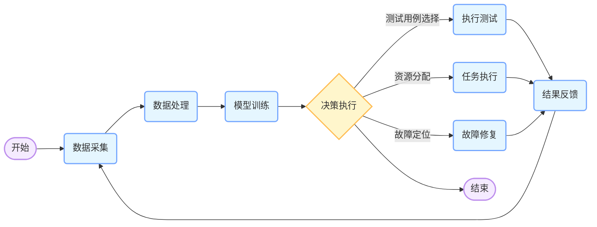

# 持续集成的下一代形态：AI驱动的管道

> 关键词：持续集成、AI驱动、管道、软件开发、自动化、智能决策、效率提升

> 摘要：本文聚焦于持续集成的下一代形态——AI驱动的管道。在当今快速发展的软件开发领域，持续集成已成为提高开发效率和软件质量的关键实践。而随着人工智能技术的不断进步，将AI融入持续集成管道中，有望带来全新的变革。文章首先介绍了相关背景，包括目的范围、预期读者等内容。接着阐述了核心概念与联系，深入讲解了AI驱动的持续集成管道的原理和架构。通过Python代码详细说明了核心算法原理及具体操作步骤，并结合数学模型和公式进行分析。以项目实战为例，展示了代码的实际案例及详细解释。探讨了该技术的实际应用场景，推荐了相关的工具和资源。最后总结了未来发展趋势与挑战，解答了常见问题并提供了扩展阅读和参考资料，旨在为读者全面呈现AI驱动的持续集成管道的全貌和价值。

## 1. 背景介绍 
### 1.1 目的和范围
在软件开发过程中，持续集成（Continuous Integration，CI）是一种至关重要的实践，它强调频繁地将代码集成到共享仓库中，并通过自动化测试来验证集成的正确性。然而，随着软件系统的复杂性不断增加，传统的持续集成方式面临着诸多挑战，如测试用例的选择、资源的分配、故障的快速定位等。本文的目的在于探讨如何利用人工智能技术来改进持续集成管道，实现更加智能、高效的软件开发流程。

本文的范围涵盖了AI驱动的持续集成管道的核心概念、算法原理、数学模型、实际应用案例等方面。通过对这些内容的深入研究，旨在为软件开发人员、测试人员、项目管理人员等提供全面的技术指导和实践参考。

### 1.2 预期读者
本文的预期读者主要包括以下几类人群：
1. **软件开发人员**：希望了解如何利用AI技术优化持续集成流程，提高开发效率和代码质量。
2. **测试人员**：对如何借助AI实现更智能的测试用例选择和执行，以及快速定位软件缺陷感兴趣。
3. **项目管理人员**：关注如何通过AI驱动的持续集成管道提升项目的整体管理效率和资源利用率。
4. **技术研究者**：致力于研究人工智能与软件开发领域的交叉应用，探索新的技术发展方向。

### 1.3 文档结构概述
本文将按照以下结构进行组织：
1. **背景介绍**：阐述本文的目的和范围、预期读者、文档结构概述以及相关术语表。
2. **核心概念与联系**：介绍AI驱动的持续集成管道的核心概念、原理和架构，并通过文本示意图和Mermaid流程图进行展示。
3. **核心算法原理 & 具体操作步骤**：使用Python源代码详细讲解核心算法原理，并给出具体的操作步骤。
4. **数学模型和公式 & 详细讲解 & 举例说明**：介绍相关的数学模型和公式，并通过具体例子进行说明。
5. **项目实战：代码实际案例和详细解释说明**：展示一个实际的项目案例，包括开发环境搭建、源代码详细实现和代码解读。
6. **实际应用场景**：探讨AI驱动的持续集成管道在不同领域的实际应用场景。
7. **工具和资源推荐**：推荐相关的学习资源、开发工具框架和论文著作。
8. **总结：未来发展趋势与挑战**：总结AI驱动的持续集成管道的未来发展趋势，并分析可能面临的挑战。
9. **附录：常见问题与解答**：解答读者在阅读过程中可能遇到的常见问题。
10. **扩展阅读 & 参考资料**：提供相关的扩展阅读材料和参考资料。

### 1.4 术语表
#### 1.4.1 核心术语定义
1. **持续集成（Continuous Integration，CI）**：软件开发中的一种实践，强调频繁地将代码集成到共享仓库中，并通过自动化测试来验证集成的正确性。
2. **AI驱动的管道（AI-driven Pipeline）**：将人工智能技术融入持续集成管道中，实现智能决策、自动化优化等功能的软件开发流程。
3. **测试用例选择（Test Case Selection）**：从大量的测试用例中选择出最有可能发现软件缺陷的测试用例进行执行的过程。
4. **资源分配（Resource Allocation）**：根据任务的需求和资源的可用性，合理分配计算资源、存储资源等的过程。
5. **故障定位（Fault Localization）**：在软件出现故障时，快速确定故障发生的位置和原因的过程。

#### 1.4.2 相关概念解释
1. **机器学习（Machine Learning）**：人工智能的一个分支，通过让计算机从数据中学习模式和规律，从而实现预测、分类等任务。
2. **深度学习（Deep Learning）**：一种基于人工神经网络的机器学习方法，通过多层神经网络自动提取数据的特征，在图像识别、自然语言处理等领域取得了显著的成果。
3. **自动化测试（Automated Testing）**：使用自动化工具执行测试用例，验证软件功能和性能的过程，能够提高测试效率和准确性。

#### 1.4.3 缩略词列表
1. **CI**：Continuous Integration（持续集成）
2. **AI**：Artificial Intelligence（人工智能）
3. **ML**：Machine Learning（机器学习）
4. **DL**：Deep Learning（深度学习）
5. **AT**：Automated Testing（自动化测试）

## 2. 核心概念与联系 

### 核心概念原理
AI驱动的持续集成管道是将人工智能技术与传统的持续集成流程相结合，通过机器学习、深度学习等算法对软件开发过程中的各种数据进行分析和处理，实现智能决策和自动化优化。其核心原理在于利用人工智能的强大计算能力和学习能力，对软件开发过程中的各个环节进行优化和改进，提高开发效率和软件质量。

具体来说，AI驱动的持续集成管道主要涉及以下几个方面的核心概念：
1. **智能测试用例选择**：利用机器学习算法对历史测试数据进行分析，预测哪些测试用例最有可能发现软件缺陷，从而选择出最有价值的测试用例进行执行，减少不必要的测试开销。
2. **智能资源分配**：根据任务的需求和资源的可用性，使用优化算法自动分配计算资源、存储资源等，提高资源利用率和任务执行效率。
3. **智能故障定位**：在软件出现故障时，通过分析日志数据、代码变更信息等，利用机器学习算法快速定位故障发生的位置和原因，帮助开发人员及时修复问题。

### 架构的文本示意图
AI驱动的持续集成管道的架构主要包括以下几个部分：
1. **数据采集层**：负责采集软件开发过程中的各种数据，如代码变更信息、测试结果、日志数据等。
2. **数据处理层**：对采集到的数据进行清洗、预处理和特征提取，将其转换为适合机器学习算法处理的格式。
3. **模型训练层**：使用机器学习、深度学习等算法对处理后的数据进行训练，构建各种预测模型和优化模型。
4. **决策执行层**：根据训练好的模型，对持续集成管道中的各个环节进行智能决策和自动化优化，如测试用例选择、资源分配、故障定位等。
5. **反馈调整层**：将决策执行的结果反馈给数据采集层和模型训练层，不断调整和优化模型，提高系统的性能和准确性。

### Mermaid 流程图


## 3. 核心算法原理 & 具体操作步骤 

### 智能测试用例选择算法原理
智能测试用例选择的目标是从大量的测试用例中选择出最有可能发现软件缺陷的测试用例进行执行。一种常用的算法是基于机器学习的分类算法，如逻辑回归、决策树、支持向量机等。

以下是一个使用Python实现的基于逻辑回归的智能测试用例选择算法的示例代码：
```python
import numpy as np
from sklearn.linear_model import LogisticRegression
from sklearn.model_selection import train_test_split
from sklearn.metrics import accuracy_score

# 生成示例数据
# 假设每个测试用例有10个特征
X = np.random.rand(100, 10)
# 假设每个测试用例的标签为0或1，表示是否发现缺陷
y = np.random.randint(0, 2, 100)

# 划分训练集和测试集
X_train, X_test, y_train, y_test = train_test_split(X, y, test_size=0.2, random_state=42)

# 创建逻辑回归模型
model = LogisticRegression()

# 训练模型
model.fit(X_train, y_train)

# 预测测试集
y_pred = model.predict(X_test)

# 计算准确率
accuracy = accuracy_score(y_test, y_pred)
print(f"准确率: {accuracy}")

# 选择最有可能发现缺陷的测试用例
test_case_scores = model.predict_proba(X_test)[:, 1]
top_test_cases_indices = np.argsort(test_case_scores)[::-1][:10]
print(f"最有可能发现缺陷的测试用例索引: {top_test_cases_indices}")
```
### 具体操作步骤
1. **数据采集**：收集历史测试数据，包括测试用例的特征（如代码变更信息、测试用例的执行时间等）和标签（是否发现缺陷）。
2. **数据预处理**：对采集到的数据进行清洗、归一化等预处理操作，将其转换为适合机器学习算法处理的格式。
3. **模型训练**：使用训练数据对逻辑回归模型进行训练。
4. **模型评估**：使用测试数据对训练好的模型进行评估，计算准确率等指标。
5. **测试用例选择**：使用训练好的模型对新的测试用例进行预测，选择出最有可能发现缺陷的测试用例进行执行。

### 智能资源分配算法原理
智能资源分配的目标是根据任务的需求和资源的可用性，合理分配计算资源、存储资源等，提高资源利用率和任务执行效率。一种常用的算法是基于优化算法的资源分配算法，如遗传算法、模拟退火算法等。

以下是一个使用Python实现的基于遗传算法的智能资源分配算法的示例代码：
```python
import numpy as np
from deap import base, creator, tools, algorithms

# 定义问题的参数
num_tasks = 5
num_resources = 3
resource_capacity = [10, 15, 20]
task_demands = np.random.randint(1, 5, num_tasks)

# 定义适应度函数和个体类型
creator.create("FitnessMin", base.Fitness, weights=(-1.0,))
creator.create("Individual", list, fitness=creator.FitnessMin)

# 初始化工具箱
toolbox = base.Toolbox()
toolbox.register("attr_int", np.random.randint, 0, num_resources)
toolbox.register("individual", tools.initRepeat, creator.Individual, toolbox.attr_int, n=num_tasks)
toolbox.register("population", tools.initRepeat, list, toolbox.individual)

# 定义适应度函数
def evaluate(individual):
    resource_usage = [0] * num_resources
    for i in range(num_tasks):
        resource_usage[individual[i]] += task_demands[i]
    penalty = sum(max(0, usage - capacity) for usage, capacity in zip(resource_usage, resource_capacity))
    return penalty,

toolbox.register("evaluate", evaluate)
toolbox.register("mate", tools.cxTwoPoint)
toolbox.register("mutate", tools.mutUniformInt, low=0, up=num_resources - 1, indpb=0.1)
toolbox.register("select", tools.selTournament, tournsize=3)

# 初始化种群
pop = toolbox.population(n=50)

# 运行遗传算法
NGEN = 40
for gen in range(NGEN):
    offspring = algorithms.varAnd(pop, toolbox, cxpb=0.5, mutpb=0.2)
    fits = toolbox.map(toolbox.evaluate, offspring)
    for fit, ind in zip(fits, offspring):
        ind.fitness.values = fit
    pop = toolbox.select(offspring, k=len(pop))

# 输出最优解
best_ind = tools.selBest(pop, k=1)[0]
print(f"最优资源分配方案: {best_ind}")
```
### 具体操作步骤
1. **问题定义**：明确任务的需求和资源的可用性，定义适应度函数。
2. **个体编码**：将资源分配方案编码为个体，每个个体表示一种资源分配方案。
3. **种群初始化**：随机生成一定数量的个体作为初始种群。
4. **遗传操作**：使用选择、交叉、变异等遗传操作对种群进行进化。
5. **终止条件判断**：当满足终止条件（如达到最大迭代次数）时，停止进化，输出最优解。

### 智能故障定位算法原理
智能故障定位的目标是在软件出现故障时，快速确定故障发生的位置和原因。一种常用的算法是基于机器学习的分类算法，如朴素贝叶斯、随机森林等。

以下是一个使用Python实现的基于随机森林的智能故障定位算法的示例代码：
```python
import numpy as np
from sklearn.ensemble import RandomForestClassifier
from sklearn.model_selection import train_test_split
from sklearn.metrics import accuracy_score

# 生成示例数据
# 假设每个故障样本有10个特征
X = np.random.rand(100, 10)
# 假设每个故障样本的标签为0到4，表示不同的故障类型
y = np.random.randint(0, 5, 100)

# 划分训练集和测试集
X_train, X_test, y_train, y_test = train_test_split(X, y, test_size=0.2, random_state=42)

# 创建随机森林模型
model = RandomForestClassifier()

# 训练模型
model.fit(X_train, y_train)

# 预测测试集
y_pred = model.predict(X_test)

# 计算准确率
accuracy = accuracy_score(y_test, y_pred)
print(f"准确率: {accuracy}")

# 预测新的故障样本
new_fault_sample = np.random.rand(1, 10)
predicted_fault_type = model.predict(new_fault_sample)
print(f"预测的故障类型: {predicted_fault_type}")
```
### 具体操作步骤
1. **数据采集**：收集故障发生时的日志数据、代码变更信息等，将其转换为特征向量。
2. **数据预处理**：对采集到的数据进行清洗、归一化等预处理操作，将其转换为适合机器学习算法处理的格式。
3. **模型训练**：使用训练数据对随机森林模型进行训练。
4. **模型评估**：使用测试数据对训练好的模型进行评估，计算准确率等指标。
5. **故障定位**：当软件出现故障时，使用训练好的模型对故障样本进行预测，确定故障发生的位置和原因。

## 4. 数学模型和公式 & 详细讲解 & 举例说明 

### 智能测试用例选择的数学模型
智能测试用例选择的目标是从 $n$ 个测试用例中选择 $k$ 个测试用例，使得发现软件缺陷的概率最大。假设每个测试用例 $i$ 发现软件缺陷的概率为 $p_i$，则选择 $k$ 个测试用例发现软件缺陷的概率可以表示为：
$$P = 1 - \prod_{i \in S} (1 - p_i)$$
其中，$S$ 表示选择的测试用例集合。

为了求解这个问题，可以使用机器学习算法对 $p_i$ 进行预测。以逻辑回归为例，逻辑回归的数学模型可以表示为：
$$P(y = 1 | x) = \frac{1}{1 + e^{-z}}$$
其中，$y$ 表示测试用例是否发现缺陷的标签，$x$ 表示测试用例的特征向量，$z$ 表示线性组合：
$$z = w_0 + w_1x_1 + w_2x_2 + \cdots + w_nx_n$$
$w_0, w_1, \cdots, w_n$ 是逻辑回归的参数，需要通过训练数据进行学习。

### 举例说明
假设我们有3个测试用例，其发现软件缺陷的概率分别为 $p_1 = 0.2$，$p_2 = 0.3$，$p_3 = 0.4$。如果我们选择测试用例1和测试用例3，则发现软件缺陷的概率为：
$$P = 1 - (1 - 0.2) \times (1 - 0.4) = 1 - 0.8 \times 0.6 = 1 - 0.48 = 0.52$$

### 智能资源分配的数学模型
智能资源分配的目标是在满足资源约束的条件下，最小化任务的执行时间或成本。假设我们有 $m$ 个任务和 $n$ 个资源，每个任务 $i$ 的资源需求为 $d_i$，每个资源 $j$ 的容量为 $c_j$，任务 $i$ 分配到资源 $j$ 的成本为 $w_{ij}$，则智能资源分配问题可以表示为一个整数规划问题：
$$\min \sum_{i = 1}^{m} \sum_{j = 1}^{n} w_{ij}x_{ij}$$
$$\text{s.t.} \quad \sum_{i = 1}^{m} d_ix_{ij} \leq c_j, \quad j = 1, 2, \cdots, n$$
$$\sum_{j = 1}^{n} x_{ij} = 1, \quad i = 1, 2, \cdots, m$$
$$x_{ij} \in \{0, 1\}, \quad i = 1, 2, \cdots, m; j = 1, 2, \cdots, n$$
其中，$x_{ij}$ 表示任务 $i$ 是否分配到资源 $j$。

### 举例说明
假设我们有2个任务和2个资源，任务1的资源需求为 $d_1 = 3$，任务2的资源需求为 $d_2 = 4$，资源1的容量为 $c_1 = 5$，资源2的容量为 $c_2 = 6$，任务1分配到资源1的成本为 $w_{11} = 2$，任务1分配到资源2的成本为 $w_{12} = 3$，任务2分配到资源1的成本为 $w_{21} = 4$，任务2分配到资源2的成本为 $w_{22} = 5$。则该智能资源分配问题可以表示为：
$$\min 2x_{11} + 3x_{12} + 4x_{21} + 5x_{22}$$
$$\text{s.t.} \quad 3x_{11} + 4x_{21} \leq 5$$
$$3x_{12} + 4x_{22} \leq 6$$
$$x_{11} + x_{12} = 1$$
$$x_{21} + x_{22} = 1$$
$$x_{ij} \in \{0, 1\}, \quad i = 1, 2; j = 1, 2$$

### 智能故障定位的数学模型
智能故障定位的目标是根据故障发生时的日志数据、代码变更信息等，预测故障发生的位置和原因。假设我们有 $n$ 个故障样本，每个故障样本 $i$ 的特征向量为 $x_i$，标签为 $y_i$，则智能故障定位问题可以表示为一个分类问题。以随机森林为例，随机森林是由多个决策树组成的集成学习模型，其预测结果是多个决策树预测结果的投票结果。

决策树的数学模型可以表示为一个递归的划分过程，通过选择最优的特征和划分点，将数据集划分为不同的子集，直到满足终止条件。

### 举例说明
假设我们有一个故障数据集，包含3个故障样本，其特征向量分别为 $x_1 = [1, 2, 3]$，$x_2 = [4, 5, 6]$，$x_3 = [7, 8, 9]$，标签分别为 $y_1 = 0$，$y_2 = 1$，$y_3 = 2$。我们使用随机森林模型对新的故障样本 $x = [2, 3, 4]$ 进行预测，随机森林中的每个决策树会对该样本进行预测，最终的预测结果是所有决策树预测结果的投票结果。

## 5. 项目实战：代码实际案例和详细解释说明 

### 5.1  开发环境搭建
为了实现AI驱动的持续集成管道，我们需要搭建相应的开发环境。以下是具体的搭建步骤：
1. **安装Python**：建议使用Python 3.7及以上版本，可以从Python官方网站（https://www.python.org/downloads/） 下载并安装。
2. **安装必要的库**：使用pip命令安装以下必要的库：
```bash
pip install numpy scikit-learn deap
```
3. **选择开发工具**：可以选择使用PyCharm、VS Code等集成开发环境（IDE）进行代码开发。

### 5.2  源代码详细实现和代码解读
以下是一个完整的AI驱动的持续集成管道的示例代码，包括智能测试用例选择、智能资源分配和智能故障定位三个部分：
```python
import numpy as np
from sklearn.linear_model import LogisticRegression
from sklearn.model_selection import train_test_split
from sklearn.metrics import accuracy_score
from deap import base, creator, tools, algorithms
from sklearn.ensemble import RandomForestClassifier

# 智能测试用例选择
def test_case_selection():
    # 生成示例数据
    X = np.random.rand(100, 10)
    y = np.random.randint(0, 2, 100)

    # 划分训练集和测试集
    X_train, X_test, y_train, y_test = train_test_split(X, y, test_size=0.2, random_state=42)

    # 创建逻辑回归模型
    model = LogisticRegression()

    # 训练模型
    model.fit(X_train, y_train)

    # 预测测试集
    y_pred = model.predict(X_test)

    # 计算准确率
    accuracy = accuracy_score(y_test, y_pred)
    print(f"测试用例选择准确率: {accuracy}")

    # 选择最有可能发现缺陷的测试用例
    test_case_scores = model.predict_proba(X_test)[:, 1]
    top_test_cases_indices = np.argsort(test_case_scores)[::-1][:10]
    print(f"最有可能发现缺陷的测试用例索引: {top_test_cases_indices}")

# 智能资源分配
def resource_allocation():
    # 定义问题的参数
    num_tasks = 5
    num_resources = 3
    resource_capacity = [10, 15, 20]
    task_demands = np.random.randint(1, 5, num_tasks)

    # 定义适应度函数和个体类型
    creator.create("FitnessMin", base.Fitness, weights=(-1.0,))
    creator.create("Individual", list, fitness=creator.FitnessMin)

    # 初始化工具箱
    toolbox = base.Toolbox()
    toolbox.register("attr_int", np.random.randint, 0, num_resources)
    toolbox.register("individual", tools.initRepeat, creator.Individual, toolbox.attr_int, n=num_tasks)
    toolbox.register("population", tools.initRepeat, list, toolbox.individual)

    # 定义适应度函数
    def evaluate(individual):
        resource_usage = [0] * num_resources
        for i in range(num_tasks):
            resource_usage[individual[i]] += task_demands[i]
        penalty = sum(max(0, usage - capacity) for usage, capacity in zip(resource_usage, resource_capacity))
        return penalty,

    toolbox.register("evaluate", evaluate)
    toolbox.register("mate", tools.cxTwoPoint)
    toolbox.register("mutate", tools.mutUniformInt, low=0, up=num_resources - 1, indpb=0.1)
    toolbox.register("select", tools.selTournament, tournsize=3)

    # 初始化种群
    pop = toolbox.population(n=50)

    # 运行遗传算法
    NGEN = 40
    for gen in range(NGEN):
        offspring = algorithms.varAnd(pop, toolbox, cxpb=0.5, mutpb=0.2)
        fits = toolbox.map(toolbox.evaluate, offspring)
        for fit, ind in zip(fits, offspring):
            ind.fitness.values = fit
        pop = toolbox.select(offspring, k=len(pop))

    # 输出最优解
    best_ind = tools.selBest(pop, k=1)[0]
    print(f"最优资源分配方案: {best_ind}")

# 智能故障定位
def fault_localization():
    # 生成示例数据
    X = np.random.rand(100, 10)
    y = np.random.randint(0, 5, 100)

    # 划分训练集和测试集
    X_train, X_test, y_train, y_test = train_test_split(X, y, test_size=0.2, random_state=42)

    # 创建随机森林模型
    model = RandomForestClassifier()

    # 训练模型
    model.fit(X_train, y_train)

    # 预测测试集
    y_pred = model.predict(X_test)

    # 计算准确率
    accuracy = accuracy_score(y_test, y_pred)
    print(f"故障定位准确率: {accuracy}")

    # 预测新的故障样本
    new_fault_sample = np.random.rand(1, 10)
    predicted_fault_type = model.predict(new_fault_sample)
    print(f"预测的故障类型: {predicted_fault_type}")

if __name__ == "__main__":
    test_case_selection()
    resource_allocation()
    fault_localization()
```
### 代码解读
1. **智能测试用例选择**：使用逻辑回归模型对测试用例进行预测，选择出最有可能发现缺陷的测试用例。
2. **智能资源分配**：使用遗传算法对资源进行分配，找到最优的资源分配方案。
3. **智能故障定位**：使用随机森林模型对故障进行定位，预测故障发生的位置和原因。

### 5.3  代码解读与分析
通过上述代码，我们实现了一个简单的AI驱动的持续集成管道。在实际应用中，我们可以根据具体的需求对代码进行扩展和优化，例如：
1. **数据采集**：使用更真实的历史数据代替随机生成的数据，提高模型的准确性。
2. **模型选择**：尝试使用其他机器学习算法或深度学习算法，如神经网络、支持向量机等，进一步提高模型的性能。
3. **集成优化**：将智能测试用例选择、智能资源分配和智能故障定位三个部分进行集成，实现整个持续集成管道的自动化优化。

## 6. 实际应用场景 
AI驱动的持续集成管道在软件开发领域具有广泛的应用场景，以下是一些具体的应用场景：
1. **大型软件项目开发**：在大型软件项目中，代码规模庞大，测试用例数量众多，传统的持续集成方式效率低下。AI驱动的持续集成管道可以通过智能测试用例选择、智能资源分配等功能，提高开发效率和软件质量。
2. **敏捷开发团队**：敏捷开发强调快速迭代和频繁交付，AI驱动的持续集成管道可以帮助敏捷开发团队快速发现和修复软件缺陷，提高团队的响应速度和交付效率。
3. **云原生应用开发**：云原生应用具有分布式、微服务等特点，对持续集成和持续部署的要求较高。AI驱动的持续集成管道可以通过智能故障定位等功能，快速定位和解决云原生应用中的故障，提高应用的可靠性和稳定性。
4. **人工智能项目开发**：在人工智能项目中，模型训练和调优需要大量的计算资源和时间。AI驱动的持续集成管道可以通过智能资源分配等功能，优化计算资源的使用，提高模型训练的效率。

## 7. 工具和资源推荐
### 7.1 学习资源推荐
#### 7.1.1 书籍推荐
1. 《机器学习》（周志华著）：全面介绍了机器学习的基本概念、算法和应用，是机器学习领域的经典教材。
2. 《深度学习》（Ian Goodfellow、Yoshua Bengio和Aaron Courville著）：深入探讨了深度学习的理论和实践，是深度学习领域的权威著作。
3. 《Python数据分析实战》（Sebastian Raschka著）：介绍了使用Python进行数据分析的方法和技巧，适合初学者入门。

#### 7.1.2 在线课程
1. Coursera上的“机器学习”课程（Andrew Ng教授主讲）：是机器学习领域的经典在线课程，讲解深入浅出，适合初学者学习。
2. edX上的“深度学习”课程（由多个知名教授联合授课）：深入介绍了深度学习的理论和实践，是深度学习领域的优质在线课程。
3. 中国大学MOOC上的“Python语言程序设计”课程（嵩天教授主讲）：适合初学者学习Python编程语言。

#### 7.1.3 技术博客和网站
1. 博客园（https://www.cnblogs.com/）：是国内知名的技术博客平台，有很多关于机器学习、人工智能等领域的技术文章。
2. 开源中国（https://www.oschina.net/）：提供了丰富的开源项目和技术资讯，是了解开源技术的重要平台。
3. Towards Data Science（https://towardsdatascience.com/）：是国外知名的数据科学和机器学习博客，有很多高质量的技术文章。

### 7.2 开发工具框架推荐
#### 7.2.1 IDE和编辑器
1. PyCharm：是一款专业的Python集成开发环境，提供了丰富的代码编辑、调试、版本控制等功能，适合Python开发。
2. VS Code：是一款轻量级的代码编辑器，支持多种编程语言，有丰富的插件和扩展，适合快速开发和调试。
3. Jupyter Notebook：是一款交互式的开发环境，适合进行数据分析、机器学习等领域的实验和开发。

#### 7.2.2 调试和性能分析工具
1. PDB：是Python自带的调试工具，可以帮助开发人员调试Python代码。
2. cProfile：是Python的性能分析工具，可以帮助开发人员分析代码的性能瓶颈。
3. TensorBoard：是TensorFlow的可视化工具，可以帮助开发人员可视化模型的训练过程和性能指标。

#### 7.2.3 相关框架和库
1. NumPy：是Python的科学计算库，提供了高效的数组操作和数学函数，是机器学习和数据分析的基础库。
2. Pandas：是Python的数据分析库，提供了高效的数据结构和数据处理方法，适合进行数据清洗、预处理等操作。
3. Scikit-learn：是Python的机器学习库，提供了丰富的机器学习算法和工具，适合进行机器学习模型的训练和评估。
4. TensorFlow：是Google开发的深度学习框架，提供了高效的深度学习模型训练和部署工具，适合进行深度学习项目的开发。
5. PyTorch：是Facebook开发的深度学习框架，提供了动态图机制和丰富的深度学习模型，适合进行深度学习研究和开发。

### 7.3 相关论文著作推荐
#### 7.3.1 经典论文
1. “A Few Useful Things to Know about Machine Learning”（Pedro Domingos著）：介绍了机器学习中的一些基本概念和重要原则，是机器学习领域的经典论文。
2. “ImageNet Classification with Deep Convolutional Neural Networks”（Alex Krizhevsky、Ilya Sutskever和Geoffrey Hinton著）：提出了AlexNet卷积神经网络，开启了深度学习在计算机视觉领域的革命，是深度学习领域的经典论文。
3. “Attention Is All You Need”（Ashish Vaswani等人著）：提出了Transformer模型，是自然语言处理领域的重要突破，是深度学习领域的经典论文。

#### 7.3.2 最新研究成果
1. 每年的NeurIPS（神经信息处理系统大会）、ICML（国际机器学习会议）、CVPR（计算机视觉与模式识别会议）等顶级学术会议上的最新研究成果，代表了机器学习、人工智能等领域的最新发展趋势。
2. arXiv（https://arxiv.org/） 是一个预印本平台，上面有很多机器学习、人工智能等领域的最新研究论文。

#### 7.3.3 应用案例分析
1. 《人工智能时代的软件工程》（周伯生、刘超著）：介绍了人工智能技术在软件工程中的应用案例和实践经验，对AI驱动的持续集成管道的应用有一定的参考价值。
2. 各大科技公司的技术博客，如Google、Facebook、Microsoft等公司的技术博客，会分享一些他们在软件开发过程中的实践经验和应用案例。

## 8. 总结：未来发展趋势与挑战
### 未来发展趋势
1. **深度融合**：AI技术将与持续集成管道深度融合，实现更加智能、自动化的软件开发流程。例如，AI将不仅用于测试用例选择、资源分配和故障定位，还将用于代码审查、需求分析等环节，实现整个软件开发生命周期的智能化。
2. **自适应优化**：AI驱动的持续集成管道将具备自适应优化能力，能够根据软件开发过程中的实时数据和反馈信息，自动调整模型和策略，提高系统的性能和效率。
3. **跨领域应用**：AI驱动的持续集成管道将不仅仅应用于软件开发领域，还将扩展到其他领域，如制造业、医疗保健、金融等，为这些领域的数字化转型提供支持。
4. **开源生态发展**：随着开源技术的不断发展，AI驱动的持续集成管道的开源生态将越来越完善，开发者可以更加方便地获取和使用相关的工具和框架，推动技术的快速发展。

### 挑战
1. **数据质量问题**：AI驱动的持续集成管道依赖于大量的历史数据进行模型训练，数据的质量直接影响模型的性能。因此，如何保证数据的准确性、完整性和一致性是一个重要的挑战。
2. **模型可解释性问题**：许多AI模型，如深度学习模型，具有较高的复杂度和黑盒性，模型的决策过程难以解释。在软件开发过程中，需要对模型的决策结果进行解释和验证，以确保其可靠性和安全性。
3. **安全和隐私问题**：AI驱动的持续集成管道涉及到大量的敏感数据，如代码、测试结果等，如何保证这些数据的安全和隐私是一个重要的挑战。
4. **人才短缺问题**：AI驱动的持续集成管道需要既懂软件开发又懂人工智能的复合型人才，目前这类人才相对短缺，如何培养和吸引这类人才是一个亟待解决的问题。

## 9. 附录：常见问题与解答
### 1. 如何选择合适的机器学习算法？
选择合适的机器学习算法需要考虑多个因素，如数据的特点、问题的类型、模型的复杂度等。一般来说，可以先尝试一些简单的算法，如逻辑回归、决策树等，然后根据实验结果选择更合适的算法。同时，也可以参考相关的文献和经验，了解不同算法的优缺点和适用场景。

### 2. 如何提高模型的性能？
提高模型的性能可以从以下几个方面入手：
1. **数据预处理**：对数据进行清洗、归一化、特征选择等预处理操作，提高数据的质量和特征的有效性。
2. **模型选择**：选择合适的机器学习算法和模型结构，根据数据的特点和问题的类型进行调整。
3. **超参数调优**：通过网格搜索、随机搜索等方法对模型的超参数进行调优，找到最优的超参数组合。
4. **集成学习**：使用集成学习方法，如随机森林、梯度提升等，将多个弱模型组合成一个强模型，提高模型的性能。

### 3. 如何保证AI驱动的持续集成管道的安全性？
保证AI驱动的持续集成管道的安全性可以从以下几个方面入手：
1. **数据加密**：对敏感数据进行加密处理，确保数据在传输和存储过程中的安全性。
2. **访问控制**：设置严格的访问控制策略，限制对系统和数据的访问权限，防止非法访问和数据泄露。
3. **安全审计**：定期对系统进行安全审计，及时发现和处理安全漏洞和异常行为。
4. **模型安全**：对AI模型进行安全评估和验证，防止模型被攻击和篡改。

### 4. 如何解决AI模型的可解释性问题？
解决AI模型的可解释性问题可以从以下几个方面入手：
1. **选择可解释的模型**：选择一些具有可解释性的模型，如决策树、线性回归等，这些模型的决策过程相对简单，容易解释。
2. **使用解释性工具**：使用一些解释性工具，如LIME、SHAP等，对模型的决策结果进行解释和可视化。
3. **模型融合**：将可解释的模型和复杂的模型进行融合，利用可解释的模型对复杂模型的决策结果进行解释和验证。

## 10. 扩展阅读 & 参考资料
### 扩展阅读
1. 《软件测试的艺术》（Glenford J. Myers著）：全面介绍了软件测试的基本概念、方法和技术，对理解持续集成和测试用例选择有很大的帮助。
2. 《算法导论》（Thomas H. Cormen等人著）：是算法领域的经典教材，对理解智能资源分配等算法原理有很大的帮助。
3. 《人工智能：一种现代的方法》（Stuart Russell和Peter Norvig著）：全面介绍了人工智能的基本概念、算法和应用，对深入理解AI驱动的持续集成管道有很大的帮助。

### 参考资料
1. 周志华. 机器学习[M]. 清华大学出版社, 2016.
2. Ian Goodfellow, Yoshua Bengio, Aaron Courville. Deep Learning[M]. MIT Press, 2016.
3. Sebastian Raschka. Python Machine Learning[M]. Packt Publishing, 2015.
4. Ashish Vaswani, Noam Shazeer, Niki Parmar, et al. Attention Is All You Need[J]. Advances in Neural Information Processing Systems, 2017.
5. Alex Krizhevsky, Ilya Sutskever, Geoffrey Hinton. ImageNet Classification with Deep Convolutional Neural Networks[J]. Advances in Neural Information Processing Systems, 2012.
6. Pedro Domingos. A Few Useful Things to Know about Machine Learning[J]. Communications of the ACM, 2012.