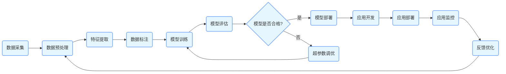

# 掌握AI工具链:程序员技能重构的关键

> 关键词：AI工具链、程序员、技能重构、人工智能、编程、技术发展、职业成长

> 摘要：随着人工智能技术的飞速发展，AI工具链在软件开发领域的应用日益广泛。对于程序员而言，掌握AI工具链已成为技能重构的关键所在。本文深入探讨了AI工具链的相关概念、核心算法原理、数学模型等内容，通过项目实战展示其具体应用，分析了实际应用场景，并推荐了相关的工具和资源。旨在帮助程序员更好地理解和掌握AI工具链，实现技能的重构与升级，以适应不断变化的技术环境和市场需求。

## 1. 背景介绍 
### 1.1 目的和范围
在当今数字化时代，人工智能技术的发展日新月异，深刻地改变了软件开发的方式和流程。AI工具链作为人工智能技术在软件开发领域的具体应用，涵盖了从数据处理、模型训练到应用开发等多个环节。本文的目的在于全面介绍AI工具链的相关知识，包括其核心概念、算法原理、数学模型等，帮助程序员深入理解AI工具链的本质和工作原理。同时，通过项目实战和实际应用场景的分析，为程序员提供具体的操作指导和实践经验，使其能够将AI工具链应用到实际的开发工作中，实现技能的重构和升级。本文的范围主要涵盖AI工具链的基本概念、技术原理、实际应用以及相关的工具和资源推荐等方面。

### 1.2 预期读者
本文主要面向广大程序员群体，尤其是那些希望了解和掌握AI工具链技术，实现技能重构和职业发展的程序员。同时，对于对人工智能技术感兴趣的软件开发爱好者、软件架构师、CTO等相关人员也具有一定的参考价值。

### 1.3 文档结构概述
本文将按照以下结构进行组织：首先介绍AI工具链的背景知识，包括目的和范围、预期读者、文档结构概述以及术语表；接着阐述AI工具链的核心概念与联系，通过文本示意图和Mermaid流程图进行直观展示；然后详细讲解AI工具链的核心算法原理和具体操作步骤，并使用Python源代码进行说明；之后介绍AI工具链的数学模型和公式，并结合具体例子进行详细讲解；再通过项目实战展示AI工具链的实际应用，包括开发环境搭建、源代码实现和代码解读；分析AI工具链的实际应用场景；推荐相关的工具和资源，包括学习资源、开发工具框架和相关论文著作；最后总结AI工具链的未来发展趋势与挑战，提供常见问题与解答，并列出扩展阅读和参考资料。

### 1.4 术语表
#### 1.4.1 核心术语定义
- **AI工具链**：指一系列与人工智能相关的工具和技术的集合，包括数据处理工具、模型训练框架、模型评估工具、应用开发框架等，用于支持人工智能项目的全生命周期开发。
- **人工智能（Artificial Intelligence，AI）**：是指计算机系统能够执行通常需要人类智能才能完成的任务，如学习、推理、解决问题、感知环境等。
- **机器学习（Machine Learning，ML）**：是人工智能的一个分支，它让计算机通过数据和经验来学习，而不是通过明确的编程指令。
- **深度学习（Deep Learning，DL）**：是机器学习的一个子集，基于人工神经网络，通过多层神经网络对数据进行特征学习和模式识别。
- **数据预处理**：指对原始数据进行清洗、转换、归一化等操作，以提高数据质量，便于后续的模型训练和分析。

#### 1.4.2 相关概念解释
- **数据标注**：在机器学习和深度学习中，为原始数据添加标签，使其能够用于监督学习任务。例如，在图像识别任务中，为图像中的物体标注类别标签。
- **模型训练**：使用标注好的数据对机器学习或深度学习模型进行训练，调整模型的参数，使其能够对新的数据进行准确的预测和分类。
- **模型评估**：使用测试数据对训练好的模型进行评估，衡量模型的性能指标，如准确率、召回率、F1值等。
- **超参数调优**：在模型训练过程中，对模型的超参数进行调整，以优化模型的性能。超参数是指在模型训练之前需要手动设置的参数，如学习率、批次大小等。

#### 1.4.3 缩略词列表
- **AI**：Artificial Intelligence（人工智能）
- **ML**：Machine Learning（机器学习）
- **DL**：Deep Learning（深度学习）
- **GPU**：Graphics Processing Unit（图形处理器）
- **API**：Application Programming Interface（应用程序编程接口）

## 2. 核心概念与联系 

### 核心概念原理
AI工具链是一个综合性的体系，它将人工智能领域的各种工具和技术有机地结合在一起，形成一个完整的开发流程。其核心概念主要包括数据、模型和应用三个方面。

- **数据**：是AI工具链的基础，高质量的数据是训练出优秀模型的前提。数据可以来自各种渠道，如传感器、数据库、网络等。在使用数据之前，需要对其进行预处理，包括数据清洗、特征提取、数据标注等操作，以提高数据的质量和可用性。
- **模型**：是AI工具链的核心，它通过对数据的学习和分析，发现数据中的规律和模式，从而实现对新数据的预测和分类。常见的模型包括机器学习模型（如决策树、支持向量机等）和深度学习模型（如卷积神经网络、循环神经网络等）。模型的训练过程需要使用大量的计算资源，通常会借助GPU等硬件加速设备。
- **应用**：是AI工具链的最终目标，将训练好的模型应用到实际的业务场景中，为用户提供智能化的服务和解决方案。应用可以是各种形式，如Web应用、移动应用、嵌入式系统等。

### 架构的文本示意图
AI工具链的架构可以分为以下几个层次：

- **数据层**：负责数据的采集、存储和管理，包括各种数据源（如数据库、文件系统、传感器等）和数据存储技术（如关系型数据库、非关系型数据库等）。
- **算法层**：提供各种机器学习和深度学习算法，包括模型训练、模型评估、超参数调优等功能。常见的算法框架包括TensorFlow、PyTorch、Scikit-learn等。
- **平台层**：提供统一的开发平台和工具，支持模型的开发、部署和管理。平台层通常包括开发环境、部署工具、监控工具等。
- **应用层**：将训练好的模型应用到实际的业务场景中，为用户提供各种智能化的服务和解决方案。应用层可以是各种形式，如Web应用、移动应用、嵌入式系统等。

### Mermaid流程图


## 3. 核心算法原理 & 具体操作步骤 

### 核心算法原理
在AI工具链中，核心算法主要包括机器学习算法和深度学习算法。下面以简单的线性回归算法为例，介绍机器学习算法的原理。

线性回归是一种用于建立自变量和因变量之间线性关系的统计模型。其基本思想是通过最小化预测值与真实值之间的误差平方和，找到最优的回归系数。

假设我们有一组数据 $(x_1, y_1), (x_2, y_2), \cdots, (x_n, y_n)$，其中 $x_i$ 是自变量，$y_i$ 是因变量。线性回归模型的表达式为：

$y = \theta_0 + \theta_1x$

其中，$\theta_0$ 是截距，$\theta_1$ 是斜率。我们的目标是找到最优的 $\theta_0$ 和 $\theta_1$，使得预测值 $\hat{y}_i = \theta_0 + \theta_1x_i$ 与真实值 $y_i$ 之间的误差平方和最小。误差平方和的表达式为：

$J(\theta_0, \theta_1) = \frac{1}{2n}\sum_{i=1}^{n}(y_i - \hat{y}_i)^2 = \frac{1}{2n}\sum_{i=1}^{n}(y_i - (\theta_0 + \theta_1x_i))^2$

为了找到最优的 $\theta_0$ 和 $\theta_1$，我们可以使用梯度下降算法。梯度下降算法的基本思想是通过不断迭代，沿着误差函数的负梯度方向更新参数，直到误差函数达到最小值。

### 具体操作步骤
下面是使用Python实现线性回归算法的具体步骤：

```python
import numpy as np
import matplotlib.pyplot as plt

# 生成随机数据
np.random.seed(0)
x = np.random.rand(100, 1)
y = 2 + 3 * x + np.random.randn(100, 1)

# 初始化参数
theta0 = 0
theta1 = 0

# 定义学习率和迭代次数
learning_rate = 0.1
num_iterations = 1000

# 定义误差函数
def compute_cost(x, y, theta0, theta1):
    m = len(x)
    predictions = theta0 + theta1 * x
    cost = (1/(2*m)) * np.sum((predictions - y)**2)
    return cost

# 定义梯度下降算法
def gradient_descent(x, y, theta0, theta1, learning_rate, num_iterations):
    m = len(x)
    cost_history = []
    for iteration in range(num_iterations):
        predictions = theta0 + theta1 * x
        theta0_derivative = (1/m) * np.sum(predictions - y)
        theta1_derivative = (1/m) * np.sum((predictions - y) * x)
        theta0 = theta0 - learning_rate * theta0_derivative
        theta1 = theta1 - learning_rate * theta1_derivative
        cost = compute_cost(x, y, theta0, theta1)
        cost_history.append(cost)
    return theta0, theta1, cost_history

# 执行梯度下降算法
theta0, theta1, cost_history = gradient_descent(x, y, theta0, theta1, learning_rate, num_iterations)

# 打印最优参数
print("Optimal theta0:", theta0)
print("Optimal theta1:", theta1)

# 绘制误差函数随迭代次数的变化曲线
plt.plot(range(num_iterations), cost_history)
plt.xlabel('Iterations')
plt.ylabel('Cost')
plt.title('Cost vs Iterations')
plt.show()

# 绘制数据点和拟合直线
plt.scatter(x, y)
plt.plot(x, theta0 + theta1 * x, color='red')
plt.xlabel('x')
plt.ylabel('y')
plt.title('Linear Regression')
plt.show()
```

### 代码解释
1. **数据生成**：使用 `np.random.rand` 函数生成100个随机数据点，并添加噪声。
2. **参数初始化**：将 $\theta_0$ 和 $\theta_1$ 初始化为0。
3. **误差函数定义**：定义 `compute_cost` 函数，用于计算误差平方和。
4. **梯度下降算法实现**：定义 `gradient_descent` 函数，实现梯度下降算法，更新 $\theta_0$ 和 $\theta_1$ 的值。
5. **执行梯度下降算法**：调用 `gradient_descent` 函数，执行梯度下降算法，得到最优的 $\theta_0$ 和 $\theta_1$。
6. **结果可视化**：绘制误差函数随迭代次数的变化曲线和数据点与拟合直线。

## 4. 数学模型和公式 & 详细讲解 & 举例说明 

### 线性回归的数学模型和公式
线性回归的数学模型为：

$y = \theta_0 + \theta_1x_1 + \theta_2x_2 + \cdots + \theta_nx_n + \epsilon$

其中，$y$ 是因变量，$x_1, x_2, \cdots, x_n$ 是自变量，$\theta_0, \theta_1, \cdots, \theta_n$ 是回归系数，$\epsilon$ 是误差项。

误差平方和的表达式为：

$J(\theta) = \frac{1}{2m}\sum_{i=1}^{m}(y^{(i)} - h_{\theta}(x^{(i)}))^2$

其中，$m$ 是样本数量，$y^{(i)}$ 是第 $i$ 个样本的真实值，$h_{\theta}(x^{(i)})$ 是第 $i$ 个样本的预测值，$\theta = [\theta_0, \theta_1, \cdots, \theta_n]^T$。

梯度下降算法的更新公式为：

$\theta_j := \theta_j - \alpha\frac{\partial}{\partial\theta_j}J(\theta)$

其中，$\alpha$ 是学习率，$\frac{\partial}{\partial\theta_j}J(\theta)$ 是误差函数 $J(\theta)$ 对 $\theta_j$ 的偏导数。

### 详细讲解
- **误差函数**：误差平方和是线性回归中常用的误差函数，它衡量了预测值与真实值之间的差异。通过最小化误差平方和，我们可以找到最优的回归系数。
- **梯度下降算法**：梯度下降算法是一种迭代优化算法，通过不断更新参数的值，使得误差函数逐渐减小。在每次迭代中，我们沿着误差函数的负梯度方向更新参数，直到误差函数达到最小值。
- **学习率**：学习率 $\alpha$ 控制了参数更新的步长。如果学习率过大，可能会导致算法无法收敛；如果学习率过小，算法的收敛速度会很慢。

### 举例说明
假设我们有一组数据 $(x_1, y_1), (x_2, y_2), \cdots, (x_5, y_5)$，如下所示：

| $x$ | $y$ |
|---|---|
| 1 | 3 |
| 2 | 5 |
| 3 | 7 |
| 4 | 9 |
| 5 | 11 |

我们可以使用线性回归模型来拟合这些数据。首先，我们需要初始化参数 $\theta_0 = 0$ 和 $\theta_1 = 0$，然后使用梯度下降算法来更新参数。

在第一次迭代中，我们计算误差函数对 $\theta_0$ 和 $\theta_1$ 的偏导数：

$\frac{\partial}{\partial\theta_0}J(\theta) = \frac{1}{m}\sum_{i=1}^{m}(h_{\theta}(x^{(i)}) - y^{(i)})$

$\frac{\partial}{\partial\theta_1}J(\theta) = \frac{1}{m}\sum_{i=1}^{m}(h_{\theta}(x^{(i)}) - y^{(i)})x^{(i)}$

然后，我们使用学习率 $\alpha$ 来更新参数：

$\theta_0 := \theta_0 - \alpha\frac{\partial}{\partial\theta_0}J(\theta)$

$\theta_1 := \theta_1 - \alpha\frac{\partial}{\partial\theta_1}J(\theta)$

重复这个过程，直到误差函数达到最小值。最终，我们得到最优的回归系数 $\theta_0$ 和 $\theta_1$，从而得到线性回归模型。

## 5. 项目实战：代码实际案例和详细解释说明 

### 5.1  开发环境搭建
在进行AI项目开发之前，我们需要搭建相应的开发环境。以下是搭建开发环境的具体步骤：

1. **安装Python**：Python是AI开发中最常用的编程语言，我们可以从Python官方网站（https://www.python.org/downloads/） 下载并安装Python。建议安装Python 3.6及以上版本。
2. **安装虚拟环境**：为了避免不同项目之间的依赖冲突，我们可以使用虚拟环境来管理项目的依赖。常用的虚拟环境工具有 `venv` 和 `conda`。以下是使用 `venv` 创建虚拟环境的示例：

```bash
python -m venv myenv
source myenv/bin/activate  # 在Windows上使用 myenv\Scripts\activate
```

3. **安装必要的库**：在虚拟环境中，我们需要安装一些必要的库，如 `numpy`、`pandas`、`matplotlib`、`scikit-learn` 等。可以使用 `pip` 来安装这些库：

```bash
pip install numpy pandas matplotlib scikit-learn
```

4. **安装深度学习框架（可选）**：如果需要进行深度学习开发，我们还需要安装相应的深度学习框架，如 `TensorFlow`、`PyTorch` 等。以下是安装 `TensorFlow` 的示例：

```bash
pip install tensorflow
```

### 5.2  源代码详细实现和代码解读
下面我们以一个简单的手写数字识别项目为例，介绍AI项目的开发流程和代码实现。

```python
import numpy as np
import matplotlib.pyplot as plt
from sklearn.datasets import load_digits
from sklearn.model_selection import train_test_split
from sklearn.svm import SVC
from sklearn.metrics import accuracy_score

# 加载手写数字数据集
digits = load_digits()
X = digits.data
y = digits.target

# 划分训练集和测试集
X_train, X_test, y_train, y_test = train_test_split(X, y, test_size=0.2, random_state=42)

# 创建支持向量机分类器
clf = SVC(kernel='rbf', C=10, gamma=0.001)

# 训练模型
clf.fit(X_train, y_train)

# 预测测试集
y_pred = clf.predict(X_test)

# 计算准确率
accuracy = accuracy_score(y_test, y_pred)
print("Accuracy:", accuracy)

# 可视化预测结果
fig, axes = plt.subplots(2, 5, figsize=(10, 4))
for i, ax in enumerate(axes.flat):
    ax.imshow(X_test[i].reshape(8, 8), cmap='gray')
    ax.set_title(f"Pred: {y_pred[i]}")
    ax.axis('off')
plt.show()
```

### 5.3  代码解读与分析
1. **数据加载**：使用 `load_digits` 函数从 `sklearn.datasets` 中加载手写数字数据集。数据集包含1797个样本，每个样本是一个8x8的图像，代表一个手写数字。
2. **数据划分**：使用 `train_test_split` 函数将数据集划分为训练集和测试集，测试集占总数据集的20%。
3. **模型创建**：创建一个支持向量机分类器，使用径向基函数（RBF）作为核函数，设置 `C` 和 `gamma` 参数。
4. **模型训练**：使用训练集对模型进行训练，调用 `fit` 方法。
5. **模型预测**：使用训练好的模型对测试集进行预测，调用 `predict` 方法。
6. **准确率计算**：使用 `accuracy_score` 函数计算模型的准确率。
7. **结果可视化**：使用 `matplotlib` 库可视化预测结果，显示测试集中前10个样本的图像和预测标签。

## 6. 实际应用场景 
AI工具链在各个领域都有广泛的应用，以下是一些常见的实际应用场景：

### 自然语言处理
- **机器翻译**：使用AI工具链训练机器翻译模型，实现不同语言之间的自动翻译。例如，谷歌翻译、百度翻译等。
- **文本分类**：对文本进行分类，如垃圾邮件分类、新闻分类等。可以使用机器学习和深度学习算法来训练文本分类模型。
- **情感分析**：分析文本中的情感倾向，如积极、消极、中性等。情感分析在社交媒体监测、客户反馈分析等领域有广泛的应用。

### 计算机视觉
- **图像识别**：识别图像中的物体、场景等。例如，人脸识别、车牌识别、物体检测等。
- **图像生成**：使用AI工具链生成新的图像，如艺术创作、虚拟试衣等。例如，DALL - E 2、Midjourney等图像生成模型。
- **视频分析**：对视频进行分析，如行为识别、视频监控等。可以使用深度学习算法来处理视频数据。

### 医疗保健
- **疾病诊断**：使用AI工具链分析医学图像（如X光、CT等）和临床数据，辅助医生进行疾病诊断。例如，通过分析X光图像检测肺部疾病。
- **药物研发**：加速药物研发过程，通过分析生物数据和化学结构，预测药物的疗效和副作用。
- **健康管理**：利用可穿戴设备收集的健康数据，提供个性化的健康建议和预警。

### 金融服务
- **风险评估**：分析客户的信用数据和市场数据，评估金融风险，如信贷风险、市场风险等。
- **投资决策**：使用AI算法分析市场趋势和金融数据，辅助投资者做出投资决策。
- **欺诈检测**：检测金融交易中的欺诈行为，保护客户和金融机构的利益。

### 智能交通
- **自动驾驶**：使用AI工具链开发自动驾驶系统，实现车辆的自主导航和决策。
- **交通流量预测**：分析交通数据，预测交通流量，优化交通管理和规划。
- **智能物流**：优化物流路径和调度，提高物流效率。

## 7. 工具和资源推荐
### 7.1 学习资源推荐
#### 7.1.1 书籍推荐
- 《机器学习》（周志华著）：这本书是机器学习领域的经典教材，系统地介绍了机器学习的基本概念、算法和应用。
- 《深度学习》（Ian Goodfellow、Yoshua Bengio和Aaron Courville著）：深度学习领域的权威著作，深入讲解了深度学习的原理和技术。
- 《Python机器学习实战》（Sebastian Raschka著）：通过实际案例介绍如何使用Python进行机器学习开发，适合初学者。

#### 7.1.2 在线课程
- Coursera上的“机器学习”课程（Andrew Ng教授）：该课程是机器学习领域的经典课程，由斯坦福大学的Andrew Ng教授授课，内容全面，讲解详细。
- edX上的“深度学习”课程（由MIT等机构提供）：深入介绍深度学习的原理和应用，提供实践项目和作业。
- 吴恩达的“深度学习专项课程”（DeepLearning.AI）：包括多个深度学习相关的课程，如神经网络和深度学习、改善深层神经网络等。

#### 7.1.3 技术博客和网站
- Medium：上面有很多关于AI和机器学习的技术博客和文章，作者来自不同的领域和背景。
- Towards Data Science：专注于数据科学和机器学习领域，提供高质量的技术文章和案例分析。
- Kaggle：一个数据科学竞赛平台，上面有很多数据集、代码和竞赛经验分享，对学习和实践AI非常有帮助。

### 7.2 开发工具框架推荐
#### 7.2.1 IDE和编辑器
- PyCharm：一款专门为Python开发设计的集成开发环境，功能强大，提供代码自动补全、调试、版本控制等功能。
- Jupyter Notebook：一个交互式的开发环境，适合数据探索、模型训练和结果展示。可以在浏览器中运行代码，方便分享和协作。
- Visual Studio Code：一款轻量级的代码编辑器，支持多种编程语言和插件，具有丰富的扩展功能。

#### 7.2.2 调试和性能分析工具
- TensorBoard：TensorFlow的可视化工具，用于监控模型训练过程、查看模型结构和性能指标。
- PyTorch Profiler：PyTorch的性能分析工具，用于分析模型的性能瓶颈和资源使用情况。
- cProfile：Python的内置性能分析工具，可以分析Python代码的运行时间和函数调用次数。

#### 7.2.3 相关框架和库
- TensorFlow：一个开源的深度学习框架，由Google开发，提供丰富的深度学习模型和工具。
- PyTorch：另一个流行的深度学习框架，由Facebook开发，具有动态图的优势，适合快速迭代和研究。
- Scikit-learn：一个简单易用的机器学习库，提供各种机器学习算法和工具，如分类、回归、聚类等。

### 7.3 相关论文著作推荐
#### 7.3.1 经典论文
- “Gradient-Based Learning Applied to Document Recognition”（Yann LeCun等）：介绍了卷积神经网络（CNN）的经典论文，对计算机视觉领域产生了深远的影响。
- “Attention Is All You Need”（Ashish Vaswani等）：提出了Transformer架构，是自然语言处理领域的重要突破。
- “Generative Adversarial Networks”（Ian Goodfellow等）：介绍了生成对抗网络（GAN）的论文，开创了生成式模型的新纪元。

#### 7.3.2 最新研究成果
- arXiv.org：一个预印本平台，上面有很多最新的AI和机器学习研究论文，可以及时了解领域的最新进展。
- NeurIPS（神经信息处理系统大会）、ICML（国际机器学习会议）、CVPR（计算机视觉与模式识别会议）等顶级学术会议的论文。

#### 7.3.3 应用案例分析
- 《AI未来进行式》（李开复、王咏刚著）：通过实际案例介绍AI在各个领域的应用和发展趋势。
- 各大科技公司的技术博客和官方文档，如Google AI Blog、Facebook AI Research等，会分享一些实际应用案例和技术经验。

## 8. 总结：未来发展趋势与挑战
### 未来发展趋势
- **AI与其他技术的融合**：AI将与物联网、大数据、云计算等技术深度融合，创造出更加智能化的应用场景。例如，在工业互联网中，AI可以结合物联网数据进行设备故障预测和生产优化。
- **自动化和智能化开发**：AI工具链将不断发展，实现更高级的自动化和智能化开发。例如，自动机器学习（AutoML）技术可以自动选择模型、调优超参数，降低AI开发的门槛。
- **边缘计算与AI**：随着边缘设备计算能力的提升，边缘计算与AI的结合将越来越紧密。在边缘设备上运行AI模型可以减少数据传输延迟，提高系统的实时性和隐私性。
- **AI的可解释性和可靠性**：人们对AI系统的可解释性和可靠性要求越来越高。未来的AI工具链将更加注重模型的可解释性和可靠性，开发出能够提供解释和保证可靠性的AI算法和工具。

### 挑战
- **数据隐私和安全**：AI系统需要大量的数据来训练模型，数据隐私和安全问题成为了一个重要的挑战。如何保护用户的数据隐私，防止数据泄露和滥用，是需要解决的关键问题。
- **算法偏见**：AI算法可能存在偏见，导致不公平的决策。例如，在招聘、贷款审批等领域，AI算法可能会对某些群体产生歧视。如何消除算法偏见，保证AI系统的公平性，是一个亟待解决的问题。
- **人才短缺**：AI领域的发展迅速，对专业人才的需求也越来越大。目前，AI人才短缺是一个普遍存在的问题。如何培养更多的AI专业人才，提高程序员的AI技能水平，是推动AI技术发展的关键。
- **伦理和法律问题**：AI的发展带来了一系列伦理和法律问题，如AI的责任归属、AI的道德准则等。如何制定相应的伦理和法律规范，引导AI技术的健康发展，是一个重要的挑战。

## 9. 附录：常见问题与解答
### 问题1：AI工具链和传统开发工具链有什么区别？
答：AI工具链主要围绕人工智能的开发流程，重点关注数据处理、模型训练和评估等环节。而传统开发工具链更侧重于软件开发的一般流程，如编码、测试、部署等。AI工具链需要处理大量的数据，使用复杂的算法和模型，对计算资源的要求也更高。

### 问题2：学习AI工具链需要具备哪些基础知识？
答：学习AI工具链需要具备一定的数学基础，如线性代数、概率论、统计学等。同时，还需要掌握一门编程语言，如Python。此外，了解机器学习和深度学习的基本概念和算法也是必要的。

### 问题3：如何选择适合的AI工具和框架？
答：选择适合的AI工具和框架需要考虑多个因素，如项目的需求、开发的难度、性能要求等。对于初学者来说，可以选择一些简单易用的工具和框架，如Scikit-learn。对于复杂的深度学习项目，可以选择TensorFlow或PyTorch等专业的深度学习框架。

### 问题4：AI工具链在实际应用中会遇到哪些问题？
答：AI工具链在实际应用中可能会遇到数据质量问题、模型过拟合或欠拟合问题、计算资源不足问题等。此外，还可能会遇到算法偏见、数据隐私和安全等伦理和法律问题。

### 问题5：如何提高AI模型的性能？
答：提高AI模型的性能可以从多个方面入手，如优化数据质量、选择合适的模型和算法、进行超参数调优、增加训练数据等。此外，还可以使用集成学习等技术来提高模型的性能。

## 10. 扩展阅读 & 参考资料
### 扩展阅读
- 《AI 3.0》（梅拉妮·米歇尔著）：深入探讨了人工智能的发展现状和未来挑战。
- 《智能时代》（吴军著）：介绍了AI在各个领域的应用和对社会的影响。
- 《奇点临近》（雷·库兹韦尔著）：探讨了AI技术的发展趋势和对人类未来的影响。

### 参考资料
- 周志华. 机器学习. 清华大学出版社, 2016.
- Ian Goodfellow, Yoshua Bengio, Aaron Courville. Deep Learning. MIT Press, 2016.
- Sebastian Raschka. Python Machine Learning. Packt Publishing, 2015.
- 相关的学术论文和技术报告，如IEEE、ACM等学术组织的会议论文和期刊文章。
- 各大科技公司的官方文档和技术博客，如Google、Facebook、Microsoft等。