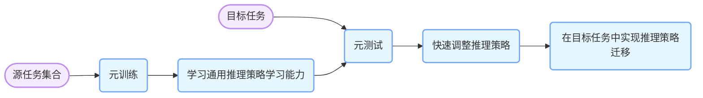

# 推理策略迁移学习中元强化学习的作用研究

> 关键词：推理策略、迁移学习、元强化学习、智能决策、策略优化

> 摘要：本文聚焦于推理策略迁移学习中元强化学习的作用。在人工智能不断发展的当下，迁移学习旨在提升学习效率与泛化能力，而元强化学习为其带来新的视角和方法。通过深入剖析元强化学习在推理策略迁移学习中的原理、算法、数学模型等，结合实际案例展示其应用效果，探讨其在不同场景下的价值。同时对相关工具资源进行推荐，分析未来发展趋势与挑战，以期为该领域的研究和应用提供全面且深入的参考。

## 1. 背景介绍 
### 1.1 目的和范围
随着人工智能技术的快速发展，智能系统需要在不同的任务和环境中高效地进行推理和决策。推理策略的迁移学习能够将在一个任务中学习到的有用信息迁移到其他相关任务中，从而加速学习过程、提高学习效率。元强化学习作为一种新兴的技术，为推理策略迁移学习提供了强大的支持。本文的目的在于深入研究元强化学习在推理策略迁移学习中的具体作用，范围涵盖元强化学习的基本原理、相关算法、数学模型，以及在实际项目中的应用案例等方面。

### 1.2 预期读者
本文预期读者包括人工智能领域的研究人员、开发者、学生，以及对推理策略、迁移学习和元强化学习感兴趣的技术爱好者。对于希望深入了解元强化学习在推理策略迁移学习中应用的专业人士，本文将提供理论和实践相结合的详细内容；对于初学者，也能通过本文建立起对相关概念和技术的基本认识。

### 1.3 文档结构概述
本文首先介绍相关的背景知识，包括目的、预期读者和文档结构。接着阐述核心概念与联系，展示元强化学习与推理策略迁移学习的关系。然后详细讲解核心算法原理和具体操作步骤，通过Python代码进行说明。之后介绍数学模型和公式，并举例说明。再通过项目实战展示代码实际案例和详细解释。随后探讨实际应用场景，推荐相关的工具和资源。最后总结未来发展趋势与挑战，提供常见问题与解答以及扩展阅读和参考资料。

### 1.4 术语表
#### 1.4.1 核心术语定义
- **推理策略**：智能系统在面对问题时，根据已知信息和规则进行推理并做出决策的方法和步骤。
- **迁移学习**：一种机器学习技术，旨在将从一个或多个源任务中学习到的知识和经验，迁移到一个或多个目标任务中，以提高目标任务的学习效率和性能。
- **元强化学习**：强化学习的一个扩展领域，它不仅学习如何在特定环境中采取行动以最大化奖励，还学习如何快速适应新的环境和任务，即学习学习的能力。

#### 1.4.2 相关概念解释
- **强化学习**：智能体通过与环境进行交互，根据环境反馈的奖励信号来学习最优的行为策略。
- **策略网络**：在强化学习中，用于生成智能体行动策略的神经网络。
- **价值网络**：用于评估智能体在某个状态下采取某个行动的价值的神经网络。

#### 1.4.3 缩略词列表
- **RL**：强化学习（Reinforcement Learning）
- **MAML**：模型无关元学习（Model-Agnostic Meta-Learning）
- **PPO**：近端策略优化（Proximal Policy Optimization）

## 2. 核心概念与联系 
### 2.1 推理策略迁移学习的原理
推理策略迁移学习的核心思想是利用源任务中已经学习到的推理知识和经验，来帮助目标任务更快地学习到有效的推理策略。其原理基于不同任务之间可能存在的相似性，例如在问题的结构、推理规则或数据分布等方面。通过迁移这些相似的部分，可以减少目标任务的学习时间和样本需求，提高学习效率和性能。

### 2.2 元强化学习的原理
元强化学习的目标是让智能体能够快速适应新的任务和环境。它通过在多个不同的任务上进行训练，学习到一种通用的学习策略，使得智能体在面对新任务时能够快速调整自己的行为策略以获得最大的奖励。元强化学习通常通过元训练和元测试两个阶段来实现。在元训练阶段，智能体在多个源任务上进行训练，学习到如何快速适应不同的任务；在元测试阶段，智能体将学习到的元知识应用到新的目标任务上。

### 2.3 元强化学习与推理策略迁移学习的联系
元强化学习为推理策略迁移学习提供了一种有效的方法。元强化学习可以学习到一种通用的推理策略学习能力，这种能力可以帮助智能体在不同的推理任务之间进行快速迁移。例如，在元训练阶段，智能体可以学习到如何根据不同的任务环境调整自己的推理策略，然后在目标任务中直接应用这些学习到的调整方法，从而实现推理策略的迁移。

### 2.4 文本示意图
推理策略迁移学习和元强化学习的关系可以用以下文本描述：推理策略迁移学习是一种目标导向的学习方式，旨在将源任务的推理知识迁移到目标任务中。元强化学习则是实现这种迁移的一种手段，它通过在多个源任务上学习通用的学习策略，帮助智能体在目标任务中快速调整推理策略，以达到更好的推理效果。

### 2.5 Mermaid 流程图


## 3. 核心算法原理 & 具体操作步骤 
### 3.1 模型无关元学习（MAML）算法原理
模型无关元学习（MAML）是一种经典的元强化学习算法，其核心思想是找到一个初始参数，使得在这个初始参数的基础上，经过少量的梯度更新步骤，就能在新的任务上取得较好的性能。

#### 3.1.1 算法步骤
1. **初始化参数**：随机初始化策略网络的参数 $\theta$。
2. **元训练循环**：
    - 采样一批任务 $\mathcal{T}=\{T_1, T_2, \cdots, T_n\}$。
    - 对于每个任务 $T_i$：
        - 采样一批训练数据 $\mathcal{D}_{i}^{train}$。
        - 使用梯度下降法在 $\mathcal{D}_{i}^{train}$ 上更新参数 $\theta$ 得到 $\theta_i'$：
          $\theta_i'=\theta - \alpha \nabla_{\theta} \mathcal{L}(\theta; \mathcal{D}_{i}^{train})$，其中 $\alpha$ 是学习率，$\mathcal{L}$ 是损失函数。
        - 采样一批测试数据 $\mathcal{D}_{i}^{test}$。
        - 计算在 $\theta_i'$ 下的损失 $\mathcal{L}(\theta_i'; \mathcal{D}_{i}^{test})$。
    - 计算所有任务的平均损失 $\bar{\mathcal{L}}=\frac{1}{n}\sum_{i=1}^{n}\mathcal{L}(\theta_i'; \mathcal{D}_{i}^{test})$。
    - 使用梯度下降法更新初始参数 $\theta$：
      $\theta=\theta - \beta \nabla_{\theta} \bar{\mathcal{L}}$，其中 $\beta$ 是元学习率。
3. **元测试**：在新的目标任务上，使用学习到的初始参数 $\theta$，并进行少量的梯度更新来快速适应新任务。

#### 3.1.2 Python 代码实现
```python
import torch
import torch.nn as nn
import torch.optim as optim

# 定义策略网络
class PolicyNetwork(nn.Module):
    def __init__(self, input_size, output_size):
        super(PolicyNetwork, self).__init__()
        self.fc1 = nn.Linear(input_size, 64)
        self.fc2 = nn.Linear(64, output_size)

    def forward(self, x):
        x = torch.relu(self.fc1(x))
        x = self.fc2(x)
        return x

# MAML 算法实现
def maml(meta_learning_rate, learning_rate, num_tasks, num_inner_steps):
    # 初始化参数
    input_size = 10
    output_size = 5
    policy_network = PolicyNetwork(input_size, output_size)
    meta_optimizer = optim.Adam(policy_network.parameters(), lr=meta_learning_rate)

    for epoch in range(100):
        meta_loss = 0
        # 元训练循环
        for task in range(num_tasks):
            # 采样训练数据
            train_data = torch.randn(20, input_size)
            train_labels = torch.randint(0, output_size, (20,))

            # 复制当前参数
            fast_weights = list(policy_network.parameters())

            # 内循环更新
            for step in range(num_inner_steps):
                logits = policy_network(train_data)
                loss = nn.CrossEntropyLoss()(logits, train_labels)
                gradients = torch.autograd.grad(loss, fast_weights)
                fast_weights = [w - learning_rate * g for w, g in zip(fast_weights, gradients)]

            # 采样测试数据
            test_data = torch.randn(10, input_size)
            test_labels = torch.randint(0, output_size, (10,))

            # 计算测试损失
            logits = policy_network(test_data)
            task_loss = nn.CrossEntropyLoss()(logits, test_labels)
            meta_loss += task_loss

        # 计算平均损失并更新元参数
        meta_loss /= num_tasks
        meta_optimizer.zero_grad()
        meta_loss.backward()
        meta_optimizer.step()

        if epoch % 10 == 0:
            print(f'Epoch {epoch}, Meta Loss: {meta_loss.item()}')

    return policy_network
```

### 3.2 近端策略优化（PPO）与元强化学习结合
近端策略优化（PPO）是一种高效的强化学习算法，它可以与元强化学习结合，用于优化推理策略的迁移。

#### 3.2.1 算法步骤
1. **初始化策略网络和价值网络**：随机初始化策略网络 $\pi_{\theta}$ 和价值网络 $V_{\phi}$ 的参数。
2. **元训练循环**：
    - 采样一批任务 $\mathcal{T}=\{T_1, T_2, \cdots, T_n\}$。
    - 对于每个任务 $T_i$：
        - 使用当前策略网络 $\pi_{\theta}$ 与环境交互，收集一批轨迹数据 $\tau_i$。
        - 计算优势函数 $A(s, a)$。
        - 使用 PPO 算法更新策略网络 $\pi_{\theta}$ 和价值网络 $V_{\phi}$：
          - 计算策略损失 $\mathcal{L}^{policy}$ 和价值损失 $\mathcal{L}^{value}$。
          - 使用梯度下降法更新参数 $\theta$ 和 $\phi$。
    - 计算所有任务的平均损失并更新元参数。
3. **元测试**：在新的目标任务上，使用学习到的策略网络和价值网络，并进行少量的微调。

#### 3.2.2 Python 代码实现
```python
import torch
import torch.nn as nn
import torch.optim as optim
import numpy as np

# 定义策略网络
class PolicyNetwork(nn.Module):
    def __init__(self, input_size, output_size):
        super(PolicyNetwork, self).__init__()
        self.fc1 = nn.Linear(input_size, 64)
        self.fc2 = nn.Linear(64, output_size)

    def forward(self, x):
        x = torch.relu(self.fc1(x))
        x = torch.softmax(self.fc2(x), dim=-1)
        return x

# 定义价值网络
class ValueNetwork(nn.Module):
    def __init__(self, input_size):
        super(ValueNetwork, self).__init__()
        self.fc1 = nn.Linear(input_size, 64)
        self.fc2 = nn.Linear(64, 1)

    def forward(self, x):
        x = torch.relu(self.fc1(x))
        x = self.fc2(x)
        return x

# PPO 与元强化学习结合实现
def ppo_meta_learning(meta_learning_rate, learning_rate, num_tasks, num_epochs):
    input_size = 10
    output_size = 5
    policy_network = PolicyNetwork(input_size, output_size)
    value_network = ValueNetwork(input_size)
    policy_optimizer = optim.Adam(policy_network.parameters(), lr=learning_rate)
    value_optimizer = optim.Adam(value_network.parameters(), lr=learning_rate)
    meta_optimizer = optim.Adam(list(policy_network.parameters()) + list(value_network.parameters()), lr=meta_learning_rate)

    for epoch in range(num_epochs):
        meta_loss = 0
        for task in range(num_tasks):
            # 与环境交互收集轨迹数据
            states = torch.randn(100, input_size)
            actions = torch.randint(0, output_size, (100,))
            rewards = torch.randn(100)

            # 计算优势函数
            values = value_network(states).squeeze()
            advantages = rewards - values.detach()

            # 计算旧策略的对数概率
            old_log_probs = torch.log(policy_network(states).gather(1, actions.unsqueeze(1)).squeeze())

            # PPO 训练
            for _ in range(4):
                new_log_probs = torch.log(policy_network(states).gather(1, actions.unsqueeze(1)).squeeze())
                ratio = torch.exp(new_log_probs - old_log_probs)
                surr1 = ratio * advantages
                surr2 = torch.clamp(ratio, 0.8, 1.2) * advantages
                policy_loss = -torch.min(surr1, surr2).mean()
                value_loss = nn.MSELoss()(value_network(states).squeeze(), rewards)

                policy_optimizer.zero_grad()
                policy_loss.backward(retain_graph=True)
                policy_optimizer.step()

                value_optimizer.zero_grad()
                value_loss.backward()
                value_optimizer.step()

            meta_loss += policy_loss + value_loss

        # 计算平均损失并更新元参数
        meta_loss /= num_tasks
        meta_optimizer.zero_grad()
        meta_loss.backward()
        meta_optimizer.step()

        if epoch % 10 == 0:
            print(f'Epoch {epoch}, Meta Loss: {meta_loss.item()}')

    return policy_network, value_network
```

## 4. 数学模型和公式 & 详细讲解 & 举例说明 
### 4.1 强化学习的基本数学模型
强化学习可以用马尔可夫决策过程（MDP）来描述，一个 MDP 由一个五元组 $\langle \mathcal{S}, \mathcal{A}, \mathcal{P}, \mathcal{R}, \gamma \rangle$ 组成，其中：
- $\mathcal{S}$ 是状态空间，表示智能体可能处于的所有状态的集合。
- $\mathcal{A}$ 是动作空间，表示智能体可以采取的所有动作的集合。
- $\mathcal{P}: \mathcal{S} \times \mathcal{A} \times \mathcal{S} \to [0, 1]$ 是状态转移概率函数，表示在状态 $s \in \mathcal{S}$ 下采取动作 $a \in \mathcal{A}$ 后转移到状态 $s' \in \mathcal{S}$ 的概率。
- $\mathcal{R}: \mathcal{S} \times \mathcal{A} \to \mathbb{R}$ 是奖励函数，表示在状态 $s \in \mathcal{S}$ 下采取动作 $a \in \mathcal{A}$ 后获得的奖励。
- $\gamma \in [0, 1]$ 是折扣因子，用于衡量未来奖励的重要性。

智能体的目标是学习一个策略 $\pi: \mathcal{S} \to \mathcal{A}$，使得长期累积奖励的期望值最大化，即：
$$J(\pi) = \mathbb{E}_{\tau \sim \pi} \left[ \sum_{t=0}^{\infty} \gamma^t r_t \right]$$
其中 $\tau = (s_0, a_0, r_0, s_1, a_1, r_1, \cdots)$ 是一个轨迹，$r_t$ 是在时间步 $t$ 获得的奖励。

### 4.2 元强化学习的数学模型
元强化学习的目标是学习一个元策略 $\Pi$，使得在面对新的任务时，能够快速适应并获得最大的奖励。假设我们有一个任务分布 $\mathcal{T}$，对于每个任务 $T \in \mathcal{T}$，它由一个 MDP $\langle \mathcal{S}_T, \mathcal{A}_T, \mathcal{P}_T, \mathcal{R}_T, \gamma_T \rangle$ 描述。元强化学习的目标可以表示为：
$$\max_{\Pi} \mathbb{E}_{T \sim \mathcal{T}} \left[ J_T(\Pi) \right]$$
其中 $J_T(\Pi)$ 是在任务 $T$ 下使用元策略 $\Pi$ 获得的长期累积奖励的期望值。

### 4.3 MAML 的数学公式
在 MAML 中，我们的目标是找到一个初始参数 $\theta$，使得在这个初始参数的基础上，经过少量的梯度更新步骤，就能在新的任务上取得较好的性能。具体来说，对于一个任务 $T$，我们首先在训练数据 $\mathcal{D}_{T}^{train}$ 上更新参数 $\theta$ 得到 $\theta_T'$：
$$\theta_T'=\theta - \alpha \nabla_{\theta} \mathcal{L}(\theta; \mathcal{D}_{T}^{train})$$
然后在测试数据 $\mathcal{D}_{T}^{test}$ 上计算损失 $\mathcal{L}(\theta_T'; \mathcal{D}_{T}^{test})$。我们的目标是最小化所有任务的平均测试损失：
$$\min_{\theta} \frac{1}{|\mathcal{T}|} \sum_{T \in \mathcal{T}} \mathcal{L}(\theta_T'; \mathcal{D}_{T}^{test})$$

### 4.4 举例说明
假设我们有一个简单的机器人导航任务，机器人需要在一个二维网格世界中从起点移动到终点。状态空间 $\mathcal{S}$ 是机器人在网格世界中的位置，动作空间 $\mathcal{A}$ 是机器人可以采取的四个方向的移动动作（上、下、左、右）。奖励函数 $\mathcal{R}$ 定义为：当机器人到达终点时获得正奖励，当撞到障碍物时获得负奖励，其他情况下获得零奖励。

在元强化学习中，我们可以有多个不同的网格世界任务，每个任务的起点、终点和障碍物分布都不同。通过 MAML 算法，我们可以学习到一个初始参数，使得机器人在面对新的网格世界任务时，能够快速调整自己的导航策略，从而更快地到达终点。

## 5. 项目实战：代码实际案例和详细解释说明 
### 5.1  开发环境搭建
#### 5.1.1 安装 Python
首先，确保你已经安装了 Python 3.6 或更高版本。你可以从 Python 官方网站（https://www.python.org/downloads/） 下载并安装适合你操作系统的 Python 版本。

#### 5.1.2 安装深度学习框架
我们使用 PyTorch 作为深度学习框架，你可以根据自己的 CUDA 版本和操作系统，从 PyTorch 官方网站（https://pytorch.org/get-started/locally/） 选择合适的安装命令进行安装。例如，如果你使用的是 CPU 版本的 PyTorch，可以使用以下命令：
```sh
pip install torch torchvision
```

#### 5.1.3 安装其他依赖库
还需要安装一些其他的依赖库，如 `numpy`、`matplotlib` 等，可以使用以下命令进行安装：
```sh
pip install numpy matplotlib
```

### 5.2  源代码详细实现和代码解读
#### 5.2.1 定义环境类
```python
import numpy as np

class GridWorldEnv:
    def __init__(self, grid_size=5):
        self.grid_size = grid_size
        self.start_state = (0, 0)
        self.goal_state = (grid_size - 1, grid_size - 1)
        self.current_state = self.start_state
        self.action_space = [0, 1, 2, 3]  # 0: up, 1: down, 2: left, 3: right

    def reset(self):
        self.current_state = self.start_state
        return self._state_to_index(self.current_state)

    def step(self, action):
        x, y = self.current_state
        if action == 0 and x > 0:
            x -= 1
        elif action == 1 and x < self.grid_size - 1:
            x += 1
        elif action == 2 and y > 0:
            y -= 1
        elif action == 3 and y < self.grid_size - 1:
            y += 1

        self.current_state = (x, y)
        reward = 1 if self.current_state == self.goal_state else 0
        done = self.current_state == self.goal_state
        return self._state_to_index(self.current_state), reward, done, {}

    def _state_to_index(self, state):
        return state[0] * self.grid_size + state[1]
```
**代码解读**：
- `__init__` 方法：初始化网格世界的大小、起点、终点和当前状态，以及动作空间。
- `reset` 方法：将当前状态重置为起点，并返回起点的状态索引。
- `step` 方法：根据输入的动作更新当前状态，计算奖励和判断是否到达终点，并返回新的状态索引、奖励、是否完成和其他信息。
- `_state_to_index` 方法：将二维状态坐标转换为一维状态索引。

#### 5.2.2 定义策略网络
```python
import torch
import torch.nn as nn

class PolicyNetwork(nn.Module):
    def __init__(self, input_size, output_size):
        super(PolicyNetwork, self).__init__()
        self.fc1 = nn.Linear(input_size, 64)
        self.fc2 = nn.Linear(64, output_size)

    def forward(self, x):
        x = torch.relu(self.fc1(x))
        x = torch.softmax(self.fc2(x), dim=-1)
        return x
```
**代码解读**：
- `__init__` 方法：定义策略网络的结构，包括一个输入层、一个隐藏层和一个输出层。
- `forward` 方法：定义前向传播过程，将输入通过隐藏层的 ReLU 激活函数和输出层的 Softmax 函数，输出每个动作的概率。

#### 5.2.3 实现元强化学习训练
```python
import torch.optim as optim

def meta_learning(num_tasks, num_epochs, meta_learning_rate, learning_rate):
    input_size = 25
    output_size = 4
    policy_network = PolicyNetwork(input_size, output_size)
    meta_optimizer = optim.Adam(policy_network.parameters(), lr=meta_learning_rate)

    for epoch in range(num_epochs):
        meta_loss = 0
        for task in range(num_tasks):
            env = GridWorldEnv()
            states = []
            actions = []
            rewards = []

            state = env.reset()
            done = False
            while not done:
                state_tensor = torch.FloatTensor([state]).unsqueeze(0)
                action_probs = policy_network(state_tensor)
                action = torch.multinomial(action_probs, 1).item()
                next_state, reward, done, _ = env.step(action)

                states.append(state)
                actions.append(action)
                rewards.append(reward)

                state = next_state

            # 计算优势函数
            discounted_rewards = []
            discounted_reward = 0
            for reward in reversed(rewards):
                discounted_reward = reward + 0.9 * discounted_reward
                discounted_rewards.insert(0, discounted_reward)
            discounted_rewards = torch.FloatTensor(discounted_rewards)
            advantages = discounted_rewards - discounted_rewards.mean()

            # 计算损失
            states_tensor = torch.FloatTensor(states)
            actions_tensor = torch.LongTensor(actions)
            log_probs = torch.log(policy_network(states_tensor).gather(1, actions_tensor.unsqueeze(1)).squeeze())
            loss = -(log_probs * advantages).mean()

            meta_loss += loss

        # 计算平均损失并更新元参数
        meta_loss /= num_tasks
        meta_optimizer.zero_grad()
        meta_loss.backward()
        meta_optimizer.step()

        if epoch % 10 == 0:
            print(f'Epoch {epoch}, Meta Loss: {meta_loss.item()}')

    return policy_network
```
**代码解读**：
- `meta_learning` 函数：实现元强化学习的训练过程。
- 在每个 epoch 中，对于每个任务，创建一个网格世界环境，与环境交互收集轨迹数据。
- 计算折扣奖励和优势函数。
- 计算策略网络的对数概率和损失。
- 计算所有任务的平均损失，并使用元优化器更新策略网络的参数。

### 5.3  代码解读与分析
#### 5.3.1 环境交互部分
在元强化学习的训练过程中，智能体与环境进行交互，收集轨迹数据。通过 `env.reset()` 方法重置环境状态，然后在每个时间步中，根据策略网络输出的动作概率选择一个动作，使用 `env.step(action)` 方法执行动作并获取新的状态、奖励和是否完成的信息。

#### 5.3.2 损失计算部分
在计算损失时，首先计算折扣奖励和优势函数，然后根据策略网络的输出计算对数概率。最后，使用对数概率和优势函数计算策略损失，目标是最大化长期累积奖励。

#### 5.3.3 元参数更新部分
在每个 epoch 结束时，计算所有任务的平均损失，并使用元优化器更新策略网络的参数。通过不断迭代训练，策略网络可以学习到一个通用的策略，使得智能体在面对新的任务时能够快速适应。

## 6. 实际应用场景 
### 6.1 机器人导航
在机器人导航领域，不同的环境可能具有不同的布局和障碍物分布。元强化学习可以帮助机器人在一个环境中学习到的导航策略快速迁移到其他环境中。例如，在一个室内环境中训练的机器人，可以利用元强化学习的方法，在进入一个新的室内环境时，快速调整自己的导航策略，从而高效地完成导航任务。

### 6.2 游戏智能体
在游戏领域，不同的游戏可能具有不同的规则和任务目标。元强化学习可以使游戏智能体在一个游戏中学习到的策略快速迁移到其他相关游戏中。例如，在一个策略游戏中训练的智能体，可以利用元强化学习的方法，在面对一个新的类似策略游戏时，快速适应新的游戏规则和任务目标，从而取得较好的游戏成绩。

### 6.3 医疗诊断
在医疗诊断领域，不同的疾病可能具有不同的症状和诊断标准。元强化学习可以帮助医生或医疗智能系统在一个疾病的诊断经验基础上，快速迁移到其他相关疾病的诊断中。例如，在诊断一种常见疾病的过程中学习到的诊断策略，可以通过元强化学习的方法，在面对一种新的罕见疾病时，快速调整诊断思路，提高诊断效率和准确性。

### 6.4 金融投资
在金融投资领域，不同的市场环境和投资产品可能具有不同的风险和收益特征。元强化学习可以帮助投资者在一个市场环境中学习到的投资策略快速迁移到其他市场环境中。例如，在股票市场中学习到的投资策略，可以通过元强化学习的方法，在面对期货市场或外汇市场时，快速调整投资策略，降低投资风险，提高投资收益。

## 7. 工具和资源推荐
### 7.1 学习资源推荐
#### 7.1.1 书籍推荐
- 《强化学习：原理与Python实现》：本书系统地介绍了强化学习的基本原理和算法，并通过Python代码实现了各种强化学习算法，适合初学者和有一定基础的读者。
- 《Deep Reinforcement Learning Hands-On》：这本书深入介绍了深度强化学习的理论和实践，包括各种深度强化学习算法的实现和应用案例，适合对深度强化学习感兴趣的读者。

#### 7.1.2 在线课程
- Coursera上的“Reinforcement Learning Specialization”：由著名学者Richard S. Sutton 等教授的强化学习课程，内容全面，涵盖了强化学习的基本原理、算法和应用。
- edX上的“Introduction to Artificial Intelligence”：该课程介绍了人工智能的基本概念和技术，其中包括强化学习的相关内容，适合对人工智能和强化学习感兴趣的初学者。

#### 7.1.3 技术博客和网站
- OpenAI Blog（https://openai.com/blog/）：OpenAI发布的关于人工智能和强化学习的最新研究成果和技术文章。
- DeepMind Blog（https://deepmind.com/blog/）：DeepMind发布的关于人工智能和强化学习的前沿研究和应用案例。

### 7.2 开发工具框架推荐
#### 7.2.1 IDE和编辑器
- PyCharm：一款专业的Python集成开发环境，具有代码编辑、调试、自动补全、代码分析等功能，适合Python开发。
- Jupyter Notebook：一种交互式的开发环境，可以在浏览器中编写和运行Python代码，适合进行数据探索和模型实验。

#### 7.2.2 调试和性能分析工具
- TensorBoard：TensorFlow的可视化工具，可以用于可视化训练过程中的损失曲线、梯度变化等信息，帮助开发者调试和优化模型。
- PyTorch Profiler：PyTorch的性能分析工具，可以用于分析模型的运行时间、内存使用等情况，帮助开发者优化模型性能。

#### 7.2.3 相关框架和库
- OpenAI Gym：一个用于开发和比较强化学习算法的工具包，提供了各种模拟环境和任务，方便开发者进行强化学习算法的实验和测试。
- Stable Baselines3：一个基于PyTorch的强化学习库，提供了各种预训练的强化学习算法和模型，方便开发者快速实现和应用强化学习算法。

### 7.3 相关论文著作推荐
#### 7.3.1 经典论文
- “Model-Agnostic Meta-Learning for Fast Adaptation of Deep Networks”：介绍了模型无关元学习（MAML）算法的经典论文，为元强化学习的发展奠定了基础。
- “Proximal Policy Optimization Algorithms”：介绍了近端策略优化（PPO）算法的论文，该算法在强化学习领域得到了广泛的应用。

#### 7.3.2 最新研究成果
- 关注顶级人工智能会议（如NeurIPS、ICML、AAAI等）上发表的关于元强化学习和推理策略迁移学习的最新研究成果。
- 关注相关学术期刊（如Journal of Artificial Intelligence Research、Artificial Intelligence等）上发表的最新论文。

#### 7.3.3 应用案例分析
- 分析一些实际应用中使用元强化学习和推理策略迁移学习的案例，如机器人导航、游戏智能体等领域的应用案例，了解这些技术在实际场景中的应用效果和挑战。

## 8. 总结：未来发展趋势与挑战
### 8.1 未来发展趋势
#### 8.1.1 与其他技术的融合
元强化学习可能会与其他人工智能技术（如深度学习、计算机视觉、自然语言处理等）进一步融合，以实现更加复杂和智能的系统。例如，将元强化学习与计算机视觉结合，可以使机器人在不同的视觉环境中快速适应并完成任务；将元强化学习与自然语言处理结合，可以使智能对话系统在不同的对话场景中快速调整策略，提高对话质量。

#### 8.1.2 应用领域的拓展
随着元强化学习技术的不断发展，其应用领域将不断拓展。除了机器人导航、游戏智能体、医疗诊断和金融投资等领域，元强化学习还可能应用于自动驾驶、智能家居、工业自动化等领域，为这些领域带来更高效、智能的解决方案。

#### 8.1.3 理论和算法的创新
未来，元强化学习的理论和算法将不断创新。研究人员可能会提出更加高效、通用的元强化学习算法，提高智能体的学习效率和泛化能力。同时，对元强化学习的理论基础的研究也将不断深入，为其应用提供更加坚实的理论支持。

### 8.2 挑战
#### 8.2.1 数据和计算资源需求
元强化学习通常需要大量的数据和计算资源来进行训练。在实际应用中，获取足够的数据和计算资源可能是一个挑战。因此，如何在有限的数据和计算资源下提高元强化学习的性能是一个需要解决的问题。

#### 8.2.2 可解释性和安全性
元强化学习模型通常是黑盒模型，其决策过程难以解释。在一些对安全性要求较高的应用场景（如医疗诊断、自动驾驶等）中，模型的可解释性和安全性是至关重要的。因此，如何提高元强化学习模型的可解释性和安全性是一个亟待解决的问题。

#### 8.2.3 任务分布的适应性
元强化学习的性能通常依赖于任务分布的假设。在实际应用中，任务分布可能是动态变化的，如何使元强化学习模型能够快速适应任务分布的变化是一个挑战。

## 9. 附录：常见问题与解答
### 9.1 元强化学习和传统强化学习有什么区别？
传统强化学习通常是在一个固定的环境或任务中学习最优策略，而元强化学习的目标是学习如何快速适应新的环境和任务。元强化学习通过在多个不同的任务上进行训练，学习到一种通用的学习策略，使得智能体在面对新任务时能够快速调整自己的行为策略。

### 9.2 元强化学习在推理策略迁移学习中的作用是什么？
元强化学习为推理策略迁移学习提供了一种有效的方法。它可以学习到一种通用的推理策略学习能力，这种能力可以帮助智能体在不同的推理任务之间进行快速迁移。通过元强化学习，智能体可以在新的推理任务中快速调整自己的推理策略，提高推理效率和性能。

### 9.3 元强化学习的训练过程复杂吗？
元强化学习的训练过程相对传统强化学习来说更加复杂。它通常需要在多个不同的任务上进行训练，并且需要进行元训练和元测试两个阶段。在元训练阶段，需要不断地更新元参数，以学习到通用的学习策略；在元测试阶段，需要在新的任务上进行少量的微调。因此，元强化学习的训练过程需要更多的计算资源和时间。

### 9.4 如何选择合适的元强化学习算法？
选择合适的元强化学习算法需要考虑多个因素，如任务的特点、数据的规模、计算资源的限制等。不同的元强化学习算法具有不同的优缺点，例如 MAML 算法具有较好的通用性，但训练过程可能比较复杂；PPO 算法具有较高的效率，但可能对任务分布的适应性较差。因此，需要根据具体的应用场景选择合适的元强化学习算法。

## 10. 扩展阅读 & 参考资料
### 10.1 扩展阅读
- 阅读更多关于强化学习、迁移学习和元学习的相关书籍和论文，深入了解这些领域的理论和技术。
- 关注人工智能领域的最新研究动态和技术发展趋势，了解元强化学习在不同领域的应用案例和实践经验。

### 10.2 参考资料
- Richard S. Sutton, Andrew G. Barto. Reinforcement Learning: An Introduction.
- Chelsea Finn, Pieter Abbeel, Sergey Levine. Model-Agnostic Meta-Learning for Fast Adaptation of Deep Networks.
- John Schulman, Filip Wolski, Prafulla Dhariwal, Alec Radford, Oleg Klimov. Proximal Policy Optimization Algorithms.