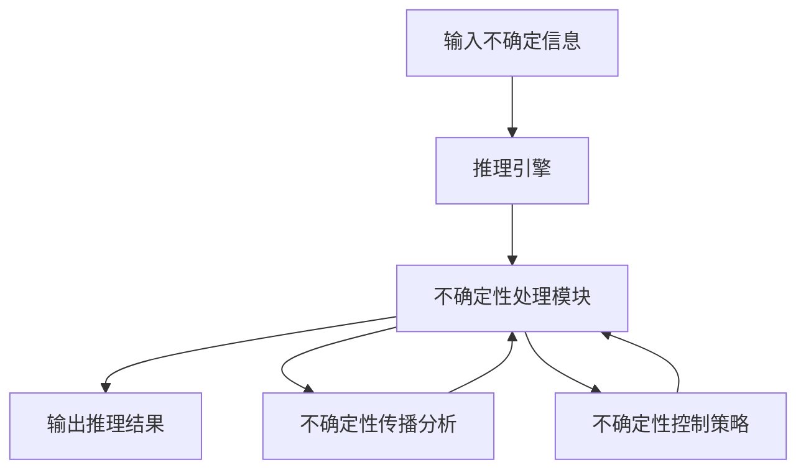

# 推理过程中的不确定性传播与控制技术研究

> 关键词：不确定性传播、不确定性控制、推理过程、概率推理、模糊推理

> 摘要：本文深入研究推理过程中的不确定性传播与控制技术。在实际的推理场景中，由于信息的不完整性、模糊性等因素，不确定性是普遍存在的。文章首先介绍了不确定性传播与控制技术的背景，包括其目的、预期读者等内容。接着阐述了相关的核心概念及联系，通过文本示意图和 Mermaid 流程图进行清晰展示。详细讲解了核心算法原理，并使用 Python 源代码进行具体说明。同时，给出了相关的数学模型和公式，并举例进行解释。通过项目实战，展示了代码的实际案例及详细解读。探讨了该技术的实际应用场景，推荐了相关的工具和资源。最后对未来发展趋势与挑战进行总结，并提供常见问题与解答以及扩展阅读和参考资料，旨在为该领域的研究和应用提供全面而深入的参考。

## 1. 背景介绍 
### 1.1 目的和范围
在众多领域的推理系统中，如人工智能、专家系统、决策支持系统等，不确定性是一个不可忽视的问题。推理过程中的不确定性传播与控制技术的研究目的在于更好地处理和管理这些不确定性，以提高推理结果的可靠性和有效性。其范围涵盖了各种类型的推理，包括基于规则的推理、概率推理、模糊推理等，旨在解决不同推理场景下的不确定性问题，如信息缺失、数据误差、概念模糊等带来的影响。

### 1.2 预期读者
本文预期读者包括人工智能、计算机科学、控制科学等领域的研究人员，他们可以从本文中获取关于不确定性传播与控制技术的最新研究成果和方法；软件开发者在开发推理系统时，可以借鉴本文中的算法和代码实现；对推理过程中不确定性问题感兴趣的学生和爱好者，能够通过本文系统地了解相关知识，为进一步的学习和研究打下基础。

### 1.3 文档结构概述
本文首先介绍不确定性传播与控制技术的背景信息，让读者对该领域有一个初步的认识。接着阐述核心概念及联系，通过示意图和流程图直观展示相关原理。详细讲解核心算法原理和具体操作步骤，并使用 Python 代码进行说明。给出数学模型和公式，结合实例加深理解。通过项目实战展示代码的实际应用和详细解读。探讨实际应用场景，推荐相关的工具和资源。最后对未来发展趋势与挑战进行总结，提供常见问题与解答以及扩展阅读和参考资料，形成一个完整的知识体系。

### 1.4 术语表
#### 1.4.1 核心术语定义
- **不确定性传播**：在推理过程中，由于前提条件的不确定性，导致推理结果也具有不确定性，这种不确定性随着推理步骤的进行而在推理网络中扩散和传递的过程。
- **不确定性控制**：通过一定的方法和策略，对推理过程中的不确定性进行管理和调节，以降低不确定性对推理结果的影响，提高推理的可靠性和准确性。
- **推理过程**：从已知的前提条件出发，按照一定的推理规则和逻辑关系，推导出新的结论的过程。
- **概率推理**：基于概率理论，利用事件发生的概率来表示不确定性，并进行推理的方法。
- **模糊推理**：处理模糊信息和模糊概念的推理方法，使用模糊集合和模糊逻辑来表示和处理不确定性。

#### 1.4.2 相关概念解释
- **不确定性来源**：包括信息的不完整性，即某些信息缺失导致无法准确判断；数据的误差，如测量误差、统计误差等；概念的模糊性，如“高”“低”“快”“慢”等模糊概念。
- **推理网络**：由节点和边组成的网络结构，节点表示推理的前提条件、中间结论和最终结论，边表示节点之间的推理关系。

#### 1.4.3 缩略词列表
- **D-S 证据理论**：Dempster-Shafer Evidence Theory
- **Bayes 网络**：贝叶斯网络

## 2. 核心概念与联系 

### 核心概念原理
#### 不确定性传播原理
不确定性传播是由于推理过程中前提条件的不确定性而产生的。在推理网络中，每个节点的不确定性会通过推理规则传递到后续节点。例如，在基于规则的推理中，如果规则的前提条件具有一定的不确定性，那么根据该规则得出的结论也会具有相应的不确定性。这种不确定性的传递可能会导致推理结果的可靠性降低。

#### 不确定性控制原理
不确定性控制的原理是通过对推理过程中的不确定性进行评估和管理，采取相应的措施来降低不确定性的影响。常见的方法包括证据融合、不确定性量化、规则优化等。例如，在证据融合中，可以将多个来源的证据进行综合处理，以提高证据的可靠性和确定性；在不确定性量化中，可以使用概率、模糊隶属度等方法来准确表示不确定性的程度，从而更好地进行控制。

### 架构的文本示意图
推理过程中的不确定性传播与控制架构可以描述为一个包含输入、推理引擎、不确定性处理模块和输出的系统。输入部分接收各种不确定的前提条件和证据，推理引擎根据预设的推理规则进行推理，不确定性处理模块对推理过程中的不确定性进行传播分析和控制，最后输出经过处理的推理结果。

### Mermaid 流程图


## 3. 核心算法原理 & 具体操作步骤 

### 概率推理算法原理
概率推理是基于概率理论的一种推理方法，通过计算事件发生的概率来表示不确定性。其中，贝叶斯网络是一种常用的概率推理模型。贝叶斯网络是一个有向无环图，节点表示随机变量，边表示变量之间的条件依赖关系。

#### 贝叶斯定理
贝叶斯定理是概率推理的核心公式，其表达式为：
$$P(A|B)=\frac{P(B|A)P(A)}{P(B)}$$
其中，$P(A|B)$ 表示在事件 $B$ 发生的条件下事件 $A$ 发生的概率，$P(B|A)$ 表示在事件 $A$ 发生的条件下事件 $B$ 发生的概率，$P(A)$ 是事件 $A$ 的先验概率，$P(B)$ 是事件 $B$ 的先验概率。

#### Python 代码实现
```python
# 定义贝叶斯定理计算函数
def bayes_theorem(p_a, p_b_given_a, p_b):
    return (p_b_given_a * p_a) / p_b

# 示例数据
p_a = 0.3  # 事件 A 的先验概率
p_b_given_a = 0.7  # 在事件 A 发生的条件下事件 B 发生的概率
p_b = 0.5  # 事件 B 的先验概率

# 计算后验概率
p_a_given_b = bayes_theorem(p_a, p_b_given_a, p_b)
print("在事件 B 发生的条件下事件 A 发生的概率:", p_a_given_b)
```

### 模糊推理算法原理
模糊推理是处理模糊信息和模糊概念的推理方法。模糊推理的基本步骤包括模糊化、规则推理和去模糊化。

#### 模糊化
将输入的精确值转换为模糊集合的隶属度。例如，对于温度这个变量，可以定义“高”“中”“低”三个模糊集合，将具体的温度值转换为在这三个模糊集合中的隶属度。

#### 规则推理
根据预设的模糊规则进行推理。例如，规则“如果温度高且湿度大，那么感觉闷热”，根据输入的温度和湿度的模糊隶属度，计算出“感觉闷热”这个结论的模糊隶属度。

#### 去模糊化
将模糊推理得到的模糊结论转换为精确值。常见的去模糊化方法有重心法、最大隶属度法等。

#### Python 代码实现
```python
import numpy as np
import skfuzzy as fuzz
from skfuzzy import control as ctrl

# 定义输入和输出变量
temperature = ctrl.Antecedent(np.arange(0, 101, 1), 'temperature')
humidity = ctrl.Antecedent(np.arange(0, 101, 1), 'humidity')
sensation = ctrl.Consequent(np.arange(0, 101, 1), 'sensation')

# 定义模糊集合
temperature['low'] = fuzz.trimf(temperature.universe, [0, 0, 50])
temperature['medium'] = fuzz.trimf(temperature.universe, [0, 50, 100])
temperature['high'] = fuzz.trimf(temperature.universe, [50, 100, 100])

humidity['low'] = fuzz.trimf(humidity.universe, [0, 0, 50])
humidity['medium'] = fuzz.trimf(humidity.universe, [0, 50, 100])
humidity['high'] = fuzz.trimf(humidity.universe, [50, 100, 100])

sensation['comfortable'] = fuzz.trimf(sensation.universe, [0, 0, 50])
sensation['moderate'] = fuzz.trimf(sensation.universe, [0, 50, 100])
sensation['uncomfortable'] = fuzz.trimf(sensation.universe, [50, 100, 100])

# 定义模糊规则
rule1 = ctrl.Rule(temperature['low'] & humidity['low'], sensation['comfortable'])
rule2 = ctrl.Rule(temperature['low'] & humidity['medium'], sensation['moderate'])
rule3 = ctrl.Rule(temperature['low'] & humidity['high'], sensation['moderate'])
rule4 = ctrl.Rule(temperature['medium'] & humidity['low'], sensation['comfortable'])
rule5 = ctrl.Rule(temperature['medium'] & humidity['medium'], sensation['moderate'])
rule6 = ctrl.Rule(temperature['medium'] & humidity['high'], sensation['uncomfortable'])
rule7 = ctrl.Rule(temperature['high'] & humidity['low'], sensation['moderate'])
rule8 = ctrl.Rule(temperature['high'] & humidity['medium'], sensation['uncomfortable'])
rule9 = ctrl.Rule(temperature['high'] & humidity['high'], sensation['uncomfortable'])

# 创建模糊控制系统
sensation_ctrl = ctrl.ControlSystem([rule1, rule2, rule3, rule4, rule5, rule6, rule7, rule8, rule9])
sensation_sim = ctrl.ControlSystemSimulation(sensation_ctrl)

# 输入具体的温度和湿度值
sensation_sim.input['temperature'] = 80
sensation_sim.input['humidity'] = 70

# 进行模糊推理
sensation_sim.compute()

# 输出结果
print("感觉的程度:", sensation_sim.output['sensation'])
```

## 4. 数学模型和公式 & 详细讲解 & 举例说明 

### 概率推理数学模型
#### 贝叶斯网络
贝叶斯网络是一个有向无环图 $G=(V, E)$，其中 $V$ 是节点集合，每个节点表示一个随机变量，$E$ 是边集合，表示变量之间的条件依赖关系。对于每个节点 $X_i$，其条件概率分布 $P(X_i|Pa(X_i))$ 表示在其父节点 $Pa(X_i)$ 取值的条件下 $X_i$ 的概率分布。

例如，假设有一个简单的贝叶斯网络，包含三个节点 $A$、$B$、$C$，其中 $A$ 是 $B$ 的父节点，$B$ 是 $C$ 的父节点。则节点 $B$ 的条件概率分布可以表示为 $P(B|A)$，节点 $C$ 的条件概率分布可以表示为 $P(C|B)$。根据贝叶斯定理，联合概率分布可以表示为：
$$P(A, B, C)=P(A)P(B|A)P(C|B)$$

#### 举例说明
假设有一个疾病诊断的贝叶斯网络，节点 $A$ 表示是否感染病毒，节点 $B$ 表示是否出现症状，节点 $C$ 表示是否被诊断为患病。已知 $P(A)=0.1$（感染病毒的先验概率），$P(B|A)=0.8$（感染病毒时出现症状的概率），$P(B|\neg A)=0.2$（未感染病毒时出现症状的概率），$P(C|B)=0.9$（出现症状时被诊断为患病的概率），$P(C|\neg B)=0.1$（未出现症状时被诊断为患病的概率）。

首先计算 $P(B)$：
$$P(B)=P(B|A)P(A)+P(B|\neg A)P(\neg A)=0.8\times0.1 + 0.2\times(1 - 0.1)=0.26$$

然后计算 $P(A|B)$：
$$P(A|B)=\frac{P(B|A)P(A)}{P(B)}=\frac{0.8\times0.1}{0.26}\approx0.3077$$

### 模糊推理数学模型
#### 模糊集合
模糊集合是一种用于表示模糊概念的数学工具。对于一个论域 $U$，模糊集合 $A$ 可以用隶属函数 $\mu_A(u)$ 来定义，其中 $u\in U$，$\mu_A(u)\in[0, 1]$ 表示元素 $u$ 属于模糊集合 $A$ 的程度。

例如，对于温度论域 $U=[0, 100]$，定义“高”温度的模糊集合 $A$，其隶属函数可以为：
$$\mu_A(u)=\begin{cases}0, & u\leq50\\\frac{u - 50}{50}, & 50\lt u\leq100\end{cases}$$

#### 模糊规则
模糊规则通常采用“如果……那么……”的形式，例如“如果 $x$ 是 $A$ 且 $y$ 是 $B$，那么 $z$ 是 $C$”。在模糊推理中，需要根据输入的模糊隶属度和模糊规则进行推理。

#### 举例说明
假设有一个模糊控制系统，输入变量为温度 $x$ 和湿度 $y$，输出变量为舒适度 $z$。定义温度的模糊集合“高”$A$、湿度的模糊集合“大”$B$ 和舒适度的模糊集合“差”$C$。已知温度 $x = 80$，湿度 $y = 70$，根据上述隶属函数计算出 $\mu_A(80)=0.6$，$\mu_B(70)=0.4$。假设模糊规则为“如果温度高且湿度大，那么舒适度差”，则根据模糊与运算（通常采用取小运算），得到规则的激发强度为 $\min(\mu_A(80), \mu_B(70)) = 0.4$。

## 5. 项目实战：代码实际案例和详细解释说明 

### 5.1  开发环境搭建
#### 安装 Python
首先需要安装 Python 环境，建议使用 Python 3.x 版本。可以从 Python 官方网站（https://www.python.org/downloads/） 下载安装包，按照安装向导进行安装。

#### 安装相关库
对于概率推理和模糊推理，需要安装一些相关的 Python 库，如 `numpy`、`scikit-fuzzy` 等。可以使用 `pip` 命令进行安装：
```sh
pip install numpy scikit-fuzzy
```

### 5.2  源代码详细实现和代码解读
#### 概率推理项目实战
```python
import numpy as np

# 定义贝叶斯网络节点的条件概率分布
# 假设节点 A 的先验概率
p_a = np.array([0.1, 0.9])  # P(A = 1) = 0.1, P(A = 0) = 0.9

# 节点 B 在 A 条件下的条件概率分布
p_b_given_a = np.array([[0.8, 0.2], [0.2, 0.8]])  # P(B = 1|A = 1) = 0.8, P(B = 1|A = 0) = 0.2

# 节点 C 在 B 条件下的条件概率分布
p_c_given_b = np.array([[0.9, 0.1], [0.1, 0.9]])  # P(C = 1|B = 1) = 0.9, P(C = 1|B = 0) = 0.1

# 计算联合概率分布
p_abc = np.zeros((2, 2, 2))
for a in range(2):
    for b in range(2):
        for c in range(2):
            p_abc[a, b, c] = p_a[a] * p_b_given_a[a, b] * p_c_given_b[b, c]

# 计算边缘概率分布 P(C)
p_c = np.sum(p_abc, axis=(0, 1))
print("节点 C 的边缘概率分布:", p_c)
```
代码解读：
- 首先定义了节点 $A$ 的先验概率分布 `p_a`，节点 $B$ 在 $A$ 条件下的条件概率分布 `p_b_given_a`，节点 $C$ 在 $B$ 条件下的条件概率分布 `p_c_given_b`。
- 然后通过三重循环计算联合概率分布 `p_abc`，根据贝叶斯网络的联合概率公式 $P(A, B, C)=P(A)P(B|A)P(C|B)$。
- 最后计算节点 $C$ 的边缘概率分布 `p_c`，通过对联合概率分布在 $A$ 和 $B$ 维度上求和得到。

#### 模糊推理项目实战
```python
import numpy as np
import skfuzzy as fuzz
from skfuzzy import control as ctrl

# 定义输入和输出变量
temperature = ctrl.Antecedent(np.arange(0, 101, 1), 'temperature')
humidity = ctrl.Antecedent(np.arange(0, 101, 1), 'humidity')
sensation = ctrl.Consequent(np.arange(0, 101, 1), 'sensation')

# 定义模糊集合
temperature['low'] = fuzz.trimf(temperature.universe, [0, 0, 50])
temperature['medium'] = fuzz.trimf(temperature.universe, [0, 50, 100])
temperature['high'] = fuzz.trimf(temperature.universe, [50, 100, 100])

humidity['low'] = fuzz.trimf(humidity.universe, [0, 0, 50])
humidity['medium'] = fuzz.trimf(humidity.universe, [0, 50, 100])
humidity['high'] = fuzz.trimf(humidity.universe, [50, 100, 100])

sensation['comfortable'] = fuzz.trimf(sensation.universe, [0, 0, 50])
sensation['moderate'] = fuzz.trimf(sensation.universe, [0, 50, 100])
sensation['uncomfortable'] = fuzz.trimf(sensation.universe, [50, 100, 100])

# 定义模糊规则
rule1 = ctrl.Rule(temperature['low'] & humidity['low'], sensation['comfortable'])
rule2 = ctrl.Rule(temperature['low'] & humidity['medium'], sensation['moderate'])
rule3 = ctrl.Rule(temperature['low'] & humidity['high'], sensation['moderate'])
rule4 = ctrl.Rule(temperature['medium'] & humidity['low'], sensation['comfortable'])
rule5 = ctrl.Rule(temperature['medium'] & humidity['medium'], sensation['moderate'])
rule6 = ctrl.Rule(temperature['medium'] & humidity['high'], sensation['uncomfortable'])
rule7 = ctrl.Rule(temperature['high'] & humidity['low'], sensation['moderate'])
rule8 = ctrl.Rule(temperature['high'] & humidity['medium'], sensation['uncomfortable'])
rule9 = ctrl.Rule(temperature['high'] & humidity['high'], sensation['uncomfortable'])

# 创建模糊控制系统
sensation_ctrl = ctrl.ControlSystem([rule1, rule2, rule3, rule4, rule5, rule6, rule7, rule8, rule9])
sensation_sim = ctrl.ControlSystemSimulation(sensation_ctrl)

# 输入具体的温度和湿度值
sensation_sim.input['temperature'] = 80
sensation_sim.input['humidity'] = 70

# 进行模糊推理
sensation_sim.compute()

# 输出结果
print("感觉的程度:", sensation_sim.output['sensation'])
```
代码解读：
- 首先定义了输入变量温度 `temperature` 和湿度 `humidity`，以及输出变量感觉 `sensation`。
- 然后为每个变量定义了模糊集合，使用三角形隶属函数 `trimf`。
- 接着定义了模糊规则，根据不同的温度和湿度组合，得出不同的感觉结论。
- 创建模糊控制系统 `sensation_ctrl` 和模糊控制仿真对象 `sensation_sim`。
- 输入具体的温度和湿度值，进行模糊推理并输出结果。

### 5.3  代码解读与分析
#### 概率推理代码分析
在概率推理代码中，通过定义节点的条件概率分布，计算联合概率分布和边缘概率分布。这种方法可以有效地处理不确定性信息，根据已知的先验概率和条件概率，推断出其他节点的概率分布。但是，当贝叶斯网络的节点数量增加时，计算联合概率分布的复杂度会呈指数级增长，因此需要采用一些近似算法来提高计算效率。

#### 模糊推理代码分析
模糊推理代码通过定义模糊集合、模糊规则和模糊控制系统，实现了对模糊信息的处理和推理。模糊推理能够处理模糊概念和不确定性信息，更加符合人类的思维方式。但是，模糊集合的定义和模糊规则的制定需要一定的经验和领域知识，不同的定义和规则可能会导致不同的推理结果。

## 6. 实际应用场景 
### 医疗诊断
在医疗诊断中，患者的症状和检查结果往往具有不确定性。例如，某些症状可能由多种疾病引起，检查结果也可能存在误差。通过不确定性传播与控制技术，可以将患者的症状、检查结果等不确定信息进行整合和推理，计算出患者患各种疾病的概率，帮助医生做出更准确的诊断。

### 金融风险评估
在金融领域，市场情况、企业财务状况等都存在不确定性。通过概率推理和模糊推理等技术，可以对金融风险进行评估。例如，根据企业的财务指标、市场趋势等不确定信息，计算出企业的信用风险、投资风险等，为投资者和金融机构提供决策支持。

### 智能交通系统
在智能交通系统中，交通流量、道路状况、天气等因素都具有不确定性。通过不确定性传播与控制技术，可以对交通状况进行预测和分析，优化交通信号控制，提高交通效率。例如，根据实时的交通流量数据和天气信息，预测道路拥堵情况，调整交通信号的配时。

### 机器人决策
在机器人的决策过程中，环境信息往往是不确定的。例如，机器人在未知环境中进行导航时，可能无法准确感知障碍物的位置和形状。通过不确定性传播与控制技术，机器人可以对环境信息进行处理和推理，制定出合理的行动策略，提高机器人的自主性和适应性。

## 7. 工具和资源推荐
### 7.1 学习资源推荐
#### 7.1.1 书籍推荐
- 《人工智能：一种现代的方法》：这本书全面介绍了人工智能的各个领域，包括不确定性推理、机器学习、自然语言处理等，是人工智能领域的经典教材。
- 《贝叶斯网络基础》：详细讲解了贝叶斯网络的原理、算法和应用，对于深入理解概率推理有很大帮助。
- 《模糊数学及其应用》：系统地介绍了模糊数学的基本理论和方法，包括模糊集合、模糊逻辑、模糊推理等，是学习模糊推理的重要参考书籍。

#### 7.1.2 在线课程
- Coursera 上的“Probabilistic Graphical Models”课程：由斯坦福大学的教授授课，深入讲解了概率图模型的原理和应用，包括贝叶斯网络、马尔可夫网络等。
- edX 上的“Fuzzy Logic and Applications”课程：介绍了模糊逻辑的基本概念和方法，以及在控制、决策等领域的应用。

#### 7.1.3 技术博客和网站
- Towards Data Science：一个专注于数据科学和人工智能的技术博客，上面有很多关于不确定性推理、机器学习等方面的优秀文章。
- AI Stack Exchange：一个人工智能领域的问答社区，可以在上面提问和交流关于不确定性传播与控制技术的问题。

### 7.2 开发工具框架推荐
#### 7.2.1 IDE和编辑器
- PyCharm：一款功能强大的 Python 集成开发环境，提供了代码编辑、调试、版本控制等功能，适合开发不确定性推理相关的 Python 代码。
- Jupyter Notebook：一个交互式的开发环境，支持 Python、R 等多种编程语言，可以方便地进行代码演示和数据分析，适合进行不确定性推理算法的实验和验证。

#### 7.2.2 调试和性能分析工具
- pdb：Python 内置的调试器，可以帮助开发者逐行调试代码，查找代码中的错误。
- cProfile：Python 标准库中的性能分析工具，可以分析代码的运行时间和函数调用情况，帮助开发者优化代码性能。

#### 7.2.3 相关框架和库
- PyMC3：一个用于概率编程的 Python 库，支持贝叶斯推理、马尔可夫链蒙特卡罗采样等算法，方便开发者进行概率推理的实现。
- scikit-fuzzy：一个用于模糊逻辑和模糊推理的 Python 库，提供了模糊集合、模糊规则、模糊推理等功能，方便开发者进行模糊推理的开发。

### 7.3 相关论文著作推荐
#### 7.3.1 经典论文
- Judea Pearl 的“Probabilistic Reasoning in Intelligent Systems: Networks of Plausible Inference”：该论文奠定了贝叶斯网络在不确定性推理中的基础，提出了贝叶斯网络的基本概念和推理算法。
- Lotfi A. Zadeh 的“Fuzzy Sets”：这篇论文是模糊数学的开山之作，提出了模糊集合的概念，为模糊推理的发展奠定了理论基础。

#### 7.3.2 最新研究成果
- 可以通过 IEEE Xplore、ACM Digital Library 等学术数据库，搜索关于不确定性传播与控制技术的最新研究论文，了解该领域的最新发展动态。

#### 7.3.3 应用案例分析
- 一些学术会议和期刊上会发表关于不确定性传播与控制技术在各个领域的应用案例分析，如医疗诊断、金融风险评估等，可以从中学习到实际应用中的经验和方法。

## 8. 总结：未来发展趋势与挑战
### 未来发展趋势
#### 多方法融合
未来的不确定性传播与控制技术将越来越多地采用多种方法的融合，如概率推理、模糊推理、证据理论等方法的结合。这样可以充分发挥各种方法的优势，提高不确定性处理的准确性和可靠性。

#### 与深度学习的结合
随着深度学习的发展，将不确定性传播与控制技术与深度学习相结合是一个重要的发展趋势。例如，在深度学习模型中引入不确定性表示和推理机制，可以提高模型的鲁棒性和可解释性。

#### 实时处理
在一些实时性要求较高的应用场景中，如智能交通系统、机器人决策等，需要对不确定性信息进行实时处理和推理。未来的技术将更加注重实时性和高效性，以满足这些应用的需求。

### 挑战
#### 数据的不确定性
在实际应用中，数据往往存在各种不确定性，如数据缺失、数据噪声、数据偏差等。如何有效地处理这些数据的不确定性，是不确定性传播与控制技术面临的一个重要挑战。

#### 计算复杂度
随着推理网络的规模增大和不确定性信息的增多，计算复杂度会显著增加。如何降低计算复杂度，提高推理效率，是需要解决的关键问题之一。

#### 模型的可解释性
在一些对可解释性要求较高的领域，如医疗诊断、金融风险评估等，需要对推理模型的结果进行解释。如何提高不确定性推理模型的可解释性，是当前面临的一个挑战。

## 9. 附录：常见问题与解答
### 1. 不确定性传播与控制技术在不同领域的应用有哪些区别？
不同领域的应用场景和数据特点不同，因此在应用不确定性传播与控制技术时会有一些区别。例如，在医疗诊断中，数据往往是患者的症状和检查结果，需要考虑医学知识和临床经验；在金融风险评估中，数据是市场数据和企业财务数据，需要考虑经济规律和金融理论。此外，不同领域对推理结果的准确性、可靠性和可解释性的要求也不同。

### 2. 如何选择合适的不确定性处理方法？
选择合适的不确定性处理方法需要考虑多个因素，如数据的类型和特点、推理的目的和要求、计算资源的限制等。如果数据可以用概率表示，且具有明确的概率分布，可以选择概率推理方法；如果数据具有模糊性和不确定性，可以选择模糊推理方法；如果需要处理多源信息和证据，可以选择证据理论方法。

### 3. 如何评估不确定性推理模型的性能？
可以从多个方面评估不确定性推理模型的性能，如推理结果的准确性、可靠性、可解释性等。准确性可以通过与真实值进行比较来评估；可靠性可以通过计算推理结果的置信度或误差范围来评估；可解释性可以通过分析模型的推理过程和参数来评估。

### 4. 不确定性传播与控制技术在实际应用中会遇到哪些问题？
在实际应用中，可能会遇到数据质量问题、计算复杂度问题、模型可解释性问题等。数据质量问题包括数据缺失、数据噪声、数据偏差等；计算复杂度问题是指随着推理网络的规模增大和不确定性信息的增多，计算量会显著增加；模型可解释性问题是指在一些对可解释性要求较高的领域，难以理解和解释推理模型的结果。

## 10. 扩展阅读 & 参考资料
### 扩展阅读
- Pearl, Judea. Causality: Models, Reasoning, and Inference. Cambridge University Press, 2009.
- Klir, George J., and Bo Yuan. Fuzzy Sets and Fuzzy Logic: Theory and Applications. Prentice Hall, 1995.

### 参考资料
- Russell, Stuart J., and Peter Norvig. Artificial Intelligence: A Modern Approach. Pearson Education, 2020.
- IEEE Transactions on Fuzzy Systems.
- ACM Transactions on Intelligent Systems and Technology.