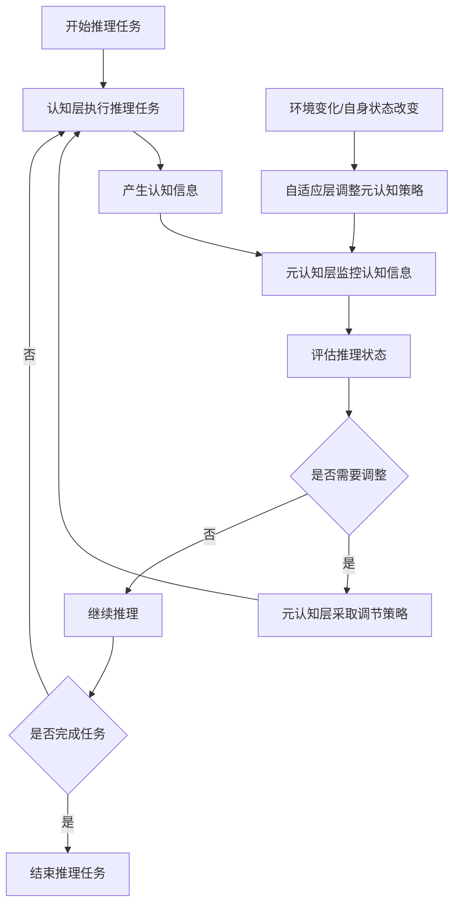

# 推理过程中的元认知策略自适应调整机制

> 关键词：推理过程、元认知策略、自适应调整机制、认知心理学、人工智能、学习策略、决策优化

> 摘要：本文深入探讨推理过程中的元认知策略自适应调整机制。首先介绍了相关背景知识，包括研究目的、预期读者等内容。接着阐述了核心概念，分析了元认知策略与推理过程的联系，并给出了相应的文本示意图和 Mermaid 流程图。详细讲解了核心算法原理，结合 Python 源代码进行阐述，同时给出数学模型和公式，并举例说明。通过项目实战，展示了代码的实际案例并进行详细解释。探讨了该机制在不同场景下的实际应用，推荐了相关的学习资源、开发工具框架以及论文著作。最后总结了未来发展趋势与挑战，提供了常见问题解答和扩展阅读参考资料，旨在全面深入地揭示推理过程中元认知策略自适应调整机制的奥秘，为相关领域的研究和实践提供有价值的参考。

## 1. 背景介绍 
### 1.1 目的和范围
在当今信息爆炸的时代，人们每天都面临着大量的信息和复杂的问题，需要进行有效的推理和决策。元认知策略作为一种对认知过程的自我意识和自我调节能力，在推理过程中起着至关重要的作用。本研究的目的在于深入探究推理过程中的元认知策略自适应调整机制，揭示其内在原理和工作方式。范围涵盖了认知心理学、人工智能、教育等多个领域，旨在为提高人们的推理能力、优化决策过程以及开发智能系统提供理论支持和实践指导。

### 1.2 预期读者
本文预期读者包括认知心理学领域的研究人员、人工智能领域的开发者和研究人员、教育工作者以及对元认知和推理过程感兴趣的爱好者。认知心理学研究人员可以从本文中获取关于元认知策略的新的研究视角和方法；人工智能开发者可以借鉴元认知策略自适应调整机制来优化智能系统的推理能力；教育工作者可以将相关理论应用于教学实践，帮助学生提高学习和推理能力；爱好者可以通过本文了解元认知和推理过程的基本原理和最新研究成果。

### 1.3 文档结构概述
本文将按照以下结构进行阐述：首先介绍背景知识，包括研究目的、预期读者等；接着阐述核心概念，分析元认知策略与推理过程的联系；详细讲解核心算法原理，并结合 Python 源代码进行说明；给出数学模型和公式，并举例说明；通过项目实战展示代码的实际案例并进行详细解释；探讨该机制在不同场景下的实际应用；推荐相关的学习资源、开发工具框架以及论文著作；最后总结未来发展趋势与挑战，提供常见问题解答和扩展阅读参考资料。

### 1.4 术语表
#### 1.4.1 核心术语定义
- **推理过程**：从已知信息出发，通过一定的逻辑规则和思维方式得出结论的认知过程。
- **元认知策略**：个体对自己的认知过程进行监控、评估和调节的策略，包括计划、监控和调节等方面。
- **自适应调整机制**：系统根据环境变化和自身状态自动调整策略和行为的机制。

#### 1.4.2 相关概念解释
- **认知**：个体获取、存储、处理和应用信息的心理过程。
- **自我意识**：个体对自己的心理状态、行为和认知过程的觉察和认识。
- **自我调节**：个体根据自我意识对自己的认知、情绪和行为进行调整和控制的过程。

#### 1.4.3 缩略词列表
- **AI**：Artificial Intelligence，人工智能
- **ML**：Machine Learning，机器学习
- **RL**：Reinforcement Learning，强化学习

## 2. 核心概念与联系 
### 核心概念原理
推理过程是人类智能的重要体现，它涉及到对信息的感知、理解、分析和综合等多个环节。元认知策略则是在推理过程中对这些认知活动进行监控和调节的策略。例如，在解决数学问题时，个体首先会制定一个解题计划（计划策略），在解题过程中不断监控自己的思维过程，检查是否出现错误（监控策略），如果发现问题则及时调整解题方法（调节策略）。

元认知策略的自适应调整机制是指在推理过程中，个体根据任务的难度、自身的认知状态和环境的变化等因素，自动调整元认知策略的使用。例如，当任务难度较大时，个体可能会增加监控的频率，更加仔细地检查自己的推理过程；当环境发生变化时，个体可能会调整解题计划，采用新的推理方法。

### 架构的文本示意图
元认知策略自适应调整机制的架构可以分为三个层次：认知层、元认知层和自适应层。

认知层是推理过程的具体实施层，包括对信息的感知、理解、分析和综合等认知活动。元认知层是对认知层的监控和调节层，包括计划、监控和调节等元认知策略。自适应层是根据环境变化和自身状态对元认知策略进行调整的层次。

具体来说，认知层在执行推理任务时会产生各种认知信息，如解题的进度、错误的类型等。元认知层通过对这些认知信息的监控，评估推理过程的状态，并根据评估结果采取相应的调节策略。自适应层则根据环境的变化和自身的状态，对元认知层的策略进行调整，以提高推理的效率和准确性。

### Mermaid 流程图


## 3. 核心算法原理 & 具体操作步骤 
### 核心算法原理
元认知策略自适应调整机制的核心算法可以基于强化学习来实现。强化学习是一种通过智能体与环境进行交互，根据环境反馈的奖励信号来学习最优策略的机器学习方法。

在推理过程中，我们可以将推理任务看作是一个环境，将个体的推理行为看作是智能体的动作，将推理的结果（如是否正确、解题时间等）看作是环境反馈的奖励信号。智能体通过不断地与环境进行交互，学习到在不同的推理状态下应该采取的最优元认知策略。

### 具体操作步骤
1. **定义状态空间**：状态空间包括推理任务的特征（如任务难度、类型等）、个体的认知状态（如知识水平、注意力等）和环境的状态（如时间限制、干扰因素等）。
2. **定义动作空间**：动作空间包括各种元认知策略，如计划策略（选择解题方法、分配时间等）、监控策略（检查推理步骤、评估解题进度等）和调节策略（调整解题方法、重新分配时间等）。
3. **定义奖励函数**：奖励函数根据推理的结果给予智能体相应的奖励或惩罚。例如，如果推理结果正确，则给予正奖励；如果推理结果错误，则给予负奖励；如果解题时间过长，则给予负奖励。
4. **选择强化学习算法**：可以选择 Q - learning、SARSA 等经典的强化学习算法来实现智能体的学习过程。
5. **训练智能体**：智能体通过不断地与环境进行交互，根据奖励信号更新自己的策略，直到收敛到最优策略。

### Python 源代码实现
```python
import numpy as np

# 定义状态空间
state_space_size = 10
# 定义动作空间
action_space_size = 5

# 初始化 Q 表
q_table = np.zeros((state_space_size, action_space_size))

# 定义超参数
learning_rate = 0.1
discount_factor = 0.9
exploration_rate = 1.0
max_exploration_rate = 1.0
min_exploration_rate = 0.01
exploration_decay_rate = 0.001

# 模拟推理环境
def get_reward(state, action):
    # 这里简单模拟奖励函数，实际应用中需要根据具体情况定义
    if state == 0 and action == 0:
        return 1
    else:
        return -1

# 选择动作
def choose_action(state):
    exploration_rate_threshold = np.random.uniform(0, 1)
    if exploration_rate_threshold > exploration_rate:
        action = np.argmax(q_table[state, :])
    else:
        action = np.random.randint(0, action_space_size)
    return action

# Q - learning 算法
num_episodes = 1000
for episode in range(num_episodes):
    state = np.random.randint(0, state_space_size)
    done = False
    while not done:
        action = choose_action(state)
        reward = get_reward(state, action)
        next_state = np.random.randint(0, state_space_size)  # 简单模拟下一个状态
        q_table[state, action] = q_table[state, action] + learning_rate * (
                reward + discount_factor * np.max(q_table[next_state, :]) - q_table[state, action])
        state = next_state
        if reward == 1:
            done = True
    # 探索率衰减
    exploration_rate = min_exploration_rate + (max_exploration_rate - min_exploration_rate) * np.exp(
        -exploration_decay_rate * episode)
```

## 4. 数学模型和公式 & 详细讲解 & 举例说明 
### 数学模型
元认知策略自适应调整机制的数学模型可以基于马尔可夫决策过程（MDP）来描述。马尔可夫决策过程是一个五元组 $(S, A, P, R, \gamma)$，其中：
- $S$ 是状态空间，表示推理过程中所有可能的状态。
- $A$ 是动作空间，表示所有可能的元认知策略。
- $P$ 是状态转移概率，表示在状态 $s$ 下采取动作 $a$ 后转移到状态 $s'$ 的概率，即 $P(s'|s, a)$。
- $R$ 是奖励函数，表示在状态 $s$ 下采取动作 $a$ 后获得的奖励，即 $R(s, a)$。
- $\gamma$ 是折扣因子，取值范围为 $[0, 1]$，用于衡量未来奖励的重要性。

### 公式
在 Q - learning 算法中，Q 值的更新公式为：
$$Q(s, a) = Q(s, a) + \alpha[R(s, a) + \gamma \max_{a'} Q(s', a') - Q(s, a)]$$
其中：
- $Q(s, a)$ 表示在状态 $s$ 下采取动作 $a$ 的 Q 值。
- $\alpha$ 是学习率，用于控制每次更新的步长。
- $R(s, a)$ 是在状态 $s$ 下采取动作 $a$ 获得的奖励。
- $\gamma$ 是折扣因子。
- $s'$ 是采取动作 $a$ 后转移到的下一个状态。
- $\max_{a'} Q(s', a')$ 表示在下一个状态 $s'$ 下所有可能动作的最大 Q 值。

### 详细讲解
Q - learning 算法的核心思想是通过不断地更新 Q 值，使得智能体能够学习到在每个状态下采取最优动作的策略。Q 值表示在某个状态下采取某个动作的预期累积奖励。每次更新 Q 值时，智能体根据当前状态和动作获得奖励，并结合下一个状态的最大 Q 值来更新当前状态和动作的 Q 值。

折扣因子 $\gamma$ 的作用是平衡当前奖励和未来奖励的重要性。当 $\gamma$ 接近 1 时，智能体更注重未来的奖励；当 $\gamma$ 接近 0 时，智能体更注重当前的奖励。

学习率 $\alpha$ 控制每次更新的步长。如果 $\alpha$ 过大，智能体可能会在学习过程中过于激进，导致无法收敛到最优策略；如果 $\alpha$ 过小，智能体的学习速度会很慢。

### 举例说明
假设我们有一个简单的推理任务，状态空间 $S = \{s_1, s_2\}$，动作空间 $A = \{a_1, a_2\}$，初始 Q 表如下：
| 状态 | $a_1$ | $a_2$ |
| --- | --- | --- |
| $s_1$ | 0 | 0 |
| $s_2$ | 0 | 0 |

当前状态 $s = s_1$，智能体选择动作 $a = a_1$，获得奖励 $R(s_1, a_1) = 1$，转移到下一个状态 $s' = s_2$。假设学习率 $\alpha = 0.1$，折扣因子 $\gamma = 0.9$，下一个状态 $s_2$ 的最大 Q 值 $\max_{a'} Q(s_2, a') = 0$。

根据 Q - learning 公式，更新 $Q(s_1, a_1)$ 的值：
$$Q(s_1, a_1) = Q(s_1, a_1) + \alpha[R(s_1, a_1) + \gamma \max_{a'} Q(s_2, a') - Q(s_1, a_1)]$$
$$Q(s_1, a_1) = 0 + 0.1[1 + 0.9 \times 0 - 0] = 0.1$$

更新后的 Q 表如下：
| 状态 | $a_1$ | $a_2$ |
| --- | --- | --- |
| $s_1$ | 0.1 | 0 |
| $s_2$ | 0 | 0 |

## 5. 项目实战：代码实际案例和详细解释说明 
### 5.1  开发环境搭建
为了实现推理过程中的元认知策略自适应调整机制，我们可以使用 Python 语言进行开发。以下是开发环境的搭建步骤：
1. **安装 Python**：可以从 Python 官方网站（https://www.python.org/downloads/）下载并安装 Python 3.x 版本。
2. **安装必要的库**：需要安装 `numpy` 库，用于数值计算。可以使用以下命令进行安装：
```sh
pip install numpy
```

### 5.2  源代码详细实现和代码解读
```python
import numpy as np

# 定义状态空间大小
state_space_size = 10
# 定义动作空间大小
action_space_size = 5

# 初始化 Q 表
q_table = np.zeros((state_space_size, action_space_size))

# 定义超参数
learning_rate = 0.1
discount_factor = 0.9
exploration_rate = 1.0
max_exploration_rate = 1.0
min_exploration_rate = 0.01
exploration_decay_rate = 0.001

# 模拟推理环境
def get_reward(state, action):
    # 这里简单模拟奖励函数，实际应用中需要根据具体情况定义
    if state == 0 and action == 0:
        return 1
    else:
        return -1

# 选择动作
def choose_action(state):
    exploration_rate_threshold = np.random.uniform(0, 1)
    if exploration_rate_threshold > exploration_rate:
        action = np.argmax(q_table[state, :])
    else:
        action = np.random.randint(0, action_space_size)
    return action

# Q - learning 算法
num_episodes = 1000
for episode in range(num_episodes):
    state = np.random.randint(0, state_space_size)
    done = False
    while not done:
        action = choose_action(state)
        reward = get_reward(state, action)
        next_state = np.random.randint(0, state_space_size)  # 简单模拟下一个状态
        q_table[state, action] = q_table[state, action] + learning_rate * (
                reward + discount_factor * np.max(q_table[next_state, :]) - q_table[state, action])
        state = next_state
        if reward == 1:
            done = True
    # 探索率衰减
    exploration_rate = min_exploration_rate + (max_exploration_rate - min_exploration_rate) * np.exp(
        -exploration_decay_rate * episode)

# 输出最终的 Q 表
print("Final Q - table:")
print(q_table)
```

### 代码解读与分析
1. **状态空间和动作空间的定义**：`state_space_size` 和 `action_space_size` 分别定义了状态空间和动作空间的大小。在实际应用中，需要根据具体的推理任务来确定状态空间和动作空间的具体内容。
2. **Q 表的初始化**：`q_table` 是一个二维数组，用于存储每个状态下每个动作的 Q 值。初始时，所有的 Q 值都为 0。
3. **超参数的定义**：`learning_rate` 是学习率，`discount_factor` 是折扣因子，`exploration_rate` 是探索率。`max_exploration_rate` 和 `min_exploration_rate` 分别是探索率的最大值和最小值，`exploration_decay_rate` 是探索率的衰减率。
4. **奖励函数的定义**：`get_reward` 函数用于模拟推理环境，根据当前状态和动作返回相应的奖励。在实际应用中，需要根据具体的推理任务来定义奖励函数。
5. **动作选择函数**：`choose_action` 函数根据探索率来选择动作。当探索率大于随机生成的阈值时，选择 Q 值最大的动作；否则，随机选择一个动作。
6. **Q - learning 算法的实现**：通过循环执行多个回合的训练，每个回合中智能体不断地与环境进行交互，根据奖励信号更新 Q 表。当获得正奖励时，该回合结束。
7. **探索率的衰减**：随着训练的进行，探索率逐渐衰减，使得智能体从更多地探索新动作逐渐过渡到更多地利用已学习到的最优动作。
8. **最终 Q 表的输出**：训练结束后，输出最终的 Q 表，从中可以看出智能体在每个状态下学习到的最优动作。

## 6. 实际应用场景 
### 教育领域
在教育领域，元认知策略自适应调整机制可以帮助学生提高学习和推理能力。例如，智能辅导系统可以根据学生的学习状态和任务难度，自适应地调整辅导策略。当学生遇到困难时，系统可以提供更多的提示和指导；当学生掌握了一定的知识和技能后，系统可以减少提示，让学生更多地自主思考。

### 人工智能领域
在人工智能领域，元认知策略自适应调整机制可以应用于智能机器人、自动驾驶等系统中。例如，智能机器人在执行任务时，可以根据环境的变化和自身的状态，自适应地调整任务规划和执行策略。自动驾驶汽车可以根据路况、交通信号等信息，自适应地调整行驶速度和路线。

### 决策领域
在决策领域，元认知策略自适应调整机制可以帮助决策者优化决策过程。例如，在投资决策中，决策者可以根据市场的变化和自身的风险承受能力，自适应地调整投资策略。在医疗决策中，医生可以根据患者的病情和治疗效果，自适应地调整治疗方案。

## 7. 工具和资源推荐
### 7.1 学习资源推荐
#### 7.1.1 书籍推荐
- 《认知心理学》：介绍了人类认知的基本原理和过程，包括感知、注意、记忆、思维等方面的内容，为理解元认知和推理过程提供了理论基础。
- 《强化学习：原理与Python实现》：详细介绍了强化学习的基本原理和算法，并通过 Python 代码实现了多个实际案例，有助于深入理解元认知策略自适应调整机制的核心算法。
- 《机器学习》：涵盖了机器学习的各种算法和模型，包括监督学习、无监督学习、强化学习等，为相关领域的研究和实践提供了广泛的知识支持。

#### 7.1.2 在线课程
- Coursera 上的“机器学习”课程：由斯坦福大学的 Andrew Ng 教授主讲，是机器学习领域的经典课程，讲解了机器学习的基本概念、算法和应用。
- edX 上的“强化学习基础”课程：系统地介绍了强化学习的基本理论和算法，包括马尔可夫决策过程、Q - learning、SARSA 等。
- 中国大学 MOOC 上的“认知心理学”课程：由国内知名高校的教授授课，详细讲解了认知心理学的基本原理和研究方法。

#### 7.1.3 技术博客和网站
- Medium 上的“Towards Data Science”：汇集了大量关于数据科学、机器学习、人工智能等领域的技术文章和案例，提供了最新的研究成果和实践经验。
- 博客园：国内知名的技术博客网站，有许多关于人工智能、机器学习、认知心理学等领域的技术文章和分享。
- arXiv：一个开放获取的预印本数据库，提供了大量关于计算机科学、物理学、数学等领域的最新研究论文。

### 7.2 开发工具框架推荐
#### 7.2.1 IDE和编辑器
- PyCharm：一款专业的 Python 集成开发环境，提供了代码编辑、调试、版本控制等功能，方便开发者进行 Python 代码的开发和调试。
- Jupyter Notebook：一个交互式的开发环境，支持 Python、R 等多种编程语言，适合进行数据探索、模型训练和结果展示等工作。
- Visual Studio Code：一款轻量级的代码编辑器，支持多种编程语言和插件，具有丰富的扩展功能，可用于 Python 代码的开发和调试。

#### 7.2.2 调试和性能分析工具
- pdb：Python 内置的调试器，可用于调试 Python 代码，帮助开发者定位和解决代码中的问题。
- cProfile：Python 内置的性能分析工具，可用于分析 Python 代码的性能瓶颈，找出代码中耗时较长的部分。
- TensorBoard：一个可视化工具，可用于可视化深度学习模型的训练过程和性能指标，帮助开发者监控和优化模型。

#### 7.2.3 相关框架和库
- NumPy：一个用于科学计算的 Python 库，提供了高效的数组操作和数学函数，是机器学习和数据科学领域的基础库。
- Pandas：一个用于数据处理和分析的 Python 库，提供了数据结构和数据操作工具，方便开发者进行数据清洗、转换和分析。
- OpenAI Gym：一个用于开发和比较强化学习算法的工具包，提供了多种模拟环境和任务，方便开发者进行强化学习算法的实验和验证。

### 7.3 相关论文著作推荐
#### 7.3.1 经典论文
- Richard S. Sutton 和 Andrew G. Barto 的《Reinforcement Learning: An Introduction》：这是强化学习领域的经典著作，系统地介绍了强化学习的基本理论、算法和应用，是学习强化学习的必读文献。
- John H. Flavell 的《Metacognition and Cognitive Monitoring: A New Area of Cognitive - Developmental Inquiry》：该论文首次提出了元认知的概念，对元认知的定义、结构和发展进行了深入的探讨，是元认知领域的经典文献。

#### 7.3.2 最新研究成果
- 可以通过 arXiv、IEEE Xplore、ACM Digital Library 等数据库搜索关于推理过程、元认知策略、自适应调整机制等方面的最新研究论文，了解该领域的前沿动态和研究成果。

#### 7.3.3 应用案例分析
- 一些知名的学术会议和期刊，如 AAAI、IJCAI、Journal of Artificial Intelligence Research 等，会发表关于人工智能、认知科学等领域的应用案例分析论文，可以从中获取关于元认知策略自适应调整机制在实际应用中的案例和经验。

## 8. 总结：未来发展趋势与挑战
### 未来发展趋势
- **与神经科学的融合**：未来的研究可能会将元认知策略自适应调整机制与神经科学相结合，深入探究其神经机制。通过神经影像学技术，如 fMRI、EEG 等，研究大脑在推理过程中的活动模式，揭示元认知策略的神经基础，为开发更加智能的认知增强技术提供理论支持。
- **跨领域应用的拓展**：随着人工智能、教育、医疗等领域的不断发展，元认知策略自适应调整机制的应用范围将不断拓展。例如，在智能医疗领域，结合患者的生理和心理状态，自适应地调整治疗方案和健康管理策略；在智能教育领域，实现个性化的学习路径规划和学习策略指导。
- **多智能体系统的应用**：在多智能体系统中，元认知策略自适应调整机制可以用于协调多个智能体之间的行为和决策。例如，在自动驾驶车队中，各个车辆可以根据自身的状态和周围环境的变化，自适应地调整行驶策略，实现高效、安全的协同行驶。

### 挑战
- **复杂环境的适应性**：在现实世界中，环境往往是复杂多变的，元认知策略自适应调整机制需要具备更强的适应性。如何处理不确定性、噪声和动态变化的环境，是一个亟待解决的问题。
- **可解释性问题**：随着人工智能技术的发展，模型的复杂度不断增加，其决策过程往往难以解释。元认知策略自适应调整机制也面临着可解释性的挑战，如何让人们理解智能系统的决策依据和调整策略，是提高用户信任度和接受度的关键。
- **伦理和法律问题**：元认知策略自适应调整机制的应用可能会涉及到伦理和法律问题。例如，在智能决策系统中，如何确保决策的公正性和合法性；在智能教育系统中，如何保护学生的隐私和权益等。

## 9. 附录：常见问题与解答
### 问题 1：元认知策略自适应调整机制与普通的推理策略有什么区别？
元认知策略自适应调整机制不仅关注推理的具体过程和方法，还注重对推理过程的监控和调节。普通的推理策略主要是按照一定的逻辑规则和方法进行推理，而元认知策略自适应调整机制能够根据任务的难度、自身的认知状态和环境的变化等因素，自动调整推理策略，以提高推理的效率和准确性。

### 问题 2：如何衡量元认知策略自适应调整机制的效果？
可以从多个方面衡量元认知策略自适应调整机制的效果，如推理的准确性、解题时间、错误率等。在实际应用中，可以通过实验对比的方法，比较使用元认知策略自适应调整机制和不使用该机制的情况下，推理任务的完成情况，从而评估其效果。

### 问题 3：在实际应用中，如何确定状态空间和动作空间的具体内容？
状态空间和动作空间的具体内容需要根据具体的推理任务来确定。一般来说，状态空间可以包括任务的特征（如难度、类型等）、个体的认知状态（如知识水平、注意力等）和环境的状态（如时间限制、干扰因素等）。动作空间可以包括各种元认知策略，如计划策略、监控策略和调节策略等。在确定状态空间和动作空间时，需要综合考虑任务的需求和实际情况。

## 10. 扩展阅读 & 参考资料
### 扩展阅读
- 《思考，快与慢》：作者丹尼尔·卡尼曼是行为经济学领域的大师，书中介绍了人类思维的两种模式：快思考和慢思考，以及它们在决策和判断中的作用，有助于深入理解人类的认知和推理过程。
- 《人工智能：一种现代的方法》：全面介绍了人工智能的各个领域，包括知识表示、推理、机器学习、自然语言处理等，是人工智能领域的经典教材。

### 参考资料
- Flavell, J. H. (1979). Metacognition and cognitive monitoring: A new area of cognitive - developmental inquiry. American psychologist, 34(10), 906.
- Sutton, R. S., & Barto, A. G. (2018). Reinforcement learning: An introduction. MIT press.
- 李航. (2012). 统计学习方法. 清华大学出版社.