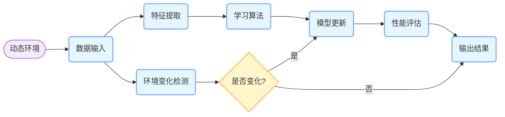

# 提升AI模型在动态环境学习中的适应能力

> 关键词：AI模型、动态环境、适应能力、学习算法、模型更新

> 摘要：本文聚焦于提升AI模型在动态环境学习中的适应能力这一关键问题。随着AI技术的广泛应用，现实世界中的环境往往是动态变化的，传统的AI模型难以在这种环境下保持良好的性能。文章首先介绍了相关背景知识，包括目的、预期读者等内容；接着阐述了核心概念与联系，给出了原理和架构的示意图与流程图；详细讲解了核心算法原理及具体操作步骤，并结合Python源代码进行说明；还探讨了数学模型和公式，通过举例加深理解；通过项目实战展示了代码的实际案例及详细解释；分析了实际应用场景；推荐了相关的工具和资源；最后总结了未来发展趋势与挑战，提供了常见问题解答及扩展阅读参考资料，旨在为提升AI模型在动态环境中的适应能力提供全面的技术指导。

## 1. 背景介绍 
### 1.1 目的和范围
在当今的科技发展中，AI模型已经在诸多领域得到了广泛的应用，如自动驾驶、智能机器人、金融预测等。然而，这些应用场景中的环境往往是动态变化的，例如自动驾驶中道路状况、交通规则的变化，智能机器人工作场景的改变，金融市场的波动等。传统的AI模型通常是基于静态数据集进行训练的，其参数在训练完成后固定不变，难以适应动态环境中的变化，导致模型性能下降甚至失效。

本文的目的在于深入探讨如何提升AI模型在动态环境学习中的适应能力，研究范围涵盖了相关的核心概念、算法原理、数学模型、实际应用场景以及开发工具和资源等方面，旨在为研究者和开发者提供全面的技术参考，以帮助他们开发出更具适应性的AI模型。

### 1.2 预期读者
本文的预期读者包括AI领域的研究人员、软件开发人员、数据科学家、机器学习工程师以及对AI技术感兴趣的相关专业学生。对于希望深入了解AI模型在动态环境中学习机制的读者，本文将提供系统的知识讲解和技术指导；对于从事实际开发工作的人员，本文的项目实战部分将为他们提供具体的实现思路和代码示例。

### 1.3 文档结构概述
本文将按照以下结构进行组织：首先介绍背景知识，包括目的、预期读者和文档结构概述等内容；接着阐述核心概念与联系，通过文本示意图和Mermaid流程图展示其原理和架构；详细讲解核心算法原理及具体操作步骤，并结合Python源代码进行说明；探讨数学模型和公式，通过举例加深理解；通过项目实战展示代码的实际案例及详细解释；分析实际应用场景；推荐相关的工具和资源；最后总结未来发展趋势与挑战，提供常见问题解答及扩展阅读参考资料。

### 1.4 术语表
#### 1.4.1 核心术语定义
- **AI模型**：人工智能模型是一种基于数据和算法构建的计算模型，用于模拟人类的智能行为，如分类、预测、决策等。
- **动态环境**：指环境中的数据、规则、任务等因素随时间不断变化的环境，例如实时的交通流量、不断更新的市场数据等。
- **适应能力**：AI模型在动态环境中能够根据环境的变化及时调整自身的参数和结构，以保持良好性能的能力。
- **学习算法**：用于训练AI模型的算法，如梯度下降算法、随机森林算法等。
- **模型更新**：在动态环境中，根据新的数据和环境变化对AI模型的参数或结构进行调整的过程。

#### 1.4.2 相关概念解释
- **在线学习**：一种在数据不断到来的过程中实时更新模型的学习方式，与传统的批量学习相对。在线学习可以使模型及时适应动态环境的变化。
- **迁移学习**：将在一个任务或领域中学习到的知识迁移到另一个相关任务或领域中的学习方法，通过利用已有的知识来加速模型在新环境中的学习。
- **强化学习**：一种通过智能体与环境进行交互，根据环境反馈的奖励信号来学习最优行为策略的学习方法，适用于处理动态环境中的决策问题。

#### 1.4.3 缩略词列表
- **AI**：Artificial Intelligence（人工智能）
- **ML**：Machine Learning（机器学习）
- **DL**：Deep Learning（深度学习）
- **RL**：Reinforcement Learning（强化学习）

## 2. 核心概念与联系 
### 核心概念原理
在动态环境中，AI模型需要不断地感知环境的变化，并根据这些变化调整自身的参数和结构，以保持良好的性能。其核心原理在于模型的学习和更新机制。

学习机制负责从环境中获取数据，并根据这些数据更新模型的参数。常见的学习算法包括监督学习、无监督学习和强化学习等。监督学习通过给定的输入数据和对应的标签来学习模型的参数；无监督学习则在没有标签的情况下，从数据中发现潜在的结构和模式；强化学习通过智能体与环境的交互，根据环境反馈的奖励信号来学习最优的行为策略。

更新机制则负责在环境发生变化时，及时调整模型的参数和结构。这可以通过在线学习、迁移学习等方法来实现。在线学习允许模型在新数据到来时实时更新，而迁移学习则可以利用已有的知识来加速模型在新环境中的学习。

### 架构的文本示意图
```plaintext
动态环境
|
|-- 数据输入
|   |
|   |-- 特征提取
|   |   |
|   |   |-- 学习算法
|   |       |
|   |       |-- 模型更新
|   |           |
|   |           |-- 性能评估
|   |               |
|   |               |-- 输出结果
|   |
|   |-- 环境变化检测
|       |
|       |-- 触发模型更新
```

### Mermaid流程图


## 3. 核心算法原理 & 具体操作步骤 
### 在线学习算法原理
在线学习是一种在数据不断到来的过程中实时更新模型的学习方式。其核心思想是在每次新数据到来时，利用该数据对模型进行微小的更新，而不是像批量学习那样在所有数据都收集完成后再进行训练。

以简单的线性回归模型为例，假设我们有一个线性回归模型 $y = \theta_0 + \theta_1x_1 + \cdots + \theta_nx_n$，其中 $y$ 是输出，$x_1, \cdots, x_n$ 是输入特征，$\theta_0, \cdots, \theta_n$ 是模型的参数。

在线学习的目标是在每次新数据 $(x^{(t)}, y^{(t)})$ 到来时，更新模型的参数 $\theta$，使得模型的预测误差最小。常用的更新方法是随机梯度下降（SGD）算法。

随机梯度下降算法的更新公式为：
$\theta_j := \theta_j - \alpha \frac{\partial}{\partial \theta_j} J(\theta; x^{(t)}, y^{(t)})$

其中，$\alpha$ 是学习率，$J(\theta; x^{(t)}, y^{(t)})$ 是损失函数，通常使用均方误差损失函数：
$J(\theta; x^{(t)}, y^{(t)}) = \frac{1}{2}(h_{\theta}(x^{(t)}) - y^{(t)})^2$

其中，$h_{\theta}(x^{(t)})$ 是模型的预测值，$h_{\theta}(x^{(t)}) = \theta_0 + \theta_1x_1^{(t)} + \cdots + \theta_nx_n^{(t)}$。

### Python源代码实现
```python
import numpy as np

class OnlineLinearRegression:
    def __init__(self, num_features, learning_rate=0.01):
        self.theta = np.zeros(num_features + 1)  # 初始化参数
        self.learning_rate = learning_rate

    def predict(self, x):
        x = np.insert(x, 0, 1)  # 插入偏置项
        return np.dot(self.theta, x)

    def update(self, x, y):
        x = np.insert(x, 0, 1)  # 插入偏置项
        prediction = self.predict(x[1:])
        error = prediction - y
        gradient = error * x
        self.theta -= self.learning_rate * gradient
```

### 具体操作步骤
1. **初始化模型**：创建一个 `OnlineLinearRegression` 类的实例，指定特征数量和学习率。
2. **接收新数据**：每次接收到新的数据 $(x, y)$ 时，调用 `update` 方法更新模型的参数。
3. **进行预测**：在需要进行预测时，调用 `predict` 方法进行预测。

以下是一个简单的示例：
```python
# 初始化模型
model = OnlineLinearRegression(num_features=2, learning_rate=0.01)

# 模拟新数据
new_data = [(np.array([1, 2]), 3), (np.array([2, 3]), 4), (np.array([3, 4]), 5)]

# 更新模型
for x, y in new_data:
    model.update(x, y)

# 进行预测
test_x = np.array([4, 5])
prediction = model.predict(test_x)
print("预测值:", prediction)
```

## 4. 数学模型和公式 & 详细讲解 & 举例说明 
### 线性回归模型的数学模型和公式
线性回归模型是一种用于预测连续数值的模型，其数学模型可以表示为：
$y = \theta_0 + \theta_1x_1 + \cdots + \theta_nx_n + \epsilon$

其中，$y$ 是输出变量，$x_1, \cdots, x_n$ 是输入特征，$\theta_0, \cdots, \theta_n$ 是模型的参数，$\epsilon$ 是误差项，通常假设 $\epsilon$ 服从均值为 0，方差为 $\sigma^2$ 的正态分布。

为了估计模型的参数 $\theta$，我们通常使用最小二乘法，即最小化误差平方和：
$J(\theta) = \frac{1}{2m} \sum_{i=1}^{m} (h_{\theta}(x^{(i)}) - y^{(i)})^2$

其中，$m$ 是样本数量，$h_{\theta}(x^{(i)})$ 是模型的预测值，$h_{\theta}(x^{(i)}) = \theta_0 + \theta_1x_1^{(i)} + \cdots + \theta_nx_n^{(i)}$。

### 详细讲解
最小二乘法的目标是找到一组参数 $\theta$，使得误差平方和 $J(\theta)$ 最小。为了实现这一目标，我们可以使用梯度下降算法。

梯度下降算法的基本思想是沿着损失函数的负梯度方向更新参数，直到损失函数达到最小值。梯度下降算法的更新公式为：
$\theta_j := \theta_j - \alpha \frac{\partial}{\partial \theta_j} J(\theta)$

其中，$\alpha$ 是学习率，$\frac{\partial}{\partial \theta_j} J(\theta)$ 是损失函数 $J(\theta)$ 关于参数 $\theta_j$ 的偏导数。

对于线性回归模型，损失函数 $J(\theta)$ 关于参数 $\theta_j$ 的偏导数为：
$\frac{\partial}{\partial \theta_j} J(\theta) = \frac{1}{m} \sum_{i=1}^{m} (h_{\theta}(x^{(i)}) - y^{(i)}) x_j^{(i)}$

### 举例说明
假设我们有一个简单的线性回归问题，数据集如下：
| $x$ | $y$ |
|---|---|
| 1 | 2 |
| 2 | 4 |
| 3 | 6 |

我们的目标是找到一个线性模型 $y = \theta_0 + \theta_1x$ 来拟合这些数据。

首先，我们初始化参数 $\theta_0 = 0$，$\theta_1 = 0$，学习率 $\alpha = 0.01$。

然后，我们使用梯度下降算法更新参数：
1. 计算预测值 $h_{\theta}(x^{(i)})$：
   - 对于第一个样本 $(x^{(1)} = 1, y^{(1)} = 2)$，$h_{\theta}(x^{(1)}) = \theta_0 + \theta_1x^{(1)} = 0 + 0 \times 1 = 0$。
   - 对于第二个样本 $(x^{(2)} = 2, y^{(2)} = 4)$，$h_{\theta}(x^{(2)}) = \theta_0 + \theta_1x^{(2)} = 0 + 0 \times 2 = 0$。
   - 对于第三个样本 $(x^{(3)} = 3, y^{(3)} = 6)$，$h_{\theta}(x^{(3)}) = \theta_0 + \theta_1x^{(3)} = 0 + 0 \times 3 = 0$。
2. 计算误差 $(h_{\theta}(x^{(i)}) - y^{(i)})$：
   - 对于第一个样本，误差为 $0 - 2 = -2$。
   - 对于第二个样本，误差为 $0 - 4 = -4$。
   - 对于第三个样本，误差为 $0 - 6 = -6$。
3. 计算偏导数 $\frac{\partial}{\partial \theta_j} J(\theta)$：
   - 对于 $\theta_0$，$\frac{\partial}{\partial \theta_0} J(\theta) = \frac{1}{3} \sum_{i=1}^{3} (h_{\theta}(x^{(i)}) - y^{(i)}) = \frac{1}{3} (-2 - 4 - 6) = -4$。
   - 对于 $\theta_1$，$\frac{\partial}{\partial \theta_1} J(\theta) = \frac{1}{3} \sum_{i=1}^{3} (h_{\theta}(x^{(i)}) - y^{(i)}) x^{(i)} = \frac{1}{3} (-2 \times 1 - 4 \times 2 - 6 \times 3) = - \frac{28}{3}$。
4. 更新参数：
   - $\theta_0 := \theta_0 - \alpha \frac{\partial}{\partial \theta_0} J(\theta) = 0 - 0.01 \times (-4) = 0.04$。
   - $\theta_1 := \theta_1 - \alpha \frac{\partial}{\partial \theta_1} J(\theta) = 0 - 0.01 \times (-\frac{28}{3}) \approx 0.0933$。

重复上述步骤，直到参数收敛。

## 5. 项目实战：代码实际案例和详细解释说明 
### 5.1  开发环境搭建
本项目使用Python语言进行开发，需要安装以下库：
- **NumPy**：用于数值计算。
- **Pandas**：用于数据处理。
- **Scikit-learn**：用于机器学习算法。

可以使用以下命令安装这些库：
```sh
pip install numpy pandas scikit-learn
```

### 5.2  源代码详细实现和代码解读
我们将使用一个简单的时间序列预测问题作为项目实战的案例，模拟动态环境中的数据变化。

```python
import numpy as np
import pandas as pd
from sklearn.linear_model import SGDRegressor

# 生成模拟数据
def generate_data(num_samples):
    time = np.arange(num_samples)
    trend = 0.1 * time
    seasonality = 10 * np.sin(2 * np.pi * time / 365)
    noise = np.random.normal(0, 1, num_samples)
    data = trend + seasonality + noise
    return data

# 在线学习函数
def online_learning(data, window_size=30, learning_rate=0.01):
    model = SGDRegressor(learning_rate='constant', eta0=learning_rate)
    predictions = []
    for i in range(window_size, len(data)):
        X_train = np.array(data[i - window_size:i]).reshape(-1, 1)
        y_train = np.array(data[i - window_size + 1:i + 1])
        model.partial_fit(X_train, y_train)
        next_prediction = model.predict(np.array([[data[i]]]))
        predictions.append(next_prediction[0])
    return predictions

# 主函数
def main():
    num_samples = 365 * 2
    data = generate_data(num_samples)
    predictions = online_learning(data)
    actual_values = data[30:]
    # 计算均方误差
    mse = np.mean((predictions - actual_values) ** 2)
    print("均方误差:", mse)

if __name__ == "__main__":
    main()
```

### 5.3  代码解读与分析
1. **生成模拟数据**：`generate_data` 函数用于生成模拟的时间序列数据，包含趋势、季节性和噪声成分。
2. **在线学习函数**：`online_learning` 函数使用 `SGDRegressor` 进行在线学习。在每次迭代中，使用前 `window_size` 个数据作为训练集，预测下一个时间步的值。
3. **主函数**：`main` 函数调用 `generate_data` 生成数据，调用 `online_learning` 进行在线学习，并计算预测结果的均方误差。

通过这种方式，模型可以在数据不断变化的情况下实时更新，以适应动态环境。

## 6. 实际应用场景 
### 自动驾驶
在自动驾驶领域，车辆需要在动态的交通环境中行驶，包括道路状况、交通规则、其他车辆和行人的行为等不断变化的因素。AI模型需要实时感知这些变化，并根据变化调整车辆的行驶策略，如加速、减速、转弯等。通过提升AI模型在动态环境中的适应能力，可以提高自动驾驶的安全性和可靠性。

### 智能机器人
智能机器人通常需要在复杂多变的环境中执行任务，如家庭服务机器人需要适应不同的家居环境，工业机器人需要适应不同的生产任务。AI模型可以帮助机器人感知环境的变化，并根据变化调整自身的行为，如避障、抓取物体等。提升AI模型的适应能力可以使机器人更加灵活和智能。

### 金融预测
金融市场是一个高度动态的环境，股票价格、汇率、利率等因素不断变化。AI模型可以用于金融预测，如预测股票价格走势、风险评估等。通过提升AI模型在动态环境中的适应能力，可以提高金融预测的准确性，帮助投资者做出更明智的决策。

### 医疗诊断
在医疗领域，患者的病情可能会随着时间的推移而发生变化，新的疾病和症状也可能不断出现。AI模型可以用于医疗诊断，如疾病预测、影像诊断等。提升AI模型在动态环境中的适应能力，可以使模型更好地适应患者病情的变化，提高医疗诊断的准确性和效率。

## 7. 工具和资源推荐
### 7.1 学习资源推荐
#### 7.1.1 书籍推荐
- 《机器学习》（周志华著）：一本全面介绍机器学习理论和算法的经典教材，适合初学者和有一定基础的读者。
- 《深度学习》（Ian Goodfellow、Yoshua Bengio和Aaron Courville著）：深度学习领域的权威著作，深入讲解了深度学习的原理和应用。
- 《强化学习：原理与Python实现》（智能系统学习与应用系列）：系统介绍了强化学习的基本原理和算法，并通过Python代码实现了多个实际案例。

#### 7.1.2 在线课程
- Coursera上的“机器学习”课程（Andrew Ng教授主讲）：经典的机器学习入门课程，内容全面，讲解详细。
- edX上的“深度学习”课程：由多位知名学者和专家授课，深入讲解深度学习的前沿技术。
- 中国大学MOOC上的“人工智能基础”课程：适合初学者，介绍了人工智能的基本概念、算法和应用。

#### 7.1.3 技术博客和网站
- Medium：一个技术博客平台，有许多AI领域的专家和开发者分享他们的经验和见解。
- Towards Data Science：专注于数据科学和机器学习领域的技术博客，提供了大量的优质文章和教程。
- ArXiv：一个预印本数据库，包含了许多AI领域的最新研究成果。

### 7.2 开发工具框架推荐
#### 7.2.1 IDE和编辑器
- PyCharm：一款功能强大的Python集成开发环境，提供了丰富的代码编辑、调试和版本控制等功能。
- Jupyter Notebook：一个交互式的开发环境，适合进行数据探索、模型训练和可视化等工作。
- Visual Studio Code：一款轻量级的代码编辑器，支持多种编程语言，有丰富的插件和扩展。

#### 7.2.2 调试和性能分析工具
- TensorBoard：TensorFlow的可视化工具，可以用于查看模型的训练过程、损失函数曲线、梯度变化等信息。
- PyTorch Profiler：PyTorch的性能分析工具，可以帮助开发者分析模型的性能瓶颈，优化代码。
- cProfile：Python的内置性能分析工具，可以分析代码的运行时间和函数调用次数。

#### 7.2.3 相关框架和库
- TensorFlow：一个开源的机器学习框架，提供了丰富的工具和接口，支持各种深度学习算法。
- PyTorch：另一个流行的深度学习框架，具有动态图和易于使用的特点，适合研究和开发。
- Scikit-learn：一个简单易用的机器学习库，提供了各种经典的机器学习算法和工具，适合初学者和快速开发。

### 7.3 相关论文著作推荐
#### 7.3.1 经典论文
- “Gradient-Based Learning Applied to Document Recognition”（Yann LeCun等著）：介绍了卷积神经网络（CNN）的经典论文，对图像识别领域产生了深远的影响。
- “Playing Atari with Deep Reinforcement Learning”（Volodymyr Mnih等著）：首次将深度学习与强化学习相结合，实现了在Atari游戏中的智能决策。
- “Attention Is All You Need”（Ashish Vaswani等著）：提出了Transformer模型，为自然语言处理领域带来了革命性的变化。

#### 7.3.2 最新研究成果
- 关注顶级学术会议如NeurIPS、ICML、CVPR等的最新论文，了解AI领域的最新研究动态和技术进展。
- 关注知名学术期刊如Journal of Artificial Intelligence Research（JAIR）、Artificial Intelligence等的最新文章。

#### 7.3.3 应用案例分析
- 许多公司和研究机构会发布他们在AI领域的应用案例，如Google、Microsoft、OpenAI等。可以通过他们的官方网站或技术博客了解这些案例，学习实际应用中的经验和技巧。

## 8. 总结：未来发展趋势与挑战
### 未来发展趋势
- **多模态融合**：未来的AI模型将融合多种模态的数据，如图像、语音、文本等，以更全面地感知动态环境。例如，在自动驾驶中，结合摄像头、雷达、激光雷达等多种传感器的数据，提高环境感知的准确性。
- **元学习**：元学习旨在让模型学会如何学习，通过在多个任务上进行训练，使模型能够快速适应新的任务和环境。这将有助于提升AI模型在动态环境中的适应能力。
- **自适应架构**：开发能够根据环境变化自动调整自身架构的AI模型，例如动态调整网络层数、神经元数量等，以提高模型的灵活性和适应性。
- **人机协作**：将人类的知识和经验与AI模型相结合，实现人机协作的智能系统。人类可以在动态环境中提供实时的反馈和指导，帮助AI模型更好地适应环境变化。

### 挑战
- **数据的动态性和不确定性**：动态环境中的数据往往具有高度的动态性和不确定性，如何有效地处理这些数据是一个挑战。例如，在金融市场中，数据的变化是复杂和不可预测的，需要开发更强大的数据分析和处理方法。
- **模型的可解释性**：随着AI模型的复杂度不断增加，模型的可解释性变得越来越重要。在动态环境中，用户需要了解模型的决策过程和依据，以便在必要时进行干预和调整。
- **计算资源的限制**：提升AI模型在动态环境中的适应能力通常需要大量的计算资源，如GPU、TPU等。如何在有限的计算资源下实现高效的模型训练和推理是一个挑战。
- **伦理和安全问题**：在动态环境中，AI模型的决策可能会对人类和社会产生重大影响。如何确保AI模型的决策符合伦理和安全标准，避免潜在的风险和危害，是一个亟待解决的问题。

## 9. 附录：常见问题与解答
### 问题1：如何选择合适的学习率？
学习率是梯度下降算法中的一个重要参数，它控制着参数更新的步长。如果学习率过大，模型可能会跳过最优解，导致无法收敛；如果学习率过小，模型的收敛速度会很慢。选择合适的学习率通常需要进行实验和调优。可以尝试不同的学习率值，观察模型的训练过程和性能，选择能够使模型快速收敛且性能较好的学习率。

### 问题2：在线学习和批量学习有什么区别？
批量学习是在所有数据都收集完成后，一次性对模型进行训练。而在线学习是在数据不断到来的过程中，实时对模型进行更新。在线学习更适合动态环境，因为它可以及时适应数据的变化；而批量学习更适合静态数据集，因为它可以利用所有的数据进行训练，提高模型的性能。

### 问题3：如何评估AI模型在动态环境中的适应能力？
可以使用多种指标来评估AI模型在动态环境中的适应能力，如均方误差（MSE）、平均绝对误差（MAE）、准确率、召回率等。此外，还可以观察模型在环境变化后的性能恢复速度和稳定性，以及模型对新数据的学习能力。

### 问题4：迁移学习在动态环境中有什么作用？
迁移学习可以利用已有的知识来加速模型在新环境中的学习。在动态环境中，当环境发生变化时，模型可以通过迁移学习快速适应新的任务和数据，减少训练时间和计算资源的消耗。

## 10. 扩展阅读 & 参考资料
### 扩展阅读
- 《人工智能：现代方法》（Stuart Russell和Peter Norvig著）：全面介绍了人工智能的理论、算法和应用，是人工智能领域的经典著作。
- 《机器学习实战》（Peter Harrington著）：通过实际案例介绍了机器学习的算法和应用，适合初学者和有一定实践经验的读者。
- 《深度学习实战》（Antoine Géron著）：详细介绍了深度学习的原理和实践，通过大量的代码示例和实际案例帮助读者掌握深度学习技术。

### 参考资料
- 相关学术论文和研究报告，如NeurIPS、ICML、CVPR等会议的论文。
- 各大开源框架的官方文档，如TensorFlow、PyTorch、Scikit-learn等。
- 在线学习平台和技术博客上的相关文章和教程。