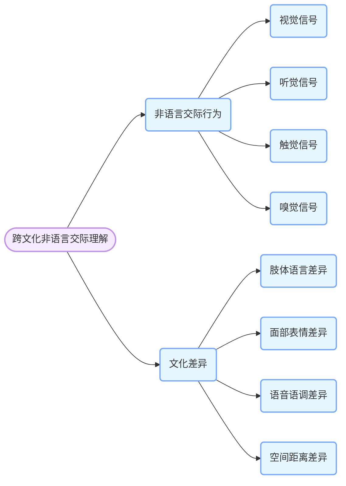

# 提升AI模型在跨文化非语言交际理解中的准确性

> 关键词：AI模型、跨文化、非语言交际、准确性、机器学习、深度学习、多模态融合

> 摘要：本文聚焦于提升AI模型在跨文化非语言交际理解中的准确性这一关键问题。随着全球化的发展，跨文化交流日益频繁，非语言交际在其中起着重要作用。然而，由于不同文化背景下非语言交际行为的差异，AI模型在理解这些行为时面临诸多挑战。文章首先介绍了相关背景知识，包括目的、预期读者等；接着阐述了核心概念与联系，分析了核心算法原理和具体操作步骤，并通过数学模型和公式进行深入讲解；然后通过项目实战给出代码实际案例和详细解释；探讨了实际应用场景；推荐了相关工具和资源；最后总结了未来发展趋势与挑战，并提供常见问题解答和扩展阅读参考资料，旨在为提升AI模型在跨文化非语言交际理解中的准确性提供全面的技术指导和理论支持。

## 1. 背景介绍 
### 1.1 目的和范围
在当今全球化的时代，不同文化背景的人们之间的交流越来越频繁。非语言交际作为人类交流的重要组成部分，包括肢体语言、面部表情、语音语调等，在跨文化交流中具有关键作用。然而，不同文化对这些非语言信号的理解和表达方式存在显著差异。本文章的目的在于深入探讨如何提升AI模型在跨文化非语言交际理解中的准确性，以促进更有效的跨文化交流。

本文章的范围涵盖了AI模型在跨文化非语言交际理解领域的多个方面，包括核心概念的阐述、算法原理的分析、实际应用场景的探讨以及相关工具和资源的推荐等。旨在为研究人员、开发者和相关从业者提供全面的技术指导和理论支持。

### 1.2 预期读者
本文的预期读者包括但不限于以下几类人群：
- **AI研究人员**：对跨文化非语言交际理解领域感兴趣，希望深入了解相关技术和理论，以推动该领域的研究进展。
- **AI开发者**：从事AI模型开发工作，希望学习如何提升AI模型在跨文化非语言交际理解中的准确性，以开发出更具实用性和适应性的AI产品。
- **跨文化交流领域的从业者**：如翻译人员、外交人员等，希望借助AI技术更好地理解跨文化非语言交际行为，提高跨文化交流的效果。
- **相关专业的学生**：如计算机科学、语言学、心理学等专业的学生，希望通过阅读本文了解跨文化非语言交际理解领域的前沿知识和技术。

### 1.3 文档结构概述
本文的文档结构如下：
- **核心概念与联系**：介绍跨文化非语言交际理解的核心概念，包括非语言交际的定义、跨文化差异的表现等，并分析这些概念之间的联系。
- **核心算法原理 & 具体操作步骤**：阐述提升AI模型在跨文化非语言交际理解中准确性的核心算法原理，如机器学习、深度学习等，并给出具体的操作步骤。
- **数学模型和公式 & 详细讲解 & 举例说明**：通过数学模型和公式对核心算法进行深入讲解，并通过具体的例子说明其应用。
- **项目实战：代码实际案例和详细解释说明**：通过一个实际的项目案例，展示如何使用代码实现提升AI模型在跨文化非语言交际理解中的准确性，并对代码进行详细解释。
- **实际应用场景**：探讨AI模型在跨文化非语言交际理解中的实际应用场景，如智能客服、跨文化教育等。
- **工具和资源推荐**：推荐相关的学习资源、开发工具框架和论文著作，帮助读者进一步深入学习和研究。
- **总结：未来发展趋势与挑战**：总结提升AI模型在跨文化非语言交际理解中准确性的未来发展趋势和面临的挑战。
- **附录：常见问题与解答**：提供常见问题的解答，帮助读者解决在学习和实践过程中遇到的问题。
- **扩展阅读 & 参考资料**：提供相关的扩展阅读资料和参考书目，方便读者进一步深入学习和研究。

### 1.4 术语表
#### 1.4.1 核心术语定义
- **AI模型**：人工智能模型，是一种基于计算机算法和数据的系统，能够模拟人类的智能行为，如学习、推理、决策等。
- **跨文化**：涉及不同文化背景的人们之间的交流和互动。
- **非语言交际**：指除语言之外的其他交际方式，包括肢体语言、面部表情、语音语调、空间距离等。
- **准确性**：指AI模型对跨文化非语言交际行为的理解与实际情况的符合程度。
- **多模态融合**：将多种不同类型的信息（如图像、音频、文本等）进行融合处理，以提高AI模型的性能。

#### 1.4.2 相关概念解释
- **文化差异**：不同文化背景的人们在价值观、信仰、习俗、行为方式等方面存在的差异。这些差异会影响非语言交际行为的表达方式和理解方式。
- **机器学习**：是一门多领域交叉学科，涉及概率论、统计学、逼近论、凸分析、算法复杂度理论等多门学科。它专门研究计算机怎样模拟或实现人类的学习行为，以获取新的知识或技能，重新组织已有的知识结构使之不断改善自身的性能。
- **深度学习**：是机器学习的一个分支领域，它是一种基于对数据进行表征学习的方法。深度学习通过构建具有很多层的神经网络模型，自动从数据中学习到复杂的模式和特征。

#### 1.4.3 缩略词列表
- **AI**：Artificial Intelligence，人工智能
- **ML**：Machine Learning，机器学习
- **DL**：Deep Learning，深度学习
- **CNN**：Convolutional Neural Network，卷积神经网络
- **RNN**：Recurrent Neural Network，循环神经网络
- **LSTM**：Long Short-Term Memory，长短期记忆网络

## 2. 核心概念与联系 

### 非语言交际的定义与分类
非语言交际是指通过非语言符号来传递信息的过程。这些非语言符号包括肢体语言（如手势、姿势、身体动作等）、面部表情（如微笑、皱眉、眼神等）、语音语调（如音量、语速、语调变化等）、空间距离（如个人空间、社交距离等）以及副语言（如咳嗽、叹息、停顿等）。

根据非语言交际的表现形式，可以将其分为以下几类：
- **视觉非语言交际**：主要通过身体的动作、姿势、面部表情等视觉信号来传递信息。
- **听觉非语言交际**：主要通过语音语调、副语言等听觉信号来传递信息。
- **触觉非语言交际**：主要通过身体的接触来传递信息，如握手、拥抱等。
- **嗅觉非语言交际**：主要通过气味来传递信息，如香水的使用等。

### 跨文化差异在非语言交际中的表现
不同文化背景的人们在非语言交际行为上存在显著差异。这些差异主要体现在以下几个方面：
- **肢体语言**：不同文化对各种手势和姿势的理解和使用可能不同。例如，在中国，点头表示同意；而在保加利亚，点头可能表示不同意。
- **面部表情**：虽然一些基本的面部表情（如微笑、愤怒等）在大多数文化中具有相似的含义，但在某些文化中，面部表情的表达程度和方式可能有所不同。例如，在日本，人们通常会更加克制自己的面部表情，以保持礼貌和尊重。
- **语音语调**：不同文化对语音语调的理解和使用也存在差异。例如，在一些文化中，语速较快可能表示热情和活力；而在另一些文化中，语速过快可能被认为是不礼貌或缺乏耐心。
- **空间距离**：不同文化对个人空间和社交距离的需求也不同。例如，在拉丁美洲和中东地区，人们通常喜欢保持较近的社交距离；而在北欧和北美地区，人们则更喜欢保持较远的社交距离。

### 核心概念的联系
AI模型在跨文化非语言交际理解中的准确性受到多种因素的影响，这些因素之间相互关联。非语言交际的多样性和跨文化差异增加了AI模型理解的难度。而多模态融合技术可以将不同类型的非语言交际信息进行整合，从而提高AI模型对跨文化非语言交际的理解能力。机器学习和深度学习算法则为AI模型的训练和优化提供了技术支持，通过不断学习和适应不同文化背景下的非语言交际行为，提升模型的准确性。

### 文本示意图
```plaintext
              跨文化非语言交际理解
                    |
        +-----------+-----------+
        |                       |
  非语言交际行为            文化差异
        |                       |
  +-----+-----+           +-----+-----+
  |           |           |           |
视觉信号    听觉信号    肢体语言差异  面部表情差异
  |           |           |           |
  ...         ...         ...         ...
```

### Mermaid流程图


## 3. 核心算法原理 & 具体操作步骤 

### 机器学习算法原理
机器学习是一种让计算机通过数据学习模式和规律的方法。在跨文化非语言交际理解中，常用的机器学习算法包括决策树、支持向量机、朴素贝叶斯等。

以决策树算法为例，其基本原理是通过对数据进行划分，构建一棵决策树。每个内部节点表示一个属性上的测试，每个分支表示一个测试输出，每个叶节点表示一个类别或值。决策树的构建过程是一个递归的过程，通过选择最优的属性进行划分，直到满足停止条件。

以下是一个使用Python实现的简单决策树分类器的示例代码：
```python
from sklearn.datasets import load_iris
from sklearn.model_selection import train_test_split
from sklearn.tree import DecisionTreeClassifier
from sklearn.metrics import accuracy_score

# 加载数据集
iris = load_iris()
X = iris.data
y = iris.target

# 划分训练集和测试集
X_train, X_test, y_train, y_test = train_test_split(X, y, test_size=0.3, random_state=42)

# 创建决策树分类器
clf = DecisionTreeClassifier()

# 训练模型
clf.fit(X_train, y_train)

# 预测
y_pred = clf.predict(X_test)

# 计算准确率
accuracy = accuracy_score(y_test, y_pred)
print(f"Accuracy: {accuracy}")
```

### 深度学习算法原理
深度学习是机器学习的一个分支，通过构建深度神经网络来学习数据的复杂模式和特征。在跨文化非语言交际理解中，常用的深度学习模型包括卷积神经网络（CNN）、循环神经网络（RNN）及其变体（如LSTM、GRU等）。

以卷积神经网络（CNN）为例，其基本原理是通过卷积层、池化层和全连接层等组件来提取图像或序列数据的特征。卷积层通过卷积核在输入数据上滑动，提取局部特征；池化层通过降采样操作减少数据的维度，提高计算效率；全连接层将提取的特征进行组合，输出最终的分类或回归结果。

以下是一个使用Python和Keras实现的简单CNN分类器的示例代码：
```python
from keras.datasets import mnist
from keras.models import Sequential
from keras.layers import Conv2D, MaxPooling2D, Flatten, Dense
from keras.utils import to_categorical

# 加载数据集
(X_train, y_train), (X_test, y_test) = mnist.load_data()

# 数据预处理
X_train = X_train.reshape(-1, 28, 28, 1).astype('float32') / 255
X_test = X_test.reshape(-1, 28, 28, 1).astype('float32') / 255
y_train = to_categorical(y_train)
y_test = to_categorical(y_test)

# 创建CNN模型
model = Sequential()
model.add(Conv2D(32, (3, 3), activation='relu', input_shape=(28, 28, 1)))
model.add(MaxPooling2D((2, 2)))
model.add(Conv2D(64, (3, 3), activation='relu'))
model.add(MaxPooling2D((2, 2)))
model.add(Flatten())
model.add(Dense(64, activation='relu'))
model.add(Dense(10, activation='softmax'))

# 编译模型
model.compile(optimizer='adam', loss='categorical_crossentropy', metrics=['accuracy'])

# 训练模型
model.fit(X_train, y_train, epochs=5, batch_size=64)

# 评估模型
test_loss, test_acc = model.evaluate(X_test, y_test)
print(f"Test accuracy: {test_acc}")
```

### 多模态融合算法原理
多模态融合是将多种不同类型的信息（如图像、音频、文本等）进行融合处理，以提高AI模型的性能。在跨文化非语言交际理解中，多模态融合可以将视觉、听觉等非语言交际信息进行整合，从而更全面地理解跨文化非语言交际行为。

常见的多模态融合方法包括早期融合、晚期融合和混合融合等。早期融合是在特征提取之前将不同模态的数据进行融合；晚期融合是在特征提取之后将不同模态的特征进行融合；混合融合则是结合了早期融合和晚期融合的方法。

以下是一个简单的晚期融合示例代码，假设我们有图像和音频两种模态的数据：
```python
import numpy as np
from sklearn.linear_model import LogisticRegression

# 模拟图像和音频特征
image_features = np.random.rand(100, 10)
audio_features = np.random.rand(100, 5)
labels = np.random.randint(0, 2, 100)

# 划分训练集和测试集
train_size = int(0.8 * len(image_features))
X_image_train, X_image_test = image_features[:train_size], image_features[train_size:]
X_audio_train, X_audio_test = audio_features[:train_size], audio_features[train_size:]
y_train, y_test = labels[:train_size], labels[train_size:]

# 分别训练图像和音频模型
image_model = LogisticRegression()
image_model.fit(X_image_train, y_train)
audio_model = LogisticRegression()
audio_model.fit(X_audio_train, y_train)

# 预测图像和音频模型的结果
image_pred = image_model.predict_proba(X_image_test)
audio_pred = audio_model.predict_proba(X_audio_test)

# 晚期融合
combined_pred = (image_pred + audio_pred) / 2
final_pred = np.argmax(combined_pred, axis=1)

# 计算准确率
accuracy = np.mean(final_pred == y_test)
print(f"Accuracy: {accuracy}")
```

### 具体操作步骤
1. **数据收集**：收集跨文化非语言交际的相关数据，包括图像、音频、文本等多模态数据。数据来源可以包括视频、音频记录、文本描述等。
2. **数据预处理**：对收集到的数据进行预处理，包括数据清洗、标注、归一化等操作。例如，对于图像数据，可以进行裁剪、缩放、灰度化等处理；对于音频数据，可以进行降噪、特征提取等处理。
3. **特征提取**：从预处理后的数据中提取有用的特征。对于图像数据，可以使用卷积神经网络提取视觉特征；对于音频数据，可以使用MFCC等方法提取音频特征。
4. **模型选择与训练**：根据任务需求选择合适的模型，如机器学习模型或深度学习模型。使用训练数据对模型进行训练，调整模型的参数，以提高模型的性能。
5. **多模态融合**：如果使用多模态数据，需要进行多模态融合。选择合适的融合方法，将不同模态的特征进行融合。
6. **模型评估与优化**：使用测试数据对训练好的模型进行评估，计算模型的准确率、召回率、F1值等指标。根据评估结果对模型进行优化，如调整模型结构、增加训练数据等。
7. **部署与应用**：将优化后的模型部署到实际应用中，如智能客服、跨文化教育等领域，为用户提供跨文化非语言交际理解的服务。

## 4. 数学模型和公式 & 详细讲解 & 举例说明 

### 机器学习中的数学模型和公式
#### 决策树的信息增益公式
决策树的构建过程中，常用信息增益来选择最优的属性进行划分。信息增益的计算公式如下：
$$
IG(S, A) = H(S) - \sum_{v \in Values(A)} \frac{|S_v|}{|S|} H(S_v)
$$
其中，$IG(S, A)$ 表示属性 $A$ 对数据集 $S$ 的信息增益，$H(S)$ 表示数据集 $S$ 的熵，$Values(A)$ 表示属性 $A$ 的所有可能取值，$S_v$ 表示属性 $A$ 取值为 $v$ 的子集，$|S|$ 表示数据集 $S$ 的样本数量，$|S_v|$ 表示子集 $S_v$ 的样本数量。

熵的计算公式如下：
$$
H(S) = - \sum_{i=1}^{n} p_i \log_2 p_i
$$
其中，$p_i$ 表示数据集 $S$ 中第 $i$ 类样本的比例，$n$ 表示类别数量。

**举例说明**：假设有一个数据集 $S$ 包含 10 个样本，其中 6 个属于类别 0，4 个属于类别 1。则数据集 $S$ 的熵为：
$$
H(S) = - \frac{6}{10} \log_2 \frac{6}{10} - \frac{4}{10} \log_2 \frac{4}{10} \approx 0.971
$$

假设属性 $A$ 有两个取值 $v_1$ 和 $v_2$，$S_{v_1}$ 包含 4 个样本，其中 3 个属于类别 0，1 个属于类别 1；$S_{v_2}$ 包含 6 个样本，其中 3 个属于类别 0，3 个属于类别 1。则属性 $A$ 对数据集 $S$ 的信息增益为：
$$
\begin{align*}
IG(S, A) &= H(S) - \frac{4}{10} H(S_{v_1}) - \frac{6}{10} H(S_{v_2}) \\
&= 0.971 - \frac{4}{10} \left( - \frac{3}{4} \log_2 \frac{3}{4} - \frac{1}{4} \log_2 \frac{1}{4} \right) - \frac{6}{10} \left( - \frac{3}{6} \log_2 \frac{3}{6} - \frac{3}{6} \log_2 \frac{3}{6} \right) \\
&\approx 0.171
\end{align*}
$$

#### 支持向量机的目标函数
支持向量机（SVM）的目标是找到一个最优的超平面，使得不同类别的样本能够被最大程度地分开。对于线性可分的情况，SVM 的目标函数可以表示为：
$$
\min_{w, b} \frac{1}{2} \| w \|^2
$$
subject to
$$
y_i (w^T x_i + b) \geq 1, \quad i = 1, 2, \cdots, n
$$
其中，$w$ 是超平面的法向量，$b$ 是偏置项，$x_i$ 是第 $i$ 个样本的特征向量，$y_i$ 是第 $i$ 个样本的标签（$y_i \in \{-1, 1\}$），$n$ 是样本数量。

对于线性不可分的情况，可以引入松弛变量 $\xi_i$，目标函数变为：
$$
\min_{w, b, \xi} \frac{1}{2} \| w \|^2 + C \sum_{i=1}^{n} \xi_i
$$
subject to
$$
y_i (w^T x_i + b) \geq 1 - \xi_i, \quad \xi_i \geq 0, \quad i = 1, 2, \cdots, n
$$
其中，$C$ 是惩罚参数，用于控制分类误差和模型复杂度之间的平衡。

### 深度学习中的数学模型和公式
#### 卷积神经网络的卷积操作
卷积神经网络（CNN）的卷积层通过卷积核在输入数据上滑动，进行卷积操作。卷积操作的数学公式如下：
$$
y_{i, j} = \sum_{m=0}^{M-1} \sum_{n=0}^{N-1} x_{i+m, j+n} k_{m, n} + b
$$
其中，$y_{i, j}$ 是输出特征图中第 $i$ 行第 $j$ 列的元素，$x$ 是输入数据，$k$ 是卷积核，$M$ 和 $N$ 是卷积核的尺寸，$b$ 是偏置项。

**举例说明**：假设有一个输入数据 $x$ 是一个 $3 \times 3$ 的矩阵：
$$
x = \begin{bmatrix}
1 & 2 & 3 \\
4 & 5 & 6 \\
7 & 8 & 9
\end{bmatrix}
$$
卷积核 $k$ 是一个 $2 \times 2$ 的矩阵：
$$
k = \begin{bmatrix}
1 & 0 \\
0 & 1
\end{bmatrix}
$$
偏置项 $b = 1$。则卷积操作的结果为：
$$
\begin{align*}
y_{0, 0} &= x_{0, 0} k_{0, 0} + x_{0, 1} k_{0, 1} + x_{1, 0} k_{1, 0} + x_{1, 1} k_{1, 1} + b \\
&= 1 \times 1 + 2 \times 0 + 4 \times 0 + 5 \times 1 + 1 \\
&= 7 \\
y_{0, 1} &= x_{0, 1} k_{0, 0} + x_{0, 2} k_{0, 1} + x_{1, 1} k_{1, 0} + x_{1, 2} k_{1, 1} + b \\
&= 2 \times 1 + 3 \times 0 + 5 \times 0 + 6 \times 1 + 1 \\
&= 9 \\
y_{1, 0} &= x_{1, 0} k_{0, 0} + x_{1, 1} k_{0, 1} + x_{2, 0} k_{1, 0} + x_{2, 1} k_{1, 1} + b \\
&= 4 \times 1 + 5 \times 0 + 7 \times 0 + 8 \times 1 + 1 \\
&= 13 \\
y_{1, 1} &= x_{1, 1} k_{0, 0} + x_{1, 2} k_{0, 1} + x_{2, 1} k_{1, 0} + x_{2, 2} k_{1, 1} + b \\
&= 5 \times 1 + 6 \times 0 + 8 \times 0 + 9 \times 1 + 1 \\
&= 15
\end{align*}
$$
输出特征图 $y$ 是一个 $2 \times 2$ 的矩阵：
$$
y = \begin{bmatrix}
7 & 9 \\
13 & 15
\end{bmatrix}
$$

#### 循环神经网络的前向传播公式
循环神经网络（RNN）的前向传播公式如下：
$$
h_t = \tanh(W_{hh} h_{t-1} + W_{xh} x_t + b_h)
$$
$$
y_t = W_{hy} h_t + b_y
$$
其中，$h_t$ 是第 $t$ 时刻的隐藏状态，$x_t$ 是第 $t$ 时刻的输入，$y_t$ 是第 $t$ 时刻的输出，$W_{hh}$ 是隐藏状态到隐藏状态的权重矩阵，$W_{xh}$ 是输入到隐藏状态的权重矩阵，$W_{hy}$ 是隐藏状态到输出的权重矩阵，$b_h$ 和 $b_y$ 分别是隐藏状态和输出的偏置项，$\tanh$ 是激活函数。

### 多模态融合中的数学模型和公式
#### 晚期融合的加权平均公式
晚期融合中常用的加权平均公式如下：
$$
\hat{y} = \sum_{i=1}^{m} \alpha_i \hat{y}_i
$$
其中，$\hat{y}$ 是最终的预测结果，$\hat{y}_i$ 是第 $i$ 个模态的预测结果，$\alpha_i$ 是第 $i$ 个模态的权重，满足 $\sum_{i=1}^{m} \alpha_i = 1$，$m$ 是模态的数量。

**举例说明**：假设有图像和音频两种模态，图像模态的预测结果为 $\hat{y}_1 = [0.2, 0.8]$，音频模态的预测结果为 $\hat{y}_2 = [0.3, 0.7]$，权重分别为 $\alpha_1 = 0.6$ 和 $\alpha_2 = 0.4$。则最终的预测结果为：
$$
\hat{y} = 0.6 \times [0.2, 0.8] + 0.4 \times [0.3, 0.7] = [0.24, 0.76]
$$

## 5. 项目实战：代码实际案例和详细解释说明 

### 5.1  开发环境搭建
#### 操作系统
建议使用Ubuntu 18.04或更高版本，或者Windows 10操作系统。

#### 编程语言
使用Python 3.7或更高版本。

#### 开发工具
推荐使用Anaconda作为Python环境管理工具，PyCharm作为集成开发环境（IDE）。

#### 安装必要的库
在命令行中使用以下命令安装必要的库：
```bash
pip install numpy pandas scikit-learn tensorflow keras opencv-python librosa
```

### 5.2  源代码详细实现和代码解读
#### 项目概述
本项目的目标是构建一个基于多模态融合的AI模型，用于跨文化非语言交际理解。我们将使用图像和音频数据，通过卷积神经网络（CNN）提取图像特征，通过循环神经网络（RNN）提取音频特征，然后将两种特征进行晚期融合，最后使用全连接层进行分类。

#### 数据准备
首先，我们需要准备图像和音频数据。假设我们已经将图像和音频数据分别存储在 `images` 和 `audios` 文件夹中，并且对应的标签存储在 `labels.csv` 文件中。

```python
import os
import numpy as np
import pandas as pd
import cv2
import librosa

# 读取标签文件
labels_df = pd.read_csv('labels.csv')

# 图像数据加载和预处理
def load_images(image_folder):
    images = []
    for filename in os.listdir(image_folder):
        if filename.endswith('.jpg') or filename.endswith('.png'):
            img_path = os.path.join(image_folder, filename)
            img = cv2.imread(img_path)
            img = cv2.resize(img, (224, 224))
            img = img / 255.0
            images.append(img)
    return np.array(images)

# 音频数据加载和预处理
def load_audios(audio_folder):
    audios = []
    for filename in os.listdir(audio_folder):
        if filename.endswith('.wav'):
            audio_path = os.path.join(audio_folder, filename)
            audio, sr = librosa.load(audio_path)
            mfccs = librosa.feature.mfcc(y=audio, sr=sr, n_mfcc=13)
            mfccs = np.mean(mfccs, axis=1)
            audios.append(mfccs)
    return np.array(audios)

# 加载图像和音频数据
images = load_images('images')
audios = load_audios('audios')

# 加载标签
labels = labels_df['label'].values
```

#### 模型构建
接下来，我们构建图像和音频模型，并进行晚期融合。

```python
from tensorflow.keras.models import Model
from tensorflow.keras.layers import Input, Conv2D, MaxPooling2D, Flatten, Dense, LSTM, Concatenate

# 图像模型
image_input = Input(shape=(224, 224, 3))
x = Conv2D(32, (3, 3), activation='relu')(image_input)
x = MaxPooling2D((2, 2))(x)
x = Conv2D(64, (3, 3), activation='relu')(x)
x = MaxPooling2D((2, 2))(x)
x = Flatten()(x)
image_output = Dense(64, activation='relu')(x)
image_model = Model(inputs=image_input, outputs=image_output)

# 音频模型
audio_input = Input(shape=(13,))
y = Dense(32, activation='relu')(audio_input)
y = LSTM(64)(y)
audio_output = Dense(64, activation='relu')(y)
audio_model = Model(inputs=audio_input, outputs=audio_output)

# 晚期融合
combined_input = Concatenate()([image_output, audio_output])
z = Dense(128, activation='relu')(combined_input)
output = Dense(1, activation='sigmoid')(z)

# 最终模型
model = Model(inputs=[image_input, audio_input], outputs=output)

# 编译模型
model.compile(optimizer='adam', loss='binary_crossentropy', metrics=['accuracy'])
```

#### 模型训练
```python
from sklearn.model_selection import train_test_split

# 划分训练集和测试集
X_image_train, X_image_test, X_audio_train, X_audio_test, y_train, y_test = train_test_split(images, audios, labels, test_size=0.2, random_state=42)

# 训练模型
model.fit([X_image_train, X_audio_train], y_train, epochs=10, batch_size=32, validation_data=([X_image_test, X_audio_test], y_test))
```

### 5.3  代码解读与分析
#### 数据准备部分
- `load_images` 函数：用于加载图像数据，并进行预处理，包括调整图像大小和归一化。
- `load_audios` 函数：用于加载音频数据，并提取MFCC特征，然后取均值作为音频的特征表示。

#### 模型构建部分
- 图像模型：使用卷积神经网络（CNN）提取图像特征，包括卷积层、池化层和全连接层。
- 音频模型：使用循环神经网络（RNN）提取音频特征，包括全连接层和LSTM层。
- 晚期融合：将图像和音频模型的输出进行拼接，然后通过全连接层进行分类。

#### 模型训练部分
- 使用 `train_test_split` 函数将数据划分为训练集和测试集。
- 使用 `fit` 函数对模型进行训练，并在验证集上进行验证。

## 6. 实际应用场景 
### 智能客服
在智能客服系统中，AI模型可以通过分析用户的语音语调、面部表情等非语言交际信息，更好地理解用户的情绪和需求。例如，当用户的语音语调急促、面部表情愤怒时，智能客服可以及时调整回答策略，提供更耐心和有效的服务。同时，对于跨文化用户，AI模型可以考虑不同文化背景下非语言交际的差异，避免因误解而导致的服务质量下降。

### 跨文化教育
在跨文化教育领域，AI模型可以帮助教师和学生更好地理解不同文化背景下的非语言交际行为。例如，通过分析视频中的非语言交际信息，AI模型可以为学生提供针对性的反馈和指导，帮助他们提高跨文化交际能力。此外，AI模型还可以用于开发虚拟学习环境，让学生在模拟的跨文化场景中进行实践和训练。

### 外交与商务谈判
在外交和商务谈判中，非语言交际信息往往起着关键作用。AI模型可以实时分析谈判双方的肢体语言、面部表情等非语言信号，为谈判人员提供决策支持。例如，当对方的肢体语言表现出紧张或不安时，谈判人员可以调整策略，缓解气氛。同时，考虑到不同文化背景下非语言交际的差异，AI模型可以帮助谈判人员更好地理解对方的意图和态度。

### 社交娱乐
在社交娱乐应用中，AI模型可以增强用户之间的互动体验。例如，通过分析用户的面部表情和语音语调，AI模型可以为用户提供更个性化的表情和语音反馈，使交流更加生动有趣。此外，对于跨文化社交场景，AI模型可以帮助用户更好地理解对方的非语言交际行为，减少文化误解。

## 7. 工具和资源推荐
### 7.1 学习资源推荐
#### 7.1.1 书籍推荐
- 《深度学习》（Deep Learning）：由Ian Goodfellow、Yoshua Bengio和Aaron Courville所著，是深度学习领域的经典教材，涵盖了深度学习的基本原理、算法和应用。
- 《Python机器学习》（Python Machine Learning）：由Sebastian Raschka所著，介绍了使用Python进行机器学习的基本方法和技术，包括数据预处理、模型选择、评估等。
- 《模式识别与机器学习》（Pattern Recognition and Machine Learning）：由Christopher M. Bishop所著，是模式识别和机器学习领域的经典著作，深入讲解了各种机器学习算法的原理和应用。

#### 7.1.2 在线课程
- Coursera上的“机器学习”（Machine Learning）课程：由Andrew Ng教授授课，是机器学习领域的经典课程，介绍了机器学习的基本概念、算法和应用。
- edX上的“深度学习”（Deep Learning Specialization）课程：由Yoshua Bengio、Geoffrey Hinton和Yann LeCun等深度学习领域的专家授课，系统地介绍了深度学习的理论和实践。
- 哔哩哔哩（Bilibili）上的相关AI课程：有许多优质的AI教程视频，适合初学者入门学习。

#### 7.1.3 技术博客和网站
- Medium：是一个开放的技术博客平台，有许多AI领域的专家和爱好者分享他们的经验和见解。
- arXiv：是一个预印本平台，提供了大量的AI研究论文，包括最新的研究成果和技术进展。
- 机器之心：是一个专注于AI技术的媒体平台，提供了丰富的AI资讯、技术文章和案例分析。

### 7.2 开发工具框架推荐
#### 7.2.1 IDE和编辑器
- PyCharm：是一款专业的Python集成开发环境（IDE），提供了丰富的代码编辑、调试、版本控制等功能，适合Python开发。
- Jupyter Notebook：是一个交互式的开发环境，支持多种编程语言，尤其适合数据科学和机器学习的开发和实验。
- Visual Studio Code：是一款轻量级的代码编辑器，支持多种编程语言和插件，具有丰富的扩展功能。

#### 7.2.2 调试和性能分析工具
- TensorBoard：是TensorFlow提供的一个可视化工具，用于监控模型的训练过程、可视化模型结构和分析性能指标。
- PyTorch Profiler：是PyTorch提供的性能分析工具，用于分析模型的计算时间、内存使用等性能指标，帮助优化模型。
- NVIDIA Nsight Systems：是NVIDIA提供的一款性能分析工具，用于分析GPU加速的深度学习模型的性能，帮助优化GPU资源的使用。

#### 7.2.3 相关框架和库
- TensorFlow：是Google开发的一个开源深度学习框架，提供了丰富的深度学习模型和工具，支持CPU、GPU和TPU等多种计算设备。
- PyTorch：是Facebook开发的一个开源深度学习框架，具有动态图的特点，易于使用和调试，在学术界和工业界都有广泛的应用。
- Scikit-learn：是一个开源的机器学习库，提供了丰富的机器学习算法和工具，包括分类、回归、聚类等，适合初学者入门学习。
- OpenCV：是一个开源的计算机视觉库，提供了丰富的图像处理和计算机视觉算法，包括图像滤波、特征提取、目标检测等。
- Librosa：是一个开源的音频处理库，提供了丰富的音频特征提取和处理算法，包括MFCC、频谱图等。

### 7.3 相关论文著作推荐
#### 7.3.1 经典论文
- LeCun, Y., Bottou, L., Bengio, Y., & Haffner, P. (1998). Gradient-based learning applied to document recognition. Proceedings of the IEEE, 86(11), 2278-2324. （介绍了卷积神经网络（CNN）的经典论文）
- Hochreiter, S., & Schmidhuber, J. (1997). Long short-term memory. Neural computation, 9(8), 1735-1780. （介绍了长短期记忆网络（LSTM）的经典论文）
- Goodfellow, I. J., Pouget-Abadie, J., Mirza, M., Xu, B., Warde-Farley, D., Ozair, S., ... & Bengio, Y. (2014). Generative adversarial nets. Advances in neural information processing systems, 2672-2680. （介绍了生成对抗网络（GAN）的经典论文）

#### 7.3.2 最新研究成果
- 关注顶级学术会议（如NeurIPS、ICML、CVPR等）和期刊（如Journal of Artificial Intelligence Research、Artificial Intelligence等）上的最新研究论文，了解AI模型在跨文化非语言交际理解领域的最新进展。

#### 7.3.3 应用案例分析
- 参考相关的行业报告和案例分析，了解AI模型在智能客服、跨文化教育、外交商务等实际应用场景中的应用效果和经验教训。

## 8. 总结：未来发展趋势与挑战
### 未来发展趋势
#### 多模态融合技术的进一步发展
未来，多模态融合技术将不断发展和完善，能够更有效地整合图像、音频、文本等多种信息，提高AI模型对跨文化非语言交际的理解能力。例如，将触觉、嗅觉等更多模态的信息纳入融合范围，实现更加全面和准确的非语言交际理解。

#### 个性化与自适应模型的出现
随着技术的发展，AI模型将能够根据用户的文化背景、个人习惯等因素进行个性化和自适应的调整。例如，针对不同文化背景的用户，模型可以自动调整对非语言交际信号的理解和处理方式，提供更加个性化的服务。

#### 与虚拟现实（VR）和增强现实（AR）技术的结合
AI模型与VR和AR技术的结合将为跨文化非语言交际理解带来新的发展机遇。通过VR和AR技术，用户可以身临其境地体验不同文化背景下的非语言交际场景，AI模型可以实时提供指导和反馈，帮助用户提高跨文化交际能力。

#### 跨学科研究的加强
跨文化非语言交际理解是一个涉及计算机科学、语言学、心理学、人类学等多个学科的交叉领域。未来，跨学科研究将得到进一步加强，不同学科的专家将共同合作，推动该领域的发展。

### 面临的挑战
#### 数据的多样性和标注难度
获取具有代表性的跨文化非语言交际数据是一个挑战，不同文化背景下的数据收集和标注需要耗费大量的时间和精力。此外，非语言交际数据的标注也存在一定的主观性，如何保证标注的准确性和一致性是一个亟待解决的问题。

#### 文化差异的复杂性
不同文化背景下的非语言交际行为存在复杂的差异，这些差异不仅体现在行为表现上，还体现在文化内涵和社会语境中。如何准确地理解和处理这些文化差异，是AI模型面临的一个重要挑战。

#### 计算资源和效率问题
多模态融合和深度学习模型通常需要大量的计算资源和时间来训练和运行。如何在保证模型性能的前提下，提高计算效率，降低计算成本，是一个需要解决的问题。

#### 伦理和隐私问题
在收集和使用跨文化非语言交际数据时，需要考虑伦理和隐私问题。如何保护用户的隐私和数据安全，避免数据滥用和歧视，是一个重要的挑战。

## 9. 附录：常见问题与解答
### 问题1：如何收集跨文化非语言交际的相关数据？
答：可以通过以下几种方式收集跨文化非语言交际的相关数据：
- **视频记录**：收集不同文化背景的人们之间的交流视频，包括商务谈判、社交活动、教育课堂等场景。
- **音频记录**：录制不同文化背景的人们的语音交流，包括演讲、对话等。
- **文本描述**：收集关于不同文化背景下非语言交际行为的文本描述，包括学术研究、文化报道等。
- **实验研究**：设计实验，邀请不同文化背景的参与者进行交流活动，并记录他们的非语言交际行为。

### 问题2：如何处理不同文化背景下非语言交际数据的标注差异？
答：可以采取以下措施处理不同文化背景下非语言交际数据的标注差异：
- **建立标注标准**：制定统一的标注标准和规范，明确标注的定义和方法，确保标注的一致性。
- **多标注者标注**：邀请多个标注者对数据进行标注，然后通过一致性分析和协商来解决标注差异。
- **文化专家参与**：邀请具有不同文化背景的专家参与标注过程，提供文化方面的专业知识和指导。

### 问题3：如何提高AI模型在跨文化非语言交际理解中的泛化能力？
答：可以通过以下方法提高AI模型在跨文化非语言交际理解中的泛化能力：
- **增加数据多样性**：收集更多不同文化背景、不同场景的非语言交际数据，使模型能够学习到更丰富的模式和特征。
- **数据增强**：对数据进行增强处理，如旋转、翻转、添加噪声等，增加数据的多样性和复杂性。
- **正则化方法**：使用正则化方法（如L1、L2正则化）来约束模型的复杂度，避免过拟合。
- **模型融合**：将多个不同的模型进行融合，综合利用它们的优势，提高模型的泛化能力。

### 问题4：如何评估AI模型在跨文化非语言交际理解中的准确性？
答：可以使用以下指标来评估AI模型在跨文化非语言交际理解中的准确性：
- **准确率（Accuracy）**：预测正确的样本数占总样本数的比例。
- **召回率（Recall）**：预测为正类的样本中实际为正类的比例。
- **F1值（F1-score）**：准确率和召回率的调和平均值，综合考虑了准确率和召回率。
- **混淆矩阵（Confusion Matrix）**：展示模型在不同类别上的预测结果，帮助分析模型的错误类型。

## 10. 扩展阅读 & 参考资料
### 扩展阅读
- Hall, E. T. (195