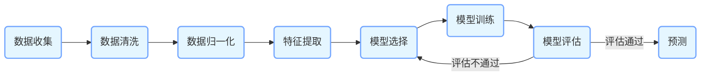

# 提升AI模型在长期气候变化预测中的准确性

> 关键词：AI模型、长期气候变化预测、准确性提升、数据处理、模型优化

> 摘要：本文聚焦于提升AI模型在长期气候变化预测中的准确性这一关键问题。随着全球气候变化问题的日益严峻，准确的长期气候变化预测对于制定应对策略至关重要。AI模型凭借其强大的数据分析和模式识别能力，在气候变化预测领域展现出巨大潜力。然而，当前AI模型在预测准确性方面仍存在诸多挑战。文章将从背景介绍入手，阐述相关概念和联系，深入剖析核心算法原理及操作步骤，借助数学模型和公式进行理论阐释，并通过项目实战展示代码实现与解读，探讨实际应用场景，推荐相关工具和资源，最后总结未来发展趋势与挑战，解答常见问题，为提升AI模型在长期气候变化预测中的准确性提供全面且深入的技术指导。

## 1. 背景介绍 
### 1.1 目的和范围
长期气候变化预测对于人类社会的可持续发展具有深远影响。准确的预测有助于政府、企业和社会各界提前制定应对策略，降低气候变化带来的风险，如极端天气事件、海平面上升、生态系统破坏等。本文章的目的在于深入探讨如何提升AI模型在长期气候变化预测中的准确性。范围涵盖从数据处理、模型构建、算法优化到实际应用的整个流程，旨在为相关领域的研究人员、工程师和决策者提供全面的技术参考和解决方案。

### 1.2 预期读者
本文预期读者包括但不限于气象学、气候学、环境科学等领域的科研人员，从事AI和机器学习研究与开发的工程师，以及关注气候变化问题并希望了解相关技术的政策制定者和社会公众。对于希望深入了解AI在长期气候变化预测中应用的专业人士，本文将提供详细的技术原理和实践指导；对于非专业读者，也能通过通俗易懂的解释和案例了解相关技术的基本概念和应用价值。

### 1.3 文档结构概述
本文将按照以下结构展开：首先介绍背景信息，包括目的、预期读者和文档结构概述，以及相关术语的定义和解释。接着阐述核心概念与联系，通过文本示意图和Mermaid流程图展示AI模型在长期气候变化预测中的原理和架构。然后详细讲解核心算法原理及具体操作步骤，结合Python源代码进行说明。随后介绍数学模型和公式，并通过举例进行详细讲解。在项目实战部分，展示开发环境搭建、源代码实现和代码解读。之后探讨实际应用场景，推荐相关工具和资源。最后总结未来发展趋势与挑战，解答常见问题，并提供扩展阅读和参考资料。

### 1.4 术语表
#### 1.4.1 核心术语定义
- **AI模型**：即人工智能模型，是一种基于数据和算法构建的智能系统，能够模拟人类的智能行为，如学习、推理和决策。在气候变化预测中，AI模型可以通过对大量气象和环境数据的学习，发现其中的模式和规律，从而进行预测。
- **长期气候变化预测**：指对未来较长时间尺度（通常为几十年到几百年）内气候变化趋势的预测，包括气温、降水、海平面上升等要素的变化。长期气候变化预测对于评估气候变化的影响和制定应对策略具有重要意义。
- **准确性**：在本文中，准确性指AI模型预测结果与实际气候变化情况的符合程度。提高准确性意味着减少预测误差，使预测结果更接近真实值。

#### 1.4.2 相关概念解释
- **数据同化**：将不同来源、不同精度的数据进行融合和处理，以提高数据的质量和可用性。在气候变化预测中，数据同化可以将气象观测数据、卫星遥感数据等多种数据结合起来，为AI模型提供更全面、准确的输入。
- **模型融合**：将多个不同的AI模型或传统气候模型的预测结果进行组合，以提高预测的准确性和可靠性。模型融合可以充分利用不同模型的优势，减少单一模型的局限性。
- **不确定性量化**：对预测结果中的不确定性进行评估和量化。由于气候变化系统的复杂性和数据的不完整性，预测结果往往存在一定的不确定性。不确定性量化可以帮助用户了解预测结果的可靠性，为决策提供更科学的依据。

#### 1.4.3 缩略词列表
- **AI**：Artificial Intelligence，人工智能
- **ML**：Machine Learning，机器学习
- **DL**：Deep Learning，深度学习
- **CNN**：Convolutional Neural Network，卷积神经网络
- **RNN**：Recurrent Neural Network，循环神经网络
- **LSTM**：Long Short-Term Memory，长短期记忆网络

## 2. 核心概念与联系 

### 核心概念原理
在长期气候变化预测中，AI模型的核心原理是通过对大量历史气象和环境数据的学习，发现其中的模式和规律，并将这些模式和规律应用到未来的预测中。AI模型可以处理复杂的非线性关系，能够捕捉到气候变化系统中的各种因素之间的相互作用。

传统的气候模型主要基于物理方程和数值模拟，虽然具有较高的物理可信度，但在处理复杂的非线性关系和大量数据时存在一定的局限性。而AI模型则可以通过数据驱动的方式，自动学习数据中的模式和规律，无需对物理过程进行详细的建模。因此，将AI模型与传统气候模型相结合，可以充分发挥两者的优势，提高长期气候变化预测的准确性。

### 架构的文本示意图
AI模型在长期气候变化预测中的架构主要包括数据预处理、模型训练和预测三个部分。

数据预处理阶段：首先收集各种气象和环境数据，包括气温、降水、气压、风速等观测数据，以及卫星遥感数据、气候模式模拟数据等。然后对这些数据进行清洗、归一化、特征提取等处理，以提高数据的质量和可用性。

模型训练阶段：选择合适的AI模型，如神经网络、决策树、支持向量机等，并使用预处理后的数据对模型进行训练。在训练过程中，通过调整模型的参数，使模型能够学习到数据中的模式和规律。

预测阶段：使用训练好的模型对未来的气候变化进行预测。将待预测的输入数据进行预处理后输入到模型中，模型输出预测结果。

### Mermaid流程图


## 3. 核心算法原理 & 具体操作步骤 

### 核心算法原理
在长期气候变化预测中，常用的AI算法包括神经网络、决策树、支持向量机等。其中，神经网络由于其强大的非线性拟合能力，在气候变化预测中得到了广泛的应用。下面以循环神经网络（RNN）及其变体长短期记忆网络（LSTM）为例，介绍其核心算法原理。

#### 循环神经网络（RNN）
RNN是一种具有循环结构的神经网络，能够处理序列数据。在RNN中，每个时间步的输出不仅取决于当前时间步的输入，还取决于上一个时间步的隐藏状态。RNN的核心公式如下：

$$h_t = \sigma(W_{hh}h_{t-1} + W_{xh}x_t + b_h)$$

$$y_t = \sigma(W_{hy}h_t + b_y)$$

其中，$x_t$ 是当前时间步的输入，$h_t$ 是当前时间步的隐藏状态，$y_t$ 是当前时间步的输出，$W_{hh}$、$W_{xh}$、$W_{hy}$ 是权重矩阵，$b_h$、$b_y$ 是偏置向量，$\sigma$ 是激活函数。

#### 长短期记忆网络（LSTM）
LSTM是RNN的一种变体，能够有效解决RNN中的梯度消失问题。LSTM通过引入门控机制，控制信息的流动。LSTM的核心公式如下：

$$i_t = \sigma(W_{ii}x_t + W_{hi}h_{t-1} + b_i)$$

$$f_t = \sigma(W_{if}x_t + W_{hf}h_{t-1} + b_f)$$

$$o_t = \sigma(W_{io}x_t + W_{ho}h_{t-1} + b_o)$$

$$\tilde{C}_t = \tanh(W_{ic}x_t + W_{hc}h_{t-1} + b_c)$$

$$C_t = f_t \odot C_{t-1} + i_t \odot \tilde{C}_t$$

$$h_t = o_t \odot \tanh(C_t)$$

其中，$i_t$ 是输入门，$f_t$ 是遗忘门，$o_t$ 是输出门，$\tilde{C}_t$ 是候选细胞状态，$C_t$ 是细胞状态，$\odot$ 是逐元素相乘。

### 具体操作步骤
#### 步骤1：数据准备
首先收集长期的气象和环境数据，包括气温、降水、气压等。然后对数据进行清洗，去除缺失值和异常值。接着对数据进行归一化处理，将数据缩放到一个固定的范围内，如 $[0, 1]$。最后将数据划分为训练集、验证集和测试集。

#### 步骤2：模型构建
使用Python和深度学习框架（如TensorFlow或PyTorch）构建LSTM模型。以下是一个使用PyTorch构建LSTM模型的示例代码：

```python
import torch
import torch.nn as nn

class LSTMModel(nn.Module):
    def __init__(self, input_size, hidden_size, num_layers, output_size):
        super(LSTMModel, self).__init__()
        self.hidden_size = hidden_size
        self.num_layers = num_layers
        self.lstm = nn.LSTM(input_size, hidden_size, num_layers, batch_first=True)
        self.fc = nn.Linear(hidden_size, output_size)

    def forward(self, x):
        h0 = torch.zeros(self.num_layers, x.size(0), self.hidden_size).to(x.device)
        c0 = torch.zeros(self.num_layers, x.size(0), self.hidden_size).to(x.device)
        out, _ = self.lstm(x, (h0, c0))
        out = self.fc(out[:, -1, :])
        return out
```

#### 步骤3：模型训练
定义损失函数和优化器，然后使用训练集对模型进行训练。在训练过程中，不断调整模型的参数，使损失函数的值最小化。以下是一个训练模型的示例代码：

```python
import torch.optim as optim

# 定义模型参数
input_size = 10
hidden_size = 64
num_layers = 2
output_size = 1

# 初始化模型
model = LSTMModel(input_size, hidden_size, num_layers, output_size)

# 定义损失函数和优化器
criterion = nn.MSELoss()
optimizer = optim.Adam(model.parameters(), lr=0.001)

# 训练模型
num_epochs = 100
for epoch in range(num_epochs):
    outputs = model(train_inputs)
    loss = criterion(outputs, train_labels)
    optimizer.zero_grad()
    loss.backward()
    optimizer.step()
    if (epoch+1) % 10 == 0:
        print(f'Epoch [{epoch+1}/{num_epochs}], Loss: {loss.item():.4f}')
```

#### 步骤4：模型评估
使用验证集对训练好的模型进行评估，计算模型的预测误差。可以使用均方误差（MSE）、均方根误差（RMSE）等指标来评估模型的性能。

#### 步骤5：预测
使用训练好的模型对未来的气候变化进行预测。将待预测的输入数据进行预处理后输入到模型中，模型输出预测结果。

## 4. 数学模型和公式 & 详细讲解 & 举例说明 

### 数学模型和公式
在长期气候变化预测中，常用的数学模型包括线性回归模型、非线性回归模型、时间序列模型等。下面以线性回归模型为例，介绍其数学原理和公式。

线性回归模型的基本形式为：

$$y = \beta_0 + \beta_1x_1 + \beta_2x_2 + \cdots + \beta_nx_n + \epsilon$$

其中，$y$ 是因变量，$x_1, x_2, \cdots, x_n$ 是自变量，$\beta_0, \beta_1, \cdots, \beta_n$ 是回归系数，$\epsilon$ 是误差项。

在气候变化预测中，$y$ 可以表示未来的气温、降水等气象要素，$x_1, x_2, \cdots, x_n$ 可以表示当前的气象要素、大气环流指数等。

### 详细讲解
线性回归模型的目标是通过最小化误差项的平方和来估计回归系数 $\beta_0, \beta_1, \cdots, \beta_n$。最小化误差项的平方和的方法称为最小二乘法。

最小二乘法的目标函数为：

$$S(\beta_0, \beta_1, \cdots, \beta_n) = \sum_{i=1}^{m}(y_i - \hat{y}_i)^2$$

其中，$y_i$ 是第 $i$ 个样本的真实值，$\hat{y}_i$ 是第 $i$ 个样本的预测值，$m$ 是样本数量。

通过对目标函数求偏导数并令其等于零，可以得到回归系数的估计值。具体的求解过程可以使用矩阵运算来实现。

### 举例说明
假设我们要预测未来的气温 $y$，使用当前的气温 $x_1$ 和大气环流指数 $x_2$ 作为自变量。我们有以下样本数据：

| 样本编号 | 当前气温 $x_1$ | 大气环流指数 $x_2$ | 未来气温 $y$ |
|----------|----------------|-------------------|--------------|
| 1        | 20             | 50                | 22           |
| 2        | 22             | 52                | 24           |
| 3        | 24             | 54                | 26           |
| 4        | 26             | 56                | 28           |
| 5        | 28             | 58                | 30           |

我们可以使用线性回归模型来拟合这些数据。首先，将数据表示为矩阵形式：

$$X = \begin{bmatrix}
1 & 20 & 50 \\
1 & 22 & 52 \\
1 & 24 & 54 \\
1 & 26 & 56 \\
1 & 28 & 58
\end{bmatrix}$$

$$y = \begin{bmatrix}
22 \\
24 \\
26 \\
28 \\
30
\end{bmatrix}$$

然后，使用最小二乘法求解回归系数 $\beta$：

$$\beta = (X^T X)^{-1} X^T y$$

Python代码实现如下：

```python
import numpy as np

# 定义数据矩阵
X = np.array([[1, 20, 50], [1, 22, 52], [1, 24, 54], [1, 26, 56], [1, 28, 58]])
y = np.array([22, 24, 26, 28, 30])

# 求解回归系数
beta = np.linalg.inv(X.T.dot(X)).dot(X.T).dot(y)

print('回归系数：', beta)
```

运行上述代码，可以得到回归系数的估计值。然后，我们可以使用这些回归系数来预测未来的气温。

## 5. 项目实战：代码实际案例和详细解释说明 

### 5.1  开发环境搭建
#### 步骤1：安装Python
首先，需要安装Python环境。建议使用Python 3.6及以上版本。可以从Python官方网站（https://www.python.org/downloads/）下载并安装Python。

#### 步骤2：安装深度学习框架
在本项目中，我们使用PyTorch作为深度学习框架。可以使用以下命令安装PyTorch：

```sh
pip install torch torchvision
```

#### 步骤3：安装其他依赖库
还需要安装一些其他的依赖库，如NumPy、Pandas、Matplotlib等。可以使用以下命令安装：

```sh
pip install numpy pandas matplotlib
```

### 5.2  源代码详细实现和代码解读
#### 步骤1：数据加载和预处理
首先，我们需要加载气象数据并进行预处理。以下是一个示例代码：

```python
import pandas as pd
import numpy as np
from sklearn.preprocessing import MinMaxScaler

# 加载数据
data = pd.read_csv('climate_data.csv')

# 提取特征和标签
features = data[['temperature', 'precipitation', 'pressure']].values
labels = data['future_temperature'].values

# 数据归一化
scaler_features = MinMaxScaler()
scaler_labels = MinMaxScaler()
features = scaler_features.fit_transform(features)
labels = scaler_labels.fit_transform(labels.reshape(-1, 1)).flatten()

# 划分训练集和测试集
train_size = int(len(features) * 0.8)
train_features = features[:train_size]
train_labels = labels[:train_size]
test_features = features[train_size:]
test_labels = labels[train_size:]

# 将数据转换为适合LSTM输入的格式
def create_sequences(data, labels, seq_length):
    X = []
    y = []
    for i in range(len(data) - seq_length):
        X.append(data[i:i+seq_length])
        y.append(labels[i+seq_length])
    return np.array(X), np.array(y)

seq_length = 10
train_X, train_y = create_sequences(train_features, train_labels, seq_length)
test_X, test_y = create_sequences(test_features, test_labels, seq_length)

# 将数据转换为PyTorch张量
import torch
train_X = torch.from_numpy(train_X).float()
train_y = torch.from_numpy(train_y).float()
test_X = torch.from_numpy(test_X).float()
test_y = torch.from_numpy(test_y).float()
```

#### 代码解读
- **数据加载**：使用Pandas库的 `read_csv` 函数加载气象数据。
- **特征和标签提取**：从数据中提取特征和标签。
- **数据归一化**：使用 `MinMaxScaler` 对特征和标签进行归一化处理，将数据缩放到 $[0, 1]$ 范围内。
- **划分训练集和测试集**：将数据按照80%和20%的比例划分为训练集和测试集。
- **创建序列数据**：将数据转换为适合LSTM输入的格式，每个序列包含 `seq_length` 个时间步的特征和一个对应的标签。
- **转换为PyTorch张量**：将数据转换为PyTorch张量，以便后续使用。

#### 步骤2：模型构建和训练
接下来，我们构建LSTM模型并进行训练。以下是一个示例代码：

```python
import torch.nn as nn
import torch.optim as optim

# 定义LSTM模型
class LSTMModel(nn.Module):
    def __init__(self, input_size, hidden_size, num_layers, output_size):
        super(LSTMModel, self).__init__()
        self.hidden_size = hidden_size
        self.num_layers = num_layers
        self.lstm = nn.LSTM(input_size, hidden_size, num_layers, batch_first=True)
        self.fc = nn.Linear(hidden_size, output_size)

    def forward(self, x):
        h0 = torch.zeros(self.num_layers, x.size(0), self.hidden_size).to(x.device)
        c0 = torch.zeros(self.num_layers, x.size(0), self.hidden_size).to(x.device)
        out, _ = self.lstm(x, (h0, c0))
        out = self.fc(out[:, -1, :])
        return out

# 初始化模型
input_size = train_X.shape[2]
hidden_size = 64
num_layers = 2
output_size = 1
model = LSTMModel(input_size, hidden_size, num_layers, output_size)

# 定义损失函数和优化器
criterion = nn.MSELoss()
optimizer = optim.Adam(model.parameters(), lr=0.001)

# 训练模型
num_epochs = 100
for epoch in range(num_epochs):
    outputs = model(train_X)
    loss = criterion(outputs, train_y.view(-1, 1))
    optimizer.zero_grad()
    loss.backward()
    optimizer.step()
    if (epoch+1) % 10 == 0:
        print(f'Epoch [{epoch+1}/{num_epochs}], Loss: {loss.item():.4f}')
```

#### 代码解读
- **模型定义**：定义一个LSTM模型，包含一个LSTM层和一个全连接层。
- **模型初始化**：初始化模型的参数，包括输入大小、隐藏大小、层数和输出大小。
- **损失函数和优化器**：使用均方误差损失函数（MSE）和Adam优化器。
- **模型训练**：使用训练集对模型进行训练，每个epoch计算损失并更新模型的参数。

#### 步骤3：模型评估和预测
最后，我们使用测试集对模型进行评估，并进行预测。以下是一个示例代码：

```python
# 模型评估
model.eval()
with torch.no_grad():
    test_outputs = model(test_X)
    test_loss = criterion(test_outputs, test_y.view(-1, 1))
    print(f'Test Loss: {test_loss.item():.4f}')

# 反归一化预测结果
test_outputs = scaler_labels.inverse_transform(test_outputs.numpy())
test_y = scaler_labels.inverse_transform(test_y.numpy().reshape(-1, 1))

# 绘制预测结果和真实值的对比图
import matplotlib.pyplot as plt
plt.plot(test_y, label='True Values')
plt.plot(test_outputs, label='Predicted Values')
plt.xlabel('Time')
plt.ylabel('Temperature')
plt.title('Long-Term Climate Change Prediction')
plt.legend()
plt.show()
```

#### 代码解读
- **模型评估**：使用测试集对模型进行评估，计算测试集上的损失。
- **反归一化**：将预测结果和真实值进行反归一化处理，恢复到原始的数值范围。
- **绘制对比图**：使用Matplotlib库绘制预测结果和真实值的对比图，直观地展示模型的预测效果。

### 5.3  代码解读与分析
通过上述代码，我们实现了一个基于LSTM的长期气候变化预测模型。在数据预处理阶段，我们对气象数据进行了清洗、归一化和序列转换，以提高数据的质量和可用性。在模型构建阶段，我们定义了一个包含LSTM层和全连接层的模型，并使用Adam优化器进行训练。在模型评估阶段，我们使用测试集对模型进行评估，并绘制了预测结果和真实值的对比图。

从代码中可以看出，LSTM模型能够捕捉到气象数据中的时间序列信息，从而进行长期的气候变化预测。通过调整模型的参数，如隐藏大小、层数等，可以进一步提高模型的性能。同时，我们还可以尝试使用其他的AI算法，如卷积神经网络（CNN）、注意力机制等，来提升模型的准确性。

## 6. 实际应用场景 
### 农业领域
准确的长期气候变化预测对于农业生产具有重要意义。农民可以根据预测结果合理安排种植时间、选择适宜的农作物品种，以提高农作物的产量和质量。例如，如果预测到未来一段时间内降水减少，农民可以提前采取节水灌溉措施；如果预测到气温升高，农民可以选择耐高温的农作物品种。

### 能源领域
长期气候变化预测可以帮助能源企业合理规划能源生产和供应。例如，风力发电企业可以根据预测的风速变化情况，合理安排风机的维护和检修时间，提高发电效率；电力公司可以根据预测的气温变化情况，预测电力需求的变化，合理调配电力资源，降低能源成本。

### 城市规划领域
在城市规划中，长期气候变化预测可以为城市的基础设施建设和生态环境规划提供科学依据。例如，根据预测的海平面上升情况，合理规划沿海城市的防洪设施；根据预测的气温变化情况，优化城市的绿化布局，提高城市的热岛效应缓解能力。

### 保险领域
保险公司可以根据长期气候变化预测结果，评估气候变化带来的风险，制定合理的保险费率和保险产品。例如，对于洪水、台风等自然灾害风险较高的地区，提高保险费率；对于采取了有效的防灾减灾措施的企业和个人，给予一定的保险优惠。

## 7. 工具和资源推荐
### 7.1 学习资源推荐
#### 7.1.1 书籍推荐
- 《Python深度学习》：这本书由深度学习领域的专家Francois Chollet所著，详细介绍了Python和深度学习框架（如Keras、TensorFlow）的使用，以及深度学习在图像识别、自然语言处理等领域的应用。
- 《机器学习》：这本书由周志华教授所著，是机器学习领域的经典教材，全面介绍了机器学习的基本概念、算法和应用。
- 《气候变化科学概论》：这本书由秦大河院士主编，系统介绍了气候变化的基本原理、观测事实、影响和应对策略，是了解气候变化领域的重要参考书籍。

#### 7.1.2 在线课程
- Coursera上的“深度学习专项课程”：由深度学习领域的权威专家Andrew Ng教授授课，包括深度学习基础、卷积神经网络、循环神经网络等课程，是学习深度学习的优质在线课程。
- edX上的“气候变化：科学与影响”：由哈佛大学等高校的教授授课，系统介绍了气候变化的科学原理、影响和应对策略，是了解气候变化领域的在线课程。
- 中国大学MOOC上的“机器学习基础”：由国内知名高校的教授授课，全面介绍了机器学习的基本概念、算法和应用，是学习机器学习的优质在线课程。

#### 7.1.3 技术博客和网站
- Medium：是一个技术博客平台，上面有很多关于AI、机器学习和气候变化的技术文章和研究成果。
- arXiv：是一个预印本数据库，上面有很多关于AI、机器学习和气候变化的最新研究论文。
- 中国气象数据网：是中国气象局提供的气象数据服务平台，上面有大量的气象观测数据和气候模式模拟数据，可供研究人员和开发者使用。

### 7.2 开发工具框架推荐
#### 7.2.1 IDE和编辑器
- PyCharm：是一款专门为Python开发设计的集成开发环境（IDE），具有代码编辑、调试、版本控制等功能，是Python开发者的首选工具。
- Jupyter Notebook：是一个交互式的开发环境，支持Python、R等多种编程语言，适合进行数据探索、模型训练和可视化等工作。
- Visual Studio Code：是一款轻量级的代码编辑器，支持多种编程语言和插件，具有丰富的功能和扩展能力，是开发者常用的工具之一。

#### 7.2.2 调试和性能分析工具
- TensorBoard：是TensorFlow提供的可视化工具，可用于可视化模型的训练过程、损失曲线、准确率等指标，帮助开发者调试和优化模型。
- PyTorch Profiler：是PyTorch提供的性能分析工具，可用于分析模型的运行时间、内存使用情况等，帮助开发者优化模型的性能。
- cProfile：是Python内置的性能分析工具，可用于分析Python代码的运行时间和函数调用情况，帮助开发者找出代码中的性能瓶颈。

#### 7.2.3 相关框架和库
- TensorFlow：是Google开发的深度学习框架，具有高效的计算能力和丰富的工具集，支持多种深度学习模型的构建和训练。
- PyTorch：是Facebook开发的深度学习框架，具有动态计算图、易于调试等优点，在学术界和工业界都得到了广泛的应用。
- Scikit-learn：是Python的机器学习库，提供了丰富的机器学习算法和工具，如分类、回归、聚类等，适合初学者和快速开发。

### 7.3 相关论文著作推荐
#### 7.3.1 经典论文
- “Deep Residual Learning for Image Recognition”：这篇论文提出了残差网络（ResNet），解决了深度学习中的梯度消失问题，在图像识别领域取得了巨大的成功。
- “Long Short-Term Memory”：这篇论文提出了长短期记忆网络（LSTM），有效解决了循环神经网络（RNN）中的梯度消失问题，在自然语言处理和时间序列预测等领域得到了广泛的应用。
- “The Physical Science Basis”：这是IPCC（政府间气候变化专门委员会）发布的气候变化评估报告的第一部分，系统介绍了气候变化的科学原理和观测事实，是气候变化领域的经典文献。

#### 7.3.2 最新研究成果
- 关注arXiv、Nature、Science等学术平台和期刊，及时了解AI在长期气候变化预测中的最新研究成果和技术进展。
- 参加相关的学术会议和研讨会，如NeurIPS、ICML、AGU等，与领域内的专家和学者交流，获取最新的研究动态。

#### 7.3.3 应用案例分析
- 可以参考一些实际应用案例，了解AI在长期气候变化预测中的具体应用和效果。例如，某些科研机构使用AI模型对某地区的气候变化进行预测，并与传统气候模型的预测结果进行对比分析；某些企业使用AI模型优化能源生产和供应，提高能源利用效率。

## 8. 总结：未来发展趋势与挑战
### 未来发展趋势
#### 多模型融合
未来，将多种不同类型的AI模型和传统气候模型进行融合，充分发挥各自的优势，提高长期气候变化预测的准确性和可靠性，将成为一个重要的发展趋势。例如，将神经网络模型与物理气候模型相结合，利用神经网络模型的强大非线性拟合能力和物理气候模型的物理可信度，实现更准确的气候变化预测。

#### 不确定性量化和管理
随着对气候变化预测准确性要求的提高，对预测结果中的不确定性进行量化和管理将变得越来越重要。未来的研究将更加关注如何准确评估预测结果的不确定性，并通过有效的方法降低不确定性，为决策提供更科学的依据。

#### 实时数据和动态更新
利用实时气象和环境数据，对AI模型进行动态更新和优化，将使模型能够及时反映气候变化的最新情况，提高预测的及时性和准确性。例如，通过卫星遥感、气象观测站等实时获取气象数据，实时更新AI模型的参数，实现更精准的长期气候变化预测。

#### 跨学科合作
长期气候变化预测是一个复杂的系统工程，需要气象学、气候学、物理学、数学、计算机科学等多个学科的知识和技术支持。未来，跨学科合作将更加紧密，不同学科的专家和学者将共同努力，推动AI在长期气候变化预测中的应用和发展。

### 挑战
#### 数据质量和数量
目前，气象和环境数据存在质量参差不齐、数据缺失、数据不一致等问题，这给AI模型的训练和预测带来了很大的挑战。此外，长期气候变化预测需要大量的历史数据和实时数据，而数据的收集和整理需要耗费大量的人力、物力和财力。

#### 模型解释性
AI模型，尤其是深度学习模型，往往被视为“黑箱”，其决策过程和预测结果难以解释。在长期气候变化预测中，模型的解释性至关重要，因为决策者需要了解模型的预测依据和不确定性，才能做出科学的决策。因此，如何提高AI模型的解释性，是未来需要解决的一个重要问题。

#### 计算资源和效率
AI模型的训练和预测需要大量的计算资源，尤其是深度学习模型。随着模型复杂度的增加和数据量的增大，计算资源的需求也会不断增加。如何提高计算效率，降低计算成本，是AI在长期气候变化预测中面临的一个挑战。

#### 气候变化的复杂性
气候变化是一个复杂的系统，受到多种因素的影响，如大气环流、海洋运动、太阳活动等。这些因素之间相互作用、相互影响，使得气候变化具有高度的非线性和不确定性。如何准确地捕捉和模拟这些复杂的因素和相互作用，是提高长期气候变化预测准确性的关键。

## 9. 附录：常见问题与解答
### 问题1：AI模型在长期气候变化预测中的准确性如何评估？
答：可以使用多种指标来评估AI模型在长期气候变化预测中的准确性，如均方误差（MSE）、均方根误差（RMSE）、平均绝对误差（MAE）、相关系数等。这些指标可以衡量模型预测结果与实际值之间的差异，差异越小，说明模型的准确性越高。

### 问题2：如何选择合适的AI模型进行长期气候变化预测？
答：选择合适的AI模型需要考虑多个因素，如数据类型、数据规模、问题复杂度等。对于时间序列数据，循环神经网络（RNN）及其变体长短期记忆网络（LSTM）、门控循环单元（GRU）等是常用的模型；对于图像数据，卷积神经网络（CNN）是一个不错的选择；对于结构化数据，决策树、支持向量机等模型也可以考虑。此外，还可以尝试使用模型融合的方法，将多个不同的模型进行组合，以提高预测的准确性。

### 问题3：如何处理气象和环境数据中的缺失值和异常值？
答：处理缺失值和异常值的方法有很多种。对于缺失值，可以使用插值法（如线性插值、多项式插值等）进行填充，也可以使用均值、中位数等统计量进行填充。对于异常值，可以使用基于统计的方法（如Z-score方法、IQR方法等）进行检测和处理，也可以使用机器学习算法（如孤立森林、One-Class SVM等）进行异常检测和剔除。

### 问题4：AI模型在长期气候变化预测中的应用前景如何？
答：AI模型在长期气候变化预测中具有广阔的应用前景。随着AI技术的不断发展和进步，AI模型在处理复杂数据和非线性关系方面的能力越来越强，能够为长期气候变化预测提供更准确、更及时的结果。此外，AI模型还可以与传统气候模型相结合，充分发挥两者的优势，提高预测的准确性和可靠性。因此，AI模型在长期气候变化预测中的应用将越来越广泛，为应对气候变化提供有力的技术支持。

## 10. 扩展阅读 & 参考资料
### 扩展阅读
- 《AI未来进行式》：这本书由李开复和王咏刚所著，介绍了AI在各个领域的应用和发展趋势，包括气候变化预测等领域，适合对AI感兴趣的读者阅读。
- 《气候经济与人类未来》：这本书由比尔·盖茨所著，探讨了气候变化对经济和人类社会的影响，以及如何通过科技创新和政策措施应对气候变化，是了解气候变化经济和政策方面的重要参考书籍。

### 参考资料
- IPCC（政府间气候变化专门委员会）发布的气候变化评估报告，可从IPCC官方网站（https://www.ipcc.ch/）获取。
- 中国气象局发布的气象数据和气候研究报告，可从中国气象局官方网站（https://www.cma.gov.cn/）获取。
- 相关学术论文和研究报告，可通过学术数据库（如IEEE Xplore、ACM Digital Library、Web of Science等）进行检索和获取。