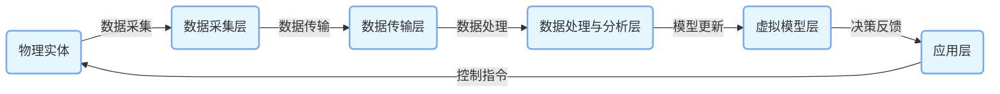

# 数字孪生技术在工业领域的应用与投资机会

> 关键词：数字孪生技术、工业领域、应用场景、投资机会、智能制造

> 摘要：本文聚焦于数字孪生技术在工业领域的应用与投资机会。首先介绍了数字孪生技术的背景和相关概念，包括其目的、预期读者、文档结构等内容。接着深入阐述核心概念、算法原理、数学模型等理论知识，通过Python代码详细展示算法实现。然后结合项目实战，从开发环境搭建到源代码详细实现与解读，全面剖析数字孪生技术在工业中的具体应用。还探讨了其实际应用场景，推荐了学习、开发相关的工具和资源，包括书籍、在线课程、开发工具框架、相关论文著作等。最后总结了数字孪生技术的未来发展趋势与挑战，提供常见问题解答和扩展阅读参考资料，旨在为读者呈现一个全面深入的关于数字孪生技术在工业领域应用及投资机会的研究。

## 1. 背景介绍 
### 1.1 目的和范围
数字孪生技术作为近年来兴起的前沿技术，在工业领域展现出了巨大的潜力。本文章的目的在于全面深入地探讨数字孪生技术在工业领域的应用场景、核心原理、实际案例以及投资机会。通过对数字孪生技术的多方面分析，为工业从业者、投资者以及相关研究人员提供系统的知识和决策参考。文章的范围涵盖数字孪生技术的基本概念、算法原理、数学模型、项目实战、应用场景、工具资源推荐等多个方面，力求从理论到实践，全方位呈现数字孪生技术在工业领域的全貌。

### 1.2 预期读者
本文的预期读者主要包括以下几类人群：
- **工业从业者**：包括工业企业的管理人员、工程师、技术人员等，他们希望深入了解数字孪生技术在工业生产、管理、优化等方面的应用，以提升企业的生产效率和竞争力。
- **投资者**：对工业领域新兴技术投资感兴趣的个人或机构投资者，希望通过了解数字孪生技术的发展趋势和投资机会，做出合理的投资决策。
- **研究人员**：从事计算机科学、控制工程、工业工程等相关领域的研究人员，他们关注数字孪生技术的理论研究和技术创新，希望通过本文获取相关的研究思路和前沿信息。
- **学生**：相关专业的学生，希望通过本文初步了解数字孪生技术的基本概念、原理和应用，为后续的学习和研究打下基础。

### 1.3 文档结构概述
本文按照以下结构进行组织：
- **核心概念与联系**：介绍数字孪生技术的基本概念、原理和架构，通过文本示意图和Mermaid流程图进行详细说明。
- **核心算法原理 & 具体操作步骤**：讲解数字孪生技术的核心算法原理，并使用Python源代码详细阐述具体操作步骤。
- **数学模型和公式 & 详细讲解 & 举例说明**：介绍数字孪生技术的数学模型和公式，进行详细讲解并举例说明。
- **项目实战：代码实际案例和详细解释说明**：通过实际项目案例，介绍开发环境搭建、源代码详细实现和代码解读，深入分析数字孪生技术在工业领域的应用。
- **实际应用场景**：探讨数字孪生技术在工业领域的实际应用场景，包括产品设计、生产制造、设备运维等方面。
- **工具和资源推荐**：推荐学习数字孪生技术的相关资源，包括书籍、在线课程、技术博客和网站等，以及开发工具框架和相关论文著作。
- **总结：未来发展趋势与挑战**：总结数字孪生技术的未来发展趋势和面临的挑战。
- **附录：常见问题与解答**：解答关于数字孪生技术的常见问题。
- **扩展阅读 & 参考资料**：提供扩展阅读的相关资料和参考来源。

### 1.4 术语表
#### 1.4.1 核心术语定义
- **数字孪生（Digital Twin）**：是指利用数字化技术创建物理实体的虚拟模型，该虚拟模型能够实时反映物理实体的状态、行为和性能，并与物理实体进行双向交互。
- **物理实体（Physical Entity）**：指现实世界中存在的实际物体或系统，如工业设备、生产线、产品等。
- **虚拟模型（Virtual Model）**：是物理实体的数字化表示，通过计算机模拟和建模技术创建，能够反映物理实体的结构、功能和行为。
- **数据驱动（Data - Driven）**：指基于大量的数据来驱动数字孪生模型的构建、运行和优化，数据包括传感器采集的实时数据、历史数据等。
- **双向交互（Bidirectional Interaction）**：数字孪生模型与物理实体之间能够进行信息的双向传递，物理实体的状态信息可以实时反馈到虚拟模型，虚拟模型的优化策略可以传递到物理实体进行控制和调整。

#### 1.4.2 相关概念解释
- **物联网（Internet of Things, IoT）**：物联网是数字孪生技术的数据来源基础，通过传感器、网络设备等将物理实体的各种信息采集并传输到数字孪生系统中，实现物理实体与虚拟模型之间的数据连接。
- **大数据（Big Data）**：大数据为数字孪生模型的训练和优化提供了丰富的数据资源，通过对海量数据的分析和挖掘，可以提高数字孪生模型的准确性和可靠性。
- **人工智能（Artificial Intelligence, AI）**：人工智能技术如机器学习、深度学习等在数字孪生中发挥着重要作用，用于数字孪生模型的建模、预测、优化等任务。

#### 1.4.3 缩略词列表
- **IoT**：Internet of Things（物联网）
- **AI**：Artificial Intelligence（人工智能）
- **CAD**：Computer - Aided Design（计算机辅助设计）
- **CAE**：Computer - Aided Engineering（计算机辅助工程）

## 2. 核心概念与联系 

### 核心概念原理
数字孪生技术的核心原理是通过整合多学科、多物理量、多尺度、多概率的仿真过程，在虚拟空间中完成映射，从而反映相对应的实体装备的全生命周期过程。其主要基于以下几个关键原理：

- **数据采集与传输**：利用物联网技术，在物理实体上部署各种传感器，实时采集物理实体的状态信息，如温度、压力、振动等，并通过网络将这些数据传输到数字孪生系统中。
- **模型构建**：根据物理实体的结构、功能和行为特性，利用计算机辅助设计（CAD）、计算机辅助工程（CAE）等技术构建物理实体的虚拟模型。虚拟模型不仅要反映物理实体的几何形状，还要能够模拟其物理过程和动态行为。
- **数据融合与分析**：将采集到的实时数据与虚拟模型进行融合，利用大数据和人工智能技术对数据进行分析和处理，实现对物理实体状态的实时监测、预测和优化。
- **双向交互与控制**：数字孪生模型与物理实体之间实现双向交互，虚拟模型可以根据实时数据对物理实体的状态进行评估和预测，并将优化策略反馈到物理实体，实现对物理实体的智能控制。

### 架构的文本示意图
数字孪生技术的架构主要包括以下几个层次：

- **物理层**：由实际的物理实体组成，如工业设备、生产线、产品等，是数字孪生的研究对象。
- **数据采集层**：通过传感器、网络设备等采集物理实体的各种数据，包括状态数据、运行数据、环境数据等。
- **数据传输层**：将采集到的数据通过有线或无线通信网络传输到数据处理中心。
- **数据处理与分析层**：对传输过来的数据进行清洗、存储、分析和挖掘，利用大数据和人工智能技术提取有价值的信息。
- **虚拟模型层**：构建物理实体的虚拟模型，包括几何模型、物理模型、行为模型等，并实现虚拟模型与物理实体的实时同步。
- **应用层**：根据不同的应用需求，开发各种应用系统，如设备监控系统、故障预测系统、生产优化系统等，为用户提供决策支持和智能控制服务。

### Mermaid 流程图


该流程图展示了数字孪生技术的工作流程，从物理实体的数据采集开始，经过数据传输、处理和分析，更新虚拟模型，然后通过应用层提供决策反馈，最终将控制指令发送回物理实体，实现双向交互和闭环控制。

## 3. 核心算法原理 & 具体操作步骤 

### 核心算法原理
数字孪生技术中涉及到多种核心算法，以下以基于机器学习的故障预测算法为例进行讲解。

#### 故障预测算法原理
故障预测算法的目标是通过对设备运行数据的分析，预测设备可能出现的故障。常用的机器学习算法如支持向量机（SVM）、神经网络等可以用于故障预测。

以神经网络为例，其基本原理是通过构建一个多层的神经网络模型，将设备的运行数据作为输入，故障标签作为输出，通过训练神经网络模型来学习输入数据与故障之间的映射关系。在实际应用中，将实时采集的设备运行数据输入到训练好的神经网络模型中，模型就可以输出设备当前的故障概率，从而实现故障预测。

### 具体操作步骤及 Python 源代码实现

#### 步骤 1：数据准备
首先需要收集设备的运行数据，并将其分为训练集和测试集。以下是一个简单的数据准备示例：
```python
import numpy as np
from sklearn.model_selection import train_test_split

# 假设这是设备的运行数据
X = np.random.rand(100, 5)  # 100 个样本，每个样本有 5 个特征
y = np.random.randint(0, 2, 100)  # 0 表示正常，1 表示故障

# 划分训练集和测试集
X_train, X_test, y_train, y_test = train_test_split(X, y, test_size=0.2, random_state=42)
```

#### 步骤 2：模型构建
使用 Keras 库构建一个简单的神经网络模型：
```python
from tensorflow.keras.models import Sequential
from tensorflow.keras.layers import Dense

# 构建神经网络模型
model = Sequential()
model.add(Dense(10, input_dim=5, activation='relu'))
model.add(Dense(1, activation='sigmoid'))

# 编译模型
model.compile(loss='binary_crossentropy', optimizer='adam', metrics=['accuracy'])
```

#### 步骤 3：模型训练
使用训练集对模型进行训练：
```python
# 训练模型
model.fit(X_train, y_train, epochs=50, batch_size=10, verbose=1)
```

#### 步骤 4：模型评估
使用测试集对模型进行评估：
```python
# 评估模型
loss, accuracy = model.evaluate(X_test, y_test)
print(f"Test loss: {loss}, Test accuracy: {accuracy}")
```

#### 步骤 5：故障预测
使用训练好的模型对新的设备运行数据进行故障预测：
```python
# 假设这是新的设备运行数据
new_data = np.random.rand(1, 5)
prediction = model.predict(new_data)
print(f"Predicted probability of failure: {prediction[0][0]}")
```

通过以上步骤，就可以实现一个简单的基于神经网络的设备故障预测系统，这是数字孪生技术在设备运维方面的一个具体应用。

## 4. 数学模型和公式 & 详细讲解 & 举例说明 

### 数学模型
在数字孪生技术中，常用的数学模型包括物理模型、数据驱动模型等。以下以物理模型中的弹簧 - 质量 - 阻尼系统为例进行讲解。

#### 弹簧 - 质量 - 阻尼系统模型
弹簧 - 质量 - 阻尼系统是一个经典的物理模型，用于描述物体在弹性力、阻尼力和外力作用下的运动。其数学模型可以用二阶常微分方程表示：

$$m\frac{d^{2}x}{dt^{2}} + c\frac{dx}{dt}+kx = F(t)$$

其中：
- $m$ 是物体的质量（单位：kg）
- $c$ 是阻尼系数（单位：N·s/m）
- $k$ 是弹簧刚度（单位：N/m）
- $x$ 是物体的位移（单位：m）
- $F(t)$ 是外力（单位：N）

### 详细讲解
这个二阶常微分方程描述了物体的加速度 $\frac{d^{2}x}{dt^{2}}$、速度 $\frac{dx}{dt}$ 和位移 $x$ 之间的关系。方程左边的三项分别表示惯性力、阻尼力和弹性力，右边的 $F(t)$ 表示外力。

- **惯性力**：$m\frac{d^{2}x}{dt^{2}}$ 与物体的质量和加速度成正比，反映了物体保持原有运动状态的特性。
- **阻尼力**：$c\frac{dx}{dt}$ 与物体的速度成正比，阻尼力的作用是消耗系统的能量，使物体的运动逐渐衰减。
- **弹性力**：$kx$ 与物体的位移成正比，弹簧的作用是使物体回到平衡位置。

### 举例说明
假设一个弹簧 - 质量 - 阻尼系统，$m = 1$ kg，$c = 0.5$ N·s/m，$k = 2$ N/m，外力 $F(t)=0$（即没有外力作用）。初始条件为 $x(0)=1$ m，$\frac{dx}{dt}(0)=0$ m/s。我们可以使用 Python 的 `scipy.integrate.odeint` 函数来求解这个二阶常微分方程。

```python
import numpy as np
from scipy.integrate import odeint
import matplotlib.pyplot as plt

# 定义弹簧 - 质量 - 阻尼系统的微分方程
def spring_mass_damper(state, t, m, c, k):
    x, v = state
    dxdt = v
    dvdt = (-c * v - k * x) / m
    return [dxdt, dvdt]

# 参数设置
m = 1
c = 0.5
k = 2
t = np.linspace(0, 10, 100)
initial_state = [1, 0]

# 求解微分方程
solution = odeint(spring_mass_damper, initial_state, t, args=(m, c, k))
x = solution[:, 0]

# 绘制位移随时间的变化曲线
plt.plot(t, x)
plt.xlabel('Time (s)')
plt.ylabel('Displacement (m)')
plt.title('Spring - Mass - Damper System')
plt.grid(True)
plt.show()
```

这个例子展示了如何使用数学模型来描述物理实体的动态行为，在数字孪生中，可以将这个物理模型集成到虚拟模型中，实时模拟物体的运动状态。

## 5. 项目实战：代码实际案例和详细解释说明 

### 5.1  开发环境搭建
#### 硬件环境
- **服务器**：建议使用具有较高性能的服务器，如 Intel Xeon 系列处理器，配备足够的内存（如 32GB 以上）和存储（如 1TB 以上）。
- **传感器**：根据实际需求选择合适的传感器，如温度传感器、压力传感器、振动传感器等，确保传感器能够准确采集物理实体的状态信息。
- **网络设备**：包括路由器、交换机等，确保网络的稳定和可靠，实现数据的高效传输。

#### 软件环境
- **操作系统**：推荐使用 Linux 系统，如 Ubuntu 或 CentOS，具有较高的稳定性和安全性。
- **编程语言**：Python 是数字孪生开发的首选语言，具有丰富的库和工具，如 TensorFlow、PyTorch 用于机器学习，NumPy、Pandas 用于数据处理。
- **数据库**：选择合适的数据库来存储采集到的数据，如 MySQL、InfluxDB 等。
- **开发框架**：可以使用 Flask、Django 等 Web 开发框架来构建数字孪生应用的前端和后端。

### 5.2  源代码详细实现和代码解读

#### 数据采集模块
以下是一个简单的数据采集模块示例，使用 Python 的 `pyserial` 库从串口读取传感器数据：
```python
import serial

# 配置串口
ser = serial.Serial('COM3', 9600, timeout=1)

try:
    while True:
        if ser.in_waiting:
            data = ser.readline().decode('utf-8').rstrip()
            print(f"Received data: {data}")
except KeyboardInterrupt:
    ser.close()
```
**代码解读**：
- `serial.Serial('COM3', 9600, timeout=1)`：打开串口 `COM3`，波特率为 9600，超时时间为 1 秒。
- `ser.in_waiting`：检查串口缓冲区是否有数据。
- `ser.readline().decode('utf-8').rstrip()`：读取一行数据，并将其解码为 UTF - 8 编码，去除末尾的换行符。

#### 数据处理与存储模块
以下是一个使用 Pandas 库处理数据并将其存储到 MySQL 数据库的示例：
```python
import pandas as pd
import mysql.connector

# 模拟采集到的数据
data = {'temperature': [25, 26, 27], 'pressure': [100, 101, 102]}
df = pd.DataFrame(data)

# 连接到 MySQL 数据库
mydb = mysql.connector.connect(
    host="localhost",
    user="yourusername",
    password="yourpassword",
    database="yourdatabase"
)

# 创建游标
mycursor = mydb.cursor()

# 创建表
mycursor.execute("CREATE TABLE IF NOT EXISTS sensor_data (id INT AUTO_INCREMENT PRIMARY KEY, temperature FLOAT, pressure FLOAT)")

# 插入数据
for index, row in df.iterrows():
    sql = "INSERT INTO sensor_data (temperature, pressure) VALUES (%s, %s)"
    val = (row['temperature'], row['pressure'])
    mycursor.execute(sql, val)

# 提交更改
mydb.commit()

# 关闭连接
mydb.close()
```
**代码解读**：
- `pd.DataFrame(data)`：使用 Pandas 库创建一个数据框。
- `mysql.connector.connect()`：连接到 MySQL 数据库。
- `mycursor.execute("CREATE TABLE IF NOT EXISTS ...")`：创建一个名为 `sensor_data` 的表，如果表不存在的话。
- `mycursor.execute(sql, val)`：执行 SQL 插入语句，将数据插入到表中。
- `mydb.commit()`：提交更改，将数据保存到数据库中。

#### 虚拟模型构建与仿真模块
以下是一个简单的虚拟模型构建与仿真示例，使用 Python 的 `matplotlib` 库绘制设备的温度变化曲线：
```python
import numpy as np
import matplotlib.pyplot as plt

# 模拟设备的温度变化
time = np.linspace(0, 10, 100)
temperature = 20 + 5 * np.sin(time)

# 绘制温度变化曲线
plt.plot(time, temperature)
plt.xlabel('Time (s)')
plt.ylabel('Temperature (°C)')
plt.title('Device Temperature Simulation')
plt.grid(True)
plt.show()
```
**代码解读**：
- `np.linspace(0, 10, 100)`：生成 0 到 10 之间的 100 个等间距的时间点。
- `20 + 5 * np.sin(time)`：模拟设备的温度变化，温度围绕 20°C 上下波动。
- `plt.plot(time, temperature)`：绘制温度随时间的变化曲线。

### 5.3  代码解读与分析
通过以上三个模块的代码，我们实现了一个简单的数字孪生系统的雏形。数据采集模块负责从传感器获取物理实体的状态信息，数据处理与存储模块将采集到的数据进行处理并存储到数据库中，虚拟模型构建与仿真模块根据采集到的数据或模拟数据构建虚拟模型并进行仿真。

在实际应用中，还需要进一步完善这些模块，如增加数据清洗、特征提取、模型训练等功能，以提高数字孪生系统的准确性和可靠性。同时，要考虑系统的可扩展性和性能优化，确保系统能够处理大规模的数据和复杂的计算任务。

## 6. 实际应用场景 
### 产品设计
在产品设计阶段，数字孪生技术可以创建产品的虚拟模型，对产品的性能、功能和可靠性进行模拟和验证。通过在虚拟环境中对不同设计方案进行测试和优化，可以减少物理原型的制作次数，降低研发成本，缩短产品上市时间。例如，汽车制造商可以使用数字孪生技术模拟汽车的碰撞试验、空气动力学性能等，提前发现设计缺陷并进行改进。

### 生产制造
在生产制造过程中，数字孪生技术可以实现对生产线的实时监控和优化。通过将物理生产线与虚拟模型进行实时同步，可以及时发现生产过程中的异常情况，如设备故障、质量问题等，并采取相应的措施进行调整和修复。同时，还可以通过虚拟模型对生产计划进行优化，提高生产效率和产品质量。例如，电子制造企业可以使用数字孪生技术对 SMT（表面贴装技术）生产线进行实时监控和优化，提高贴片精度和生产效率。

### 设备运维
数字孪生技术在设备运维方面具有重要应用价值。通过建立设备的数字孪生模型，实时采集设备的运行数据，可以对设备的状态进行实时监测和故障预测。当设备出现异常时，可以及时发出预警，并提供相应的维修建议和解决方案。例如，风力发电场可以使用数字孪生技术对风力发电机组进行实时监测和故障预测，及时发现潜在的故障隐患，降低维修成本和停机时间。

### 供应链管理
在供应链管理中，数字孪生技术可以创建供应链的虚拟模型，对供应链的物流、信息流和资金流进行实时模拟和优化。通过在虚拟环境中对不同的供应链策略进行评估和比较，可以选择最优的供应链方案，提高供应链的效率和灵活性。例如，零售企业可以使用数字孪生技术对供应链进行实时监控和优化，确保商品的及时供应和库存的合理控制。

## 7. 工具和资源推荐
### 7.1 学习资源推荐
#### 7.1.1 书籍推荐
- 《数字孪生：助力工业智能化》：全面介绍了数字孪生技术的基本概念、原理、应用场景和发展趋势，适合初学者入门。
- 《物联网与数字孪生：原理、技术及应用》：结合物联网技术，深入探讨了数字孪生技术的实现原理和应用案例，具有较高的参考价值。
- 《机器学习》：数字孪生技术中涉及到大量的机器学习算法，这本书是机器学习领域的经典教材，适合深入学习机器学习算法的原理和应用。

#### 7.1.2 在线课程
- Coursera 上的 “Digital Twin and Smart Factory” 课程：由知名高校的教授授课，系统介绍了数字孪生技术在智能工厂中的应用。
- edX 上的 “Internet of Things (IoT) Fundamentals” 课程：帮助学习者了解物联网的基本概念和技术，为学习数字孪生技术打下基础。
- 中国大学 MOOC 上的 “机器学习基础” 课程：适合初学者学习机器学习的基本原理和算法。

#### 7.1.3 技术博客和网站
- IEEE Spectrum：提供了大量关于数字孪生技术的前沿研究和应用案例，是获取最新技术信息的重要渠道。
- Medium：有许多技术专家在上面分享数字孪生技术的实践经验和研究成果，具有较高的参考价值。
- 开源中国：国内知名的技术社区，有很多关于数字孪生技术的讨论和分享。

### 7.2 开发工具框架推荐
#### 7.2.1 IDE和编辑器
- PyCharm：是一款专业的 Python 集成开发环境，具有丰富的功能和插件，适合开发数字孪生相关的 Python 程序。
- Visual Studio Code：轻量级的代码编辑器，支持多种编程语言和插件，具有良好的扩展性和兼容性。
- Jupyter Notebook：交互式的编程环境，适合进行数据探索、模型训练和可视化展示，在数字孪生开发中广泛应用。

#### 7.2.2 调试和性能分析工具
- TensorBoard：是 TensorFlow 提供的可视化工具，可以帮助开发者可视化训练过程、模型结构和性能指标，方便进行调试和优化。
- Py-Spy：用于分析 Python 程序的性能瓶颈，通过采样的方式获取程序的运行信息，帮助开发者找到性能优化的方向。
- cProfile：Python 内置的性能分析工具，可以详细分析 Python 程序的函数调用关系和运行时间，有助于发现性能问题。

#### 7.2.3 相关框架和库
- TensorFlow：开源的机器学习框架，提供了丰富的深度学习模型和工具，可用于数字孪生中的数据处理、模型训练和预测。
- PyTorch：另一个流行的深度学习框架，具有动态图的特点，易于使用和调试，适合快速开发和实验。
- Pandas：用于数据处理和分析的 Python 库，提供了高效的数据结构和数据操作方法，方便处理采集到的传感器数据。

### 7.3 相关论文著作推荐
#### 7.3.1 经典论文
- “Digital Twin: Mitigating Unpredictable, Undesirable Emergent Behavior in Complex Systems”：这篇论文首次提出了数字孪生的概念，并阐述了其在复杂系统中的应用价值。
- “A Review of Digital Twin: Definitions, Characteristics, Applications, and Design Approaches”：对数字孪生的定义、特征、应用和设计方法进行了全面的综述，是数字孪生领域的经典文献。

#### 7.3.2 最新研究成果
- 关注 IEEE Transactions on Industrial Informatics、ACM Transactions on Sensor Networks 等顶级学术期刊，这些期刊上发表了许多关于数字孪生技术的最新研究成果。
- 参加国际会议如 IEEE International Conference on Industrial Informatics（INDIN）、ACM International Conference on Mobile Computing and Networking（MobiCom）等，获取数字孪生技术的前沿信息。

#### 7.3.3 应用案例分析
- 研究一些知名企业的数字孪生应用案例，如西门子、通用电气等公司在工业制造、能源等领域的数字孪生实践，学习他们的经验和方法。
- 参考一些行业报告和白皮书，了解数字孪生技术在不同行业的应用现状和发展趋势。

## 8. 总结：未来发展趋势与挑战
### 未来发展趋势
- **与新兴技术深度融合**：数字孪生技术将与物联网、大数据、人工智能、区块链等新兴技术深度融合，不断拓展其应用领域和功能。例如，结合区块链技术可以提高数字孪生数据的安全性和可信度，结合人工智能技术可以实现更智能的决策和控制。
- **向多领域拓展**：数字孪生技术将不仅仅局限于工业领域，还将向医疗、交通、建筑等多个领域拓展。例如，在医疗领域可以创建患者的数字孪生模型，实现个性化医疗；在交通领域可以创建城市交通的数字孪生模型，优化交通流量。
- **标准化和产业化发展**：随着数字孪生技术的不断发展，相关的标准和规范将逐渐完善，产业化发展将加速。这将促进数字孪生技术的大规模应用和推广，降低应用成本。

### 挑战
- **数据安全与隐私问题**：数字孪生技术涉及大量的敏感数据，如设备运行数据、用户个人信息等，数据的安全和隐私保护是一个重要的挑战。需要采取有效的技术和管理措施，确保数据的安全性和隐私性。
- **模型准确性和可靠性**：数字孪生模型的准确性和可靠性直接影响到其应用效果。由于物理实体的复杂性和不确定性，建立准确可靠的数字孪生模型是一个具有挑战性的任务。需要不断改进建模方法和算法，提高模型的准确性和可靠性。
- **人才短缺**：数字孪生技术是一个跨学科的领域，需要掌握物联网、大数据、人工智能等多方面知识的复合型人才。目前，相关领域的人才短缺是制约数字孪生技术发展的一个重要因素。需要加强人才培养和引进，提高人才素质和数量。

## 9. 附录：常见问题与解答
### 数字孪生技术与虚拟现实（VR）、增强现实（AR）有什么区别？
数字孪生技术主要侧重于创建物理实体的虚拟模型，并实现虚拟模型与物理实体的实时同步和双向交互，以实现对物理实体的监测、预测和优化。而虚拟现实（VR）是一种沉浸式的虚拟体验技术，通过计算机生成的虚拟环境让用户产生身临其境的感觉；增强现实（AR）是将虚拟信息与现实场景相结合，增强用户对现实世界的感知。虽然数字孪生技术也可能会使用到 VR 和 AR 技术来进行可视化展示，但它们的核心概念和应用目的是不同的。

### 数字孪生技术的实施成本高吗？
数字孪生技术的实施成本因应用场景、规模和复杂度而异。一般来说，实施数字孪生技术需要投入一定的硬件设备（如传感器、服务器等）、软件系统（如数据库、开发工具等）和人力成本（如专业技术人员的培训和开发费用）。对于一些大型复杂的工业项目，实施成本可能相对较高。但随着技术的不断发展和成熟，以及相关设备和软件价格的下降，数字孪生技术的实施成本也在逐渐降低。同时，数字孪生技术带来的效益，如提高生产效率、降低成本、提升产品质量等，往往可以超过实施成本，具有较高的投资回报率。

### 数字孪生模型的更新频率是多少？
数字孪生模型的更新频率取决于具体的应用需求和物理实体的变化情况。对于一些变化较快的物理实体，如高速运转的设备、实时变化的生产过程等，数字孪生模型需要实时或高频次更新，以确保虚拟模型与物理实体的状态保持一致。而对于一些变化较慢的物理实体，如建筑物、大型基础设施等，数字孪生模型的更新频率可以相对较低，例如每天、每周或每月更新一次。在实际应用中，需要根据具体情况合理确定数字孪生模型的更新频率，以平衡数据处理能力和模型准确性之间的关系。

## 10. 扩展阅读 & 参考资料
### 扩展阅读
- 《工业 4.0：即将来袭的第四次工业革命》：深入探讨了工业 4.0 的发展趋势和技术体系，数字孪生技术是工业 4.0 的重要组成部分，这本书可以帮助读者更好地理解数字孪生技术在工业变革中的作用。
- 《智能制造：数字化转型之道》：介绍了智能制造的相关理论和实践经验，包括数字孪生技术在智能制造中的应用案例和实施方法，对工业从业者具有较高的参考价值。

### 参考资料
- IEEE 官方网站：https://www.ieee.org/
- ACM 官方网站：https://www.acm.org/
- 相关学术期刊：IEEE Transactions on Industrial Informatics、ACM Transactions on Sensor Networks 等
- 企业官方网站：西门子（https://new.siemens.com/cn/zh.html）、通用电气（https://www.ge.com/）等公司的官方网站，可获取他们在数字孪生技术方面的应用案例和研究成果。