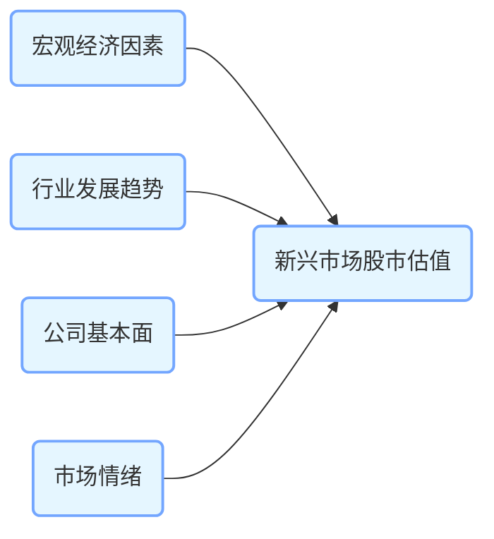
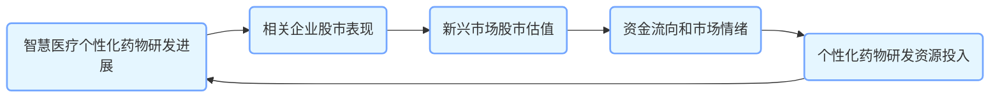

# 新兴市场股市估值与智慧医疗个性化药物研发的互动

> 关键词：新兴市场股市估值、智慧医疗、个性化药物研发、互动关系、金融与医疗交叉

> 摘要：本文聚焦于新兴市场股市估值与智慧医疗个性化药物研发之间的互动关系。在新兴市场不断发展的背景下，股市估值反映了市场对各行业的预期和信心。智慧医疗个性化药物研发作为极具潜力的领域，其发展状况与新兴市场股市估值相互影响。一方面，个性化药物研发的进展和前景会影响相关企业在股市的表现，进而影响整体新兴市场股市估值；另一方面，股市估值所反映的资金流向和市场情绪又会对个性化药物研发的资源投入和发展速度产生作用。文章将深入剖析两者的核心概念、互动机制，通过数学模型、实际案例等进行详细说明，并探讨其实际应用场景、未来发展趋势与挑战。

## 1. 背景介绍 
### 1.1 目的和范围
本研究旨在全面深入地探讨新兴市场股市估值与智慧医疗个性化药物研发之间的互动关系。具体范围涵盖新兴市场的界定及股市估值的相关理论和方法，智慧医疗个性化药物研发的技术原理、发展现状与趋势，以及两者之间相互影响的具体机制和表现形式。通过对这些方面的研究，为投资者、医疗行业从业者以及政策制定者提供有价值的参考，以更好地把握新兴市场股市和智慧医疗个性化药物研发领域的发展动态。

### 1.2 预期读者
本文预期读者包括金融领域的投资者、分析师、基金经理等，他们可以通过了解两者的互动关系，优化投资决策，挖掘潜在的投资机会。医疗行业的科研人员、企业管理者能够从金融市场的角度更好地理解个性化药物研发的市场价值和发展前景，为研发策略和企业战略的制定提供依据。政策制定者可以根据研究结果，制定更合理的金融和医疗政策，促进新兴市场和智慧医疗行业的协同发展。

### 1.3 文档结构概述
本文首先介绍研究的背景、目的、预期读者和文档结构概述，为读者提供整体的研究框架。接着阐述核心概念与联系，包括新兴市场股市估值和智慧医疗个性化药物研发的原理和架构，并通过Mermaid流程图展示两者的联系。然后详细讲解核心算法原理和具体操作步骤，结合Python源代码进行说明。之后给出数学模型和公式，通过举例进行详细讲解。在项目实战部分，展示代码实际案例并进行详细解释说明。再探讨实际应用场景，推荐相关的工具和资源。最后总结未来发展趋势与挑战，提供常见问题与解答以及扩展阅读和参考资料。

### 1.4 术语表
#### 1.4.1 核心术语定义
- **新兴市场**：指发展中国家或地区的金融市场，通常具有较高的经济增长率、快速的工业化进程和不断完善的金融体系，但也伴随着较高的风险和波动性。
- **股市估值**：是对股票市场中上市公司价值的评估，通过各种估值方法来确定股票的合理价格，反映市场对公司未来盈利能力和发展前景的预期。
- **智慧医疗**：利用信息技术和互联网技术，实现医疗信息的数字化、智能化和共享化，提高医疗服务的效率和质量，包括电子病历、远程医疗、医疗大数据分析等应用。
- **个性化药物研发**：根据患者的基因信息、生理特征、疾病史等个体差异，研发针对性的药物和治疗方案，以提高药物的疗效和安全性。

#### 1.4.2 相关概念解释
- **金融市场有效性**：指金融市场能够及时、准确地反映所有相关信息，使资产价格能够合理地反映其内在价值。在有效市场中，投资者很难通过分析公开信息获得超额收益。
- **医疗大数据**：指来源于医疗领域的大量、多样化的数据，包括患者的病历、检查报告、基因数据等。医疗大数据的分析和挖掘可以为个性化药物研发提供重要的依据。
- **基因检测**：通过对人体细胞中的DNA进行检测和分析，了解个体的基因信息，包括基因突变、基因表达等，为个性化药物研发和精准医疗提供基础。

#### 1.4.3 缩略词列表
- **EM**：新兴市场（Emerging Markets）
- **PE**：市盈率（Price-to-Earnings Ratio）
- **PB**：市净率（Price-to-Book Ratio）
- **AI**：人工智能（Artificial Intelligence）
- **ML**：机器学习（Machine Learning）
- **NGS**：下一代测序技术（Next-Generation Sequencing）

## 2. 核心概念与联系 

### 新兴市场股市估值原理
新兴市场股市估值是一个复杂的过程，受到多种因素的影响。常见的估值方法包括市盈率法（PE）、市净率法（PB）、现金流折现法（DCF）等。市盈率法是通过将股票价格除以每股收益来计算，反映了市场对公司盈利能力的预期。市净率法是将股票价格除以每股净资产，反映了市场对公司资产价值的评估。现金流折现法是通过预测公司未来的现金流，并将其折现到当前来计算公司的价值。

新兴市场股市估值的架构可以用以下示意图表示：



### 智慧医疗个性化药物研发原理
智慧医疗个性化药物研发结合了信息技术、生物技术和医学知识，旨在为患者提供更加精准、有效的治疗方案。其核心步骤包括患者数据收集、基因检测、数据分析和模型构建、药物研发和临床试验等。通过对患者的基因信息、生理特征、疾病史等数据进行分析，可以了解患者的个体差异，为药物研发提供针对性的靶点。利用人工智能和机器学习技术，可以对大量的医疗数据进行挖掘和分析，加速药物研发的进程。

智慧医疗个性化药物研发的架构可以用以下示意图表示：


### 两者的联系
新兴市场股市估值与智慧医疗个性化药物研发之间存在着密切的联系。一方面，智慧医疗个性化药物研发的进展和前景会影响相关企业在股市的表现。如果一家企业在个性化药物研发方面取得了重大突破，市场对其未来盈利能力的预期会提高，从而导致其股票价格上涨，进而影响新兴市场股市的整体估值。另一方面，新兴市场股市估值所反映的资金流向和市场情绪会对个性化药物研发的资源投入和发展速度产生影响。如果股市估值较高，投资者对智慧医疗行业的信心增强，会吸引更多的资金流入该领域，促进个性化药物研发的发展。反之，如果股市估值较低，资金可能会从该领域流出，影响个性化药物研发的进度。

两者的联系可以用以下Mermaid流程图表示：



## 3. 核心算法原理 & 具体操作步骤 

### 新兴市场股市估值算法原理及Python实现
#### 市盈率法（PE）
市盈率法是一种简单常用的股市估值方法，其计算公式为：

$$PE = \frac{P}{E}$$

其中，$P$ 表示股票价格，$E$ 表示每股收益。

以下是使用Python实现市盈率法的代码示例：

```python
def pe_ratio(stock_price, earnings_per_share):
    """
    计算市盈率
    :param stock_price: 股票价格
    :param earnings_per_share: 每股收益
    :return: 市盈率
    """
    if earnings_per_share == 0:
        return None
    return stock_price / earnings_per_share

# 示例数据
stock_price = 50
earnings_per_share = 5

# 计算市盈率
pe = pe_ratio(stock_price, earnings_per_share)
print(f"市盈率: {pe}")
```

#### 市净率法（PB）
市净率法的计算公式为：

$$PB = \frac{P}{B}$$

其中，$P$ 表示股票价格，$B$ 表示每股净资产。

以下是使用Python实现市净率法的代码示例：

```python
def pb_ratio(stock_price, book_value_per_share):
    """
    计算市净率
    :param stock_price: 股票价格
    :param book_value_per_share: 每股净资产
    :return: 市净率
    """
    if book_value_per_share == 0:
        return None
    return stock_price / book_value_per_share

# 示例数据
stock_price = 50
book_value_per_share = 10

# 计算市净率
pb = pb_ratio(stock_price, book_value_per_share)
print(f"市净率: {pb}")
```

### 智慧医疗个性化药物研发数据分析算法原理及Python实现
#### 基因数据分析算法
在智慧医疗个性化药物研发中，基因数据分析是关键环节之一。常见的基因数据分析算法包括聚类分析、关联分析等。以下是一个简单的聚类分析示例，使用Python的`scikit-learn`库实现：

```python
from sklearn.cluster import KMeans
import numpy as np

# 示例基因数据
gene_data = np.array([[1, 2], [2, 3], [3, 4], [4, 5], [5, 6], [6, 7]])

# 创建KMeans模型
kmeans = KMeans(n_clusters=2)

# 训练模型
kmeans.fit(gene_data)

# 获取聚类标签
labels = kmeans.labels_
print(f"聚类标签: {labels}")
```

#### 药物疗效预测算法
药物疗效预测可以使用机器学习算法，如线性回归、逻辑回归等。以下是一个使用线性回归预测药物疗效的示例：

```python
from sklearn.linear_model import LinearRegression
import numpy as np

# 示例数据
X = np.array([[1], [2], [3], [4], [5]])
y = np.array([2, 4, 6, 8, 10])

# 创建线性回归模型
model = LinearRegression()

# 训练模型
model.fit(X, y)

# 预测药物疗效
new_data = np.array([[6]])
prediction = model.predict(new_data)
print(f"预测药物疗效: {prediction}")
```

## 4. 数学模型和公式 & 详细讲解 & 举例说明 

### 新兴市场股市估值数学模型
#### 现金流折现模型（DCF）
现金流折现模型是一种基于未来现金流的股市估值模型，其基本思想是将公司未来的现金流折现到当前，以确定公司的内在价值。其计算公式为：

$$V = \sum_{t=1}^{n} \frac{CF_t}{(1 + r)^t} + \frac{TV}{(1 + r)^n}$$

其中，$V$ 表示公司的内在价值，$CF_t$ 表示第 $t$ 期的现金流，$r$ 表示折现率，$TV$ 表示终值，$n$ 表示预测期数。

详细讲解：该模型的核心在于对未来现金流的预测和折现率的选择。未来现金流的预测需要考虑公司的业务模式、市场前景、竞争环境等因素。折现率的选择通常基于市场利率、公司的风险水平等因素。终值的计算可以采用永续增长模型等方法。

举例说明：假设一家公司未来三年的现金流分别为100万元、120万元、150万元，折现率为10%，三年后公司的终值为1000万元。则该公司的内在价值为：

$$V = \frac{100}{(1 + 0.1)^1} + \frac{120}{(1 + 0.1)^2} + \frac{150}{(1 + 0.1)^3} + \frac{1000}{(1 + 0.1)^3}$$

```python
import numpy as np

# 现金流
cash_flows = np.array([100, 120, 150])
# 折现率
discount_rate = 0.1
# 终值
terminal_value = 1000
# 预测期数
n = 3

# 计算内在价值
intrinsic_value = 0
for t in range(1, n + 1):
    intrinsic_value += cash_flows[t - 1] / (1 + discount_rate) ** t
intrinsic_value += terminal_value / (1 + discount_rate) ** n

print(f"公司内在价值: {intrinsic_value} 万元")
```

### 智慧医疗个性化药物研发数学模型
#### 药物疗效预测模型
药物疗效预测模型可以使用线性回归模型，其数学表达式为：

$$y = \beta_0 + \beta_1x_1 + \beta_2x_2 + \cdots + \beta_nx_n + \epsilon$$

其中，$y$ 表示药物疗效，$x_1, x_2, \cdots, x_n$ 表示影响药物疗效的因素，如患者的基因信息、生理特征等，$\beta_0, \beta_1, \cdots, \beta_n$ 表示回归系数，$\epsilon$ 表示误差项。

详细讲解：该模型通过对大量的患者数据进行分析，确定回归系数，从而建立药物疗效与影响因素之间的关系。回归系数的大小表示各个因素对药物疗效的影响程度。

举例说明：假设影响药物疗效的因素有两个，分别为基因特征 $x_1$ 和年龄 $x_2$，通过对大量患者数据的分析，得到回归系数 $\beta_0 = 10$，$\beta_1 = 2$，$\beta_2 = 0.5$。则对于一个基因特征为5，年龄为30岁的患者，其药物疗效预测值为：

$$y = 10 + 2 \times 5 + 0.5 \times 30 = 35$$

```python
# 回归系数
beta_0 = 10
beta_1 = 2
beta_2 = 0.5

# 患者数据
x_1 = 5
x_2 = 30

# 预测药物疗效
y = beta_0 + beta_1 * x_1 + beta_2 * x_2
print(f"药物疗效预测值: {y}")
```

## 5. 项目实战：代码实际案例和详细解释说明 

### 5.1  开发环境搭建
#### 安装Python
首先，需要安装Python开发环境。可以从Python官方网站（https://www.python.org/downloads/） 下载适合自己操作系统的Python版本，并按照安装向导进行安装。

#### 安装必要的库
在项目中，需要使用一些Python库，如`numpy`、`pandas`、`scikit-learn`等。可以使用以下命令进行安装：

```sh
pip install numpy pandas scikit-learn
```

### 5.2  源代码详细实现和代码解读
#### 新兴市场股市估值案例
以下是一个简单的新兴市场股市估值案例，使用市盈率法和市净率法对一家公司进行估值：

```python
# 示例数据
stock_price = 50
earnings_per_share = 5
book_value_per_share = 10

# 计算市盈率
def pe_ratio(stock_price, earnings_per_share):
    if earnings_per_share == 0:
        return None
    return stock_price / earnings_per_share

# 计算市净率
def pb_ratio(stock_price, book_value_per_share):
    if book_value_per_share == 0:
        return None
    return stock_price / book_value_per_share

# 计算市盈率和市净率
pe = pe_ratio(stock_price, earnings_per_share)
pb = pb_ratio(stock_price, book_value_per_share)

print(f"市盈率: {pe}")
print(f"市净率: {pb}")
```

代码解读：
- 首先，定义了示例数据，包括股票价格、每股收益和每股净资产。
- 然后，定义了两个函数`pe_ratio`和`pb_ratio`，分别用于计算市盈率和市净率。
- 最后，调用这两个函数计算市盈率和市净率，并将结果打印输出。

#### 智慧医疗个性化药物研发案例
以下是一个简单的智慧医疗个性化药物研发案例，使用线性回归模型预测药物疗效：

```python
import numpy as np
from sklearn.linear_model import LinearRegression

# 示例数据
X = np.array([[1], [2], [3], [4], [5]])
y = np.array([2, 4, 6, 8, 10])

# 创建线性回归模型
model = LinearRegression()

# 训练模型
model.fit(X, y)

# 预测药物疗效
new_data = np.array([[6]])
prediction = model.predict(new_data)

print(f"预测药物疗效: {prediction}")
```

代码解读：
- 首先，导入必要的库，包括`numpy`和`scikit-learn`中的`LinearRegression`类。
- 然后，定义示例数据，包括特征矩阵`X`和目标向量`y`。
- 接着，创建线性回归模型，并使用`fit`方法对模型进行训练。
- 最后，使用训练好的模型对新数据进行预测，并将预测结果打印输出。

### 5.3  代码解读与分析
#### 新兴市场股市估值代码分析
市盈率和市净率是简单常用的股市估值方法，但它们也有一定的局限性。市盈率法只考虑了公司的盈利情况，没有考虑公司的资产质量和未来发展潜力。市净率法只考虑了公司的资产价值，没有考虑公司的盈利能力。因此，在实际应用中，需要结合其他估值方法进行综合分析。

#### 智慧医疗个性化药物研发代码分析
线性回归模型是一种简单的机器学习模型，适用于预测连续变量。在实际应用中，药物疗效的预测可能受到多种因素的影响，需要使用更复杂的模型，如神经网络、随机森林等。同时，数据的质量和数量也会影响模型的性能，需要进行数据清洗和特征工程等预处理工作。

## 6. 实际应用场景 
### 投资者决策
投资者可以通过分析新兴市场股市估值和智慧医疗个性化药物研发的互动关系，优化投资决策。如果一家智慧医疗企业在个性化药物研发方面取得了重大突破，其股票价格可能会上涨，投资者可以考虑买入该股票。反之，如果股市估值较低，资金可能会从智慧医疗领域流出，投资者可以考虑减持相关股票。

### 医疗企业战略规划
医疗企业可以根据新兴市场股市估值的变化，调整个性化药物研发的战略规划。如果股市估值较高，企业可以加大研发投入，加快研发进度，以获取更多的市场份额。反之，如果股市估值较低，企业可以适当控制研发成本，优化研发资源的配置。

### 政策制定
政策制定者可以根据新兴市场股市估值和智慧医疗个性化药物研发的互动关系，制定相关政策，促进两者的协同发展。例如，政府可以出台税收优惠政策，鼓励投资者投资智慧医疗领域，为个性化药物研发提供资金支持。同时，政府可以加大对智慧医疗研发的投入，提高研发水平，推动新兴市场股市的健康发展。

## 7. 工具和资源推荐
### 7.1 学习资源推荐
#### 7.1.1 书籍推荐
- 《金融市场学》：全面介绍金融市场的基本概念、理论和实践，为理解新兴市场股市估值提供理论基础。
- 《机器学习》：详细讲解机器学习的算法原理和应用，为智慧医疗个性化药物研发中的数据分析提供技术支持。
- 《基因工程原理》：深入介绍基因工程的基本原理和技术，为了解个性化药物研发的生物技术基础提供帮助。

#### 7.1.2 在线课程
- Coursera上的“Financial Markets”课程：由知名教授授课，系统讲解金融市场的知识和分析方法。
- edX上的“Machine Learning Fundamentals”课程：介绍机器学习的基本概念和算法，通过实际案例进行讲解。
- Udemy上的“Genetic Engineering and Biotechnology”课程：讲解基因工程和生物技术的原理和应用，适合初学者学习。

#### 7.1.3 技术博客和网站
- 金融界（https://www.jrj.com.cn/）：提供金融市场的最新资讯、分析报告和投资策略，帮助投资者了解新兴市场股市的动态。
- 机器之心（https://www.alternativedata.org/）：专注于人工智能和机器学习领域的技术分享和研究成果报道，为智慧医疗个性化药物研发提供技术参考。
- 基因谷（https://www.genegood.com/）：提供基因技术、生物技术和生命科学领域的最新资讯和研究进展，为个性化药物研发提供生物技术方面的信息。

### 7.2 开发工具框架推荐
#### 7.2.1 IDE和编辑器
- PyCharm：一款专业的Python集成开发环境，提供代码编辑、调试、版本控制等功能，适合Python开发。
- Jupyter Notebook：一种交互式的开发环境，支持Python、R等多种编程语言，适合数据分析和机器学习项目的开发。
- Visual Studio Code：一款轻量级的代码编辑器，支持多种编程语言和插件扩展，适合快速开发和调试。

#### 7.2.2 调试和性能分析工具
- PDB：Python自带的调试工具，可以在代码中设置断点，逐步执行代码，查看变量的值和程序的执行流程。
- cProfile：Python的性能分析工具，可以分析代码的运行时间和函数调用情况，找出性能瓶颈。
- TensorBoard：TensorFlow的可视化工具，可以可视化训练过程中的损失函数、准确率等指标，帮助优化模型。

#### 7.2.3 相关框架和库
- Pandas：Python的数据分析库，提供高效的数据结构和数据处理工具，适合处理医疗大数据。
- Scikit-learn：Python的机器学习库，提供各种机器学习算法和工具，适合药物疗效预测等数据分析任务。
- TensorFlow：开源的深度学习框架，提供强大的计算能力和模型训练工具，适合处理复杂的基因数据分析和药物研发问题。

### 7.3 相关论文著作推荐
#### 7.3.1 经典论文
- Fama, E. F., & French, K. R. (1992). The cross-section of expected stock returns. The Journal of Finance, 47(2), 427-465. 该论文提出了Fama-French三因子模型，对股票收益率的影响因素进行了深入分析。
- Vapnik, V. N. (1995). The nature of statistical learning theory. Springer. 该书介绍了支持向量机的理论和方法，是机器学习领域的经典著作。
- Watson, J. D., & Crick, F. H. C. (1953). Molecular structure of nucleic acids; a structure for deoxyribose nucleic acid. Nature, 171(4356), 737-738. 该论文揭示了DNA的双螺旋结构，为基因工程和个性化药物研发奠定了基础。

#### 7.3.2 最新研究成果
- 关注顶级学术期刊，如《Nature》、《Science》、《The Lancet》等，这些期刊经常发表智慧医疗和金融领域的最新研究成果。
- 参加国际学术会议，如ACM SIGKDD、NeurIPS等，了解机器学习和数据分析领域的最新技术和应用。

#### 7.3.3 应用案例分析
- 分析国内外智慧医疗企业的成功案例，了解它们在个性化药物研发和市场推广方面的经验和策略。
- 研究新兴市场股市中医疗板块的表现，分析股市估值与智慧医疗企业发展之间的关系。

## 8. 总结：未来发展趋势与挑战
### 未来发展趋势
- **技术融合加速**：人工智能、大数据、基因技术等将与金融和医疗领域深度融合，推动智慧医疗个性化药物研发和新兴市场股市的创新发展。例如，利用人工智能技术可以加速药物研发的进程，提高研发效率；利用金融科技可以优化股市估值模型，提高投资决策的准确性。
- **个性化医疗普及**：随着基因检测技术的不断进步和成本的降低，个性化医疗将逐渐普及，为智慧医疗个性化药物研发带来更大的市场需求。这将促使更多的企业和资本进入该领域，推动新兴市场股市中医疗板块的发展。
- **国际合作加强**：智慧医疗个性化药物研发是一个全球性的挑战，需要各国之间加强合作。国际合作将促进技术交流和资源共享，加速个性化药物研发的进程，同时也将影响新兴市场股市的国际化发展。

### 挑战
- **数据隐私和安全**：智慧医疗个性化药物研发涉及大量的患者个人数据，包括基因信息、病历等，数据隐私和安全问题成为重要挑战。如何保护患者的隐私和数据安全，防止数据泄露和滥用，是需要解决的关键问题。
- **技术创新和人才短缺**：智慧医疗个性化药物研发需要不断的技术创新和高素质的人才支持。目前，相关领域的技术创新能力和人才储备还相对不足，需要加大研发投入和人才培养力度。
- **市场不确定性**：新兴市场股市具有较高的波动性和不确定性，智慧医疗个性化药物研发的进展和市场前景也存在较大的不确定性。如何应对市场不确定性，降低投资风险，是投资者和企业面临的挑战。

## 9. 附录：常见问题与解答
### 新兴市场股市估值的方法有哪些？
常见的新兴市场股市估值方法包括市盈率法（PE）、市净率法（PB）、现金流折现法（DCF）等。市盈率法是通过将股票价格除以每股收益来计算，反映了市场对公司盈利能力的预期。市净率法是将股票价格除以每股净资产，反映了市场对公司资产价值的评估。现金流折现法是通过预测公司未来的现金流，并将其折现到当前来计算公司的价值。

### 智慧医疗个性化药物研发的关键技术有哪些？
智慧医疗个性化药物研发的关键技术包括基因检测技术、人工智能和机器学习技术、医疗大数据分析技术等。基因检测技术可以获取患者的基因信息，为个性化药物研发提供基础。人工智能和机器学习技术可以对大量的医疗数据进行挖掘和分析，加速药物研发的进程。医疗大数据分析技术可以整合患者的病历、检查报告等数据，为个性化治疗方案的制定提供依据。

### 新兴市场股市估值与智慧医疗个性化药物研发之间的互动关系是如何体现的？
一方面，智慧医疗个性化药物研发的进展和前景会影响相关企业在股市的表现。如果一家企业在个性化药物研发方面取得了重大突破，市场对其未来盈利能力的预期会提高，从而导致其股票价格上涨，进而影响新兴市场股市的整体估值。另一方面，新兴市场股市估值所反映的资金流向和市场情绪会对个性化药物研发的资源投入和发展速度产生影响。如果股市估值较高，投资者对智慧医疗行业的信心增强，会吸引更多的资金流入该领域，促进个性化药物研发的发展。反之，如果股市估值较低，资金可能会从该领域流出，影响个性化药物研发的进度。

## 10. 扩展阅读 & 参考资料
- [1] Damodaran, A. (2012). Investment valuation: Tools and techniques for determining the value of any asset. Wiley.
- [2] Murphy, K. P. (2012). Machine learning: A probabilistic perspective. MIT press.
- [3] Alberts, B., Johnson, A., Lewis, J., Raff, M., Roberts, K., & Walter, P. (2002). Molecular biology of the cell. Garland Science.
- [4] 金融时报（https://www.ft.com/）
- [5] 生物谷（https://www.bioon.com.cn/）