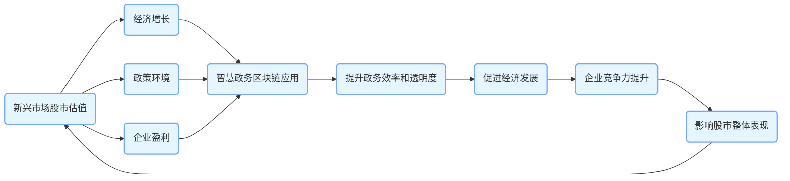

# 新兴市场股市估值与智慧政务区块链应用的互动

> 关键词：新兴市场股市、股市估值、智慧政务、区块链应用、互动关系

> 摘要：本文聚焦于新兴市场股市估值与智慧政务区块链应用的互动关系。首先阐述了新兴市场股市和智慧政务区块链应用各自的背景及相关概念，接着深入剖析两者互动的核心原理和联系，详细讲解相关算法、数学模型及公式。通过项目实战案例展示了如何在实际中体现这种互动。同时探讨了其实际应用场景，推荐了相关的学习资源、开发工具和论文著作。最后总结未来发展趋势与挑战，解答常见问题并提供扩展阅读和参考资料，旨在全面揭示新兴市场股市估值与智慧政务区块链应用之间的相互作用及影响，为相关领域的研究和实践提供有价值的参考。

## 1. 背景介绍 
### 1.1 目的和范围
本研究旨在深入探究新兴市场股市估值与智慧政务区块链应用之间的互动关系。范围涵盖新兴市场股市估值的多种影响因素、智慧政务区块链应用的原理和实践，以及两者相互作用的机制和表现。通过理论分析和实际案例研究，揭示这种互动关系对新兴市场金融稳定、政务效率提升等方面的影响，为政策制定者、投资者和政务管理者提供决策依据。

### 1.2 预期读者
本文预期读者包括金融领域的投资者、分析师、研究人员，政府部门从事政务信息化建设的工作人员，以及对新兴市场和区块链技术感兴趣的学者和爱好者。对于投资者，有助于其更好地理解新兴市场股市的动态，把握投资机会；对于政务工作者，可借鉴区块链技术提升政务服务水平；对于学者和爱好者，能为其研究和学习提供新的视角和思路。

### 1.3 文档结构概述
本文首先介绍相关背景知识，包括目的、读者和文档结构等。接着阐述核心概念与联系，通过文本示意图和 Mermaid 流程图展示两者的内在逻辑。然后详细讲解核心算法原理和具体操作步骤，结合 Python 代码进行说明。再介绍数学模型和公式，并举例说明。通过项目实战案例，展示开发环境搭建、源代码实现和代码解读。之后探讨实际应用场景，推荐相关工具和资源。最后总结未来发展趋势与挑战，解答常见问题并提供扩展阅读和参考资料。

### 1.4 术语表
#### 1.4.1 核心术语定义
- **新兴市场股市**：指发展中国家或地区的股票市场，通常具有较高的增长潜力，但也伴随着较高的风险和波动性。
- **股市估值**：对股票市场中股票价值的评估，常用的方法包括市盈率、市净率等，用于判断股票价格是否合理。
- **智慧政务**：利用现代信息技术，如互联网、大数据、人工智能等，实现政务服务的智能化、高效化和便捷化。
- **区块链**：一种去中心化的分布式账本技术，具有不可篡改、可追溯、共识机制等特点，可用于构建可信的信息系统。

#### 1.4.2 相关概念解释
- **新兴市场**：是相对于成熟市场而言的，经济发展水平和市场机制尚不完善，但具有较大的发展潜力和增长空间。新兴市场股市在经济增长、政策环境等因素的影响下，表现出与成熟市场不同的特征。
- **政务区块链应用**：将区块链技术应用于政务领域，如政务数据共享、电子政务流程优化、公共服务提供等，以提高政务透明度、安全性和效率。

#### 1.4.3 缩略词列表
- **PE**：市盈率（Price - Earnings Ratio），是股票价格与每股收益的比率，用于衡量股票的估值水平。
- **PB**：市净率（Price - Book Ratio），是股票价格与每股净资产的比率，反映股票的市场价值与账面价值的关系。
- **DApp**：去中心化应用（Decentralized Application），基于区块链技术开发的应用程序。

## 2. 核心概念与联系 

### 新兴市场股市估值的核心概念
新兴市场股市估值是一个复杂的过程，受到多种因素的影响。从宏观层面来看，经济增长、通货膨胀、利率水平等因素会影响整个市场的估值水平。例如，经济增长强劲时，企业盈利预期增加，股市估值往往会上升；而通货膨胀上升可能导致利率上升，增加企业的融资成本，从而降低股市估值。

从微观层面来看，公司的财务状况、行业竞争力、管理水平等因素会影响个股的估值。常用的估值方法包括市盈率法、市净率法、现金流折现法等。市盈率法是通过比较股票价格与每股收益来评估股票的估值水平，市净率法是比较股票价格与每股净资产，现金流折现法是通过预测公司未来的现金流并折现到当前来计算股票的内在价值。

### 智慧政务区块链应用的核心概念
智慧政务区块链应用旨在利用区块链的特性解决政务领域的一些痛点问题。区块链的去中心化特性可以避免数据集中存储带来的安全风险，不可篡改和可追溯性可以保证政务数据的真实性和完整性。例如，在政务数据共享方面，区块链可以实现不同部门之间的数据安全共享，避免数据被篡改或滥用；在电子政务流程优化方面，区块链可以实现流程的自动化和透明化，提高政务处理效率。

### 两者的联系
新兴市场股市估值与智慧政务区块链应用存在着多方面的联系。一方面，智慧政务区块链应用的发展可以提升政务效率和透明度，改善营商环境，促进经济增长，从而对新兴市场股市估值产生积极影响。例如，政务数据的安全共享可以降低企业的运营成本，提高企业的竞争力，进而提升企业的盈利水平和股市估值。

另一方面，新兴市场股市的发展也可以为智慧政务区块链应用提供资金支持和技术创新动力。股市的繁荣可以吸引更多的资金投入到区块链技术研发和应用推广中，推动智慧政务区块链应用的发展。

### 文本示意图
```plaintext
新兴市场股市估值 <---- 经济增长、政策环境、企业盈利等因素 ----> 智慧政务区块链应用
                      |                                              |
                      |                                              |
                      |                                              |
              影响股市整体表现                                提升政务效率和透明度
                      |                                              |
                      |                                              |
                      |                                              |
              吸引投资者参与                            促进经济发展和企业竞争力提升
```

### Mermaid 流程图


## 3. 核心算法原理 & 具体操作步骤 

### 新兴市场股市估值算法原理
#### 市盈率法
市盈率法是一种常用的股市估值方法，其基本原理是通过比较股票价格与每股收益来评估股票的估值水平。计算公式为：

$PE=\frac{P}{EPS}$

其中，$PE$ 为市盈率，$P$ 为股票价格，$EPS$ 为每股收益。

#### Python 代码实现
```python
def calculate_pe(stock_price, earnings_per_share):
    if earnings_per_share == 0:
        return None
    else:
        return stock_price / earnings_per_share

# 示例
stock_price = 50
earnings_per_share = 5
pe = calculate_pe(stock_price, earnings_per_share)
print(f"市盈率: {pe}")
```

#### 市净率法
市净率法是通过比较股票价格与每股净资产来评估股票的估值水平。计算公式为：

$PB=\frac{P}{BVPS}$

其中，$PB$ 为市净率，$P$ 为股票价格，$BVPS$ 为每股净资产。

#### Python 代码实现
```python
def calculate_pb(stock_price, book_value_per_share):
    if book_value_per_share == 0:
        return None
    else:
        return stock_price / book_value_per_share

# 示例
stock_price = 50
book_value_per_share = 10
pb = calculate_pb(stock_price, book_value_per_share)
print(f"市净率: {pb}")
```

### 智慧政务区块链应用中的算法原理
#### 哈希算法
哈希算法是区块链技术的核心算法之一，用于保证数据的完整性和不可篡改。常见的哈希算法有 SHA - 256 等。

#### Python 代码实现
```python
import hashlib

def calculate_hash(data):
    data = str(data).encode('utf-8')
    hash_object = hashlib.sha256(data)
    return hash_object.hexdigest()

# 示例
data = "政务数据示例"
hash_value = calculate_hash(data)
print(f"哈希值: {hash_value}")
```

#### 共识算法
共识算法用于在区块链网络中达成节点之间的共识，保证数据的一致性。常见的共识算法有工作量证明（PoW）、权益证明（PoS）等。

#### Python 代码实现（简单的工作量证明示例）
```python
import hashlib

def proof_of_work(block, difficulty=4):
    nonce = 0
    while True:
        data = str(block) + str(nonce)
        hash_value = hashlib.sha256(data.encode('utf-8')).hexdigest()
        if hash_value[:difficulty] == '0' * difficulty:
            break
        nonce += 1
    return nonce

# 示例
block = "政务区块数据"
nonce = proof_of_work(block)
print(f"工作量证明的随机数: {nonce}")
```

## 4. 数学模型和公式 & 详细讲解 & 举例说明 

### 新兴市场股市估值的数学模型
#### 股息折现模型（DDM）
股息折现模型是一种基于股票未来股息现金流的估值模型。其基本原理是将股票未来的股息现金流折现到当前，计算股票的内在价值。

公式为：

$V=\sum_{t = 1}^{\infty}\frac{D_t}{(1 + r)^t}$

其中，$V$ 为股票的内在价值，$D_t$ 为第 $t$ 期的股息，$r$ 为折现率。

#### 详细讲解
该模型假设股票的价值等于其未来所有股息的现值之和。折现率 $r$ 反映了投资者对股票投资的预期收益率，通常与市场利率、股票风险等因素有关。

#### 举例说明
假设某股票每年的股息为 2 元，投资者的预期收益率为 10%，则该股票的内在价值为：

$V=\frac{2}{0.1}=20$（元）

### 智慧政务区块链应用中的数学模型
#### 区块链网络的节点连通性模型
在区块链网络中，节点之间的连通性对网络的性能和安全性有重要影响。可以用图论中的连通性模型来描述区块链网络的节点关系。

假设区块链网络中有 $n$ 个节点，节点之间的连接关系可以用一个邻接矩阵 $A$ 表示，其中 $A_{ij}$ 表示节点 $i$ 和节点 $j$ 之间是否有连接（$A_{ij}=1$ 表示有连接，$A_{ij}=0$ 表示无连接）。

#### 详细讲解
通过分析邻接矩阵，可以计算网络的连通性指标，如节点的度、聚类系数等。节点的度表示该节点与其他节点的连接数，聚类系数表示节点之间的紧密程度。

#### 举例说明
假设有一个包含 5 个节点的区块链网络，其邻接矩阵为：

$A=\begin{bmatrix}
0 & 1 & 0 & 1 & 0\\
1 & 0 & 1 & 0 & 0\\
0 & 1 & 0 & 1 & 1\\
1 & 0 & 1 & 0 & 0\\
0 & 0 & 1 & 0 & 0
\end{bmatrix}$

节点 1 的度为 2，节点 3 的度为 3。

## 5. 项目实战：代码实际案例和详细解释说明 

### 5.1  开发环境搭建
#### 股市数据获取环境
- **Python 环境**：安装 Python 3.x 版本，可以从 Python 官方网站下载安装包进行安装。
- **数据获取库**：使用 `pandas`、`yfinance` 等库获取股市数据。可以使用以下命令进行安装：
```sh
pip install pandas yfinance
```

#### 区块链开发环境
- **区块链平台**：选择合适的区块链平台，如 Hyperledger Fabric、Ethereum 等。以 Ethereum 为例，需要安装 `geth` 客户端。
- **智能合约开发环境**：使用 `Solidity` 语言编写智能合约，使用 `Truffle` 框架进行开发和部署。可以使用以下命令进行安装：
```sh
npm install -g truffle
```

### 5.2  源代码详细实现和代码解读
#### 股市数据获取与分析
```python
import yfinance as yf
import pandas as pd

# 获取新兴市场某股票数据
ticker = "ABC"  # 假设股票代码为 ABC
start_date = "2020-01-01"
end_date = "2023-01-01"
data = yf.download(ticker, start=start_date, end=end_date)

# 计算简单收益率
data['Return'] = data['Close'].pct_change()

# 计算市盈率
earnings_per_share = 2  # 假设每股收益为 2 元
data['PE'] = data['Close'] / earnings_per_share

# 保存数据到 CSV 文件
data.to_csv("stock_data.csv")

print(data.head())
```
**代码解读**：
- 使用 `yfinance` 库下载指定股票在指定时间段内的历史数据。
- 计算股票的简单收益率，即每日收盘价的变化率。
- 根据每股收益计算市盈率。
- 将数据保存到 CSV 文件中。

#### 区块链智能合约开发与部署
以下是一个简单的 Solidity 智能合约示例：
```solidity
pragma solidity ^0.8.0;

contract SimpleContract {
    uint256 public value;

    constructor(uint256 initialValue) {
        value = initialValue;
    }

    function setValue(uint256 newValue) public {
        value = newValue;
    }

    function getValue() public view returns (uint256) {
        return value;
    }
}
```
**代码解读**：
- 定义一个名为 `SimpleContract` 的智能合约。
- 合约中有一个公共变量 `value` 用于存储数据。
- 构造函数 `constructor` 用于初始化 `value` 的值。
- `setValue` 函数用于修改 `value` 的值。
- `getValue` 函数用于获取 `value` 的值。

### 5.3  代码解读与分析
#### 股市数据代码分析
通过 `yfinance` 库获取股市数据是一种简单方便的方法，但需要注意数据的准确性和实时性。计算收益率和市盈率可以帮助投资者了解股票的表现和估值水平。保存数据到 CSV 文件可以方便后续的分析和处理。

#### 区块链智能合约代码分析
智能合约是区块链应用的核心，通过 Solidity 语言编写的智能合约可以实现数据的存储和操作。在实际应用中，需要考虑智能合约的安全性和性能，避免出现漏洞和错误。

## 6. 实际应用场景 
### 股市估值对智慧政务区块链应用的影响
#### 投资决策影响政务区块链项目
当新兴市场股市估值较高时，投资者对市场的信心增强，可能会更愿意投资与智慧政务区块链应用相关的项目。例如，一些从事政务区块链技术研发和应用的企业在股市上表现良好，会吸引更多的资金投入到该领域，促进政务区块链项目的发展。

#### 股市波动影响政务区块链项目的融资
股市的波动会影响企业的融资能力。如果股市估值下降，企业的融资成本可能会增加，这可能会对智慧政务区块链项目的推进产生一定的影响。例如，一些政务区块链项目可能因为资金短缺而延迟或暂停。

### 智慧政务区块链应用对股市估值的影响
#### 提升企业竞争力，影响股市估值
智慧政务区块链应用可以帮助企业提高运营效率，降低成本，提升企业的竞争力。例如，通过政务区块链实现政务数据的安全共享，企业可以更快地获取相关信息，减少办事时间和成本。这可能会提高企业的盈利水平，进而影响企业的股市估值。

#### 改善营商环境，吸引投资者
智慧政务区块链应用可以改善新兴市场的营商环境，提高政务透明度和公正性。这会吸引更多的投资者进入新兴市场，增加市场的资金流入，对股市估值产生积极影响。

## 7. 工具和资源推荐
### 7.1 学习资源推荐
#### 7.1.1 书籍推荐
- 《区块链：技术驱动金融》：全面介绍了区块链技术的原理、应用和发展趋势，适合初学者和有一定基础的读者。
- 《金融市场与金融机构》：详细讲解了金融市场的运作机制和金融机构的业务，对于理解新兴市场股市估值有很大帮助。
- 《Python 数据分析实战》：介绍了 Python 在数据分析领域的应用，包括数据获取、处理和分析等方面的内容。

#### 7.1.2 在线课程
- Coursera 上的“区块链基础”课程：由知名教授授课，系统地介绍了区块链的基本概念、技术原理和应用场景。
- edX 上的“金融市场分析”课程：深入讲解了金融市场的分析方法和工具，对于学习股市估值有很大帮助。
- 慕课网上的“Python 数据分析入门”课程：适合初学者学习 Python 数据分析的基础知识和技能。

#### 7.1.3 技术博客和网站
- 区块链技术博客：如 Medium 上的区块链相关博客，提供了最新的区块链技术动态和研究成果。
- 金融资讯网站：如 Bloomberg、CNBC 等，提供了全球金融市场的实时资讯和分析。
- 开源技术社区：如 GitHub，上面有很多关于区块链和数据分析的开源项目，可以学习和参考。

### 7.2 开发工具框架推荐
#### 7.2.1 IDE和编辑器
- PyCharm：是一款专业的 Python 集成开发环境，提供了丰富的代码编辑、调试和分析功能。
- Visual Studio Code：是一款轻量级的代码编辑器，支持多种编程语言，并且有丰富的插件可以扩展功能。
- Remix：是一个在线的 Solidity 智能合约开发环境，方便开发者编写、调试和部署智能合约。

#### 7.2.2 调试和性能分析工具
- Ganache：是一个本地的以太坊开发环境，可以用于调试和测试智能合约。
- Py-Spy：是一个 Python 性能分析工具，可以帮助开发者找出代码中的性能瓶颈。
- Solidity Linter：是一个 Solidity 代码检查工具，可以帮助开发者发现智能合约中的潜在问题。

#### 7.2.3 相关框架和库
- Web3.py：是一个 Python 库，用于与以太坊区块链进行交互，方便开发者编写区块链应用。
- Truffle：是一个以太坊智能合约开发框架，提供了合约编译、部署和测试等功能。
- Pandas：是一个 Python 数据分析库，提供了高效的数据处理和分析工具。

### 7.3 相关论文著作推荐
#### 7.3.1 经典论文
- Nakamoto, S. (2008). Bitcoin: A Peer - to - Peer Electronic Cash System. 这篇论文是比特币的白皮书，首次提出了区块链的概念和实现方法。
- Fama, E. F., & French, K. R. (1992). The Cross - Section of Expected Stock Returns. 该论文提出了著名的 Fama - French 三因子模型，对股市估值和资产定价有重要影响。

#### 7.3.2 最新研究成果
- 关注顶级学术期刊，如《Journal of Financial Economics》、《Management Science》等，上面发表了很多关于金融市场和区块链技术的最新研究成果。

#### 7.3.3 应用案例分析
- 可以参考一些知名企业或政府部门的区块链应用案例，如 IBM 的 Hyperledger Fabric 应用案例、中国一些城市的政务区块链应用实践等，了解区块链技术在实际中的应用效果和经验教训。

## 8. 总结：未来发展趋势与挑战
### 未来发展趋势
#### 融合发展趋势增强
新兴市场股市估值与智慧政务区块链应用的融合发展趋势将越来越明显。随着区块链技术的不断成熟和应用推广，智慧政务区块链应用将更加广泛地应用于政务领域，提升政务效率和透明度。这将进一步改善营商环境，促进经济增长，从而对新兴市场股市估值产生积极影响。同时，股市的发展也将为智慧政务区块链应用提供更多的资金和技术支持，推动其不断创新和发展。

#### 技术创新推动发展
区块链技术的不断创新将为智慧政务区块链应用带来更多的可能性。例如，零知识证明、侧链技术等的发展将进一步提高区块链的性能和安全性，为政务数据的保护和共享提供更好的解决方案。这些技术创新也将吸引更多的投资者关注和参与，对新兴市场股市估值产生影响。

#### 国际合作加强
在全球化的背景下，新兴市场国家之间以及与发达国家之间的合作将加强。在智慧政务区块链应用方面，各国可以分享经验和技术，共同推动区块链技术在政务领域的应用。这种国际合作将促进新兴市场的经济发展和金融稳定，对股市估值产生积极影响。

### 挑战
#### 技术难题
区块链技术仍然面临一些技术难题，如性能瓶颈、可扩展性、隐私保护等。在智慧政务区块链应用中，需要处理大量的政务数据，对区块链的性能和可扩展性提出了更高的要求。同时，政务数据涉及到公民的隐私和安全，需要更好的隐私保护技术来保障数据的安全。

#### 法律法规不完善
目前，区块链技术的法律法规还不完善，特别是在政务领域的应用。在智慧政务区块链应用中，需要明确数据的所有权、使用权和责任等问题，避免出现法律纠纷。同时，也需要制定相关的监管政策，规范区块链技术的应用，保障金融市场的稳定和安全。

#### 市场风险
新兴市场股市本身具有较高的风险和波动性，智慧政务区块链应用的发展也可能受到市场风险的影响。例如，股市的大幅波动可能会影响企业的融资能力，进而影响智慧政务区块链项目的推进。此外，区块链技术的发展也存在不确定性，可能会导致相关企业的业绩波动，对股市估值产生影响。

## 9. 附录：常见问题与解答
### 1. 新兴市场股市估值与成熟市场股市估值有什么区别？
新兴市场股市估值通常受到经济增长、政策环境、市场流动性等因素的影响较大，具有较高的波动性。与成熟市场相比，新兴市场的经济发展水平和市场机制尚不完善，企业的盈利能力和治理水平也存在一定差距，因此股市估值的方法和标准可能会有所不同。

### 2. 智慧政务区块链应用的安全性如何保障？
智慧政务区块链应用的安全性主要通过区块链的技术特性来保障。例如，哈希算法可以保证数据的完整性和不可篡改，共识算法可以保证节点之间的一致性，加密技术可以保护数据的隐私。此外，还需要建立完善的安全管理制度和监管机制，加强对区块链应用的安全审计和评估。

### 3. 区块链技术在智慧政务中的应用会对政府部门的工作产生哪些影响？
区块链技术在智慧政务中的应用可以提高政务效率和透明度，减少人为干预和腐败现象。例如，通过区块链实现政务数据的共享和流程的自动化，可以缩短办事时间，提高服务质量。同时，区块链的可追溯性可以对政府部门的工作进行监督和审计，促进政府部门的规范化和法治化建设。

### 4. 如何判断新兴市场股市估值是否合理？
判断新兴市场股市估值是否合理需要综合考虑多种因素，如经济增长、企业盈利、利率水平、市场情绪等。常用的估值方法包括市盈率法、市净率法、现金流折现法等。此外，还可以参考历史估值水平和同行业的估值情况，进行比较和分析。

### 5. 智慧政务区块链应用的发展前景如何？
智慧政务区块链应用具有广阔的发展前景。随着区块链技术的不断成熟和应用推广，其在政务数据共享、电子政务流程优化、公共服务提供等方面的优势将得到进一步发挥。同时，政府部门对数字化转型的重视和支持也将为智慧政务区块链应用的发展提供良好的政策环境。

## 10. 扩展阅读 & 参考资料
### 扩展阅读
- 《数字政府：建设原理与实践》：深入探讨了数字政府建设的理论和实践，包括智慧政务的发展趋势和应用案例。
- 《区块链革命：比特币底层技术如何改变货币、商业和世界》：进一步阐述了区块链技术对各个领域的影响和变革，提供了更多的思考和启示。

### 参考资料
- 相关学术期刊文章，如《Journal of Financial Economics》、《Management Science》等。
- 政府部门发布的政策文件和报告，如关于政务信息化建设、区块链技术应用等方面的文件。
- 企业和机构的研究报告，如区块链技术公司的技术白皮书、金融机构的市场分析报告等。