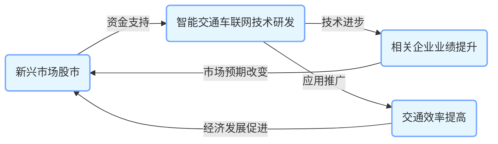

# 新兴市场股市估值与智能交通车联网技术的互动

> 关键词：新兴市场、股市估值、智能交通、车联网技术、互动关系

> 摘要：本文旨在深入探讨新兴市场股市估值与智能交通车联网技术之间的互动关系。通过对相关核心概念的阐述、算法原理的分析、数学模型的构建，结合实际案例和应用场景，揭示两者相互影响的内在机制。同时，提供了学习资源、开发工具和相关论文著作推荐，最后对未来发展趋势与挑战进行总结，以期为投资者、技术开发者和研究者提供全面而深入的参考。

## 1. 背景介绍 
### 1.1 目的和范围
本研究的目的在于全面剖析新兴市场股市估值与智能交通车联网技术之间的互动关系。新兴市场在全球经济格局中扮演着日益重要的角色，其股市估值受到多种因素的影响。而智能交通车联网技术作为当前科技领域的前沿方向，正处于快速发展阶段，它不仅改变着交通出行方式，也对相关产业的发展和股市表现产生着深远的影响。本研究的范围涵盖了新兴市场股市的基本理论、智能交通车联网技术的原理和应用，以及两者之间相互作用的机制和影响因素。

### 1.2 预期读者
本文预期读者包括金融投资者，他们希望通过了解智能交通车联网技术对新兴市场股市的影响，优化投资决策；技术开发者，旨在掌握新兴市场的需求和趋势，为智能交通车联网技术的研发和应用提供方向；学术研究者，期望从理论和实证角度深入探讨两者之间的关系，推动相关领域的学术研究；以及政策制定者，为制定促进新兴市场发展和智能交通车联网技术应用的政策提供参考。

### 1.3 文档结构概述
本文首先介绍相关背景知识，包括目的、预期读者和文档结构。接着阐述核心概念与联系，包括新兴市场股市估值和智能交通车联网技术的原理和架构，并通过流程图展示两者的联系。然后详细讲解核心算法原理和具体操作步骤，结合数学模型和公式进行分析。通过项目实战案例，展示代码实现和解读。探讨实际应用场景，推荐学习资源、开发工具和相关论文著作。最后总结未来发展趋势与挑战，并提供常见问题解答和扩展阅读参考资料。

### 1.4 术语表
#### 1.4.1 核心术语定义
- **新兴市场**：指的是发展中国家或地区的金融市场，通常具有较高的经济增长率、快速的工业化进程和不断完善的金融体系，但也伴随着较高的风险和波动性。
- **股市估值**：是对股票价值的评估，通过一系列的方法和指标，确定股票的内在价值，为投资者提供投资决策的依据。
- **智能交通**：运用先进的信息技术、通信技术、传感技术、控制技术和系统综合技术，对交通系统进行全面、实时、准确的监测、控制和管理，以提高交通效率、保障交通安全、减少交通污染。
- **车联网技术**：是物联网技术在汽车领域的应用，通过车辆与车辆（V2V）、车辆与基础设施（V2I）、车辆与行人（V2P）以及车辆与网络（V2N）之间的通信，实现车辆的智能化管理和服务。

#### 1.4.2 相关概念解释
- **股票内在价值**：是指股票未来预期收益的现值，它是股票投资的基础，反映了股票的真实价值。
- **市盈率（PE）**：是股票价格与每股收益的比率，是衡量股票估值的常用指标之一，反映了市场对公司未来盈利的预期。
- **市净率（PB）**：是股票价格与每股净资产的比率，用于评估股票的相对价值，反映了公司的资产质量和市场对其的认可度。
- **物联网（IoT）**：是通过各种信息传感设备，如射频识别（RFID）装置、红外感应器、全球定位系统、激光扫描器等，按约定的协议，把任何物品与互联网相连接，进行信息交换和通信，以实现智能化识别、定位、跟踪、监控和管理的一种网络。

#### 1.4.3 缩略词列表
- **V2V**：Vehicle-to-Vehicle（车辆与车辆通信）
- **V2I**：Vehicle-to-Infrastructure（车辆与基础设施通信）
- **V2P**：Vehicle-to-Pedestrian（车辆与行人通信）
- **V2N**：Vehicle-to-Network（车辆与网络通信）
- **PE**：Price-to-Earnings Ratio（市盈率）
- **PB**：Price-to-Book Ratio（市净率）
- **IoT**：Internet of Things（物联网）

## 2. 核心概念与联系 
### 新兴市场股市估值原理
新兴市场股市估值是一个复杂的过程，受到多种因素的影响。从基本原理来看，股票的价值取决于其未来预期的现金流。常用的估值方法包括股息贴现模型（DDM）、自由现金流贴现模型（DCF）等。股息贴现模型认为，股票的价值等于其未来股息的现值之和，公式为：
$$V = \sum_{t=1}^{\infty} \frac{D_t}{(1 + r)^t}$$
其中，$V$ 表示股票价值，$D_t$ 表示第 $t$ 期的股息，$r$ 表示贴现率。自由现金流贴现模型则是将公司的自由现金流进行贴现，得到公司的内在价值，再通过股权价值与股本数量的关系计算出每股价值。

### 智能交通车联网技术原理
智能交通车联网技术基于物联网、通信、传感器等多种技术，实现车辆之间、车辆与基础设施之间的信息交互和协同控制。其架构主要包括感知层、网络层和应用层。感知层通过各种传感器收集车辆和环境的信息，如车速、位置、障碍物等；网络层负责将感知层收集的信息传输到数据中心或其他车辆和设备；应用层则根据接收到的信息，提供各种智能交通服务，如交通流量控制、自动驾驶辅助、远程诊断等。

### 两者联系的文本示意图
新兴市场股市估值与智能交通车联网技术之间存在着相互影响的关系。一方面，智能交通车联网技术的发展会影响相关企业的业绩和前景，从而影响其在股市中的估值。例如，技术的进步可能会提高企业的市场竞争力，增加其收入和利润，进而提升其股票价格和估值。另一方面，新兴市场股市的表现也会影响智能交通车联网技术的发展。股市的繁荣可以为相关企业提供更多的融资渠道，促进技术的研发和应用；而股市的低迷则可能会限制企业的发展，延缓技术的推广。

### Mermaid 流程图


## 3. 核心算法原理 & 具体操作步骤 
### 新兴市场股市估值算法
#### 股息贴现模型（DDM）
股息贴现模型的核心思想是将股票的未来股息进行贴现，得到股票的内在价值。以下是使用 Python 实现的简单示例：
```python
def ddm(dividends, discount_rate):
    value = 0
    for i, dividend in enumerate(dividends):
        value += dividend / (1 + discount_rate) ** (i + 1)
    return value

# 示例数据
dividends = [1, 1.1, 1.2, 1.3, 1.4]
discount_rate = 0.1

stock_value = ddm(dividends, discount_rate)
print(f"股票的内在价值为: {stock_value}")
```
#### 自由现金流贴现模型（DCF）
自由现金流贴现模型需要先计算公司的自由现金流，然后将其贴现得到公司的内在价值。以下是一个简化的实现示例：
```python
def dcf(free_cash_flows, discount_rate, terminal_growth_rate):
    value = 0
    for i, fcf in enumerate(free_cash_flows):
        value += fcf / (1 + discount_rate) ** (i + 1)
    
    # 计算终值
    last_fcf = free_cash_flows[-1]
    terminal_value = last_fcf * (1 + terminal_growth_rate) / (discount_rate - terminal_growth_rate)
    terminal_value_discounted = terminal_value / (1 + discount_rate) ** len(free_cash_flows)
    
    value += terminal_value_discounted
    return value

# 示例数据
free_cash_flows = [100, 110, 120, 130, 140]
discount_rate = 0.1
terminal_growth_rate = 0.03

company_value = dcf(free_cash_flows, discount_rate, terminal_growth_rate)
print(f"公司的内在价值为: {company_value}")
```

### 智能交通车联网技术中的算法
#### 车辆定位算法
在智能交通车联网中，车辆定位是关键技术之一。常用的车辆定位算法包括全球定位系统（GPS）和基于传感器的定位算法。以下是一个简单的基于 GPS 数据的车辆定位示例：
```python
import math

def distance_between_points(lat1, lon1, lat2, lon2):
    # 地球半径（单位：千米）
    R = 6371
    
    # 将角度转换为弧度
    lat1 = math.radians(lat1)
    lon1 = math.radians(lon1)
    lat2 = math.radians(lat2)
    lon2 = math.radians(lon2)
    
    # 计算差值
    dlat = lat2 - lat1
    dlon = lon2 - lon1
    
    # 使用 Haversine 公式计算距离
    a = math.sin(dlat / 2) ** 2 + math.cos(lat1) * math.cos(lat2) * math.sin(dlon / 2) ** 2
    c = 2 * math.atan2(math.sqrt(a), math.sqrt(1 - a))
    
    distance = R * c
    return distance

# 示例数据
lat1, lon1 = 30.0, 120.0
lat2, lon2 = 30.1, 120.1

distance = distance_between_points(lat1, lon1, lat2, lon2)
print(f"两点之间的距离为: {distance} 千米")
```
#### 交通流量预测算法
交通流量预测对于智能交通管理至关重要。一种简单的交通流量预测方法是基于历史数据的时间序列分析。以下是一个使用 Python 的 `pandas` 和 `statsmodels` 库实现的简单示例：
```python
import pandas as pd
from statsmodels.tsa.arima.model import ARIMA

# 示例数据
traffic_data = [100, 110, 120, 130, 140, 150, 160, 170, 180, 190]
dates = pd.date_range(start='2023-01-01', periods=len(traffic_data), freq='D')
df = pd.DataFrame({'traffic': traffic_data}, index=dates)

# 训练 ARIMA 模型
model = ARIMA(df['traffic'], order=(1, 1, 1))
model_fit = model.fit()

# 预测未来 3 天的交通流量
forecast = model_fit.get_forecast(steps=3)
forecast_mean = forecast.predicted_mean
print(f"未来 3 天的交通流量预测值为: {forecast_mean}")
```

## 4. 数学模型和公式 & 详细讲解 & 举例说明 
### 新兴市场股市估值数学模型
#### 股息贴现模型（DDM）
股息贴现模型的基本公式为：
$$V = \sum_{t=1}^{\infty} \frac{D_t}{(1 + r)^t}$$
其中，$V$ 表示股票价值，$D_t$ 表示第 $t$ 期的股息，$r$ 表示贴现率。该模型假设股票的价值等于其未来股息的现值之和。例如，假设某股票每年的股息为 1 元，贴现率为 10%，则该股票的内在价值为：
$$V = \frac{1}{1 + 0.1} + \frac{1}{(1 + 0.1)^2} + \frac{1}{(1 + 0.1)^3} + \cdots$$
这是一个无穷等比数列求和的问题，根据等比数列求和公式：
$$S = \frac{a_1}{1 - q}$$
其中，$a_1$ 是首项，$q$ 是公比。在这个例子中，$a_1 = \frac{1}{1.1}$，$q = \frac{1}{1.1}$，则：
$$V = \frac{\frac{1}{1.1}}{1 - \frac{1}{1.1}} = 10$$

#### 自由现金流贴现模型（DCF）
自由现金流贴现模型的公式为：
$$V = \sum_{t=1}^{n} \frac{FCF_t}{(1 + r)^t} + \frac{TV}{(1 + r)^n}$$
其中，$V$ 表示公司价值，$FCF_t$ 表示第 $t$ 期的自由现金流，$r$ 表示贴现率，$TV$ 表示终值，$n$ 表示预测期数。终值的计算通常使用永续增长模型：
$$TV = \frac{FCF_{n+1}}{r - g}$$
其中，$FCF_{n+1}$ 是预测期最后一期的下一期自由现金流，$g$ 是永续增长率。例如，假设某公司未来 5 年的自由现金流分别为 100 万元、110 万元、120 万元、130 万元、140 万元，贴现率为 10%，永续增长率为 3%，则该公司的内在价值计算如下：
首先，计算前 5 年自由现金流的现值：
$$PV_{FCF} = \frac{100}{1.1} + \frac{110}{1.1^2} + \frac{120}{1.1^3} + \frac{130}{1.1^4} + \frac{140}{1.1^5}$$
然后，计算终值：
$$FCF_6 = 140 \times (1 + 0.03) = 144.2$$
$$TV = \frac{144.2}{0.1 - 0.03} = 2060$$
终值的现值为：
$$PV_{TV} = \frac{2060}{1.1^5}$$
最后，公司的内在价值为：
$$V = PV_{FCF} + PV_{TV}$$

### 智能交通车联网技术数学模型
#### 车辆定位数学模型
基于 GPS 数据的车辆定位主要使用 Haversine 公式计算两点之间的距离。Haversine 公式的推导基于球面三角学，其公式为：
$$a = \sin^2(\frac{\Delta\varphi}{2}) + \cos(\varphi_1) \cos(\varphi_2) \sin^2(\frac{\Delta\lambda}{2})$$
$$c = 2 \arctan2(\sqrt{a}, \sqrt{1 - a})$$
$$d = Rc$$
其中，$\varphi_1$ 和 $\varphi_2$ 是两点的纬度，$\lambda_1$ 和 $\lambda_2$ 是两点的经度，$\Delta\varphi = \varphi_2 - \varphi_1$，$\Delta\lambda = \lambda_2 - \lambda_1$，$R$ 是地球半径，$d$ 是两点之间的距离。例如，已知两点的经纬度分别为 $(30.0, 120.0)$ 和 $(30.1, 120.1)$，地球半径 $R = 6371$ 千米，则两点之间的距离可以按照上述公式计算。

#### 交通流量预测数学模型
时间序列分析中的 ARIMA 模型是一种常用的交通流量预测模型。ARIMA 模型的一般形式为：
$$\phi(B)(1 - B)^d X_t = \theta(B) \epsilon_t$$
其中，$\phi(B)$ 是自回归多项式，$\theta(B)$ 是移动平均多项式，$B$ 是滞后算子，$d$ 是差分阶数，$X_t$ 是时间序列数据，$\epsilon_t$ 是白噪声序列。例如，对于一个简单的 ARIMA(1, 1, 1) 模型，其形式为：
$$(1 - \phi_1 B)(1 - B) X_t = (1 + \theta_1 B) \epsilon_t$$
其中，$\phi_1$ 和 $\theta_1$ 是模型的参数，需要通过训练数据进行估计。

## 5. 项目实战：代码实际案例和详细解释说明 
### 5.1  开发环境搭建
#### 安装 Python
首先，需要安装 Python 环境。可以从 Python 官方网站（https://www.python.org/downloads/） 下载适合自己操作系统的 Python 安装包，并按照安装向导进行安装。

#### 安装必要的库
在本项目中，需要使用一些 Python 库，如 `pandas`、`numpy`、`statsmodels` 等。可以使用 `pip` 命令进行安装：
```sh
pip install pandas numpy statsmodels
```

### 5.2  源代码详细实现和代码解读
#### 新兴市场股市估值项目
以下是一个完整的新兴市场股市估值项目示例，使用股息贴现模型和自由现金流贴现模型进行股票和公司估值：
```python
import pandas as pd
import numpy as np

def ddm(dividends, discount_rate):
    value = 0
    for i, dividend in enumerate(dividends):
        value += dividend / (1 + discount_rate) ** (i + 1)
    return value

def dcf(free_cash_flows, discount_rate, terminal_growth_rate):
    value = 0
    for i, fcf in enumerate(free_cash_flows):
        value += fcf / (1 + discount_rate) ** (i + 1)
    
    # 计算终值
    last_fcf = free_cash_flows[-1]
    terminal_value = last_fcf * (1 + terminal_growth_rate) / (discount_rate - terminal_growth_rate)
    terminal_value_discounted = terminal_value / (1 + discount_rate) ** len(free_cash_flows)
    
    value += terminal_value_discounted
    return value

# 示例数据
dividends = [1, 1.1, 1.2, 1.3, 1.4]
discount_rate = 0.1
free_cash_flows = [100, 110, 120, 130, 140]
terminal_growth_rate = 0.03

stock_value = ddm(dividends, discount_rate)
company_value = dcf(free_cash_flows, discount_rate, terminal_growth_rate)

print(f"股票的内在价值为: {stock_value}")
print(f"公司的内在价值为: {company_value}")
```
代码解读：
- `ddm` 函数实现了股息贴现模型，通过循环计算未来股息的现值之和。
- `dcf` 函数实现了自由现金流贴现模型，先计算前 $n$ 期自由现金流的现值，再计算终值并贴现，最后将两者相加得到公司的内在价值。
- 示例数据包括股息、贴现率、自由现金流和永续增长率，通过调用 `ddm` 和 `dcf` 函数计算股票和公司的内在价值，并打印输出结果。

#### 智能交通车联网技术项目
以下是一个简单的智能交通车联网技术项目示例，包括车辆定位和交通流量预测：
```python
import math
import pandas as pd
from statsmodels.tsa.arima.model import ARIMA

def distance_between_points(lat1, lon1, lat2, lon2):
    # 地球半径（单位：千米）
    R = 6371
    
    # 将角度转换为弧度
    lat1 = math.radians(lat1)
    lon1 = math.radians(lon1)
    lat2 = math.radians(lat2)
    lon2 = math.radians(lon2)
    
    # 计算差值
    dlat = lat2 - lat1
    dlon = lon2 - lon1
    
    # 使用 Haversine 公式计算距离
    a = math.sin(dlat / 2) ** 2 + math.cos(lat1) * math.cos(lat2) * math.sin(dlon / 2) ** 2
    c = 2 * math.atan2(math.sqrt(a), math.sqrt(1 - a))
    
    distance = R * c
    return distance

# 车辆定位示例
lat1, lon1 = 30.0, 120.0
lat2, lon2 = 30.1, 120.1

distance = distance_between_points(lat1, lon1, lat2, lon2)
print(f"两点之间的距离为: {distance} 千米")

# 交通流量预测示例
traffic_data = [100, 110, 120, 130, 140, 150, 160, 170, 180, 190]
dates = pd.date_range(start='2023-01-01', periods=len(traffic_data), freq='D')
df = pd.DataFrame({'traffic': traffic_data}, index=dates)

# 训练 ARIMA 模型
model = ARIMA(df['traffic'], order=(1, 1, 1))
model_fit = model.fit()

# 预测未来 3 天的交通流量
forecast = model_fit.get_forecast(steps=3)
forecast_mean = forecast.predicted_mean
print(f"未来 3 天的交通流量预测值为: {forecast_mean}")
```
代码解读：
- `distance_between_points` 函数实现了基于 GPS 数据的车辆定位，使用 Haversine 公式计算两点之间的距离。
- 车辆定位示例中，定义了两个点的经纬度，调用 `distance_between_points` 函数计算两点之间的距离并打印输出。
- 交通流量预测示例中，使用 `pandas` 库创建时间序列数据，使用 `statsmodels` 库的 `ARIMA` 模型进行训练和预测，最后打印输出未来 3 天的交通流量预测值。

### 5.3  代码解读与分析
#### 新兴市场股市估值项目分析
股息贴现模型和自由现金流贴现模型是常用的股市估值方法，但它们都有一定的局限性。股息贴现模型假设股息稳定增长，对于不分红或分红不稳定的公司不太适用；自由现金流贴现模型需要对未来自由现金流和永续增长率进行预测，预测的准确性会影响估值结果。在实际应用中，需要结合多种方法和因素进行综合分析。

#### 智能交通车联网技术项目分析
车辆定位算法和交通流量预测算法在智能交通车联网中起着重要作用。车辆定位算法的准确性直接影响到车辆的导航和安全；交通流量预测算法可以帮助交通管理部门进行交通调度和优化。但这些算法也存在一些挑战，如 GPS 信号的干扰、交通数据的噪声等，需要进一步改进和优化。

## 6. 实际应用场景 
### 新兴市场股市估值的应用场景
#### 投资决策
投资者可以通过对新兴市场股市的估值，选择具有投资价值的股票和公司。例如，当股票的市场价格低于其内在价值时，投资者可以认为该股票被低估，具有投资潜力。

#### 风险管理
股市估值可以帮助投资者评估投资风险。如果股票的估值过高，可能存在泡沫风险，投资者需要谨慎投资；反之，如果估值过低，可能存在被低估的机会，但也需要进一步分析原因。

#### 企业融资
企业在进行融资时，股市估值可以作为参考，确定合理的融资价格和规模。较高的估值可以吸引更多的投资者，降低融资成本。

### 智能交通车联网技术的应用场景
#### 自动驾驶
车联网技术可以为自动驾驶车辆提供实时的交通信息和环境感知，帮助车辆做出更安全、高效的决策。例如，车辆可以通过 V2V 通信获取前方车辆的行驶状态，提前做好应对措施。

#### 交通管理
智能交通系统可以通过车联网技术实时监测交通流量，进行交通信号控制和交通诱导，提高交通效率，减少拥堵。例如，根据实时交通数据调整信号灯的时长，引导车辆选择最优路线。

#### 车辆服务
车联网技术可以为车辆提供远程诊断、故障预警、导航等服务。例如，车辆可以通过 V2N 通信将故障信息发送到维修中心，维修中心可以提前做好维修准备。

### 两者互动的应用场景
#### 投资智能交通车联网相关企业
投资者可以通过分析智能交通车联网技术的发展趋势和相关企业的业绩，对新兴市场中相关企业的股票进行估值，从而做出投资决策。例如，当智能交通车联网技术处于快速发展阶段时，相关企业的业绩可能会增长，其股票估值也可能会上升。

#### 促进智能交通车联网技术发展的政策制定
政策制定者可以根据新兴市场股市的表现，制定促进智能交通车联网技术发展的政策。例如，当股市繁荣时，可以鼓励企业加大对智能交通车联网技术的研发投入；当股市低迷时，可以通过财政补贴等方式支持相关企业的发展。

#### 智能交通车联网项目的融资
智能交通车联网项目的融资可以参考新兴市场股市的估值情况。如果相关企业的股市估值较高，项目更容易获得融资；反之，如果估值较低，可能需要寻找其他融资渠道或调整项目策略。

## 7. 工具和资源推荐
### 7.1 学习资源推荐
#### 7.1.1 书籍推荐
- 《金融学》（兹维·博迪等著）：全面介绍了金融学的基本理论和方法，包括股市估值、投资决策等内容。
- 《智能交通系统》（杨兆升等编著）：系统阐述了智能交通系统的原理、技术和应用，是学习智能交通车联网技术的经典教材。
- 《Python 数据分析实战》（作者：李金洪）：介绍了 Python 在数据分析领域的应用，包括数据处理、模型训练等，对于实现股市估值和智能交通车联网技术中的算法有很大帮助。

#### 7.1.2 在线课程
- Coursera 平台上的“Financial Markets”课程：由耶鲁大学教授罗伯特·席勒（Robert Shiller）授课，深入讲解金融市场的理论和实践，包括股市估值的方法和技巧。
- edX 平台上的“Intelligent Transportation Systems”课程：介绍智能交通系统的最新技术和发展趋势，包括车联网技术的应用和实现。
- 网易云课堂上的“Python 数据分析与挖掘实战”课程：通过实际案例，详细讲解 Python 在数据分析和挖掘中的应用，适合初学者学习。

#### 7.1.3 技术博客和网站
- 金融界（https://www.jrj.com.cn/）：提供丰富的金融资讯和股市分析，包括新兴市场股市的动态和估值分析。
- 智能交通网（https://www.itsc.cn/）：专注于智能交通领域的技术和应用，提供最新的行业动态和技术文章。
- 开源中国（https://www.oschina.net/）：汇聚了大量的开源项目和技术文章，对于学习智能交通车联网技术中的开源框架和算法有很大帮助。

### 7.2 开发工具框架推荐
#### 7.2.1 IDE和编辑器
- PyCharm：是一款专门为 Python 开发设计的集成开发环境（IDE），具有代码编辑、调试、版本控制等功能，适合开发股市估值和智能交通车联网技术相关的 Python 项目。
- Visual Studio Code：是一款轻量级的代码编辑器，支持多种编程语言和插件扩展，具有丰富的代码编辑和调试功能，也可以用于开发相关项目。

#### 7.2.2 调试和性能分析工具
- PDB：是 Python 内置的调试器，可以帮助开发者在代码中设置断点、单步执行、查看变量值等，方便调试代码。
- cProfile：是 Python 的性能分析工具，可以帮助开发者分析代码的性能瓶颈，优化代码的执行效率。

#### 7.2.3 相关框架和库
- Pandas：是 Python 中用于数据处理和分析的库，提供了丰富的数据结构和数据操作方法，适合处理股市数据和交通流量数据。
- NumPy：是 Python 中用于科学计算的库，提供了高效的数组操作和数学函数，对于实现股市估值和智能交通车联网技术中的算法有很大帮助。
- Scikit-learn：是 Python 中用于机器学习的库，提供了多种机器学习算法和工具，适合进行交通流量预测等数据分析任务。

### 7.3 相关论文著作推荐
#### 7.3.1 经典论文
- Fama, E. F., & French, K. R. (1992). The cross-section of expected stock returns. The Journal of Finance, 47(2), 427-465.：该论文提出了著名的 Fama-French 三因子模型，对股市估值和投资决策有重要影响。
- Lee, J. H., & Suh, J. H. (2015). A survey of mobile cloud computing: Architecture, applications, and approaches. Journal of Network and Computer Applications, 53, 138-148.：该论文对移动云计算进行了综述，其中涉及到车联网技术中的云计算应用。

#### 7.3.2 最新研究成果
- 可以通过 IEEE Xplore、ACM Digital Library 等学术数据库搜索关于新兴市场股市估值和智能交通车联网技术的最新研究论文，了解该领域的前沿动态和研究成果。

#### 7.3.3 应用案例分析
- 可以参考一些知名企业的智能交通车联网项目案例，如特斯拉的自动驾驶技术、百度的 Apollo 自动驾驶平台等，分析其技术实现和商业应用模式。

## 8. 总结：未来发展趋势与挑战
### 未来发展趋势
#### 新兴市场股市估值
- 随着新兴市场的不断发展和金融市场的国际化，股市估值方法将不断创新和完善。例如，引入更多的宏观经济因素和行业动态信息，提高估值的准确性和可靠性。
- 人工智能和大数据技术将在股市估值中得到更广泛的应用。通过对海量数据的分析和挖掘，发现股市的潜在规律和投资机会。

#### 智能交通车联网技术
- 自动驾驶技术将逐渐成熟并得到广泛应用，车联网技术将实现车辆之间、车辆与基础设施之间的深度融合，提高交通效率和安全性。
- 5G 通信技术的普及将为智能交通车联网技术的发展提供更强大的支持，实现更高速、更稳定的数据传输，促进技术的创新和应用。

#### 两者互动
- 智能交通车联网技术的发展将带动相关企业的业绩增长，从而推动新兴市场股市中相关板块的估值上升。反之，股市的繁荣也将为智能交通车联网技术的研发和应用提供更多的资金支持。
- 政策的引导和支持将加强新兴市场股市估值与智能交通车联网技术的互动。政府可能会出台相关政策，鼓励企业加大对智能交通车联网技术的投入，促进产业的发展和股市的稳定。

### 挑战
#### 新兴市场股市估值
- 新兴市场的经济和政治环境相对不稳定，股市的波动性较大，给股市估值带来了一定的困难。例如，宏观经济政策的变化、政治事件的发生等都可能影响股市的表现。
- 信息不对称问题在新兴市场中较为突出，投资者难以获取准确、及时的信息，影响了估值的准确性。

#### 智能交通车联网技术
- 技术标准和规范的不统一是智能交通车联网技术发展的主要障碍之一。不同企业和地区的技术标准存在差异，导致系统之间的兼容性和互操作性较差。
- 数据安全和隐私问题是智能交通车联网技术面临的重要挑战。车联网系统中涉及大量的个人信息和敏感数据，如车辆位置、驾驶习惯等，一旦泄露，将对用户的安全和隐私造成威胁。

#### 两者互动
- 如何准确评估智能交通车联网技术对新兴市场股市估值的影响是一个挑战。技术的发展具有不确定性，其对相关企业业绩的影响也难以准确预测。
- 股市的短期波动可能会影响智能交通车联网技术项目的融资和发展。当股市低迷时，企业可能面临融资困难，从而影响技术的研发和应用进度。

## 9. 附录：常见问题与解答
### 新兴市场股市估值相关问题
#### 问：股息贴现模型和自由现金流贴现模型哪个更准确？
答：两种模型都有其适用范围和局限性，没有绝对的准确性。股息贴现模型适用于分红稳定的公司，而自由现金流贴现模型适用于评估公司的整体价值。在实际应用中，需要根据公司的具体情况选择合适的模型，并结合其他方法进行综合分析。

#### 问：如何确定贴现率？
答：贴现率的确定是一个复杂的过程，通常需要考虑市场利率、风险溢价等因素。市场利率可以参考国债收益率等无风险利率，风险溢价则需要根据公司的行业特点、财务状况、经营风险等因素进行评估。

### 智能交通车联网技术相关问题
#### 问：车联网技术的发展面临哪些技术难题？
答：车联网技术的发展面临着多种技术难题，如通信技术的可靠性和稳定性、传感器的精度和成本、数据处理和分析的效率等。此外，还需要解决不同设备和系统之间的兼容性和互操作性问题。

#### 问：如何保障车联网系统的数据安全和隐私？
答：保障车联网系统的数据安全和隐私需要采取多种措施，如数据加密、访问控制、安全审计等。同时，还需要建立完善的法律法规和标准规范，加强对数据安全和隐私的保护。

### 两者互动相关问题
#### 问：智能交通车联网技术的发展对新兴市场股市有哪些具体影响？
答：智能交通车联网技术的发展可能会影响相关企业的业绩和前景，从而影响其在股市中的估值。例如，技术的进步可能会提高企业的市场竞争力，增加其收入和利润，进而提升其股票价格和估值。此外，技术的发展还可能带动相关产业链的发展，创造更多的投资机会。

#### 问：如何把握新兴市场股市估值与智能交通车联网技术互动带来的投资机会？
答：要把握这种互动带来的投资机会，需要密切关注智能交通车联网技术的发展动态和新兴市场股市的表现。可以通过研究相关企业的技术实力、市场份额、财务状况等因素，评估其投资价值。同时，还需要关注政策的变化和行业的发展趋势，及时调整投资策略。

## 10. 扩展阅读 & 参考资料
### 扩展阅读
- 《金融炼金术》（乔治·索罗斯著）：探讨了金融市场的运行规律和投资者的心理，对于理解新兴市场股市的波动和投资决策有一定的启示。
- 《无人驾驶：智能交通的未来》（作者：劳伦斯·D.伯恩斯等）：深入介绍了无人驾驶技术的发展现状和未来趋势，以及其对交通、社会和经济的影响。

### 参考资料
- Fama, E. F., & French, K. R. (1992). The cross-section of expected stock returns. The Journal of Finance, 47(2), 427-465.
- Lee, J. H., & Suh, J. H. (2015). A survey of mobile cloud computing: Architecture, applications, and approaches. Journal of Network and Computer Applications, 53, 138-148.
- 金融界（https://www.jrj.com.cn/）
- 智能交通网（https://www.itsc.cn/）
- 开源中国（https://www.oschina.net/）