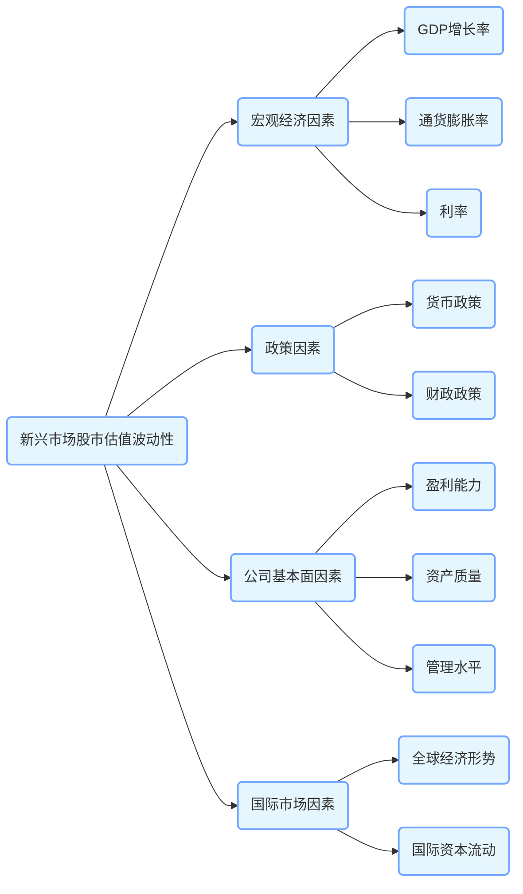

# 新兴市场股市估值的波动性研究

> 关键词：新兴市场、股市估值、波动性、风险分析、经济因素

> 摘要：本文聚焦于新兴市场股市估值的波动性，旨在深入剖析其背后的原理、影响因素及潜在风险。通过对核心概念的阐述、算法原理的分析、数学模型的构建，结合实际案例进行详细解读，探讨新兴市场股市估值波动在不同应用场景下的表现。同时，推荐相关的学习资源、开发工具和研究论文，最后总结新兴市场股市估值波动性的未来发展趋势与挑战，并对常见问题进行解答。

## 1. 背景介绍 
### 1.1 目的和范围
新兴市场在全球经济格局中扮演着日益重要的角色，其股市的发展也备受关注。新兴市场股市估值的波动性不仅影响着投资者的决策，还对金融市场的稳定和经济的发展产生重要影响。本研究的目的在于全面深入地分析新兴市场股市估值波动性的特征、成因和影响，为投资者、政策制定者和研究人员提供有价值的参考。研究范围涵盖了主要的新兴市场国家和地区的股市，包括亚洲、拉丁美洲、非洲等地区的代表性市场。

### 1.2 预期读者
本文预期读者包括金融市场投资者，他们可以通过了解新兴市场股市估值的波动性，优化投资组合，降低风险，提高收益；政策制定者可以根据研究结果制定更加合理的金融政策，维护金融市场的稳定；金融研究人员可以在此基础上进行更深入的学术研究，推动相关领域的理论发展。

### 1.3 文档结构概述
本文首先介绍研究的背景和相关术语，接着阐述新兴市场股市估值波动性的核心概念和联系，分析其核心算法原理和具体操作步骤，构建数学模型并进行详细讲解和举例说明。然后通过项目实战展示代码实际案例并进行详细解释，探讨新兴市场股市估值波动性的实际应用场景。之后推荐相关的工具和资源，总结未来发展趋势与挑战，解答常见问题，并提供扩展阅读和参考资料。

### 1.4 术语表
#### 1.4.1 核心术语定义
- **新兴市场**：指发展中国家或地区的金融市场，通常具有较高的经济增长潜力，但也伴随着较高的风险和不确定性。
- **股市估值**：对股票市场中股票价值的评估，常用的估值指标包括市盈率（P/E）、市净率（P/B）等。
- **波动性**：指股票价格或市场指数在一定时间内的波动程度，通常用标准差、方差等统计指标来衡量。

#### 1.4.2 相关概念解释
- **风险溢价**：投资者因承担风险而要求的额外回报。在新兴市场中，由于风险较高，投资者通常要求更高的风险溢价。
- **市场效率**：指市场价格反映所有可用信息的程度。新兴市场的市场效率相对较低，信息传播和反应速度较慢。

#### 1.4.3 缩略词列表
- **P/E**：市盈率（Price-to-Earnings Ratio）
- **P/B**：市净率（Price-to-Book Ratio）
- **GDP**：国内生产总值（Gross Domestic Product）

## 2. 核心概念与联系 
### 核心概念原理
新兴市场股市估值的波动性受到多种因素的影响，主要包括宏观经济因素、政策因素、公司基本面因素和国际市场因素等。

宏观经济因素如 GDP 增长率、通货膨胀率、利率等会影响企业的盈利水平和市场的资金供求关系，从而对股市估值产生影响。例如，当 GDP 增长率较高时，企业的盈利预期增加，股市估值可能上升；而通货膨胀率上升可能导致利率上升，增加企业的融资成本，降低股市估值。

政策因素包括货币政策、财政政策等。宽松的货币政策会增加市场的流动性，推动股市上涨；而紧缩的货币政策则会减少市场资金，导致股市下跌。财政政策如税收政策、政府支出等也会对企业的盈利和市场信心产生影响。

公司基本面因素如企业的盈利能力、资产质量、管理水平等是决定股市估值的基础。具有良好基本面的企业通常会有较高的估值。

国际市场因素如全球经济形势、国际资本流动等也会对新兴市场股市估值产生影响。当全球经济形势向好时，国际资本可能流入新兴市场，推动股市上涨；而当全球经济形势恶化时，国际资本可能流出新兴市场，导致股市下跌。

### 架构的文本示意图
新兴市场股市估值的波动性是一个复杂的系统，其架构可以用以下文本示意图表示：

```plaintext
新兴市场股市估值波动性
|-- 宏观经济因素
|   |-- GDP 增长率
|   |-- 通货膨胀率
|   |-- 利率
|-- 政策因素
|   |-- 货币政策
|   |-- 财政政策
|-- 公司基本面因素
|   |-- 盈利能力
|   |-- 资产质量
|   |-- 管理水平
|-- 国际市场因素
|   |-- 全球经济形势
|   |-- 国际资本流动
```

### Mermaid 流程图


## 3. 核心算法原理 & 具体操作步骤 
### 算法原理讲解
在研究新兴市场股市估值的波动性时，常用的方法是计算股票价格或市场指数的波动率。一种常见的计算波动率的方法是使用历史波动率，即通过计算过去一段时间内股票价格或市场指数的标准差来估计未来的波动率。

以下是使用 Python 实现计算历史波动率的代码：

```python
import pandas as pd
import numpy as np

def calculate_historical_volatility(data, window=252):
    """
    计算历史波动率
    :param data: 股票价格或市场指数数据，类型为 Pandas Series
    :param window: 计算波动率的时间窗口，默认为 252 天
    :return: 历史波动率，类型为 Pandas Series
    """
    returns = np.log(data / data.shift(1))
    volatility = returns.rolling(window=window).std() * np.sqrt(252)
    return volatility

# 示例数据
data = pd.Series([100, 102, 105, 103, 106, 108, 107, 110, 109, 112])
volatility = calculate_historical_volatility(data)
print(volatility)
```

### 具体操作步骤
1. **数据获取**：从金融数据提供商或数据库中获取新兴市场股票价格或市场指数的历史数据。
2. **数据预处理**：对获取的数据进行清洗和整理，去除缺失值和异常值。
3. **计算收益率**：使用对数收益率公式 $r_t = \ln(\frac{P_t}{P_{t-1}})$ 计算股票价格或市场指数的收益率，其中 $r_t$ 表示第 $t$ 期的收益率，$P_t$ 表示第 $t$ 期的价格。
4. **计算波动率**：使用滚动窗口方法计算收益率的标准差，并乘以 $\sqrt{252}$ 来年化波动率。
5. **结果分析**：分析计算得到的波动率的变化趋势和特征，评估新兴市场股市估值的波动性。

## 4. 数学模型和公式 & 详细讲解 & 举例说明 
### 数学模型和公式
- **对数收益率公式**：
$$r_t = \ln(\frac{P_t}{P_{t-1}})$$
其中 $r_t$ 表示第 $t$ 期的对数收益率，$P_t$ 表示第 $t$ 期的股票价格或市场指数，$P_{t-1}$ 表示第 $t - 1$ 期的股票价格或市场指数。

- **历史波动率公式**：
$$\sigma = \sqrt{\frac{1}{n - 1}\sum_{i = 1}^{n}(r_i - \bar{r})^2} \times \sqrt{T}$$
其中 $\sigma$ 表示历史波动率，$n$ 表示样本数量，$r_i$ 表示第 $i$ 期的收益率，$\bar{r}$ 表示收益率的平均值，$T$ 表示一年的交易日数量，通常取 252 天。

### 详细讲解
对数收益率的优点是具有可加性，即一段时间内的总收益率等于各期收益率之和。在计算波动率时，使用对数收益率可以更好地反映价格的变化情况。

历史波动率是通过计算过去一段时间内收益率的标准差来估计未来的波动率。标准差反映了收益率的离散程度，标准差越大，说明收益率的波动越大，即股市估值的波动性越高。

### 举例说明
假设我们有以下股票价格数据：$P_0 = 100, P_1 = 102, P_2 = 105, P_3 = 103$。

首先计算对数收益率：
$r_1 = \ln(\frac{102}{100}) \approx 0.0198$
$r_2 = \ln(\frac{105}{102}) \approx 0.0291$
$r_3 = \ln(\frac{103}{105}) \approx -0.0192$

然后计算收益率的平均值：
$\bar{r} = \frac{0.0198 + 0.0291 - 0.0192}{3} \approx 0.0099$

接着计算标准差：
$\sqrt{\frac{(0.0198 - 0.0099)^2 + (0.0291 - 0.0099)^2 + (-0.0192 - 0.0099)^2}{3 - 1}} \approx 0.0232$

最后计算年化波动率：
$\sigma = 0.0232 \times \sqrt{252} \approx 0.368$

## 5. 项目实战：代码实际案例和详细解释说明 
### 5.1  开发环境搭建
1. **安装 Python**：从 Python 官方网站（https://www.python.org/downloads/）下载并安装 Python 3.x 版本。
2. **安装必要的库**：使用以下命令安装所需的库：
```sh
pip install pandas numpy matplotlib
```
3. **数据获取**：可以使用金融数据 API 如 Yahoo Finance API 或 Alpha Vantage API 来获取新兴市场股票价格或市场指数的历史数据。

### 5.2  源代码详细实现和代码解读
```python
import pandas as pd
import numpy as np
import matplotlib.pyplot as plt
import yfinance as yf

# 获取新兴市场股票数据
ticker = 'EEM'  # iShares MSCI Emerging Markets ETF
start_date = '2020-01-01'
end_date = '2023-01-01'
data = yf.download(ticker, start=start_date, end=end_date)['Close']

# 计算历史波动率
def calculate_historical_volatility(data, window=252):
    returns = np.log(data / data.shift(1))
    volatility = returns.rolling(window=window).std() * np.sqrt(252)
    return volatility

volatility = calculate_historical_volatility(data)

# 绘制波动率曲线
plt.figure(figsize=(12, 6))
plt.plot(volatility, label='Historical Volatility')
plt.title('Historical Volatility of EEM')
plt.xlabel('Date')
plt.ylabel('Volatility')
plt.legend()
plt.show()
```

### 代码解读与分析
1. **数据获取**：使用 `yfinance` 库从 Yahoo Finance 下载 iShares MSCI Emerging Markets ETF（EEM）的历史收盘价数据。
2. **计算历史波动率**：定义 `calculate_historical_volatility` 函数，使用对数收益率和滚动窗口方法计算历史波动率。
3. **绘制波动率曲线**：使用 `matplotlib` 库绘制历史波动率曲线，直观展示新兴市场股市估值的波动性变化趋势。

通过分析波动率曲线，我们可以观察到新兴市场股市估值的波动性在不同时间段的变化情况。当波动率较高时，说明市场的不确定性较大，投资风险较高；当波动率较低时，说明市场相对稳定，投资风险较低。

## 6. 实际应用场景 
### 投资者决策
投资者可以根据新兴市场股市估值的波动性来调整投资组合。当波动性较高时，投资者可以减少对新兴市场股票的投资，增加对低风险资产如债券、现金的配置；当波动性较低时，投资者可以适当增加对新兴市场股票的投资，以获取更高的收益。

### 风险管理
金融机构可以利用新兴市场股市估值的波动性来进行风险管理。例如，银行可以根据波动性调整贷款的风险定价，保险公司可以根据波动性调整保险费率。

### 政策制定
政策制定者可以根据新兴市场股市估值的波动性来制定宏观经济政策。当波动性过高时，政策制定者可以采取措施稳定市场，如调整货币政策、加强监管等；当波动性过低时，政策制定者可以采取措施促进市场的活跃，如放松管制、鼓励创新等。

## 7. 工具和资源推荐
### 7.1 学习资源推荐
#### 7.1.1 书籍推荐
- 《金融市场与金融机构基础》：介绍了金融市场和金融机构的基本概念和运作机制，对理解新兴市场股市有帮助。
- 《投资学》：系统地阐述了投资的理论和方法，包括资产定价、投资组合管理等内容。
- 《新兴市场投资》：专门探讨新兴市场投资的特点、风险和策略。

#### 7.1.2 在线课程
- Coursera 上的“金融市场”课程：由知名教授授课，涵盖了金融市场的各个方面。
- edX 上的“投资分析与组合管理”课程：深入讲解投资分析和组合管理的理论和实践。

#### 7.1.3 技术博客和网站
- Seeking Alpha：提供全球金融市场的分析和评论，包括新兴市场股市的研究报告。
- Bloomberg：全球知名的金融信息服务提供商，提供实时的金融市场数据和分析。

### 7.2 开发工具框架推荐
#### 7.2.1 IDE和编辑器
- PyCharm：功能强大的 Python 集成开发环境，适合进行数据分析和金融建模。
- Jupyter Notebook：交互式的开发环境，方便进行数据探索和可视化。

#### 7.2.2 调试和性能分析工具
- PDB：Python 自带的调试工具，用于调试 Python 代码。
- cProfile：Python 内置的性能分析工具，用于分析代码的性能瓶颈。

#### 7.2.3 相关框架和库
- Pandas：用于数据处理和分析的 Python 库，提供了高效的数据结构和数据分析工具。
- NumPy：用于科学计算的 Python 库，提供了高性能的数组和矩阵运算功能。
- Matplotlib：用于数据可视化的 Python 库，提供了丰富的绘图功能。

### 7.3 相关论文著作推荐
#### 7.3.1 经典论文
- "The Cross - Section of Expected Stock Returns" by Eugene F. Fama and Kenneth R. French：提出了著名的 Fama - French 三因子模型，对股票收益率的影响因素进行了深入研究。
- "Efficient Capital Markets: A Review of Theory and Empirical Work" by Eugene F. Fama：奠定了有效市场假说的理论基础。

#### 7.3.2 最新研究成果
- 关注顶级金融学术期刊如《Journal of Finance》《Review of Financial Studies》上关于新兴市场股市的最新研究论文。

#### 7.3.3 应用案例分析
- 一些金融机构和研究机构发布的关于新兴市场股市投资的案例分析报告，如国际货币基金组织（IMF）的相关报告。

## 8. 总结：未来发展趋势与挑战
### 未来发展趋势
- **全球化趋势加强**：随着全球经济一体化的深入，新兴市场与全球金融市场的联系将更加紧密，其股市估值的波动性将受到更多国际因素的影响。
- **数字化转型加速**：新兴市场的金融科技发展迅速，数字化交易和金融创新将不断涌现，这将对股市估值的波动性产生新的影响。
- **可持续投资兴起**：投资者对环境、社会和治理（ESG）因素的关注度不断提高，新兴市场的可持续发展表现将影响其股市估值和波动性。

### 挑战
- **信息不对称问题**：新兴市场的信息披露制度相对不完善，投资者面临信息不对称的问题，这增加了投资决策的难度和风险。
- **政策不确定性**：新兴市场的政策环境相对不稳定，政策的变化可能对股市估值产生较大影响，增加了市场的波动性。
- **外部冲击风险**：新兴市场对外部冲击如全球经济衰退、贸易摩擦等更为敏感，这些外部冲击可能导致股市估值的大幅波动。

## 9. 附录：常见问题与解答
### 问题 1：新兴市场股市估值的波动性与发达市场有何不同？
解答：新兴市场股市估值的波动性通常比发达市场更高。这是因为新兴市场的经济发展阶段、市场制度、信息透明度等方面与发达市场存在差异。新兴市场的经济增长速度较快，但也伴随着较高的不确定性；市场制度相对不完善，监管力度较弱；信息透明度较低，投资者获取信息的成本较高。这些因素都导致新兴市场股市估值的波动性较大。

### 问题 2：如何降低新兴市场股市投资的风险？
解答：可以通过以下方法降低新兴市场股市投资的风险：
- **分散投资**：将资金分散投资于不同的新兴市场国家和地区，以及不同行业的股票，以降低单一市场和行业的风险。
- **长期投资**：新兴市场股市的短期波动性较大，但从长期来看，其经济增长潜力较大，长期投资可以平滑短期波动的影响。
- **风险管理工具**：使用期权、期货等风险管理工具来对冲风险。

### 问题 3：新兴市场股市估值的波动性对宏观经济有何影响？
解答：新兴市场股市估值的波动性对宏观经济有重要影响。当股市估值波动性较高时，投资者的信心可能受到打击，导致投资和消费减少，进而影响经济增长。此外，股市的大幅波动还可能引发金融风险，对金融体系的稳定造成威胁。相反，当股市估值波动性较低时，有利于稳定投资者信心，促进投资和消费，推动经济增长。

## 10. 扩展阅读 & 参考资料
### 扩展阅读
- 《金融炼金术》：乔治·索罗斯的著作，探讨了金融市场的运行机制和投资者的心理。
- 《黑天鹅》：纳西姆·尼古拉斯·塔勒布的著作，介绍了不可预测的重大事件对金融市场的影响。

### 参考资料
- 国际货币基金组织（IMF）的相关报告和数据。
- 世界银行的经济发展报告和统计数据。
- 各新兴市场国家和地区的金融监管机构发布的公告和数据。