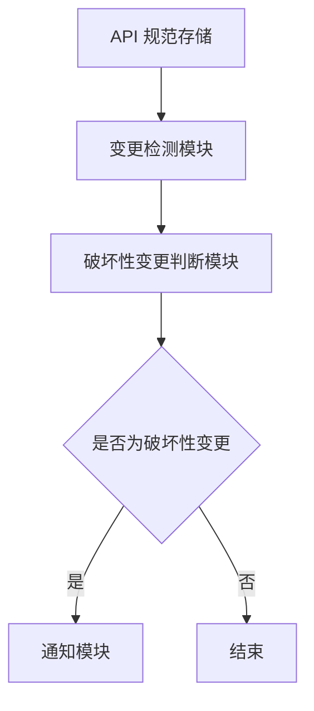

# 智能API破坏性变更检测:维护向后兼容性

> 关键词：智能API、破坏性变更检测、向后兼容性、API 管理、自动化检测

> 摘要：本文围绕智能 API 破坏性变更检测及向后兼容性维护展开。随着软件系统的不断发展和演进，API 的变更不可避免，而破坏性变更可能会对依赖该 API 的客户端造成严重影响。因此，如何有效地检测 API 的破坏性变更并维护其向后兼容性成为了关键问题。文章将深入探讨 API 破坏性变更的相关核心概念，介绍检测的核心算法原理和具体操作步骤，通过数学模型和公式进行理论阐述，并结合项目实战案例详细解释实现过程。同时，分析实际应用场景，推荐相关的工具和资源，最后总结未来发展趋势与挑战，为开发者和技术管理者提供全面的技术指导和参考。

## 1. 背景介绍 

### 1.1 目的和范围
在当今的软件开发中，API（Application Programming Interface，应用程序编程接口）作为不同软件组件之间交互的桥梁，起着至关重要的作用。随着业务的发展和技术的进步，API 不可避免地需要进行更新和维护。然而，API 的变更可能会对依赖它的客户端应用程序产生影响，其中破坏性变更更是可能导致客户端应用程序无法正常工作。本文章的目的在于深入探讨智能 API 破坏性变更检测的技术和方法，以确保在 API 变更过程中能够有效地维护其向后兼容性，降低对客户端的影响。范围涵盖了 API 破坏性变更的定义、检测算法、实际应用场景以及相关工具和资源的介绍等方面。

### 1.2 预期读者
本文预期读者包括软件开发工程师、API 开发者、软件架构师、技术管理者以及对 API 管理和兼容性维护感兴趣的技术爱好者。这些读者可能在日常工作中涉及到 API 的开发、维护和管理，需要了解如何检测和处理 API 的破坏性变更，以确保软件系统的稳定性和可靠性。

### 1.3 文档结构概述
本文将按照以下结构进行组织：首先介绍 API 破坏性变更检测及向后兼容性维护的背景知识，包括目的、预期读者和文档结构概述等；接着阐述相关的核心概念与联系，通过文本示意图和 Mermaid 流程图进行直观展示；然后详细讲解核心算法原理和具体操作步骤，并使用 Python 源代码进行说明；再通过数学模型和公式对检测过程进行理论分析，并举例说明；之后通过项目实战案例，介绍开发环境搭建、源代码实现和代码解读；分析实际应用场景；推荐相关的工具和资源；最后总结未来发展趋势与挑战，提供常见问题与解答以及扩展阅读和参考资料。

### 1.4 术语表
#### 1.4.1 核心术语定义
- **API（Application Programming Interface）**：应用程序编程接口，是一组定义、协议和工具，用于构建软件和应用程序。它允许不同的软件组件之间进行交互和通信。
- **破坏性变更（Breaking Change）**：指对 API 的更改，可能会导致依赖该 API 的客户端应用程序无法正常工作。例如，删除 API 中的某个方法、更改方法的参数或返回值类型等。
- **向后兼容性（Backward Compatibility）**：指在对 API 进行更新时，确保现有的客户端应用程序仍然可以正常使用该 API。即使 API 发生了一些变化，客户端应用程序也不需要进行重大修改。
- **API 规范（API Specification）**：描述 API 的详细信息，包括 API 的接口定义、参数、返回值、错误处理等。常见的 API 规范有 OpenAPI 规范等。

#### 1.4.2 相关概念解释
- **契约式设计（Design by Contract）**：一种软件设计方法，强调在软件组件之间定义明确的契约，包括前置条件、后置条件和不变式。在 API 设计中，契约式设计可以帮助确保 API 的使用者和提供者之间的行为一致性。
- **语义版本控制（Semantic Versioning）**：一种版本编号方案，用于表示软件版本的变更情况。版本号通常由三个部分组成：主版本号、次版本号和修订号。主版本号的变更通常表示有破坏性变更，次版本号的变更表示有向后兼容的新功能添加，修订号的变更表示有向后兼容的 bug 修复。

#### 1.4.3 缩略词列表
- **API**：Application Programming Interface
- **OAS**：OpenAPI Specification

## 2. 核心概念与联系 

### 核心概念原理
API 的破坏性变更检测主要基于对 API 规范的分析和比较。API 规范通常以某种标准格式（如 OpenAPI 规范）进行描述，其中包含了 API 的接口定义、参数、返回值等详细信息。通过比较不同版本的 API 规范，可以检测出其中的变更，并判断这些变更是否为破坏性变更。

例如，在 OpenAPI 规范中，一个简单的 API 接口可能定义如下：

```yaml
openapi: 3.0.0
info:
  title: Sample API
  version: 1.0.0
paths:
  /users:
    get:
      summary: Get a list of users
      responses:
        '200':
          description: A list of users
          content:
            application/json:
              schema:
                type: array
                items:
                  type: object
                  properties:
                    id:
                      type: integer
                    name:
                      type: string
```

如果在后续版本中，将 `name` 属性的类型从 `string` 改为 `number`，这就可能是一个破坏性变更，因为依赖该 API 的客户端应用程序可能会期望 `name` 是一个字符串类型。

### 架构的文本示意图
以下是一个简单的 API 破坏性变更检测架构的文本示意图：

1. **API 规范存储**：存储不同版本的 API 规范，例如使用版本控制系统（如 Git）或专门的 API 管理平台。
2. **变更检测模块**：从 API 规范存储中获取不同版本的 API 规范，进行比较和分析，检测其中的变更。
3. **破坏性变更判断模块**：根据预设的规则，判断检测到的变更是否为破坏性变更。
4. **通知模块**：如果检测到破坏性变更，通知相关的开发人员和利益相关者。

### Mermaid 流程图


## 3. 核心算法原理 & 具体操作步骤 

### 核心算法原理
API 破坏性变更检测的核心算法主要基于对 API 规范的解析和比较。具体步骤如下：

1. **解析 API 规范**：将不同版本的 API 规范解析为内部数据结构，以便进行比较。例如，对于 OpenAPI 规范，可以使用相关的解析库将其解析为 JSON 或 Python 对象。
2. **比较 API 规范**：对解析后的 API 规范进行逐元素比较，找出其中的变更。比较的元素包括 API 的路径、方法、参数、返回值等。
3. **判断变更是否为破坏性变更**：根据预设的规则，判断检测到的变更是否为破坏性变更。例如，删除 API 的路径、方法或参数，更改参数的类型或返回值的类型等通常被认为是破坏性变更。

### 具体操作步骤
以下是使用 Python 实现 API 破坏性变更检测的具体操作步骤：

1. **安装必要的库**：使用 `openapi-schema-validator` 库来解析和验证 OpenAPI 规范。
```bash
pip install openapi-schema-validator
```

2. **解析 API 规范**：使用 `openapi-schema-validator` 库解析 OpenAPI 规范。
```python
from openapi_schema_validator import OAS30Validator

def parse_openapi_spec(spec):
    validator = OAS30Validator(spec)
    if validator.is_valid(spec):
        return spec
    else:
        raise ValueError("Invalid OpenAPI specification")
```

3. **比较 API 规范**：比较两个 API 规范，找出其中的变更。
```python
def compare_api_specs(old_spec, new_spec):
    changes = []
    # 比较路径
    old_paths = set(old_spec.get('paths', {}).keys())
    new_paths = set(new_spec.get('paths', {}).keys())
    removed_paths = old_paths - new_paths
    added_paths = new_paths - old_paths
    for path in removed_paths:
        changes.append(f"Removed path: {path}")
    for path in added_paths:
        changes.append(f"Added path: {path}")
    # 比较方法和参数
    common_paths = old_paths.intersection(new_paths)
    for path in common_paths:
        old_path_spec = old_spec['paths'][path]
        new_path_spec = new_spec['paths'][path]
        old_methods = set(old_path_spec.keys())
        new_methods = set(new_path_spec.keys())
        removed_methods = old_methods - new_methods
        added_methods = new_methods - old_methods
        for method in removed_methods:
            changes.append(f"Removed method: {method} on path {path}")
        for method in added_methods:
            changes.append(f"Added method: {method} on path {path}")
        common_methods = old_methods.intersection(new_methods)
        for method in common_methods:
            old_method_spec = old_path_spec[method]
            new_method_spec = new_path_spec[method]
            old_params = set([param['name'] for param in old_method_spec.get('parameters', [])])
            new_params = set([param['name'] for param in new_method_spec.get('parameters', [])])
            removed_params = old_params - new_params
            added_params = new_params - old_params
            for param in removed_params:
                changes.append(f"Removed parameter: {param} for method {method} on path {path}")
            for param in added_params:
                changes.append(f"Added parameter: {param} for method {method} on path {path}")
    return changes
```

4. **判断变更是否为破坏性变更**：根据预设的规则，判断检测到的变更是否为破坏性变更。
```python
def is_breaking_change(changes):
    for change in changes:
        if "Removed" in change:
            return True
    return False
```

### 示例代码调用
```python
old_spec = {
    "openapi": "3.0.0",
    "info": {
        "title": "Sample API",
        "version": "1.0.0"
    },
    "paths": {
        "/users": {
            "get": {
                "summary": "Get a list of users",
                "parameters": [
                    {
                        "name": "limit",
                        "in": "query",
                        "schema": {
                            "type": "integer"
                        }
                    }
                ],
                "responses": {
                    "200": {
                        "description": "A list of users",
                        "content": {
                            "application/json": {
                                "schema": {
                                    "type": "array",
                                    "items": {
                                        "type": "object",
                                        "properties": {
                                            "id": {
                                                "type": "integer"
                                            },
                                            "name": {
                                                "type": "string"
                                            }
                                        }
                                    }
                                }
                            }
                        }
                    }
                }
            }
        }
    }
}

new_spec = {
    "openapi": "3.0.0",
    "info": {
        "title": "Sample API",
        "version": "1.1.0"
    },
    "paths": {
        "/users": {
            "get": {
                "summary": "Get a list of users",
                "responses": {
                    "200": {
                        "description": "A list of users",
                        "content": {
                            "application/json": {
                                "schema": {
                                    "type": "array",
                                    "items": {
                                        "type": "object",
                                        "properties": {
                                            "id": {
                                                "type": "integer"
                                            },
                                            "name": {
                                                "type": "string"
                                            }
                                        }
                                    }
                                }
                            }
                        }
                    }
                }
            }
        }
    }
}

parsed_old_spec = parse_openapi_spec(old_spec)
parsed_new_spec = parse_openapi_spec(new_spec)
changes = compare_api_specs(parsed_old_spec, parsed_new_spec)
breaking_change = is_breaking_change(changes)
print("Changes:", changes)
print("Is breaking change:", breaking_change)
```

## 4. 数学模型和公式 & 详细讲解 & 举例说明 

### 数学模型和公式
为了更准确地描述 API 破坏性变更检测的过程，我们可以使用集合论和逻辑运算来建立数学模型。

设 $S_1$ 和 $S_2$ 分别表示两个不同版本的 API 规范。我们可以将 API 规范看作是一个由多个元素组成的集合，每个元素表示 API 的一个属性，如路径、方法、参数等。

- **路径集合**：设 $P_1$ 和 $P_2$ 分别表示 $S_1$ 和 $S_2$ 中的路径集合。
- **方法集合**：对于每个路径 $p \in P_1 \cap P_2$，设 $M_1(p)$ 和 $M_2(p)$ 分别表示 $S_1$ 和 $S_2$ 中该路径下的方法集合。
- **参数集合**：对于每个方法 $m \in M_1(p) \cap M_2(p)$，设 $A_1(p, m)$ 和 $A_2(p, m)$ 分别表示 $S_1$ 和 $S_2$ 中该方法的参数集合。

**破坏性变更判断公式**：
1. **路径变更**：如果 $P_1 - P_2 \neq \varnothing$，则存在路径删除的破坏性变更。
2. **方法变更**：对于某个路径 $p \in P_1 \cap P_2$，如果 $M_1(p) - M_2(p) \neq \varnothing$，则存在该路径下方法删除的破坏性变更。
3. **参数变更**：对于某个路径 $p \in P_1 \cap P_2$ 和方法 $m \in M_1(p) \cap M_2(p)$，如果 $A_1(p, m) - A_2(p, m) \neq \varnothing$，则存在该方法下参数删除的破坏性变更。

### 详细讲解
上述数学模型通过集合的差运算来判断是否存在破坏性变更。具体来说：

- **路径删除**：如果旧版本的 API 规范中存在某个路径，而新版本中不存在该路径，即 $P_1 - P_2 \neq \varnothing$，则说明删除了一个路径，这通常是一个破坏性变更，因为依赖该路径的客户端应用程序将无法正常访问。
- **方法删除**：对于某个共同的路径，如果旧版本中存在某个方法，而新版本中不存在该方法，即 $M_1(p) - M_2(p) \neq \varnothing$，则说明删除了一个方法，这也可能是一个破坏性变更，因为客户端应用程序可能会调用该方法。
- **参数删除**：对于某个共同的路径和方法，如果旧版本中存在某个参数，而新版本中不存在该参数，即 $A_1(p, m) - A_2(p, m) \neq \varnothing$，则说明删除了一个参数，这同样可能导致客户端应用程序无法正常工作。

### 举例说明
假设我们有两个版本的 API 规范：

**旧版本 API 规范**：
- 路径集合 $P_1 = \{"/users", "/orders"\}$
- 对于路径 $"/users"$，方法集合 $M_1("/users") = \{"get", "post"\}$，对于方法 $get$，参数集合 $A_1("/users", "get") = \{"limit"\}$
- 对于路径 $"/orders"$，方法集合 $M_1("/orders") = \{"get"\}$

**新版本 API 规范**：
- 路径集合 $P_2 = \{"/users"\}$
- 对于路径 $"/users"$，方法集合 $M_2("/users") = \{"get"\}$，对于方法 $get$，参数集合 $A_2("/users", "get") = \{\}$

1. **路径变更**：$P_1 - P_2 = \{"/orders"\} \neq \varnothing$，说明删除了路径 $"/orders"$，这是一个破坏性变更。
2. **方法变更**：对于路径 $"/users"$，$M_1("/users") - M_2("/users") = \{"post"\} \neq \varnothing$，说明删除了方法 $post$，这也是一个破坏性变更。
3. **参数变更**：对于路径 $"/users"$ 和方法 $get$，$A_1("/users", "get") - A_2("/users", "get") = \{"limit"\} \neq \varnothing$，说明删除了参数 $limit$，这同样是一个破坏性变更。

## 5. 项目实战：代码实际案例和详细解释说明 

### 5.1  开发环境搭建
为了实现 API 破坏性变更检测的项目，我们需要搭建以下开发环境：

1. **Python 环境**：确保已经安装了 Python 3.x 版本。可以从 Python 官方网站（https://www.python.org/downloads/） 下载并安装。
2. **依赖库安装**：使用 `pip` 安装必要的依赖库，如 `openapi-schema-validator` 用于解析和验证 OpenAPI 规范。
```bash
pip install openapi-schema-validator
```
3. **版本控制系统**：推荐使用 Git 作为版本控制系统，用于管理 API 规范的不同版本。可以从 Git 官方网站（https://git-scm.com/downloads） 下载并安装。

### 5.2  源代码详细实现和代码解读
以下是一个完整的 API 破坏性变更检测的 Python 代码示例：

```python
from openapi_schema_validator import OAS30Validator

def parse_openapi_spec(spec):
    """
    解析 OpenAPI 规范
    :param spec: OpenAPI 规范的字典表示
    :return: 解析后的 OpenAPI 规范
    """
    validator = OAS30Validator(spec)
    if validator.is_valid(spec):
        return spec
    else:
        raise ValueError("Invalid OpenAPI specification")

def compare_api_specs(old_spec, new_spec):
    """
    比较两个 OpenAPI 规范，找出其中的变更
    :param old_spec: 旧版本的 OpenAPI 规范
    :param new_spec: 新版本的 OpenAPI 规范
    :return: 变更列表
    """
    changes = []
    # 比较路径
    old_paths = set(old_spec.get('paths', {}).keys())
    new_paths = set(new_spec.get('paths', {}).keys())
    removed_paths = old_paths - new_paths
    added_paths = new_paths - old_paths
    for path in removed_paths:
        changes.append(f"Removed path: {path}")
    for path in added_paths:
        changes.append(f"Added path: {path}")
    # 比较方法和参数
    common_paths = old_paths.intersection(new_paths)
    for path in common_paths:
        old_path_spec = old_spec['paths'][path]
        new_path_spec = new_spec['paths'][path]
        old_methods = set(old_path_spec.keys())
        new_methods = set(new_path_spec.keys())
        removed_methods = old_methods - new_methods
        added_methods = new_methods - old_methods
        for method in removed_methods:
            changes.append(f"Removed method: {method} on path {path}")
        for method in added_methods:
            changes.append(f"Added method: {method} on path {path}")
        common_methods = old_methods.intersection(new_methods)
        for method in common_methods:
            old_method_spec = old_path_spec[method]
            new_method_spec = new_path_spec[method]
            old_params = set([param['name'] for param in old_method_spec.get('parameters', [])])
            new_params = set([param['name'] for param in new_method_spec.get('parameters', [])])
            removed_params = old_params - new_params
            added_params = new_params - old_params
            for param in removed_params:
                changes.append(f"Removed parameter: {param} for method {method} on path {path}")
            for param in added_params:
                changes.append(f"Added parameter: {param} for method {method} on path {path}")
    return changes

def is_breaking_change(changes):
    """
    判断变更是否为破坏性变更
    :param changes: 变更列表
    :return: 是否为破坏性变更
    """
    for change in changes:
        if "Removed" in change:
            return True
    return False

if __name__ == "__main__":
    # 示例旧版本 API 规范
    old_spec = {
        "openapi": "3.0.0",
        "info": {
            "title": "Sample API",
            "version": "1.0.0"
        },
        "paths": {
            "/users": {
                "get": {
                    "summary": "Get a list of users",
                    "parameters": [
                        {
                            "name": "limit",
                            "in": "query",
                            "schema": {
                                "type": "integer"
                            }
                        }
                    ],
                    "responses": {
                        "200": {
                            "description": "A list of users",
                            "content": {
                                "application/json": {
                                    "schema": {
                                        "type": "array",
                                        "items": {
                                            "type": "object",
                                            "properties": {
                                                "id": {
                                                    "type": "integer"
                                                },
                                                "name": {
                                                    "type": "string"
                                                }
                                            }
                                        }
                                    }
                                }
                            }
                        }
                    }
                }
            }
        }
    }

    # 示例新版本 API 规范
    new_spec = {
        "openapi": "3.0.0",
        "info": {
            "title": "Sample API",
            "version": "1.1.0"
        },
        "paths": {
            "/users": {
                "get": {
                    "summary": "Get a list of users",
                    "responses": {
                        "200": {
                            "description": "A list of users",
                            "content": {
                                "application/json": {
                                    "schema": {
                                        "type": "array",
                                        "items": {
                                            "type": "object",
                                            "properties": {
                                                "id": {
                                                    "type": "integer"
                                                },
                                                "name": {
                                                    "type": "string"
                                                }
                                            }
                                        }
                                    }
                                }
                            }
                        }
                    }
                }
            }
        }
    }

    try:
        parsed_old_spec = parse_openapi_spec(old_spec)
        parsed_new_spec = parse_openapi_spec(new_spec)
        changes = compare_api_specs(parsed_old_spec, parsed_new_spec)
        breaking_change = is_breaking_change(changes)
        print("Changes:", changes)
        print("Is breaking change:", breaking_change)
    except ValueError as e:
        print(f"Error: {e}")
```

### 代码解读与分析
1. **`parse_openapi_spec` 函数**：该函数用于解析 OpenAPI 规范，并使用 `OAS30Validator` 进行验证。如果规范无效，则抛出 `ValueError` 异常。
2. **`compare_api_specs` 函数**：该函数比较两个 OpenAPI 规范，找出其中的变更。具体步骤包括比较路径、方法和参数，记录删除和添加的元素。
3. **`is_breaking_change` 函数**：该函数判断变更是否为破坏性变更。如果变更列表中包含删除操作，则认为是破坏性变更。
4. **主程序**：定义了示例的旧版本和新版本 API 规范，调用上述函数进行解析、比较和判断，并输出结果。

## 6. 实际应用场景 
API 破坏性变更检测在以下实际应用场景中具有重要作用：

1. **微服务架构**：在微服务架构中，各个微服务之间通过 API 进行通信。当某个微服务的 API 发生变更时，可能会影响到依赖该 API 的其他微服务。通过智能 API 破坏性变更检测，可以及时发现并处理这些变更，确保微服务系统的稳定性。
2. **第三方集成**：许多软件系统会集成第三方的 API，如支付接口、社交媒体接口等。当第三方 API 发生变更时，可能会导致集成的软件系统出现问题。通过检测 API 的破坏性变更，可以提前做好兼容性处理，避免系统故障。
3. **开源项目**：在开源项目中，API 的变更可能会影响到大量的开发者和用户。通过实施 API 破坏性变更检测，可以确保 API 的更新是向后兼容的，减少对社区的影响。
4. **企业内部系统**：企业内部的不同部门或团队可能会开发和使用不同的 API。当 API 发生变更时，可能会影响到其他部门或团队的业务。通过检测 API 的破坏性变更，可以协调各方利益，确保企业内部系统的正常运行。

## 7. 工具和资源推荐
### 7.1 学习资源推荐
#### 7.1.1 书籍推荐
- 《RESTful Web APIs》：这本书详细介绍了 RESTful API 的设计和实现，包括 API 版本控制和兼容性维护等方面的内容。
- 《API Design Patterns》：提供了 API 设计的最佳实践和模式，有助于理解如何设计出具有良好兼容性的 API。

#### 7.1.2 在线课程
- Coursera 上的 “API Design and Development Specialization”：该课程涵盖了 API 设计、开发和管理的各个方面，包括 API 版本控制和兼容性处理。
- Udemy 上的 “REST API Development with Python and Flask”：通过实际项目介绍了如何使用 Python 和 Flask 开发 RESTful API，并处理 API 的变更。

#### 7.1.3 技术博客和网站
- API Evangelist（https://apievangelist.com/）：提供了丰富的 API 相关资讯和技术文章，包括 API 版本控制和兼容性维护的最佳实践。
- OpenAPI Initiative（https://www.openapis.org/）：官方网站提供了 OpenAPI 规范的详细文档和相关资源，有助于深入理解 API 规范和设计。

### 7.2 开发工具框架推荐
#### 7.2.1 IDE和编辑器
- PyCharm：一款功能强大的 Python 集成开发环境，提供了代码编辑、调试、版本控制等功能，适合开发 API 破坏性变更检测工具。
- Visual Studio Code：轻量级的代码编辑器，支持多种编程语言和插件扩展，可用于快速开发和调试 API 相关代码。

#### 7.2.2 调试和性能分析工具
- Postman：一款流行的 API 开发和调试工具，可以方便地测试 API 的功能和性能，同时支持导入和导出 OpenAPI 规范。
- Swagger UI：基于 OpenAPI 规范的可视化工具，可以直观地展示 API 的接口定义和文档，方便开发人员进行调试和测试。

#### 7.2.3 相关框架和库
- Flask：一个轻量级的 Python Web 框架，可用于快速开发 RESTful API。
- Django REST framework：基于 Django 框架的 RESTful API 开发框架，提供了丰富的功能和工具，如序列化、权限认证等。

### 7.3 相关论文著作推荐
#### 7.3.1 经典论文
- “Designing Evolvable Web APIs with Versioning”：该论文探讨了如何设计可演进的 Web API，并通过版本控制来维护 API 的兼容性。
- “API Versioning: A Best Practice Guide”：介绍了 API 版本控制的最佳实践和方法，对理解 API 破坏性变更检测有重要参考价值。

#### 7.3.2 最新研究成果
- 关注 ACM SIGSOFT（https://sigsoft.org/） 等学术会议和期刊，获取最新的 API 设计和管理领域的研究成果。

#### 7.3.3 应用案例分析
- 许多大型互联网公司（如 Google、Facebook 等）会分享他们在 API 设计和管理方面的经验和案例，可以通过搜索相关技术博客和文章获取。

## 8. 总结：未来发展趋势与挑战
### 未来发展趋势
1. **自动化检测技术的发展**：随着人工智能和机器学习技术的不断发展，未来的 API 破坏性变更检测将更加自动化和智能化。例如，利用自然语言处理技术自动分析 API 文档的变更，利用机器学习算法预测变更对客户端的影响。
2. **与 DevOps 流程的深度融合**：API 破坏性变更检测将成为 DevOps 流程中的重要环节，实现自动化的持续集成和持续部署。在代码提交、构建和部署过程中自动检测 API 的变更，并及时通知相关人员。
3. **跨语言和跨平台的兼容性检测**：随着软件系统的多元化和分布式化，未来的 API 破坏性变更检测需要支持跨语言和跨平台的兼容性检测，确保不同技术栈之间的 API 交互正常。
4. **生态系统的完善**：将会出现更多的 API 管理平台和工具，形成完善的 API 生态系统。这些平台和工具将提供一站式的 API 设计、开发、测试、部署和管理服务，包括 API 破坏性变更检测功能。

### 挑战
1. **复杂 API 规范的处理**：随着 API 功能的不断增强和复杂化，API 规范也变得越来越复杂。如何准确地解析和比较复杂的 API 规范，是 API 破坏性变更检测面临的一大挑战。
2. **语义层面的变更检测**：目前的 API 破坏性变更检测主要基于语法层面的比较，对于语义层面的变更检测还存在不足。例如，虽然 API 的参数和返回值类型没有变化，但方法的功能发生了改变，这种语义层面的变更难以通过现有的方法进行检测。
3. **客户端兼容性的不确定性**：由于客户端应用程序的多样性和复杂性，很难准确预测 API 变更对所有客户端的影响。有些客户端可能对 API 变更有一定的容错能力，而有些客户端则可能非常敏感。
4. **团队协作和沟通问题**：在 API 变更过程中，需要不同团队和角色之间进行有效的协作和沟通。如果沟通不畅，可能会导致对 API 变更的理解不一致，从而影响 API 的向后兼容性。

## 9. 附录：常见问题与解答
### 1. 什么是 API 的破坏性变更？
API 的破坏性变更是指对 API 的更改，可能会导致依赖该 API 的客户端应用程序无法正常工作。例如，删除 API 中的某个方法、更改方法的参数或返回值类型等。

### 2. 为什么要进行 API 破坏性变更检测？
进行 API 破坏性变更检测可以帮助开发者及时发现 API 变更中可能存在的问题，确保 API 的更新是向后兼容的，降低对客户端应用程序的影响，提高软件系统的稳定性和可靠性。

### 3. 如何判断一个变更是否为破坏性变更？
一般来说，删除 API 的路径、方法或参数，更改参数的类型或返回值的类型等通常被认为是破坏性变更。但具体的判断规则可能因项目和业务需求而异。

### 4. 如何处理 API 的破坏性变更？
处理 API 的破坏性变更可以采用以下方法：
- **版本控制**：通过语义版本控制，明确标识 API 的不同版本，让客户端应用程序可以选择合适的版本进行调用。
- **提供迁移指南**：为客户端应用程序提供详细的迁移指南，帮助它们尽快适应 API 的变更。
- **逐步淘汰旧版本**：在适当的时候，逐步淘汰旧版本的 API，鼓励客户端应用程序迁移到新版本。

### 5. API 破坏性变更检测工具可以检测所有的破坏性变更吗？
目前的 API 破坏性变更检测工具主要基于语法层面的比较，对于语义层面的变更检测还存在一定的局限性。因此，不能保证检测到所有的破坏性变更，还需要开发者进行人工审查和测试。

## 10. 扩展阅读 & 参考资料
1. 《OpenAPI Specification》：https://github.com/OAI/OpenAPI-Specification
2. 《RESTful API 设计最佳实践》：https://www.baeldung.com/restful-api-design-best-practices
3. 《API Versioning Strategies》：https://nordicapis.com/10-api-versioning-strategies/
4. 《Python 官方文档》：https://docs.python.org/3/
5. 《Flask 官方文档》：https://flask.palletsprojects.com/
6. 《Django REST framework 官方文档》：https://www.django-rest-framework.org/
7. 《Postman 官方文档》：https://learning.postman.com/
8. 《Swagger UI 官方文档》：https://swagger.io/tools/swagger-ui/