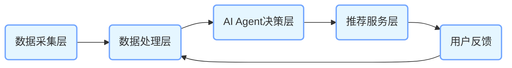

# 智能书架：AI Agent的阅读兴趣拓展系统

> 关键词：智能书架、AI Agent、阅读兴趣拓展、推荐系统、自然语言处理、机器学习、数据挖掘

> 摘要：本文围绕智能书架这一创新概念，详细阐述了基于AI Agent的阅读兴趣拓展系统。通过深入探讨该系统的背景、核心概念、算法原理、数学模型等方面，展示了其如何利用先进的人工智能技术实现对用户阅读兴趣的精准把握和有效拓展。同时，结合项目实战案例，介绍了系统的开发与实现过程，分析了其实际应用场景，并推荐了相关的学习资源、开发工具和论文著作。最后，对智能书架系统的未来发展趋势与挑战进行了总结和展望，为该领域的进一步研究和实践提供了全面而深入的参考。

## 1. 背景介绍 
### 1.1 目的和范围
随着信息时代的发展，人们面临着海量的阅读资源，如何在其中快速找到符合自己兴趣的书籍成为了一个挑战。智能书架：AI Agent的阅读兴趣拓展系统旨在解决这一问题，通过利用人工智能技术，深入分析用户的阅读行为和偏好，为用户推荐更符合其兴趣的书籍，从而拓展用户的阅读视野，提高阅读体验。本系统的范围涵盖了从用户阅读数据的收集、处理，到基于AI Agent的推荐算法的实现，以及最终为用户提供个性化的阅读推荐服务。

### 1.2 预期读者
本文的预期读者包括对人工智能技术在阅读领域应用感兴趣的研究人员、开发者，以及关注阅读体验提升和智能图书管理的图书馆员、书店经营者等。同时，对于普通读者来说，了解智能书架系统的原理和功能也有助于他们更好地利用相关服务，发现更多有趣的书籍。

### 1.3 文档结构概述
本文将首先介绍智能书架系统的背景知识，包括目的、预期读者和文档结构概述等。接着，详细阐述系统的核心概念与联系，包括相关原理和架构。然后，讲解核心算法原理及具体操作步骤，并给出数学模型和公式进行详细说明。之后，通过项目实战案例展示系统的实际开发与实现过程，包括开发环境搭建、源代码详细实现和代码解读。再分析系统的实际应用场景，推荐相关的工具和资源。最后，总结系统的未来发展趋势与挑战，提供常见问题与解答，并列出扩展阅读和参考资料。

### 1.4 术语表
#### 1.4.1 核心术语定义
- **智能书架**：一种利用人工智能技术实现对书籍管理和推荐的系统，通过分析用户的阅读行为和偏好，为用户提供个性化的阅读服务。
- **AI Agent**：人工智能代理，是一种能够感知环境、自主决策并采取行动的智能实体，在本系统中用于处理用户阅读数据和进行推荐决策。
- **阅读兴趣拓展**：通过分析用户已有的阅读兴趣，为用户推荐相关但不同类型的书籍，帮助用户发现新的阅读领域，扩大阅读范围。
- **推荐系统**：一种信息过滤系统，根据用户的历史行为、偏好等信息，为用户推荐可能感兴趣的物品或服务，在本系统中用于推荐书籍。

#### 1.4.2 相关概念解释
- **自然语言处理（NLP）**：是人工智能的一个重要领域，主要研究如何让计算机理解和处理人类语言。在智能书架系统中，NLP技术可用于分析书籍的文本内容，提取关键词和主题信息，以便更好地理解书籍的语义和用户的阅读需求。
- **机器学习（ML）**：是一门多领域交叉学科，涉及概率论、统计学、逼近论、凸分析、算法复杂度理论等多门学科。它专门研究计算机怎样模拟或实现人类的学习行为，以获取新的知识或技能，重新组织已有的知识结构使之不断改善自身的性能。在本系统中，机器学习算法可用于对用户阅读数据进行建模和分析，预测用户的阅读兴趣。
- **数据挖掘**：是指从大量的数据中通过算法搜索隐藏于其中信息的过程。在智能书架系统中，数据挖掘技术可用于从用户的阅读记录、书籍信息等数据中发现有价值的模式和规律，为推荐系统提供支持。

#### 1.4.3 缩略词列表
- **NLP**：自然语言处理（Natural Language Processing）
- **ML**：机器学习（Machine Learning）
- **AI**：人工智能（Artificial Intelligence）

## 2. 核心概念与联系 
### 核心概念原理
智能书架：AI Agent的阅读兴趣拓展系统主要基于以下几个核心概念：
- **用户画像**：通过收集用户的阅读历史、评分、收藏等行为数据，构建用户的阅读画像，包括用户的阅读偏好、兴趣领域、阅读习惯等信息。用户画像可以帮助系统更好地理解用户的需求，为个性化推荐提供依据。
- **书籍特征提取**：对书籍的文本内容、作者、出版社、分类等信息进行提取和分析，将书籍转化为计算机可以处理的特征向量。这些特征向量可以反映书籍的主题、风格、内容等方面的信息，用于计算书籍之间的相似度和推荐合适的书籍给用户。
- **AI Agent决策**：AI Agent根据用户画像和书籍特征，运用机器学习和推荐算法，进行决策和推理，为用户推荐符合其兴趣的书籍。AI Agent可以不断学习和优化推荐策略，以提高推荐的准确性和有效性。

### 架构的文本示意图
智能书架系统的架构主要包括数据采集层、数据处理层、AI Agent决策层和推荐服务层。
- **数据采集层**：负责收集用户的阅读行为数据和书籍的相关信息，包括用户的阅读记录、评分、收藏，书籍的文本内容、作者、出版社等。
- **数据处理层**：对采集到的数据进行清洗、预处理和特征提取，将数据转化为适合机器学习算法处理的格式。例如，对书籍的文本内容进行分词、词性标注、命名实体识别等处理，提取关键词和主题信息。
- **AI Agent决策层**：基于处理后的数据，AI Agent运用机器学习和推荐算法进行决策和推理，生成推荐列表。例如，使用协同过滤算法、内容推荐算法等计算用户之间的相似度和书籍之间的相似度，为用户推荐可能感兴趣的书籍。
- **推荐服务层**：将生成的推荐列表呈现给用户，提供个性化的阅读推荐服务。同时，收集用户对推荐结果的反馈信息，用于优化推荐算法和用户画像。

### Mermaid 流程图


## 3. 核心算法原理 & 具体操作步骤 
### 协同过滤算法原理
协同过滤算法是推荐系统中常用的算法之一，主要基于用户之间的相似度或物品之间的相似度进行推荐。分为用户协同过滤和物品协同过滤两种类型。
- **用户协同过滤**：通过计算用户之间的相似度，找到与目标用户兴趣相似的其他用户，然后将这些相似用户喜欢的书籍推荐给目标用户。
- **物品协同过滤**：通过计算物品之间的相似度，找到与目标用户已阅读书籍相似的其他书籍，然后将这些相似书籍推荐给目标用户。

### Python 代码实现用户协同过滤算法
```python
import numpy as np

# 定义用户-书籍评分矩阵
ratings = np.array([
    [5, 3, 0, 1],
    [4, 0, 0, 1],
    [1, 1, 0, 5],
    [1, 0, 0, 4],
    [0, 1, 5, 4]
])

# 计算用户之间的相似度（使用余弦相似度）
def cosine_similarity(user1, user2):
    dot_product = np.dot(user1, user2)
    norm_user1 = np.linalg.norm(user1)
    norm_user2 = np.linalg.norm(user2)
    if norm_user1 == 0 or norm_user2 == 0:
        return 0
    else:
        return dot_product / (norm_user1 * norm_user2)

# 计算所有用户之间的相似度矩阵
num_users = ratings.shape[0]
similarity_matrix = np.zeros((num_users, num_users))
for i in range(num_users):
    for j in range(num_users):
        similarity_matrix[i][j] = cosine_similarity(ratings[i], ratings[j])

# 为目标用户推荐书籍
target_user = 0
top_k_similar_users = 2
k_similar_users = np.argsort(similarity_matrix[target_user])[::-1][1:top_k_similar_users + 1]

# 计算推荐书籍的评分
recommended_ratings = np.zeros(ratings.shape[1])
for similar_user in k_similar_users:
    weight = similarity_matrix[target_user][similar_user]
    recommended_ratings += weight * ratings[similar_user]

# 过滤掉目标用户已经阅读过的书籍
recommended_ratings[ratings[target_user] > 0] = 0

# 选择评分最高的书籍作为推荐
top_n_recommendations = 2
recommended_books = np.argsort(recommended_ratings)[::-1][:top_n_recommendations]

print("为用户", target_user, "推荐的书籍是：", recommended_books)
```
### 具体操作步骤
1. **数据收集**：收集用户的阅读行为数据和书籍信息，构建用户-书籍评分矩阵。
2. **相似度计算**：使用余弦相似度等方法计算用户之间或物品之间的相似度。
3. **找到相似用户或物品**：根据相似度矩阵，找到与目标用户兴趣相似的其他用户或与目标物品相似的其他物品。
4. **生成推荐列表**：根据相似用户的阅读记录或相似物品的信息，生成推荐列表。
5. **过滤和排序**：过滤掉目标用户已经阅读过的书籍，并对推荐列表进行排序，选择评分最高的书籍作为推荐结果。

## 4. 数学模型和公式 & 详细讲解 & 举例说明 
### 余弦相似度公式
余弦相似度是一种常用的计算向量相似度的方法，其公式为：
$$
\cos(\theta) = \frac{\mathbf{A} \cdot \mathbf{B}}{\|\mathbf{A}\| \|\mathbf{B}\|}
$$
其中，$\mathbf{A}$ 和 $\mathbf{B}$ 是两个向量，$\cdot$ 表示向量的点积，$\|\mathbf{A}\|$ 和 $\|\mathbf{B}\|$ 分别表示向量 $\mathbf{A}$ 和 $\mathbf{B}$ 的模。

### 详细讲解
余弦相似度的取值范围在 $[-1, 1]$ 之间，值越接近 1 表示两个向量越相似，值越接近 -1 表示两个向量越不相似。在推荐系统中，我们可以将用户的评分向量或物品的特征向量看作是向量，通过计算它们之间的余弦相似度来衡量用户之间或物品之间的相似度。

### 举例说明
假设有两个用户 $A$ 和 $B$，他们对四本书的评分向量分别为 $\mathbf{A} = [5, 3, 0, 1]$ 和 $\mathbf{B} = [4, 0, 0, 1]$。则他们之间的余弦相似度为：
$$
\begin{align*}
\cos(\theta) &= \frac{\mathbf{A} \cdot \mathbf{B}}{\|\mathbf{A}\| \|\mathbf{B}\|}\\
&= \frac{5 \times 4 + 3 \times 0 + 0 \times 0 + 1 \times 1}{\sqrt{5^2 + 3^2 + 0^2 + 1^2} \sqrt{4^2 + 0^2 + 0^2 + 1^2}}\\
&= \frac{20 + 0 + 0 + 1}{\sqrt{25 + 9 + 0 + 1} \sqrt{16 + 0 + 0 + 1}}\\
&= \frac{21}{\sqrt{35} \sqrt{17}}\\
&\approx 0.85
\end{align*}
$$
这表明用户 $A$ 和 $B$ 之间的兴趣比较相似。

## 5. 项目实战：代码实际案例和详细解释说明 
### 5.1  开发环境搭建
#### 操作系统
可以选择 Windows、Linux 或 macOS 等常见的操作系统。本项目以 Ubuntu 18.04 为例进行开发环境搭建。

#### 编程语言和框架
- **Python**：选择 Python 3.7 及以上版本，Python 是一种功能强大且易于学习的编程语言，拥有丰富的科学计算和机器学习库。
- **Flask**：一个轻量级的 Web 框架，用于构建 Web 服务，将智能书架系统的推荐功能以 Web 接口的形式提供给用户。
- **Scikit-learn**：一个常用的机器学习库，提供了各种机器学习算法和工具，用于实现推荐算法和数据处理。

#### 数据库
选择 MySQL 作为数据库，用于存储用户的阅读行为数据和书籍信息。

#### 安装步骤
1. 安装 Python 3.7：
```bash
sudo apt update
sudo apt install python3.7
```
2. 安装 Flask 和 Scikit-learn：
```bash
pip install flask scikit-learn
```
3. 安装 MySQL：
```bash
sudo apt install mysql-server
```

### 5.2  源代码详细实现和代码解读
#### 数据库连接模块
```python
import mysql.connector

def get_db_connection():
    connection = mysql.connector.connect(
        host="localhost",
        user="your_username",
        password="your_password",
        database="your_database"
    )
    return connection
```
**代码解读**：该函数用于建立与 MySQL 数据库的连接，需要替换 `your_username`、`your_password` 和 `your_database` 为实际的数据库用户名、密码和数据库名。

#### 数据处理模块
```python
import pandas as pd
from sklearn.feature_extraction.text import TfidfVectorizer

def get_user_ratings():
    connection = get_db_connection()
    query = "SELECT user_id, book_id, rating FROM user_ratings"
    df = pd.read_sql(query, connection)
    connection.close()
    return df

def get_book_features():
    connection = get_db_connection()
    query = "SELECT book_id, title, author, description FROM books"
    df = pd.read_sql(query, connection)
    connection.close()
    df['features'] = df['title'] + ' ' + df['author'] + ' ' + df['description']
    vectorizer = TfidfVectorizer()
    features_matrix = vectorizer.fit_transform(df['features'])
    return df['book_id'], features_matrix
```
**代码解读**：`get_user_ratings` 函数用于从数据库中获取用户的评分数据，返回一个 Pandas DataFrame。`get_book_features` 函数用于从数据库中获取书籍的信息，将书籍的标题、作者和描述合并为一个特征向量，并使用 TF-IDF 向量化器将其转换为矩阵。

#### 推荐算法模块
```python
from sklearn.metrics.pairwise import cosine_similarity

def user_based_recommendation(user_id, top_k=5):
    user_ratings = get_user_ratings()
    user_matrix = user_ratings.pivot(index='user_id', columns='book_id', values='rating').fillna(0)
    target_user_vector = user_matrix.loc[user_id]
    similarity_matrix = cosine_similarity(user_matrix)
    target_user_index = user_matrix.index.get_loc(user_id)
    similar_users_indices = similarity_matrix[target_user_index].argsort()[::-1][1:top_k + 1]
    similar_users = user_matrix.index[similar_users_indices]
    recommended_books = []
    for similar_user in similar_users:
        similar_user_ratings = user_matrix.loc[similar_user]
        unrated_books = similar_user_ratings[target_user_vector == 0]
        top_books = unrated_books.sort_values(ascending=False).head(3).index
        recommended_books.extend(top_books)
    return recommended_books
```
**代码解读**：`user_based_recommendation` 函数实现了用户协同过滤推荐算法，根据目标用户的评分向量和其他用户的评分向量计算相似度，找到相似用户，然后从相似用户的阅读记录中选择目标用户未阅读过的书籍作为推荐结果。

#### Web 服务模块
```python
from flask import Flask, jsonify

app = Flask(__name__)

@app.route('/recommend/<int:user_id>', methods=['GET'])
def recommend_books(user_id):
    recommended_books = user_based_recommendation(user_id)
    return jsonify({'recommended_books': recommended_books})

if __name__ == '__main__':
    app.run(debug=True)
```
**代码解读**：该模块使用 Flask 框架构建了一个简单的 Web 服务，提供了一个 `/recommend/<int:user_id>` 的接口，根据用户 ID 返回推荐的书籍列表。

### 5.3  代码解读与分析
- **数据库连接模块**：负责与 MySQL 数据库建立连接，确保数据的存储和读取。
- **数据处理模块**：从数据库中获取用户的评分数据和书籍的信息，并进行特征提取和向量化处理，为推荐算法提供数据支持。
- **推荐算法模块**：实现了用户协同过滤推荐算法，根据用户之间的相似度为用户推荐书籍。
- **Web 服务模块**：将推荐功能以 Web 接口的形式提供给用户，方便用户获取推荐结果。

## 6. 实际应用场景 
### 图书馆
在图书馆中，智能书架系统可以帮助读者快速找到符合自己兴趣的书籍。读者可以通过图书馆的网站或移动应用，输入自己的阅读偏好和历史记录，系统会为读者推荐相关的书籍。同时，图书馆管理员可以利用系统对书籍进行分类和管理，提高图书馆的服务效率。

### 书店
书店可以利用智能书架系统为顾客提供个性化的购书建议。顾客在书店中浏览书籍时，可以通过扫描书籍的二维码或使用书店的移动应用，获取系统的推荐信息。书店还可以根据系统的分析结果，调整书籍的陈列和进货策略，提高销售额。

### 在线阅读平台
在线阅读平台可以利用智能书架系统为用户推荐更多感兴趣的书籍。用户在阅读过程中，系统会根据用户的阅读行为和偏好，实时推荐相关的书籍。同时，平台可以利用系统对书籍进行分类和标签，方便用户搜索和发现新的书籍。

### 教育机构
教育机构可以利用智能书架系统为学生推荐适合的学习资料。教师可以根据学生的学习进度和兴趣，为学生推荐相关的书籍和学习资源。学生可以通过系统获取个性化的学习计划和推荐列表，提高学习效果。

## 7. 工具和资源推荐
### 7.1 学习资源推荐
#### 7.1.1 书籍推荐
- 《Python 数据分析实战》：介绍了如何使用 Python 进行数据分析，包括数据处理、可视化和机器学习等方面的内容，对于理解智能书架系统的数据处理和分析部分有很大帮助。
- 《推荐系统实践》：详细介绍了推荐系统的原理、算法和应用，是学习推荐系统的经典书籍。
- 《自然语言处理入门》：讲解了自然语言处理的基本概念、算法和应用，对于理解智能书架系统中书籍文本内容的处理有重要意义。

#### 7.1.2 在线课程
- Coursera 上的“机器学习”课程：由斯坦福大学的 Andrew Ng 教授授课，系统地介绍了机器学习的基本概念、算法和应用，是学习机器学习的优质课程。
- edX 上的“自然语言处理”课程：提供了自然语言处理的深入学习内容，包括词法分析、句法分析、语义分析等方面的知识。
- Udemy 上的“Python 数据科学和机器学习实战”课程：结合实际案例，介绍了如何使用 Python 进行数据科学和机器学习项目的开发。

#### 7.1.3 技术博客和网站
- Medium：一个技术博客平台，有很多关于人工智能、机器学习和推荐系统的优秀文章。
- Towards Data Science：专注于数据科学和机器学习领域的技术博客，提供了很多实用的教程和案例。
- Kaggle：一个数据科学竞赛平台，有很多关于推荐系统的数据集和优秀的解决方案，可以学习到最新的技术和方法。

### 7.2 开发工具框架推荐
#### 7.2.1 IDE和编辑器
- PyCharm：一款专业的 Python 集成开发环境，提供了丰富的代码编辑、调试和版本控制等功能，适合开发智能书架系统的 Python 代码。
- Visual Studio Code：一款轻量级的代码编辑器，支持多种编程语言和插件扩展，具有良好的用户体验和开发效率。

#### 7.2.2 调试和性能分析工具
- PDB：Python 自带的调试器，可以帮助开发者在代码中设置断点、查看变量值等，进行代码调试。
- cProfile：Python 标准库中的性能分析工具，可以分析代码的执行时间和函数调用次数，帮助开发者优化代码性能。

#### 7.2.3 相关框架和库
- TensorFlow：一个开源的机器学习框架，提供了丰富的深度学习模型和工具，可用于实现更复杂的推荐算法。
- PyTorch：另一个流行的深度学习框架，具有简洁的 API 和高效的计算性能，适合进行研究和开发。
- NLTK：自然语言处理工具包，提供了丰富的自然语言处理算法和数据集，可用于处理书籍的文本内容。

### 7.3 相关论文著作推荐
#### 7.3.1 经典论文
- “Item-Based Collaborative Filtering Recommendation Algorithms”：介绍了物品协同过滤推荐算法的原理和实现，是推荐系统领域的经典论文。
- “Matrix Factorization Techniques for Recommender Systems”：提出了矩阵分解技术在推荐系统中的应用，为推荐算法的发展做出了重要贡献。

#### 7.3.2 最新研究成果
- 关注顶级学术会议如 SIGKDD、RecSys 等上的最新研究成果，了解推荐系统领域的最新技术和趋势。
- 阅读知名学术期刊如 ACM Transactions on Information Systems、Journal of Artificial Intelligence Research 等上的相关论文，获取前沿的研究观点。

#### 7.3.3 应用案例分析
- 分析一些成功的智能推荐系统的应用案例，如 Amazon 的推荐系统、Netflix 的推荐系统等，学习它们的设计思路和实现方法。

## 8. 总结：未来发展趋势与挑战
### 未来发展趋势
- **多模态融合**：未来的智能书架系统将不仅仅依赖于文本信息，还会融合图像、音频、视频等多模态信息，提供更丰富的阅读体验和更精准的推荐。例如，通过分析书籍的封面图像、音频讲解等信息，更好地理解书籍的内容和风格。
- **个性化深度定制**：系统将更加注重用户的个性化需求，不仅考虑用户的阅读兴趣，还会结合用户的阅读场景、心情、时间等因素，提供更加个性化的推荐服务。例如，在用户旅行时推荐适合旅行阅读的书籍，在用户心情低落时推荐励志类书籍。
- **与智能设备的集成**：智能书架系统将与智能音箱、智能手表、智能眼镜等智能设备集成，实现更加便捷的交互和服务。例如，用户可以通过智能音箱语音查询推荐书籍，通过智能手表接收推荐通知等。
- **社交化推荐**：引入社交元素，让用户可以分享自己的阅读体验和推荐书籍，同时可以看到朋友的阅读记录和推荐列表，增加阅读的社交性和互动性。

### 挑战
- **数据隐私和安全**：智能书架系统需要收集和处理大量的用户数据，如何保障用户数据的隐私和安全是一个重要的挑战。需要采取有效的数据加密、访问控制等措施，防止用户数据泄露和滥用。
- **算法的可解释性**：随着推荐算法的不断发展，一些复杂的深度学习算法在推荐系统中得到了广泛应用，但这些算法的可解释性较差，用户难以理解推荐结果的依据。如何提高算法的可解释性，让用户更加信任推荐系统，是一个需要解决的问题。
- **数据质量和多样性**：推荐系统的性能很大程度上依赖于数据的质量和多样性。如何收集到高质量、多样化的数据，以及如何处理数据中的噪声和偏差，是提高推荐系统性能的关键。
- **技术更新换代快**：人工智能技术发展迅速，新的算法和技术不断涌现。智能书架系统需要不断更新和升级，以适应技术的发展和用户的需求。这对开发者的技术能力和系统的可扩展性提出了很高的要求。

## 9. 附录：常见问题与解答
### 1. 智能书架系统的推荐结果准确吗？
智能书架系统的推荐结果的准确性受到多种因素的影响，如数据的质量和数量、推荐算法的选择和优化等。系统会不断学习和优化推荐策略，以提高推荐的准确性。但由于用户的兴趣是动态变化的，推荐结果可能存在一定的误差。

### 2. 如何保护用户的隐私？
系统会采取多种措施保护用户的隐私，如数据加密、访问控制、匿名化处理等。在收集用户数据时，会明确告知用户数据的使用目的和方式，并获得用户的同意。同时，会遵守相关的法律法规，确保用户数据的安全。

### 3. 系统如何处理新用户的推荐问题？
对于新用户，系统可以采用冷启动策略，如根据用户的注册信息、选择的兴趣标签等进行初步的推荐。随着用户的阅读行为数据的积累，系统会逐渐为用户生成更个性化的推荐列表。

### 4. 智能书架系统可以与现有的图书馆管理系统集成吗？
可以，智能书架系统可以通过接口与现有的图书馆管理系统集成，实现数据的共享和交互。例如，可以从图书馆管理系统中获取书籍的信息和用户的借阅记录，为用户提供更准确的推荐服务。

## 10. 扩展阅读 & 参考资料
### 扩展阅读
- 《人工智能简史》：了解人工智能的发展历程和重要事件，有助于更好地理解智能书架系统的技术背景。
- 《大数据时代》：探讨大数据的概念、应用和影响，对于理解智能书架系统中数据的重要性有帮助。
- 《智能时代》：介绍了智能技术在各个领域的应用和发展趋势，为智能书架系统的未来发展提供了思路。

### 参考资料
- [Python 官方文档](https://docs.python.org/3/)
- [Flask 官方文档](https://flask.palletsprojects.com/)
- [Scikit-learn 官方文档](https://scikit-learn.org/stable/)
- [MySQL 官方文档](https://dev.mysql.com/doc/)
- [TensorFlow 官方文档](https://www.tensorflow.org/)
- [PyTorch 官方文档](https://pytorch.org/)
- [NLTK 官方文档](https://www.nltk.org/)