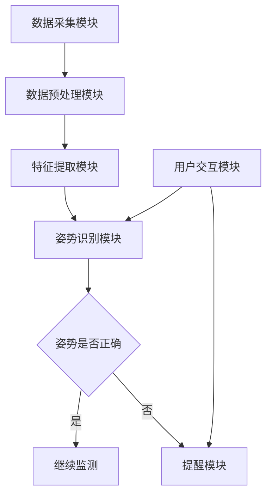

# 智能书桌：AI Agent的姿势提醒系统

> 关键词：智能书桌、AI Agent、姿势提醒系统、计算机视觉、机器学习

> 摘要：本文围绕智能书桌的AI Agent姿势提醒系统展开深入探讨。随着人们对健康办公和学习姿势的关注度不断提高，开发这样一个智能系统具有重要的现实意义。文章首先介绍了该系统的背景，包括目的、预期读者、文档结构等内容。接着阐述了核心概念与联系，通过文本示意图和Mermaid流程图清晰呈现系统架构。详细讲解了核心算法原理及具体操作步骤，并结合Python源代码进行说明。深入分析了数学模型和公式，同时给出举例。在项目实战部分，展示了开发环境搭建、源代码实现与解读。探讨了系统的实际应用场景，推荐了相关的工具和资源。最后总结了未来发展趋势与挑战，并提供了常见问题解答和参考资料，为智能书桌姿势提醒系统的开发和应用提供全面而深入的技术指导。

## 1. 背景介绍 
### 1.1 目的和范围
在当今数字化时代，人们花费大量时间在书桌前进行学习、工作等活动。然而，长时间保持不正确的姿势会导致诸如近视、颈椎病、腰椎病等多种健康问题。智能书桌的AI Agent姿势提醒系统旨在通过先进的技术手段，实时监测用户的姿势，并在发现姿势不正确时及时提醒用户纠正，从而有效预防因不良姿势引发的健康问题。

本系统的范围主要涵盖了基于计算机视觉和机器学习技术，对用户在书桌前的坐姿、站姿等姿势进行准确识别和分析，能够适应不同的光照条件和用户个体差异，提供个性化的姿势提醒服务。

### 1.2 预期读者
本文的预期读者包括对智能硬件开发、人工智能技术应用、健康监测系统感兴趣的工程师、科研人员、学生等。对于想要了解如何将AI技术应用于实际产品开发，特别是智能书桌相关领域的人员具有较高的参考价值。同时，也可供关注健康办公和学习环境的普通用户参考，帮助他们了解智能书桌姿势提醒系统的工作原理和优势。

### 1.3 文档结构概述
本文将按照以下结构进行阐述：首先介绍系统的背景信息，包括目的、预期读者和文档结构等。接着深入讲解系统的核心概念与联系，通过文本示意图和Mermaid流程图展示系统的架构。详细分析核心算法原理及具体操作步骤，并结合Python代码进行说明。阐述系统所涉及的数学模型和公式，并给出具体的举例。在项目实战部分，介绍开发环境的搭建、源代码的实现与解读。探讨系统的实际应用场景，推荐相关的工具和资源。最后总结系统的未来发展趋势与挑战，提供常见问题解答和参考资料。

### 1.4 术语表
#### 1.4.1 核心术语定义
- **智能书桌**：集成了各种传感器和智能设备，能够实现多种功能的书桌，本文主要关注其姿势提醒功能。
- **AI Agent**：人工智能代理，是一种能够感知环境、做出决策并采取行动的智能实体，在本系统中负责对用户姿势进行监测和分析。
- **姿势提醒系统**：通过对用户姿势的实时监测，当检测到不良姿势时发出提醒信号的系统。
- **计算机视觉**：让计算机从图像或视频中获取有意义信息的领域，在本系统中用于提取用户的姿势特征。
- **机器学习**：让计算机通过数据学习模式和规律，从而实现预测和决策的技术，在本系统中用于训练姿势识别模型。

#### 1.4.2 相关概念解释
- **传感器**：用于感知环境信息的设备，本系统中可能使用摄像头、深度传感器等获取用户的姿势数据。
- **特征提取**：从原始数据中提取出能够代表目标特征的信息，在姿势识别中，如提取人体关节点的位置信息。
- **模型训练**：使用大量的标注数据对机器学习模型进行训练，使其能够准确地识别不同的姿势。
- **阈值**：在判断姿势是否正确时所设定的界限值，当某些姿势特征超过阈值时，判定为不良姿势。

#### 1.4.3 缩略词列表
- **AI**：Artificial Intelligence，人工智能
- **CV**：Computer Vision，计算机视觉
- **ML**：Machine Learning，机器学习

## 2. 核心概念与联系 

### 核心概念原理
智能书桌的AI Agent姿势提醒系统主要基于计算机视觉和机器学习技术。系统通过摄像头或其他传感器获取用户在书桌前的图像或视频数据，然后利用计算机视觉技术对这些数据进行处理，提取出人体的关键特征，如关节点的位置、角度等。接着，将这些特征输入到经过训练的机器学习模型中，模型会根据预设的规则和学习到的模式，判断用户的姿势是否正确。如果检测到不良姿势，系统会通过声音、灯光或其他方式发出提醒信号，引导用户纠正姿势。

### 架构的文本示意图
智能书桌的AI Agent姿势提醒系统主要由以下几个部分组成：
1. **数据采集模块**：负责通过摄像头、深度传感器等设备采集用户的姿势数据，将其转换为数字图像或视频信号。
2. **数据预处理模块**：对采集到的数据进行预处理，包括图像增强、去噪、归一化等操作，以提高数据的质量和可用性。
3. **特征提取模块**：利用计算机视觉算法从预处理后的数据中提取出人体的关键特征，如关节点的位置、角度等。
4. **姿势识别模块**：将提取的特征输入到机器学习模型中，模型根据训练得到的参数和规则，判断用户的姿势是否正确。
5. **提醒模块**：当检测到不良姿势时，该模块会通过声音、灯光或其他方式发出提醒信号，提醒用户纠正姿势。
6. **用户交互模块**：用户可以通过该模块对系统进行设置，如调整提醒的方式、阈值等参数。

### Mermaid流程图


## 3. 核心算法原理 & 具体操作步骤 

### 核心算法原理
本系统主要使用基于深度学习的人体姿态估计算法，如OpenPose、AlphaPose等，来提取人体的关节点信息。这些算法通过卷积神经网络（CNN）对图像或视频进行处理，能够准确地检测出人体的各个关节点，如头部、肩部、肘部、腕部、髋部、膝部、踝部等。

然后，利用这些关节点的位置信息计算出相关的角度和距离，如头部的倾斜角度、肩部的高度差、脊柱的弯曲程度等。通过设定合理的阈值，将这些计算结果与正常姿势的标准进行比较，判断用户的姿势是否正确。

### 具体操作步骤
1. **数据采集**：使用摄像头或深度传感器实时采集用户在书桌前的图像或视频数据。
2. **数据预处理**：对采集到的数据进行预处理，包括图像缩放、灰度化、直方图均衡化等操作，以提高图像的质量和对比度。
3. **关节点检测**：使用人体姿态估计算法对预处理后的图像或视频进行处理，检测出人体的各个关节点。
4. **特征计算**：根据检测到的关节点位置信息，计算出相关的角度和距离等特征。
5. **姿势判断**：将计算得到的特征与预设的阈值进行比较，判断用户的姿势是否正确。
6. **提醒处理**：如果检测到不良姿势，系统会通过声音、灯光或其他方式发出提醒信号。

### Python源代码详细阐述
以下是一个简单的示例代码，使用OpenCV和MediaPipe库实现人体关节点的检测：
```python
import cv2
import mediapipe as mp

# 初始化MediaPipe人体姿态估计模型
mp_pose = mp.solutions.pose
pose = mp_pose.Pose()
mp_drawing = mp.solutions.drawing_utils

# 打开摄像头
cap = cv2.VideoCapture(0)

while cap.isOpened():
    # 读取一帧图像
    ret, frame = cap.read()
    if not ret:
        break

    # 将图像转换为RGB格式
    image = cv2.cvtColor(frame, cv2.COLOR_BGR2RGB)

    # 进行人体姿态估计
    results = pose.process(image)

    # 将图像转换回BGR格式
    image = cv2.cvtColor(image, cv2.COLOR_RGB2BGR)

    if results.pose_landmarks:
        # 绘制关节点和连接线
        mp_drawing.draw_landmarks(
            image, results.pose_landmarks, mp_pose.POSE_CONNECTIONS)

    # 显示图像
    cv2.imshow('Pose Estimation', image)

    # 按'q'键退出循环
    if cv2.waitKey(1) & 0xFF == ord('q'):
        break

# 释放摄像头并关闭窗口
cap.release()
cv2.destroyAllWindows()
```
在上述代码中，首先初始化了MediaPipe的人体姿态估计模型，然后打开摄像头读取图像。将图像转换为RGB格式后，使用模型进行人体姿态估计，得到关节点的位置信息。最后，将关节点和连接线绘制在图像上并显示出来。

## 4. 数学模型和公式 & 详细讲解 & 举例说明 

### 数学模型
在姿势识别中，主要使用几何模型来描述人体的姿势。通过计算关节点之间的距离和角度，可以量化人体的姿势特征。例如，使用欧几里得距离计算两个关节点之间的距离，使用向量的夹角公式计算两个向量之间的角度。

### 数学公式
1. **欧几里得距离公式**：
   设两个关节点的坐标分别为 $(x_1, y_1, z_1)$ 和 $(x_2, y_2, z_2)$，则它们之间的欧几里得距离 $d$ 为：
   $$d = \sqrt{(x_2 - x_1)^2 + (y_2 - y_1)^2 + (z_2 - z_1)^2}$$
2. **向量夹角公式**：
   设两个向量 $\vec{a} = (x_1, y_1, z_1)$ 和 $\vec{b} = (x_2, y_2, z_2)$，则它们之间的夹角 $\theta$ 的余弦值为：
   $$\cos\theta = \frac{\vec{a} \cdot \vec{b}}{\|\vec{a}\| \|\vec{b}\|} = \frac{x_1x_2 + y_1y_2 + z_1z_2}{\sqrt{x_1^2 + y_1^2 + z_1^2} \sqrt{x_2^2 + y_2^2 + z_2^2}}$$

### 详细讲解
在姿势识别中，欧几里得距离可以用于判断关节点之间的相对位置关系，例如判断肩部的高度差。向量夹角公式可以用于计算关节的弯曲角度，如肘部、膝部的弯曲角度。通过设定合理的阈值，可以根据这些距离和角度判断用户的姿势是否正确。

### 举例说明
假设检测到人体的两个肩部关节点的坐标分别为 $(100, 200, 0)$ 和 $(200, 210, 0)$，则它们之间的欧几里得距离为：
$$d = \sqrt{(200 - 100)^2 + (210 - 200)^2 + (0 - 0)^2} = \sqrt{100^2 + 10^2} = \sqrt{10100} \approx 100.5$$
如果设定肩部高度差的阈值为 50，由于计算得到的距离大于阈值，说明肩部高度差较大，可能存在不良姿势。

再假设检测到肘部的两个关节点和腕部的一个关节点，计算出两个向量 $\vec{a} = (10, 20, 0)$ 和 $\vec{b} = (30, 40, 0)$，则它们之间的夹角 $\theta$ 的余弦值为：
$$\cos\theta = \frac{10 \times 30 + 20 \times 40}{\sqrt{10^2 + 20^2} \sqrt{30^2 + 40^2}} = \frac{300 + 800}{\sqrt{500} \sqrt{2500}} = \frac{1100}{50 \times 50} = 0.44$$
通过反三角函数可以计算出夹角 $\theta$ 的值，然后与正常肘部弯曲角度的阈值进行比较，判断肘部的姿势是否正确。

## 5. 项目实战：代码实际案例和详细解释说明 

### 5.1  开发环境搭建
1. **安装Python**：从Python官方网站（https://www.python.org/downloads/）下载并安装Python 3.x版本。
2. **安装依赖库**：使用pip命令安装所需的库，如OpenCV、MediaPipe、NumPy等。
```bash
pip install opencv-python
pip install mediapipe
pip install numpy
```
3. **准备硬件设备**：准备一个摄像头或深度传感器，用于采集用户的姿势数据。

### 5.2  源代码详细实现和代码解读
以下是一个完整的智能书桌姿势提醒系统的示例代码：
```python
import cv2
import mediapipe as mp
import numpy as np

# 初始化MediaPipe人体姿态估计模型
mp_pose = mp.solutions.pose
pose = mp_pose.Pose()
mp_drawing = mp.solutions.drawing_utils

# 打开摄像头
cap = cv2.VideoCapture(0)

# 定义姿势判断阈值
shoulder_height_threshold = 50
elbow_angle_threshold = 120

while cap.isOpened():
    # 读取一帧图像
    ret, frame = cap.read()
    if not ret:
        break

    # 将图像转换为RGB格式
    image = cv2.cvtColor(frame, cv2.COLOR_BGR2RGB)

    # 进行人体姿态估计
    results = pose.process(image)

    # 将图像转换回BGR格式
    image = cv2.cvtColor(image, cv2.COLOR_RGB2BGR)

    if results.pose_landmarks:
        # 绘制关节点和连接线
        mp_drawing.draw_landmarks(
            image, results.pose_landmarks, mp_pose.POSE_CONNECTIONS)

        # 获取肩部和肘部关节点的坐标
        landmarks = results.pose_landmarks.landmark
        left_shoulder = [landmarks[mp_pose.PoseLandmark.LEFT_SHOULDER].x,
                         landmarks[mp_pose.PoseLandmark.LEFT_SHOULDER].y]
        right_shoulder = [landmarks[mp_pose.PoseLandmark.RIGHT_SHOULDER].x,
                          landmarks[mp_pose.PoseLandmark.RIGHT_SHOULDER].y]
        left_elbow = [landmarks[mp_pose.PoseLandmark.LEFT_ELBOW].x,
                      landmarks[mp_pose.PoseLandmark.LEFT_ELBOW].y]
        left_wrist = [landmarks[mp_pose.PoseLandmark.LEFT_WRIST].x,
                      landmarks[mp_pose.PoseLandmark.LEFT_WRIST].y]

        # 计算肩部高度差
        shoulder_height_diff = abs(left_shoulder[1] - right_shoulder[1]) * frame.shape[0]

        # 计算肘部角度
        a = np.array(left_shoulder)
        b = np.array(left_elbow)
        c = np.array(left_wrist)
        ba = a - b
        bc = c - b
        cosine_angle = np.dot(ba, bc) / (np.linalg.norm(ba) * np.linalg.norm(bc))
        elbow_angle = np.degrees(np.arccos(cosine_angle))

        # 判断姿势是否正确
        if shoulder_height_diff > shoulder_height_threshold:
            cv2.putText(image, 'Shoulder height difference is too large!', (10, 30),
                        cv2.FONT_HERSHEY_SIMPLEX, 1, (0, 0, 255), 2)
        if elbow_angle < elbow_angle_threshold:
            cv2.putText(image, 'Elbow angle is too small!', (10, 60),
                        cv2.FONT_HERSHEY_SIMPLEX, 1, (0, 0, 255), 2)

    # 显示图像
    cv2.imshow('Pose Reminder System', image)

    # 按'q'键退出循环
    if cv2.waitKey(1) & 0xFF == ord('q'):
        break

# 释放摄像头并关闭窗口
cap.release()
cv2.destroyAllWindows()
```
### 5.3  代码解读与分析
1. **导入必要的库**：导入OpenCV、MediaPipe和NumPy库，用于图像处理、人体姿态估计和数值计算。
2. **初始化模型和摄像头**：初始化MediaPipe的人体姿态估计模型和摄像头，准备进行数据采集和处理。
3. **定义姿势判断阈值**：定义肩部高度差和肘部角度的阈值，用于判断姿势是否正确。
4. **循环读取图像并处理**：在循环中不断读取摄像头的图像，将其转换为RGB格式后进行人体姿态估计。
5. **获取关节点坐标**：从姿态估计结果中获取肩部和肘部关节点的坐标。
6. **计算姿势特征**：计算肩部高度差和肘部角度。
7. **判断姿势是否正确**：将计算得到的特征与阈值进行比较，如果超过阈值，则在图像上显示相应的提醒信息。
8. **显示图像**：将处理后的图像显示出来，用户可以实时看到自己的姿势和提醒信息。
9. **释放资源**：按'q'键退出循环后，释放摄像头并关闭窗口。

## 6. 实际应用场景 
1. **学习场景**：在学校或家庭的学习环境中，智能书桌的姿势提醒系统可以帮助学生保持正确的坐姿，预防近视和脊柱侧弯等问题，提高学习效率和身体健康水平。
2. **办公场景**：对于长时间坐在办公桌前工作的上班族，该系统可以实时监测他们的姿势，提醒他们纠正不良姿势，减少颈椎病、腰椎病等职业病的发生。
3. **康复训练场景**：在康复训练过程中，智能书桌的姿势提醒系统可以辅助患者保持正确的姿势，帮助他们更好地进行康复训练，提高康复效果。
4. **儿童成长场景**：对于儿童来说，养成良好的姿势习惯非常重要。智能书桌的姿势提醒系统可以在儿童学习和玩耍时，及时提醒他们保持正确的姿势，促进儿童的健康成长。

## 7. 工具和资源推荐
### 7.1 学习资源推荐
#### 7.1.1 书籍推荐
- 《计算机视觉：算法与应用》：全面介绍了计算机视觉的基本概念、算法和应用，对于理解人体姿态估计等计算机视觉技术有很大帮助。
- 《机器学习》：周志华著，是机器学习领域的经典教材，系统地介绍了机器学习的基本原理和算法，有助于深入理解姿势识别中使用的机器学习模型。
- 《Python深度学习》：详细介绍了如何使用Python和深度学习框架进行深度学习模型的开发和训练，对于实现基于深度学习的人体姿态估计算法有重要参考价值。

#### 7.1.2 在线课程
- Coursera上的“计算机视觉基础”课程：由知名教授授课，内容涵盖计算机视觉的基本概念、算法和应用，通过视频讲解、编程作业等方式帮助学习者掌握计算机视觉技术。
- edX上的“机器学习导论”课程：提供了机器学习的入门知识，包括监督学习、无监督学习、深度学习等内容，适合初学者学习。
- B站（哔哩哔哩）上有很多关于计算机视觉和机器学习的教程视频，这些视频由不同的博主制作，内容丰富多样，可以根据自己的需求选择学习。

#### 7.1.3 技术博客和网站
- OpenCV官方文档（https://docs.opencv.org/）：提供了OpenCV库的详细文档和教程，对于使用OpenCV进行图像处理和计算机视觉开发非常有帮助。
- MediaPipe官方文档（https://google.github.io/mediapipe/）：介绍了MediaPipe的功能和使用方法，包括人体姿态估计等多个模块的详细说明。
- 知乎、CSDN等技术社区上有很多关于计算机视觉、机器学习和智能硬件开发的技术文章和经验分享，可以从中获取最新的技术动态和解决方案。

### 7.2 开发工具框架推荐
#### 7.2.1 IDE和编辑器
- PyCharm：是一款专门为Python开发设计的集成开发环境（IDE），具有强大的代码编辑、调试、自动补全等功能，适合开发智能书桌姿势提醒系统这样的Python项目。
- Visual Studio Code：是一款轻量级的代码编辑器，支持多种编程语言和插件扩展，安装相关的Python插件后可以方便地进行Python开发。

#### 7.2.2 调试和性能分析工具
- OpenCV的调试工具：OpenCV提供了一些调试工具和函数，如cv2.imshow()用于显示图像，cv2.waitKey()用于等待按键事件，可以帮助开发者调试图像处理代码。
- TensorBoard：是TensorFlow的可视化工具，可以用于可视化深度学习模型的训练过程和性能指标，帮助开发者分析模型的训练效果和性能瓶颈。

#### 7.2.3 相关框架和库
- OpenCV：是一个开源的计算机视觉库，提供了丰富的图像处理和计算机视觉算法，如图像滤波、特征提取、目标检测等，在智能书桌姿势提醒系统中可用于图像预处理和关节点检测。
- MediaPipe：是Google开发的跨平台开源机器学习框架，提供了人体姿态估计、手部检测、面部识别等多个预训练模型和工具，方便开发者快速实现相关功能。
- TensorFlow、PyTorch：是常用的深度学习框架，可用于训练和优化姿势识别模型，提高系统的准确性和性能。

### 7.3 相关论文著作推荐
#### 7.3.1 经典论文
- “OpenPose: Realtime Multi-Person 2D Pose Estimation using Part Affinity Fields”：介绍了OpenPose算法的原理和实现，该算法是一种基于卷积神经网络的人体姿态估计方法，具有较高的准确性和实时性。
- “Simple Baselines for Human Pose Estimation and Tracking”：提出了一种简单而有效的人体姿态估计和跟踪方法，为后续的研究和开发提供了重要的参考。

#### 7.3.2 最新研究成果
- 关注计算机视觉和机器学习领域的顶级学术会议，如CVPR（计算机视觉与模式识别会议）、ICCV（国际计算机视觉会议）、NeurIPS（神经信息处理系统大会）等，这些会议上会发布很多关于人体姿态估计和姿势识别的最新研究成果。
- 查阅相关的学术期刊，如IEEE Transactions on Pattern Analysis and Machine Intelligence、International Journal of Computer Vision等，获取最新的学术论文和研究进展。

#### 7.3.3 应用案例分析
- 可以参考一些智能硬件产品的开发案例和技术报告，了解他们在姿势提醒系统方面的实现方法和经验教训。
- 分析一些实际应用场景中的姿势识别系统案例，如智能教室、智能办公空间等，学习他们如何将技术与实际应用相结合，提高系统的实用性和用户体验。

## 8. 总结：未来发展趋势与挑战
### 未来发展趋势
1. **智能化程度不断提高**：随着人工智能技术的不断发展，智能书桌的姿势提醒系统将更加智能化。系统可以根据用户的个体差异，如身高、体重、身体比例等，自动调整姿势判断的阈值，提供更加个性化的姿势提醒服务。同时，系统还可以学习用户的习惯和偏好，逐步优化提醒策略，提高用户的接受度和依从性。
2. **多传感器融合**：未来的智能书桌姿势提醒系统将不仅仅依赖于摄像头，还会融合更多的传感器，如压力传感器、加速度传感器、陀螺仪等。通过多传感器数据的融合，可以获取更加全面和准确的用户姿势信息，提高姿势识别的准确性和可靠性。
3. **与其他智能设备的互联互通**：智能书桌的姿势提醒系统将与其他智能设备，如智能手环、智能眼镜、智能家居系统等实现互联互通。例如，当姿势提醒系统检测到用户的不良姿势时，可以通过智能手环向用户发送震动提醒，或者通过智能家居系统调整灯光、座椅高度等环境参数，帮助用户纠正姿势。
4. **应用场景的拓展**：除了学习和办公场景，智能书桌的姿势提醒系统还将拓展到更多的应用场景，如医疗康复、运动训练、娱乐游戏等。在医疗康复场景中，系统可以辅助医生对患者进行康复训练指导；在运动训练场景中，系统可以实时监测运动员的姿势，提供技术分析和改进建议；在娱乐游戏场景中，系统可以将用户的姿势作为游戏的交互方式，增加游戏的趣味性和沉浸感。

### 挑战
1. **数据隐私和安全问题**：智能书桌的姿势提醒系统需要采集用户的图像或视频数据，这些数据包含了用户的个人隐私信息。因此，如何保护用户的数据隐私和安全是一个重要的挑战。需要采取有效的数据加密、访问控制等技术措施，确保用户数据不被泄露和滥用。
2. **复杂环境下的姿势识别准确性**：在实际应用中，智能书桌的姿势提醒系统可能会面临各种复杂的环境条件，如光照变化、遮挡、多人场景等。这些因素会影响人体姿态估计和姿势识别的准确性。因此，如何提高系统在复杂环境下的鲁棒性和准确性是一个亟待解决的问题。
3. **用户接受度和依从性**：虽然智能书桌的姿势提醒系统的初衷是为了帮助用户保持正确的姿势，预防健康问题，但有些用户可能会对频繁的提醒感到厌烦，从而降低对系统的接受度和依从性。如何设计合理的提醒策略，提高用户的接受度和依从性，是系统推广和应用的关键。
4. **技术成本和市场竞争**：开发和实现智能书桌的姿势提醒系统需要投入大量的技术研发成本和硬件设备成本。同时，随着市场上智能书桌产品的不断增多，市场竞争也日益激烈。如何在保证系统性能和功能的前提下，降低技术成本，提高产品的性价比，是企业面临的一个重要挑战。

## 9. 附录：常见问题与解答
### 1. 系统对摄像头有什么要求？
系统对摄像头的要求主要包括分辨率和帧率。一般来说，分辨率越高，采集到的图像越清晰，有利于提高姿势识别的准确性。帧率越高，系统可以实时获取更多的图像数据，提高系统的实时性。建议选择分辨率不低于720P，帧率不低于30fps的摄像头。

### 2. 系统在不同光照条件下的性能如何？
系统在不同光照条件下的性能会受到一定的影响。在强光或弱光环境下，图像的对比度和亮度可能会发生变化，从而影响人体姿态估计和姿势识别的准确性。为了提高系统在不同光照条件下的性能，可以采用图像增强、自适应阈值调整等技术手段。

### 3. 系统能否适应不同身材的用户？
系统可以通过调整姿势判断的阈值来适应不同身材的用户。在实际应用中，可以根据用户的身高、体重、身体比例等信息，自动调整阈值，以确保系统能够准确地判断不同用户的姿势是否正确。

### 4. 系统的提醒方式有哪些？
系统的提醒方式可以根据用户的需求进行设置，常见的提醒方式包括声音提醒、灯光提醒、震动提醒等。用户可以根据自己的喜好选择合适的提醒方式。

### 5. 系统的准确性如何保证？
系统的准确性主要通过以下几个方面来保证：
- **高质量的数据集**：使用大量的标注数据对机器学习模型进行训练，确保模型能够学习到各种不同姿势的特征。
- **先进的算法**：采用先进的人体姿态估计和姿势识别算法，如OpenPose、AlphaPose等，提高系统的准确性和鲁棒性。
- **多传感器融合**：融合多个传感器的数据，获取更加全面和准确的用户姿势信息，提高系统的准确性。
- **定期优化和更新**：定期对系统进行优化和更新，根据用户的反馈和实际应用情况，不断调整模型的参数和阈值，提高系统的准确性。

## 10. 扩展阅读 & 参考资料
1. 《计算机视觉原理与应用》，作者：[作者姓名]，出版社：[出版社名称]
2. 《机器学习实战》，作者：[作者姓名]，出版社：[出版社名称]
3. OpenCV官方文档：https://docs.opencv.org/
4. MediaPipe官方文档：https://google.github.io/mediapipe/
5. CVPR会议论文集：https://cvpr.thecvf.com/
6. ICCV会议论文集：https://iccv.thecvf.com/
7. NeurIPS会议论文集：https://neurips.cc/
8. IEEE Transactions on Pattern Analysis and Machine Intelligence期刊：https://ieeexplore.ieee.org/xpl/RecentIssue.jsp?punumber=34
9. International Journal of Computer Vision期刊：https://link.springer.com/journal/11263
10. 相关智能硬件产品的技术报告和开发文档。