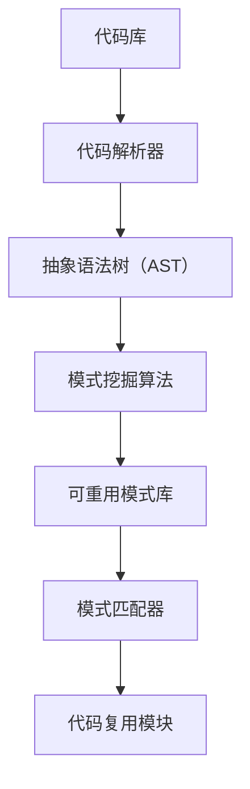

# 智能代码重用模式挖掘:提高团队开发效率

> 关键词：智能代码重用、模式挖掘、团队开发效率、代码分析、软件开发

> 摘要：本文围绕智能代码重用模式挖掘展开，旨在探讨如何通过挖掘代码中的重用模式来提高团队开发效率。首先介绍了相关背景知识，包括目的、预期读者、文档结构和术语表等。接着阐述了核心概念与联系，通过文本示意图和 Mermaid 流程图展示其原理和架构。详细讲解了核心算法原理及具体操作步骤，并结合 Python 源代码进行说明。同时给出了数学模型和公式，并举例说明。通过项目实战，展示了代码实际案例及详细解释。分析了实际应用场景，推荐了相关的工具和资源。最后总结了未来发展趋势与挑战，提供了常见问题解答和扩展阅读参考资料，为团队在软件开发中更好地实现代码重用、提升开发效率提供全面的指导。

## 1. 背景介绍 
### 1.1 目的和范围
在当今的软件开发领域，团队开发是一种常见且高效的工作模式。然而，随着项目规模的不断扩大和复杂度的增加，团队成员在开发过程中往往会面临重复编写相似代码的问题，这不仅浪费了大量的时间和精力，还可能导致代码质量参差不齐。智能代码重用模式挖掘的目的就是要解决这些问题，通过对已有代码的分析和挖掘，找出其中可重用的模式，以便在后续的开发中能够快速复用这些模式，从而提高团队开发效率、提升代码质量。

本文的范围主要涵盖智能代码重用模式挖掘的相关理论、算法、实践以及应用场景等方面。从核心概念的介绍到具体算法的实现，从项目实战的案例分析到未来发展趋势的探讨，全面深入地阐述智能代码重用模式挖掘如何为团队开发效率的提升提供支持。

### 1.2 预期读者
本文的预期读者主要包括软件开发团队的成员，如程序员、软件架构师、CTO 等，他们在实际的开发工作中面临着提高开发效率和代码质量的挑战，智能代码重用模式挖掘的相关知识和技术对他们具有重要的实用价值。同时，对于从事计算机科学研究的学者和学生来说，本文也可以作为了解代码分析和软件复用领域的参考资料，为他们的研究和学习提供思路和方法。

### 1.3 文档结构概述
本文将按照以下结构进行组织：首先介绍背景知识，包括目的、预期读者、文档结构和术语表等，让读者对本文的整体内容有一个初步的了解。接着阐述核心概念与联系，通过文本示意图和 Mermaid 流程图展示智能代码重用模式挖掘的原理和架构，帮助读者建立起对该领域的基本认识。然后详细讲解核心算法原理及具体操作步骤，并结合 Python 源代码进行说明，使读者能够深入理解算法的实现细节。同时给出数学模型和公式，并举例说明，为算法的理论基础提供支持。通过项目实战，展示代码实际案例及详细解释，让读者能够将理论知识应用到实际开发中。分析实际应用场景，推荐相关的工具和资源，为读者提供更多的实践指导和学习途径。最后总结未来发展趋势与挑战，提供常见问题解答和扩展阅读参考资料，使读者对智能代码重用模式挖掘有一个全面、深入的认识。

### 1.4 术语表
#### 1.4.1 核心术语定义
- **智能代码重用**：指利用人工智能技术和算法，自动识别和提取代码中可复用的部分，并在合适的场景下进行复用的过程。
- **模式挖掘**：从大量的数据（如代码）中发现潜在的、有价值的模式和规律的过程。
- **代码复用**：在软件开发过程中，直接使用已有的代码片段来实现新的功能，避免重复编写相同或相似的代码。
- **代码库**：存储和管理代码的集合，通常包含多个项目的代码文件。

#### 1.4.2 相关概念解释
- **抽象语法树（AST）**：源代码的一种树形表示形式，它将代码的语法结构以树的形式呈现出来，便于对代码进行分析和处理。
- **代码相似度**：衡量两段代码之间相似程度的指标，通常通过比较代码的结构、语义等方面来计算。
- **频繁模式**：在数据集中频繁出现的模式，在代码中可以表示为经常被重复使用的代码片段。

#### 1.4.3 缩略词列表
- **AST**：Abstract Syntax Tree（抽象语法树）
- **API**：Application Programming Interface（应用程序编程接口）

## 2. 核心概念与联系 
### 核心概念原理
智能代码重用模式挖掘的核心原理是通过对代码库中的代码进行分析和处理，找出其中的可重用模式。这一过程主要包括以下几个步骤：

1. **代码表示**：将源代码转换为一种便于分析和处理的表示形式，如抽象语法树（AST）。AST 可以将代码的语法结构以树的形式呈现出来，忽略了代码的具体实现细节，更便于对代码的结构和语义进行分析。

2. **模式提取**：从代码的表示形式中提取出潜在的可重用模式。这可以通过各种数据挖掘和机器学习算法来实现，如频繁模式挖掘算法、聚类算法等。

3. **模式匹配**：在新的开发任务中，将当前的代码需求与已挖掘出的可重用模式进行匹配，找出最适合的模式进行复用。

### 架构的文本示意图
```plaintext
                代码库
                  |
                  v
            代码解析器
                  |
                  v
            抽象语法树（AST）
                  |
                  v
        模式挖掘算法
                  |
                  v
           可重用模式库
                  |
                  v
        模式匹配器
                  |
                  v
           代码复用模块
```

### Mermaid 流程图


## 3. 核心算法原理 & 具体操作步骤 
### 核心算法原理
在智能代码重用模式挖掘中，频繁模式挖掘算法是一种常用的算法。频繁模式挖掘的目标是从数据集中找出频繁出现的模式。在代码分析中，频繁模式可以表示为经常被重复使用的代码片段。

Apriori 算法是一种经典的频繁模式挖掘算法，其基本思想是通过逐层搜索的迭代方法，从单个项集开始，不断生成更大的项集，直到无法生成更大的频繁项集为止。

### 具体操作步骤
1. **数据预处理**：将代码库中的代码解析为抽象语法树（AST），并将 AST 转换为适合频繁模式挖掘的项集表示形式。
2. **生成候选项集**：从单个项集开始，生成所有可能的候选项集。
3. **计算支持度**：对于每个候选项集，计算其在数据集中的支持度（即出现的频率）。
4. **筛选频繁项集**：根据设定的最小支持度阈值，筛选出支持度大于等于阈值的频繁项集。
5. **生成关联规则**：从频繁项集中生成关联规则，用于描述项集之间的关联关系。

### Python 源代码实现
```python
# 示例代码，实现简单的 Apriori 算法
from itertools import chain, combinations

def powerset(iterable):
    """生成集合的所有子集"""
    s = list(iterable)
    return chain.from_iterable(combinations(s, r) for r in range(len(s)+1))

def get_support(itemset, transactions):
    """计算项集的支持度"""
    count = 0
    for transaction in transactions:
        if itemset.issubset(transaction):
            count += 1
    return count / len(transactions)

def apriori(transactions, min_support):
    """Apriori 算法实现"""
    items = set(chain(*transactions))
    frequent_itemsets = []
    k = 1
    # 生成 1-项集
    one_itemsets = [{item} for item in items]
    while one_itemsets:
        frequent_k_itemsets = []
        for itemset in one_itemsets:
            support = get_support(itemset, transactions)
            if support >= min_support:
                frequent_k_itemsets.append(itemset)
        frequent_itemsets.extend(frequent_k_itemsets)
        k += 1
        # 生成 k+1-项集
        one_itemsets = []
        for i in range(len(frequent_k_itemsets)):
            for j in range(i + 1, len(frequent_k_itemsets)):
                new_itemset = frequent_k_itemsets[i].union(frequent_k_itemsets[j])
                if len(new_itemset) == k:
                    one_itemsets.append(new_itemset)
    return frequent_itemsets

# 示例数据
transactions = [
    {'A', 'B', 'C'},
    {'A', 'B'},
    {'B', 'C'},
    {'A', 'C'},
    {'A', 'B', 'C', 'D'}
]

# 最小支持度阈值
min_support = 0.4

# 运行 Apriori 算法
frequent_itemsets = apriori(transactions, min_support)
print("频繁项集:", frequent_itemsets)
```

## 4. 数学模型和公式 & 详细讲解 & 举例说明 
### 数学模型和公式
#### 支持度（Support）
支持度是指项集在数据集中出现的频率，用公式表示为：
$$
\text{Support}(X) = \frac{\text{Count}(X)}{N}
$$
其中，$\text{Support}(X)$ 表示项集 $X$ 的支持度，$\text{Count}(X)$ 表示项集 $X$ 在数据集中出现的次数，$N$ 表示数据集的总事务数。

#### 置信度（Confidence）
置信度是指在包含项集 $X$ 的事务中，同时包含项集 $Y$ 的概率，用公式表示为：
$$
\text{Confidence}(X \rightarrow Y) = \frac{\text{Support}(X \cup Y)}{\text{Support}(X)}
$$
其中，$\text{Confidence}(X \rightarrow Y)$ 表示从项集 $X$ 到项集 $Y$ 的置信度，$\text{Support}(X \cup Y)$ 表示项集 $X$ 和项集 $Y$ 的并集的支持度，$\text{Support}(X)$ 表示项集 $X$ 的支持度。

### 详细讲解
支持度反映了项集在数据集中的普遍性，支持度越高，说明该项集越频繁出现。置信度则反映了项集之间的关联程度，置信度越高，说明在包含一个项集的事务中，同时包含另一个项集的可能性越大。

在频繁模式挖掘中，通常会设定一个最小支持度阈值和一个最小置信度阈值，只有支持度大于等于最小支持度阈值的项集才被认为是频繁项集，只有置信度大于等于最小置信度阈值的关联规则才被认为是有意义的关联规则。

### 举例说明
假设有一个超市的交易数据集，包含以下事务：
| 事务编号 | 商品列表 |
| ---- | ---- |
| 1 | 牛奶，面包，尿布 |
| 2 | 可乐，面包，尿布，啤酒 |
| 3 | 牛奶，尿布，啤酒，鸡蛋 |
| 4 | 面包，牛奶，尿布，啤酒 |
| 5 | 面包，牛奶，尿布，可乐 |

计算项集 $\{牛奶, 尿布\}$ 的支持度：
- 包含项集 $\{牛奶, 尿布\}$ 的事务有 4 个（事务 1、3、4、5）。
- 数据集的总事务数为 5 个。
- 根据支持度公式，$\text{Support}(\{牛奶, 尿布\}) = \frac{4}{5} = 0.8$。

计算关联规则 $\{牛奶\} \rightarrow \{尿布\}$ 的置信度：
- 项集 $\{牛奶\}$ 的支持度：包含项集 $\{牛奶\}$ 的事务有 4 个（事务 1、3、4、5），$\text{Support}(\{牛奶\}) = \frac{4}{5} = 0.8$。
- 项集 $\{牛奶, 尿布\}$ 的支持度：$\text{Support}(\{牛奶, 尿布\}) = \frac{4}{5} = 0.8$。
- 根据置信度公式，$\text{Confidence}(\{牛奶\} \rightarrow \{尿布\}) = \frac{\text{Support}(\{牛奶, 尿布\})}{\text{Support}(\{牛奶\})} = \frac{0.8}{0.8} = 1$。

## 5. 项目实战：代码实际案例和详细解释说明 
### 5.1  开发环境搭建
#### 操作系统
本项目可以在 Windows、Linux 或 macOS 等主流操作系统上进行开发。建议使用 Linux 或 macOS 系统，因为它们对开发工具和环境的支持更好。

#### 编程语言和版本
使用 Python 3.x 版本进行开发，Python 是一种简单易学、功能强大的编程语言，拥有丰富的库和工具，非常适合用于代码分析和数据挖掘任务。

#### 开发工具
- **集成开发环境（IDE）**：推荐使用 PyCharm，它是一款专门为 Python 开发设计的 IDE，具有代码自动补全、调试、版本控制等功能，能够提高开发效率。
- **文本编辑器**：也可以使用 VS Code 等文本编辑器进行开发，VS Code 具有轻量级、插件丰富等特点，适合快速编写和调试代码。

#### 相关库和依赖
- **ast**：Python 内置的抽象语法树模块，用于解析 Python 代码并生成抽象语法树。
- **pandas**：用于数据处理和分析的库，在本项目中可以用于存储和处理代码数据。
- **networkx**：用于图论和网络分析的库，在本项目中可以用于表示和分析代码的结构。

可以使用以下命令安装相关库：
```sh
pip install pandas networkx
```

### 5.2  源代码详细实现和代码解读
#### 代码解析模块
```python
import ast

def parse_code(code):
    """解析 Python 代码并返回抽象语法树"""
    try:
        tree = ast.parse(code)
        return tree
    except SyntaxError:
        print("代码语法错误，无法解析")
        return None

# 示例代码
code = "def add(a, b): return a + b"
tree = parse_code(code)
if tree:
    print("代码解析成功")
```
**代码解读**：
- `ast.parse` 函数是 Python 内置的用于解析代码并生成抽象语法树的函数。
- 该函数接受一个字符串类型的代码作为输入，返回一个抽象语法树对象。
- 如果代码存在语法错误，会抛出 `SyntaxError` 异常，在异常处理中打印错误信息并返回 `None`。

#### 模式挖掘模块
```python
from collections import defaultdict

def extract_patterns(tree):
    """从抽象语法树中提取模式"""
    patterns = defaultdict(int)
    def traverse(node):
        node_type = type(node).__name__
        patterns[node_type] += 1
        for child in ast.iter_child_nodes(node):
            traverse(child)
    traverse(tree)
    return patterns

# 提取模式
if tree:
    patterns = extract_patterns(tree)
    print("提取的模式:", patterns)
```
**代码解读**：
- `extract_patterns` 函数接受一个抽象语法树对象作为输入，返回一个字典，字典的键是节点类型，值是该节点类型在抽象语法树中出现的次数。
- `traverse` 函数是一个递归函数，用于遍历抽象语法树的所有节点。
- 在遍历过程中，统计每个节点类型的出现次数，并将结果存储在 `patterns` 字典中。

#### 模式匹配模块
```python
def match_patterns(patterns1, patterns2):
    """比较两个模式字典，计算相似度"""
    common_patterns = set(patterns1.keys()) & set(patterns2.keys())
    similarity = sum(min(patterns1[pattern], patterns2[pattern]) for pattern in common_patterns)
    total_patterns = sum(patterns1.values()) + sum(patterns2.values())
    if total_patterns == 0:
        return 0
    return similarity / total_patterns

# 示例代码 2
code2 = "def sub(a, b): return a - b"
tree2 = parse_code(code2)
if tree2:
    patterns2 = extract_patterns(tree2)
    similarity = match_patterns(patterns, patterns2)
    print("代码相似度:", similarity)
```
**代码解读**：
- `match_patterns` 函数接受两个模式字典作为输入，返回它们之间的相似度。
- 首先计算两个模式字典中共同的模式集合 `common_patterns`。
- 然后计算共同模式在两个字典中出现次数的最小值之和 `similarity`。
- 最后计算总模式数 `total_patterns`，并将相似度除以总模式数得到最终的相似度值。

### 5.3  代码解读与分析
通过以上代码，我们实现了一个简单的智能代码重用模式挖掘系统。该系统的主要功能包括代码解析、模式提取和模式匹配。

- **代码解析**：将源代码转换为抽象语法树，便于后续的分析和处理。
- **模式提取**：从抽象语法树中提取模式，统计不同节点类型的出现次数。
- **模式匹配**：比较两个模式字典，计算它们之间的相似度，从而判断两段代码是否相似。

通过这种方式，我们可以在代码库中找出相似的代码片段，实现代码的重用，提高团队开发效率。

## 6. 实际应用场景 
### 软件项目开发
在软件项目开发中，智能代码重用模式挖掘可以帮助团队成员快速找到可复用的代码片段，避免重复编写相同或相似的代码。例如，在一个大型的 Web 应用开发项目中，可能会有多个模块需要实现用户登录、注册等功能，通过挖掘代码库中的可重用模式，团队成员可以直接复用已有的代码，减少开发时间和工作量。

### 开源代码贡献
在开源社区中，智能代码重用模式挖掘可以帮助开发者更好地理解和复用其他开发者的代码。当开发者想要参与一个开源项目时，通过挖掘项目代码库中的可重用模式，他们可以快速找到与自己需求相关的代码片段，提高参与开源项目的效率。

### 代码审查
在代码审查过程中，智能代码重用模式挖掘可以帮助审查人员发现代码中的重复和冗余部分，提出优化建议。例如，审查人员可以通过挖掘代码库中的可重用模式，找出多个模块中重复实现的功能，建议开发者将这些功能提取为公共模块，提高代码的可维护性和复用性。

## 7. 工具和资源推荐
### 7.1 学习资源推荐
#### 7.1.1 书籍推荐
- 《Python 数据分析实战》：本书介绍了 Python 在数据分析领域的应用，包括数据处理、数据挖掘、机器学习等方面的知识，对于学习智能代码重用模式挖掘中的数据处理和分析有很大的帮助。
- 《数据挖掘：概念与技术》：这是一本经典的数据挖掘教材，系统地介绍了数据挖掘的基本概念、算法和应用，对于理解智能代码重用模式挖掘中的模式挖掘算法有重要的参考价值。
- 《Python 数据科学手册》：本书涵盖了 Python 在数据科学领域的各种应用，包括数据处理、数据分析、机器学习等方面的内容，对于学习智能代码重用模式挖掘中的 Python 编程有很大的帮助。

#### 7.1.2 在线课程
- Coursera 上的“Data Science Specialization”：这是一个由多所知名大学联合推出的数据科学课程系列，涵盖了数据科学的各个方面，包括数据处理、数据挖掘、机器学习等，对于学习智能代码重用模式挖掘有很大的帮助。
- edX 上的“Introduction to Data Science”：这是一门由哈佛大学推出的数据分析入门课程，介绍了数据分析的基本概念、方法和工具，对于学习智能代码重用模式挖掘中的数据处理和分析有一定的帮助。
- 中国大学 MOOC 上的“Python 语言程序设计”：这是一门由北京理工大学推出的 Python 编程入门课程，适合初学者学习 Python 编程语言，为后续学习智能代码重用模式挖掘打下基础。

#### 7.1.3 技术博客和网站
- Medium：这是一个技术博客平台，上面有很多关于数据科学、机器学习、软件开发等方面的文章，对于学习智能代码重用模式挖掘有很大的帮助。
- Stack Overflow：这是一个程序员社区，上面有很多关于编程问题的讨论和解决方案，对于解决智能代码重用模式挖掘中遇到的编程问题有很大的帮助。
- GitHub：这是一个开源代码托管平台，上面有很多优秀的开源项目，对于学习智能代码重用模式挖掘中的代码实现和应用有很大的帮助。

### 7.2 开发工具框架推荐
#### 7.2.1 IDE和编辑器
- PyCharm：这是一款专门为 Python 开发设计的 IDE，具有代码自动补全、调试、版本控制等功能，能够提高开发效率。
- VS Code：这是一款轻量级的文本编辑器，具有丰富的插件和扩展功能，适合快速编写和调试代码。

#### 7.2.2 调试和性能分析工具
- pdb：这是 Python 内置的调试器，用于调试 Python 代码。
- cProfile：这是 Python 内置的性能分析工具，用于分析 Python 代码的性能瓶颈。

#### 7.2.3 相关框架和库
- ast：Python 内置的抽象语法树模块，用于解析 Python 代码并生成抽象语法树。
- pandas：用于数据处理和分析的库，在智能代码重用模式挖掘中可以用于存储和处理代码数据。
- networkx：用于图论和网络分析的库，在智能代码重用模式挖掘中可以用于表示和分析代码的结构。

### 7.3 相关论文著作推荐
#### 7.3.1 经典论文
- Agrawal, R., & Srikant, R. (1994). Fast algorithms for mining association rules. Proceedings of the 20th international conference on very large data bases - Volume 20. This paper introduced the Apriori algorithm, which is a classic algorithm for frequent pattern mining.
- Mannila, H., Toivonen, H., & Verkamo, A. I. (1994). Discovery of frequent episodes in event sequences. Data mining and knowledge discovery, 1(3), 259-289. This paper proposed an algorithm for discovering frequent episodes in event sequences, which is also relevant to pattern mining in code analysis.

#### 7.3.2 最新研究成果
- Recent research on code reuse and pattern mining in software engineering can be found in top - tier conferences such as the International Conference on Software Engineering (ICSE), the ACM SIGSOFT Symposium on the Foundations of Software Engineering (FSE), etc. These conferences publish the latest research results in the field of software engineering, including new algorithms and techniques for code reuse and pattern mining.

#### 7.3.3 应用案例分析
- Some real - world application cases of code reuse and pattern mining can be found in industry reports and case studies. For example, some large - scale software companies may publish their experiences and practices in code reuse and pattern mining to improve development efficiency and code quality.

## 8. 总结：未来发展趋势与挑战
### 未来发展趋势
#### 与人工智能技术的深度融合
随着人工智能技术的不断发展，智能代码重用模式挖掘将与深度学习、自然语言处理等技术深度融合。例如，利用深度学习模型对代码的语义进行理解和分析，提高模式挖掘的准确性和效率；利用自然语言处理技术将用户的自然语言需求转换为代码需求，实现更加智能的代码重用。

#### 跨语言和跨平台的代码重用
未来的智能代码重用模式挖掘系统将支持跨语言和跨平台的代码重用。随着软件开发的多元化，开发者可能会使用多种编程语言和开发平台，智能代码重用模式挖掘系统需要能够识别和处理不同语言和平台的代码，实现更加广泛的代码重用。

#### 可视化和交互性的增强
为了更好地支持开发者使用智能代码重用模式挖掘系统，未来的系统将增强可视化和交互性。例如，通过可视化界面展示代码的结构和模式，让开发者更加直观地理解代码的复用潜力；提供交互式的功能，让开发者能够方便地进行模式挖掘、匹配和复用操作。

### 挑战
#### 代码语义理解的难度
代码的语义理解是智能代码重用模式挖掘中的一个关键问题。虽然抽象语法树可以表示代码的语法结构，但对于代码的语义理解仍然存在很大的难度。不同的代码实现可能具有相同的功能，而相同的代码结构可能具有不同的语义，如何准确地理解代码的语义是未来需要解决的一个重要挑战。

#### 数据隐私和安全问题
在智能代码重用模式挖掘过程中，需要处理大量的代码数据，这些数据可能包含敏感信息，如商业机密、用户隐私等。如何在保证代码重用效率的同时，保护数据的隐私和安全是一个需要解决的重要问题。

#### 模式挖掘的效率和准确性
随着代码库规模的不断扩大，模式挖掘的效率和准确性成为了一个挑战。如何在大规模的代码数据中快速、准确地挖掘出有价值的模式，是未来智能代码重用模式挖掘系统需要解决的一个关键问题。

## 9. 附录：常见问题与解答
### 1. 智能代码重用模式挖掘适用于所有类型的代码吗？
智能代码重用模式挖掘适用于大多数类型的代码，但不同类型的代码可能需要采用不同的分析方法和算法。例如，对于结构化的代码（如 Python、Java 等），可以使用抽象语法树进行分析；对于非结构化的代码（如脚本语言），可能需要采用其他的分析方法。

### 2. 如何选择合适的最小支持度和最小置信度阈值？
最小支持度和最小置信度阈值的选择需要根据具体的应用场景和数据特点来确定。一般来说，可以通过实验的方法，尝试不同的阈值，观察频繁项集和关联规则的数量和质量，选择一个合适的阈值。

### 3. 智能代码重用模式挖掘会影响代码的创新性吗？
智能代码重用模式挖掘的目的是提高开发效率和代码质量，而不是限制代码的创新性。在复用代码的过程中，开发者仍然可以根据具体的需求对代码进行修改和扩展，实现代码的创新。

### 4. 如何保证挖掘出的模式的可靠性？
为了保证挖掘出的模式的可靠性，可以采用多种方法。例如，使用多个数据集进行验证，对挖掘出的模式进行人工审核，结合其他的分析方法进行验证等。

## 10. 扩展阅读 & 参考资料
- [1] Cormen, T. H., Leiserson, C. E., Rivest, R. L., & Stein, C. (2009). Introduction to algorithms. MIT press.
- [2] Bird, C., & Devanbu, P. (2014). The promises and perils of mining software repositories. IEEE Software, 31(1), 80 - 86.
- [3] GitHub. https://github.com/
- [4] Stack Overflow. https://stackoverflow.com/
- [5] Medium. https://medium.com/