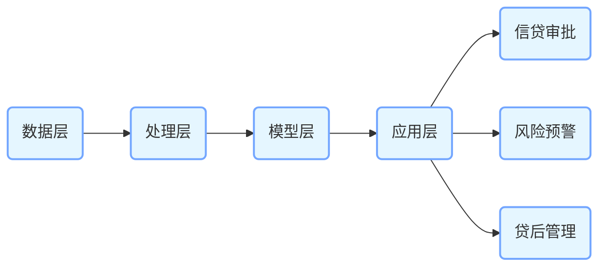

# 智能供应链金融风险评估

> 关键词：智能供应链金融、风险评估、数据挖掘、机器学习、信用风险、操作风险、市场风险

> 摘要：本文围绕智能供应链金融风险评估展开深入探讨。首先介绍了智能供应链金融风险评估的背景，包括目的、预期读者、文档结构等内容。接着阐述了核心概念及联系，剖析了相关原理与架构。详细讲解了核心算法原理和具体操作步骤，并给出Python代码示例。通过数学模型和公式进一步揭示风险评估的本质，结合实际案例进行说明。同时介绍了项目实战的开发环境搭建、代码实现与解读。探讨了智能供应链金融风险评估的实际应用场景，推荐了学习资源、开发工具框架以及相关论文著作。最后总结了未来发展趋势与挑战，解答常见问题并提供扩展阅读和参考资料，旨在为智能供应链金融风险评估领域的研究和实践提供全面而深入的指导。

## 1. 背景介绍 
### 1.1 目的和范围
智能供应链金融作为一种创新的金融模式，将供应链上的核心企业、上下游企业以及金融机构紧密联系在一起，实现了资金流、信息流和物流的有效整合。然而，这种模式也面临着诸多风险，如信用风险、操作风险、市场风险等。本文章的目的在于全面深入地探讨智能供应链金融风险评估的相关理论、方法和技术，为金融机构、供应链企业以及相关研究人员提供系统的风险评估解决方案。

范围涵盖智能供应链金融风险评估的基本概念、核心算法、数学模型、实际应用案例等方面，从理论到实践，全方位剖析智能供应链金融风险评估的各个环节。

### 1.2 预期读者
本文预期读者包括金融机构的风险管理专家、信贷审批人员、供应链企业的管理人员、物流企业的相关人员以及从事供应链金融、风险管理、数据分析等领域的研究人员和学生。对于希望了解智能供应链金融风险评估技术和方法的人士，本文将提供有价值的参考。

### 1.3 文档结构概述
本文共分为十个部分。第一部分为背景介绍，阐述了文章的目的、预期读者和文档结构。第二部分介绍核心概念与联系，剖析智能供应链金融风险评估的基本原理和架构。第三部分详细讲解核心算法原理和具体操作步骤，并给出Python代码示例。第四部分介绍数学模型和公式，结合实例进行详细讲解。第五部分为项目实战，包括开发环境搭建、源代码实现和代码解读。第六部分探讨实际应用场景。第七部分推荐相关的学习资源、开发工具框架和论文著作。第八部分总结未来发展趋势与挑战。第九部分为附录，解答常见问题。第十部分提供扩展阅读和参考资料。

### 1.4 术语表
#### 1.4.1 核心术语定义
- **智能供应链金融**：利用先进的信息技术，如大数据、人工智能、区块链等，对供应链中的资金流、信息流和物流进行整合和优化，为供应链上的企业提供综合性金融服务的一种新型金融模式。
- **风险评估**：对可能影响目标实现的各种不确定性因素进行识别、分析和评价的过程，旨在确定风险的性质、程度和可能性，为风险应对提供依据。
- **信用风险**：指借款人或交易对手未能履行合同约定的义务而导致金融机构或其他债权人遭受损失的风险。
- **操作风险**：指由于不完善或有问题的内部程序、员工和信息科技系统，以及外部事件所造成损失的风险。
- **市场风险**：指因市场价格（利率、汇率、股票价格和商品价格）的不利变动而使金融机构表内和表外业务发生损失的风险。

#### 1.4.2 相关概念解释
- **供应链**：围绕核心企业，通过对信息流、物流、资金流的控制，从采购原材料开始，制成中间产品以及最终产品，最后由销售网络把产品送到消费者手中的将供应商、制造商、分销商、零售商、直到最终用户连成一个整体的功能网链结构。
- **金融科技**：指技术带来的金融创新，它能创造新的业务模式、应用、流程或产品，从而对金融市场、金融机构或金融服务的提供方式造成重大影响。

#### 1.4.3 缩略词列表
- **AI**：Artificial Intelligence，人工智能
- **ML**：Machine Learning，机器学习
- **DL**：Deep Learning，深度学习
- **API**：Application Programming Interface，应用程序编程接口
- **RNN**：Recurrent Neural Network，循环神经网络

## 2. 核心概念与联系 
### 核心概念原理
智能供应链金融风险评估的核心原理在于综合运用多源数据和先进的数据分析技术，对供应链金融业务中的各种风险进行全面、准确的识别、度量和评价。其基于供应链的网络结构和业务流程，通过挖掘供应链中各参与方之间的关系和交易数据，构建风险评估模型，以预测和防范潜在的风险。

在智能供应链金融中，数据是风险评估的基础。这些数据包括企业的财务数据、交易数据、物流数据、信用评级数据等。通过对这些数据的收集、整理和分析，可以提取出与风险相关的特征信息，如企业的偿债能力、盈利能力、运营能力等。

同时，利用人工智能和机器学习算法，如逻辑回归、决策树、随机森林、神经网络等，可以对提取的特征信息进行建模和预测，从而实现对风险的量化评估。

### 架构的文本示意图
智能供应链金融风险评估架构主要包括数据层、处理层、模型层和应用层。

数据层：负责收集和存储供应链金融业务中的各种数据，包括企业内部数据、外部数据（如征信数据、行业数据等）和实时数据（如交易数据、物流数据等）。

处理层：对数据层收集到的数据进行清洗、转换和特征工程处理，以提高数据的质量和可用性。

模型层：利用机器学习和深度学习算法，对处理后的数据进行建模和训练，构建风险评估模型。

应用层：将训练好的风险评估模型应用于实际业务中，如信贷审批、风险预警、贷后管理等。

### Mermaid 流程图


## 3. 核心算法原理 & 具体操作步骤 
### 逻辑回归算法原理
逻辑回归是一种常用的分类算法，用于预测二分类问题的概率。其基本原理是通过线性回归模型计算输入特征的线性组合，然后将该线性组合通过逻辑函数（也称为Sigmoid函数）映射到[0, 1]区间，得到事件发生的概率。

逻辑函数的表达式为：
$$\sigma(z)=\frac{1}{1 + e^{-z}}$$
其中，$z$ 是输入特征的线性组合，即 $z = \theta_0 + \theta_1x_1 + \theta_2x_2 + \cdots + \theta_nx_n$，$\theta_i$ 是模型的参数，$x_i$ 是输入特征。

逻辑回归模型的目标是找到一组最优的参数 $\theta$，使得模型对训练数据的预测概率与实际标签之间的损失最小。常用的损失函数是对数损失函数（也称为交叉熵损失函数）：
$$L(\theta)=-\frac{1}{m}\sum_{i = 1}^{m}[y^{(i)}\log(\sigma(z^{(i)}))+(1 - y^{(i)})\log(1 - \sigma(z^{(i)}))]$$
其中，$m$ 是训练样本的数量，$y^{(i)}$ 是第 $i$ 个样本的实际标签，$\sigma(z^{(i)})$ 是模型对第 $i$ 个样本的预测概率。

### 具体操作步骤
1. **数据收集**：收集供应链金融业务中的相关数据，包括企业的财务数据、交易数据、信用评级数据等。
2. **数据预处理**：对收集到的数据进行清洗、转换和特征工程处理，以提高数据的质量和可用性。
3. **特征选择**：从预处理后的数据中选择与风险评估相关的特征，以减少模型的复杂度和提高模型的性能。
4. **模型训练**：使用训练数据对逻辑回归模型进行训练，调整模型的参数，使得模型的损失函数最小。
5. **模型评估**：使用测试数据对训练好的模型进行评估，计算模型的准确率、召回率、F1值等指标，以评估模型的性能。
6. **模型应用**：将训练好的模型应用于实际业务中，如信贷审批、风险预警等。

### Python 源代码实现
```python
import numpy as np
from sklearn.linear_model import LogisticRegression
from sklearn.model_selection import train_test_split
from sklearn.metrics import accuracy_score, recall_score, f1_score

# 生成示例数据
np.random.seed(42)
X = np.random.randn(100, 5)
y = np.random.randint(0, 2, 100)

# 划分训练集和测试集
X_train, X_test, y_train, y_test = train_test_split(X, y, test_size=0.2, random_state=42)

# 创建逻辑回归模型
model = LogisticRegression()

# 训练模型
model.fit(X_train, y_train)

# 预测
y_pred = model.predict(X_test)

# 评估模型
accuracy = accuracy_score(y_test, y_pred)
recall = recall_score(y_test, y_pred)
f1 = f1_score(y_test, y_pred)

print(f"Accuracy: {accuracy}")
print(f"Recall: {recall}")
print(f"F1-score: {f1}")
```

## 4. 数学模型和公式 & 详细讲解 & 举例说明 
### 信用风险评估的数学模型
信用风险评估是智能供应链金融风险评估的重要组成部分。常用的信用风险评估模型包括Z-score模型、KMV模型等。

#### Z-score模型
Z-score模型是由美国纽约大学斯特恩商学院的教授爱德华·奥特曼（Edward Altman）在1968年提出的一种多变量信用风险判别模型。该模型通过对多个财务比率进行加权平均，得到一个综合的Z值，用于判断企业是否存在财务危机。

Z-score模型的计算公式为：
$$Z = 1.2X_1 + 1.4X_2 + 3.3X_3 + 0.6X_4 + 0.999X_5$$
其中，$X_1$ 是营运资本/总资产，反映企业的流动性；$X_2$ 是留存收益/总资产，反映企业的积累能力；$X_3$ 是息税前利润/总资产，反映企业的盈利能力；$X_4$ 是股票市值/总负债，反映企业的市场价值；$X_5$ 是销售收入/总资产，反映企业的营运能力。

根据Z值的大小，可以将企业分为不同的信用等级：
- $Z \geq 2.99$：企业财务状况良好，信用风险较低。
- $1.81 \leq Z \lt 2.99$：企业财务状况一般，存在一定的信用风险。
- $Z \lt 1.81$：企业财务状况较差，信用风险较高。

#### 举例说明
假设某企业的财务数据如下：
- 营运资本/总资产 $X_1 = 0.2$
- 留存收益/总资产 $X_2 = 0.1$
- 息税前利润/总资产 $X_3 = 0.15$
- 股票市值/总负债 $X_4 = 1.5$
- 销售收入/总资产 $X_5 = 2$

将上述数据代入Z-score模型的计算公式，可得：
$$Z = 1.2\times0.2 + 1.4\times0.1 + 3.3\times0.15 + 0.6\times1.5 + 0.999\times2$$
$$Z = 0.24 + 0.14 + 0.495 + 0.9 + 1.998$$
$$Z = 3.773$$

由于 $Z = 3.773 \geq 2.99$，因此可以判断该企业财务状况良好，信用风险较低。

### 市场风险评估的数学模型
市场风险评估主要关注市场价格波动对供应链金融业务的影响。常用的市场风险评估方法包括VaR（Value at Risk）方法和CVaR（Conditional Value at Risk）方法。

#### VaR方法
VaR是指在一定的置信水平下，某一金融资产或投资组合在未来特定的一段时间内可能遭受的最大损失。其计算公式为：
$$VaR = \mu - z_{\alpha}\sigma$$
其中，$\mu$ 是资产或投资组合的预期收益率，$\sigma$ 是资产或投资组合的收益率标准差，$z_{\alpha}$ 是标准正态分布的分位数，对应于给定的置信水平 $\alpha$。

#### 举例说明
假设某投资组合的预期收益率 $\mu = 0.05$，收益率标准差 $\sigma = 0.1$，置信水平 $\alpha = 0.95$。查标准正态分布表可得，$z_{0.95} = 1.645$。

将上述数据代入VaR的计算公式，可得：
$$VaR = 0.05 - 1.645\times0.1$$
$$VaR = 0.05 - 0.1645$$
$$VaR = -0.1145$$

这意味着在95%的置信水平下，该投资组合在未来特定的一段时间内可能遭受的最大损失为11.45%。

## 5. 项目实战：代码实际案例和详细解释说明 
### 5.1  开发环境搭建
#### 操作系统
本项目可以在Windows、Linux或macOS等主流操作系统上进行开发。

#### Python环境
建议使用Python 3.7及以上版本。可以通过Anaconda或Python官方网站下载并安装Python。

#### 开发工具
推荐使用PyCharm或Jupyter Notebook作为开发工具。PyCharm是一款功能强大的Python集成开发环境，提供了代码编辑、调试、版本控制等功能；Jupyter Notebook是一种交互式的开发环境，适合进行数据分析和模型训练。

#### 相关库的安装
在项目中，我们需要使用一些Python库，如pandas、numpy、scikit-learn、matplotlib等。可以使用以下命令进行安装：
```bash
pip install pandas numpy scikit-learn matplotlib
```

### 5.2  源代码详细实现和代码解读
以下是一个基于逻辑回归算法的智能供应链金融风险评估的完整代码示例：
```python
import pandas as pd
import numpy as np
from sklearn.linear_model import LogisticRegression
from sklearn.model_selection import train_test_split
from sklearn.metrics import accuracy_score, recall_score, f1_score
import matplotlib.pyplot as plt

# 加载数据
data = pd.read_csv('supply_chain_finance_data.csv')

# 数据预处理
# 处理缺失值
data = data.dropna()

# 分离特征和标签
X = data.drop('risk_label', axis=1)
y = data['risk_label']

# 划分训练集和测试集
X_train, X_test, y_train, y_test = train_test_split(X, y, test_size=0.2, random_state=42)

# 创建逻辑回归模型
model = LogisticRegression()

# 训练模型
model.fit(X_train, y_train)

# 预测
y_pred = model.predict(X_test)

# 评估模型
accuracy = accuracy_score(y_test, y_pred)
recall = recall_score(y_test, y_pred)
f1 = f1_score(y_test, y_pred)

print(f"Accuracy: {accuracy}")
print(f"Recall: {recall}")
print(f"F1-score: {f1}")

# 绘制混淆矩阵
from sklearn.metrics import confusion_matrix
import seaborn as sns

cm = confusion_matrix(y_test, y_pred)
sns.heatmap(cm, annot=True, fmt='d', cmap='Blues')
plt.xlabel('Predicted')
plt.ylabel('Actual')
plt.title('Confusion Matrix')
plt.show()
```

### 5.3  代码解读与分析
1. **数据加载**：使用 `pandas` 库的 `read_csv` 函数加载供应链金融数据。
2. **数据预处理**：使用 `dropna` 函数处理缺失值，确保数据的完整性。
3. **特征和标签分离**：将数据集中的特征和标签分离，分别存储在 `X` 和 `y` 中。
4. **划分训练集和测试集**：使用 `train_test_split` 函数将数据集划分为训练集和测试集，测试集占比为20%。
5. **模型创建和训练**：创建逻辑回归模型，并使用训练集对模型进行训练。
6. **模型预测和评估**：使用训练好的模型对测试集进行预测，并计算准确率、召回率和F1值等评估指标。
7. **绘制混淆矩阵**：使用 `seaborn` 库绘制混淆矩阵，直观地展示模型的预测结果。

## 6. 实际应用场景 
### 信贷审批
在智能供应链金融中，金融机构可以利用风险评估模型对供应链上的企业进行信贷审批。通过对企业的财务数据、交易数据、信用评级数据等进行分析，评估企业的信用风险和还款能力，从而决定是否给予贷款以及贷款的额度和利率。

### 风险预警
通过实时监测供应链上的各种数据，如企业的经营状况、市场价格波动、物流信息等，利用风险评估模型及时发现潜在的风险，并发出预警信号。金融机构和供应链企业可以根据预警信息采取相应的措施，如调整信贷策略、加强风险管理等，以降低风险损失。

### 贷后管理
在贷款发放后，金融机构可以利用风险评估模型对企业的还款情况进行跟踪和评估。通过对企业的财务数据、交易数据等进行实时监测，及时发现企业的还款风险，并采取相应的措施，如催收、调整还款计划等，以确保贷款的安全回收。

### 供应链优化
通过对供应链上的风险进行评估和分析，企业可以发现供应链中的薄弱环节和潜在风险，从而采取相应的措施进行优化。例如，企业可以选择更可靠的供应商、优化物流配送方案、加强与合作伙伴的合作等，以提高供应链的稳定性和效率。

## 7. 工具和资源推荐
### 7.1 学习资源推荐
#### 7.1.1 书籍推荐
- 《供应链金融：新经济下的新金融》：本书全面介绍了供应链金融的基本概念、业务模式、风险管理等方面的内容，是学习供应链金融的经典教材。
- 《Python机器学习》：本书详细介绍了Python在机器学习领域的应用，包括数据预处理、模型选择、模型训练和评估等方面的内容，适合初学者学习。
- 《信用风险评估与管理》：本书系统地介绍了信用风险评估的理论、方法和技术，以及信用风险管理的策略和措施，是学习信用风险评估的重要参考书籍。

#### 7.1.2 在线课程
- Coursera上的“Machine Learning”：由斯坦福大学教授Andrew Ng主讲，是一门经典的机器学习课程，适合初学者学习。
- edX上的“Data Science MicroMasters Program”：该课程涵盖了数据科学的各个方面，包括数据预处理、机器学习、深度学习等，是学习数据科学的系统课程。
- 中国大学MOOC上的“供应链金融”：由国内知名高校的教授主讲，系统地介绍了供应链金融的理论和实践，适合对供应链金融感兴趣的人士学习。

#### 7.1.3 技术博客和网站
- Kaggle：一个数据科学和机器学习的竞赛平台，提供了丰富的数据集、代码示例和技术文章，是学习数据科学和机器学习的重要资源。
- Towards Data Science：一个专注于数据科学和机器学习的技术博客，提供了大量的高质量技术文章和教程，适合学习和交流。
- 知乎：一个知识分享平台，有很多关于供应链金融、风险管理、数据分析等领域的专业人士分享经验和见解，可以作为学习和交流的参考。

### 7.2 开发工具框架推荐
#### 7.2.1 IDE和编辑器
- PyCharm：一款功能强大的Python集成开发环境，提供了代码编辑、调试、版本控制等功能，适合专业的Python开发者使用。
- Jupyter Notebook：一种交互式的开发环境，适合进行数据分析和模型训练，支持多种编程语言，如Python、R等。
- Visual Studio Code：一款轻量级的代码编辑器，支持多种编程语言和插件，具有丰富的功能和扩展能力，适合初学者和专业开发者使用。

#### 7.2.2 调试和性能分析工具
- PDB：Python自带的调试工具，可以帮助开发者在代码中设置断点、查看变量值等，进行代码调试。
- cProfile：Python的性能分析工具，可以帮助开发者分析代码的性能瓶颈，找出耗时较长的函数和代码段。
- Py-Spy：一个基于Python的性能分析工具，可以实时监测Python程序的性能，提供详细的性能分析报告。

#### 7.2.3 相关框架和库
- Scikit-learn：一个简单易用的机器学习库，提供了丰富的机器学习算法和工具，如分类、回归、聚类等，适合初学者和专业开发者使用。
- TensorFlow：一个开源的深度学习框架，由Google开发，提供了丰富的深度学习算法和工具，如神经网络、卷积神经网络、循环神经网络等，适合进行深度学习研究和开发。
- PyTorch：一个开源的深度学习框架，由Facebook开发，提供了动态图和静态图两种编程模式，具有较高的灵活性和效率，适合进行深度学习研究和开发。

### 7.3 相关论文著作推荐
#### 7.3.1 经典论文
- Altman, E. I. (1968). Financial ratios, discriminant analysis and the prediction of corporate bankruptcy. Journal of finance, 23(4), 589-609.：该论文提出了Z-score模型，是信用风险评估领域的经典论文。
- Vasicek, O. A. (1987). Probability of loss on loan portfolios. Working paper.：该论文提出了Vasicek模型，是信用风险度量领域的重要论文。
- Jarrow, R. A., & Turnbull, S. M. (1995). Pricing derivatives on financial securities subject to credit risk. The Journal of finance, 50(1), 53-85.：该论文提出了Jarrow-Turnbull模型，是信用风险定价领域的经典论文。

#### 7.3.2 最新研究成果
- 近年来，随着人工智能、大数据、区块链等技术的发展，智能供应链金融风险评估领域的研究取得了很多新的成果。例如，一些学者利用深度学习算法对供应链金融风险进行评估，取得了较好的效果；一些学者利用区块链技术构建供应链金融信用体系，提高了供应链金融的安全性和透明度。

#### 7.3.3 应用案例分析
- 一些金融机构和企业在智能供应链金融风险评估方面进行了实践探索，取得了一些成功的经验。例如，平安银行通过构建智能供应链金融平台，利用大数据和人工智能技术对供应链上的企业进行风险评估，提高了信贷审批的效率和准确性；海尔集团通过构建供应链金融生态系统，利用区块链技术实现了供应链上的信息共享和信用传递，降低了供应链金融的风险。

## 8. 总结：未来发展趋势与挑战
### 未来发展趋势
#### 技术创新驱动
随着人工智能、大数据、区块链、物联网等技术的不断发展和创新，智能供应链金融风险评估将迎来更多的技术应用和创新。例如，利用深度学习算法可以更准确地挖掘数据中的潜在信息，提高风险评估的准确性；利用区块链技术可以实现供应链上的信息共享和信用传递，降低信息不对称带来的风险。

#### 生态化发展
智能供应链金融将朝着生态化方向发展，形成一个由金融机构、供应链企业、科技公司、物流企业等多方参与的生态系统。各方通过资源共享、优势互补，实现供应链金融业务的协同发展，提高供应链金融的效率和竞争力。

#### 国际化发展
随着经济全球化的深入发展，智能供应链金融将逐渐走向国际化。金融机构和企业将更加注重国际市场的开拓和合作，开展跨境供应链金融业务。同时，国际间的供应链金融标准和规则也将逐渐统一，促进智能供应链金融的国际化发展。

### 挑战
#### 数据质量和安全问题
智能供应链金融风险评估依赖于大量的数据，数据的质量和安全直接影响风险评估的准确性和可靠性。然而，目前数据质量参差不齐，存在数据缺失、错误、不一致等问题；同时，数据安全也面临着严峻的挑战，如数据泄露、数据篡改等。

#### 技术应用难度
虽然人工智能、大数据、区块链等技术为智能供应链金融风险评估提供了有力的支持，但这些技术的应用也面临着一定的难度。例如，深度学习算法需要大量的计算资源和专业的技术人员，区块链技术的应用还面临着性能、兼容性等问题。

#### 监管政策不完善
智能供应链金融是一种创新的金融模式，目前相关的监管政策还不完善。这可能导致一些金融机构和企业在开展智能供应链金融业务时存在合规风险，同时也不利于智能供应链金融的健康发展。

## 9. 附录：常见问题与解答
### 问题1：智能供应链金融风险评估与传统供应链金融风险评估有什么区别？
解答：智能供应链金融风险评估利用了先进的信息技术，如大数据、人工智能、区块链等，能够更全面、准确地收集和分析数据，挖掘数据中的潜在信息，从而提高风险评估的准确性和可靠性。而传统供应链金融风险评估主要依赖于人工经验和简单的数据分析方法，存在信息不全面、分析不深入等问题。

### 问题2：如何选择合适的风险评估模型？
解答：选择合适的风险评估模型需要考虑多个因素，如数据类型、数据规模、问题复杂度、模型性能等。一般来说，可以先对数据进行分析和预处理，然后选择几种不同的模型进行训练和评估，比较它们的性能指标，选择性能最优的模型。同时，还可以结合实际业务需求和经验，选择合适的模型。

### 问题3：智能供应链金融风险评估中如何保证数据的安全？
解答：为了保证数据的安全，可以采取以下措施：
- 数据加密：对敏感数据进行加密处理，防止数据在传输和存储过程中被泄露。
- 访问控制：设置严格的访问权限，只有授权人员才能访问和处理数据。
- 数据备份：定期对数据进行备份，防止数据丢失。
- 安全审计：对数据的访问和处理进行审计，及时发现和处理安全问题。

### 问题4：智能供应链金融风险评估模型的性能如何评估？
解答：智能供应链金融风险评估模型的性能可以通过多种指标进行评估，如准确率、召回率、F1值、AUC值等。准确率反映了模型预测正确的样本占总样本的比例；召回率反映了模型正确预测正样本的比例；F1值是准确率和召回率的调和平均数，综合考虑了准确率和召回率；AUC值是ROC曲线下的面积，反映了模型的分类能力。

## 10. 扩展阅读 & 参考资料
### 扩展阅读
- 《区块链：重塑经济与世界》：本书介绍了区块链技术的基本原理、应用场景和发展趋势，对于理解区块链在智能供应链金融中的应用有很大的帮助。
- 《人工智能：现代方法》：本书系统地介绍了人工智能的基本概念、算法和技术，对于学习人工智能在智能供应链金融风险评估中的应用有很大的帮助。
- 《大数据时代：生活、工作与思维的大变革》：本书介绍了大数据的基本概念、特点和应用，对于理解大数据在智能供应链金融中的应用有很大的帮助。

### 参考资料
- 相关的学术论文、研究报告、行业标准和政策文件等。
- 金融机构和企业的官方网站、年报、公告等。
- 专业的金融资讯网站、财经媒体等。