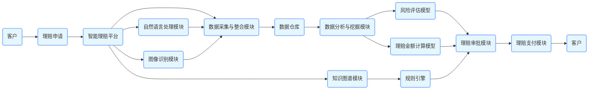

# 智能保险理赔快速处理系统

> 关键词：智能保险理赔、快速处理系统、人工智能、机器学习、大数据、流程自动化、理赔效率

> 摘要：本文围绕智能保险理赔快速处理系统展开，深入探讨其背景、核心概念、算法原理、数学模型、项目实战、实际应用场景等多个方面。旨在详细阐述该系统如何利用先进的人工智能、机器学习和大数据技术，实现保险理赔流程的自动化和高效化，提高理赔处理速度和准确性，降低成本，为保险行业带来新的变革和发展机遇。同时，分析系统面临的挑战和未来发展趋势，为相关领域的研究和实践提供全面而深入的参考。

## 1. 背景介绍 
### 1.1 目的和范围
传统的保险理赔处理流程往往繁琐且耗时，涉及大量的人工审核、数据收集和处理工作，容易出现人为错误，导致理赔效率低下，客户满意度不高。智能保险理赔快速处理系统的目的在于利用现代信息技术，如人工智能、机器学习、大数据等，对保险理赔流程进行优化和自动化，实现快速、准确、公正的理赔处理。

本系统的范围涵盖了从客户提交理赔申请开始，到理赔结果通知的整个理赔处理过程，包括理赔申请受理、信息收集与验证、风险评估、理赔金额计算、理赔审批和支付等环节。

### 1.2 预期读者
本文的预期读者包括保险行业的从业者，如理赔专员、保险分析师、业务管理人员等，他们可以通过本文了解智能保险理赔快速处理系统的原理和实现方法，以便在实际工作中应用和推广该系统。同时，对于对人工智能、机器学习等技术在金融领域应用感兴趣的研究人员、学生和技术爱好者，本文也提供了一个深入了解该领域的机会。

### 1.3 文档结构概述
本文将按照以下结构进行组织：首先介绍智能保险理赔快速处理系统的背景信息，包括目的、预期读者和文档结构概述；接着阐述系统的核心概念与联系，包括相关原理和架构；然后详细讲解系统所涉及的核心算法原理和具体操作步骤，并给出Python源代码示例；再介绍系统的数学模型和公式，通过具体例子进行说明；之后通过项目实战，展示系统的实际实现过程和代码解读；随后分析系统的实际应用场景；推荐相关的工具和资源；最后总结系统的未来发展趋势与挑战，并提供常见问题与解答以及扩展阅读和参考资料。

### 1.4 术语表
#### 1.4.1 核心术语定义
- **智能保险理赔**：利用人工智能、机器学习等技术，对保险理赔过程进行自动化处理和决策支持，提高理赔效率和准确性。
- **快速处理系统**：通过优化流程、自动化操作和利用先进技术，实现保险理赔的快速处理。
- **人工智能（AI）**：研究如何使计算机能够模拟人类的智能行为，如学习、推理、决策等。
- **机器学习（ML）**：人工智能的一个分支，通过让计算机从数据中学习模式和规律，从而实现预测和决策。
- **大数据**：指海量、高增长率和多样化的信息资产，需要新的处理模式来具有更强的决策力、洞察发现力和流程优化能力。

#### 1.4.2 相关概念解释
- **理赔申请受理**：接收客户提交的理赔申请，并对申请信息进行初步审核和登记。
- **信息收集与验证**：收集与理赔相关的各种信息，如医疗记录、事故报告等，并对信息的真实性和完整性进行验证。
- **风险评估**：根据客户的理赔申请和相关信息，评估理赔事件的风险程度，为理赔决策提供依据。
- **理赔金额计算**：根据保险合同条款和理赔事件的实际情况，计算应赔付的金额。
- **理赔审批**：对理赔申请和相关计算结果进行审核和批准，决定是否给予理赔以及理赔的金额。
- **理赔支付**：在理赔申请获得批准后，将理赔款项支付给客户。

#### 1.4.3 缩略词列表
- **AI**：Artificial Intelligence（人工智能）
- **ML**：Machine Learning（机器学习）
- **OCR**：Optical Character Recognition（光学字符识别）
- **NLP**：Natural Language Processing（自然语言处理）

## 2. 核心概念与联系 
智能保险理赔快速处理系统的核心概念主要包括人工智能、机器学习、大数据、流程自动化等，这些概念相互关联，共同构成了系统的基础。

### 核心概念原理
- **人工智能**：人工智能是实现智能保险理赔的关键技术，它通过模拟人类的智能行为，使计算机能够自动处理和分析理赔相关的信息。例如，利用自然语言处理技术，计算机可以理解客户的理赔申请文本，提取关键信息；利用图像识别技术，计算机可以识别事故现场照片、医疗影像等，获取有用信息。
- **机器学习**：机器学习是人工智能的重要分支，它通过让计算机从大量的历史理赔数据中学习模式和规律，从而实现对新的理赔申请的预测和决策。例如，通过训练分类模型，计算机可以判断理赔申请是否合理；通过训练回归模型，计算机可以预测理赔金额。
- **大数据**：大数据为智能保险理赔提供了丰富的信息资源。保险行业积累了大量的客户信息、理赔记录、市场数据等，通过对这些数据的挖掘和分析，可以发现潜在的风险和规律，为理赔决策提供更准确的依据。
- **流程自动化**：流程自动化是提高理赔处理效率的重要手段。通过将理赔流程中的各个环节进行自动化处理，减少人工干预，可以大大缩短理赔处理时间，提高客户满意度。例如，利用工作流引擎，自动分配理赔任务、跟踪处理进度；利用机器人流程自动化（RPA）技术，自动完成数据录入、信息查询等重复性工作。

### 架构示意图
以下是智能保险理赔快速处理系统的架构示意图：



### 架构说明
- **客户**：提交理赔申请的主体。
- **理赔申请**：客户通过线上或线下渠道提交的理赔请求。
- **智能理赔平台**：整个系统的核心，负责协调各个模块的工作。
- **数据采集与整合模块**：收集与理赔相关的各种数据，包括客户信息、理赔申请信息、医疗记录、事故报告等，并进行整合和清洗。
- **数据仓库**：存储经过处理和整合的理赔数据，为数据分析和挖掘提供数据支持。
- **数据分析与挖掘模块**：利用机器学习、数据挖掘等技术，对理赔数据进行分析和挖掘，发现潜在的风险和规律，训练风险评估模型和理赔金额计算模型。
- **风险评估模型**：根据理赔申请和相关数据，评估理赔事件的风险程度，为理赔审批提供参考。
- **理赔金额计算模型**：根据保险合同条款和理赔事件的实际情况，计算应赔付的金额。
- **理赔审批模块**：对理赔申请和相关计算结果进行审核和批准，决定是否给予理赔以及理赔的金额。
- **理赔支付模块**：在理赔申请获得批准后，将理赔款项支付给客户。
- **知识图谱模块**：构建保险领域的知识图谱，为理赔决策提供知识支持。
- **规则引擎**：根据保险合同条款和业务规则，对理赔申请进行自动审核和决策。
- **自然语言处理模块**：对理赔申请文本进行处理和分析，提取关键信息。
- **图像识别模块**：对事故现场照片、医疗影像等进行识别和分析，获取有用信息。

## 3. 核心算法原理 & 具体操作步骤 
### 核心算法原理
智能保险理赔快速处理系统涉及多种核心算法，下面以风险评估和理赔金额计算为例进行详细讲解。

#### 风险评估算法 - 逻辑回归
逻辑回归是一种常用的分类算法，用于预测事件发生的概率。在风险评估中，我们可以将理赔申请分为高风险和低风险两类，通过逻辑回归模型预测理赔申请属于高风险类别的概率。

逻辑回归的基本原理是通过线性回归模型计算一个线性组合 $z = \theta_0 + \theta_1x_1 + \theta_2x_2 + \cdots + \theta_nx_n$，其中 $\theta_i$ 是模型的参数，$x_i$ 是输入特征。然后将 $z$ 代入逻辑函数 $\sigma(z) = \frac{1}{1 + e^{-z}}$ 中，得到事件发生的概率 $P(y = 1|x) = \sigma(z)$。

#### 理赔金额计算算法 - 线性回归
线性回归是一种常用的回归算法，用于预测连续变量的值。在理赔金额计算中，我们可以根据理赔事件的相关特征，如事故类型、损失程度等，通过线性回归模型预测应赔付的金额。

线性回归的基本原理是通过最小化预测值与实际值之间的误差平方和，找到最优的模型参数 $\theta$。具体来说，对于一个包含 $m$ 个样本的数据集 $\{(x^{(1)}, y^{(1)}), (x^{(2)}, y^{(2)}), \cdots, (x^{(m)}, y^{(m)})\}$，线性回归模型的预测值为 $\hat{y}^{(i)} = \theta_0 + \theta_1x_1^{(i)} + \theta_2x_2^{(i)} + \cdots + \theta_nx_n^{(i)}$，误差平方和为 $J(\theta) = \frac{1}{2m}\sum_{i = 1}^{m}(\hat{y}^{(i)} - y^{(i)})^2$。通过最小化 $J(\theta)$，可以得到最优的参数 $\theta$。

### 具体操作步骤
#### 数据准备
首先，需要收集和整理与理赔相关的历史数据，包括客户信息、理赔申请信息、事故记录、医疗记录等。然后对数据进行清洗和预处理，如去除缺失值、处理异常值、进行特征编码等。

#### 特征工程
从原始数据中提取有用的特征，如客户年龄、性别、保险类型、事故类型、损失程度等。可以使用特征选择和特征变换等方法，对特征进行筛选和优化，提高模型的性能。

#### 模型训练
将预处理后的数据分为训练集和测试集，使用训练集对逻辑回归和线性回归模型进行训练。在训练过程中，需要选择合适的优化算法，如梯度下降法，来最小化损失函数。

#### 模型评估
使用测试集对训练好的模型进行评估，计算模型的准确率、召回率、均方误差等指标，评估模型的性能。如果模型的性能不理想，可以调整模型的参数或使用其他算法进行优化。

#### 模型部署
将训练好的模型部署到智能保险理赔快速处理系统中，用于实际的风险评估和理赔金额计算。在实际应用中，需要不断收集新的数据，对模型进行更新和优化，提高模型的性能和适应性。

### Python源代码示例
```python
import numpy as np
from sklearn.linear_model import LogisticRegression, LinearRegression
from sklearn.model_selection import train_test_split
from sklearn.metrics import accuracy_score, mean_squared_error

# 生成示例数据
np.random.seed(42)
X = np.random.rand(100, 5)  # 特征矩阵
y_risk = np.random.randint(0, 2, 100)  # 风险标签
y_amount = np.random.rand(100) * 1000  # 理赔金额

# 划分训练集和测试集
X_train, X_test, y_risk_train, y_risk_test, y_amount_train, y_amount_test = train_test_split(
    X, y_risk, y_amount, test_size=0.2, random_state=42
)

# 风险评估模型 - 逻辑回归
risk_model = LogisticRegression()
risk_model.fit(X_train, y_risk_train)
y_risk_pred = risk_model.predict(X_test)
risk_accuracy = accuracy_score(y_risk_test, y_risk_pred)
print(f"风险评估模型准确率: {risk_accuracy}")

# 理赔金额计算模型 - 线性回归
amount_model = LinearRegression()
amount_model.fit(X_train, y_amount_train)
y_amount_pred = amount_model.predict(X_test)
amount_mse = mean_squared_error(y_amount_test, y_amount_pred)
print(f"理赔金额计算模型均方误差: {amount_mse}")
```

## 4. 数学模型和公式 & 详细讲解 & 举例说明 
### 逻辑回归数学模型和公式
逻辑回归的数学模型可以表示为：

$$P(y = 1|x) = \sigma(\theta^T x) = \frac{1}{1 + e^{-\theta^T x}}$$

其中，$P(y = 1|x)$ 表示在给定特征 $x$ 的情况下，事件 $y = 1$ 发生的概率，$\theta$ 是模型的参数，$x$ 是输入特征向量。

逻辑回归的损失函数通常使用对数损失函数，也称为交叉熵损失函数，其公式为：

$$J(\theta) = -\frac{1}{m}\sum_{i = 1}^{m}[y^{(i)}\log(P(y^{(i)} = 1|x^{(i)})) + (1 - y^{(i)})\log(1 - P(y^{(i)} = 1|x^{(i)}))]$$

其中，$m$ 是样本数量，$y^{(i)}$ 是第 $i$ 个样本的真实标签，$P(y^{(i)} = 1|x^{(i)})$ 是第 $i$ 个样本的预测概率。

为了最小化损失函数 $J(\theta)$，可以使用梯度下降法，其更新公式为：

$$\theta_j := \theta_j - \alpha\frac{\partial J(\theta)}{\partial \theta_j}$$

其中，$\alpha$ 是学习率，$\frac{\partial J(\theta)}{\partial \theta_j}$ 是损失函数 $J(\theta)$ 对参数 $\theta_j$ 的偏导数。

### 线性回归数学模型和公式
线性回归的数学模型可以表示为：

$$\hat{y} = \theta_0 + \theta_1x_1 + \theta_2x_2 + \cdots + \theta_nx_n = \theta^T x$$

其中，$\hat{y}$ 是预测值，$\theta$ 是模型的参数，$x$ 是输入特征向量。

线性回归的损失函数通常使用均方误差（MSE），其公式为：

$$J(\theta) = \frac{1}{2m}\sum_{i = 1}^{m}(\hat{y}^{(i)} - y^{(i)})^2$$

其中，$m$ 是样本数量，$\hat{y}^{(i)}$ 是第 $i$ 个样本的预测值，$y^{(i)}$ 是第 $i$ 个样本的真实值。

为了最小化损失函数 $J(\theta)$，可以使用梯度下降法，其更新公式为：

$$\theta_j := \theta_j - \alpha\frac{\partial J(\theta)}{\partial \theta_j}$$

其中，$\alpha$ 是学习率，$\frac{\partial J(\theta)}{\partial \theta_j}$ 是损失函数 $J(\theta)$ 对参数 $\theta_j$ 的偏导数。

### 举例说明
假设我们有一个简单的保险理赔数据集，包含两个特征：客户年龄 $x_1$ 和事故严重程度 $x_2$，以及一个目标变量：是否为高风险理赔 $y$（$y = 1$ 表示高风险，$y = 0$ 表示低风险）。

数据集如下：

| 客户年龄 $x_1$ | 事故严重程度 $x_2$ | 是否为高风险理赔 $y$ |
|---|---|---|
| 25 | 3 | 0 |
| 35 | 5 | 1 |
| 45 | 7 | 1 |
| 55 | 4 | 0 |

我们可以使用逻辑回归模型来预测是否为高风险理赔。首先，我们需要对数据进行预处理，将特征进行标准化处理：

```python
import numpy as np
from sklearn.preprocessing import StandardScaler
from sklearn.linear_model import LogisticRegression

# 数据
X = np.array([[25, 3], [35, 5], [45, 7], [55, 4]])
y = np.array([0, 1, 1, 0])

# 特征标准化
scaler = StandardScaler()
X_scaled = scaler.fit_transform(X)

# 训练逻辑回归模型
model = LogisticRegression()
model.fit(X_scaled, y)

# 预测新样本
new_sample = np.array([[30, 4]])
new_sample_scaled = scaler.transform(new_sample)
prediction = model.predict(new_sample_scaled)
print(f"预测结果: {prediction}")
```

在这个例子中，我们使用逻辑回归模型对新的样本进行了预测，得到了是否为高风险理赔的结果。

## 5. 项目实战：代码实际案例和详细解释说明 
### 5.1  开发环境搭建
#### 操作系统
可以选择常见的操作系统，如Windows、Linux或macOS。

#### 编程语言
选择Python作为开发语言，因为Python具有丰富的机器学习和数据分析库，如Scikit-learn、Pandas、NumPy等。

#### 开发工具
推荐使用Anaconda作为Python的集成开发环境，它包含了Python解释器、常用的库和工具，方便进行开发和管理。同时，可以使用Jupyter Notebook或PyCharm作为代码编辑器，进行代码的编写和调试。

#### 数据库
选择合适的数据库来存储理赔数据，如MySQL、PostgreSQL等。可以使用Python的数据库连接库，如`pymysql`、`psycopg2`等，来实现与数据库的交互。

### 5.2  源代码详细实现和代码解读
以下是一个简单的智能保险理赔快速处理系统的代码实现示例，包括数据预处理、模型训练和预测等步骤。

```python
import pandas as pd
from sklearn.model_selection import train_test_split
from sklearn.preprocessing import StandardScaler
from sklearn.linear_model import LogisticRegression, LinearRegression
from sklearn.metrics import accuracy_score, mean_squared_error

# 读取数据
data = pd.read_csv('insurance_claims.csv')

# 数据预处理
# 处理缺失值
data = data.dropna()

# 分离特征和目标变量
X = data.drop(['risk_label', 'claim_amount'], axis=1)
y_risk = data['risk_label']
y_amount = data['claim_amount']

# 特征编码
categorical_columns = X.select_dtypes(include=['object']).columns
X_encoded = pd.get_dummies(X, columns=categorical_columns)

# 特征标准化
scaler = StandardScaler()
X_scaled = scaler.fit_transform(X_encoded)

# 划分训练集和测试集
X_train, X_test, y_risk_train, y_risk_test, y_amount_train, y_amount_test = train_test_split(
    X_scaled, y_risk, y_amount, test_size=0.2, random_state=42
)

# 风险评估模型 - 逻辑回归
risk_model = LogisticRegression()
risk_model.fit(X_train, y_risk_train)
y_risk_pred = risk_model.predict(X_test)
risk_accuracy = accuracy_score(y_risk_test, y_risk_pred)
print(f"风险评估模型准确率: {risk_accuracy}")

# 理赔金额计算模型 - 线性回归
amount_model = LinearRegression()
amount_model.fit(X_train, y_amount_train)
y_amount_pred = amount_model.predict(X_test)
amount_mse = mean_squared_error(y_amount_test, y_amount_pred)
print(f"理赔金额计算模型均方误差: {amount_mse}")
```

### 代码解读与分析
1. **数据读取**：使用`pandas`库的`read_csv`函数读取保险理赔数据集。
2. **数据预处理**：
    - **处理缺失值**：使用`dropna`函数删除包含缺失值的行。
    - **分离特征和目标变量**：将数据集分为特征矩阵`X`和目标变量`y_risk`（风险标签）、`y_amount`（理赔金额）。
    - **特征编码**：对于分类特征，使用`get_dummies`函数进行独热编码。
    - **特征标准化**：使用`StandardScaler`函数对特征进行标准化处理，使特征具有相同的尺度。
3. **划分训练集和测试集**：使用`train_test_split`函数将数据集划分为训练集和测试集，比例为8:2。
4. **模型训练和预测**：
    - **风险评估模型**：使用逻辑回归模型进行风险评估，训练模型并预测测试集的风险标签，计算准确率。
    - **理赔金额计算模型**：使用线性回归模型进行理赔金额计算，训练模型并预测测试集的理赔金额，计算均方误差。

## 6. 实际应用场景 
智能保险理赔快速处理系统在保险行业具有广泛的实际应用场景，以下是一些主要的应用场景：

### 车险理赔
在车险理赔中，智能保险理赔快速处理系统可以快速处理客户的理赔申请，提高理赔效率。系统可以通过图像识别技术，自动识别事故现场照片，判断事故的真实性和严重程度；通过自然语言处理技术，理解客户的理赔描述，提取关键信息；通过风险评估模型，评估理赔事件的风险程度，为理赔审批提供参考；通过理赔金额计算模型，快速计算应赔付的金额。

### 健康险理赔
在健康险理赔中，智能保险理赔快速处理系统可以帮助保险公司快速审核客户的理赔申请，提高理赔的准确性和公正性。系统可以通过OCR技术，自动识别医疗记录、发票等文档，提取关键信息；通过知识图谱模块，对医疗信息进行语义理解和推理，判断理赔申请是否符合保险合同条款；通过风险评估模型，评估客户的健康风险，为理赔决策提供依据。

### 财产险理赔
在财产险理赔中，智能保险理赔快速处理系统可以提高理赔处理的速度和效率。系统可以通过物联网技术，实时获取财产的状态信息，如房屋的温度、湿度、水位等，及时发现潜在的风险；通过图像识别技术，对财产损失情况进行评估，确定理赔金额；通过流程自动化技术，自动分配理赔任务、跟踪处理进度，提高理赔处理的透明度和效率。

### 意外险理赔
在意外险理赔中，智能保险理赔快速处理系统可以快速响应客户的理赔需求，提高客户满意度。系统可以通过移动应用程序，让客户随时随地提交理赔申请，并上传相关的证据材料；通过人工智能技术，对理赔申请进行自动审核和评估，快速给出理赔结果；通过理赔支付模块，实现理赔款项的快速支付。

## 7. 工具和资源推荐
### 7.1 学习资源推荐
#### 7.1.1 书籍推荐
- 《Python机器学习》：这本书详细介绍了Python在机器学习领域的应用，包括数据预处理、模型训练、评估和优化等方面的内容，适合初学者入门。
- 《深度学习》：由深度学习领域的三位顶尖专家Ian Goodfellow、Yoshua Bengio和Aaron Courville合著，是深度学习领域的经典教材，适合有一定基础的读者深入学习。
- 《数据挖掘：概念与技术》：全面介绍了数据挖掘的基本概念、算法和应用，对于理解智能保险理赔快速处理系统中的数据分析和挖掘部分有很大帮助。

#### 7.1.2 在线课程
- Coursera上的“机器学习”课程：由斯坦福大学教授Andrew Ng讲授，是机器学习领域的经典课程，内容涵盖了机器学习的基本概念、算法和应用。
- edX上的“深度学习基础”课程：由微软公司的专家讲授，介绍了深度学习的基本原理和应用，包括神经网络、卷积神经网络、循环神经网络等。
- 阿里云天池平台的“人工智能实战”课程：提供了丰富的人工智能实战案例和教程，适合学习者进行实践和提高。

#### 7.1.3 技术博客和网站
- 博客园：是一个技术博客平台，有很多关于人工智能、机器学习、数据分析等领域的技术文章和经验分享。
- 知乎：是一个知识问答社区，有很多关于智能保险理赔、人工智能应用等方面的问题和解答，可以从中获取有用的信息和思路。
- Kaggle：是一个数据科学竞赛平台，提供了大量的数据集和竞赛项目，可以通过参与竞赛来提高自己的数据分析和建模能力。

### 7.2 开发工具框架推荐
#### 7.2.1 IDE和编辑器
- PyCharm：是一款专门为Python开发设计的集成开发环境，具有强大的代码编辑、调试、版本控制等功能，适合专业的Python开发者使用。
- Jupyter Notebook：是一个交互式的笔记本环境，支持多种编程语言，如Python、R等，可以方便地进行代码编写、数据可视化和文档撰写，适合数据科学家和研究者使用。
- Visual Studio Code：是一款轻量级的代码编辑器，支持多种编程语言和插件扩展，具有丰富的功能和良好的用户体验，适合初学者和快速开发。

#### 7.2.2 调试和性能分析工具
- PDB：是Python自带的调试器，可以帮助开发者在代码中设置断点、单步执行、查看变量值等，进行代码调试。
- cProfile：是Python的性能分析工具，可以统计代码的执行时间和函数调用次数，帮助开发者找出代码中的性能瓶颈。
- TensorBoard：是TensorFlow的可视化工具，可以用于可视化深度学习模型的训练过程、损失函数曲线、模型结构等，帮助开发者更好地理解和优化模型。

#### 7.2.3 相关框架和库
- Scikit-learn：是Python中常用的机器学习库，提供了丰富的机器学习算法和工具，如分类、回归、聚类、降维等，方便开发者进行模型训练和评估。
- TensorFlow：是一个开源的深度学习框架，由Google开发，支持多种深度学习模型，如神经网络、卷积神经网络、循环神经网络等，具有高效的计算能力和良好的可扩展性。
- PyTorch：是另一个开源的深度学习框架，由Facebook开发，具有简洁的API和动态计算图的特点，适合快速开发和研究。
- Pandas：是Python中常用的数据处理和分析库，提供了高效的数据结构和数据操作方法，如数据读取、清洗、转换、统计分析等，方便开发者处理和分析数据。

### 7.3 相关论文著作推荐
#### 7.3.1 经典论文
- “Gradient-based learning applied to document recognition”：由Yann LeCun等人发表，介绍了卷积神经网络（CNN）在手写数字识别中的应用，是深度学习领域的经典论文之一。
- “Long Short-Term Memory”：由Sepp Hochreiter和Jürgen Schmidhuber发表，提出了长短期记忆网络（LSTM），解决了传统循环神经网络（RNN）中的梯度消失问题，在自然语言处理等领域有广泛应用。
- “Deep Residual Learning for Image Recognition”：由Kaiming He等人发表，提出了残差网络（ResNet），通过引入残差块解决了深度神经网络中的梯度消失和退化问题，在图像识别领域取得了很好的效果。

#### 7.3.2 最新研究成果
- 关注顶级学术会议，如NeurIPS（神经信息处理系统大会）、ICML（国际机器学习会议）、CVPR（计算机视觉与模式识别会议）等，这些会议上的论文代表了人工智能领域的最新研究成果。
- 查阅相关的学术期刊，如Journal of Artificial Intelligence Research（JAIR）、Artificial Intelligence、IEEE Transactions on Pattern Analysis and Machine Intelligence（TPAMI）等，了解最新的研究动态和进展。

#### 7.3.3 应用案例分析
- 保险公司的官方网站和报告：许多保险公司会在其官方网站上发布智能保险理赔快速处理系统的应用案例和实践经验，可以从中了解系统的实际应用效果和优势。
- 行业研究报告：一些咨询公司和研究机构会发布关于保险行业数字化转型和智能理赔的研究报告，分析智能保险理赔快速处理系统的市场趋势、应用案例和发展前景。

## 8. 总结：未来发展趋势与挑战
### 未来发展趋势
- **更强大的人工智能技术应用**：随着人工智能技术的不断发展，智能保险理赔快速处理系统将更加智能化和自动化。例如，利用更先进的自然语言处理技术，实现对理赔申请文本的更准确理解和分析；利用更强大的图像识别技术，实现对复杂场景的更准确识别和评估；利用强化学习技术，实现对理赔决策的自动优化。
- **与物联网的深度融合**：物联网技术的发展将为智能保险理赔快速处理系统带来更多的数据来源和应用场景。例如，通过物联网设备实时获取保险标的的状态信息，如车辆的行驶数据、房屋的环境数据等，及时发现潜在的风险，提前进行预警和干预；在理赔发生时，通过物联网设备提供的实时数据，快速准确地评估损失情况，提高理赔效率。
- **个性化理赔服务**：未来的智能保险理赔快速处理系统将更加注重个性化服务。通过对客户的历史数据、行为模式、风险偏好等进行分析，为客户提供个性化的理赔方案和服务。例如，对于高风险客户，提供更加严格的风险评估和管理措施；对于低风险客户，提供更加便捷和快速的理赔服务。
- **跨行业合作与创新**：保险行业将与其他行业进行更广泛的合作与创新，共同推动智能保险理赔快速处理系统的发展。例如，与医疗行业合作，实现医疗数据的共享和互通，提高健康险理赔的准确性和效率；与汽车行业合作，实现车辆数据的实时获取和分析，优化车险理赔流程。

### 挑战
- **数据安全和隐私保护**：智能保险理赔快速处理系统涉及大量的客户敏感信息，如个人身份信息、医疗记录、财务信息等，数据安全和隐私保护是系统面临的重要挑战。需要采取有效的技术和管理措施，如加密技术、访问控制、数据脱敏等，确保客户数据的安全和隐私。
- **算法的可解释性和公正性**：人工智能算法在智能保险理赔快速处理系统中起着关键作用，但算法的可解释性和公正性是一个亟待解决的问题。由于算法的复杂性和黑箱性质，很难理解算法的决策过程和依据，可能导致不公平的理赔决策。需要研究和开发可解释的人工智能算法，提高算法的透明度和公正性。
- **法律法规和监管政策的适应性**：智能保险理赔快速处理系统的发展需要相应的法律法规和监管政策的支持和保障。但目前相关的法律法规和监管政策还不够完善，可能导致系统在应用过程中面临法律风险和合规挑战。需要加快相关法律法规和监管政策的制定和完善，为系统的发展提供良好的法律环境。
- **技术人才的短缺**：智能保险理赔快速处理系统的开发和应用需要具备人工智能、机器学习、数据分析等多方面技术的专业人才。但目前相关领域的技术人才短缺，限制了系统的发展和推广。需要加强相关领域的人才培养和引进，提高技术人才的素质和能力。

## 9. 附录：常见问题与解答
### 1. 智能保险理赔快速处理系统的准确性如何保证？
智能保险理赔快速处理系统通过多种方式保证准确性。首先，在数据层面，对收集到的大量历史理赔数据进行清洗和预处理，去除错误和缺失数据，提高数据质量。其次，在模型层面，使用多种机器学习和人工智能算法进行训练和优化，如逻辑回归、线性回归、决策树、神经网络等，并通过交叉验证、模型评估等方法选择最优模型。此外，还会引入专家知识和业务规则，对模型的预测结果进行校验和调整，确保理赔决策的准确性和公正性。

### 2. 系统如何处理复杂的理赔案件？
对于复杂的理赔案件，智能保险理赔快速处理系统会采用多种策略进行处理。一方面，系统会利用自然语言处理和图像识别等技术，对复杂的理赔申请文本和相关证据材料进行深入分析，提取关键信息；另一方面，系统会结合知识图谱和规则引擎，对复杂的理赔情况进行推理和判断，参考保险合同条款和业务规则，做出合理的理赔决策。对于特别复杂的案件，系统还会将其分配给人工理赔专员进行进一步的调查和处理，实现人机协作，提高理赔处理的准确性和效率。

### 3. 系统的性能如何？能否满足大规模理赔处理的需求？
智能保险理赔快速处理系统在设计和开发过程中会充分考虑性能和可扩展性。在数据处理方面，采用分布式计算和并行处理技术，提高数据处理速度和效率；在模型训练和推理方面，使用高效的算法和优化技术，减少计算时间和资源消耗。此外，系统还会采用缓存、负载均衡等技术，提高系统的并发处理能力和响应速度。通过这些措施，系统能够满足大规模理赔处理的需求，确保在高并发情况下仍能快速、准确地处理理赔申请。

### 4. 系统如何与现有保险业务系统进行集成？
智能保险理赔快速处理系统可以通过多种方式与现有保险业务系统进行集成。一种常见的方式是通过API接口进行数据交互，系统可以调用现有业务系统的接口获取客户信息、保险合同信息等，同时将理赔处理结果反馈给现有业务系统。另一种方式是通过数据同步和共享，将智能保险理赔快速处理系统与现有业务系统的数据进行整合，实现数据的一致性和实时性。此外，还可以通过工作流引擎实现业务流程的集成，将智能保险理赔快速处理系统的理赔流程与现有业务系统的流程进行对接，实现业务的无缝衔接。

### 5. 系统的维护和更新如何进行？
系统的维护和更新是保证系统正常运行和性能优化的重要环节。在维护方面，需要定期对系统进行监控和检查，及时发现和解决系统中出现的问题，如数据异常、程序错误等。同时，需要对系统的硬件设备、软件环境等进行维护和管理，确保系统的稳定性和可靠性。在更新方面，需要根据业务需求和技术发展，对系统的功能和性能进行优化和升级。例如，更新机器学习模型、添加新的业务规则、优化用户界面等。更新过程需要进行严格的测试和验证，确保更新后的系统不会影响现有业务的正常运行。

## 10. 扩展阅读 & 参考资料
### 扩展阅读
- 《人工智能：现代方法》：全面介绍了人工智能的基本概念、算法和应用，是人工智能领域的经典教材，适合对人工智能感兴趣的读者深入学习。
- 《大数据时代：生活、工作与思维的大变革》：探讨了大数据对社会、经济和生活的影响，对于理解智能保险理赔快速处理系统中大数据的应用有很大帮助。
- 《数字化转型：企业破局与重生的路径选择》：介绍了企业数字化转型的理论和实践，对于保险行业如何利用智能保险理赔快速处理系统实现数字化转型有一定的启示作用。

### 参考资料
- 各保险公司的官方网站和年报，获取保险行业的最新动态和数据。
- 学术数据库，如IEEE Xplore、ACM Digital Library、ScienceDirect等，查阅相关的学术论文和研究报告。
- 行业研究机构的报告，如艾瑞咨询、Gartner、Forrester等，了解智能保险理赔快速处理系统的市场趋势和发展前景。