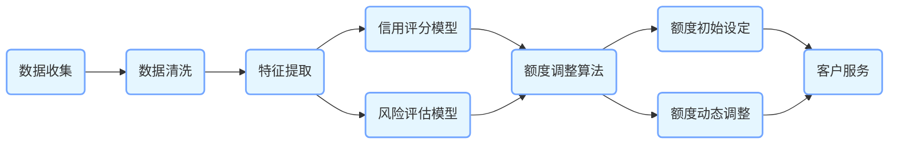

# 智能信用卡额度管理系统

> 关键词：智能信用卡额度管理、风险评估、机器学习、信用评分、额度调整算法

> 摘要：本文围绕智能信用卡额度管理系统展开，详细介绍了该系统的背景、核心概念、算法原理、数学模型、项目实战、实际应用场景等内容。智能信用卡额度管理系统对于银行等金融机构合理控制风险、提高客户满意度具有重要意义。通过对客户信用状况的精准评估和科学的额度调整，能够优化金融资源配置。文章将深入剖析系统的各个方面，旨在为相关从业者提供全面且深入的技术参考。

## 1. 背景介绍 
### 1.1 目的和范围
随着信用卡业务的快速发展，银行等金融机构面临着越来越复杂的风险管理和客户服务挑战。智能信用卡额度管理系统的目的在于实现对信用卡额度的科学、合理、智能化管理。其范围涵盖了从客户信用数据的收集、分析到额度的初始设定、动态调整等一系列过程，旨在平衡金融机构的风险控制和客户的消费需求，提高信用卡业务的运营效率和效益。

### 1.2 预期读者
本文的预期读者主要包括金融机构中从事信用卡业务管理、风险评估、数据分析的专业人员，以及对智能金融系统开发、机器学习在金融领域应用感兴趣的程序员、软件架构师等技术人员。同时，对于相关专业的研究人员和学生也具有一定的参考价值。

### 1.3 文档结构概述
本文首先介绍智能信用卡额度管理系统的背景信息，包括目的、预期读者和文档结构。接着阐述核心概念及其联系，通过文本示意图和 Mermaid 流程图展示系统架构。然后详细讲解核心算法原理和具体操作步骤，并用 Python 源代码进行阐述。随后介绍数学模型和公式，并举例说明。之后通过项目实战展示代码实际案例和详细解释。再探讨实际应用场景，推荐相关的工具和资源。最后总结未来发展趋势与挑战，提供常见问题解答和扩展阅读参考资料。

### 1.4 术语表
#### 1.4.1 核心术语定义
- **信用卡额度**：银行授予持卡人在一定期限内可以透支使用的最高金额。
- **信用评分**：根据客户的信用历史、财务状况等多方面信息，通过特定算法计算得出的一个数值，用于评估客户的信用风险。
- **风险评估**：对信用卡客户可能存在的违约风险进行分析和评价的过程。
- **额度调整算法**：用于确定是否调整信用卡额度以及调整幅度的算法。

#### 1.4.2 相关概念解释
- **信用历史**：客户过去在金融活动中的信用表现，包括还款记录、逾期情况等。
- **财务状况**：客户的收入、资产、负债等财务信息，反映其还款能力。
- **机器学习模型**：通过对大量数据的学习和训练，自动发现数据中的规律和模式，用于预测和决策的模型。

#### 1.4.3 缩略词列表
- **AI**：Artificial Intelligence，人工智能
- **ML**：Machine Learning，机器学习
- **API**：Application Programming Interface，应用程序编程接口

## 2. 核心概念与联系 

### 核心概念原理
智能信用卡额度管理系统主要基于客户的信用状况、消费行为和金融机构的风险偏好来管理信用卡额度。其核心原理是通过收集客户的多维度数据，利用数据分析和机器学习技术对客户进行信用评估和风险分析，进而确定合理的信用卡额度，并根据客户的动态变化实时调整额度。

### 架构的文本示意图
智能信用卡额度管理系统主要由数据层、处理层和应用层组成。
- **数据层**：负责收集和存储客户的各类数据，包括个人信息、信用历史、消费记录、财务状况等。数据来源可以是银行内部系统、第三方征信机构等。
- **处理层**：对数据层收集的数据进行清洗、预处理和特征提取，然后利用机器学习模型进行信用评分和风险评估。根据评估结果，运用额度调整算法确定信用卡额度。
- **应用层**：将处理层的结果应用到实际的信用卡业务中，包括额度的初始设定、动态调整，以及为客户提供额度相关的服务和提示。

### Mermaid 流程图


## 3. 核心算法原理 & 具体操作步骤 

### 核心算法原理
智能信用卡额度管理系统中常用的核心算法包括逻辑回归、决策树和随机森林等机器学习算法。

#### 逻辑回归算法原理
逻辑回归是一种广泛应用于分类问题的算法，在信用卡额度管理中可用于预测客户的违约概率。其基本原理是通过对输入特征进行线性组合，然后通过逻辑函数将线性组合的结果映射到 0 到 1 之间的概率值。逻辑函数的表达式为：
$$
\sigma(z)=\frac{1}{1 + e^{-z}}
$$
其中，$z = \theta_0 + \theta_1x_1 + \theta_2x_2 + \cdots + \theta_nx_n$，$\theta$ 是模型的参数，$x$ 是输入特征。

#### 决策树算法原理
决策树是一种基于树结构进行决策的算法。在信用卡额度管理中，决策树可以根据客户的不同特征（如年龄、收入、信用历史等）构建决策规则，从而对客户进行分类和评估。决策树的每个内部节点是一个特征上的测试，每个分支是测试输出，每个叶节点是一个类别或值。

#### 随机森林算法原理
随机森林是由多个决策树组成的集成学习算法。它通过对训练数据进行随机抽样和特征随机选择，构建多个决策树，然后综合这些决策树的结果进行预测。随机森林可以提高模型的准确性和稳定性。

### 具体操作步骤

#### 数据准备
```python
import pandas as pd
from sklearn.model_selection import train_test_split

# 读取数据
data = pd.read_csv('credit_data.csv')

# 分离特征和标签
X = data.drop('default', axis=1)
y = data['default']

# 划分训练集和测试集
X_train, X_test, y_train, y_test = train_test_split(X, y, test_size=0.2, random_state=42)
```

#### 模型训练
```python
from sklearn.linear_model import LogisticRegression
from sklearn.tree import DecisionTreeClassifier
from sklearn.ensemble import RandomForestClassifier

# 逻辑回归模型训练
logreg_model = LogisticRegression()
logreg_model.fit(X_train, y_train)

# 决策树模型训练
dt_model = DecisionTreeClassifier()
dt_model.fit(X_train, y_train)

# 随机森林模型训练
rf_model = RandomForestClassifier()
rf_model.fit(X_train, y_train)
```

#### 模型评估
```python
from sklearn.metrics import accuracy_score

# 逻辑回归模型评估
logreg_pred = logreg_model.predict(X_test)
logreg_accuracy = accuracy_score(y_test, logreg_pred)
print(f"逻辑回归模型准确率: {logreg_accuracy}")

# 决策树模型评估
dt_pred = dt_model.predict(X_test)
dt_accuracy = accuracy_score(y_test, dt_pred)
print(f"决策树模型准确率: {dt_accuracy}")

# 随机森林模型评估
rf_pred = rf_model.predict(X_test)
rf_accuracy = accuracy_score(y_test, rf_pred)
print(f"随机森林模型准确率: {rf_accuracy}")
```

#### 额度调整算法实现
```python
def adjust_credit_limit(customer_info, model):
    # 根据客户信息进行预测
    prediction = model.predict([customer_info])
    if prediction[0] == 0:  # 低风险客户
        return customer_info['current_limit'] * 1.2  # 提高额度 20%
    else:  # 高风险客户
        return customer_info['current_limit'] * 0.8  # 降低额度 20%
```

## 4. 数学模型和公式 & 详细讲解 & 举例说明 

### 信用评分模型数学模型
信用评分模型通常基于逻辑回归算法，其数学模型可以表示为：
$$
P(y = 1|x)=\frac{1}{1 + e^{-(\theta_0+\theta_1x_1+\theta_2x_2+\cdots+\theta_nx_n)}}
$$
其中，$P(y = 1|x)$ 表示客户违约的概率，$x$ 是客户的特征向量，$\theta$ 是模型的参数。

### 风险评估模型数学模型
风险评估模型可以使用多个指标进行综合评估，例如：
$$
Risk = w_1\times CreditScore + w_2\times Income + w_3\times DebtRatio
$$
其中，$Risk$ 是客户的风险值，$CreditScore$ 是信用评分，$Income$ 是客户收入，$DebtRatio$ 是负债比率，$w$ 是各指标的权重。

### 额度调整算法数学模型
额度调整算法可以根据风险评估结果进行调整，例如：
$$
NewLimit = CurrentLimit\times(1 + \alpha\times(1 - Risk))
$$
其中，$NewLimit$ 是调整后的额度，$CurrentLimit$ 是当前额度，$\alpha$ 是调整系数，$Risk$ 是风险值。

### 举例说明
假设某客户的信用评分为 700，收入为 8000 元，负债比率为 0.3，各指标权重分别为 $w_1 = 0.5$，$w_2 = 0.3$，$w_3 = 0.2$，当前额度为 10000 元，调整系数 $\alpha = 0.2$。

首先计算风险值：
$$
Risk = 0.5\times(1 - \frac{700}{1000})+ 0.3\times\frac{8000}{10000}+ 0.2\times0.3 = 0.4
$$

然后计算调整后的额度：
$$
NewLimit = 10000\times(1 + 0.2\times(1 - 0.4)) = 11200
$$

## 5. 项目实战：代码实际案例和详细解释说明 

### 5.1  开发环境搭建
#### 安装 Python
首先需要安装 Python 环境，建议使用 Python 3.7 及以上版本。可以从 Python 官方网站（https://www.python.org/downloads/） 下载并安装。

#### 安装必要的库
使用以下命令安装必要的库：
```sh
pip install pandas numpy scikit-learn
```

### 5.2  源代码详细实现和代码解读
```python
import pandas as pd
from sklearn.model_selection import train_test_split
from sklearn.linear_model import LogisticRegression
from sklearn.metrics import accuracy_score

# 读取数据
data = pd.read_csv('credit_data.csv')

# 数据清洗
data = data.dropna()  # 删除缺失值

# 分离特征和标签
X = data.drop('default', axis=1)
y = data['default']

# 划分训练集和测试集
X_train, X_test, y_train, y_test = train_test_split(X, y, test_size=0.2, random_state=42)

# 模型训练
model = LogisticRegression()
model.fit(X_train, y_train)

# 模型评估
predictions = model.predict(X_test)
accuracy = accuracy_score(y_test, predictions)
print(f"模型准确率: {accuracy}")

# 额度调整函数
def adjust_credit_limit(customer_info, model):
    prediction = model.predict([customer_info])
    if prediction[0] == 0:  # 低风险客户
        return customer_info['current_limit'] * 1.2  # 提高额度 20%
    else:  # 高风险客户
        return customer_info['current_limit'] * 0.8  # 降低额度 20%

# 示例客户信息
customer_info = {
    'age': 30,
    'income': 8000,
    'credit_score': 700,
    'current_limit': 10000
}

# 调整额度
new_limit = adjust_credit_limit(customer_info, model)
print(f"调整后的额度: {new_limit}")
```

### 5.3  代码解读与分析
- **数据读取和清洗**：使用 `pandas` 库读取信用卡数据，并删除包含缺失值的记录，以确保数据的质量。
- **特征和标签分离**：将数据集中的特征（如年龄、收入、信用评分等）和标签（是否违约）分离，用于模型训练。
- **数据集划分**：使用 `train_test_split` 函数将数据集划分为训练集和测试集，比例为 8:2。
- **模型训练**：使用逻辑回归模型对训练集进行训练。
- **模型评估**：使用测试集对训练好的模型进行评估，计算模型的准确率。
- **额度调整函数**：根据模型的预测结果，对客户的信用卡额度进行调整。如果客户被预测为低风险，则提高额度 20%；如果为高风险，则降低额度 20%。
- **示例客户信息**：定义一个示例客户的信息，并调用额度调整函数计算调整后的额度。

## 6. 实际应用场景 
### 新客户额度初始设定
对于新申请信用卡的客户，智能信用卡额度管理系统可以根据客户提供的个人信息、财务状况等数据，利用信用评分模型和风险评估模型，快速、准确地为客户设定合理的初始额度。这样可以在控制风险的同时，满足客户的基本消费需求。

### 现有客户额度动态调整
系统可以实时监测现有客户的消费行为、还款记录等信息，根据客户的信用状况变化动态调整信用卡额度。对于信用状况良好、消费需求增加的客户，可以适当提高额度，以提高客户满意度和忠诚度；对于信用风险上升的客户，可以降低额度，以控制金融机构的风险。

### 风险预警和防范
智能信用卡额度管理系统可以通过对客户数据的实时分析，及时发现潜在的风险客户。当客户的风险值超过一定阈值时，系统可以发出预警信号，提醒金融机构采取相应的措施，如加强监控、催收欠款等，从而有效防范信用风险。

### 个性化服务
根据客户的不同特征和需求，系统可以为客户提供个性化的额度管理服务。例如，对于经常出差的客户，可以适当提高其信用卡额度，以满足其在旅途中的消费需求；对于年轻客户，可以根据其消费习惯和成长潜力，制定合理的额度提升计划。

## 7. 工具和资源推荐
### 7.1 学习资源推荐
#### 7.1.1 书籍推荐
- 《Python 机器学习》：详细介绍了 Python 在机器学习领域的应用，包括各种机器学习算法的原理和实现。
- 《信用风险评分卡研究与应用》：深入探讨了信用风险评分的理论和实践，对于理解信用卡额度管理中的信用评估有很大帮助。
- 《金融数据分析与挖掘》：结合金融领域的实际案例，介绍了数据分析和挖掘技术在金融行业的应用。

#### 7.1.2 在线课程
- Coursera 上的“Machine Learning”课程：由 Andrew Ng 教授授课，是机器学习领域的经典课程，适合初学者学习。
- edX 上的“Data Science for Finance”课程：介绍了数据科学在金融领域的应用，包括风险评估、信用评分等内容。
- 中国大学 MOOC 上的“金融大数据分析”课程：结合国内金融行业的实际情况，讲解金融大数据分析的方法和技术。

#### 7.1.3 技术博客和网站
- Medium：上面有很多关于机器学习、金融科技的技术文章和案例分享。
- Kaggle：一个数据科学竞赛平台，上面有很多关于金融数据挖掘和风险评估的竞赛和开源代码。
- 金融界网站：提供金融行业的最新资讯和研究报告，对于了解金融行业的发展动态和需求有很大帮助。

### 7.2 开发工具框架推荐
#### 7.2.1 IDE和编辑器
- PyCharm：一款功能强大的 Python 集成开发环境，提供代码编辑、调试、版本控制等功能。
- Jupyter Notebook：一种交互式的开发环境，适合数据探索和模型实验。
- Visual Studio Code：一款轻量级的代码编辑器，支持多种编程语言，并且有丰富的插件扩展。

#### 7.2.2 调试和性能分析工具
- `pdb`：Python 自带的调试工具，可以帮助开发者定位代码中的问题。
- `scikit-learn` 中的 `cross_val_score` 函数：可以用于模型的交叉验证和性能评估。
- `matplotlib` 和 `seaborn`：用于数据可视化，帮助开发者直观地了解数据和模型的性能。

#### 7.2.3 相关框架和库
- `pandas`：用于数据处理和分析，提供了丰富的数据结构和数据操作方法。
- `numpy`：用于数值计算，提供了高效的数组和矩阵运算功能。
- `scikit-learn`：一个开源的机器学习库，提供了各种机器学习算法和工具，方便开发者进行模型训练和评估。

### 7.3 相关论文著作推荐
#### 7.3.1 经典论文
- 《Credit Scoring Models Based on Logistic Regression》：介绍了基于逻辑回归的信用评分模型的原理和应用。
- 《Decision Tree Algorithms for Credit Risk Assessment》：探讨了决策树算法在信用风险评估中的应用。
- 《Random Forests in Credit Scoring》：研究了随机森林算法在信用评分中的性能和优势。

#### 7.3.2 最新研究成果
- 关注顶级金融和机器学习学术期刊，如《Journal of Financial Economics》、《Journal of Machine Learning Research》等，及时了解最新的研究成果。
- 参加相关的学术会议，如 KDD（Knowledge Discovery and Data Mining）、ICML（International Conference on Machine Learning）等，与领域内的专家和学者交流最新的研究进展。

#### 7.3.3 应用案例分析
- 各大银行和金融机构的年报和研究报告，其中包含了很多关于信用卡额度管理和风险控制的实际案例和经验总结。
- 咨询公司和行业研究机构发布的相关报告，如麦肯锡、波士顿咨询等，提供了行业内的最佳实践和趋势分析。

## 8. 总结：未来发展趋势与挑战
### 未来发展趋势
#### 人工智能和机器学习的深度应用
未来，智能信用卡额度管理系统将更加广泛地应用人工智能和机器学习技术，如深度学习、强化学习等。这些技术可以更好地处理复杂的非线性关系，提高信用评估和风险预测的准确性。

#### 多源数据融合
随着金融科技的发展，系统将融合更多来源的数据，如社交媒体数据、消费场景数据等，以更全面地了解客户的信用状况和消费行为。通过多源数据的融合，可以提高额度管理的精准度和个性化程度。

#### 实时决策和自动化管理
系统将实现实时决策和自动化管理，能够根据客户的实时数据和市场变化，快速、准确地调整信用卡额度。这将提高金融机构的运营效率和响应速度，更好地满足客户的需求。

#### 与其他金融服务的融合
智能信用卡额度管理系统将与其他金融服务进行深度融合，如贷款、理财等。通过整合不同的金融服务，为客户提供一站式的金融解决方案，提高客户的满意度和忠诚度。

### 挑战
#### 数据隐私和安全问题
随着多源数据的融合，数据隐私和安全问题将变得更加突出。金融机构需要采取有效的措施，保护客户的个人信息和交易数据，防止数据泄露和滥用。

#### 模型的可解释性
人工智能和机器学习模型的可解释性是一个挑战。在信用卡额度管理中，金融机构需要向客户和监管机构解释模型的决策过程和依据，以确保决策的公平性和透明度。

#### 法律法规和监管要求
金融行业受到严格的法律法规和监管要求的约束。智能信用卡额度管理系统需要遵守相关的法律法规，如反洗钱、消费者保护等，以确保系统的合规性。

#### 技术更新换代快
人工智能和机器学习技术发展迅速，金融机构需要不断更新和升级系统，以跟上技术的发展步伐。这需要投入大量的人力、物力和财力。

## 9. 附录：常见问题与解答
### 1. 智能信用卡额度管理系统的准确率有多高？
智能信用卡额度管理系统的准确率受到多种因素的影响，如数据质量、模型选择、特征工程等。一般来说，通过合理的数据处理和模型优化，系统的准确率可以达到 70% - 90% 左右。

### 2. 系统如何保证数据的安全性？
系统采用多种技术手段保证数据的安全性，如数据加密、访问控制、安全审计等。同时，金融机构还会遵守相关的法律法规和行业标准，加强数据安全管理。

### 3. 额度调整算法是如何确定的？
额度调整算法通常基于客户的信用评分、风险评估结果和金融机构的风险偏好来确定。不同的金融机构可能会采用不同的算法和参数，以实现个性化的额度管理。

### 4. 系统能否处理大规模数据？
现代的智能信用卡额度管理系统通常采用分布式计算和大数据技术，能够处理大规模的数据。同时，通过优化算法和数据结构，可以提高系统的处理效率和性能。

### 5. 系统如何适应不同的业务需求？
系统具有良好的可扩展性和灵活性，可以通过调整模型参数、添加新的特征和算法等方式，适应不同的业务需求。同时，系统还可以与其他金融系统进行集成，实现数据共享和业务协同。

## 10. 扩展阅读 & 参考资料
### 扩展阅读
- 《人工智能时代的金融风险管理》
- 《金融科技前沿与趋势》
- 《大数据在金融领域的应用》

### 参考资料
- 《Python 数据分析实战》
- 《机器学习实战》
- 各大银行和金融机构的官方网站和研究报告
- 相关的学术期刊和会议论文