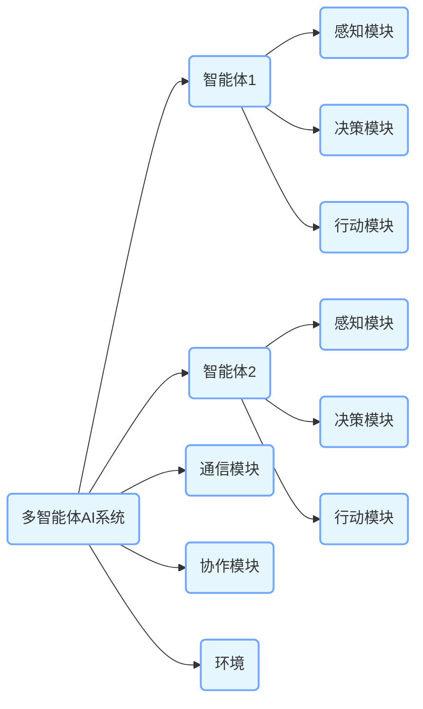

# 智能化公司创新文化评估：多智能体AI在价值投资中的角色

> 关键词：智能化公司、创新文化评估、多智能体AI、价值投资、人工智能、金融科技、企业评估

> 摘要：本文聚焦于智能化公司创新文化评估以及多智能体AI在价值投资中的角色。首先阐述了智能化公司创新文化评估的重要性和背景，接着深入剖析多智能体AI的核心概念及其与价值投资的联系。详细讲解了多智能体AI的核心算法原理和具体操作步骤，并给出相关数学模型和公式。通过项目实战展示代码实际案例及详细解释，探讨了多智能体AI在价值投资中的实际应用场景。同时推荐了相关的学习资源、开发工具框架以及论文著作。最后总结了未来发展趋势与挑战，解答常见问题并提供扩展阅读和参考资料，旨在为相关领域的研究者和从业者提供全面而深入的技术指导和理论支持。

## 1. 背景介绍 
### 1.1 目的和范围
在当今数字化和智能化快速发展的时代，智能化公司如雨后春笋般涌现。创新文化作为智能化公司的核心竞争力之一，对于公司的长期发展和价值创造起着至关重要的作用。准确评估智能化公司的创新文化，有助于投资者更好地了解公司的潜力和价值，从而做出更明智的投资决策。

本文章的范围涵盖了智能化公司创新文化评估的理论和方法，重点探讨多智能体AI在价值投资中的应用。通过对多智能体AI的深入研究，分析其如何帮助投资者更准确地评估智能化公司的创新文化，进而在价值投资中发挥关键作用。

### 1.2 预期读者
本文预期读者包括金融领域的投资者、投资分析师、金融科技从业者、人工智能领域的研究人员和开发者，以及对智能化公司创新文化和价值投资感兴趣的学者和学生。

### 1.3 文档结构概述
本文将按照以下结构进行阐述：首先介绍背景信息，包括目的、范围、预期读者和文档结构概述；接着讲解多智能体AI和智能化公司创新文化评估的核心概念及其联系；然后详细阐述多智能体AI的核心算法原理、具体操作步骤、数学模型和公式；通过项目实战展示代码实际案例并进行详细解释；探讨多智能体AI在价值投资中的实际应用场景；推荐相关的学习资源、开发工具框架和论文著作；总结未来发展趋势与挑战；解答常见问题并提供扩展阅读和参考资料。

### 1.4 术语表
#### 1.4.1 核心术语定义
- **智能化公司**：指利用先进的信息技术和人工智能技术，实现业务流程自动化、智能化，以提高运营效率和创新能力的公司。
- **创新文化**：是指公司内部形成的鼓励创新、支持冒险、容忍失败的文化氛围和价值观，它影响着公司的创新能力和创新绩效。
- **多智能体AI**：由多个智能体组成的人工智能系统，每个智能体具有一定的自主性和智能性，能够通过与其他智能体和环境的交互来完成特定的任务。
- **价值投资**：一种投资策略，投资者通过分析公司的基本面，寻找被低估的股票或资产，以长期持有为目标，获取资产价值增长带来的收益。

#### 1.4.2 相关概念解释
- **智能体**：是指具有感知、决策和行动能力的实体，能够根据环境的变化自主地做出决策并采取行动。
- **环境**：智能体所处的外部世界，包括其他智能体、物理环境和信息环境等。
- **交互**：智能体之间或智能体与环境之间的信息传递和行为影响过程。

#### 1.4.3 缩略词列表
- **AI**：Artificial Intelligence，人工智能
- **MAS**：Multi - Agent System，多智能体系统

## 2. 核心概念与联系 

### 2.1 智能化公司创新文化评估
智能化公司的创新文化评估是一个复杂的过程，它涉及到公司的多个方面，包括组织架构、管理模式、员工激励机制、研发投入等。创新文化的评估可以帮助公司发现自身的优势和不足，从而采取相应的措施来加强创新能力。

评估创新文化的方法有很多种，常见的包括问卷调查、访谈、案例分析等。这些方法可以从不同的角度了解公司的创新文化，但都存在一定的局限性。例如，问卷调查可能存在回答不真实的情况，访谈可能受到访谈者主观因素的影响。

### 2.2 多智能体AI
多智能体AI是一种分布式人工智能系统，它由多个智能体组成。每个智能体具有一定的自主性和智能性，能够独立地感知环境、做出决策和采取行动。智能体之间通过通信和协作来完成复杂的任务。

多智能体AI的架构通常包括以下几个部分：
- **智能体**：是系统的基本组成单元，具有感知、决策和行动能力。
- **通信模块**：负责智能体之间的信息传递。
- **协作模块**：协调智能体之间的行动，以实现共同的目标。
- **环境**：智能体所处的外部世界，包括其他智能体、物理环境和信息环境等。

以下是多智能体AI架构的文本示意图：

```plaintext
多智能体AI系统
├── 智能体1
│   ├── 感知模块
│   ├── 决策模块
│   ├── 行动模块
├── 智能体2
│   ├── 感知模块
│   ├── 决策模块
│   ├── 行动模块
├── 通信模块
├── 协作模块
├── 环境
```

以下是多智能体AI架构的Mermaid流程图：



### 2.3 多智能体AI与价值投资的联系
在价值投资中，投资者需要对公司的基本面进行深入分析，包括公司的财务状况、市场竞争力、创新能力等。多智能体AI可以在以下几个方面帮助投资者进行价值投资：
- **数据收集和分析**：多智能体AI可以通过多个智能体同时收集和分析大量的市场数据、公司财务数据、行业动态等信息，提高数据收集和分析的效率和准确性。
- **创新文化评估**：智能体可以通过与公司内部人员、客户、合作伙伴等进行交互，收集关于公司创新文化的信息，从而更全面地评估公司的创新文化。
- **投资决策支持**：多智能体AI可以根据收集到的信息，通过协作和推理，为投资者提供投资决策建议，帮助投资者选择具有潜力的投资标的。

## 3. 核心算法原理 & 具体操作步骤 

### 3.1 核心算法原理
多智能体AI的核心算法包括智能体的感知算法、决策算法和协作算法。以下是一个简单的多智能体AI算法示例，使用Python语言实现。

```python
import random

# 定义智能体类
class Agent:
    def __init__(self, id):
        self.id = id
        self.perception = []  # 感知信息
        self.decision = None  # 决策结果

    # 感知环境
    def perceive(self, environment):
        # 简单模拟感知过程，随机选择一些环境信息
        self.perception = random.sample(environment, random.randint(1, len(environment)))

    # 做出决策
    def make_decision(self):
        # 简单模拟决策过程，根据感知信息随机选择一个决策
        if self.perception:
            self.decision = random.choice(self.perception)
        else:
            self.decision = None

    # 执行行动
    def act(self):
        if self.decision:
            print(f"Agent {self.id} takes action: {self.decision}")
        else:
            print(f"Agent {self.id} has no decision to act.")

# 定义环境
environment = ["Data A", "Data B", "Data C", "Data D"]

# 创建智能体
agents = [Agent(i) for i in range(3)]

# 智能体感知环境
for agent in agents:
    agent.perceive(environment)

# 智能体做出决策
for agent in agents:
    agent.make_decision()

# 智能体执行行动
for agent in agents:
    agent.act()
```

### 3.2 具体操作步骤
1. **环境初始化**：定义智能体所处的环境，包括环境中的各种信息和资源。
2. **智能体创建**：创建多个智能体，并初始化它们的属性和状态。
3. **感知过程**：每个智能体感知环境，收集相关信息。
4. **决策过程**：智能体根据感知到的信息，使用决策算法做出决策。
5. **行动过程**：智能体根据决策结果采取相应的行动。
6. **协作过程**：智能体之间通过通信和协作，协调行动，实现共同的目标。

## 4. 数学模型和公式 & 详细讲解 & 举例说明 

### 4.1 智能体感知模型
智能体的感知过程可以用以下数学模型来描述：

设环境 $E$ 是一个包含 $n$ 个元素的集合，即 $E = \{e_1, e_2, \cdots, e_n\}$。智能体 $A$ 的感知函数 $P_A: E \to 2^E$ 表示智能体 $A$ 从环境 $E$ 中感知到的信息集合。感知函数 $P_A$ 可以根据不同的感知策略进行定义。

例如，一种简单的感知策略是随机感知，即智能体 $A$ 以一定的概率 $p$ 感知到环境中的每个元素。设 $x_i$ 是一个随机变量，$x_i = 1$ 表示智能体 $A$ 感知到元素 $e_i$，$x_i = 0$ 表示智能体 $A$ 未感知到元素 $e_i$，则 $P_A(E) = \{e_i | x_i = 1, i = 1, 2, \cdots, n\}$，其中 $P(x_i = 1) = p$。

### 4.2 智能体决策模型
智能体的决策过程可以用效用函数来描述。设智能体 $A$ 有 $m$ 个可能的决策 $D = \{d_1, d_2, \cdots, d_m\}$，每个决策 $d_j$ 对应一个效用值 $u_j$。智能体 $A$ 的决策目标是选择效用值最大的决策，即 $d^* = \arg\max_{d_j \in D} u_j$。

例如，假设智能体 $A$ 感知到的信息集合为 $P_A(E) = \{e_1, e_2\}$，有两个决策 $d_1$ 和 $d_2$，效用函数分别为 $u_1 = f_1(e_1, e_2)$ 和 $u_2 = f_2(e_1, e_2)$，则智能体 $A$ 的决策为 $d^* = \arg\max\{u_1, u_2\}$。

### 4.3 智能体协作模型
智能体之间的协作可以用博弈论来描述。设智能体集合为 $A = \{A_1, A_2, \cdots, A_k\}$，每个智能体 $A_i$ 有自己的策略集合 $S_i$。智能体之间的协作过程可以看作是一个博弈过程，每个智能体选择自己的策略，以最大化自己的收益。

例如，在一个简单的二人博弈中，智能体 $A_1$ 和 $A_2$ 的策略集合分别为 $S_1 = \{s_{11}, s_{12}\}$ 和 $S_2 = \{s_{21}, s_{22}\}$，收益矩阵为：

$$
\begin{bmatrix}
u_{11} & u_{12} \\
u_{21} & u_{22}
\end{bmatrix}
$$

其中 $u_{ij}$ 表示智能体 $A_1$ 选择策略 $s_{1i}$，智能体 $A_2$ 选择策略 $s_{2j}$ 时的收益。智能体 $A_1$ 和 $A_2$ 的目标是选择合适的策略，以最大化自己的收益。

## 5. 项目实战：代码实际案例和详细解释说明 

### 5.1  开发环境搭建
1. **安装Python**：从Python官方网站（https://www.python.org/downloads/）下载并安装Python 3.x 版本。
2. **安装必要的库**：在命令行中使用以下命令安装必要的库：
```sh
pip install numpy pandas matplotlib
```

### 5.2  源代码详细实现和代码解读
以下是一个更复杂的多智能体AI在价值投资中评估智能化公司创新文化的代码示例：

```python
import numpy as np
import pandas as pd
import matplotlib.pyplot as plt

# 定义智能体类
class InvestorAgent:
    def __init__(self, id, expertise):
        self.id = id
        self.expertise = expertise  # 智能体的专业领域
        self.perception = {}  # 感知信息
        self.decision = None  # 决策结果

    # 感知环境
    def perceive(self, company_data):
        # 根据专业领域选择相关信息
        relevant_data = {k: v for k, v in company_data.items() if self.expertise in k}
        self.perception = relevant_data

    # 做出决策
    def make_decision(self, evaluation_function):
        if self.perception:
            score = evaluation_function(self.perception)
            if score > 0.5:
                self.decision = "Invest"
            else:
                self.decision = "Not Invest"
        else:
            self.decision = "No Data"

# 定义评估函数
def evaluation_function(data):
    # 简单的评估函数，根据数据的平均值进行评估
    values = list(data.values())
    if values:
        average = np.mean(values)
        return average
    else:
        return 0

# 模拟公司数据
company_data = {
    "R&D Expense": 0.8,
    "Employee Innovation Index": 0.7,
    "Patent Count": 0.6,
    "Market Share Growth": 0.5
}

# 创建智能体
agents = [
    InvestorAgent(1, "Innovation"),
    InvestorAgent(2, "Finance"),
    InvestorAgent(3, "Market")
]

# 智能体感知环境
for agent in agents:
    agent.perceive(company_data)

# 智能体做出决策
for agent in agents:
    agent.make_decision(evaluation_function)

# 输出决策结果
for agent in agents:
    print(f"Agent {agent.id} ({agent.expertise}): {agent.decision}")

# 可视化决策结果
decisions = [agent.decision for agent in agents]
expertises = [agent.expertise for agent in agents]

plt.bar(expertises, decisions)
plt.xlabel("Expertise")
plt.ylabel("Decision")
plt.title("Investment Decisions by Agents")
plt.show()
```

### 5.3  代码解读与分析
1. **智能体类 `InvestorAgent`**：定义了智能体的属性和方法。属性包括智能体的ID、专业领域、感知信息和决策结果。方法包括感知环境和做出决策。
2. **感知方法 `perceive`**：根据智能体的专业领域，从公司数据中选择相关信息作为感知信息。
3. **决策方法 `make_decision`**：根据感知信息，使用评估函数进行评估，根据评估结果做出投资或不投资的决策。
4. **评估函数 `evaluation_function`**：简单的评估函数，根据感知信息的平均值进行评估。
5. **模拟公司数据**：创建一个包含公司创新、财务和市场等方面信息的字典。
6. **智能体创建和决策过程**：创建多个智能体，让它们感知环境并做出决策。
7. **可视化决策结果**：使用 `matplotlib` 库将智能体的决策结果进行可视化展示。

## 6. 实际应用场景 
### 6.1 智能化公司创新文化评估
多智能体AI可以通过多个智能体同时收集和分析公司的各种信息，包括员工访谈、专利数据、研发投入等，从而更全面地评估智能化公司的创新文化。智能体可以根据不同的专业领域进行分工，提高评估的准确性和效率。

### 6.2 价值投资决策支持
在价值投资中，多智能体AI可以帮助投资者分析公司的基本面，包括财务状况、市场竞争力、创新能力等。智能体可以通过与其他智能体的协作，综合考虑各种因素，为投资者提供更准确的投资决策建议。

### 6.3 市场趋势预测
多智能体AI可以通过收集和分析大量的市场数据，包括股票价格、交易量、行业动态等，预测市场趋势。智能体可以根据不同的策略进行交易，从而实现投资收益的最大化。

## 7. 工具和资源推荐
### 7.1 学习资源推荐
#### 7.1.1 书籍推荐
- 《人工智能：一种现代的方法》（Artificial Intelligence: A Modern Approach）：这是一本经典的人工智能教材，涵盖了人工智能的各个方面，包括多智能体系统。
- 《多智能体系统：原理与编程》（Multi - Agent Systems: Principles and Programming）：详细介绍了多智能体系统的原理和编程方法。
- 《价值投资：从格雷厄姆到巴菲特》（Value Investing: From Graham to Buffett）：系统阐述了价值投资的理论和方法。

#### 7.1.2 在线课程
- Coursera上的“人工智能基础”（Foundations of Artificial Intelligence）课程：由知名教授授课，讲解人工智能的基本概念和算法。
- edX上的“多智能体系统”（Multi - Agent Systems）课程：深入介绍多智能体系统的理论和应用。
- Udemy上的“价值投资实战”（Value Investing in Practice）课程：通过实际案例讲解价值投资的策略和技巧。

#### 7.1.3 技术博客和网站
- Medium上的人工智能和金融科技相关博客：可以获取最新的技术动态和研究成果。
- 机器之心（https://www.alienlab.cn/）：专注于人工智能领域的资讯和技术分享。
- 雪球网（https://xueqiu.com/）：提供价值投资的相关资讯和讨论。

### 7.2 开发工具框架推荐
#### 7.2.1 IDE和编辑器
- PyCharm：一款专业的Python集成开发环境，提供丰富的代码编辑、调试和测试功能。
- Visual Studio Code：一款轻量级的代码编辑器，支持多种编程语言，具有丰富的插件生态系统。

#### 7.2.2 调试和性能分析工具
- pdb：Python自带的调试工具，可以帮助开发者调试Python代码。
- cProfile：Python的性能分析工具，可以分析代码的性能瓶颈。

#### 7.2.3 相关框架和库
- Mesa：一个用于构建多智能体系统的Python框架，提供了丰富的工具和模型。
- NumPy：Python的数值计算库，用于处理大规模的数值数据。
- Pandas：Python的数据处理库，用于数据的清洗、分析和可视化。

### 7.3 相关论文著作推荐
#### 7.3.1 经典论文
- “Multi - Agent Systems: A Modern Approach to Distributed Artificial Intelligence”：该论文系统地介绍了多智能体系统的理论和方法。
- “Value Investing: The Use of Historical Financial Statement Information to Separate Winners from Losers”：探讨了价值投资中财务报表信息的应用。

#### 7.3.2 最新研究成果
- 关注顶级学术会议如AAAI（Association for the Advancement of Artificial Intelligence）、IJCAI（International Joint Conference on Artificial Intelligence）上关于多智能体系统和金融科技的研究论文。
- 查阅顶级学术期刊如《Journal of Artificial Intelligence Research》、《Journal of Financial Economics》上的相关研究成果。

#### 7.3.3 应用案例分析
- 分析一些知名投资机构的投资案例，了解多智能体AI在价值投资中的实际应用。
- 研究智能化公司的创新文化评估案例，学习如何运用多智能体AI进行评估。

## 8. 总结：未来发展趋势与挑战
### 8.1 未来发展趋势
- **融合发展**：多智能体AI将与区块链、物联网等技术深度融合，为价值投资和智能化公司创新文化评估提供更强大的技术支持。
- **个性化服务**：根据投资者的风险偏好、投资目标等个性化需求，提供定制化的投资决策建议。
- **智能化决策**：多智能体AI将不断提高自身的智能水平，实现更智能、更准确的决策。

### 8.2 挑战
- **数据质量和安全**：多智能体AI需要大量的数据支持，但数据的质量和安全是一个重要的挑战。如何保证数据的准确性、完整性和安全性是需要解决的问题。
- **算法复杂度**：多智能体AI的算法复杂度较高，需要强大的计算资源支持。如何优化算法，提高计算效率是一个关键问题。
- **伦理和法律问题**：多智能体AI的应用可能会带来一些伦理和法律问题，如隐私保护、算法歧视等。如何制定相应的伦理和法律规范是需要关注的问题。

## 9. 附录：常见问题与解答
### 9.1 多智能体AI与传统AI有什么区别？
多智能体AI由多个智能体组成，每个智能体具有一定的自主性和智能性，能够通过与其他智能体和环境的交互来完成任务。而传统AI通常是一个集中式的系统，由一个中央控制器进行决策和控制。

### 9.2 如何评估多智能体AI的性能？
可以从多个方面评估多智能体AI的性能，如任务完成率、决策准确性、协作效率等。还可以通过实验和模拟，比较不同多智能体AI系统的性能。

### 9.3 多智能体AI在价值投资中的应用有哪些局限性？
多智能体AI在价值投资中的应用存在一些局限性，如数据的局限性、算法的不确定性、市场的复杂性等。此外，多智能体AI的决策结果可能受到智能体的初始设置和环境的影响。

## 10. 扩展阅读 & 参考资料
### 10.1 扩展阅读
- 阅读更多关于人工智能、金融科技和价值投资的书籍和文章，深入了解相关领域的知识。
- 关注行业动态和前沿研究，了解多智能体AI在价值投资中的最新应用和发展趋势。

### 10.2 参考资料
- 相关学术论文和研究报告，如上述提到的经典论文和最新研究成果。
- 技术文档和官方网站，如Mesa框架的官方文档、Python的官方文档等。
- 行业报告和统计数据，如金融机构发布的投资报告、市场研究机构发布的行业统计数据等。