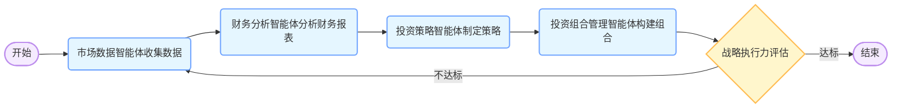

# 智能化战略执行力评估：多智能体AI在价值投资中的新方法

> 关键词：智能化战略执行力评估、多智能体AI、价值投资、新方法、投资决策、人工智能应用

> 摘要：本文聚焦于智能化战略执行力评估这一关键领域，深入探讨多智能体AI在价值投资中的创新应用。通过详细阐述多智能体AI的核心概念、算法原理、数学模型等内容，结合实际项目案例进行分析，揭示其在价值投资中如何提升战略执行力评估的准确性和效率。同时，探讨了其实际应用场景，推荐了相关学习资源、开发工具和论文著作，最后对未来发展趋势与挑战进行总结，旨在为价值投资领域的智能化发展提供全面且深入的参考。

## 1. 背景介绍 
### 1.1 目的和范围
价值投资作为一种长期的投资策略，旨在寻找被低估的资产并进行长期持有，以获取稳定的回报。然而，在实际操作中，准确评估投资战略的执行力面临诸多挑战，包括市场的复杂性、信息的不完整性以及人为因素的干扰等。本文的目的在于介绍一种基于多智能体AI的新方法，用于智能化战略执行力评估，以提高价值投资决策的科学性和准确性。范围涵盖多智能体AI的基本原理、在价值投资中的应用算法、数学模型、实际案例以及相关工具和资源推荐等方面。

### 1.2 预期读者
本文预期读者包括金融投资领域的从业者，如投资经理、分析师等，他们希望借助先进的人工智能技术提升投资决策的水平；计算机科学和人工智能领域的研究人员和开发者，对多智能体AI在金融领域的应用感兴趣；以及对价值投资和人工智能交叉领域有学习需求的学生和爱好者。

### 1.3 文档结构概述
本文首先介绍背景信息，包括目的、预期读者和文档结构。接着阐述多智能体AI的核心概念及其与价值投资的联系，通过文本示意图和Mermaid流程图进行展示。然后详细讲解核心算法原理，并用Python源代码进行说明，同时介绍相关的数学模型和公式。之后通过实际项目案例展示多智能体AI在价值投资中的应用，包括开发环境搭建、源代码实现和代码解读。再探讨其实际应用场景，推荐相关的工具和资源。最后总结未来发展趋势与挑战，提供常见问题解答和扩展阅读参考资料。

### 1.4 术语表
#### 1.4.1 核心术语定义
- **智能化战略执行力评估**：利用先进的技术和方法，对投资战略的执行过程和效果进行智能化的分析和评价，以判断战略是否得到有效执行以及执行的质量和效率。
- **多智能体AI**：由多个智能体组成的人工智能系统，每个智能体具有一定的自主性和智能，能够感知环境、做出决策并与其他智能体进行交互，以实现共同的目标。
- **价值投资**：一种投资策略，基于对资产内在价值的评估，寻找被市场低估的资产进行投资，通过长期持有获取资产价值回归带来的收益。

#### 1.4.2 相关概念解释
- **智能体**：在人工智能领域，智能体是指能够感知环境、自主决策并采取行动的实体。它可以是软件程序、机器人等。
- **战略执行力**：指组织或个人将战略目标转化为实际行动并取得预期成果的能力。在价值投资中，战略执行力体现在投资决策的贯彻执行和投资组合的管理上。
- **投资组合**：投资者将资金分散投资于不同的资产，以降低风险并实现预期收益的资产组合。

#### 1.4.3 缩略词列表
- **AI**：Artificial Intelligence，人工智能
- **MDP**：Markov Decision Process，马尔可夫决策过程

## 2. 核心概念与联系 
### 2.1 多智能体AI的核心概念
多智能体AI系统由多个智能体组成，每个智能体都有自己的目标、知识和能力。智能体之间通过通信和协作来实现共同的任务。智能体可以感知环境的状态，根据自身的知识和规则做出决策，并采取相应的行动。例如，在一个多智能体的物流系统中，每个运输车辆可以看作一个智能体，它们根据实时的交通信息、货物需求等因素，自主决定行驶路线和运输任务，同时通过与其他车辆的通信协调，提高整个物流系统的效率。

### 2.2 多智能体AI与价值投资的联系
在价值投资中，多智能体AI可以发挥重要作用。不同的智能体可以分别负责不同的任务，如市场数据的收集和分析、投资策略的制定和调整、投资组合的优化等。通过智能体之间的协作和交互，可以更全面、准确地评估投资战略的执行力。例如，一个智能体可以专注于分析宏观经济数据，另一个智能体可以研究公司的财务报表，它们将各自的分析结果共享给其他智能体，共同为投资决策提供依据。

### 2.3 文本示意图
多智能体AI在价值投资中的应用可以用以下文本示意图表示：

多智能体AI系统包含多个智能体，分别为市场数据智能体、财务分析智能体、投资策略智能体和投资组合管理智能体。市场数据智能体负责收集和处理市场的宏观经济数据、行业数据等；财务分析智能体对公司的财务报表进行深入分析，评估公司的财务状况和盈利能力；投资策略智能体根据市场数据和财务分析结果，制定和调整投资策略；投资组合管理智能体根据投资策略，构建和优化投资组合。这些智能体之间相互协作和通信，共同完成价值投资中的战略执行力评估任务。

### 2.4 Mermaid流程图


## 3. 核心算法原理 & 具体操作步骤 
### 3.1 核心算法原理
多智能体AI在价值投资中的核心算法可以基于马尔可夫决策过程（MDP）。马尔可夫决策过程是一种用于描述智能体在环境中决策和行动的数学模型，它具有马尔可夫性质，即智能体的下一个状态只取决于当前状态和当前采取的行动，而与过去的状态和行动无关。

在价值投资中，每个智能体可以看作一个独立的决策者，根据当前的市场状态和自身的目标，选择最优的行动。智能体通过不断地与环境交互，学习到最优的策略，以实现投资收益的最大化。

### 3.2 具体操作步骤
1. **定义状态空间**：确定智能体可以感知到的环境状态，如市场的价格指数、公司的财务指标等。
2. **定义动作空间**：明确智能体可以采取的行动，如买入、卖出、持有等。
3. **定义奖励函数**：根据智能体的行动和环境的反馈，定义奖励函数，以评估智能体的行动效果。例如，投资收益可以作为奖励。
4. **初始化策略**：为智能体初始化一个初始策略，用于指导智能体的行动。
5. **智能体交互和学习**：智能体在环境中不断地进行交互，根据当前状态选择行动，接收环境的反馈并更新策略，以逐步学习到最优策略。

### 3.3 Python源代码阐述
以下是一个简单的基于马尔可夫决策过程的多智能体AI在价值投资中的Python示例代码：

```python
import numpy as np

# 定义状态空间
state_space = [0, 1, 2]  # 简单示例，0表示市场低迷，1表示市场平稳，2表示市场繁荣
# 定义动作空间
action_space = [0, 1, 2]  # 0表示卖出，1表示持有，2表示买入

# 定义奖励函数
def reward_function(state, action):
    if state == 0 and action == 0:
        return 1
    elif state == 1 and action == 1:
        return 0
    elif state == 2 and action == 2:
        return 2
    else:
        return -1

# 初始化策略
policy = np.random.rand(len(state_space), len(action_space))
policy = policy / np.sum(policy, axis=1, keepdims=True)

# 智能体交互和学习
num_episodes = 1000
gamma = 0.9  # 折扣因子

for episode in range(num_episodes):
    state = np.random.choice(state_space)
    done = False
    total_reward = 0

    while not done:
        action = np.random.choice(action_space, p=policy[state])
        reward = reward_function(state, action)
        total_reward += reward

        # 简单模拟状态转移
        next_state = np.random.choice(state_space)

        # 更新策略（简单示例，这里使用随机更新）
        policy[state, action] += 0.1 * (reward + gamma * np.max(policy[next_state]) - policy[state, action])

        state = next_state

        if np.random.random() < 0.1:
            done = True

    if episode % 100 == 0:
        print(f"Episode {episode}: Total Reward = {total_reward}")
```

在这个示例代码中，我们首先定义了状态空间和动作空间，然后定义了奖励函数。接着初始化了一个随机策略，智能体在环境中进行交互，根据当前状态选择行动，接收奖励并更新策略。通过多次迭代，智能体逐渐学习到更优的策略。

## 4. 数学模型和公式 & 详细讲解 & 举例说明 
### 4.1 马尔可夫决策过程的数学模型
马尔可夫决策过程可以用一个五元组 $\langle S, A, P, R, \gamma \rangle$ 来表示，其中：
- $S$ 是状态空间，表示智能体可以感知到的所有可能状态。
- $A$ 是动作空间，表示智能体可以采取的所有可能行动。
- $P(s'|s, a)$ 是状态转移概率，表示在状态 $s$ 下采取行动 $a$ 后转移到状态 $s'$ 的概率。
- $R(s, a)$ 是奖励函数，表示在状态 $s$ 下采取行动 $a$ 所获得的即时奖励。
- $\gamma$ 是折扣因子，取值范围为 $[0, 1]$，用于衡量未来奖励的重要性。

### 4.2 价值函数和最优策略
在马尔可夫决策过程中，我们通常使用价值函数来评估智能体的策略。价值函数分为状态价值函数 $V^{\pi}(s)$ 和动作价值函数 $Q^{\pi}(s, a)$，其中 $\pi$ 表示策略。

状态价值函数 $V^{\pi}(s)$ 表示在策略 $\pi$ 下，从状态 $s$ 开始的期望累计折扣奖励：
$$V^{\pi}(s) = \mathbb{E}_{\pi} \left[ \sum_{t=0}^{\infty} \gamma^t R(S_t, A_t) | S_0 = s \right]$$

动作价值函数 $Q^{\pi}(s, a)$ 表示在策略 $\pi$ 下，从状态 $s$ 采取行动 $a$ 开始的期望累计折扣奖励：
$$Q^{\pi}(s, a) = \mathbb{E}_{\pi} \left[ \sum_{t=0}^{\infty} \gamma^t R(S_t, A_t) | S_0 = s, A_0 = a \right]$$

最优策略 $\pi^*$ 是指能够使价值函数达到最大的策略，即：
$$V^{\pi^*}(s) = \max_{\pi} V^{\pi}(s)$$
$$Q^{\pi^*}(s, a) = \max_{\pi} Q^{\pi}(s, a)$$

### 4.3 举例说明
假设一个简单的投资场景，状态空间 $S = \{s_1, s_2\}$，其中 $s_1$ 表示市场上涨，$s_2$ 表示市场下跌；动作空间 $A = \{a_1, a_2\}$，其中 $a_1$ 表示买入，$a_2$ 表示卖出。状态转移概率如下：
$$P(s_1|s_1, a_1) = 0.8, P(s_2|s_1, a_1) = 0.2$$
$$P(s_1|s_1, a_2) = 0.3, P(s_2|s_1, a_2) = 0.7$$
$$P(s_1|s_2, a_1) = 0.2, P(s_2|s_2, a_1) = 0.8$$
$$P(s_1|s_2, a_2) = 0.7, P(s_2|s_2, a_2) = 0.3$$

奖励函数如下：
$$R(s_1, a_1) = 10, R(s_1, a_2) = -5$$
$$R(s_2, a_1) = -10, R(s_2, a_2) = 5$$

折扣因子 $\gamma = 0.9$。

我们可以使用动态规划等算法来计算最优策略。例如，使用值迭代算法：

```python
import numpy as np

# 状态空间
S = [0, 1]
# 动作空间
A = [0, 1]

# 状态转移概率
P = np.array([
    [[0.8, 0.2], [0.3, 0.7]],
    [[0.2, 0.8], [0.7, 0.3]]
])

# 奖励函数
R = np.array([
    [10, -5],
    [-10, 5]
])

# 折扣因子
gamma = 0.9

# 值迭代算法
V = np.zeros(len(S))
epsilon = 1e-6
max_iterations = 1000

for iteration in range(max_iterations):
    delta = 0
    for s in S:
        v = V[s]
        Q = np.zeros(len(A))
        for a in A:
            for s_prime in S:
                Q[a] += P[s, a, s_prime] * (R[s, a] + gamma * V[s_prime])
        V[s] = np.max(Q)
        delta = max(delta, np.abs(v - V[s]))
    if delta < epsilon:
        break

# 计算最优策略
policy = np.zeros((len(S), len(A)))
for s in S:
    Q = np.zeros(len(A))
    for a in A:
        for s_prime in S:
            Q[a] += P[s, a, s_prime] * (R[s, a] + gamma * V[s_prime])
    best_action = np.argmax(Q)
    policy[s, best_action] = 1

print("Optimal Value Function:", V)
print("Optimal Policy:", policy)
```

在这个例子中，我们通过值迭代算法计算出了最优价值函数和最优策略。最优策略告诉我们在不同的市场状态下应该采取的最优行动，以最大化期望累计折扣奖励。

## 5. 项目实战：代码实际案例和详细解释说明 
### 5.1  开发环境搭建
#### 5.1.1 操作系统
可以选择常见的操作系统，如Windows、Linux（如Ubuntu）或macOS。

#### 5.1.2 Python环境
安装Python 3.x版本。可以从Python官方网站（https://www.python.org/downloads/）下载安装包进行安装。安装完成后，建议使用虚拟环境管理工具，如`venv`或`conda`，以隔离不同项目的依赖。

#### 5.1.3 依赖库安装
在虚拟环境中安装所需的依赖库，主要包括`numpy`、`pandas`、`matplotlib`等。可以使用`pip`命令进行安装：
```sh
pip install numpy pandas matplotlib
```

### 5.2  源代码详细实现和代码解读
以下是一个更完整的多智能体AI在价值投资中的项目实战代码示例：

```python
import numpy as np
import pandas as pd
import matplotlib.pyplot as plt

# 定义市场数据智能体
class MarketDataAgent:
    def __init__(self):
        # 模拟市场数据
        self.market_data = pd.DataFrame({
            'price': np.random.randn(100).cumsum() + 100,
            'volume': np.random.randint(1000, 5000, 100)
        })
        self.current_step = 0

    def get_current_state(self):
        state = self.market_data.iloc[self.current_step]
        self.current_step += 1
        if self.current_step >= len(self.market_data):
            self.current_step = 0
        return state

# 定义财务分析智能体
class FinancialAnalysisAgent:
    def __init__(self):
        # 模拟公司财务数据
        self.financial_data = pd.DataFrame({
            'revenue': np.random.randint(10000, 50000, 100),
            'profit': np.random.randint(1000, 5000, 100)
        })
        self.current_step = 0

    def analyze_financials(self):
        financials = self.financial_data.iloc[self.current_step]
        self.current_step += 1
        if self.current_step >= len(self.financial_data):
            self.current_step = 0
        # 简单的财务分析指标，如利润率
        profit_margin = financials['profit'] / financials['revenue']
        return profit_margin

# 定义投资策略智能体
class InvestmentStrategyAgent:
    def __init__(self):
        self.policy = np.array([[0.2, 0.6, 0.2], [0.3, 0.4, 0.3]])  # 简单的策略

    def choose_action(self, state, profit_margin):
        if profit_margin > 0.1:
            state_index = 1
        else:
            state_index = 0
        action = np.random.choice([0, 1, 2], p=self.policy[state_index])
        return action

# 定义投资组合管理智能体
class PortfolioManagementAgent:
    def __init__(self):
        self.portfolio = 0
        self.cash = 10000

    def update_portfolio(self, action, price):
        if action == 0:  # 卖出
            if self.portfolio > 0:
                self.cash += self.portfolio * price
                self.portfolio = 0
        elif action == 2:  # 买入
            if self.cash > 0:
                num_shares = self.cash // price
                self.portfolio += num_shares
                self.cash -= num_shares * price
        return self.portfolio, self.cash

# 主程序
market_agent = MarketDataAgent()
financial_agent = FinancialAnalysisAgent()
strategy_agent = InvestmentStrategyAgent()
portfolio_agent = PortfolioManagementAgent()

portfolio_values = []
cash_values = []

for _ in range(100):
    state = market_agent.get_current_state()
    profit_margin = financial_agent.analyze_financials()
    action = strategy_agent.choose_action(state, profit_margin)
    portfolio, cash = portfolio_agent.update_portfolio(action, state['price'])
    portfolio_value = portfolio * state['price']
    total_value = portfolio_value + cash
    portfolio_values.append(portfolio_value)
    cash_values.append(cash)

# 绘制投资组合价值和现金价值变化图
plt.figure(figsize=(10, 6))
plt.plot(portfolio_values, label='Portfolio Value')
plt.plot(cash_values, label='Cash Value')
plt.xlabel('Time Step')
plt.ylabel('Value')
plt.title('Portfolio and Cash Value over Time')
plt.legend()
plt.show()
```

### 5.3  代码解读与分析
1. **市场数据智能体（`MarketDataAgent`）**：模拟市场数据，包括价格和成交量。通过`get_current_state`方法获取当前市场状态，并更新当前时间步。
2. **财务分析智能体（`FinancialAnalysisAgent`）**：模拟公司财务数据，计算简单的财务分析指标，如利润率。通过`analyze_financials`方法进行财务分析并更新当前时间步。
3. **投资策略智能体（`InvestmentStrategyAgent`）**：根据市场状态和财务分析结果选择行动。使用一个简单的策略矩阵来决定行动的概率。
4. **投资组合管理智能体（`PortfolioManagementAgent`）**：管理投资组合和现金。根据投资策略智能体选择的行动，更新投资组合和现金的数量。
5. **主程序**：创建各个智能体，进行多次迭代。在每次迭代中，获取市场状态和财务分析结果，选择行动，更新投资组合和现金，并记录投资组合价值和现金价值。最后，使用`matplotlib`绘制投资组合价值和现金价值随时间的变化图。

通过这个项目实战，我们可以看到多智能体AI如何协同工作，完成价值投资中的战略执行力评估和投资决策任务。

## 6. 实际应用场景 
### 6.1 投资机构的决策支持
投资机构可以利用多智能体AI系统进行投资战略的制定和执行评估。不同的智能体可以分别负责宏观经济分析、行业研究、公司财务评估等任务，通过协作和交互，为投资经理提供全面、准确的决策依据。例如，在选择投资标的时，市场数据智能体可以提供市场趋势和行业动态信息，财务分析智能体可以评估公司的财务健康状况，投资策略智能体可以根据这些信息制定投资策略，投资组合管理智能体可以实时调整投资组合，以适应市场变化。

### 6.2 个人投资者的投资辅助
对于个人投资者来说，多智能体AI可以作为投资辅助工具。个人投资者可以使用多智能体AI系统来分析市场和公司信息，制定适合自己风险偏好的投资策略。例如，个人投资者可以通过市场数据智能体了解市场的整体情况，通过财务分析智能体筛选出财务状况良好的公司，然后根据投资策略智能体的建议进行投资决策。同时，投资组合管理智能体可以帮助个人投资者管理投资组合，实现资产的优化配置。

### 6.3 金融监管机构的风险监测
金融监管机构可以利用多智能体AI系统对金融市场的风险进行监测和预警。不同的智能体可以分别关注不同的风险因素，如市场风险、信用风险、流动性风险等。通过智能体之间的协作和信息共享，监管机构可以及时发现潜在的风险，采取相应的监管措施，维护金融市场的稳定。例如，市场数据智能体可以监测市场价格波动和交易量变化，财务分析智能体可以评估金融机构的财务状况，风险评估智能体可以根据这些信息对金融市场的风险进行评估和预警。

## 7. 工具和资源推荐
### 7.1 学习资源推荐
#### 7.1.1 书籍推荐
- 《人工智能：一种现代的方法》（Artificial Intelligence: A Modern Approach）：这本书是人工智能领域的经典教材，全面介绍了人工智能的基本概念、算法和应用。
- 《多智能体系统》（Multiagent Systems）：详细介绍了多智能体系统的理论、模型和算法，对于深入理解多智能体AI有很大帮助。
- 《价值投资：从格雷厄姆到巴菲特》（Value Investing: From Graham to Buffett and Beyond）：系统阐述了价值投资的理论和实践，是价值投资领域的权威著作。

#### 7.1.2 在线课程
- Coursera上的“人工智能基础”（Fundamentals of Artificial Intelligence）课程：由知名大学的教授授课，讲解人工智能的基础知识和算法。
- edX上的“多智能体系统”（Multiagent Systems）课程：深入介绍多智能体系统的原理和应用。
- Udemy上的“价值投资实战”（Value Investing in Practice）课程：通过实际案例讲解价值投资的方法和技巧。

#### 7.1.3 技术博客和网站
- Medium：有很多关于人工智能和金融投资的技术博客，作者分享了最新的研究成果和实践经验。
- Towards Data Science：专注于数据科学和人工智能领域，提供了丰富的技术文章和案例分析。
- Seeking Alpha：是一个金融投资领域的专业网站，提供了大量的投资分析和研究报告。

### 7.2 开发工具框架推荐
#### 7.2.1 IDE和编辑器
- PyCharm：是一款专业的Python集成开发环境，提供了丰富的代码编辑、调试和分析功能。
- Jupyter Notebook：是一个交互式的开发环境，适合进行数据探索和算法实验。
- Visual Studio Code：是一款轻量级的代码编辑器，支持多种编程语言和插件扩展。

#### 7.2.2 调试和性能分析工具
- pdb：Python自带的调试器，可以帮助开发者定位代码中的问题。
- cProfile：Python的性能分析工具，可以分析代码的执行时间和资源消耗情况。
- TensorBoard：是TensorFlow的可视化工具，可以用于可视化训练过程和模型性能。

#### 7.2.3 相关框架和库
- OpenAI Gym：是一个开源的强化学习环境库，提供了多种模拟环境和工具，方便开发者进行强化学习算法的实验和开发。
- Stable Baselines：是一个基于OpenAI Gym的强化学习库，提供了多种预训练的强化学习算法和模型，方便开发者快速实现强化学习任务。
- Scikit-learn：是一个常用的机器学习库，提供了多种机器学习算法和工具，如分类、回归、聚类等。

### 7.3 相关论文著作推荐
#### 7.3.1 经典论文
- “Markov Decision Processes: Discrete Stochastic Dynamic Programming” by Richard Bellman：介绍了马尔可夫决策过程的基本理论和算法，是该领域的经典论文。
- “Multi-Agent Systems: A Modern Approach to Distributed Artificial Intelligence” by Gerhard Weiss：系统阐述了多智能体系统的理论和应用，是多智能体AI领域的重要文献。
- “The Intelligent Investor” by Benjamin Graham：是价值投资领域的经典著作，提出了价值投资的基本原则和方法。

#### 7.3.2 最新研究成果
- 关注顶级学术会议和期刊，如NeurIPS（神经信息处理系统大会）、ICML（国际机器学习会议）、Journal of Financial Economics（金融经济学杂志）等，了解多智能体AI和价值投资领域的最新研究进展。
- 一些知名研究机构和学者的个人主页，如斯坦福大学、麻省理工学院等的相关研究团队，会发布他们的最新研究成果。

#### 7.3.3 应用案例分析
- 一些金融机构和科技公司会发布他们在多智能体AI和价值投资领域的应用案例，如高盛、摩根大通等的研究报告和白皮书。
- 一些专业的金融媒体和资讯平台，如彭博社、路透社等，会报道相关的应用案例和行业动态。

## 8. 总结：未来发展趋势与挑战
### 8.1 未来发展趋势
- **深度融合与创新**：多智能体AI与价值投资将实现更深度的融合，不断创新投资策略和方法。例如，结合深度学习、强化学习等技术，提高智能体的学习能力和决策水平，实现更精准的投资决策。
- **实时决策与自适应调整**：随着市场变化的加速，多智能体AI系统将具备实时决策和自适应调整的能力。智能体可以根据实时的市场数据和信息，快速做出决策，并及时调整投资策略和组合，以适应市场的变化。
- **跨领域应用拓展**：多智能体AI在价值投资中的应用将拓展到更多领域，如风险管理、资产定价、金融监管等。通过与其他领域的技术和方法相结合，为金融市场的稳定和发展提供更全面的支持。

### 8.2 挑战
- **数据质量和隐私问题**：多智能体AI系统依赖大量的数据进行学习和决策，数据的质量和隐私问题至关重要。如何确保数据的准确性、完整性和安全性，以及保护用户的隐私，是需要解决的重要问题。
- **算法复杂度和可解释性**：多智能体AI的算法复杂度较高，如何降低算法的复杂度，提高算法的效率和可解释性，是当前面临的挑战之一。特别是在金融领域，投资决策需要有明确的解释和依据，算法的可解释性尤为重要。
- **市场不确定性和黑天鹅事件**：金融市场具有高度的不确定性和复杂性，黑天鹅事件的发生可能会对投资决策产生重大影响。多智能体AI系统如何应对市场的不确定性和黑天鹅事件，提高系统的鲁棒性和抗风险能力，是需要进一步研究的问题。

## 9. 附录：常见问题与解答
### 9.1 多智能体AI在价值投资中的应用是否会取代人类投资经理？
不会。多智能体AI在价值投资中可以作为辅助工具，为投资经理提供更全面、准确的决策依据。但投资决策不仅仅依赖于数据和算法，还需要考虑人类的经验、直觉和判断力。人类投资经理在处理复杂的市场情况、理解宏观经济环境和评估公司的非财务因素等方面具有不可替代的作用。多智能体AI与人类投资经理的结合，可以实现优势互补，提高投资决策的质量和效率。

### 9.2 多智能体AI系统的训练需要多长时间？
多智能体AI系统的训练时间取决于多个因素，如系统的复杂度、数据量的大小、算法的选择等。一般来说，简单的系统可能只需要几个小时或几天的训练时间，而复杂的系统可能需要数周甚至数月的训练时间。在实际应用中，可以采用增量训练、迁移学习等方法来缩短训练时间。

### 9.3 如何评估多智能体AI系统在价值投资中的性能？
可以从多个方面评估多智能体AI系统在价值投资中的性能，如投资收益、风险控制、决策的准确性和效率等。常用的评估指标包括夏普比率、最大回撤、信息比率等。此外，还可以通过与传统投资策略进行对比实验，评估多智能体AI系统的优势和不足。

## 10. 扩展阅读 & 参考资料
### 10.1 扩展阅读
- 《人工智能时代的金融创新》：探讨了人工智能在金融领域的应用和发展趋势，包括价值投资、风险管理等方面。
- 《强化学习：原理与Python实现》：深入介绍了强化学习的原理和算法，以及如何使用Python实现强化学习模型，对于理解多智能体AI中的强化学习算法有很大帮助。
- 《金融科技前沿》：关注金融科技领域的最新研究成果和实践经验，包括多智能体AI在金融领域的应用案例和技术创新。

### 10.2 参考资料
- 相关学术论文和研究报告，如在IEEE Xplore、ACM Digital Library等学术数据库中搜索关于多智能体AI和价值投资的文献。
- 金融机构和科技公司的官方网站，如高盛、摩根大通、谷歌、微软等公司的研究报告和技术博客。
- 专业的金融媒体和资讯平台，如彭博社、路透社、华尔街日报等，提供了大量的金融市场数据和分析报告。