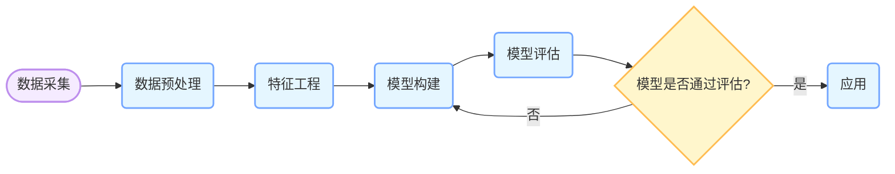

# 智能商业银行客户价值分析

> 关键词：智能商业银行、客户价值分析、数据挖掘、机器学习、客户细分、精准营销、价值评估

> 摘要：本文围绕智能商业银行客户价值分析展开，深入探讨其背景、核心概念、算法原理、数学模型等内容。首先介绍智能商业银行客户价值分析的目的、预期读者和文档结构，对相关术语进行详细解释。接着阐述核心概念及联系，包括客户价值的构成和分析架构，并通过 Mermaid 流程图展示其流程。然后讲解核心算法原理，用 Python 代码进行详细阐述。在数学模型部分，给出具体公式并举例说明。通过项目实战，从开发环境搭建到源代码实现与解读，详细介绍客户价值分析的实际操作。分析其实际应用场景，如精准营销、风险管理等。同时推荐学习资源、开发工具框架和相关论文著作。最后总结未来发展趋势与挑战，解答常见问题并提供扩展阅读与参考资料，旨在为智能商业银行客户价值分析提供全面、深入的技术指导。

## 1. 背景介绍 
### 1.1 目的和范围
在当今竞争激烈的金融市场环境下，智能商业银行面临着巨大的挑战和机遇。客户是商业银行最重要的资产之一，了解客户价值对于银行的发展至关重要。智能商业银行客户价值分析的目的在于通过对客户数据的深入挖掘和分析，全面了解客户的需求、行为和价值，从而为银行的市场营销、产品设计、风险管理等决策提供有力支持。

本文章的范围涵盖了智能商业银行客户价值分析的各个方面，包括核心概念、算法原理、数学模型、实际应用场景以及相关的工具和资源推荐等。通过系统的阐述，帮助读者全面理解和掌握智能商业银行客户价值分析的理论和实践方法。

### 1.2 预期读者
本文的预期读者包括智能商业银行的管理人员、市场营销人员、数据分析人员、风险管理人员等，以及对金融科技、数据挖掘和机器学习等领域感兴趣的研究人员和学生。对于银行管理人员，本文可以帮助他们更好地制定战略决策，提高银行的竞争力；对于市场营销人员，有助于他们开展精准营销活动，提高客户满意度和忠诚度；对于数据分析人员和研究人员，可提供深入的技术指导和研究思路；对于学生，则可以作为学习相关领域知识的参考资料。

### 1.3 文档结构概述
本文共分为十个部分。第一部分为背景介绍，主要阐述智能商业银行客户价值分析的目的、预期读者和文档结构概述，并对相关术语进行解释。第二部分介绍核心概念与联系，包括客户价值的构成和分析架构，同时通过 Mermaid 流程图展示其流程。第三部分讲解核心算法原理，用 Python 代码详细阐述客户价值分析中常用的算法。第四部分介绍数学模型和公式，给出具体的数学表达式并举例说明。第五部分通过项目实战，从开发环境搭建到源代码实现与解读，详细介绍客户价值分析的实际操作。第六部分分析智能商业银行客户价值分析的实际应用场景。第七部分推荐学习资源、开发工具框架和相关论文著作。第八部分总结未来发展趋势与挑战。第九部分为附录，解答常见问题。第十部分提供扩展阅读与参考资料。

### 1.4 术语表
#### 1.4.1 核心术语定义
- **智能商业银行**：是指利用现代信息技术，如人工智能、大数据、云计算等，实现业务智能化、自动化和数字化的商业银行。
- **客户价值**：是指客户为商业银行带来的收益和价值，包括当前价值和潜在价值。当前价值是指客户在过去一段时间内为银行带来的直接收益，如利息收入、手续费收入等；潜在价值是指客户未来可能为银行带来的收益，如客户的忠诚度、消费潜力等。
- **数据挖掘**：是指从大量的数据中提取有价值的信息和知识的过程，包括数据预处理、特征选择、模型构建、模型评估等步骤。
- **机器学习**：是一门多领域交叉学科，涉及概率论、统计学、逼近论、凸分析、算法复杂度理论等多门学科。它专门研究计算机怎样模拟或实现人类的学习行为，以获取新的知识或技能，重新组织已有的知识结构使之不断改善自身的性能。
- **客户细分**：是指根据客户的特征、行为、需求等因素，将客户划分为不同的群体，以便银行针对不同的客户群体采取不同的营销策略和服务措施。

#### 1.4.2 相关概念解释
- **精准营销**：是指在精准定位的基础上，依托现代信息技术手段建立个性化的顾客沟通服务体系，实现企业可度量的低成本扩张之路。通过客户价值分析，银行可以了解客户的需求和偏好，从而开展精准营销活动，提高营销效果。
- **风险管理**：是指如何在项目或者企业一个肯定有风险的环境里把风险可能造成的不良影响减至最低的管理过程。在智能商业银行中，客户价值分析可以帮助银行识别高风险客户，采取相应的风险管理措施，降低银行的风险。
- **客户忠诚度**：是指客户对银行产品或服务的信任和依赖程度，表现为客户在一定时间内持续选择银行的产品或服务，并且愿意向他人推荐该银行。客户忠诚度是客户价值的重要组成部分，提高客户忠诚度可以增加客户的潜在价值。

#### 1.4.3 缩略词列表
- **AI**：Artificial Intelligence，人工智能
- **BI**：Business Intelligence，商业智能
- **CRM**：Customer Relationship Management，客户关系管理
- **KPI**：Key Performance Indicator，关键绩效指标
- **RFM**：Recency, Frequency, Monetary，最近一次消费、消费频率、消费金额

## 2. 核心概念与联系 
### 2.1 客户价值的构成
客户价值主要由当前价值和潜在价值两部分构成。当前价值是客户已经为银行带来的实际收益，它可以通过客户的交易数据进行量化计算。例如，客户的存款利息收入、贷款利息收入、手续费收入等都是当前价值的具体体现。潜在价值则是客户未来可能为银行带来的收益，它受到多种因素的影响，如客户的年龄、职业、收入水平、消费习惯、忠诚度等。潜在价值的评估相对复杂，需要综合考虑多个因素，并运用数据挖掘和机器学习等技术进行预测。

### 2.2 客户价值分析架构
客户价值分析架构主要包括数据采集、数据预处理、特征工程、模型构建、模型评估和应用等环节。数据采集是指从银行的各种业务系统中收集客户的相关数据，如基本信息、交易记录、信用记录等。数据预处理是对采集到的数据进行清洗、转换和集成，以提高数据的质量和可用性。特征工程是从预处理后的数据中提取有价值的特征，用于模型的训练和预测。模型构建是选择合适的算法和模型，对客户价值进行建模和预测。模型评估是对构建好的模型进行评估和验证，以确保模型的准确性和可靠性。应用是将评估通过的模型应用到实际业务中，为银行的决策提供支持。

### 2.3 文本示意图
```plaintext
客户价值分析架构
|-- 数据采集
|   |-- 基本信息
|   |-- 交易记录
|   |-- 信用记录
|-- 数据预处理
|   |-- 数据清洗
|   |-- 数据转换
|   |-- 数据集成
|-- 特征工程
|   |-- 特征提取
|   |-- 特征选择
|-- 模型构建
|   |-- 选择算法
|   |-- 训练模型
|-- 模型评估
|   |-- 评估指标
|   |-- 模型验证
|-- 应用
|   |-- 市场营销
|   |-- 产品设计
|   |-- 风险管理
```

### 2.4 Mermaid 流程图


## 3. 核心算法原理 & 具体操作步骤 
### 3.1 RFM 模型算法原理
RFM 模型是一种常用的客户价值分析模型，它通过三个关键指标：最近一次消费（Recency）、消费频率（Frequency）和消费金额（Monetary）来衡量客户的价值。

- **最近一次消费（Recency）**：指客户上一次购买的时间距离现在的天数。最近一次消费时间越近，说明客户对产品或服务的需求越强烈，客户的活跃度越高。
- **消费频率（Frequency）**：指客户在一定时间内购买的次数。消费频率越高，说明客户对产品或服务的忠诚度越高，客户的价值越大。
- **消费金额（Monetary）**：指客户在一定时间内购买产品或服务的总金额。消费金额越高，说明客户的购买力越强，客户的价值越大。

### 3.2 RFM 模型具体操作步骤
1. **数据准备**：收集客户的交易数据，包括交易日期、交易金额等信息。
2. **计算 RFM 指标**：根据交易数据计算每个客户的最近一次消费、消费频率和消费金额。
3. **数据分箱**：将 RFM 指标进行分箱处理，将客户划分为不同的等级。例如，可以将每个指标划分为 5 个等级，分别用 1 - 5 表示，1 表示最低等级，5 表示最高等级。
4. **计算 RFM 得分**：将每个客户的 R、F、M 等级组合成一个 RFM 得分，例如，一个客户的 R 等级为 3，F 等级为 4，M 等级为 5，则该客户的 RFM 得分为 345。
5. **客户细分**：根据 RFM 得分将客户划分为不同的群体，例如，可以将客户划分为重要价值客户、重要保持客户、重要发展客户、重要挽留客户、一般价值客户、一般保持客户、一般发展客户、一般挽留客户等。

### 3.3 Python 代码实现
```python
import pandas as pd
import numpy as np

# 模拟交易数据
data = {
    'customer_id': [1, 1, 2, 2, 3, 3],
    'transaction_date': ['2023-01-01', '2023-02-01', '2023-01-15', '2023-03-01', '2023-02-10', '2023-03-20'],
    'transaction_amount': [100, 200, 150, 300, 250, 400]
}
df = pd.DataFrame(data)

# 将交易日期转换为日期类型
df['transaction_date'] = pd.to_datetime(df['transaction_date'])

# 计算最近日期
snapshot_date = df['transaction_date'].max() + pd.Timedelta(days=1)

# 计算 RFM 指标
rfm = df.groupby('customer_id').agg({
    'transaction_date': lambda x: (snapshot_date - x.max()).days,
    'customer_id': lambda x: len(x),
    'transaction_amount': lambda x: x.sum()
})

# 重命名列名
rfm.rename(columns={
    'transaction_date': 'Recency',
    'customer_id': 'Frequency',
    'transaction_amount': 'Monetary'
}, inplace=True)

# 数据分箱
rfm['R'] = pd.qcut(rfm['Recency'], q=5, labels=[5, 4, 3, 2, 1])
rfm['F'] = pd.qcut(rfm['Frequency'], q=5, labels=[1, 2, 3, 4, 5])
rfm['M'] = pd.qcut(rfm['Monetary'], q=5, labels=[1, 2, 3, 4, 5])

# 计算 RFM 得分
rfm['RFM_Score'] = rfm['R'].astype(str) + rfm['F'].astype(str) + rfm['M'].astype(str)

# 客户细分
def segment_customer(rfm_score):
    if rfm_score[0] in ['4', '5'] and rfm_score[1] in ['4', '5'] and rfm_score[2] in ['4', '5']:
        return '重要价值客户'
    elif rfm_score[0] in ['3', '4', '5'] and rfm_score[1] in ['3', '4', '5'] and rfm_score[2] in ['3', '4', '5']:
        return '重要保持客户'
    elif rfm_score[0] in ['2', '3'] and rfm_score[1] in ['2', '3'] and rfm_score[2] in ['2', '3']:
        return '一般价值客户'
    else:
        return '一般挽留客户'

rfm['Segment'] = rfm['RFM_Score'].apply(segment_customer)

print(rfm)
```

### 3.4 代码解释
1. **数据准备**：使用 `pandas` 库创建一个模拟的交易数据集，包含客户 ID、交易日期和交易金额。
2. **计算 RFM 指标**：使用 `groupby` 方法按客户 ID 分组，计算每个客户的最近一次消费、消费频率和消费金额。
3. **数据分箱**：使用 `pd.qcut` 方法将 RFM 指标进行分箱处理，将客户划分为 5 个等级。
4. **计算 RFM 得分**：将每个客户的 R、F、M 等级组合成一个 RFM 得分。
5. **客户细分**：定义一个函数 `segment_customer`，根据 RFM 得分将客户划分为不同的群体。

## 4. 数学模型和公式 & 详细讲解 & 举例说明 
### 4.1 RFM 模型数学公式
RFM 模型主要通过对最近一次消费（R）、消费频率（F）和消费金额（M）三个指标进行量化和分析，来评估客户的价值。在实际应用中，通常会对这三个指标进行标准化处理，以消除不同指标之间的量纲影响。

- **标准化处理公式**：
设 $x_i$ 为原始指标值，$\overline{x}$ 为该指标的均值，$s$ 为该指标的标准差，则标准化后的指标值 $z_i$ 计算公式为：
$$z_i = \frac{x_i - \overline{x}}{s}$$

- **RFM 综合得分公式**：
设 $w_R$、$w_F$、$w_M$ 分别为 R、F、M 三个指标的权重，且 $w_R + w_F + w_M = 1$，则 RFM 综合得分 $S$ 计算公式为：
$$S = w_R \times z_R + w_F \times z_F + w_M \times z_M$$

### 4.2 详细讲解
- **标准化处理**：标准化处理的目的是将不同指标的取值范围统一到相同的尺度上，以便进行比较和计算。通过减去均值并除以标准差，可以使每个指标的均值为 0，标准差为 1，从而消除量纲的影响。
- **权重设置**：权重的设置反映了不同指标在评估客户价值时的重要程度。例如，如果银行更注重客户的近期活跃度，则可以适当提高 R 指标的权重；如果更注重客户的消费能力，则可以提高 M 指标的权重。权重的设置需要根据银行的业务需求和战略目标进行调整。

### 4.3 举例说明
假设某银行有 5 个客户，他们的 R、F、M 指标原始值如下表所示：

| 客户 ID | 最近一次消费（R）（天） | 消费频率（F）（次） | 消费金额（M）（元） |
| ---- | ---- | ---- | ---- |
| 1 | 10 | 5 | 1000 |
| 2 | 20 | 3 | 800 |
| 3 | 30 | 7 | 1200 |
| 4 | 40 | 2 | 600 |
| 5 | 50 | 4 | 900 |

1. **计算均值和标准差**：
    - 对于 R 指标：
$\overline{R} = \frac{10 + 20 + 30 + 40 + 50}{5} = 30$
$s_R = \sqrt{\frac{(10 - 30)^2 + (20 - 30)^2 + (30 - 30)^2 + (40 - 30)^2 + (50 - 30)^2}{5}} = 14.14$
    - 对于 F 指标：
$\overline{F} = \frac{5 + 3 + 7 + 2 + 4}{5} = 4.2$
$s_F = \sqrt{\frac{(5 - 4.2)^2 + (3 - 4.2)^2 + (7 - 4.2)^2 + (2 - 4.2)^2 + (4 - 4.2)^2}{5}} = 1.72$
    - 对于 M 指标：
$\overline{M} = \frac{1000 + 800 + 1200 + 600 + 900}{5} = 900$
$s_M = \sqrt{\frac{(1000 - 900)^2 + (800 - 900)^2 + (1200 - 900)^2 + (600 - 900)^2 + (900 - 900)^2}{5}} = 158.11$

2. **标准化处理**：
    - 对于客户 1 的 R 指标：
$z_{R1} = \frac{10 - 30}{14.14} = -1.41$
    - 对于客户 1 的 F 指标：
$z_{F1} = \frac{5 - 4.2}{1.72} = 0.47$
    - 对于客户 1 的 M 指标：
$z_{M1} = \frac{1000 - 900}{158.11} = 0.63$

3. **设置权重并计算综合得分**：
假设 $w_R = 0.3$，$w_F = 0.3$，$w_M = 0.4$，则客户 1 的 RFM 综合得分：
$S_1 = 0.3 \times (-1.41) + 0.3 \times 0.47 + 0.4 \times 0.63 = -0.423 + 0.141 + 0.252 = -0.03$

同理，可以计算出其他客户的 RFM 综合得分，根据得分对客户进行排序和细分。

## 5. 项目实战：代码实际案例和详细解释说明 
### 5.1  开发环境搭建
#### 5.1.1 安装 Python
首先，需要安装 Python 环境。可以从 Python 官方网站（https://www.python.org/downloads/） 下载适合自己操作系统的 Python 安装包，按照安装向导进行安装。建议安装 Python 3.7 及以上版本。

#### 5.1.2 安装必要的库
在安装好 Python 后，需要安装一些必要的库，如 `pandas`、`numpy`、`scikit-learn` 等。可以使用 `pip` 命令进行安装：
```sh
pip install pandas numpy scikit-learn
```

#### 5.1.3 选择开发工具
可以选择使用集成开发环境（IDE），如 PyCharm、Jupyter Notebook 等，也可以使用文本编辑器，如 Visual Studio Code 等。这里以 Jupyter Notebook 为例，安装 Jupyter Notebook：
```sh
pip install jupyter
```
安装完成后，在命令行中输入 `jupyter notebook` 启动 Jupyter Notebook 服务，在浏览器中打开相应的链接即可使用。

### 5.2  源代码详细实现和代码解读
#### 5.2.1 数据加载和预处理
```python
import pandas as pd
import numpy as np

# 加载数据
data = pd.read_csv('customer_transaction_data.csv')

# 查看数据基本信息
print('数据基本信息：')
data.info()

# 查看数据集行数和列数
rows, columns = data.shape

if rows < 1000:
    # 小样本数据（行数少于1000）查看全量数据信息
    print('数据全部内容信息：')
    print(data.to_csv(sep='\t', na_rep='nan'))
else:
    # 大样本数据查看数据前几行信息
    print('数据前几行内容信息：')
    print(data.head().to_csv(sep='\t', na_rep='nan'))
```
**代码解读**：
- 首先使用 `pandas` 库的 `read_csv` 函数加载客户交易数据文件 `customer_transaction_data.csv`。
- 然后使用 `info` 方法查看数据的基本信息，包括数据的行数、列数、列名、数据类型等。
- 接着根据数据的行数判断是小样本数据还是大样本数据，对于小样本数据（行数少于 1000），打印全量数据信息；对于大样本数据，打印数据的前几行信息。

#### 5.2.2 数据转换和特征提取
```python
# 将交易日期转换为日期类型
data['transaction_date'] = pd.to_datetime(data['transaction_date'])

# 计算最近日期
snapshot_date = data['transaction_date'].max() + pd.Timedelta(days=1)

# 计算 RFM 指标
rfm = data.groupby('customer_id').agg({
    'transaction_date': lambda x: (snapshot_date - x.max()).days,
    'customer_id': lambda x: len(x),
    'transaction_amount': lambda x: x.sum()
})

# 重命名列名
rfm.rename(columns={
    'transaction_date': 'Recency',
    'customer_id': 'Frequency',
    'transaction_amount': 'Monetary'
}, inplace=True)
```
**代码解读**：
- 使用 `pd.to_datetime` 函数将交易日期列转换为日期类型。
- 计算最近日期 `snapshot_date`，用于计算最近一次消费指标。
- 使用 `groupby` 方法按客户 ID 分组，计算每个客户的最近一次消费、消费频率和消费金额。
- 使用 `rename` 方法重命名列名，方便后续使用。

#### 5.2.3 数据分箱和 RFM 得分计算
```python
# 数据分箱
rfm['R'] = pd.qcut(rfm['Recency'], q=5, labels=[5, 4, 3, 2, 1])
rfm['F'] = pd.qcut(rfm['Frequency'], q=5, labels=[1, 2, 3, 4, 5])
rfm['M'] = pd.qcut(rfm['Monetary'], q=5, labels=[1, 2, 3, 4, 5])

# 计算 RFM 得分
rfm['RFM_Score'] = rfm['R'].astype(str) + rfm['F'].astype(str) + rfm['M'].astype(str)
```
**代码解读**：
- 使用 `pd.qcut` 方法将 RFM 指标进行分箱处理，将客户划分为 5 个等级。
- 将每个客户的 R、F、M 等级组合成一个 RFM 得分。

#### 5.2.4 客户细分
```python
# 客户细分
def segment_customer(rfm_score):
    if rfm_score[0] in ['4', '5'] and rfm_score[1] in ['4', '5'] and rfm_score[2] in ['4', '5']:
        return '重要价值客户'
    elif rfm_score[0] in ['3', '4', '5'] and rfm_score[1] in ['3', '4', '5'] and rfm_score[2] in ['3', '4', '5']:
        return '重要保持客户'
    elif rfm_score[0] in ['2', '3'] and rfm_score[1] in ['2', '3'] and rfm_score[2] in ['2', '3']:
        return '一般价值客户'
    else:
        return '一般挽留客户'

rfm['Segment'] = rfm['RFM_Score'].apply(segment_customer)
```
**代码解读**：
- 定义一个函数 `segment_customer`，根据 RFM 得分将客户划分为不同的群体。
- 使用 `apply` 方法将该函数应用到 RFM 得分列，生成客户细分结果列。

### 5.3  代码解读与分析
#### 5.3.1 数据预处理的重要性
数据预处理是客户价值分析的重要步骤，它可以提高数据的质量和可用性，减少噪声和异常值的影响，从而提高模型的准确性和可靠性。在本项目中，将交易日期转换为日期类型，方便后续计算最近一次消费指标；对数据进行分箱处理，将客户划分为不同的等级，便于进行客户细分。

#### 5.3.2 RFM 模型的优点和局限性
RFM 模型的优点在于简单易懂、易于实现，能够快速有效地对客户进行细分和价值评估。通过 R、F、M 三个指标，可以直观地了解客户的消费行为和价值。然而，RFM 模型也存在一定的局限性，它只考虑了客户的交易数据，忽略了客户的其他信息，如客户的基本信息、偏好信息等；同时，RFM 模型的权重设置是固定的，不能根据不同的业务需求和市场环境进行动态调整。

#### 5.3.3 客户细分的意义
客户细分可以帮助银行更好地了解客户的需求和行为，从而制定个性化的营销策略和服务措施。通过将客户划分为不同的群体，银行可以针对不同的客户群体采取不同的营销活动，提高营销效果；同时，也可以为不同的客户群体提供个性化的服务，提高客户满意度和忠诚度。

## 6. 实际应用场景 
### 6.1 精准营销
通过客户价值分析，银行可以了解客户的需求和偏好，从而开展精准营销活动。例如，对于重要价值客户，可以提供专属的理财产品、高端的金融服务和优惠的利率政策，以提高客户的满意度和忠诚度；对于一般挽留客户，可以通过发送优惠券、礼品等方式，吸引客户继续使用银行的产品和服务。

### 6.2 产品设计
客户价值分析可以为银行的产品设计提供依据。通过了解客户的需求和消费习惯，银行可以开发出更符合客户需求的金融产品。例如，对于年轻客户群体，可以推出个性化的信用卡产品，提供积分兑换、消费返现等优惠活动；对于高净值客户群体，可以设计专属的财富管理产品，提供定制化的投资方案。

### 6.3 风险管理
客户价值分析可以帮助银行识别高风险客户，采取相应的风险管理措施。例如，对于信用评分较低、消费行为异常的客户，银行可以加强对其账户的监控，提高贷款审批的门槛，降低信贷风险。同时，通过对客户价值的动态监测，银行可以及时发现客户的风险变化，采取相应的措施进行防范和化解。

### 6.4 客户关系管理
客户价值分析可以为银行的客户关系管理提供支持。通过了解客户的价值和需求，银行可以更好地维护客户关系，提高客户的满意度和忠诚度。例如，对于重要价值客户，银行可以安排专属的客户经理，提供一对一的服务；对于一般客户，可以通过定期发送问候短信、举办客户活动等方式，增强客户的粘性。

## 7. 工具和资源推荐
### 7.1 学习资源推荐
#### 7.1.1 书籍推荐
- 《数据挖掘：概念与技术》：这本书全面介绍了数据挖掘的基本概念、算法和应用，是数据挖掘领域的经典教材。
- 《Python 数据分析实战》：本书通过实际案例介绍了如何使用 Python 进行数据分析，包括数据清洗、数据可视化、机器学习等内容，适合初学者学习。
- 《客户关系管理：理论与实践》：该书系统地阐述了客户关系管理的理论和方法，结合实际案例介绍了如何在企业中实施客户关系管理，对智能商业银行客户价值分析有很好的指导作用。

#### 7.1.2 在线课程
- Coursera 上的 “Data Science Specialization”：该课程由多所知名大学的教授授课，涵盖了数据科学的各个方面，包括数据挖掘、机器学习、数据分析等内容。
- edX 上的 “Python for Data Science and AI”：这门课程主要介绍了如何使用 Python 进行数据科学和人工智能方面的开发，包括数据处理、数据分析、机器学习等内容。
- 中国大学 MOOC 上的 “金融科技前沿：技术驱动的金融创新”：该课程介绍了金融科技的前沿技术和应用，包括人工智能、大数据、区块链等在金融领域的应用，对智能商业银行客户价值分析有一定的参考价值。

#### 7.1.3 技术博客和网站
- Kaggle（https://www.kaggle.com/）：是一个数据科学和机器学习的竞赛平台，上面有很多优秀的数据科学项目和案例，可以学习到不同的数据分析和建模方法。
- Towards Data Science（https://towardsdatascience.com/）：是一个专注于数据科学和机器学习的技术博客，上面有很多高质量的技术文章和教程，可以帮助读者深入了解相关领域的知识。
- 金融界（https://www.jrj.com.cn/）：是一个金融资讯网站，上面有很多关于金融行业的新闻和分析，对了解智能商业银行的发展趋势和业务需求有一定的帮助。

### 7.2 开发工具框架推荐
#### 7.2.1 IDE和编辑器
- PyCharm：是一款专门为 Python 开发设计的集成开发环境，具有代码编辑、调试、版本控制等功能，适合专业的 Python 开发者使用。
- Jupyter Notebook：是一个交互式的开发环境，可以在浏览器中编写和运行 Python 代码，同时还可以插入文本、图片等内容，方便进行数据分析和可视化展示。
- Visual Studio Code：是一款轻量级的代码编辑器，支持多种编程语言，具有丰富的插件和扩展功能，可以满足不同的开发需求。

#### 7.2.2 调试和性能分析工具
- PDB：是 Python 自带的调试工具，可以在代码中设置断点，逐步执行代码，查看变量的值和程序的执行流程，帮助开发者调试代码。
- cProfile：是 Python 自带的性能分析工具，可以分析代码的执行时间和函数调用次数，找出代码中的性能瓶颈，帮助开发者优化代码。
- Py-Spy：是一个跨平台的 Python 性能分析工具，可以实时监测 Python 程序的性能，生成火焰图，直观地展示代码的性能瓶颈。

#### 7.2.3 相关框架和库
- Pandas：是一个用于数据处理和分析的 Python 库，提供了高效的数据结构和数据操作方法，如数据读取、数据清洗、数据转换等。
- NumPy：是一个用于科学计算的 Python 库，提供了高效的多维数组对象和数学函数，如数组运算、线性代数、随机数生成等。
- Scikit-learn：是一个用于机器学习的 Python 库，提供了丰富的机器学习算法和工具，如分类、回归、聚类、降维等。

### 7.3 相关论文著作推荐
#### 7.3.1 经典论文
- “Data Mining: A Tutorial-Based Primer”：这篇论文介绍了数据挖掘的基本概念、算法和应用，是数据挖掘领域的经典论文之一。
- “Customer Relationship Management: A Strategic Imperative for the 21st Century”：该论文阐述了客户关系管理的重要性和战略意义，对智能商业银行客户价值分析有重要的指导作用。
- “The RFM Model: A Powerful Tool for Customer Segmentation”：这篇论文详细介绍了 RFM 模型的原理和应用，是 RFM 模型领域的经典论文。

#### 7.3.2 最新研究成果
- 关注顶级学术期刊，如《Journal of Financial Economics》、《Management Science》、《Journal of Marketing》等，这些期刊上发表了很多关于金融科技、客户关系管理、数据挖掘等领域的最新研究成果。
- 参加相关的学术会议，如 SIGKDD、ICDM 等，这些会议上会展示最新的研究成果和技术进展。

#### 7.3.3 应用案例分析
- 各大商业银行的年报和研究报告：可以从这些资料中了解到商业银行在客户价值分析方面的实践经验和应用案例。
- 行业研究机构的报告：如艾瑞咨询、易观智库等发布的报告，对智能商业银行客户价值分析的市场趋势和应用案例有详细的分析。

## 8. 总结：未来发展趋势与挑战
### 8.1 未来发展趋势
#### 8.1.1 智能化和自动化
随着人工智能技术的不断发展，智能商业银行客户价值分析将越来越智能化和自动化。银行将利用人工智能算法，如深度学习、强化学习等，自动分析客户数据，挖掘客户价值，提高分析效率和准确性。同时，银行还将实现客户价值分析的自动化流程，减少人工干预，提高工作效率。

#### 8.1.2 多维度和全方位
未来的客户价值分析将不仅仅局限于客户的交易数据，还将综合考虑客户的基本信息、社交信息、行为信息等多维度数据，实现全方位的客户价值评估。通过多维度和全方位的分析，银行可以更深入地了解客户的需求和行为，为客户提供更加个性化的服务。

#### 8.1.3 实时性和动态性
客户的价值是动态变化的，因此未来的客户价值分析需要具备实时性和动态性。银行将利用实时数据处理技术，实时监测客户的行为和交易数据，及时调整客户的价值评估结果，为银行的决策提供实时支持。

#### 8.1.4 与其他技术的融合
智能商业银行客户价值分析将与区块链、物联网、云计算等其他技术进行深度融合。例如，利用区块链技术保证客户数据的安全性和可信度；利用物联网技术收集客户的行为数据；利用云计算技术提供强大的计算能力和存储能力。

### 8.2 挑战
#### 8.2.1 数据质量和安全问题
客户价值分析需要大量的客户数据，数据的质量和安全直接影响分析结果的准确性和可靠性。银行需要加强数据质量管理，确保数据的完整性、准确性和一致性；同时，还需要加强数据安全保护，防止客户数据泄露和滥用。

#### 8.2.2 算法复杂度和可解释性
随着人工智能算法的不断发展，算法的复杂度越来越高，这给算法的解释和理解带来了困难。在智能商业银行客户价值分析中，需要确保算法的可解释性，以便银行管理人员和业务人员能够理解分析结果，并做出合理的决策。

#### 8.2.3 人才短缺问题
智能商业银行客户价值分析需要既懂金融业务又懂数据分析和人工智能技术的复合型人才。目前，这类人才相对短缺，银行需要加强人才培养和引进，提高自身的技术水平和创新能力。

#### 8.2.4 法律法规和监管要求
智能商业银行客户价值分析涉及到客户的个人信息和隐私，需要遵守相关的法律法规和监管要求。银行需要加强合规管理，确保客户价值分析活动合法合规。

## 9. 附录：常见问题与解答
### 9.1 数据采集过程中遇到数据缺失怎么办？
在数据采集过程中遇到数据缺失是比较常见的问题。可以采用以下方法进行处理：
- **删除缺失值**：如果缺失值的比例较小，可以直接删除包含缺失值的记录。
- **填充缺失值**：可以使用均值、中位数、众数等统计量填充缺失值；也可以使用机器学习算法，如回归、决策树等，根据其他特征预测缺失值。

### 9.2 RFM 模型的权重如何设置？
RFM 模型的权重设置需要根据银行的业务需求和战略目标进行调整。一般来说，如果银行更注重客户的近期活跃度，可以适当提高 R 指标的权重；如果更注重客户的消费能力，可以提高 M 指标的权重；如果更注重客户的忠诚度，可以提高 F 指标的权重。权重的设置可以通过经验法、实验法等方法进行确定。

### 9.3 如何评估客户价值分析模型的准确性？
可以使用以下方法评估客户价值分析模型的准确性：
- **混淆矩阵**：用于评估分类模型的准确性，通过计算真正率、假正率、真负率、假负率等指标，评估模型的分类效果。
- **准确率、召回率、F1 值**：这些指标是常用的分类模型评估指标，可以综合评估模型的准确性和召回率。
- **均方误差、平均绝对误差**：这些指标是常用的回归模型评估指标，可以评估模型的预测误差。

### 9.4 客户价值分析结果如何应用到实际业务中？
客户价值分析结果可以应用到银行的多个业务领域，如精准营销、产品设计、风险管理、客户关系管理等。例如，在精准营销中，可以根据客户的价值和需求，制定个性化的营销策略和服务措施；在产品设计中，可以根据客户的需求和消费习惯，开发出更符合客户需求的金融产品；在风险管理中，可以根据客户的信用评分和风险等级，采取相应的风险管理措施。

## 10. 扩展阅读 & 参考资料
### 10.1 扩展阅读
- 《金融科技时代的商业银行转型与创新》
- 《大数据时代的客户关系管理》
- 《人工智能在金融领域的应用》

### 10.2 参考资料
- 各商业银行的官方网站和年报
- 金融行业研究机构的报告和研究成果
- 相关的学术论文和技术博客